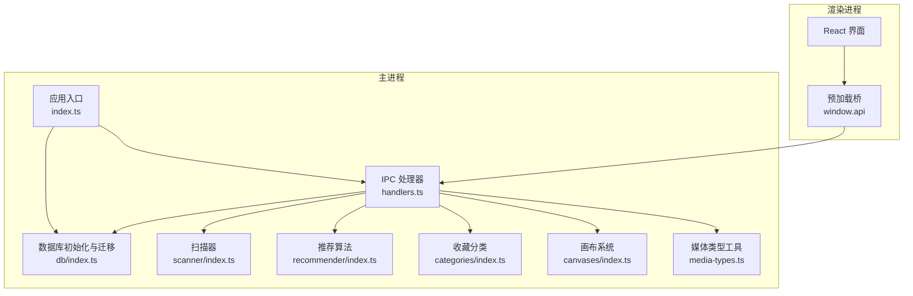
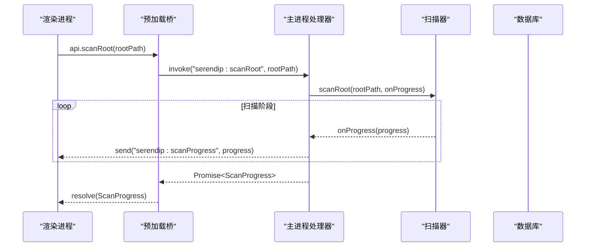
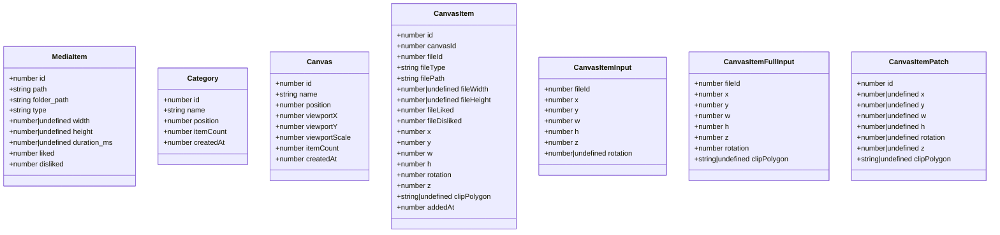
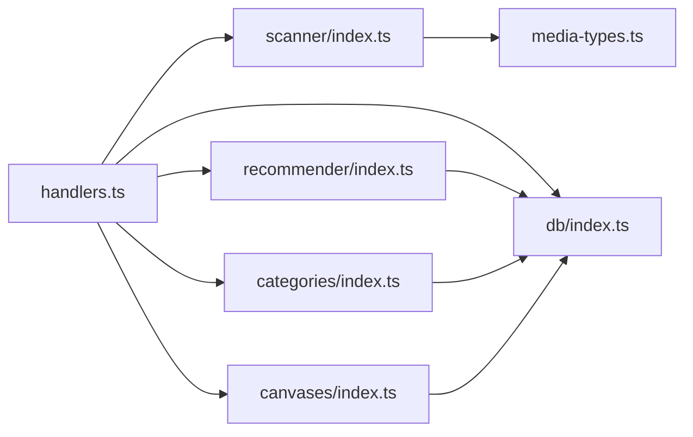

# API 参考

<cite>
**本文引用的文件**   
- [src/main/ipc/contract.ts](file://src/main/ipc/contract.ts)
- [src/main/ipc/handlers.ts](file://src/main/ipc/handlers.ts)
- [src/preload/index.ts](file://src/preload/index.ts)
- [src/preload/index.d.ts](file://src/preload/index.d.ts)
- [src/main/index.ts](file://src/main/index.ts)
- [src/main/db/index.ts](file://src/main/db/index.ts)
- [src/main/scanner/index.ts](file://src/main/scanner/index.ts)
- [src/main/recommender/index.ts](file://src/main/recommender/index.ts)
- [src/main/categories/index.ts](file://src/main/categories/index.ts)
- [src/main/canvases/index.ts](file://src/main/canvases/index.ts)
- [src/main/media-types.ts](file://src/main/media-types.ts)
- [README.md](file://README.md)
</cite>

## 目录
1. [简介](#简介)
2. [项目结构](#项目结构)
3. [核心组件](#核心组件)
4. [架构总览](#架构总览)
5. [详细接口规范](#详细接口规范)
6. [依赖关系分析](#依赖关系分析)
7. [性能与并发特性](#性能与并发特性)
8. [错误处理模式与最佳实践](#错误处理模式与最佳实践)
9. [版本兼容性与迁移指南](#版本兼容性与迁移指南)
10. [测试方法与调试技巧](#测试方法与调试技巧)
11. [结论](#结论)

## 简介
本文件为 Serendip 应用的 IPC API 参考，覆盖主进程暴露给渲染进程的所有能力：库管理、推荐与浏览、收藏分类、画布操作、窗口装饰等。文档包含方法签名、参数与返回值定义、错误码说明、使用示例路径、错误处理模式、性能注意事项、版本迁移策略以及测试与调试建议，便于第三方集成与插件开发。

## 项目结构
Serendip 基于 Electron + Vite 构建，采用“主进程（业务逻辑）—预加载桥（类型安全暴露）—渲染进程（UI）”三层架构。IPC 契约集中在 contract.ts，处理器在 handlers.ts，预加载层在 preload/index.ts 中统一封装并注入 window.api。

图表来源
- [src/main/index.ts:1-134](file://src/main/index.ts#L1-L134)
- [src/main/ipc/handlers.ts:1-292](file://src/main/ipc/handlers.ts#L1-L292)
- [src/main/db/index.ts:1-190](file://src/main/db/index.ts#L1-L190)
- [src/main/scanner/index.ts:1-323](file://src/main/scanner/index.ts#L1-L323)
- [src/main/recommender/index.ts:1-518](file://src/main/recommender/index.ts#L1-L518)
- [src/main/categories/index.ts:1-166](file://src/main/categories/index.ts#L1-L166)
- [src/main/canvases/index.ts:1-320](file://src/main/canvases/index.ts#L1-L320)
- [src/main/media-types.ts:1-38](file://src/main/media-types.ts#L1-L38)

章节来源
- [README.md:1-66](file://README.md#L1-L66)

## 核心组件
- IPC 契约与通道名：集中定义所有方法名、参数与返回类型，以及 IPC 通道常量。
- 预加载桥：将主进程能力以类型安全的方式暴露到渲染进程 window.api。
- 数据库：基于 better-sqlite3，提供 WAL 模式、外键约束与自动迁移。
- 扫描器：增量扫描媒体根目录，推送进度事件，重建文件夹统计。
- 推荐系统：两级加权抽样（文件夹级 + 文件级），支持 prefer/balanced/explore 三种模式与分层推荐。
- 收藏分类：CRUD、排序、批量增删、查询文件所属分类。
- 画布：画布与项目的 CRUD、批量更新、视口持久化、尺寸推断与原始变换保真写入。

章节来源
- [src/main/ipc/contract.ts:1-130](file://src/main/ipc/contract.ts#L1-L130)
- [src/preload/index.ts:1-104](file://src/preload/index.ts#L1-L104)
- [src/main/db/index.ts:1-190](file://src/main/db/index.ts#L1-L190)
- [src/main/scanner/index.ts:1-323](file://src/main/scanner/index.ts#L1-L323)
- [src/main/recommender/index.ts:1-518](file://src/main/recommender/index.ts#L1-L518)
- [src/main/categories/index.ts:1-166](file://src/main/categories/index.ts#L1-L166)
- [src/main/canvases/index.ts:1-320](file://src/main/canvases/index.ts#L1-L320)

## 架构总览
IPC 调用流程如下：渲染进程通过 window.api 调用方法，预加载桥转发至主进程 ipcMain.handle，处理器执行业务逻辑并返回结果或抛出错误。部分异步过程（如扫描）通过 IPC 事件推送进度。

图表来源
- [src/preload/index.ts:10-11](file://src/preload/index.ts#L10-L11)
- [src/main/ipc/handlers.ts:52-60](file://src/main/ipc/handlers.ts#L52-L60)
- [src/main/scanner/index.ts:36-239](file://src/main/scanner/index.ts#L36-L239)

## 详细接口规范

### 通用约定
- 调用方式：window.api.<method>(...args)
- 返回值：Promise<T>，成功时解析为 T；失败时抛出 Error。
- 错误对象：Error.message 为人类可读信息；必要时可携带 code 字段（例如 SQLite 唯一约束冲突）。
- 事件订阅：onScanProgress(callback) 返回取消函数，用于移除监听。

章节来源
- [src/main/ipc/contract.ts:12-82](file://src/main/ipc/contract.ts#L12-L82)
- [src/preload/index.ts:78-86](file://src/preload/index.ts#L78-L86)

---

### 库管理 API

- selectRootDirectory(): Promise<string | null>
  - 描述：弹出目录选择对话框，返回所选根目录路径或 null。
  - 错误：用户取消返回 null；无其他异常。
  - 示例路径：[src/preload/index.ts:10](file://src/preload/index.ts#L10), [src/main/ipc/handlers.ts:42-49](file://src/main/ipc/handlers.ts#L42-L49)

- scanRoot(rootPath: string): Promise<ScanProgress>
  - 描述：对指定根目录进行增量扫描，返回最终进度状态。期间会触发 SCAN_PROGRESS 事件。
  - 参数：rootPath 字符串。
  - 返回：ScanProgress 对象，phase 为 done 表示完成。
  - 事件：onScanProgress(progress) 推送 walking/diffing/inserting/done 阶段。
  - 错误：文件系统访问异常会被忽略或记录；若根路径未设置，某些查询可能返回空集。
  - 示例路径：[src/preload/index.ts:11](file://src/preload/index.ts#L11), [src/main/ipc/handlers.ts:52-60](file://src/main/ipc/handlers.ts#L52-L60), [src/main/scanner/index.ts:36-239](file://src/main/scanner/index.ts#L36-L239)

- getCurrentRoot(): Promise<string | null>
  - 描述：读取当前设置的媒体根目录。
  - 返回：路径字符串或 null。
  - 示例路径：[src/preload/index.ts:12](file://src/preload/index.ts#L12), [src/main/ipc/handlers.ts:63-69](file://src/main/ipc/handlers.ts#L63-L69)

- getStats(): Promise<{ totalFiles: number; totalFolders: number; liked: number }>
  - 描述：统计媒体文件数、文件夹数、喜欢数量。
  - 示例路径：[src/preload/index.ts:13](file://src/preload/index.ts#L13), [src/main/ipc/handlers.ts:72-81](file://src/main/ipc/handlers.ts#L72-L81)

章节来源
- [src/main/ipc/contract.ts:14-18](file://src/main/ipc/contract.ts#L14-L18)
- [src/main/ipc/handlers.ts:42-81](file://src/main/ipc/handlers.ts#L42-L81)
- [src/main/scanner/index.ts:8-16](file://src/main/scanner/index.ts#L8-L16)

---

### 推荐与浏览 API

- getRecommendations(count: number, mode: ExploreMode, onlyUnrated?: boolean, scopePath?: string): Promise<MediaItem[]>
  - 描述：按模式抽取推荐内容。mode 可为 prefer/balanced/explore。onlyUnrated 仅返回未评级项。scopePath 限定范围（必须在 rootPath 之下）。
  - 返回：MediaItem[]，包含 id/path/folder_path/type/宽高/时长/liked/disliked。
  - 行为：更新 last_shown_at 与 shown_count。
  - 示例路径：[src/preload/index.ts:15-16](file://src/preload/index.ts#L15-L16), [src/main/ipc/handlers.ts:84-86](file://src/main/ipc/handlers.ts#L84-L86), [src/main/recommender/index.ts:57-149](file://src/main/recommender/index.ts#L57-L149)

- getHierarchicalRecommendations(folderPath: string, rootPath: string, count: number, mode: ExploreMode): Promise<MediaItem[]>
  - 描述：以 folderPath 为锚点，向上父链分层采样，合并后打乱顺序返回。
  - 示例路径：[src/preload/index.ts:17-18](file://src/preload/index.ts#L17-L18), [src/main/ipc/handlers.ts:89-91](file://src/main/ipc/handlers.ts#L89-L91), [src/main/recommender/index.ts:155-206](file://src/main/recommender/index.ts#L155-L206)

- setLiked(fileId: number, liked: boolean): Promise<void>
- setDisliked(fileId: number, disliked: boolean): Promise<void>
  - 描述：标记单个文件的喜欢/不感兴趣。
  - 示例路径：[src/preload/index.ts:19-22](file://src/preload/index.ts#L19-L22), [src/main/ipc/handlers.ts:94-103](file://src/main/ipc/handlers.ts#L94-L103)

- setLikedBatch(fileIds: number[], liked: boolean): Promise<void>
- setDislikedBatch(fileIds: number[], disliked: boolean): Promise<void>
  - 描述：批量设置喜欢/不感兴趣，使用事务批写提升性能。
  - 示例路径：[src/preload/index.ts:23-26](file://src/preload/index.ts#L23-L26), [src/main/ipc/handlers.ts:106-125](file://src/main/ipc/handlers.ts#L106-L125)

- listLiked(): Promise<MediaItem[]>
  - 描述：列出所有 liked=1 且未失效的文件（在当前 rootPath 下），按 id 倒序。
  - 示例路径：[src/preload/index.ts:27](file://src/preload/index.ts#L27), [src/main/ipc/handlers.ts:128-146](file://src/main/ipc/handlers.ts#L128-L146)

- markUnavailable(fileId: number, reason: string): Promise<void>
  - 描述：标记文件不可用（缩略图生成失败/文件已删除/损坏），附带原因。
  - 示例路径：[src/preload/index.ts:28-29](file://src/preload/index.ts#L28-L29), [src/main/ipc/handlers.ts:149-154](file://src/main/ipc/handlers.ts#L149-L154)

- revealInFolder(fileId: number): Promise<void>
  - 描述：在系统资源管理器中显示该文件所在目录；若文件不存在则标记 unavailable。
  - 示例路径：[src/preload/index.ts:30](file://src/preload/index.ts#L30), [src/main/ipc/handlers.ts:157-171](file://src/main/ipc/handlers.ts#L157-L171)

- openFile(fileId: number): Promise<void>
  - 描述：用系统默认应用打开文件。
  - 示例路径：[src/preload/index.ts:31](file://src/preload/index.ts#L31), [src/main/ipc/handlers.ts:174-181](file://src/main/ipc/handlers.ts#L174-L181)

- openFolder(folderPath: string): Promise<void>
  - 描述：用系统默认应用打开目录。
  - 示例路径：[src/preload/index.ts:32](file://src/preload/index.ts#L32), [src/main/ipc/handlers.ts:183-185](file://src/main/ipc/handlers.ts#L183-L185)

章节来源
- [src/main/ipc/contract.ts:20-36](file://src/main/ipc/contract.ts#L20-L36)
- [src/main/ipc/handlers.ts:84-185](file://src/main/ipc/handlers.ts#L84-L185)
- [src/main/recommender/index.ts:17-29](file://src/main/recommender/index.ts#L17-L29)

---

### 收藏分类 API

- listCategories(): Promise<Category[]>
  - 描述：按 position 升序列出分类，附带 itemCount。
  - 示例路径：[src/preload/index.ts:34](file://src/preload/index.ts#L34), [src/main/ipc/handlers.ts:188](file://src/main/ipc/handlers.ts#L188), [src/main/categories/index.ts:21-32](file://src/main/categories/index.ts#L21-L32)

- createCategory(name: string): Promise<number>
  - 描述：创建分类，返回新 id；名称重复抛错。
  - 错误：分类名重复 → Error.message 含“分类名已存在”。
  - 示例路径：[src/preload/index.ts:35](file://src/preload/index.ts#L35), [src/main/ipc/handlers.ts:189](file://src/main/ipc/handlers.ts#L189), [src/main/categories/index.ts:35-57](file://src/main/categories/index.ts#L35-L57)

- renameCategory(id: number, newName: string): Promise<void>
  - 描述：重命名分类；名称重复或不存在抛错。
  - 错误：不存在 → “分类不存在”；重复 → “分类名已存在”。
  - 示例路径：[src/preload/index.ts:36-37](file://src/preload/index.ts#L36-L37), [src/main/ipc/handlers.ts:190-192](file://src/main/ipc/handlers.ts#L190-L192), [src/main/categories/index.ts:60-76](file://src/main/categories/index.ts#L60-L76)

- deleteCategory(id: number): Promise<void>
  - 描述：删除分类（关联级联清除）。
  - 示例路径：[src/preload/index.ts:38](file://src/preload/index.ts#L38), [src/main/ipc/handlers.ts:193](file://src/main/ipc/handlers.ts#L193), [src/main/categories/index.ts:79-82](file://src/main/categories/index.ts#L79-L82)

- reorderCategories(orderedIds: number[]): Promise<void>
  - 描述：按传入 id 顺序重写 position（事务）。
  - 示例路径：[src/preload/index.ts:39-40](file://src/preload/index.ts#L39-L40), [src/main/ipc/handlers.ts:194-196](file://src/main/ipc/handlers.ts#L194-L196), [src/main/categories/index.ts:85-94](file://src/main/categories/index.ts#L85-L94)

- getCategoryItems(categoryId: number): Promise<MediaItem[]>
  - 描述：获取分类下的媒体项（按加入时间倒序，排除失效项）。
  - 示例路径：[src/preload/index.ts:41-42](file://src/preload/index.ts#L41-L42), [src/main/ipc/handlers.ts:197-199](file://src/main/ipc/handlers.ts#L197-L199), [src/main/categories/index.ts:97-111](file://src/main/categories/index.ts#L97-L111)

- addItemsToCategory(categoryId: number, fileIds: number[]): Promise<number>
  - 描述：批量加入分类（去重），返回新增数量。
  - 错误：分类不存在抛错。
  - 示例路径：[src/preload/index.ts:43-44](file://src/preload/index.ts#L43-L44), [src/main/ipc/handlers.ts:200-202](file://src/main/ipc/handlers.ts#L200-L202), [src/main/categories/index.ts:117-136](file://src/main/categories/index.ts#L117-L136)

- removeItemFromCategory(categoryId: number, fileId: number): Promise<void>
- removeItemsFromCategory(categoryId: number, fileIds: number[]): Promise<void>
  - 描述：从分类移除单项或批量移除（事务）。
  - 示例路径：[src/preload/index.ts:45-48](file://src/preload/index.ts#L45-L48), [src/main/ipc/handlers.ts:203-208](file://src/main/ipc/handlers.ts#L203-L208), [src/main/categories/index.ts:139-156](file://src/main/categories/index.ts#L139-L156)

- getFileCategoryIds(fileId: number): Promise<number[]>
  - 描述：返回文件所属的分类 id 列表。
  - 示例路径：[src/preload/index.ts:49-50](file://src/preload/index.ts#L49-L50), [src/main/ipc/handlers.ts:209-211](file://src/main/ipc/handlers.ts#L209-L211), [src/main/categories/index.ts:159-165](file://src/main/categories/index.ts#L159-L165)

章节来源
- [src/main/ipc/contract.ts:38-50](file://src/main/ipc/contract.ts#L38-L50)
- [src/main/ipc/handlers.ts:188-211](file://src/main/ipc/handlers.ts#L188-L211)
- [src/main/categories/index.ts:12-18](file://src/main/categories/index.ts#L12-L18)

---

### 画布操作 API

- listCanvases(): Promise<Canvas[]>
  - 描述：列出所有画布（按 position 升序），附带 itemCount 与视口信息。
  - 示例路径：[src/preload/index.ts:52](file://src/preload/index.ts#L52), [src/main/ipc/handlers.ts:214](file://src/main/ipc/handlers.ts#L214), [src/main/canvases/index.ts:76-90](file://src/main/canvases/index.ts#L76-L90)

- createCanvas(name: string): Promise<number>
  - 描述：创建画布，返回新 id；名称重复抛错。
  - 错误：重复 → “画布名已存在”。
  - 示例路径：[src/preload/index.ts:53](file://src/preload/index.ts#L53), [src/main/ipc/handlers.ts:215](file://src/main/ipc/handlers.ts#L215), [src/main/canvases/index.ts:93-112](file://src/main/canvases/index.ts#L93-L112)

- renameCanvas(id: number, newName: string): Promise<void>
- deleteCanvas(id: number): Promise<void>
- reorderCanvases(orderedIds: number[]): Promise<void>
  - 描述：重命名/删除/重排画布。
  - 示例路径：[src/preload/index.ts:54-58](file://src/preload/index.ts#L54-L58), [src/main/ipc/handlers.ts:216-222](file://src/main/ipc/handlers.ts#L216-L222), [src/main/canvases/index.ts:115-149](file://src/main/canvases/index.ts#L115-L149)

- getCanvasItems(canvasId: number): Promise<CanvasItem[]>
  - 描述：获取画布内项目（按 z 与 addedAt 排序）。
  - 示例路径：[src/preload/index.ts:59-60](file://src/preload/index.ts#L59-L60), [src/main/ipc/handlers.ts:223-225](file://src/main/ipc/handlers.ts#L223-L225), [src/main/canvases/index.ts:152-170](file://src/main/canvases/index.ts#L152-L170)

- getMediaDimensions(fileIds: number[]): Promise<Array<{ id: number; width: number | null; height: number | null }>>
  - 描述：批量取媒体真实宽高，未知返回 null。
  - 示例路径：[src/preload/index.ts:61-62](file://src/preload/index.ts#L61-L62), [src/main/ipc/handlers.ts:226-228](file://src/main/ipc/handlers.ts#L226-L228), [src/main/canvases/index.ts:311-320](file://src/main/canvases/index.ts#L311-L320)

- addItemsToCanvas(canvasId: number, items: CanvasItemInput[]): Promise<number[]>
  - 描述：添加媒体项到画布，w/h 依据文件实际宽高比推算（目标宽固定）。
  - 返回：新建的 canvas_item id 列表。
  - 错误：画布不存在抛错。
  - 示例路径：[src/preload/index.ts:63-64](file://src/preload/index.ts#L63-L64), [src/main/ipc/handlers.ts:229-231](file://src/main/ipc/handlers.ts#L229-L231), [src/main/canvases/index.ts:180-209](file://src/main/canvases/index.ts#L180-L209)

- addItemsToCanvasRaw(canvasId: number, items: CanvasItemFullInput[]): Promise<number[]>
  - 描述：按完整变换原样插入（复制/粘贴/再制保真）。
  - 示例路径：[src/preload/index.ts:65-66](file://src/preload/index.ts#L65-L66), [src/main/ipc/handlers.ts:232-235](file://src/main/ipc/handlers.ts#L232-L235), [src/main/canvases/index.ts:216-245](file://src/main/canvases/index.ts#L216-L245)

- removeItemsFromCanvas(canvasId: number, itemIds: number[]): Promise<void>
  - 描述：批量移除画布项目（按 canvas_item.id）。
  - 示例路径：[src/preload/index.ts:67-68](file://src/preload/index.ts#L67-L68), [src/main/ipc/handlers.ts:236-238](file://src/main/ipc/handlers.ts#L236-L238), [src/main/canvases/index.ts:248-256](file://src/main/canvases/index.ts#L248-L256)

- updateCanvasItem(itemId: number, patch: Omit<CanvasItemPatch, 'id'>): Promise<void>
- updateCanvasItems(patches: CanvasItemPatch[]): Promise<void>
  - 描述：更新单个或多个项目的变换属性（x/y/w/h/rotation/z/clipPolygon）。
  - 示例路径：[src/preload/index.ts:69-72](file://src/preload/index.ts#L69-L72), [src/main/ipc/handlers.ts:239-244](file://src/main/ipc/handlers.ts#L239-L244), [src/main/canvases/index.ts:259-288](file://src/main/canvases/index.ts#L259-L288)

- updateCanvasViewport(canvasId: number, x: number, y: number, scale: number): Promise<void>
  - 描述：持久化画布视口（pan/zoom）。
  - 示例路径：[src/preload/index.ts:73-74](file://src/preload/index.ts#L73-L74), [src/main/ipc/handlers.ts:245-247](file://src/main/ipc/handlers.ts#L245-L247), [src/main/canvases/index.ts:291-296](file://src/main/canvases/index.ts#L291-L296)

- getFileCanvasIds(fileId: number): Promise<number[]>
  - 描述：返回文件所在的所有画布 id。
  - 示例路径：[src/preload/index.ts:75-76](file://src/preload/index.ts#L75-L76), [src/main/ipc/handlers.ts:248-250](file://src/main/ipc/handlers.ts#L248-L250), [src/main/canvases/index.ts:299-305](file://src/main/canvases/index.ts#L299-L305)

章节来源
- [src/main/ipc/contract.ts:52-67](file://src/main/ipc/contract.ts#L52-L67)
- [src/main/ipc/handlers.ts:214-250](file://src/main/ipc/handlers.ts#L214-L250)
- [src/main/canvases/index.ts:11-73](file://src/main/canvases/index.ts#L11-L73)

---

### 进度订阅与窗口装饰

- onScanProgress(callback: (progress: ScanProgress) => void): () => void
  - 描述：订阅扫描进度事件，返回取消函数。
  - 事件通道：SCAN_PROGRESS。
  - 示例路径：[src/preload/index.ts:78-86](file://src/preload/index.ts#L78-L86), [src/main/ipc/handlers.ts:54-56](file://src/main/ipc/handlers.ts#L54-L56)

- setTitleBarOverlay(opts: { visible?: boolean; theme?: 'light' | 'dark'; color?: string; symbolColor?: string }): Promise<void>
  - 描述：设置 Windows Controls Overlay 的可见性与符号色（Windows/Linux 有效；macOS 静默忽略）。
  - 示例路径：[src/preload/index.ts:88](file://src/preload/index.ts#L88), [src/main/ipc/handlers.ts:259-283](file://src/main/ipc/handlers.ts#L259-L283)

章节来源
- [src/main/ipc/contract.ts:69-75](file://src/main/ipc/contract.ts#L69-L75)
- [src/main/ipc/handlers.ts:259-283](file://src/main/ipc/handlers.ts#L259-L283)

---

### 数据类型定义

- ScanProgress
  - 字段：phase('walking'|'diffing'|'inserting'|'done'), scanned, total, added, removed, updated, currentPath?
  - 用途：扫描进度回调。
  - 示例路径：[src/main/scanner/index.ts:8-16](file://src/main/scanner/index.ts#L8-L16)

- MediaItem
  - 字段：id, path, folder_path, type('image'|'video'), width?, height?, duration_ms?, liked, disliked
  - 示例路径：[src/main/recommender/index.ts:19-29](file://src/main/recommender/index.ts#L19-L29)

- Category
  - 字段：id, name, position, itemCount, createdAt
  - 示例路径：[src/main/categories/index.ts:12-18](file://src/main/categories/index.ts#L12-L18)

- Canvas / CanvasItem / CanvasItemInput / CanvasItemFullInput / CanvasItemPatch
  - 字段见各接口定义，详见下方类图。
  - 示例路径：[src/main/canvases/index.ts:11-73](file://src/main/canvases/index.ts#L11-L73)

图表来源
- [src/main/recommender/index.ts:19-29](file://src/main/recommender/index.ts#L19-L29)
- [src/main/categories/index.ts:12-18](file://src/main/categories/index.ts#L12-L18)
- [src/main/canvases/index.ts:11-73](file://src/main/canvases/index.ts#L11-L73)

## 依赖关系分析
- 模块耦合
  - handlers.ts 作为 IPC 路由，直接依赖 scanner、recommender、categories、canvases、db。
  - recommender 依赖 db 与路径工具；categories 与 canvases 均依赖 db。
  - scanner 依赖 media-types 与 fs/promises，并通过 fdir 遍历目录。
- 外部依赖
  - better-sqlite3：WAL 模式、事务、外键约束。
  - electron：dialog、shell、BrowserWindow、ipcMain/ipcRenderer。
  - fdir：高性能目录遍历。
- 潜在循环依赖
  - 当前未见循环导入；各模块通过 getDatabase() 单例共享连接。

图表来源
- [src/main/ipc/handlers.ts:1-38](file://src/main/ipc/handlers.ts#L1-L38)
- [src/main/scanner/index.ts:1-6](file://src/main/scanner/index.ts#L1-L6)
- [src/main/recommender/index.ts:14-16](file://src/main/recommender/index.ts#L14-L16)
- [src/main/categories/index.ts:9-10](file://src/main/categories/index.ts#L9-L10)
- [src/main/canvases/index.ts:9-10](file://src/main/canvases/index.ts#L9-L10)
- [src/main/db/index.ts:1-4](file://src/main/db/index.ts#L1-L4)
- [src/main/media-types.ts:1-4](file://src/main/media-types.ts#L1-L4)

章节来源
- [src/main/ipc/handlers.ts:1-38](file://src/main/ipc/handlers.ts#L1-L38)

## 性能与并发特性
- 数据库
  - 启用 WAL 模式与 NORMAL 同步级别，提高并发读写性能。
  - 大量写入使用事务包裹（如批量喜欢/不感兴趣、分类/画布重排、画布项目批量更新）。
- 扫描器
  - 分批 stat 与 insert（BATCH_SIZE=200），减少 I/O 压力。
  - 增量 diff 避免重复写入，支持“解封”机制恢复之前失败的项。
- 推荐算法
  - 两级加权抽样，局部冷却与全局冷却结合，避免大文件夹虹吸效应。
  - 分层推荐通过精确匹配与 LIKE 前缀组合，控制每层采样量。

章节来源
- [src/main/db/index.ts:19-22](file://src/main/db/index.ts#L19-L22)
- [src/main/ipc/handlers.ts:106-125](file://src/main/ipc/handlers.ts#L106-L125)
- [src/main/scanner/index.ts:124-168](file://src/main/scanner/index.ts#L124-L168)
- [src/main/recommender/index.ts:57-149](file://src/main/recommender/index.ts#L57-L149)

## 错误处理模式与最佳实践
- 错误来源
  - 业务校验：分类/画布名称为空或过长、名称重复、ID 不存在等，抛出 Error.message 明确提示。
  - 数据库约束：SQLite 唯一约束冲突（code='SQLITE_CONSTRAINT_UNIQUE'）被捕获并转换为友好消息。
  - 文件系统：文件缺失或缩略图生成失败时，标记 unavailable 并返回相应状态。
- 客户端建议
  - 对所有 Promise 调用进行 try/catch，根据 message 判断错误类型。
  - 对于批量操作，先校验输入长度与有效性，避免无效事务。
  - 对进度事件进行防抖与节流，避免 UI 频繁刷新。
- 服务端建议
  - 保持错误信息简洁一致，便于前端展示。
  - 对关键路径增加日志输出，便于定位问题。

章节来源
- [src/main/categories/index.ts:35-57](file://src/main/categories/index.ts#L35-L57)
- [src/main/canvases/index.ts:93-112](file://src/main/canvases/index.ts#L93-L112)
- [src/main/ipc/handlers.ts:157-171](file://src/main/ipc/handlers.ts#L157-L171)

## 版本兼容性与迁移指南
- 数据库迁移
  - 启动时执行 runMigrations，按版本号依次应用 up SQL，并记录 _migrations。
  - 当前版本包含：初始 schema、失效标记、分类排序位置、画布表与项目表。
- 升级策略
  - 新增字段或表时，追加新的 migration 版本，确保幂等（IF NOT EXISTS、ALTER TABLE ADD COLUMN IF NOT EXISTS 等）。
  - 对已有数据做兼容性处理（如默认值、索引重建）。
- 向后兼容
  - 新增可选参数（如 onlyUnrated、scopePath）不应破坏旧调用。
  - 返回结构扩展时，保留原有字段语义。

章节来源
- [src/main/db/index.ts:37-189](file://src/main/db/index.ts#L37-L189)

## 测试方法与调试技巧
- 单元测试思路
  - 针对 categories 与 canvases 的 CRUD 与重排逻辑，构造最小数据集验证事务与约束。
  - 模拟文件系统差异，验证扫描器的增量逻辑与解封行为。
  - 验证推荐算法在不同模式下的分布与冷却效果。
- 集成测试
  - 使用 Electron 测试框架启动主进程，注册 IPC 处理器，调用 window.api 方法断言返回。
  - 监听 SCAN_PROGRESS 事件，验证阶段转换与计数一致性。
- 调试技巧
  - 在主进程关键路径打印日志（如扫描阶段、事务提交、错误堆栈）。
  - 使用浏览器 DevTools 查看渲染层调用栈与网络请求（缩略图协议）。
  - 检查 SQLite 日志与 WAL 文件，确认写入与锁竞争情况。

章节来源
- [src/main/index.ts:93-125](file://src/main/index.ts#L93-L125)
- [src/main/ipc/handlers.ts:286-292](file://src/main/ipc/handlers.ts#L286-L292)

## 结论
本 API 参考覆盖了 Serendip 的核心能力与交互模型，提供了清晰的接口定义、错误处理模式与性能优化要点。开发者可据此快速集成与扩展功能，同时遵循迁移策略保证版本演进的可维护性。