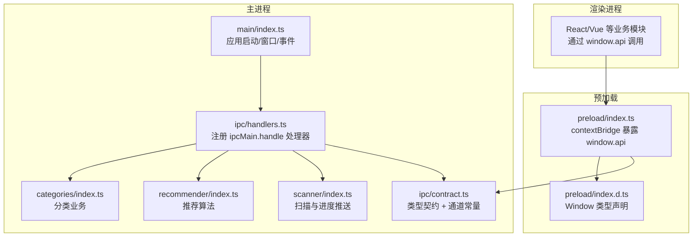
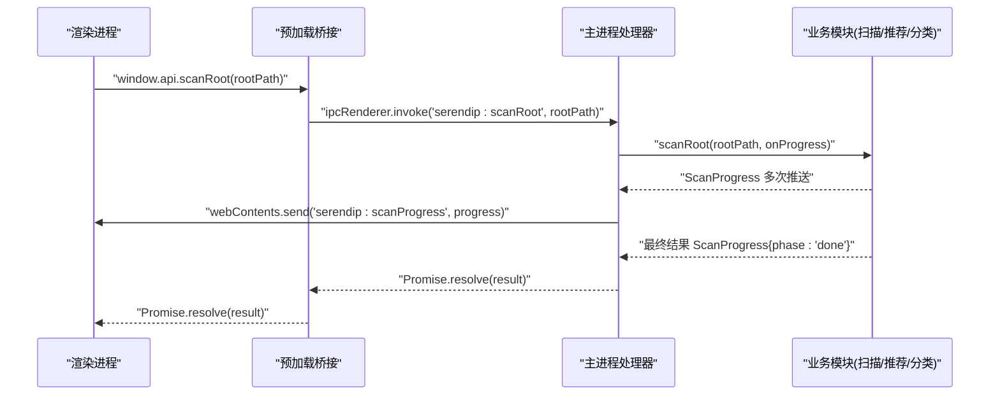
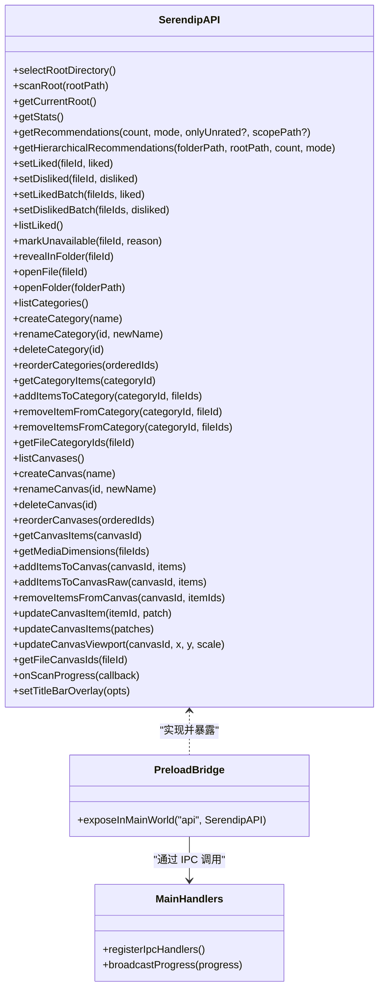

# IPC 通信层

<cite>
**本文引用的文件**   
- [src/main/ipc/contract.ts](file://src/main/ipc/contract.ts)
- [src/main/ipc/handlers.ts](file://src/main/ipc/handlers.ts)
- [src/preload/index.ts](file://src/preload/index.ts)
- [src/preload/index.d.ts](file://src/preload/index.d.ts)
- [src/main/index.ts](file://src/main/index.ts)
- [src/main/scanner/index.ts](file://src/main/scanner/index.ts)
- [src/main/recommender/index.ts](file://src/main/recommender/index.ts)
- [src/main/categories/index.ts](file://src/main/categories/index.ts)
</cite>

## 目录
1. [简介](#简介)
2. [项目结构](#项目结构)
3. [核心组件](#核心组件)
4. [架构总览](#架构总览)
5. [详细组件分析](#详细组件分析)
6. [依赖关系分析](#依赖关系分析)
7. [性能考量](#性能考量)
8. [故障排查指南](#故障排查指南)
9. [结论](#结论)
10. [附录：API 参考](#附录api-参考)

## 简介
本文件为 Serendip 应用的 IPC 通信层技术文档，聚焦主进程与渲染进程之间的通信机制设计、契约管理、错误处理策略、性能优化方案与安全控制。文档提供完整的 API 参考、调用示例与最佳实践，帮助开发者高效集成并稳定扩展 IPC 能力。

## 项目结构
IPC 相关代码主要分布在以下位置：
- 主进程侧：通道契约定义、处理器注册、业务逻辑调用
- 预加载脚本：向渲染进程暴露安全 API 桥接
- 应用入口：窗口创建、事件广播、协议与快捷键等初始化

图表来源
- [src/main/index.ts:38-91](file://src/main/index.ts#L38-L91)
- [src/main/ipc/handlers.ts:40-284](file://src/main/ipc/handlers.ts#L40-L284)
- [src/main/ipc/contract.ts:84-129](file://src/main/ipc/contract.ts#L84-L129)
- [src/preload/index.ts:9-104](file://src/preload/index.ts#L9-L104)
- [src/preload/index.d.ts:4-9](file://src/preload/index.d.ts#L4-L9)

章节来源
- [src/main/index.ts:1-134](file://src/main/index.ts#L1-L134)
- [src/main/ipc/contract.ts:1-130](file://src/main/ipc/contract.ts#L1-L130)
- [src/main/ipc/handlers.ts:1-292](file://src/main/ipc/handlers.ts#L1-L292)
- [src/preload/index.ts:1-104](file://src/preload/index.ts#L1-L104)
- [src/preload/index.d.ts:1-10](file://src/preload/index.d.ts#L1-L10)

## 核心组件
- 契约与通道常量
  - 统一导出 SerendipAPI 接口与 IPC 通道名常量，确保主/预加载/渲染三端类型一致。
- 预加载桥接
  - 使用 contextBridge.exposeInMainWorld 将 api 对象注入到渲染进程的 Window 上，屏蔽底层 Electron API 细节。
- 主进程处理器
  - 集中注册所有 ipcMain.handle 处理器，转发至具体业务模块（数据库、文件系统、推荐算法等）。
- 事件广播
  - 通过 BrowserWindow.webContents.send 或全局遍历窗口进行事件推送（如扫描进度、全屏变化、窗口移动）。

章节来源
- [src/main/ipc/contract.ts:12-82](file://src/main/ipc/contract.ts#L12-L82)
- [src/preload/index.ts:9-89](file://src/preload/index.ts#L9-L89)
- [src/main/ipc/handlers.ts:40-284](file://src/main/ipc/handlers.ts#L40-L284)
- [src/main/index.ts:71-79](file://src/main/index.ts#L71-L79)

## 架构总览
IPC 采用“请求-响应”与“事件推送”双模式：
- 请求-响应：渲染进程通过 window.api.xxx(...) 调用，内部基于 ipcRenderer.invoke(channel, ...args)，主进程由 ipcMain.handle(channel, handler) 处理并返回 Promise。
- 事件推送：主进程通过 webContents.send(channel, payload) 推送事件，渲染进程在预加载中监听并回调。

图表来源
- [src/preload/index.ts:10-11](file://src/preload/index.ts#L10-L11)
- [src/main/ipc/handlers.ts:51-60](file://src/main/ipc/handlers.ts#L51-L60)
- [src/main/scanner/index.ts:36-43](file://src/main/scanner/index.ts#L36-L43)
- [src/main/index.ts:71-76](file://src/main/index.ts#L71-L76)

## 详细组件分析

### 契约与类型系统
- 统一类型
  - 通过 contract.ts 导出 SerendipAPI 接口，包含库管理、推荐浏览、收藏分类、画布、进度订阅、窗口装饰等全部方法签名。
  - 同时导出 IPC 通道常量，避免硬编码字符串导致的拼写错误。
- 版本兼容
  - 当前未显式引入版本号字段；如需演进，建议在新增可选参数时保持向后兼容，并在主进程处理器中对缺失参数设置默认值。

章节来源
- [src/main/ipc/contract.ts:12-82](file://src/main/ipc/contract.ts#L12-L82)
- [src/main/ipc/contract.ts:84-129](file://src/main/ipc/contract.ts#L84-L129)

### 预加载桥接与类型声明
- 安全暴露
  - 仅暴露最小必要 API（window.api），不直接暴露 electron API 的敏感能力。
  - 在非隔离上下文下回退赋值 window.electron/window.api，保证开发环境可用。
- 类型增强
  - preload/index.d.ts 声明 Window.api 类型为 SerendipAPI，使渲染进程获得完整 TS 提示。

章节来源
- [src/preload/index.ts:91-103](file://src/preload/index.ts#L91-L103)
- [src/preload/index.d.ts:4-9](file://src/preload/index.d.ts#L4-L9)

### 主进程处理器与业务集成
- 处理器组织
  - handlers.ts 集中注册所有 handle，按功能域分组（库管理、推荐、分类、画布、窗口装饰）。
  - 对批量操作使用事务提升写入性能（如批量喜欢/不喜欢、分类重排、批量移除）。
- 事件推送
  - 扫描进度通过 event.sender.send 定向推送给发起者，同时提供 broadcastProgress 用于全窗口广播。
- 平台差异
  - 标题栏覆盖（WCO）在 macOS 不支持时静默忽略异常，保证跨平台稳定性。

章节来源
- [src/main/ipc/handlers.ts:40-284](file://src/main/ipc/handlers.ts#L40-L284)
- [src/main/ipc/handlers.ts:286-291](file://src/main/ipc/handlers.ts#L286-L291)

### 事件流与状态同步
- 扫描进度
  - 主进程在扫描阶段持续推送进度，渲染进程订阅后更新 UI。
- 窗口事件
  - 全屏切换与窗口移动事件由主进程主动推送，便于渲染层调整布局与标题栏样式。

章节来源
- [src/main/index.ts:71-79](file://src/main/index.ts#L71-L79)
- [src/main/ipc/handlers.ts:51-60](file://src/main/ipc/handlers.ts#L51-L60)

### 错误处理策略
- 参数校验
  - 部分业务函数在入口处进行基础校验（如分类名称非空、长度限制），失败抛出明确错误消息。
- 数据库约束
  - 利用 SQLite 唯一约束捕获重复插入，转换为友好错误信息。
- 文件存在性
  - 打开/显示文件前检查路径是否存在，不存在则标记失效，避免脏数据。
- 平台兼容性
  - 调用 setTitleBarOverlay 时 try/catch 捕获不支持的平台异常，静默降级。

章节来源
- [src/main/categories/index.ts:34-57](file://src/main/categories/index.ts#L34-L57)
- [src/main/categories/index.ts:59-76](file://src/main/categories/index.ts#L59-L76)
- [src/main/ipc/handlers.ts:156-185](file://src/main/ipc/handlers.ts#L156-L185)
- [src/main/ipc/handlers.ts:259-283](file://src/main/ipc/handlers.ts#L259-L283)

### 安全考虑与权限控制
- 最小暴露原则
  - 仅通过 contextBridge 暴露 window.api，屏蔽底层 Electron 原生 API。
- 白名单通道
  - 所有可调用方法均映射到明确的 IPC 通道常量，避免任意 channel 被调用。
- 外部链接拦截
  - 通过 setWindowOpenHandler 拦截新窗口打开，统一交由 shell.openExternal 处理，防止意外导航。
- 自定义协议
  - 注册私有协议 scheme 并赋予标准/安全/Fetch/stream 特权，用于缩略图等安全资源访问。

章节来源
- [src/preload/index.ts:91-98](file://src/preload/index.ts#L91-L98)
- [src/main/index.ts:25-36](file://src/main/index.ts#L25-L36)
- [src/main/index.ts:81-84](file://src/main/index.ts#L81-L84)

### 性能优化方案
- 批量写入与事务
  - 批量喜欢/不喜欢、分类重排、批量移除等操作使用 db.transaction 包裹，显著降低 IO 开销。
- 增量扫描与分批处理
  - 扫描流程分 walking/diffing/inserting/done 阶段，分批 stat 与 insert，减少内存峰值与阻塞时间。
- 去重与冷却策略
  - 推荐算法内置文件夹与文件的局部冷却与权重计算，避免重复抽取与热点虹吸。

章节来源
- [src/main/ipc/handlers.ts:105-125](file://src/main/ipc/handlers.ts#L105-L125)
- [src/main/scanner/index.ts:123-168](file://src/main/scanner/index.ts#L123-L168)
- [src/main/recommender/index.ts:57-149](file://src/main/recommender/index.ts#L57-L149)

## 依赖关系分析

图表来源
- [src/main/ipc/contract.ts:12-82](file://src/main/ipc/contract.ts#L12-L82)
- [src/preload/index.ts:9-89](file://src/preload/index.ts#L9-L89)
- [src/main/ipc/handlers.ts:40-284](file://src/main/ipc/handlers.ts#L40-L284)

章节来源
- [src/main/ipc/contract.ts:1-130](file://src/main/ipc/contract.ts#L1-L130)
- [src/preload/index.ts:1-104](file://src/preload/index.ts#L1-L104)
- [src/main/ipc/handlers.ts:1-292](file://src/main/ipc/handlers.ts#L1-L292)

## 性能考量
- 批量操作优先
  - 对频繁更新的字段（如 liked/disliked）使用批量接口，减少往返次数与事务开销。
- 分页与限流
  - 对于大数据量列表（如 getRecommendations），建议合理设置 count，并结合只读缓存或本地去重策略。
- 事件节流
  - 高频事件（如窗口移动、滚动）可在渲染层做节流后再触发 IPC，避免主进程过载。
- 资源访问
  - 缩略图通过自定义协议 serendip 获取，避免跨域与权限问题，同时支持流式读取。

[本节为通用指导，无需特定文件引用]

## 故障排查指南
- 常见问题定位
  - 通道未注册：确认 handlers.ts 是否已 registerIpcHandlers，且 main/index.ts 在 app.whenReady 后调用。
  - 类型不一致：确保 contract.ts 中的接口与预加载实现保持一致，TS 编译期即可发现差异。
  - 路径转义：涉及 LIKE 查询的路径需正确转义反斜杠与通配符，避免匹配异常。
  - 平台差异：WCO 在 macOS 不可用，应捕获异常并降级。
- 调试技巧
  - 在预加载层打印 invoke 的 channel 与参数，在主进程处理器入口打印入参与耗时。
  - 使用浏览器 DevTools 的 Console 查看 window.api 方法与错误堆栈。
  - 对长耗时操作（扫描、批量更新）观察进度事件，定位卡顿阶段。

章节来源
- [src/main/index.ts:93-102](file://src/main/index.ts#L93-L102)
- [src/main/ipc/handlers.ts:127-146](file://src/main/ipc/handlers.ts#L127-L146)
- [src/main/ipc/handlers.ts:259-283](file://src/main/ipc/handlers.ts#L259-L283)

## 结论
Serendip 的 IPC 层以契约驱动、预加载桥接、主进程集中处理器为核心，结合事务批写、增量扫描与事件推送，实现了高内聚、低耦合、可扩展的跨进程通信体系。遵循最小暴露与白名单通道原则，保障了安全性与可维护性。后续可按需在契约中增加可选参数与方法，保持向后兼容。

[本节为总结，无需特定文件引用]

## 附录：API 参考

### 通道常量与命名规范
- 命名风格：'serendip:<action>'
- 示例：'serendip:scanRoot'、'serendip:getRecommendations'、'serendip:setTitleBarOverlay'

章节来源
- [src/main/ipc/contract.ts:84-129](file://src/main/ipc/contract.ts#L84-L129)

### 请求/响应约定
- 请求-响应：window.api.<method>(...args) -> ipcRenderer.invoke(channel, ...args) -> ipcMain.handle(channel, (event, ...args) => ...) -> Promise<T>
- 事件推送：主进程 webContents.send(channel, payload) -> 预加载监听回调

章节来源
- [src/preload/index.ts:9-89](file://src/preload/index.ts#L9-L89)
- [src/main/ipc/handlers.ts:40-284](file://src/main/ipc/handlers.ts#L40-L284)

### 方法清单与说明
- 库管理
  - selectRootDirectory(): Promise<string | null>
  - scanRoot(rootPath: string): Promise<ScanProgress>
  - getCurrentRoot(): Promise<string | null>
  - getStats(): Promise<{ totalFiles: number; totalFolders: number; liked: number }>
- 推荐与浏览
  - getRecommendations(count: number, mode: ExploreMode, onlyUnrated?: boolean, scopePath?: string): Promise<MediaItem[]>
  - getHierarchicalRecommendations(folderPath: string, rootPath: string, count: number, mode: ExploreMode): Promise<MediaItem[]>
  - setLiked(fileId: number, liked: boolean): Promise<void>
  - setDisliked(fileId: number, disliked: boolean): Promise<void>
  - setLikedBatch(fileIds: number[], liked: boolean): Promise<void>
  - setDislikedBatch(fileIds: number[], disliked: boolean): Promise<void>
  - listLiked(): Promise<MediaItem[]>
  - markUnavailable(fileId: number, reason: string): Promise<void>
  - revealInFolder(fileId: number): Promise<void>
  - openFile(fileId: number): Promise<void>
  - openFolder(folderPath: string): Promise<void>
- 收藏分类
  - listCategories(): Promise<Category[]>
  - createCategory(name: string): Promise<number>
  - renameCategory(id: number, newName: string): Promise<void>
  - deleteCategory(id: number): Promise<void>
  - reorderCategories(orderedIds: number[]): Promise<void>
  - getCategoryItems(categoryId: number): Promise<MediaItem[]>
  - addItemsToCategory(categoryId: number, fileIds: number[]): Promise<number>
  - removeItemFromCategory(categoryId: number, fileId: number): Promise<void>
  - removeItemsFromCategory(categoryId: number, fileIds: number[]): Promise<void>
  - getFileCategoryIds(fileId: number): Promise<number[]>
- 画布
  - listCanvases(): Promise<Canvas[]>
  - createCanvas(name: string): Promise<number>
  - renameCanvas(id: number, newName: string): Promise<void>
  - deleteCanvas(id: number): Promise<void>
  - reorderCanvases(orderedIds: number[]): Promise<void>
  - getCanvasItems(canvasId: number): Promise<CanvasItem[]>
  - getMediaDimensions(fileIds: number[]): Promise<Array<{ id: number; width: number | null; height: number | null }>>
  - addItemsToCanvas(canvasId: number, items: CanvasItemInput[]): Promise<number[]>
  - addItemsToCanvasRaw(canvasId: number, items: CanvasItemFullInput[]): Promise<number[]>
  - removeItemsFromCanvas(canvasId: number, itemIds: number[]): Promise<void>
  - updateCanvasItem(itemId: number, patch: Omit<CanvasItemPatch, 'id'>): Promise<void>
  - updateCanvasItems(patches: CanvasItemPatch[]): Promise<void>
  - updateCanvasViewport(canvasId: number, x: number, y: number, scale: number): Promise<void>
  - getFileCanvasIds(fileId: number): Promise<number[]>
- 进度订阅
  - onScanProgress(callback: (progress: ScanProgress) => void): () => void
- 窗口装饰
  - setTitleBarOverlay(opts: { visible?: boolean; theme?: 'light' | 'dark'; color?: string; symbolColor?: string }): Promise<void>

章节来源
- [src/main/ipc/contract.ts:12-82](file://src/main/ipc/contract.ts#L12-L82)

### 调用示例与错误处理模式
- 选择根目录并扫描
  - 调用 selectRootDirectory 获取路径，再调用 scanRoot 开始扫描，订阅 onScanProgress 更新 UI。
  - 若用户取消选择，返回 null，渲染层应提示重新选择。
- 批量设置喜欢
  - 使用 setLikedBatch 而非循环 setLiked，减少 IPC 往返与数据库事务开销。
- 打开文件/文件夹
  - openFile/openFolder 可能因路径不存在而静默失败，建议在渲染层记录日志并提供重试或反馈。
- 标题栏覆盖
  - 在详情页传入透明色以实现沉浸式效果；主题切换时根据 theme 派生颜色，确保按钮可见性。

章节来源
- [src/preload/index.ts:10-11](file://src/preload/index.ts#L10-L11)
- [src/preload/index.ts:23-26](file://src/preload/index.ts#L23-L26)
- [src/preload/index.ts:30-32](file://src/preload/index.ts#L30-L32)
- [src/preload/index.ts:88](file://src/preload/index.ts#L88)
- [src/main/ipc/handlers.ts:173-185](file://src/main/ipc/handlers.ts#L173-L185)
- [src/main/ipc/handlers.ts:259-283](file://src/main/ipc/handlers.ts#L259-L283)

### 数据类型参考
- ScanProgress
  - phase: 'walking' | 'diffing' | 'inserting' | 'done'
  - scanned/total/added/removed/updated: 数字
  - currentPath?: string
- MediaItem
  - id/path/folder_path/type/width/height/duration_ms/liked/disliked
- Category
  - id/name/position/itemCount/createdAt
- ExploreMode
  - 'prefer' | 'balanced' | 'explore'

章节来源
- [src/main/scanner/index.ts:8-16](file://src/main/scanner/index.ts#L8-L16)
- [src/main/recommender/index.ts:17-29](file://src/main/recommender/index.ts#L17-L29)
- [src/main/categories/index.ts:12-18](file://src/main/categories/index.ts#L12-L18)

### 最佳实践建议
- 始终通过 window.api 调用，不要直接使用 ipcRenderer/electron API。
- 对批量操作优先使用 batch 接口，减少网络与事务开销。
- 对高频事件在渲染层做节流/防抖，避免主进程压力过大。
- 对路径类参数进行合法性校验与转义，避免 SQL LIKE 注入风险。
- 在关键路径添加日志与埋点，便于定位性能瓶颈与异常。

[本节为通用指导，无需特定文件引用]