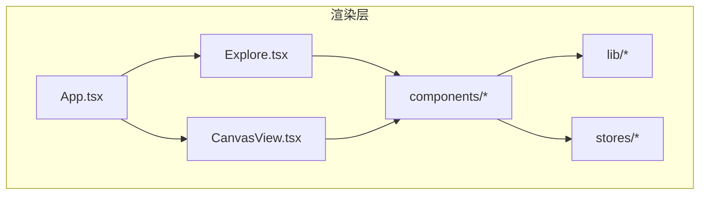
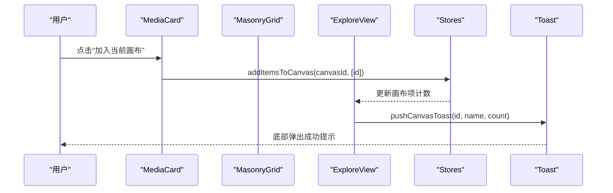
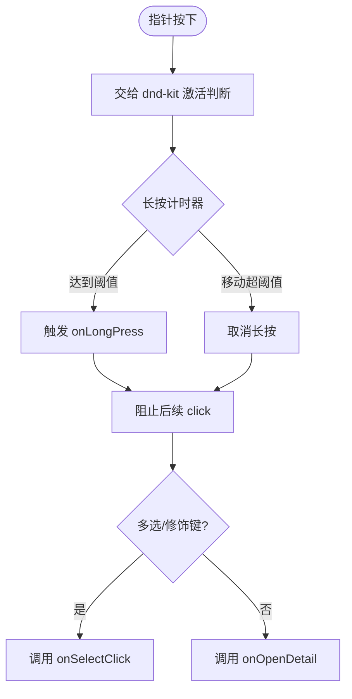
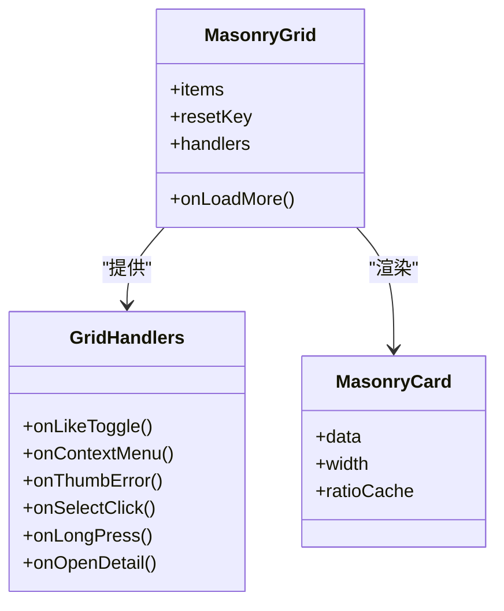
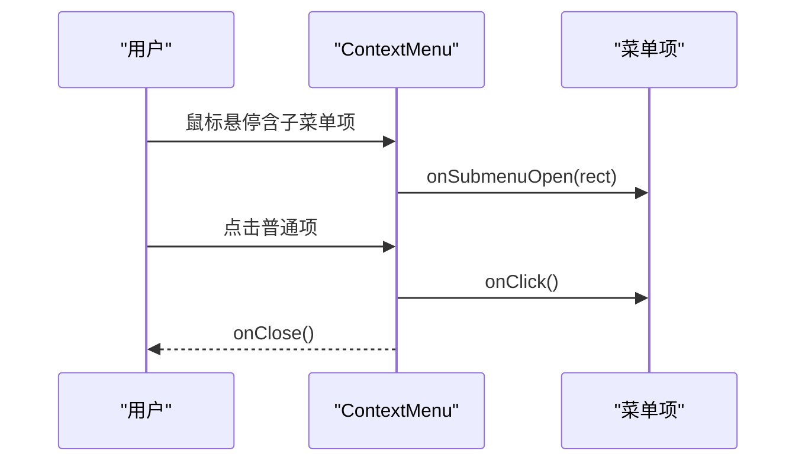
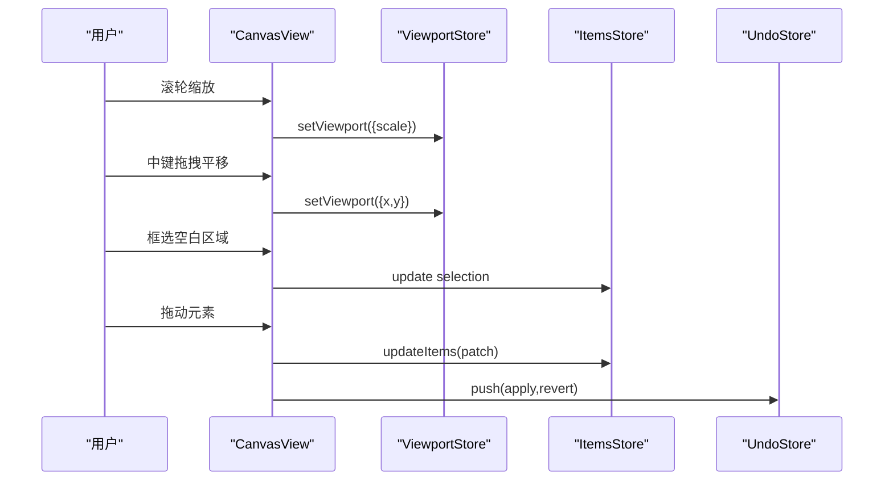
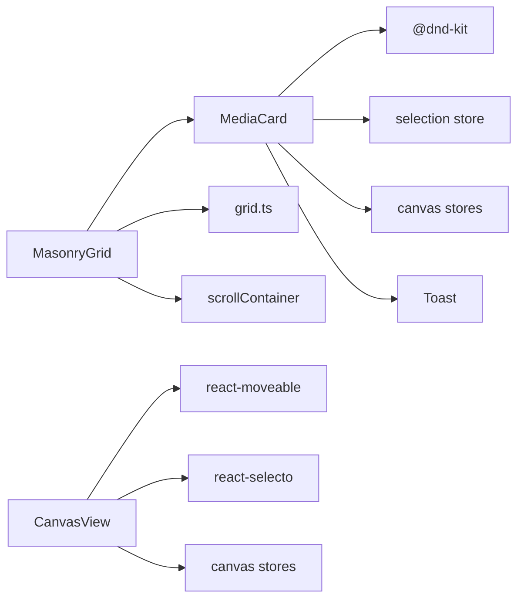

# UI 组件

<cite>
**本文引用的文件**   
- [MediaCard.tsx](file://src/renderer/src/components/MediaCard.tsx)
- [MasonryGrid.tsx](file://src/renderer/src/components/MasonryGrid.tsx)
- [ContextMenu.tsx](file://src/renderer/src/components/ContextMenu.tsx)
- [CanvasView.tsx](file://src/renderer/src/views/canvas/CanvasView.tsx)
- [App.tsx](file://src/renderer/src/App.tsx)
- [Explore.tsx](file://src/renderer/src/views/Explore.tsx)
- [CategoryList.tsx](file://src/renderer/src/components/CategoryList.tsx)
- [CanvasList.tsx](file://src/renderer/src/components/CanvasList.tsx)
- [SelectionToolbar.tsx](file://src/renderer/src/components/SelectionToolbar.tsx)
- [Toast.tsx](file://src/renderer/src/components/Toast.tsx)
- [Tooltip.tsx](file://src/renderer/src/components/Tooltip.tsx)
- [main.css](file://src/renderer/src/assets/main.css)
- [tailwind.config.js](file://tailwind.config.js)
- [grid.ts](file://src/renderer/src/lib/grid.ts)
</cite>

## 目录
1. [简介](#简介)
2. [项目结构](#项目结构)
3. [核心组件](#核心组件)
4. [架构总览](#架构总览)
5. [详细组件分析](#详细组件分析)
6. [依赖关系分析](#依赖关系分析)
7. [性能与可访问性](#性能与可访问性)
8. [主题与样式定制](#主题与样式定制)
9. [故障排查指南](#故障排查指南)
10. [结论](#结论)

## 简介
本文件面向前端开发者，系统化梳理 Serendip 应用的核心 UI 组件：媒体卡片、瀑布流网格、上下文菜单、画布视图等。文档覆盖设计理念、属性接口、事件处理、样式定制、响应式与可访问性、动画与过渡、组合复用策略、主题变量说明以及集成示例路径，帮助读者快速理解并高效扩展。

## 项目结构
渲染层采用 React + Tailwind CSS + masonic 虚拟化瀑布流 + dnd-kit 拖拽生态 + react-moveable/react-selecto 画布交互。关键目录与职责：
- components：通用 UI 组件（卡片、网格、菜单、工具栏、提示、通知）
- views：页面级视图（探索、分类、评审、喜欢、画布）
- lib：布局与滚动容器、手势辅助等工具
- stores：状态管理（Zustand）
- assets/tailwind：主题变量与样式

图表来源
- [App.tsx:478-780](file://src/renderer/src/App.tsx#L478-L780)
- [Explore.tsx:367-429](file://src/renderer/src/views/Explore.tsx#L367-L429)
- [CanvasView.tsx:54-120](file://src/renderer/src/views/canvas/CanvasView.tsx#L54-L120)

章节来源
- [App.tsx:478-780](file://src/renderer/src/App.tsx#L478-L780)
- [Explore.tsx:367-429](file://src/renderer/src/views/Explore.tsx#L367-L429)
- [CanvasView.tsx:54-120](file://src/renderer/src/views/canvas/CanvasView.tsx#L54-L120)

## 核心组件
- 媒体卡片 MediaCard：展示缩略图/视频预览、点赞、加入画布、多选复选框、更多操作入口；支持长按进入多选、悬停播放视频、错误降级与冷却机制。
- 瀑布流网格 MasonryGrid：基于 masonic 的窗口化瀑布流，按列宽自适应列数，缓存宽高比避免抖动，支持无限加载与自定义滚动容器。
- 上下文菜单 ContextMenu：固定定位、自动贴边、子菜单展开、键盘与滚动关闭、Portal 渲染。
- 画布视图 CanvasView：缩放平移、框选、移动/旋转/裁剪、复制粘贴、批量重排、撤销重做、摄影机手摇模式。
- 选择工具栏 SelectionToolbar：批量操作面板（喜欢/不感兴趣/加入分类或画布/移除）。
- 列表类组件 CategoryList/CanvasList：侧栏排序、右键菜单、折叠态 Tooltip。
- 全局反馈 Toast/Tooltip：消息合并、Portal 弹出、延迟显示。

章节来源
- [MediaCard.tsx:13-30](file://src/renderer/src/components/MediaCard.tsx#L13-L30)
- [MasonryGrid.tsx:91-109](file://src/renderer/src/components/MasonryGrid.tsx#L91-L109)
- [ContextMenu.tsx:21-29](file://src/renderer/src/components/ContextMenu.tsx#L21-L29)
- [CanvasView.tsx:50-66](file://src/renderer/src/views/canvas/CanvasView.tsx#L50-L66)
- [SelectionToolbar.tsx:19-37](file://src/renderer/src/components/SelectionToolbar.tsx#L19-L37)
- [CategoryList.tsx:16-25](file://src/renderer/src/components/CategoryList.tsx#L16-L25)
- [CanvasList.tsx:16-22](file://src/renderer/src/components/CanvasList.tsx#L16-L22)
- [Toast.tsx:12-17](file://src/renderer/src/components/Toast.tsx#L12-L17)
- [Tooltip.tsx:5-11](file://src/renderer/src/components/Tooltip.tsx#L5-L11)

## 架构总览
整体交互流程：
- App 提供 DndContext 与全局滚动容器上下文
- Explore 使用 MasonryGrid 渲染媒体卡片，卡片内部集成点赞、加入画布、多选、上下文菜单
- 画布视图独立于主滚动区域，承载复杂交互（缩放/平移/框选/变换）
- 全局反馈通过 Portal 渲染到 body

图表来源
- [MediaCard.tsx:286-318](file://src/renderer/src/components/MediaCard.tsx#L286-L318)
- [Toast.tsx:66-69](file://src/renderer/src/components/Toast.tsx#L66-L69)
- [Explore.tsx:367-429](file://src/renderer/src/views/Explore.tsx#L367-L429)

## 详细组件分析

### 媒体卡片 MediaCard
- 设计要点
  - 懒挂载视频元素，悬停延时进入，离开延时卸载，避免快速划过抖动
  - 视频池限制同时播放数量，失败退避冷却，看门狗超时标记失败但不进冷却
  - 长按进入多选，移动超过阈值取消长按，兼容拖拽激活
  - 多选模式下隐藏部分按钮，保留右键菜单
  - 缩略图加载失败上报主进程并从列表移除
- 属性接口（节选）
  - item: 媒体数据
  - onLikeToggle: 点赞切换回调
  - onContextMenu: 右键菜单触发
  - onThumbError/onThumbLoad: 缩略图错误/加载完成回调
  - draggable: 是否启用拖拽
  - onSelectClick/onLongPress/onOpenDetail: 多选、长按、打开详情
- 事件处理
  - pointerdown/move/up/cancel 组合实现长按与拖拽共存
  - hover 控制视频挂载与播放池
  - 点击根据修饰键与多选模式分流
- 样式与动画
  - 选中高亮环、非选中半透明、拖拽时透明度变化
  - 渐变遮罩、悬浮按钮显隐过渡
- 可访问性
  - 图片 alt 为空（装饰），按钮具备语义角色与焦点行为由父级控制
- 性能优化
  - memo 包裹避免瀑布流重排导致的无谓重渲染
  - 本地 Map 维护播放池与冷却记录

图表来源
- [MediaCard.tsx:361-416](file://src/renderer/src/components/MediaCard.tsx#L361-L416)

章节来源
- [MediaCard.tsx:96-606](file://src/renderer/src/components/MediaCard.tsx#L96-L606)

### 瀑布流网格 MasonryGrid
- 设计要点
  - 基于 masonic 的 useMasonry/usePositioner/useResizeObserver/useInfiniteLoader
  - 替换默认 window 滚动为 ScrollContainerContext 提供的容器，滚动条不出现在顶栏上方
  - 列宽由 grid.ts 的目标列宽反推，随容器宽度自适应
  - 单元格高度优先取会话内实测宽高比，其次 DB 记录，最后兜底比例
  - 模块级 ratioCache 跨卸载/重挂复用，避免回滚抖动
- 属性接口
  - items/resetKey/onLoadMore
  - 透传卡片事件：onLikeToggle/onContextMenu/onThumbError/onSelectClick/onLongPress/onOpenDetail
- 性能优化
  - overscanBy 控制预渲染行数
  - ResizeObserver 监听容器尺寸变化，侧边栏动画结束后一次性读取几何信息
  - 稳定 itemKey 与 isItemLoaded 函数引用

图表来源
- [MasonryGrid.tsx:91-109](file://src/renderer/src/components/MasonryGrid.tsx#L91-L109)
- [MasonryGrid.tsx:51-84](file://src/renderer/src/components/MasonryGrid.tsx#L51-L84)

章节来源
- [MasonryGrid.tsx:1-212](file://src/renderer/src/components/MasonryGrid.tsx#L1-L212)
- [grid.ts:1-29](file://src/renderer/src/lib/grid.ts#L1-L29)

### 上下文菜单 ContextMenu
- 设计要点
  - 固定定位，自动贴边计算，支持 cursor/top 两种放置模式
  - 支持分隔线、头部、危险样式、图标、子菜单
  - 鼠标/键盘/滚动/失焦/窗口移动均关闭
  - Portal 渲染到 body，z-index 层级高于常规内容
- 属性接口
  - x/y/items/onClose/placement/onSubmenuClose
  - items 支持 onSubmenuOpen(rect)/submenuOpen 控制子菜单
- 可访问性
  - role="menu"/role="menuitem"/role="separator"

图表来源
- [ContextMenu.tsx:31-98](file://src/renderer/src/components/ContextMenu.tsx#L31-L98)
- [ContextMenu.tsx:100-165](file://src/renderer/src/components/ContextMenu.tsx#L100-L165)

章节来源
- [ContextMenu.tsx:1-166](file://src/renderer/src/components/ContextMenu.tsx#L1-L166)

### 画布视图 CanvasView
- 设计要点
  - 视口模型：x/y/scale，wheel 离散档位缩放，以光标为锚点
  - Pan：中键或 Space+左键拖拽，全局注入 hand 光标
  - 框选：空白处拖拽，支持 replace/add/subtract 三种模式
  - 变换：移动/旋转/缩放，四角旋转区替代顶部手柄，实时同步内容层尺寸
  - 裁剪：C 键按住 + 左键拖拽矩形，世界坐标裁剪，支持撤销重做
  - 复制/粘贴/再制：组包围盒中心对齐光标位置，增量 z 序
  - 一键重排：等高行网格布局，居中质心减少跳动
  - 摄影机手摇：开启后锁定编辑，清空选区
- 关键数据结构
  - 视口 byId 映射、选中集合、Undo 栈、Clipboard 剪贴板
- 性能与体验
  - flushSync 确保变换后立即更新 Moveable 矩形
  - MutationObserver 动态修正 Moveable 手柄 cursor
  - 自定义 resize cursor 基于角度计算

图表来源
- [CanvasView.tsx:455-480](file://src/renderer/src/views/canvas/CanvasView.tsx#L455-L480)
- [CanvasView.tsx:493-549](file://src/renderer/src/views/canvas/CanvasView.tsx#L493-L549)
- [CanvasView.tsx:551-679](file://src/renderer/src/views/canvas/CanvasView.tsx#L551-L679)
- [CanvasView.tsx:681-727](file://src/renderer/src/views/canvas/CanvasView.tsx#L681-L727)

章节来源
- [CanvasView.tsx:1-800](file://src/renderer/src/views/canvas/CanvasView.tsx#L1-L800)

### 选择工具栏 SelectionToolbar
- 功能：已选计数、全选/清空、喜欢/取消喜欢/不感兴趣、加入分类/画布、移除
- 交互：弹出分类/画布选择器，支持创建并加入
- 样式：玻璃拟态、圆角胶囊、危险色标注

章节来源
- [SelectionToolbar.tsx:1-212](file://src/renderer/src/components/SelectionToolbar.tsx#L1-L212)

### 列表组件 CategoryList / CanvasList
- 功能：侧栏排序（dnd-kit sortable）、右键菜单（重命名/删除）、折叠态 Tooltip
- 交互：拖拽高亮投放目标、点击切换视图
- 可访问性：按钮具备可聚焦与键盘导航能力

章节来源
- [CategoryList.tsx:1-212](file://src/renderer/src/components/CategoryList.tsx#L1-L212)
- [CanvasList.tsx:1-200](file://src/renderer/src/components/CanvasList.tsx#L1-L200)

### 全局反馈 Toast / Tooltip
- Toast：同画布最近消息合并、自动消失、点击前往画布
- Tooltip：延迟显示、多方位定位、Portal 渲染

章节来源
- [Toast.tsx:1-109](file://src/renderer/src/components/Toast.tsx#L1-L109)
- [Tooltip.tsx:1-98](file://src/renderer/src/components/Tooltip.tsx#L1-L98)

## 依赖关系分析
- 组件耦合
  - MasonryGrid 依赖 grid.ts 的列宽策略与 scrollContainer 的滚动容器
  - MediaCard 依赖 dnd-kit 拖拽、选择状态、画布状态与 Toast 反馈
  - CanvasView 依赖多个 store（viewport/items/selection/undo/clipboard）与第三方库（moveable/selecto）
- 外部依赖
  - @dnd-kit/core/sortable/utilities：拖拽与排序
  - masonic：瀑布流虚拟化
  - react-moveable/react-selecto：画布变换与框选
  - lucide-react：图标
  - clsx：条件 className 拼接
- 潜在循环依赖
  - 组件间通过 props/context/stores 解耦，未见直接循环 import

图表来源
- [MasonryGrid.tsx:1-20](file://src/renderer/src/components/MasonryGrid.tsx#L1-L20)
- [MediaCard.tsx:1-12](file://src/renderer/src/components/MediaCard.tsx#L1-L12)
- [CanvasView.tsx:1-30](file://src/renderer/src/views/canvas/CanvasView.tsx#L1-L30)

章节来源
- [MasonryGrid.tsx:1-20](file://src/renderer/src/components/MasonryGrid.tsx#L1-L20)
- [MediaCard.tsx:1-12](file://src/renderer/src/components/MediaCard.tsx#L1-L12)
- [CanvasView.tsx:1-30](file://src/renderer/src/views/canvas/CanvasView.tsx#L1-L30)

## 性能与可访问性
- 性能
  - 虚拟化：masonic 仅渲染可视区域卡片，降低 DOM 压力
  - 视频池：限制并发播放数量，失败退避冷却，看门狗防误伤
  - 比例缓存：会话内缓存宽高比，避免二次抖动
  - 稳定引用：useMemo/useCallback 稳定回调与 key，减少重渲染
  - 滚动容器：主区独立滚动，避免整页滚动抖动
- 可访问性
  - 语义角色：菜单/菜单项/分隔符
  - 键盘支持：Escape 关闭菜单、Tab 切换侧栏
  - 焦点可见性：桌面端全局去除 outline，按需恢复
  - 文本可读性：字体栈包含中英文常用字体，抗锯齿开启

章节来源
- [MasonryGrid.tsx:160-202](file://src/renderer/src/components/MasonryGrid.tsx#L160-L202)
- [MediaCard.tsx:36-87](file://src/renderer/src/components/MediaCard.tsx#L36-L87)
- [ContextMenu.tsx:73-98](file://src/renderer/src/components/ContextMenu.tsx#L73-L98)
- [main.css:63-81](file://src/renderer/src/assets/main.css#L63-L81)

## 主题与样式定制
- 主题变量
  - 品牌色通道：--brand-hue/--brand-sat
  - 明暗主题变量：--color-background/--color-foreground/--color-primary 等
  - Tailwind 颜色映射至 CSS 变量，支持 opacity 修饰符
- 关键样式
  - 滚动条主题适配
  - 详情页/评审卡片/画布入场动画
  - Moveable 控制框与 selecto 框选主题色覆盖
- 定制建议
  - 修改 --brand-hue/--brand-sat 即可全局换色
  - 调整 Tailwind 颜色映射以扩展新语义色
  - 在 main.css 追加自定义动画或覆盖第三方库样式

章节来源
- [main.css:9-48](file://src/renderer/src/assets/main.css#L9-L48)
- [tailwind.config.js:7-25](file://tailwind.config.js#L7-L25)
- [main.css:110-187](file://src/renderer/src/assets/main.css#L110-L187)

## 故障排查指南
- 缩略图加载失败
  - 现象：卡片显示“加载失败”，从列表移除
  - 处理：检查 onThumbError 回调与主进程标记不可用逻辑
- 视频无法播放
  - 现象：悬停无视频，右上角播放标识
  - 排查：查看冷却记录与播放池上限，确认 onError/playing/watchdog 分支
- 画布缩放/平移异常
  - 现象：缩放锚点偏移或平移卡顿
  - 排查：确认 wheel 事件 passive:false、setPointerCapture 释放、视口更新顺序
- 框选误清空选区
  - 现象：拖拽收尾 click 清空选区
  - 排查：selectoJustSelectedRef/panJustEndedRef/cropJustEndedRef 标志位
- 菜单不关闭
  - 现象：滚动/失焦/窗口移动未关闭
  - 排查：检查 document/window 事件监听与 IPC 监听移除

章节来源
- [Explore.tsx:184-194](file://src/renderer/src/views/Explore.tsx#L184-L194)
- [MediaCard.tsx:263-279](file://src/renderer/src/components/MediaCard.tsx#L263-L279)
- [CanvasView.tsx:455-480](file://src/renderer/src/views/canvas/CanvasView.tsx#L455-L480)
- [CanvasView.tsx:493-549](file://src/renderer/src/views/canvas/CanvasView.tsx#L493-L549)
- [ContextMenu.tsx:73-98](file://src/renderer/src/components/ContextMenu.tsx#L73-L98)

## 结论
Serendip 的 UI 组件围绕高性能可视化与流畅交互构建：虚拟化瀑布流保障大数据量下的渲染效率，媒体卡片兼顾多媒体体验与容错，上下文菜单与工具栏提升操作密度，画布视图提供专业级的图像编排能力。通过主题变量与 Tailwind 映射，系统具备良好的可定制性与一致性。遵循本文档的接口约定与最佳实践，可快速集成与扩展新的 UI 能力。