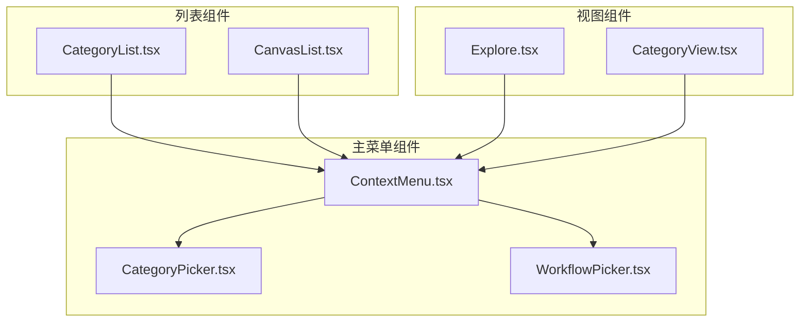
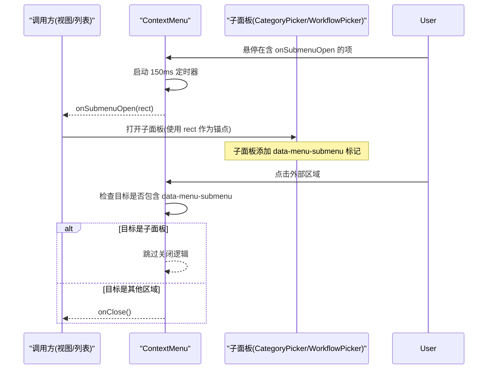
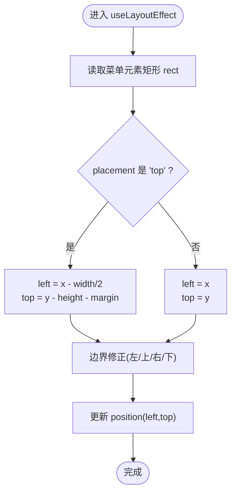
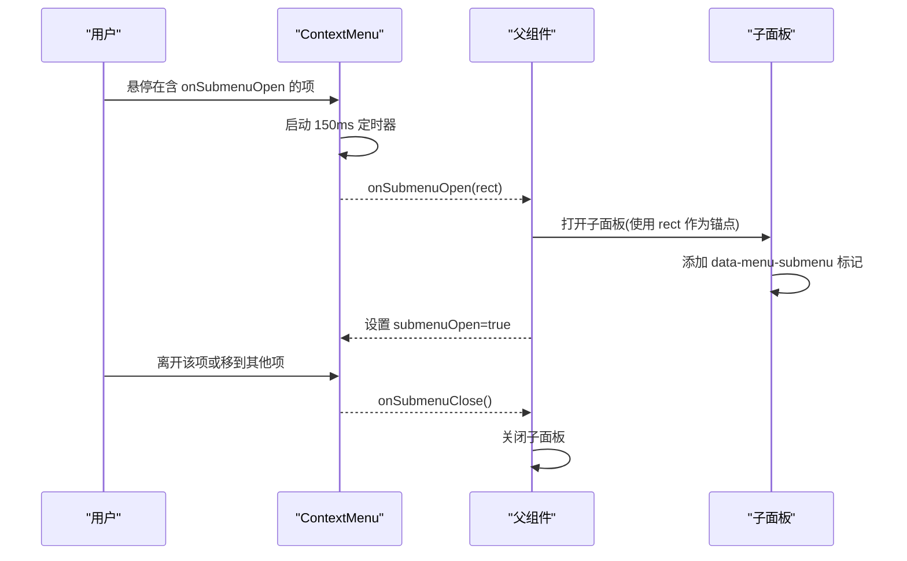
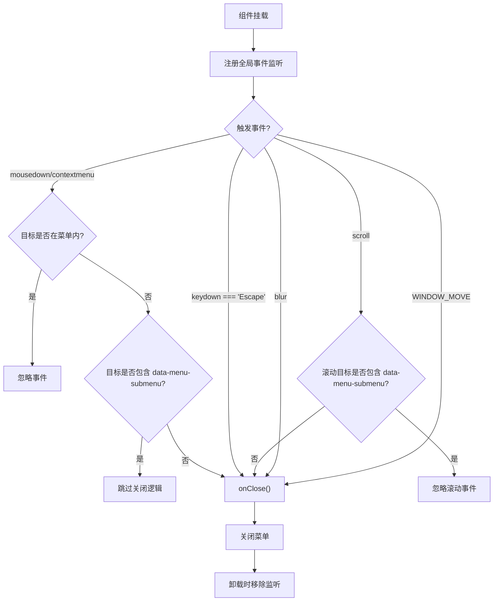
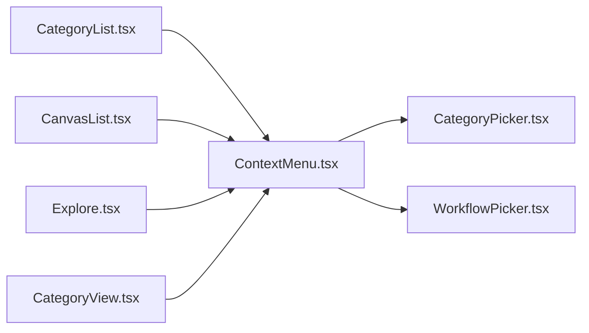

# 上下文菜单

<cite>
**本文引用的文件**   
- [ContextMenu.tsx](file://src/renderer/src/components/ContextMenu.tsx)
- [CategoryPicker.tsx](file://src/renderer/src/components/CategoryPicker.tsx)
- [WorkflowPicker.tsx](file://src/renderer/src/components/WorkflowPicker.tsx)
- [CanvasList.tsx](file://src/renderer/src/components/CanvasList.tsx)
- [CategoryList.tsx](file://src/renderer/src/components/CategoryList.tsx)
- [CategoryView.tsx](file://src/renderer/src/views/CategoryView.tsx)
- [Explore.tsx](file://src/renderer/src/views/Explore.tsx)
</cite>

## 更新摘要
**所做更改**   
- 增强了子菜单交互支持，修复了外部点击检测导致的子菜单过早关闭问题
- 新增了 `data-menu-submenu` 标记机制，用于区分主菜单和子面板的点击事件
- 改进了滚动事件处理，避免子面板内部滚动时意外关闭主菜单
- 完善了子菜单与父菜单之间的状态同步和高亮显示

## 目录
1. [简介](#简介)
2. [项目结构](#项目结构)
3. [核心组件](#核心组件)
4. [架构总览](#架构总览)
5. [详细组件分析](#详细组件分析)
6. [依赖关系分析](#依赖关系分析)
7. [性能与可访问性](#性能与可访问性)
8. [故障排查指南](#故障排查指南)
9. [结论](#结论)
10. [附录：使用示例与最佳实践](#附录使用示例与最佳实践)

## 简介
本文件为 Serendip 应用的"上下文菜单"组件提供系统化文档，覆盖设计架构、属性配置、事件处理机制、子菜单展开回调与锚点定位算法、placement 定位模式差异、键盘与鼠标交互、Portal 渲染与 z-index 层级管理、主题定制与样式覆盖等。读者无需深入源码即可理解如何正确使用 ContextMenu 及其扩展能力。

**最新更新**：增强了子菜单交互支持，通过 `data-menu-submenu` 标记机制修复了外部点击检测导致的子菜单过早关闭问题，提升了用户体验的流畅性和稳定性。

## 项目结构
上下文菜单组件位于渲染进程 UI 层，被多个视图和侧栏列表复用，用于在用户右键或悬停时弹出操作面板。其关键位置如下：
- 组件定义：src/renderer/src/components/ContextMenu.tsx
- 子菜单组件：src/renderer/src/components/CategoryPicker.tsx、src/renderer/src/components/WorkflowPicker.tsx
- 侧边栏列表（分类/画布）：src/renderer/src/components/CategoryList.tsx、src/renderer/src/components/CanvasList.tsx
- 主视图（探索/分类详情）：src/renderer/src/views/Explore.tsx、src/renderer/src/views/CategoryView.tsx

**图表来源**
- [ContextMenu.tsx:1-176](file://src/renderer/src/components/ContextMenu.tsx#L1-L176)
- [CategoryPicker.tsx:1-174](file://src/renderer/src/components/CategoryPicker.tsx#L1-L174)
- [WorkflowPicker.tsx:1-116](file://src/renderer/src/components/WorkflowPicker.tsx#L1-L116)
- [CategoryList.tsx:1-212](file://src/renderer/src/components/CategoryList.tsx#L1-L212)
- [CanvasList.tsx:1-200](file://src/renderer/src/components/CanvasList.tsx#L1-L200)
- [Explore.tsx:1-459](file://src/renderer/src/views/Explore.tsx#L1-L459)
- [CategoryView.tsx:1-443](file://src/renderer/src/views/CategoryView.tsx#L1-L443)

## 核心组件
- ContextMenu 组件负责：
  - 根据传入的 x/y 坐标渲染固定定位的菜单容器
  - 支持两种 placement 模式：'cursor'（默认）与 'top'
  - 通过 Portal 将菜单挂载到 document.body，避免父级 overflow/transform 影响
  - 监听全局事件实现点击外部关闭、滚动/窗口移动/失焦自动关闭、Escape 键关闭
  - 渲染分隔符、标题行、普通项、危险项以及带图标的项
  - 支持 onSubmenuOpen 子菜单展开回调，并基于 DOMRect 计算锚点位置
  - 通过 submenuOpen 控制高亮状态，配合 onSubmenuClose 关闭非子菜单项时的子面板
  - **新增**：通过 `data-menu-submenu` 标记机制智能识别子面板，避免外部点击导致子菜单过早关闭

**章节来源**
- [ContextMenu.tsx:7-29](file://src/renderer/src/components/ContextMenu.tsx#L7-L29)
- [ContextMenu.tsx:31-71](file://src/renderer/src/components/ContextMenu.tsx#L31-L71)
- [ContextMenu.tsx:73-108](file://src/renderer/src/components/ContextMenu.tsx#L73-L108)
- [ContextMenu.tsx:110-175](file://src/renderer/src/components/ContextMenu.tsx#L110-L175)

## 架构总览
上下文菜单采用"受控 + 事件驱动"的轻量架构：
- 调用方维护菜单可见性与坐标（x, y），并通过 onClose 控制关闭
- 菜单内部仅负责展示与交互细节（定位、事件、子菜单联动）
- 子菜单通过 onSubmenuOpen(rect) 回调获取触发项的 DOMRect，由调用方决定子面板的显示与定位
- 所有浮层均通过 createPortal 渲染至 body，确保不受父容器布局影响
- **增强**：通过 `data-menu-submenu` 标记实现父子菜单的智能事件隔离

**图表来源**
- [ContextMenu.tsx:73-108](file://src/renderer/src/components/ContextMenu.tsx#L73-L108)
- [CategoryPicker.tsx:115-172](file://src/renderer/src/components/CategoryPicker.tsx#L115-L172)
- [WorkflowPicker.tsx:86-115](file://src/renderer/src/components/WorkflowPicker.tsx#L86-L115)
- [Explore.tsx:340-418](file://src/renderer/src/views/Explore.tsx#L340-L418)
- [CategoryView.tsx:275-356](file://src/renderer/src/views/CategoryView.tsx#L275-L356)

## 详细组件分析

### ContextMenuItem 接口与属性说明
- key: 唯一标识，用于 React 列表渲染 key
- label: 文本标签
- icon: 图标组件类型（React.ElementType），若存在则左侧显示图标
- divider: 布尔值，表示渲染分隔符行
- header: 布尔值，表示渲染标题行（小字号大写风格）
- danger: 布尔值，表示危险操作项（红色文字与悬停背景）
- onClick: 点击回调；若无子菜单，点击后执行并关闭菜单
- onSubmenuOpen(rect: DOMRect): 悬停时回调，传入当前项的 DOMRect 供调用方定位子面板
- submenuOpen: 子面板已打开时为 true，用于保持高亮

**章节来源**
- [ContextMenu.tsx:7-19](file://src/renderer/src/components/ContextMenu.tsx#L7-L19)

### placement 定位模式
- 'cursor'（默认）：以光标位置为起点放置菜单，同时做边界修正，保证不超出视口
- 'top'：以光标为中心水平居中，并将菜单置于光标上方一定间距处

定位算法要点：
- 使用 useLayoutEffect 在布局完成后读取菜单自身尺寸，结合 margin 进行边界修正
- 对 left/top 分别做最小/最大限制，防止溢出屏幕

**图表来源**
- [ContextMenu.tsx:50-71](file://src/renderer/src/components/ContextMenu.tsx#L50-L71)

**章节来源**
- [ContextMenu.tsx:50-71](file://src/renderer/src/components/ContextMenu.tsx#L50-L71)

### 子菜单展开回调与 DOMRect 锚点定位
- 当菜单项包含 onSubmenuOpen 时，hover 会延迟 150ms 触发回调，传入当前按钮元素的 DOMRect
- 调用方根据 rect.right / rect.top 等坐标计算子面板位置，并决定是否显示
- 当 hover 到不含子菜单的项时，调用 onSubmenuClose 关闭已打开的子面板
- 子面板可通过 submenuOpen 标记当前项高亮
- **增强**：子面板通过 `data-menu-submenu` 标记与主菜单建立关联

**图表来源**
- [ContextMenu.tsx:135-146](file://src/renderer/src/components/ContextMenu.tsx#L135-L146)
- [CategoryPicker.tsx:115-172](file://src/renderer/src/components/CategoryPicker.tsx#L115-L172)
- [WorkflowPicker.tsx:86-115](file://src/renderer/src/components/WorkflowPicker.tsx#L86-L115)
- [Explore.tsx:357-360](file://src/renderer/src/views/Explore.tsx#L357-L360)
- [CategoryView.tsx:290-294](file://src/renderer/src/views/CategoryView.tsx#L290-L294)

**章节来源**
- [ContextMenu.tsx:135-146](file://src/renderer/src/components/ContextMenu.tsx#L135-L146)
- [Explore.tsx:357-360](file://src/renderer/src/views/Explore.tsx#L357-L360)
- [CategoryView.tsx:290-294](file://src/renderer/src/views/CategoryView.tsx#L290-L294)

### 增强的事件处理与智能关闭逻辑
- 点击外部区域关闭：document mousedown/contextmenu 捕获，判断目标是否在菜单内
- **新增**：智能识别子面板，通过 `data-menu-submenu` 标记避免误关闭
- 键盘关闭：document keydown 监听 Escape
- 滚动关闭：window scroll 事件，但排除子面板内部滚动
- 窗口移动关闭：Electron IPC WINDOW_MOVE 事件
- 失焦关闭：window blur 事件
- 清理：组件卸载时移除所有监听器

**图表来源**
- [ContextMenu.tsx:73-108](file://src/renderer/src/components/ContextMenu.tsx#L73-L108)

**章节来源**
- [ContextMenu.tsx:73-108](file://src/renderer/src/components/ContextMenu.tsx#L73-L108)

### Portal 渲染与 z-index 层级管理
- 使用 createPortal 将菜单渲染到 document.body，避免父容器 overflow/transform 导致裁剪或错位
- 菜单容器使用 fixed 定位与 z-[200]，确保浮于大多数内容之上
- 子面板通常也通过 Portal 渲染，并使用相近的 z-index 层级（z-[110]），避免遮挡问题
- **增强**：子面板通过 `data-menu-submenu` 标记与主菜单建立关联，实现智能事件隔离

**章节来源**
- [ContextMenu.tsx:110-116](file://src/renderer/src/components/ContextMenu.tsx#L110-L116)
- [CategoryPicker.tsx:115-122](file://src/renderer/src/components/CategoryPicker.tsx#L115-L122)
- [WorkflowPicker.tsx:86-93](file://src/renderer/src/components/WorkflowPicker.tsx#L86-L93)

### 主题定制与样式覆盖最佳实践
- 组件使用 Tailwind 语义化类名（如 bg-background、text-foreground、border-border 等），便于跟随主题切换
- 危险项通过 text-red-500 与 hover:bg-red-500/10 表达，可按需调整
- 建议：
  - 通过 CSS 变量或 Tailwind 自定义主题色覆盖整体风格
  - 如需覆盖特定样式，优先使用外层包裹的 className 合并策略（例如 clsx）
  - 注意 z-index 冲突，必要时在调用方统一提升层级

**章节来源**
- [ContextMenu.tsx:157-164](file://src/renderer/src/components/ContextMenu.tsx#L157-L164)

## 依赖关系分析
- ContextMenu 被以下模块引用：
  - CategoryList：用于分类行的重命名/删除等操作
  - CanvasList：用于画布行的重命名/删除等操作
  - Explore：用于媒体项的喜欢/打开/显示/添加到分类/不感兴趣等
  - CategoryView：用于媒体项的类似操作，并集成子菜单（添加到分类）
- ContextMenu 与子菜单组件协作：
  - CategoryPicker：分类选择器，支持搜索和创建新分类
  - WorkflowPicker：工作流选择器，用于 P2V 功能

**图表来源**
- [ContextMenu.tsx:1-176](file://src/renderer/src/components/ContextMenu.tsx#L1-L176)
- [CategoryPicker.tsx:1-174](file://src/renderer/src/components/CategoryPicker.tsx#L1-L174)
- [WorkflowPicker.tsx:1-116](file://src/renderer/src/components/WorkflowPicker.tsx#L1-L116)
- [CategoryList.tsx:1-212](file://src/renderer/src/components/CategoryList.tsx#L1-L212)
- [CanvasList.tsx:1-200](file://src/renderer/src/components/CanvasList.tsx#L1-L200)
- [Explore.tsx:1-459](file://src/renderer/src/views/Explore.tsx#L1-L459)
- [CategoryView.tsx:1-443](file://src/renderer/src/views/CategoryView.tsx#L1-L443)

## 性能与可访问性
- 性能
  - 使用 useLayoutEffect 计算位置，避免闪烁
  - 子菜单展开使用短延迟（150ms）减少误触抖动
  - 事件监听集中注册与清理，避免内存泄漏
  - **优化**：通过 `data-menu-submenu` 标记避免不必要的事件冒泡处理
- 可访问性
  - 菜单容器 role="menu"，菜单项 role="menuitem"，分隔符 role="separator"
  - 支持键盘 Escape 关闭，符合常见桌面应用交互预期

**章节来源**
- [ContextMenu.tsx:50-71](file://src/renderer/src/components/ContextMenu.tsx#L50-L71)
- [ContextMenu.tsx:110-116](file://src/renderer/src/components/ContextMenu.tsx#L110-L116)

## 故障排查指南
- 菜单被父容器裁剪
  - 检查是否未使用 Portal 渲染；确认菜单容器为 fixed 定位且 z-index 足够高
- 子菜单无法正确定位
  - 确认 onSubmenuOpen 接收到的 rect 有效；根据 rect.right/top 计算子面板位置
  - 检查调用方是否正确设置 submenuOpen 以维持高亮
- 菜单无法关闭
  - 检查全局事件监听是否被移除；确认 onClose 回调是否被调用
  - 验证 ESC 键是否被上层拦截
  - **新增**：检查子面板是否正确添加 `data-menu-submenu` 标记
- 子菜单过早关闭
  - **修复**：确认子面板包含 `data-menu-submenu` 标记
  - 检查外部点击检测逻辑是否正确识别子面板
- 主题样式异常
  - 检查 Tailwind 主题变量是否生效；必要时在调用方增加样式覆盖

**章节来源**
- [ContextMenu.tsx:73-108](file://src/renderer/src/components/ContextMenu.tsx#L73-L108)
- [ContextMenu.tsx:110-116](file://src/renderer/src/components/ContextMenu.tsx#L110-L116)

## 结论
ContextMenu 是一个轻量、可控、可复用的浮层组件，具备完善的定位、事件与子菜单联动能力。通过合理的属性配置与回调协作，可在多种场景下快速构建一致的上下文菜单体验。**最新增强**通过 `data-menu-submenu` 标记机制解决了子菜单交互中的关键问题，显著提升了用户体验的流畅性和稳定性。遵循 Portal 渲染与 z-index 管理、主题覆盖的最佳实践，可获得稳定且美观的用户界面。

## 附录：使用示例与最佳实践

### 基本用法（右键弹出）
- 在列表项的 onContextMenu 中记录 x/y 并设置菜单可见
- 传入 items 数组，每项包含 key、label、icon、onClick 等
- 通过 onClose 关闭菜单

**章节来源**
- [CategoryList.tsx:80-96](file://src/renderer/src/components/CategoryList.tsx#L80-L96)
- [CanvasList.tsx:80-96](file://src/renderer/src/components/CanvasList.tsx#L80-L96)

### 创建带图标的菜单项
- 在 item 中设置 icon 为图标组件类型（如 Pencil、Trash2）
- 组件会在标签前渲染对应图标

**章节来源**
- [CategoryList.tsx:53-69](file://src/renderer/src/components/CategoryList.tsx#L53-L69)
- [CanvasList.tsx:42-58](file://src/renderer/src/components/CanvasList.tsx#L42-L58)

### 添加分隔符与标题行
- 使用 divider: true 插入分隔符
- 使用 header: true 与 label 渲染标题行

**章节来源**
- [Explore.tsx:352-364](file://src/renderer/src/views/Explore.tsx#L352-L364)
- [CategoryView.tsx:286-298](file://src/renderer/src/views/CategoryView.tsx#L286-L298)

### 危险操作项
- 设置 danger: true 以红色样式呈现，常用于删除等破坏性操作

**章节来源**
- [CategoryList.tsx:60-69](file://src/renderer/src/components/CategoryList.tsx#L60-L69)
- [CanvasList.tsx:50-58](file://src/renderer/src/components/CanvasList.tsx#L50-L58)
- [Explore.tsx:365-371](file://src/renderer/src/views/Explore.tsx#L365-L371)

### 子菜单展开（DOMRect 锚点）
- 在 item 中提供 onSubmenuOpen(rect)，并在 hover 时根据 rect 打开子面板
- 使用 submenuOpen 标记当前项高亮，onSubmenuClose 关闭子面板
- **重要**：确保子面板组件包含 `data-menu-submenu` 标记以避免外部点击误关闭

**章节来源**
- [Explore.tsx:357-360](file://src/renderer/src/views/Explore.tsx#L357-L360)
- [CategoryView.tsx:290-294](file://src/renderer/src/views/CategoryView.tsx#L290-L294)
- [ContextMenu.tsx:135-146](file://src/renderer/src/components/ContextMenu.tsx#L135-L146)
- [CategoryPicker.tsx:115-172](file://src/renderer/src/components/CategoryPicker.tsx#L115-L172)
- [WorkflowPicker.tsx:86-115](file://src/renderer/src/components/WorkflowPicker.tsx#L86-L115)

### placement 模式对比
- 'cursor'：从光标位置开始定位，适合常规右键菜单
- 'top'：以光标为中心水平居中，并置于光标上方，适合工具条式菜单

**章节来源**
- [ContextMenu.tsx:57-71](file://src/renderer/src/components/ContextMenu.tsx#L57-L71)

### 键盘与鼠标交互
- 支持 Escape 关闭
- 点击外部区域关闭
- 滚动、窗口移动、失焦时自动关闭
- **增强**：智能识别子面板，避免误关闭

**章节来源**
- [ContextMenu.tsx:73-108](file://src/renderer/src/components/ContextMenu.tsx#L73-L108)

### Portal 与 z-index
- 使用 createPortal 渲染到 body，避免父容器裁剪
- 使用 fixed 定位与较高 z-index，确保浮层不被遮挡
- **注意**：子面板使用较低的 z-index（z-[110]），主菜单使用较高的 z-index（z-[200]）

**章节来源**
- [ContextMenu.tsx:110-116](file://src/renderer/src/components/ContextMenu.tsx#L110-L116)
- [CategoryPicker.tsx:115-122](file://src/renderer/src/components/CategoryPicker.tsx#L115-L122)
- [WorkflowPicker.tsx:86-93](file://src/renderer/src/components/WorkflowPicker.tsx#L86-L93)

### 子菜单组件最佳实践
- **CategoryPicker**：支持搜索、创建新分类，提供完整的分类管理功能
- **WorkflowPicker**：简洁的工作流选择器，用于 P2V 功能
- **共同特性**：
  - 都使用 `data-menu-submenu` 标记与主菜单建立关联
  - 都实现了独立的外部点击检测和键盘导航
  - 都支持窗口移动时自动关闭
  - 都使用 Portal 渲染到 body

**章节来源**
- [CategoryPicker.tsx:1-174](file://src/renderer/src/components/CategoryPicker.tsx#L1-174)
- [WorkflowPicker.tsx:1-116](file://src/renderer/src/components/WorkflowPicker.tsx#L1-116)