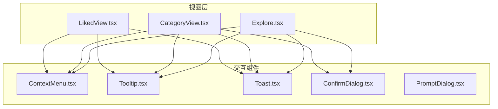
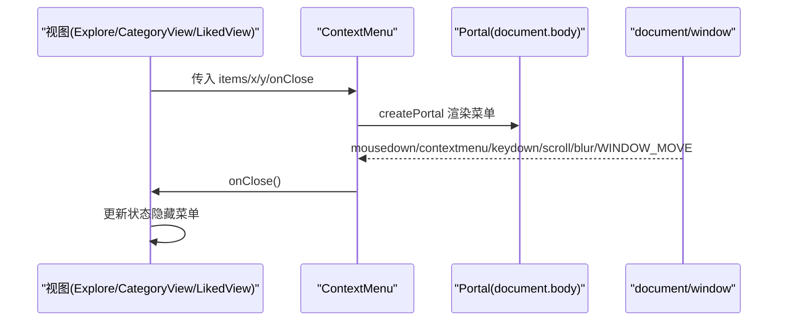
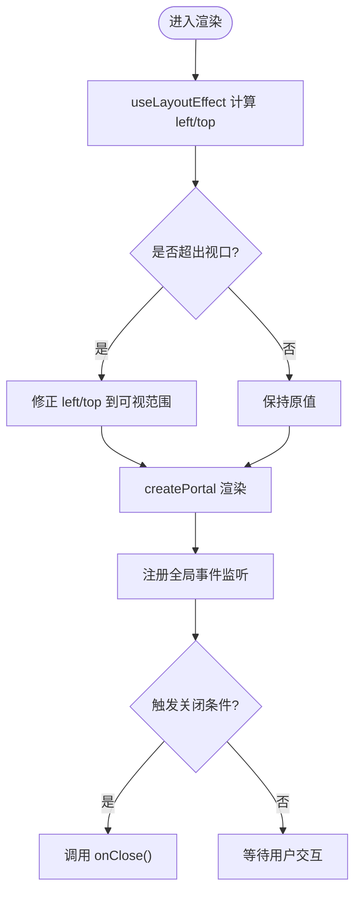
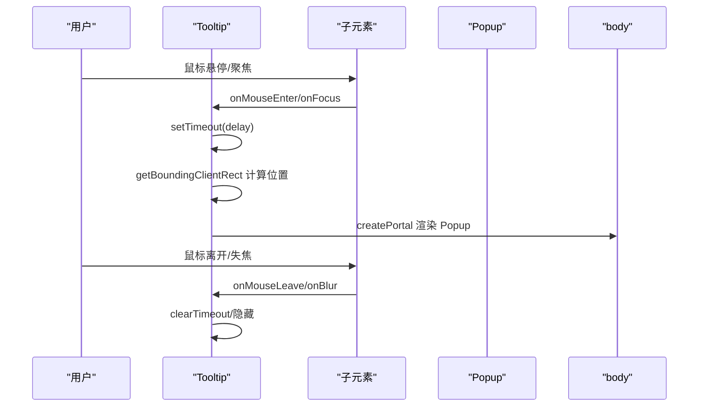
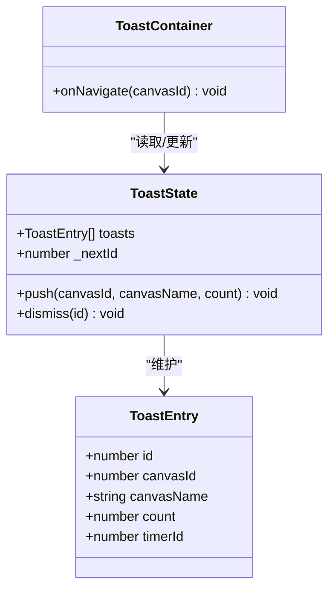
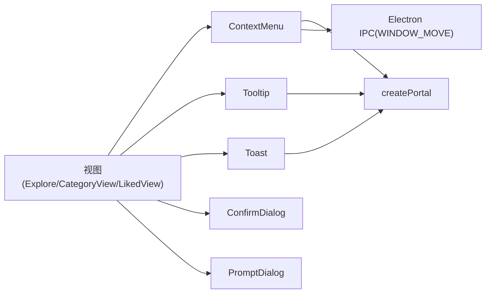

# 交互组件

<cite>
**本文引用的文件**   
- [ContextMenu.tsx](file://src/renderer/src/components/ContextMenu.tsx)
- [Tooltip.tsx](file://src/renderer/src/components/Tooltip.tsx)
- [Toast.tsx](file://src/renderer/src/components/Toast.tsx)
- [ConfirmDialog.tsx](file://src/renderer/src/components/ConfirmDialog.tsx)
- [PromptDialog.tsx](file://src/renderer/src/components/PromptDialog.tsx)
- [Explore.tsx](file://src/renderer/src/views/Explore.tsx)
- [CategoryView.tsx](file://src/renderer/src/views/CategoryView.tsx)
- [LikedView.tsx](file://src/renderer/src/views/LikedView.tsx)
</cite>

## 目录
1. [简介](#简介)
2. [项目结构](#项目结构)
3. [核心组件](#核心组件)
4. [架构总览](#架构总览)
5. [详细组件分析](#详细组件分析)
6. [依赖关系分析](#依赖关系分析)
7. [性能与体验优化](#性能与体验优化)
8. [故障排查指南](#故障排查指南)
9. [结论](#结论)
10. [附录：使用示例与最佳实践](#附录使用示例与最佳实践)

## 简介
本文件为 Serendip 应用的通用交互组件文档，覆盖上下文菜单、工具提示、消息通知（Toast）、确认对话框与提示对话框。内容包含组件属性配置、事件回调、行为定制、定位算法、层级管理、动画效果、键盘导航与屏幕阅读器兼容性说明，以及主题定制与样式覆盖方法，并提供集成指南与最佳实践。

## 项目结构
交互组件位于渲染进程的前端代码中，采用 React + Tailwind CSS 实现，并通过 createPortal 将浮层挂载到 document.body，避免被父级容器裁剪或 z-index 干扰。各视图通过状态驱动展示这些组件。

图表来源
- [Explore.tsx:320-430](file://src/renderer/src/views/Explore.tsx#L320-L430)
- [CategoryView.tsx:250-414](file://src/renderer/src/views/CategoryView.tsx#L250-L414)
- [LikedView.tsx:200-316](file://src/renderer/src/views/LikedView.tsx#L200-L316)
- [ContextMenu.tsx:1-166](file://src/renderer/src/components/ContextMenu.tsx#L1-L166)
- [Tooltip.tsx:1-98](file://src/renderer/src/components/Tooltip.tsx#L1-L98)
- [Toast.tsx:1-109](file://src/renderer/src/components/Toast.tsx#L1-L109)
- [ConfirmDialog.tsx:1-76](file://src/renderer/src/components/ConfirmDialog.tsx#L1-L76)
- [PromptDialog.tsx:1-113](file://src/renderer/src/components/PromptDialog.tsx#L1-L113)

章节来源
- [Explore.tsx:320-430](file://src/renderer/src/views/Explore.tsx#L320-L430)
- [CategoryView.tsx:250-414](file://src/renderer/src/views/CategoryView.tsx#L250-L414)
- [LikedView.tsx:200-316](file://src/renderer/src/views/LikedView.tsx#L200-L316)

## 核心组件
本节概述各组件的职责、关键属性、事件回调与行为特性。

- 上下文菜单（ContextMenu）
  - 职责：在指定坐标显示可操作的菜单项，支持分隔符、标题行、图标、危险样式、子菜单展开。
  - 关键属性：位置 x/y、items 数组、关闭回调 onClose、placement 定位策略、子菜单关闭回调 onSubmenuClose。
  - 行为：点击外部区域、滚动、窗口移动、失焦、按 Escape 时关闭；hover 延迟打开子菜单；自动边界修正。
  - 无障碍：根节点 role="menu"，菜单项 role="menuitem"，分隔符 role="separator"。

- 工具提示（Tooltip）
  - 职责：为任意子元素提供悬浮提示，支持四侧定位与延迟显示。
  - 关键属性：text、children、side、delay。
  - 行为：通过 cloneElement 注入 hover/focus 等事件；计算相对位置并 portal 渲染；无文本时直接透传 children。
  - 无障碍：不改变子元素语义，适合增强型提示。

- 消息通知（Toast）
  - 职责：以轻量气泡形式反馈操作结果，支持合并计数与跳转。
  - 状态管理：基于 zustand store，提供 push/dismiss 方法与便捷工厂函数。
  - 行为：同一画布在短时间内重复触发会合并计数并重置计时器；点击“前往”后导航并关闭。
  - 渲染：固定底部居中，portal 渲染，z-index 较高。

- 确认对话框（ConfirmDialog）
  - 职责：二次确认弹窗，支持危险样式。
  - 关键属性：title、message、confirmLabel、cancelLabel、danger、onConfirm、onCancel。
  - 行为：Esc 取消、Enter 确认；点击遮罩取消；阻止默认浏览器行为。

- 提示对话框（PromptDialog）
  - 职责：单行输入对话框，用于新建/重命名等场景。
  - 关键属性：title、hint、initialValue、placeholder、confirmLabel、cancelLabel、onConfirm、onCancel。
  - 行为：自动聚焦并选中已有内容；支持同步返回错误字符串或抛出异步错误；Enter 确认、Esc 取消。

章节来源
- [ContextMenu.tsx:1-166](file://src/renderer/src/components/ContextMenu.tsx#L1-L166)
- [Tooltip.tsx:1-98](file://src/renderer/src/components/Tooltip.tsx#L1-L98)
- [Toast.tsx:1-109](file://src/renderer/src/components/Toast.tsx#L1-L109)
- [ConfirmDialog.tsx:1-76](file://src/renderer/src/components/ConfirmDialog.tsx#L1-L76)
- [PromptDialog.tsx:1-113](file://src/renderer/src/components/PromptDialog.tsx#L1-L113)

## 架构总览
交互组件遵循“受控+Portal”的架构模式：
- 受控：由上层视图的状态控制显隐与数据。
- Portal：所有浮层统一挂载至 document.body，避免被父容器裁剪或 z-index 影响。
- 事件：通过全局监听（如 mousedown、keydown、scroll、blur）保证合理的关闭时机。
- 定位：根据视口尺寸与目标坐标进行边界修正，确保始终可见。

图表来源
- [ContextMenu.tsx:73-98](file://src/renderer/src/components/ContextMenu.tsx#L73-L98)
- [ContextMenu.tsx:100-165](file://src/renderer/src/components/ContextMenu.tsx#L100-L165)
- [Explore.tsx:393-395](file://src/renderer/src/views/Explore.tsx#L393-L395)
- [CategoryView.tsx:324-326](file://src/renderer/src/views/CategoryView.tsx#L324-L326)
- [LikedView.tsx:284-286](file://src/renderer/src/views/LikedView.tsx#L284-L286)

## 详细组件分析

### 上下文菜单（ContextMenu）
- 定位算法
  - placement 支持 cursor 与 top 两种策略。
  - 使用 useLayoutEffect 获取 DOMRect，结合 margin 做边界修正，防止溢出视口。
- 子菜单交互
  - 通过 onSubmenuOpen(rect) 接收当前菜单项的矩形，供父级决定子面板位置。
  - 使用 hoverTimer 延迟打开子菜单，离开时取消定时器。
- 关闭策略
  - 监听 document mousedown/contextmenu、window scroll、window blur、electron WINDOW_MOVE、Escape 键。
- 无障碍
  - 根节点 role="menu"，菜单项 role="menuitem"，分隔符 role="separator"。
- 样式与动画
  - 使用 Tailwind 类名设置边框、背景、阴影与圆角，配合 animate-in 动画。

图表来源
- [ContextMenu.tsx:50-71](file://src/renderer/src/components/ContextMenu.tsx#L50-L71)
- [ContextMenu.tsx:73-98](file://src/renderer/src/components/ContextMenu.tsx#L73-L98)
- [ContextMenu.tsx:100-165](file://src/renderer/src/components/ContextMenu.tsx#L100-L165)

章节来源
- [ContextMenu.tsx:1-166](file://src/renderer/src/components/ContextMenu.tsx#L1-L166)
- [Explore.tsx:322-365](file://src/renderer/src/views/Explore.tsx#L322-L365)
- [CategoryView.tsx:256-299](file://src/renderer/src/views/CategoryView.tsx#L256-L299)
- [LikedView.tsx:217-251](file://src/renderer/src/views/LikedView.tsx#L217-L251)

### 工具提示（Tooltip）
- 定位算法
  - 根据 side 选择 top/right/bottom/left，计算相对于触发元素的中心点偏移，GAP 常量控制间距。
- 显示逻辑
  - 通过 delay 延迟显示，鼠标/指针/焦点事件触发 show/hide。
  - 使用 cloneElement 注入事件，无需修改子组件。
- 渲染
  - 使用 createPortal 渲染到 body，z-index 较高，pointer-events-none 避免遮挡交互。

图表来源
- [Tooltip.tsx:55-75](file://src/renderer/src/components/Tooltip.tsx#L55-L75)
- [Tooltip.tsx:81-97](file://src/renderer/src/components/Tooltip.tsx#L81-L97)

章节来源
- [Tooltip.tsx:1-98](file://src/renderer/src/components/Tooltip.tsx#L1-L98)

### 消息通知（Toast）
- 状态设计
  - toasts 列表记录每个通知的 id、画布标识、名称、计数、定时器 id。
  - _nextId 自增生成唯一 id。
- 合并策略
  - 同一画布的 toast 在 MERGE_WINDOW 内重复触发则合并计数并重置 TTL 计时器。
- 生命周期
  - TOAST_TTL 到期自动 dismiss；手动点击“前往”后导航并 dismiss。
- 渲染
  - 固定底部居中，portal 渲染，z-index 高，pointer-events 合理分配。

图表来源
- [Toast.tsx:4-17](file://src/renderer/src/components/Toast.tsx#L4-L17)
- [Toast.tsx:22-64](file://src/renderer/src/components/Toast.tsx#L22-L64)
- [Toast.tsx:72-105](file://src/renderer/src/components/Toast.tsx#L72-L105)

章节来源
- [Toast.tsx:1-109](file://src/renderer/src/components/Toast.tsx#L1-L109)

### 确认对话框（ConfirmDialog）
- 交互
  - Esc 取消、Enter 确认；点击遮罩取消。
- 样式
  - danger 模式下确认按钮变红，其余使用主题色。
- 无障碍
  - 作为模态框，建议上层在打开时聚焦到第一个可交互元素（当前未内置 focus trap）。

章节来源
- [ConfirmDialog.tsx:1-76](file://src/renderer/src/components/ConfirmDialog.tsx#L1-L76)
- [CategoryView.tsx:348-410](file://src/renderer/src/views/CategoryView.tsx#L348-L410)

### 提示对话框（PromptDialog）
- 交互
  - 自动聚焦并选中初始值；Enter 提交、Esc 取消。
- 校验
  - onConfirm 可返回字符串错误（同步）或抛出错误（异步），内部捕获并显示错误信息。
- 可用性
  - 空值禁用确认按钮；busy 状态防重复提交。

章节来源
- [PromptDialog.tsx:1-113](file://src/renderer/src/components/PromptDialog.tsx#L1-L113)

## 依赖关系分析
- 组件间耦合
  - 视图层仅通过 props 与交互组件通信，组件之间无直接依赖，符合松耦合原则。
- 外部依赖
  - createPortal 用于脱离父容器渲染。
  - clsx 用于条件样式拼接。
  - zustand 用于 Toast 状态管理。
  - lucide-react 提供图标（在上下文菜单中使用）。
- 事件总线
  - 上下文菜单订阅 Electron IPC 窗口移动事件，确保窗口移动时及时关闭。

图表来源
- [ContextMenu.tsx:87-94](file://src/renderer/src/components/ContextMenu.tsx#L87-L94)
- [Toast.tsx:1-2](file://src/renderer/src/components/Toast.tsx#L1-L2)
- [Explore.tsx:393-395](file://src/renderer/src/views/Explore.tsx#L393-L395)
- [CategoryView.tsx:324-326](file://src/renderer/src/views/CategoryView.tsx#L324-L326)
- [LikedView.tsx:284-286](file://src/renderer/src/views/LikedView.tsx#L284-L286)

章节来源
- [ContextMenu.tsx:1-166](file://src/renderer/src/components/ContextMenu.tsx#L1-L166)
- [Toast.tsx:1-109](file://src/renderer/src/components/Toast.tsx#L1-L109)
- [Explore.tsx:320-430](file://src/renderer/src/views/Explore.tsx#L320-L430)
- [CategoryView.tsx:250-414](file://src/renderer/src/views/CategoryView.tsx#L250-L414)
- [LikedView.tsx:200-316](file://src/renderer/src/views/LikedView.tsx#L200-L316)

## 性能与体验优化
- 定位与重排
  - 上下文菜单使用 useLayoutEffect 在布局阶段计算位置，减少闪烁。
  - Tooltip 使用 getBoundingClientRect 计算位置，建议在频繁移动场景中考虑节流。
- 事件与内存
  - 所有全局事件监听均在卸载时移除，避免内存泄漏。
  - 定时器在 hide/unmount 时清理，避免悬挂任务。
- 渲染优化
  - 使用 createPortal 避免父容器 overflow 裁剪与 z-index 冲突。
  - Toast 合并策略降低 UI 抖动与重绘次数。
- 动画
  - 使用 Tailwind animate-in 提供入场动画，注意在低端设备上适当降级。

[本节为通用指导，不直接分析具体文件]

## 故障排查指南
- 上下文菜单无法关闭
  - 检查是否在父容器上设置了 pointer-events 或 z-index 导致事件冒泡异常。
  - 确认 onClose 回调是否正确更新视图状态。
- 子菜单无法展开
  - 检查 onSubmenuOpen 是否收到 rect，并确保父级正确设置 picker 状态。
  - 确认 onSubmenuClose 在非子菜单项 hover 时被调用。
- 工具提示不显示
  - 确认 text 非空；检查子元素是否可接收鼠标/焦点事件。
  - 若子元素被其他元素遮挡，调整 z-index 或父容器 overflow。
- Toast 未合并
  - 确认多次 push 的 canvasId 一致且在 MERGE_WINDOW 内。
- 对话框键盘不可用
  - 确认焦点在对话框内；如需完整键盘导航，可增加 focus trap 与 Tab 循环。

章节来源
- [ContextMenu.tsx:73-98](file://src/renderer/src/components/ContextMenu.tsx#L73-L98)
- [Tooltip.tsx:55-75](file://src/renderer/src/components/Tooltip.tsx#L55-L75)
- [Toast.tsx:26-51](file://src/renderer/src/components/Toast.tsx#L26-L51)
- [ConfirmDialog.tsx:31-38](file://src/renderer/src/components/ConfirmDialog.tsx#L31-L38)
- [PromptDialog.tsx:38-56](file://src/renderer/src/components/PromptDialog.tsx#L38-L56)

## 结论
Serendip 的交互组件采用统一的受控与 Portal 模式，具备完善的定位、层级管理与事件处理机制。通过清晰的属性与回调接口，开发者可以快速集成上下文菜单、工具提示、消息通知、确认与提示对话框，并在无障碍与用户体验方面获得良好基础。后续可在键盘导航与焦点管理方面进一步增强，以提升全键盘与辅助技术用户的体验。

[本节为总结性内容，不直接分析具体文件]

## 附录：使用示例与最佳实践

- 上下文菜单集成要点
  - 在视图中维护 menu 状态，包含 x/y 与 item 信息。
  - 构建 items 数组，必要时使用 divider/header/icon/danger 等字段。
  - 对需要子菜单的项，实现 onSubmenuOpen(rect)，并将 submenuOpen 状态回写。
  - 在点击外部区域或滚动时关闭菜单，确保 onSubmenuClose 清理子面板状态。
  - 参考路径：
    - [Explore.tsx:322-365](file://src/renderer/src/views/Explore.tsx#L322-L365)
    - [CategoryView.tsx:256-299](file://src/renderer/src/views/CategoryView.tsx#L256-L299)
    - [LikedView.tsx:217-251](file://src/renderer/src/views/LikedView.tsx#L217-L251)

- 工具提示集成要点
  - 将 Tooltip 包裹在任意可交互元素外，传入 text 与 side。
  - 若需自定义延迟，设置 delay 属性。
  - 参考路径：
    - [Tooltip.tsx:50-97](file://src/renderer/src/components/Tooltip.tsx#L50-L97)

- 消息通知集成要点
  - 在 App 根节点渲染 ToastContainer，并传入 onNavigate 回调。
  - 在业务逻辑中调用 pushCanvasToast(canvasId, canvasName, count)。
  - 参考路径：
    - [Toast.tsx:67-105](file://src/renderer/src/components/Toast.tsx#L67-L105)

- 确认对话框集成要点
  - 在视图中维护 confirm 状态，渲染 ConfirmDialog 并绑定 onConfirm/onCancel。
  - 危险操作设置 danger 以红色强调。
  - 参考路径：
    - [CategoryView.tsx:348-410](file://src/renderer/src/views/CategoryView.tsx#L348-L410)

- 提示对话框集成要点
  - 在视图中维护 prompt 状态，渲染 PromptDialog 并实现 onConfirm 校验逻辑。
  - 支持同步返回错误字符串或抛出异步错误。
  - 参考路径：
    - [PromptDialog.tsx:23-112](file://src/renderer/src/components/PromptDialog.tsx#L23-L112)

- 主题定制与样式覆盖
  - 组件大量使用 Tailwind 语义化颜色与边框变量（如 border-border、bg-background、text-foreground、bg-primary 等），可通过主题变量或 Tailwind 配置覆盖。
  - 对于危险操作，使用红色系（如 bg-red-500）强调风险。
  - 通过 className 与 clsx 组合动态切换样式，便于在不同上下文中微调外观。

- 键盘导航与屏幕阅读器兼容
  - 上下文菜单已设置 role="menu"/role="menuitem"/role="separator"，建议在上层增加箭头键导航与焦点管理。
  - 对话框支持 Esc/Enter，建议增加 focus trap 与 Tab 循环，提升键盘可达性。
  - 工具提示为增强型提示，不影响主流程，但应避免承载关键信息。

[本节为使用指南与最佳实践，不直接分析具体文件]