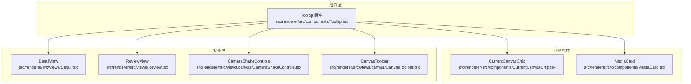
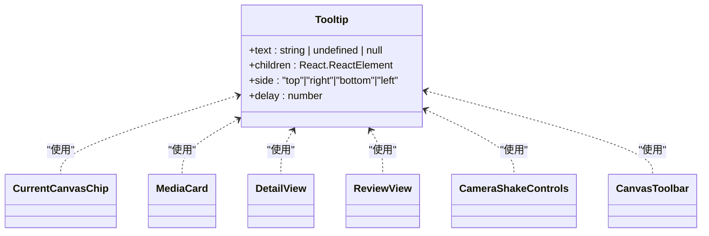
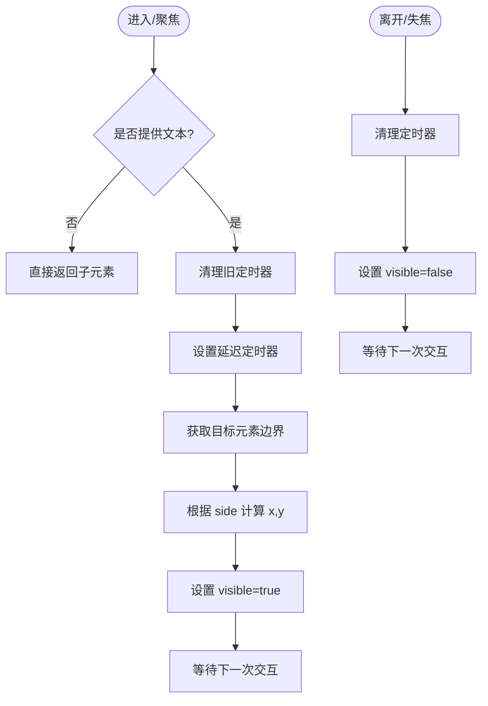
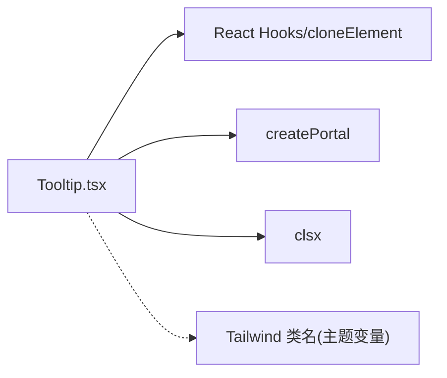

# 工具提示

<cite>
**本文引用的文件**   
- [Tooltip.tsx](file://src/renderer/src/components/Tooltip.tsx)
- [CurrentCanvasChip.tsx](file://src/renderer/src/components/CurrentCanvasChip.tsx)
- [MediaCard.tsx](file://src/renderer/src/components/MediaCard.tsx)
- [Detail.tsx](file://src/renderer/src/views/Detail.tsx)
- [Review.tsx](file://src/renderer/src/views/Review.tsx)
- [CameraShakeControls.tsx](file://src/renderer/src/views/canvas/CameraShakeControls.tsx)
- [CanvasToolbar.tsx](file://src/renderer/src/views/canvas/CanvasToolbar.tsx)
</cite>

## 目录
1. [简介](#简介)
2. [项目结构](#项目结构)
3. [核心组件](#核心组件)
4. [架构总览](#架构总览)
5. [详细组件分析](#详细组件分析)
6. [依赖关系分析](#依赖关系分析)
7. [性能与动画](#性能与动画)
8. [无障碍与键盘支持](#无障碍与键盘支持)
9. [样式与主题适配](#样式与主题适配)
10. [集成指南](#集成指南)
11. [常见问题排查](#常见问题排查)
12. [结论](#结论)

## 简介
本文件为 Serendip 应用中的 Tooltip（工具提示）组件提供全面文档。内容涵盖设计理念、触发方式、显示逻辑、属性配置、定位算法、在不同屏幕尺寸和滚动状态下的表现、使用示例、键盘无障碍访问支持、动画效果与性能优化策略，以及自定义样式与主题适配方法，并给出集成指南与常见问题解决方案。

## 项目结构
Tooltip 组件位于渲染进程 UI 层，被多个页面与业务组件广泛使用，用于在按钮、图标等交互元素上提供轻量级说明信息。

图表来源
- [Tooltip.tsx:1-98](file://src/renderer/src/components/Tooltip.tsx#L1-L98)
- [CurrentCanvasChip.tsx:1-73](file://src/renderer/src/components/CurrentCanvasChip.tsx#L1-L73)
- [MediaCard.tsx:1-614](file://src/renderer/src/components/MediaCard.tsx#L1-L614)
- [Detail.tsx:1-800](file://src/renderer/src/views/Detail.tsx#L1-L800)
- [Review.tsx:1-507](file://src/renderer/src/views/Review.tsx#L1-L507)
- [CameraShakeControls.tsx:1-155](file://src/renderer/src/views/canvas/CameraShakeControls.tsx#L1-L155)
- [CanvasToolbar.tsx:1-94](file://src/renderer/src/views/canvas/CanvasToolbar.tsx#L1-L94)

章节来源
- [Tooltip.tsx:1-98](file://src/renderer/src/components/Tooltip.tsx#L1-L98)

## 核心组件
Tooltip 组件通过包裹子元素，自动注入 hover/focus 事件，并在延迟后计算位置，将提示浮层以 Portal 形式挂载到 document.body，避免层级与裁剪问题。

- 设计要点
  - 非侵入式：通过 cloneElement 向子元素注入事件，不要求子元素做任何修改。
  - 可配置侧边：支持 top/right/bottom/left 四种方向。
  - 可配置延迟：默认 600ms，避免误触抖动。
  - 固定层级与不可穿透：z-index 较高且 pointer-events-none，确保不会拦截下层交互。
  - 基于 getBoundingClientRect 的简单定位：根据目标元素的边界框计算中心或边缘坐标，按 GAP 偏移。

- 关键实现路径
  - 组件入口与属性定义：[Tooltip.tsx:5-11](file://src/renderer/src/components/Tooltip.tsx#L5-L11)
  - 弹出层渲染与定位样式：[Tooltip.tsx:19-44](file://src/renderer/src/components/Tooltip.tsx#L19-L44)
  - 显示/隐藏控制与定时器管理：[Tooltip.tsx:50-77](file://src/renderer/src/components/Tooltip.tsx#L50-L77)
  - 事件注入与 Portal 挂载：[Tooltip.tsx:79-97](file://src/renderer/src/components/Tooltip.tsx#L79-L97)

章节来源
- [Tooltip.tsx:5-11](file://src/renderer/src/components/Tooltip.tsx#L5-L11)
- [Tooltip.tsx:19-44](file://src/renderer/src/components/Tooltip.tsx#L19-L44)
- [Tooltip.tsx:50-77](file://src/renderer/src/components/Tooltip.tsx#L50-L77)
- [Tooltip.tsx:79-97](file://src/renderer/src/components/Tooltip.tsx#L79-L97)

## 架构总览
Tooltip 作为通用 UI 原子组件，被多处业务组件复用，形成“组件 → 业务组件 → 视图”的单向依赖关系。

图表来源
- [Tooltip.tsx:1-98](file://src/renderer/src/components/Tooltip.tsx#L1-L98)
- [CurrentCanvasChip.tsx:1-73](file://src/renderer/src/components/CurrentCanvasChip.tsx#L1-L73)
- [MediaCard.tsx:1-614](file://src/renderer/src/components/MediaCard.tsx#L1-L614)
- [Detail.tsx:1-800](file://src/renderer/src/views/Detail.tsx#L1-L800)
- [Review.tsx:1-507](file://src/renderer/src/views/Review.tsx#L1-L507)
- [CameraShakeControls.tsx:1-155](file://src/renderer/src/views/canvas/CameraShakeControls.tsx#L1-L155)
- [CanvasToolbar.tsx:1-94](file://src/renderer/src/views/canvas/CanvasToolbar.tsx#L1-L94)

## 详细组件分析

### Tooltip 组件内部流程
- 触发与显示
  - 鼠标进入/指针离开/焦点进入/失焦时调用 show/hide。
  - show 中先清理可能存在的旧定时器，再设置新定时器；到期后读取目标元素边界，计算 x/y 并更新可见性。
- 隐藏与清理
  - hide 立即清除定时器并隐藏。
  - 组件卸载时清理残留定时器，防止内存泄漏。
- 定位算法
  - 水平方向（left/right）：y 取元素垂直中心，x 取左/右边缘 ± GAP。
  - 垂直方向（top/bottom）：x 取元素水平中心，y 取上/下边缘 ± GAP。
  - 使用 fixed 定位并通过 transform 做视觉居中修正。
- 渲染与层级
  - 使用 createPortal 将浮层挂载到 document.body，避免父容器 overflow/transform 影响。
  - 浮层 z-index 较高且 pointer-events-none，保证不干扰下层交互。

图表来源
- [Tooltip.tsx:50-77](file://src/renderer/src/components/Tooltip.tsx#L50-L77)
- [Tooltip.tsx:79-97](file://src/renderer/src/components/Tooltip.tsx#L79-L97)

章节来源
- [Tooltip.tsx:50-77](file://src/renderer/src/components/Tooltip.tsx#L50-L77)
- [Tooltip.tsx:79-97](file://src/renderer/src/components/Tooltip.tsx#L79-L97)

### 使用示例与集成模式
- 在按钮/图标上添加工具提示
  - 当前画布芯片：外层 Tooltip 包裹整个操作条，内层关闭按钮嵌套 Tooltip，注意阻止冒泡以避免外层 Tooltip 误触发。
    - 参考路径：[CurrentCanvasChip.tsx:38-71](file://src/renderer/src/components/CurrentCanvasChip.tsx#L38-L71)
  - 媒体卡片右下角胶囊：两个按钮分别用 Tooltip 标注“加入当前画布/新建画布并加入”和“选择画布”。
    - 参考路径：[MediaCard.tsx:523-548](file://src/renderer/src/components/MediaCard.tsx#L523-L548)
  - 详情页右侧面板开关与分类入口：Tooltip 描述功能与快捷键。
    - 参考路径：[Detail.tsx:398-411](file://src/renderer/src/views/Detail.tsx#L398-L411), [Detail.tsx:457-472](file://src/renderer/src/views/Detail.tsx#L457-L472)
  - 评审页撤销/跳过按钮：Tooltip 提示快捷键。
    - 参考路径：[Review.tsx:451-464](file://src/renderer/src/views/Review.tsx#L451-L464), [Review.tsx:467-480](file://src/renderer/src/views/Review.tsx#L467-L480)
  - 摄影机手摇控件：预设 chip 与设置齿轮均带 Tooltip。
    - 参考路径：[CameraShakeControls.tsx:74-89](file://src/renderer/src/views/canvas/CameraShakeControls.tsx#L74-L89), [CameraShakeControls.tsx:131-147](file://src/renderer/src/views/canvas/CameraShakeControls.tsx#L131-L147)
  - 画布工具栏：缩放、重排、置顶、视频冻结、手摇开关等均有 Tooltip。
    - 参考路径：[CanvasToolbar.tsx:30-37](file://src/renderer/src/views/canvas/CanvasToolbar.tsx#L30-L37), [CanvasToolbar.tsx:38-45](file://src/renderer/src/views/canvas/CanvasToolbar.tsx#L38-L45), [CanvasToolbar.tsx:47-58](file://src/renderer/src/views/canvas/CanvasToolbar.tsx#L47-L58), [CanvasToolbar.tsx:60-75](file://src/renderer/src/views/canvas/CanvasToolbar.tsx#L60-L75), [CanvasToolbar.tsx:78-89](file://src/renderer/src/views/canvas/CanvasToolbar.tsx#L78-L89)

章节来源
- [CurrentCanvasChip.tsx:38-71](file://src/renderer/src/components/CurrentCanvasChip.tsx#L38-L71)
- [MediaCard.tsx:523-548](file://src/renderer/src/components/MediaCard.tsx#L523-L548)
- [Detail.tsx:398-411](file://src/renderer/src/views/Detail.tsx#L398-L411)
- [Detail.tsx:457-472](file://src/renderer/src/views/Detail.tsx#L457-L472)
- [Review.tsx:451-464](file://src/renderer/src/views/Review.tsx#L451-L464)
- [Review.tsx:467-480](file://src/renderer/src/views/Review.tsx#L467-L480)
- [CameraShakeControls.tsx:74-89](file://src/renderer/src/views/canvas/CameraShakeControls.tsx#L74-L89)
- [CameraShakeControls.tsx:131-147](file://src/renderer/src/views/canvas/CameraShakeControls.tsx#L131-L147)
- [CanvasToolbar.tsx:30-37](file://src/renderer/src/views/canvas/CanvasToolbar.tsx#L30-L37)
- [CanvasToolbar.tsx:38-45](file://src/renderer/src/views/canvas/CanvasToolbar.tsx#L38-L45)
- [CanvasToolbar.tsx:47-58](file://src/renderer/src/views/canvas/CanvasToolbar.tsx#L47-L58)
- [CanvasToolbar.tsx:60-75](file://src/renderer/src/views/canvas/CanvasToolbar.tsx#L60-L75)
- [CanvasToolbar.tsx:78-89](file://src/renderer/src/views/canvas/CanvasToolbar.tsx#L78-L89)

### 定位算法与边界处理
- 算法概述
  - 基于目标元素的 getBoundingClientRect 计算中心点或边缘点，按 side 决定 x/y 基准。
  - 使用固定间隙 GAP 进行偏移，避免紧贴元素。
  - 通过 CSS transform 对居中进行修正，使浮层视觉上对齐。
- 已知限制
  - 未做视口越界检测与回退（如贴边溢出时翻转方向）。
  - 未监听窗口 resize 或滚动变化来动态校正位置。
- 建议改进
  - 引入视口边界检测，必要时切换 side 或调整 left/top 值。
  - 监听 scroll/resize 或在需要时主动刷新位置。
  - 考虑使用更成熟的定位库（如 Floating UI）以获得更好的跨浏览器行为。

章节来源
- [Tooltip.tsx:55-70](file://src/renderer/src/components/Tooltip.tsx#L55-L70)
- [Tooltip.tsx:19-44](file://src/renderer/src/components/Tooltip.tsx#L19-L44)

## 依赖关系分析
- 组件耦合
  - Tooltip 仅依赖 React、ReactDOM 的 createPortal 与 clsx，无业务耦合，具备高内聚低耦合特性。
- 外部依赖
  - 使用 Tailwind 类名进行样式控制，主题色通过语义化变量（如 bg-sidebar、border-border、text-foreground）体现。
- 使用方耦合
  - 各业务组件仅通过 props 传入 text/side/delay，保持最小契约。

图表来源
- [Tooltip.tsx:1-4](file://src/renderer/src/components/Tooltip.tsx#L1-L4)

章节来源
- [Tooltip.tsx:1-4](file://src/renderer/src/components/Tooltip.tsx#L1-L4)

## 性能与动画
- 性能考量
  - 延迟显示减少频繁显隐带来的重绘开销。
  - Portal 挂载至 body，避免复杂 DOM 树导致的布局抖动。
  - 浮层 pointer-events-none，避免命中测试与事件分发成本。
- 动画效果
  - 当前未实现显隐过渡动画，如需淡入淡出可在 TooltipPopup 增加 CSS transition 或使用 Framer Motion 等方案。
- 优化建议
  - 若需高频更新位置，可使用 requestAnimationFrame 节流。
  - 对大量 Tooltip 场景，考虑虚拟列表或按需挂载以减少 DOM 节点数量。

章节来源
- [Tooltip.tsx:19-44](file://src/renderer/src/components/Tooltip.tsx#L19-L44)
- [Tooltip.tsx:50-77](file://src/renderer/src/components/Tooltip.tsx#L50-L77)

## 无障碍与键盘支持
- 焦点管理
  - 组件监听 onFocus/onBlur，支持键盘 Tab 导航时显示/隐藏。
  - 子元素保留原生 title 属性的覆盖（显式设为 undefined），避免重复提示。
- 屏幕阅读器兼容性
  - 建议在可聚焦的触发元素上提供 aria-label 或 role="button"，以便读屏器正确播报。
  - 对于 Tooltip 浮层，可考虑添加 aria-live 区域或 role="tooltip"，但需注意与现有实现兼容。
- 键盘快捷键
  - 业务层已在多处提供快捷键提示（如空格、Backspace、Tab），Tooltip 负责展示这些提示文案。

章节来源
- [Tooltip.tsx:82-89](file://src/renderer/src/components/Tooltip.tsx#L82-L89)
- [Review.tsx:451-464](file://src/renderer/src/views/Review.tsx#L451-L464)
- [Review.tsx:467-480](file://src/renderer/src/views/Review.tsx#L467-L480)
- [Detail.tsx:398-411](file://src/renderer/src/views/Detail.tsx#L398-L411)

## 样式与主题适配
- 样式策略
  - 使用 Tailwind 类名组合，背景、边框、文字颜色采用语义化变量，便于跟随主题切换。
  - 固定层级 z-[300]，确保浮层不被其他组件遮挡。
- 主题适配
  - 通过 bg-sidebar、border-border、text-foreground 等变量，自动适配明暗主题。
- 自定义样式
  - 可通过覆盖 Tailwind 变量或扩展类名实现主题定制。
  - 若需更复杂的样式，可在 TooltipPopup 接收额外 className/style 参数进行透传。

章节来源
- [Tooltip.tsx:23-26](file://src/renderer/src/components/Tooltip.tsx#L23-L26)

## 集成指南
- 基本用法
  - 将 Tooltip 包裹在任意可交互元素（按钮、图标、链接）外，传入 text 与可选 side/delay。
  - 示例参考：
    - 详情面板开关：[Detail.tsx:398-411](file://src/renderer/src/views/Detail.tsx#L398-L411)
    - 评审页撤销/跳过：[Review.tsx:451-464](file://src/renderer/src/views/Review.tsx#L451-L464), [Review.tsx:467-480](file://src/renderer/src/views/Review.tsx#L467-L480)
    - 画布工具栏各项：[CanvasToolbar.tsx:30-37](file://src/renderer/src/views/canvas/CanvasToolbar.tsx#L30-L37), [CanvasToolbar.tsx:38-45](file://src/renderer/src/views/canvas/CanvasToolbar.tsx#L38-L45), [CanvasToolbar.tsx:47-58](file://src/renderer/src/views/canvas/CanvasToolbar.tsx#L47-L58), [CanvasToolbar.tsx:60-75](file://src/renderer/src/views/canvas/CanvasToolbar.tsx#L60-L75), [CanvasToolbar.tsx:78-89](file://src/renderer/src/views/canvas/CanvasToolbar.tsx#L78-L89)
- 嵌套 Tooltip 注意事项
  - 当存在嵌套 Tooltip 时，需在中间层阻止事件冒泡，避免外层 Tooltip 误触发。
  - 示例参考：[CurrentCanvasChip.tsx:58-68](file://src/renderer/src/components/CurrentCanvasChip.tsx#L58-L68)
- 与滚动/视口联动
  - 当前未自动校正溢出，建议在需要时结合滚动事件或第三方定位库进行增强。

章节来源
- [Detail.tsx:398-411](file://src/renderer/src/views/Detail.tsx#L398-L411)
- [Review.tsx:451-464](file://src/renderer/src/views/Review.tsx#L451-L464)
- [Review.tsx:467-480](file://src/renderer/src/views/Review.tsx#L467-L480)
- [CanvasToolbar.tsx:30-37](file://src/renderer/src/views/canvas/CanvasToolbar.tsx#L30-L37)
- [CanvasToolbar.tsx:38-45](file://src/renderer/src/views/canvas/CanvasToolbar.tsx#L38-L45)
- [CanvasToolbar.tsx:47-58](file://src/renderer/src/views/canvas/CanvasToolbar.tsx#L47-L58)
- [CanvasToolbar.tsx:60-75](file://src/renderer/src/views/canvas/CanvasToolbar.tsx#L60-L75)
- [CanvasToolbar.tsx:78-89](file://src/renderer/src/views/canvas/CanvasToolbar.tsx#L78-L89)
- [CurrentCanvasChip.tsx:58-68](file://src/renderer/src/components/CurrentCanvasChip.tsx#L58-L68)

## 常见问题排查
- 提示未出现
  - 检查 text 是否为空字符串或未传入；组件在未提供 text 时会直接返回子元素。
    - 参考路径：[Tooltip.tsx:79](file://src/renderer/src/components/Tooltip.tsx#L79)
- 提示闪烁或频繁显隐
  - 适当增大 delay，避免快速划过触发。
  - 检查是否存在多层 Tooltip 嵌套导致事件冲突，必要时阻止冒泡。
    - 参考路径：[CurrentCanvasChip.tsx:58-68](file://src/renderer/src/components/CurrentCanvasChip.tsx#L58-L68)
- 提示被遮挡或错位
  - 确认父容器是否有 overflow:hidden 或 transform 影响定位；Tooltip 已使用 Portal 挂载至 body，但仍可能被更高 z-index 的元素遮挡。
  - 如需更稳健的定位，建议引入视口边界检测或第三方定位库。
- 键盘无法触发
  - 确保触发元素可聚焦（如 button/a/div[tabIndex=0]），并提供合适的 aria-label。
  - 参考路径：[Tooltip.tsx:87-88](file://src/renderer/src/components/Tooltip.tsx#L87-L88)

章节来源
- [Tooltip.tsx:79](file://src/renderer/src/components/Tooltip.tsx#L79)
- [Tooltip.tsx:87-88](file://src/renderer/src/components/Tooltip.tsx#L87-L88)
- [CurrentCanvasChip.tsx:58-68](file://src/renderer/src/components/CurrentCanvasChip.tsx#L58-L68)

## 结论
Tooltip 组件以简洁、可配置、非侵入的方式为 Serendip 提供了统一的工具提示能力。其定位算法直观高效，配合 Portal 与固定层级避免了常见布局问题。针对复杂场景（如视口溢出、多弹层叠加、动画需求），可在现有基础上引入边界检测、动画过渡与更完善的无障碍支持，进一步提升用户体验与可访问性。