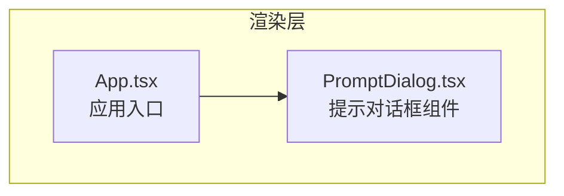
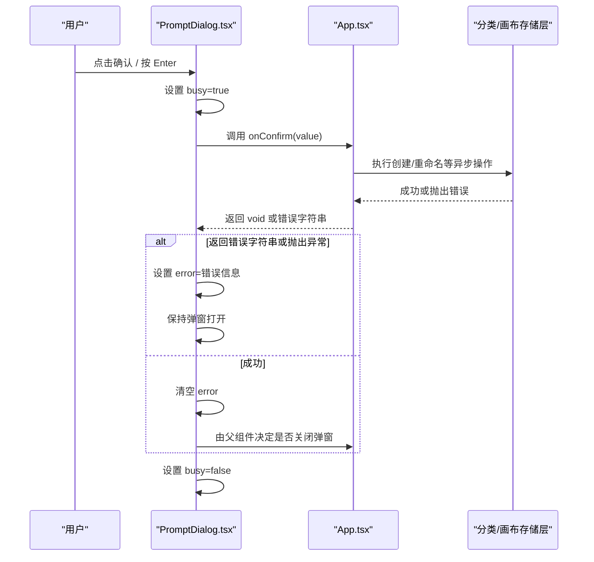

# 提示对话框

<cite>
**本文引用的文件**
- [PromptDialog.tsx](file://src/renderer/src/components/PromptDialog.tsx)
- [App.tsx](file://src/renderer/src/App.tsx)
</cite>

## 目录
1. [简介](#简介)
2. [项目结构](#项目结构)
3. [核心组件](#核心组件)
4. [架构总览](#架构总览)
5. [详细组件分析](#详细组件分析)
6. [依赖关系分析](#依赖关系分析)
7. [性能与体验优化](#性能与体验优化)
8. [故障排查指南](#故障排查指南)
9. [结论](#结论)
10. [附录：使用示例与最佳实践](#附录使用示例与最佳实践)

## 简介
本文件为 Serendip 应用的“提示对话框”组件 PromptDialog 的完整技术文档。该组件用于单行输入场景（如新建/重命名分类、画布等），提供自动聚焦、键盘交互、错误反馈与提交状态管理，并通过 onConfirm 回调支持同步或异步校验与业务处理。

## 项目结构
PromptDialog 位于渲染进程组件目录中，由应用根组件 App 在需要时条件渲染并传入标题、提示信息、默认值、占位符、按钮文案以及确认/取消回调。

图表来源
- [App.tsx:784-837](file://src/renderer/src/App.tsx#L784-L837)
- [PromptDialog.tsx:1-113](file://src/renderer/src/components/PromptDialog.tsx#L1-L113)

章节来源
- [PromptDialog.tsx:1-113](file://src/renderer/src/components/PromptDialog.tsx#L1-L113)
- [App.tsx:784-837](file://src/renderer/src/App.tsx#L784-L837)

## 核心组件
PromptDialog 是一个受控的单行输入对话框，负责：
- 展示标题、可选提示文本、输入框、错误信息、确认/取消按钮
- 自动聚焦并选中已有内容
- 支持 Enter 确认、Esc 取消
- 通过 onConfirm 返回字符串错误或抛出异常来显示错误并阻止关闭
- 通过 busy 状态防止重复提交

属性配置（Props）
- title: 必填，对话框标题
- hint: 可选，输入框上方的描述性文字
- initialValue: 可选，输入框初始值
- placeholder: 可选，输入框占位符
- confirmLabel: 可选，确认按钮文案，默认“确认”
- cancelLabel: 可选，取消按钮文案，默认“取消”
- onConfirm(value): 必填，接收当前输入值；可返回 void、字符串（表示错误）、Promise<void | string>（异步校验/操作）
- onCancel(): 必填，关闭对话框

内部状态
- value: 当前输入值
- error: 错误消息（字符串或 null）
- busy: 是否正在提交（防重复提交）
- inputRef: 指向原生 input 元素，用于聚焦与全选

章节来源
- [PromptDialog.tsx:3-14](file://src/renderer/src/components/PromptDialog.tsx#L3-L14)
- [PromptDialog.tsx:33-41](file://src/renderer/src/components/PromptDialog.tsx#L33-L41)
- [PromptDialog.tsx:43-56](file://src/renderer/src/components/PromptDialog.tsx#L43-L56)

## 架构总览
PromptDialog 作为无副作用的 UI 组件，将用户输入与业务逻辑解耦：父组件负责数据持久化与校验规则，子组件仅负责展示与交互。

图表来源
- [PromptDialog.tsx:43-56](file://src/renderer/src/components/PromptDialog.tsx#L43-L56)
- [App.tsx:404-425](file://src/renderer/src/App.tsx#L404-L425)
- [App.tsx:442-450](file://src/renderer/src/App.tsx#L442-L450)

## 详细组件分析

### 输入表单设计与数据验证机制
- 输入类型：固定为单行文本输入（type="text"）。如需密码、数字等类型，可在父组件封装一层适配，或在组件扩展 type 属性。
- 长度限制：内置最大长度限制，避免过长输入影响布局与后端处理。
- 必填检查：当输入为空（去除空白后）时，确认按钮禁用，从 UI 层面强制必填。
- 格式验证：建议由 onConfirm 实现（正则、去空格、白名单等），并将错误以字符串形式返回或由 Promise reject 抛出错误。
- 实时反馈：输入变化时清除历史错误，确保错误提示仅在必要时出现。

章节来源
- [PromptDialog.tsx:71-92](file://src/renderer/src/components/PromptDialog.tsx#L71-L92)
- [PromptDialog.tsx:103-107](file://src/renderer/src/components/PromptDialog.tsx#L103-L107)

### 属性配置详解
- 标题与提示：title 和 hint 分别用于顶部标题与输入框上方说明，提升可用性。
- 默认值与占位符：initialValue 与 placeholder 帮助引导用户快速编辑或填写。
- 按钮文案：confirmLabel/cancelLabel 便于国际化或场景化定制。
- 回调契约：onConfirm 返回值约定清晰，既支持同步也支持异步错误上报。

章节来源
- [PromptDialog.tsx:3-14](file://src/renderer/src/components/PromptDialog.tsx#L3-L14)

### 输入验证规则的实现
- 同步错误：onConfirm 直接返回错误字符串，组件将其设为 error 并阻止关闭。
- 异步错误：onConfirm 返回 Promise，若 reject 或抛出 Error，组件捕获后将 message 转为错误字符串显示。
- 空值拦截：提交前若 value.trim() 为空，确认按钮处于禁用态，避免无效提交。

章节来源
- [PromptDialog.tsx:43-56](file://src/renderer/src/components/PromptDialog.tsx#L43-L56)
- [PromptDialog.tsx:103-107](file://src/renderer/src/components/PromptDialog.tsx#L103-L107)

### 使用示例：获取用户输入与处理提交
- 新建分类：App 在 showCreate 为 true 时渲染 PromptDialog，传入标题、提示、占位符与确认回调 handleCreateCategory。handleCreateCategory 调用 createCategory，失败时返回错误字符串，成功则关闭弹窗。
- 重命名分类/画布：App 根据 renameTarget/renameCanvasTarget 渲染 PromptDialog，传入 initialValue 为当前名称，确认后调用 renameCategory/renameCanvas。

章节来源
- [App.tsx:784-794](file://src/renderer/src/App.tsx#L784-L794)
- [App.tsx:796-805](file://src/renderer/src/App.tsx#L796-L805)
- [App.tsx:828-837](file://src/renderer/src/App.tsx#L828-L837)
- [App.tsx:404-425](file://src/renderer/src/App.tsx#L404-L425)
- [App.tsx:442-450](file://src/renderer/src/App.tsx#L442-L450)

### 对话框的状态管理
- 输入状态跟踪：value 随输入实时更新。
- 错误提示显示：error 非空时在输入框下方显示错误信息。
- 提交状态反馈：busy 控制确认按钮禁用与二次提交防护。
- 父级弹窗显隐：由 App 的 showCreate、renameTarget、renameCanvasTarget 等状态控制。

章节来源
- [PromptDialog.tsx:33-41](file://src/renderer/src/components/PromptDialog.tsx#L33-L41)
- [PromptDialog.tsx:43-56](file://src/renderer/src/components/PromptDialog.tsx#L43-L56)
- [App.tsx:784-837](file://src/renderer/src/App.tsx#L784-L837)

### 键盘导航支持
- Enter 键：在输入框内触发提交。
- Esc 键：在输入框内触发取消。
- Tab 键：遵循浏览器默认行为，可在遮罩外元素间切换焦点；组件未实现自定义焦点环，但可通过外部容器配合 FocusTrap 增强无障碍体验。

章节来源
- [PromptDialog.tsx:80-88](file://src/renderer/src/components/PromptDialog.tsx#L80-L88)

### 响应式布局与移动端适配策略
- 宽度自适应：固定宽度与最大视口百分比结合，保证在小屏设备上不溢出。
- 居中遮罩：全屏半透明背景 + 垂直水平居中，适配不同屏幕尺寸。
- 触控友好：按钮与输入区域具备足够的点击面积与间距。

章节来源
- [PromptDialog.tsx:65-66](file://src/renderer/src/components/PromptDialog.tsx#L65-L66)
- [PromptDialog.tsx:60-64](file://src/renderer/src/components/PromptDialog.tsx#L60-L64)

### 动画效果与用户体验优化
- 过渡与高亮：输入框聚焦边框颜色变化，按钮 hover 与禁用态有视觉反馈。
- 防抖提交：busy 状态避免重复提交导致的竞态问题。
- 自动聚焦与全选：首次渲染即聚焦并选中已有内容，提升编辑效率。

章节来源
- [PromptDialog.tsx:38-41](file://src/renderer/src/components/PromptDialog.tsx#L38-L41)
- [PromptDialog.tsx:89-91](file://src/renderer/src/components/PromptDialog.tsx#L89-L91)
- [PromptDialog.tsx:103-107](file://src/renderer/src/components/PromptDialog.tsx#L103-L107)

### 扩展方法：自定义输入组件与验证规则
- 自定义输入类型：若需密码、数字、邮箱等类型，可在组件新增 type 属性并在 input 上绑定；同时可添加 maxLength/minLength 等约束。
- 复杂输入组件：可将输入区替换为受控的自定义组件（如带字数统计、富文本预览），仍通过 value/onChange 与组件通信。
- 统一验证器：在 onConfirm 中集中实现校验逻辑，返回错误字符串或抛出错误，保持组件职责单一。

章节来源
- [PromptDialog.tsx:71-92](file://src/renderer/src/components/PromptDialog.tsx#L71-92)
- [PromptDialog.tsx:43-56](file://src/renderer/src/components/PromptDialog.tsx#L43-L56)

## 依赖关系分析
PromptDialog 仅依赖 React 基础能力（useState/useEffect/useRef），无第三方库耦合，便于复用与测试。其父组件 App 负责业务逻辑与状态管理。

图表来源
- [App.tsx:784-837](file://src/renderer/src/App.tsx#L784-L837)
- [PromptDialog.tsx:1-2](file://src/renderer/src/components/PromptDialog.tsx#L1-L2)

章节来源
- [PromptDialog.tsx:1-2](file://src/renderer/src/components/PromptDialog.tsx#L1-L2)
- [App.tsx:784-837](file://src/renderer/src/App.tsx#L784-L837)

## 性能与体验优化
- 最小化重渲染：仅维护必要状态（value/error/busy），避免多余计算。
- 防重复提交：busy 状态在异步期间禁用确认按钮，减少并发风险。
- 输入即时纠错：每次输入变更清除错误，降低用户困惑。
- 无障碍与可访问性：建议后续增加 aria-label、role 与焦点管理以提升可访问性。

[本节为通用指导，无需源码引用]

## 故障排查指南
- 无法提交：检查 onConfirm 是否正确返回 void 或错误字符串；确认 value.trim() 不为空。
- 错误不显示：确认 onConfirm 返回的是字符串或抛出的 Error.message 能被正确捕获。
- 重复提交：确认 busy 状态未被意外重置；避免在 onConfirm 中再次触发相同操作。
- 键盘事件冲突：若页面存在全局快捷键，注意 Enter/Esc 的冒泡与默认行为。

章节来源
- [PromptDialog.tsx:43-56](file://src/renderer/src/components/PromptDialog.tsx#L43-L56)
- [PromptDialog.tsx:80-88](file://src/renderer/src/components/PromptDialog.tsx#L80-L88)

## 结论
PromptDialog 以简洁的 API 提供了健壮的输入与校验流程，适合在应用中多处复用。通过将校验与业务逻辑置于父组件，组件保持了高内聚与低耦合，易于扩展与维护。

[本节为总结，无需源码引用]

## 附录：使用示例与最佳实践

### 典型用法路径参考
- 新建分类：[App.tsx:784-794](file://src/renderer/src/App.tsx#L784-L794)
- 重命名分类：[App.tsx:796-805](file://src/renderer/src/App.tsx#L796-L805)
- 重命名画布：[App.tsx:828-837](file://src/renderer/src/App.tsx#L828-L837)
- 分类创建回调：[App.tsx:404-413](file://src/renderer/src/App.tsx#L404-L413)
- 分类重命名回调：[App.tsx:415-425](file://src/renderer/src/App.tsx#L415-L425)
- 画布重命名回调：[App.tsx:442-450](file://src/renderer/src/App.tsx#L442-L450)

### 表单处理最佳实践
- 在 onConfirm 中进行服务端/本地校验，并以字符串或错误对象返回错误信息。
- 对敏感输入进行脱敏与长度限制，避免注入与越界。
- 使用统一的错误提示样式与位置，保持一致的用户体验。
- 在异步操作中保留 busy 状态，直到成功或失败后再恢复。

### 安全性考虑
- 对用户输入进行白名单过滤与长度限制，防止恶意输入。
- 避免在错误信息中泄露堆栈或系统细节，仅展示必要的用户可读信息。
- 对于可能涉及权限的操作，在 onConfirm 中做前置权限校验。

[本节为通用指导，无需源码引用]