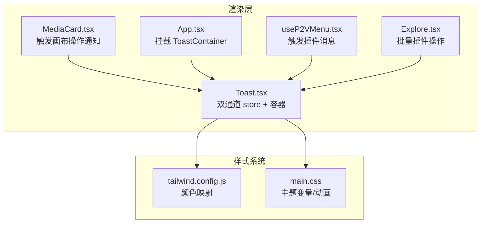
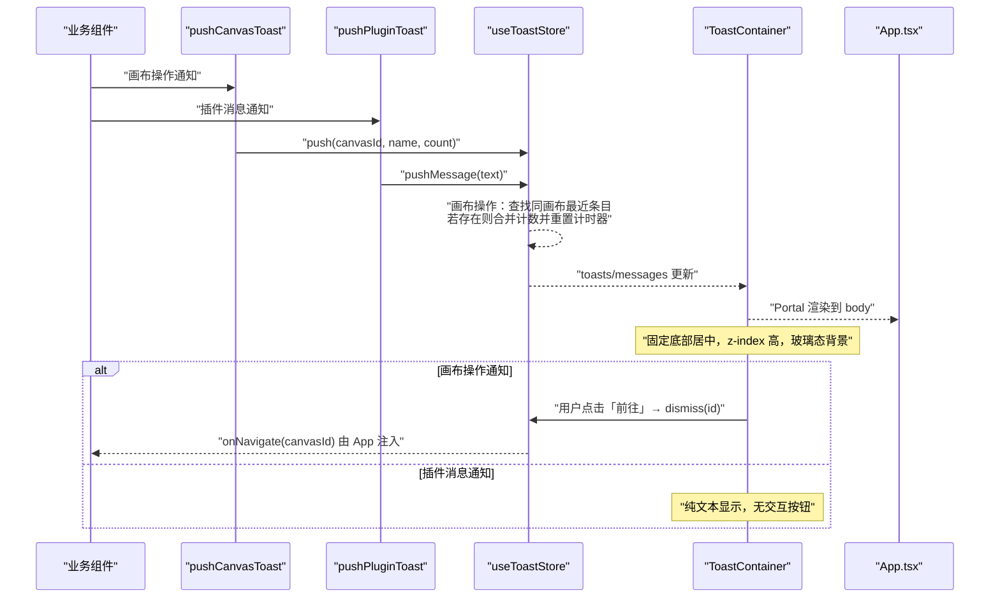
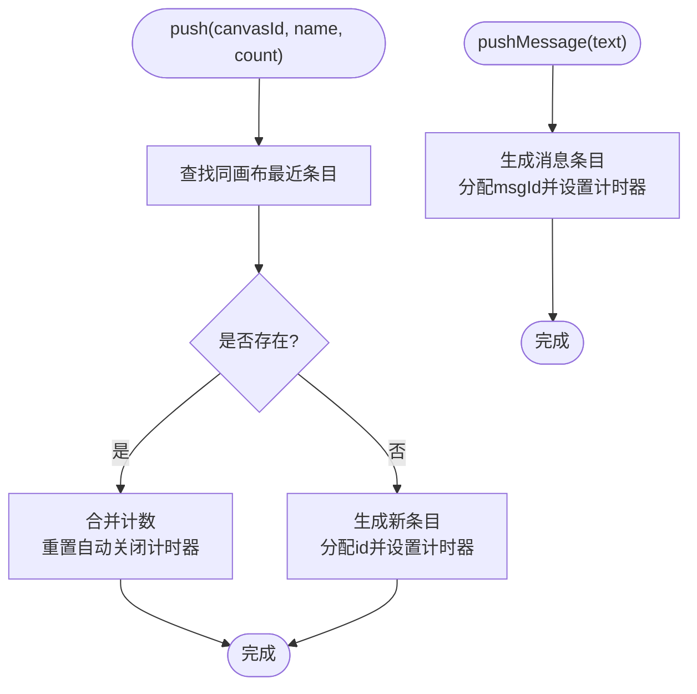
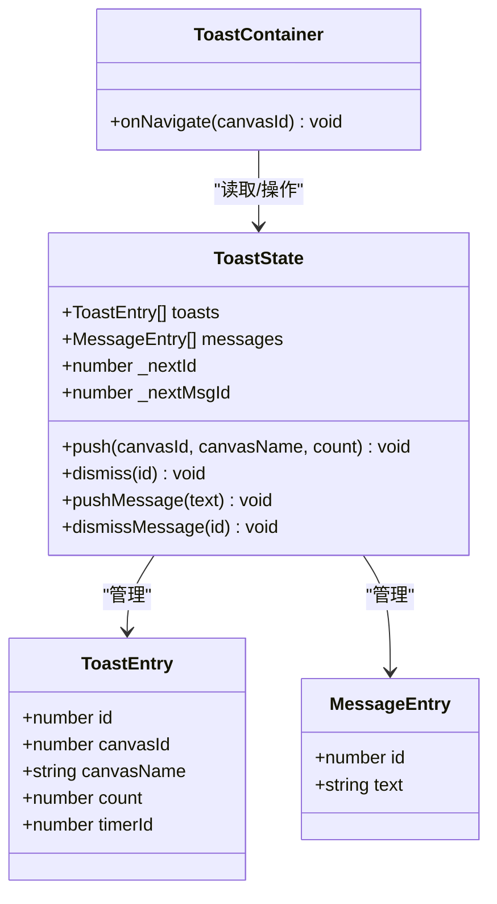
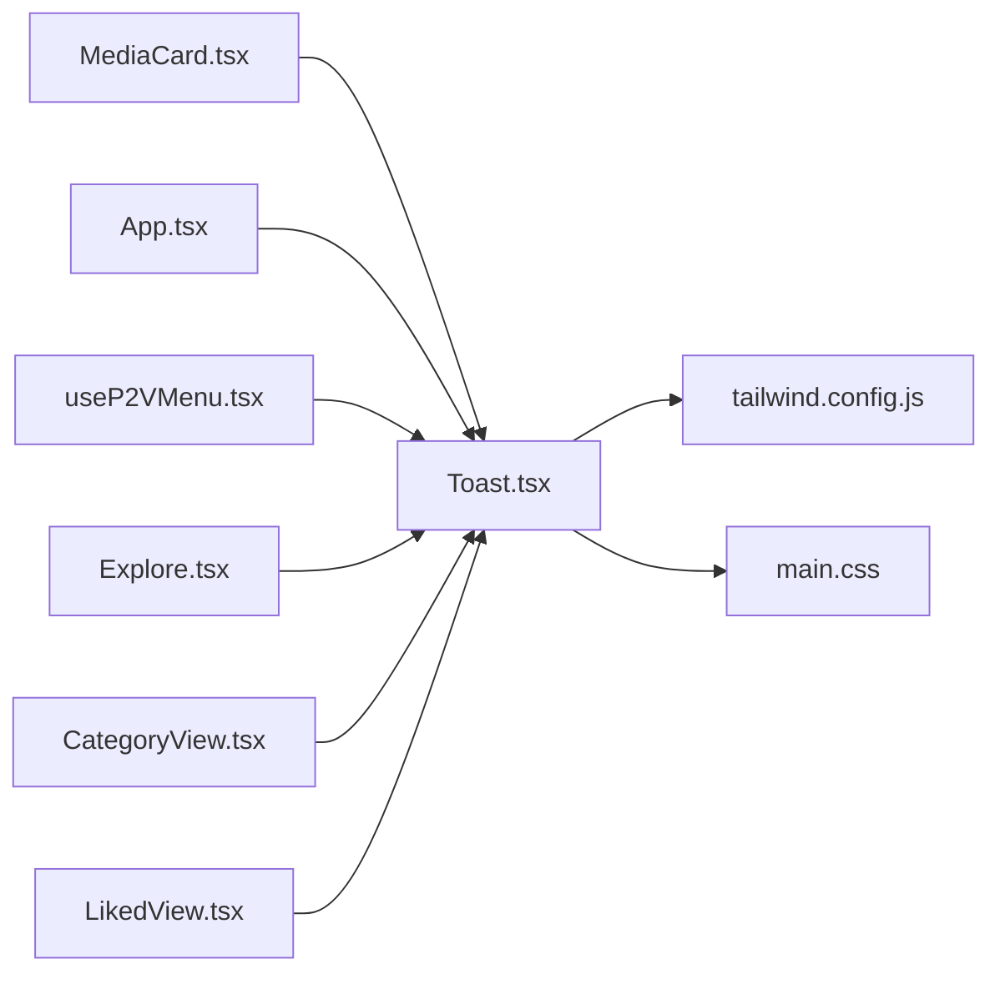

# 消息通知

<cite>
**本文引用的文件**   
- [Toast.tsx](file://src/renderer/src/components/Toast.tsx)
- [App.tsx](file://src/renderer/src/App.tsx)
- [MediaCard.tsx](file://src/renderer/src/components/MediaCard.tsx)
- [useP2VMenu.tsx](file://src/renderer/src/hooks/useP2VMenu.tsx)
- [Explore.tsx](file://src/renderer/src/views/Explore.tsx)
- [CategoryView.tsx](file://src/renderer/src/views/CategoryView.tsx)
- [LikedView.tsx](file://src/renderer/src/views/LikedView.tsx)
- [main.css](file://src/renderer/src/assets/main.css)
- [tailwind.config.js](file://tailwind.config.js)
</cite>

## 更新摘要
**变更内容**   
- 新增插件特定消息支持，扩展了消息通知系统的双通道架构
- 简化了不需要导航操作的提示界面，提供通用的 pushPluginToast API
- 增强了 Toast 组件的消息队列管理机制，支持两种不同类型的通知

## 目录
1. [简介](#简介)
2. [项目结构](#项目结构)
3. [核心组件](#核心组件)
4. [架构总览](#架构总览)
5. [详细组件分析](#详细组件分析)
6. [依赖关系分析](#依赖关系分析)
7. [性能考虑](#性能考虑)
8. [故障排查指南](#故障排查指南)
9. [结论](#结论)
10. [附录](#附录)

## 简介
本文件为 Serendip 应用的消息通知（Toast）组件提供系统化文档。内容覆盖设计模式、消息队列与合并策略、样式与视觉区分、配置项、调用方式、定位与堆叠逻辑、动画过渡、与全局状态管理的集成，以及扩展方法与最佳实践。目标是帮助开发者快速理解并高效使用通知能力，同时保证良好的用户体验与性能表现。

**更新** 消息通知系统现已支持双通道架构：传统的画布操作通知和新的插件通用消息通道，满足不同场景的反馈需求。

## 项目结构
通知功能位于渲染进程前端，采用"轻量状态 + 容器渲染"的解耦模式：
- **双通道状态管理**：通过 Zustand store 分别管理 toasts（画布操作）和 messages（插件消息）两个独立的队列。
- **工厂函数**：对外暴露 pushCanvasToast 和 pushPluginToast，供业务组件便捷调用。
- **渲染容器**：ToastContainer 挂载于应用根节点，使用 Portal 渲染到 body，避免层级与上下文污染。
- **主题与样式**：基于 Tailwind 与 CSS 变量实现玻璃态与主题切换。

**图示来源**
- [Toast.tsx:1-150](file://src/renderer/src/components/Toast.tsx#L1-L150)
- [App.tsx:864](file://src/renderer/src/App.tsx#L864)
- [useP2VMenu.tsx:77-80](file://src/renderer/src/hooks/useP2VMenu.tsx#L77-L80)
- [Explore.tsx:445-450](file://src/renderer/src/views/Explore.tsx#L445-L450)
- [tailwind.config.js:1-29](file://tailwind.config.js#L1-L29)
- [main.css:10-48](file://src/renderer/src/assets/main.css#L10-L48)

**章节来源**
- [Toast.tsx:1-150](file://src/renderer/src/components/Toast.tsx#L1-L150)
- [App.tsx:864](file://src/renderer/src/App.tsx#L864)
- [useP2VMenu.tsx:77-80](file://src/renderer/src/hooks/useP2VMenu.tsx#L77-L80)
- [Explore.tsx:445-450](file://src/renderer/src/views/Explore.tsx#L445-L450)
- [tailwind.config.js:1-29](file://tailwind.config.js#L1-L29)
- [main.css:10-48](file://src/renderer/src/assets/main.css#L10-L48)

## 核心组件
- **双通道状态与队列**
  - **画布操作通道**：每条 toast 包含唯一 id、画布标识与名称、计数、定时器 id。
  - **插件消息通道**：每条 message 包含唯一 id 和文本内容，用于简单的成功/失败提示。
  - **操作接口**：push/dismiss 处理画布操作，pushMessage/dismissMessage 处理插件消息。
  - **合并窗口**：同一画布的最近一条 toast 若在时间窗口内，则合并计数并重置自动关闭计时器。
- **统一渲染容器**
  - 使用 createPortal 将通知渲染到 document.body，固定底部居中显示，z-index 较高，避免被常规内容遮挡。
  - 画布操作通知支持点击"前往"按钮导航至对应画布。
  - 插件消息通知仅显示文本内容，无需交互操作。
- **外部接口**
  - `pushCanvasToast(canvasId, canvasName, count=1)`：画布操作统一入口。
  - `pushPluginToast(text)`：插件通用消息提示入口，不带导航按钮。

**章节来源**
- [Toast.tsx:4-26](file://src/renderer/src/components/Toast.tsx#L4-L26)
- [Toast.tsx:31-91](file://src/renderer/src/components/Toast.tsx#L31-L91)
- [Toast.tsx:94-101](file://src/renderer/src/components/Toast.tsx#L94-L101)
- [Toast.tsx:104-146](file://src/renderer/src/components/Toast.tsx#L104-L146)

## 架构总览
下图展示从业务组件触发到通知渲染与交互的完整流程，包括双通道的并行处理机制。

**图示来源**
- [Toast.tsx:94-101](file://src/renderer/src/components/Toast.tsx#L94-L101)
- [Toast.tsx:37-91](file://src/renderer/src/components/Toast.tsx#L37-L91)
- [Toast.tsx:104-146](file://src/renderer/src/components/Toast.tsx#L104-L146)
- [App.tsx:864](file://src/renderer/src/App.tsx#L864)

## 详细组件分析

### 双通道状态与队列机制
- **画布操作通道**
  - 当 push 时，先按 canvasId 查找现有条目；若找到且在合并窗口内，则合并计数并重置自动关闭定时器。
  - 未命中则创建新条目，分配自增 id，并设置自动关闭定时器。
- **插件消息通道**
  - 简单的文本消息队列，每条消息包含唯一 id 和文本内容。
  - 复用相同的 TTL 时间（2500ms），自动清理定时器。
- **出队与清理**
  - 两个通道都实现了完善的清理机制，防止内存泄漏。
- **合并窗口**
  - 通过导出 MERGE_WINDOW 常量，便于外部在需要时参考或复用该时间窗口语义。

**图示来源**
- [Toast.tsx:37-62](file://src/renderer/src/components/Toast.tsx#L37-L62)
- [Toast.tsx:77-84](file://src/renderer/src/components/Toast.tsx#L77-L84)
- [Toast.tsx:107-109](file://src/renderer/src/components/Toast.tsx#L107-L109)

**章节来源**
- [Toast.tsx:37-91](file://src/renderer/src/components/Toast.tsx#L37-L91)
- [Toast.tsx:107-109](file://src/renderer/src/components/Toast.tsx#L107-L109)

### 渲染与定位策略
- **统一定位**
  - 使用 fixed 定位，底部距底边一定间距，水平居中（translateX(-50%)），z-index 较高，确保不被常规内容遮挡。
- **智能堆叠**
  - 多条目以纵向堆叠排列，间距一致，避免重叠。
  - 画布操作通知和插件消息通知在同一容器中混合显示。
- **差异化交互**
  - 画布操作通知右侧提供"前往"按钮，点击后关闭通知并跳转到目标画布。
  - 插件消息通知仅显示文本内容，无需额外交互。
- **透明与层级**
  - 使用 Portal 渲染到 body，避免父级 overflow/transform 等上下文影响。

**图示来源**
- [Toast.tsx:4-26](file://src/renderer/src/components/Toast.tsx#L4-L26)
- [Toast.tsx:31-91](file://src/renderer/src/components/Toast.tsx#L31-L91)
- [Toast.tsx:104-146](file://src/renderer/src/components/Toast.tsx#L104-L146)

**章节来源**
- [Toast.tsx:104-146](file://src/renderer/src/components/Toast.tsx#L104-L146)

### 样式与视觉区分
- **统一外观**
  - 两种通知类型共享相同的视觉风格：圆角胶囊形状，半透明玻璃背景，模糊效果，阴影增强层次。
  - 文本使用前景色，保持视觉一致性。
- **主题适配**
  - 通过 CSS 变量定义亮/暗主题下的前景、背景、边框、玻璃态等颜色，Tailwind 中映射为语义化颜色类名。
- **动画效果**
  - 使用 animate-in 类触发入场动画（具体动画由构建产物中的样式生效），配合 backdrop-blur 提升质感。

**章节来源**
- [Toast.tsx:117-142](file://src/renderer/src/components/Toast.tsx#L117-L142)
- [main.css:10-48](file://src/renderer/src/assets/main.css#L10-L48)
- [tailwind.config.js:9-24](file://tailwind.config.js#L9-L24)

### 配置选项说明
- **画布操作通知**
  - 根据 count 动态拼接文案，单条与多条分别显示不同提示语。
  - 自动关闭时长由 TOAST_TTL 控制，单位毫秒。
  - 每次 push 都会设置新的定时器；合并时会重置已有计时器。
  - 提供"前往"按钮，点击后关闭通知并跳转目标画布。
- **插件消息通知**
  - 简单文本消息，直接显示传入的 text 参数。
  - 复用相同的 TOAST_TTL 时间（2500ms）。
  - 无需用户交互，自动消失。
- **合并窗口**
  - MERGE_WINDOW 用于描述合并判定窗口，便于外部参考。

**章节来源**
- [Toast.tsx:19-20](file://src/renderer/src/components/Toast.tsx#L19-L20)
- [Toast.tsx:26-51](file://src/renderer/src/components/Toast.tsx#L26-L51)
- [Toast.tsx:77-84](file://src/renderer/src/components/Toast.tsx#L77-L84)
- [Toast.tsx:107-109](file://src/renderer/src/components/Toast.tsx#L107-L109)

### 调用示例与批量处理
- **画布操作通知**
  - 在 MediaCard 中添加单个媒体到画布后，调用 pushCanvasToast 传入画布 id、名称与数量 1。
  - 在 App 中将多个文件加入目标画布后，一次性调用 pushCanvasToast 传入数量 > 1，以聚合反馈。
- **插件消息通知**
  - 在 P2V 工作流操作中，成功时调用 `pushPluginToast('已发送到 P2V · 工作流名称')`。
  - 失败时调用 `pushPluginToast('发送到 P2V 失败，请稍后重试')`。
- **注意事项**
  - 建议在异步操作成功后再调用通知，避免误报。
  - 频繁触发相同画布的通知会被合并，无需额外去重逻辑。
  - 插件消息适合简单的状态反馈，复杂操作建议使用画布操作通知。

**章节来源**
- [MediaCard.tsx:300-350](file://src/renderer/src/components/MediaCard.tsx#L300-L350)
- [App.tsx:368](file://src/renderer/src/App.tsx#L368)
- [useP2VMenu.tsx:77-80](file://src/renderer/src/hooks/useP2VMenu.tsx#L77-L80)
- [Explore.tsx:445-450](file://src/renderer/src/views/Explore.tsx#L445-L450)

### 动画过渡与用户体验优化
- **统一动画**
  - 使用 animate-in 类触发进入动画，结合玻璃态与阴影营造轻提示感。
- **智能停留**
  - 自动关闭前保持可见，用户可随时点击"前往"提前关闭画布操作通知。
  - 插件消息通知自动消失，不干扰用户操作。
- **防遮挡**
  - 固定定位与高 z-index 确保不被常规内容覆盖；Portal 渲染避免父级 transform/overflow 干扰。
- **可读性**
  - 文案简洁明确，按钮文案清晰，颜色对比度符合主题。

**章节来源**
- [Toast.tsx:117-142](file://src/renderer/src/components/Toast.tsx#L117-L142)

### 与全局状态管理的集成
- **状态库**
  - 使用 Zustand 创建 useToastStore，集中管理 toasts 列表与 messages 列表及操作。
- **组件订阅**
  - ToastContainer 仅订阅相关字段，减少不必要的重渲染。
- **外部访问**
  - 通过工厂函数直接访问 store 的 getState 进行写入，避免跨组件传递回调。

**章节来源**
- [Toast.tsx:1-2](file://src/renderer/src/components/Toast.tsx#L1-L2)
- [Toast.tsx:31-91](file://src/renderer/src/components/Toast.tsx#L31-L91)
- [Toast.tsx:94-101](file://src/renderer/src/components/Toast.tsx#L94-L101)

### 自定义通知类型与样式的扩展方法
- **扩展思路**
  - 在 MessageEntry 中增加 type 字段，并在渲染分支中根据 type 选择不同样式与文案。
  - 在 pushMessage 接口中增加 type 参数，或在外部封装不同语义的工厂函数（如 pushSuccess/pushError）。
- **样式定制**
  - 通过 Tailwind 颜色变量与 glass 类组合，快速实现成功、错误、警告、信息等差异化风格。
- **行为定制**
  - 针对不同通知类型可调整 TOAST_TTL 或是否允许交互操作。

**章节来源**
- [Toast.tsx:12-15](file://src/renderer/src/components/Toast.tsx#L12-L15)
- [Toast.tsx:117-142](file://src/renderer/src/components/Toast.tsx#L117-L142)
- [tailwind.config.js:9-24](file://tailwind.config.js#L9-L24)

## 依赖关系分析
- **组件耦合**
  - MediaCard 与 App 均依赖 pushCanvasToast 与 ToastContainer，形成松耦合的单向数据流。
  - 插件相关组件（useP2VMenu、Explore、CategoryView、LikedView）依赖 pushPluginToast 与 ToastContainer。
- **样式依赖**
  - 通知样式依赖 Tailwind 颜色映射与 CSS 变量主题，便于全局换肤。
- **潜在循环**
  - 无循环依赖；通知模块不反向依赖业务组件。

**图示来源**
- [MediaCard.tsx:300-350](file://src/renderer/src/components/MediaCard.tsx#L300-L350)
- [App.tsx:864](file://src/renderer/src/App.tsx#L864)
- [useP2VMenu.tsx:77-80](file://src/renderer/src/hooks/useP2VMenu.tsx#L77-L80)
- [Explore.tsx:445-450](file://src/renderer/src/views/Explore.tsx#L445-L450)
- [Toast.tsx:1-150](file://src/renderer/src/components/Toast.tsx#L1-L150)
- [tailwind.config.js:1-29](file://tailwind.config.js#L1-L29)
- [main.css:10-48](file://src/renderer/src/assets/main.css#L10-L48)

**章节来源**
- [Toast.tsx:1-150](file://src/renderer/src/components/Toast.tsx#L1-L150)
- [MediaCard.tsx:300-350](file://src/renderer/src/components/MediaCard.tsx#L300-L350)
- [App.tsx:864](file://src/renderer/src/App.tsx#L864)
- [useP2VMenu.tsx:77-80](file://src/renderer/src/hooks/useP2VMenu.tsx#L77-L80)
- [Explore.tsx:445-450](file://src/renderer/src/views/Explore.tsx#L445-L450)
- [tailwind.config.js:1-29](file://tailwind.config.js#L1-L29)
- [main.css:10-48](file://src/renderer/src/assets/main.css#L10-L48)

## 性能考虑
- **最小化重渲染**
  - 使用 Zustand 的选择器仅订阅相关字段，避免无关状态变更导致重渲染。
- **定时器管理**
  - 两个通道均正确清理定时器，防止内存泄漏。
- **DOM 开销**
  - 通知数量通常较小，Portal 渲染不会造成显著开销；如需大量通知，建议限制最大显示数量或引入虚拟滚动。
- **动画性能**
  - 优先使用 transform/opacity 等合成属性动画，避免布局抖动。

## 故障排查指南
- **通知未出现**
  - 检查是否在 App 根节点挂载了 ToastContainer。
  - 确认相应的 push 函数已被调用且参数有效。
- **通知未自动消失**
  - 检查是否有重复 push 导致计时器不断重置。
  - 确认 dismiss 是否正确清理定时器。
- **样式异常**
  - 检查 Tailwind 与 CSS 变量是否加载正常，主题 data-theme 是否正确设置。
- **点击"前往"无效**
  - 确认 onNavigate 回调已正确注入并执行。
- **插件消息不显示**
  - 确认 pushPluginToast 已正确导入和调用。
  - 检查插件相关组件是否正确使用了新的消息通道。

**章节来源**
- [Toast.tsx:104-146](file://src/renderer/src/components/Toast.tsx#L104-L146)
- [Toast.tsx:37-91](file://src/renderer/src/components/Toast.tsx#L37-L91)
- [main.css:10-48](file://src/renderer/src/assets/main.css#L10-L48)

## 结论
Serendip 的通知组件采用轻量状态与 Portal 渲染的组合方案，具备清晰的职责边界与良好的可扩展性。通过双通道架构和统一的工厂函数，既简化了调用方逻辑，又提升了用户体验。借助 Tailwind 与 CSS 变量的主题体系，通知样式易于定制与维护。遵循本文的最佳实践，可在复杂场景中稳定地提供及时、清晰、不干扰的操作反馈。

**更新** 新增的插件消息通道为应用提供了更灵活的反馈机制，特别适合插件生态系统的状态同步和用户反馈。

## 附录
- **关键路径参考**
  - 状态与容器实现：[Toast.tsx](file://src/renderer/src/components/Toast.tsx)
  - 应用挂载点：[App.tsx](file://src/renderer/src/App.tsx)
  - 典型调用位置：[MediaCard.tsx](file://src/renderer/src/components/MediaCard.tsx)
  - 插件消息使用：[useP2VMenu.tsx](file://src/renderer/src/hooks/useP2VMenu.tsx)、[Explore.tsx](file://src/renderer/src/views/Explore.tsx)
  - 主题与颜色映射：[tailwind.config.js](file://tailwind.config.js)、[main.css](file://src/renderer/src/assets/main.css)