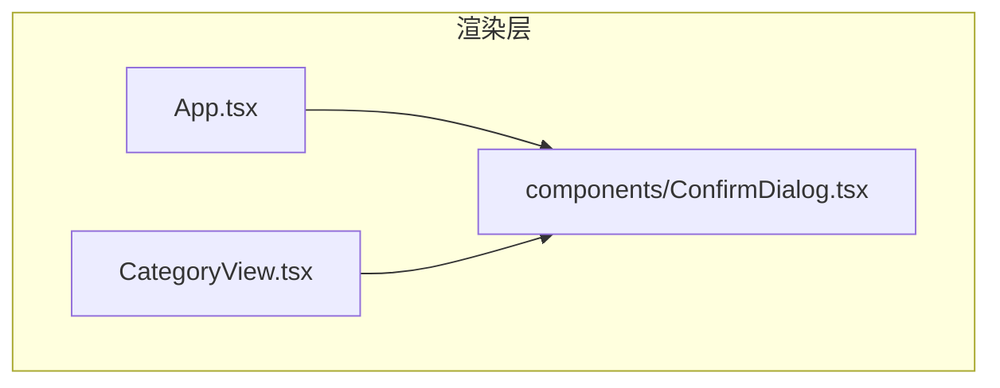
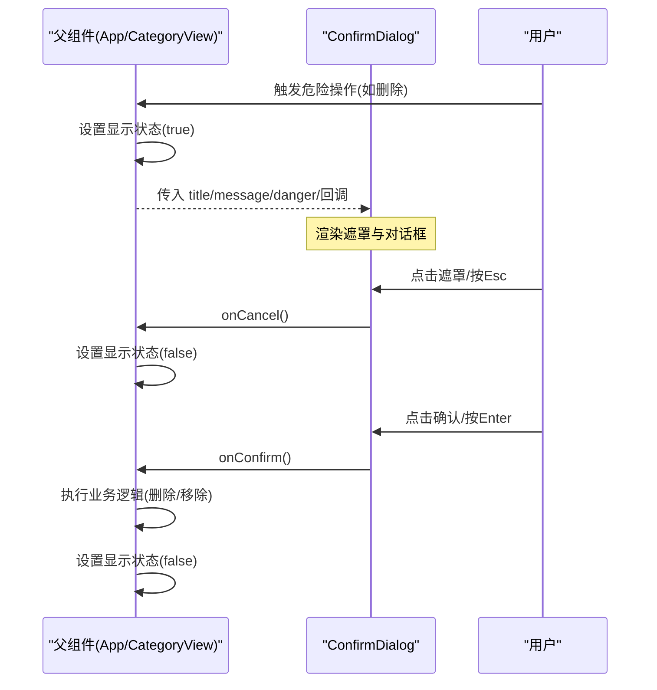
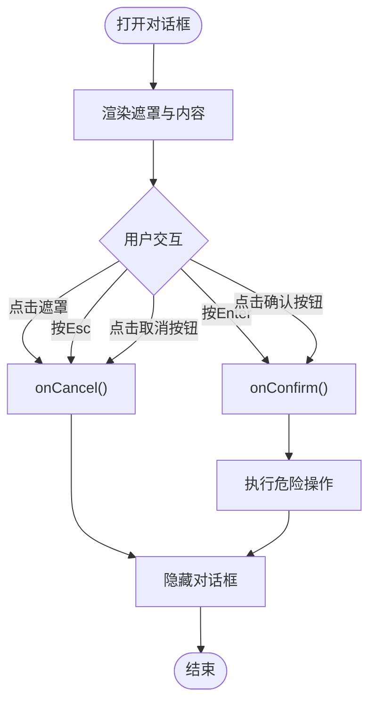
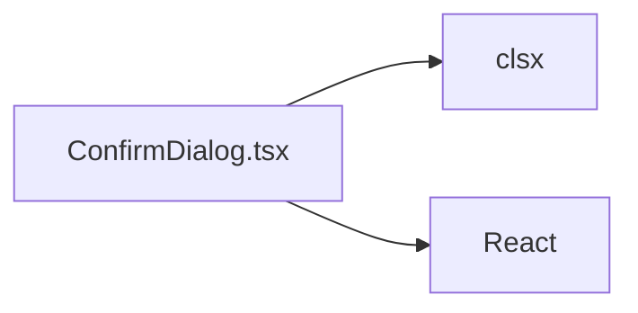

# 确认对话框

<cite>
**本文引用的文件**   
- [ConfirmDialog.tsx](file://src/renderer/src/components/ConfirmDialog.tsx)
- [App.tsx](file://src/renderer/src/App.tsx)
- [CategoryView.tsx](file://src/renderer/src/views/CategoryView.tsx)
</cite>

## 目录
1. [简介](#简介)
2. [项目结构](#项目结构)
3. [核心组件](#核心组件)
4. [架构总览](#架构总览)
5. [详细组件分析](#详细组件分析)
6. [依赖关系分析](#依赖关系分析)
7. [性能与可访问性](#性能与可访问性)
8. [故障排查指南](#故障排查指南)
9. [结论](#结论)
10. [附录：使用示例与最佳实践](#附录使用示例与最佳实践)

## 简介
本文件为 Serendip 应用中的“确认对话框”组件 ConfirmDialog 提供全面文档。内容涵盖模态框设计模式、用户交互流程、属性配置、打开与关闭机制（遮罩点击、ESC 键、按钮回调）、危险操作二次确认的使用范式、焦点管理与键盘导航支持、响应式适配、动画与过渡、主题定制与样式覆盖，以及集成指南和错误处理最佳实践。

## 项目结构
ConfirmDialog 位于渲染进程的前端组件目录中，被多个页面与视图按需引入并条件渲染，用于对删除分类、删除画布、从分类移除等破坏性或不可逆操作的二次确认。

图表来源
- [App.tsx:808-857](file://src/renderer/src/App.tsx#L808-L857)
- [CategoryView.tsx:348-410](file://src/renderer/src/views/CategoryView.tsx#L348-L410)
- [ConfirmDialog.tsx:1-76](file://src/renderer/src/components/ConfirmDialog.tsx#L1-L76)

章节来源
- [ConfirmDialog.tsx:1-76](file://src/renderer/src/components/ConfirmDialog.tsx#L1-L76)
- [App.tsx:808-857](file://src/renderer/src/App.tsx#L808-L857)
- [CategoryView.tsx:348-410](file://src/renderer/src/views/CategoryView.tsx#L348-L410)

## 核心组件
ConfirmDialog 是一个通用的二次确认模态框，具备以下特性：
- 居中遮罩弹层，背景半透明模糊
- 标题与消息区域，消息支持字符串或 JSX
- 自定义确认/取消按钮文本
- 危险模式：确认按钮高亮为红色
- 键盘交互：Esc 取消、Enter 确认
- 遮罩点击关闭（仅点击遮罩本身）
- 响应式宽度：固定宽度与最大视口宽度限制

章节来源
- [ConfirmDialog.tsx:4-14](file://src/renderer/src/components/ConfirmDialog.tsx#L4-L14)
- [ConfirmDialog.tsx:22-38](file://src/renderer/src/components/ConfirmDialog.tsx#L22-L38)
- [ConfirmDialog.tsx:40-75](file://src/renderer/src/components/ConfirmDialog.tsx#L40-L75)

## 架构总览
ConfirmDialog 以“受控弹窗”的模式工作：父组件通过状态控制是否显示，并在回调中执行具体业务逻辑。组件内部不持有业务状态，只负责展示与交互事件转发。

图表来源
- [ConfirmDialog.tsx:31-38](file://src/renderer/src/components/ConfirmDialog.tsx#L31-L38)
- [ConfirmDialog.tsx:40-75](file://src/renderer/src/components/ConfirmDialog.tsx#L40-L75)
- [App.tsx:808-857](file://src/renderer/src/App.tsx#L808-L857)
- [CategoryView.tsx:348-410](file://src/renderer/src/views/CategoryView.tsx#L348-L410)

## 详细组件分析

### 组件属性与类型定义
- 必需属性
  - title: 对话框标题
  - message: 主体描述，支持字符串或 JSX，便于突出关键信息
  - onConfirm: 确认回调
  - onCancel: 取消回调
- 可选属性
  - confirmLabel: 确认按钮文案，默认“确认”
  - cancelLabel: 取消按钮文案，默认“取消”
  - danger: 危险操作标记，开启后确认按钮变红

章节来源
- [ConfirmDialog.tsx:4-14](file://src/renderer/src/components/ConfirmDialog.tsx#L4-L14)

### 打开与关闭机制
- 打开方式：由父组件通过条件渲染控制显示
- 关闭方式
  - 点击遮罩层：仅当点击目标为遮罩容器时触发取消
  - 键盘：按下 Esc 触发取消；按下 Enter 触发确认
  - 按钮：点击取消/确认按钮分别调用对应回调

图表来源
- [ConfirmDialog.tsx:31-38](file://src/renderer/src/components/ConfirmDialog.tsx#L31-L38)
- [ConfirmDialog.tsx:40-75](file://src/renderer/src/components/ConfirmDialog.tsx#L40-L75)

章节来源
- [ConfirmDialog.tsx:31-38](file://src/renderer/src/components/ConfirmDialog.tsx#L31-L38)
- [ConfirmDialog.tsx:40-75](file://src/renderer/src/components/ConfirmDialog.tsx#L40-L75)

### 用户交互与键盘导航
- 键盘快捷键
  - Esc：取消
  - Enter：确认
- 鼠标交互
  - 点击遮罩层：取消
  - 点击按钮：分别触发对应回调
- 焦点管理
  - 当前实现未显式聚焦到对话框或按钮，建议后续在打开时将焦点置于确认或取消按钮以提升无障碍体验

章节来源
- [ConfirmDialog.tsx:31-38](file://src/renderer/src/components/ConfirmDialog.tsx#L31-L38)
- [ConfirmDialog.tsx:40-75](file://src/renderer/src/components/ConfirmDialog.tsx#L40-L75)

### 响应式设计
- 宽度策略：固定宽度配合最大视口百分比宽度，确保在小屏设备上自适应
- 布局：居中对齐，垂直水平方向均居中

章节来源
- [ConfirmDialog.tsx:48](file://src/renderer/src/components/ConfirmDialog.tsx#L48)

### 动画与过渡
- 当前实现未包含显式的进入/退出动画，仅通过 CSS 类进行静态样式渲染
- 如需增强体验，可在外层容器添加过渡类或使用 React Transition Group 等库

章节来源
- [ConfirmDialog.tsx:40-75](file://src/renderer/src/components/ConfirmDialog.tsx#L40-L75)

### 主题定制与样式覆盖
- 颜色与边框：使用 Tailwind 语义化变量（如 border-border、bg-background、text-foreground、bg-primary 等），可通过全局主题变量或 Tailwind 配置覆盖
- 危险模式：danger 为 true 时使用红色系背景与悬停色
- 阴影与圆角：通过 shadow-xl、rounded-xl 等类统一风格

章节来源
- [ConfirmDialog.tsx:48-71](file://src/renderer/src/components/ConfirmDialog.tsx#L48-L71)

## 依赖关系分析
ConfirmDialog 的依赖关系简洁清晰：
- 外部依赖
  - clsx：用于动态拼接按钮样式类名
  - React：基础 Hooks 与 JSX
- 内部依赖
  - 无其他组件依赖，属于纯展示型 UI 组件

图表来源
- [ConfirmDialog.tsx:1-3](file://src/renderer/src/components/ConfirmDialog.tsx#L1-L3)

章节来源
- [ConfirmDialog.tsx:1-3](file://src/renderer/src/components/ConfirmDialog.tsx#L1-L3)

## 性能与可访问性
- 性能
  - 组件轻量，无复杂计算与副作用，仅在挂载/卸载时注册/移除键盘事件监听
  - 建议在父组件中避免频繁重渲染导致对话框闪烁，可使用稳定回调引用
- 可访问性
  - 当前未设置 aria-* 属性与自动焦点管理，建议补充：
    - 为遮罩容器添加 role="dialog" 与 aria-modal="true"
    - 打开时将焦点移动到第一个可交互元素（如确认按钮）
    - 关闭时恢复焦点至触发源
    - 为按钮添加 aria-label 或明确文案

章节来源
- [ConfirmDialog.tsx:31-38](file://src/renderer/src/components/ConfirmDialog.tsx#L31-L38)
- [ConfirmDialog.tsx:40-75](file://src/renderer/src/components/ConfirmDialog.tsx#L40-L75)

## 故障排查指南
- 问题：点击对话框内容也关闭
  - 现象：点击内容区域意外关闭
  - 原因：应仅当点击遮罩容器本身才关闭
  - 解决：确保事件判断 e.target === e.currentTarget，避免冒泡误判
- 问题：键盘事件未生效
  - 现象：按 Esc/Enter 无反应
  - 原因：事件监听未正确挂载或回调引用不稳定
  - 解决：检查 useEffect 依赖项与清理函数，确保回调引用稳定
- 问题：危险按钮样式异常
  - 现象：danger 模式下颜色不正确
  - 原因：主题变量未定义或 Tailwind 配置缺失
  - 解决：确认全局主题变量与 Tailwind 配置中包含相关语义化变量

章节来源
- [ConfirmDialog.tsx:31-38](file://src/renderer/src/components/ConfirmDialog.tsx#L31-L38)
- [ConfirmDialog.tsx:40-75](file://src/renderer/src/components/ConfirmDialog.tsx#L40-L75)

## 结论
ConfirmDialog 提供了简洁可靠的二次确认能力，适用于删除分类、删除画布、批量移除等危险操作。其设计遵循受控弹窗模式，具备良好的可扩展性与主题适配能力。建议后续完善无障碍支持与过渡动画，进一步提升用户体验。

## 附录：使用示例与最佳实践

### 典型使用场景
- 删除分类
  - 父组件在状态中维护 deleteTarget，条件渲染 ConfirmDialog
  - 确认回调执行删除逻辑，随后重置状态
- 删除画布
  - 类似删除分类，使用 danger 模式强调风险
- 从分类移除（单项/批量）
  - 在分类视图中弹出确认，确认后执行移除逻辑

章节来源
- [App.tsx:808-857](file://src/renderer/src/App.tsx#L808-L857)
- [CategoryView.tsx:348-410](file://src/renderer/src/views/CategoryView.tsx#L348-L410)

### 集成步骤
- 在父组件中引入 ConfirmDialog
- 使用状态控制显示与关闭
- 传入 title、message、confirmLabel/cancelLabel、danger 与回调
- 在 onConfirm/onCancel 中更新状态与执行业务逻辑

章节来源
- [ConfirmDialog.tsx:4-14](file://src/renderer/src/components/ConfirmDialog.tsx#L4-L14)
- [App.tsx:808-857](file://src/renderer/src/App.tsx#L808-L857)
- [CategoryView.tsx:348-410](file://src/renderer/src/views/CategoryView.tsx#L348-L410)

### 错误处理最佳实践
- 在 onConfirm 中捕获异步错误并提示用户
- 在 onConfirm 返回错误字符串或抛出异常时，由上层统一处理（参考输入对话框的错误处理模式）
- 避免在回调中直接修改 DOM，保持状态驱动渲染

章节来源
- [PromptDialog.tsx:43-56](file://src/renderer/src/components/PromptDialog.tsx#L43-L56)