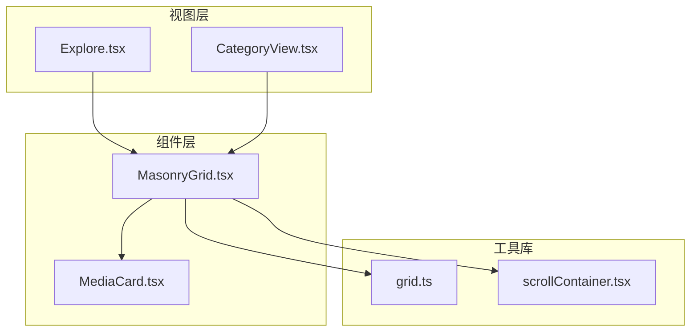
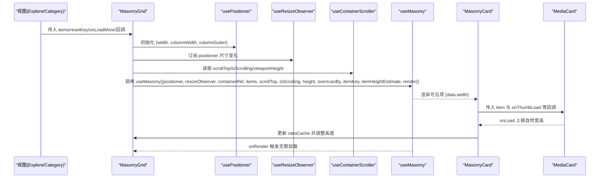
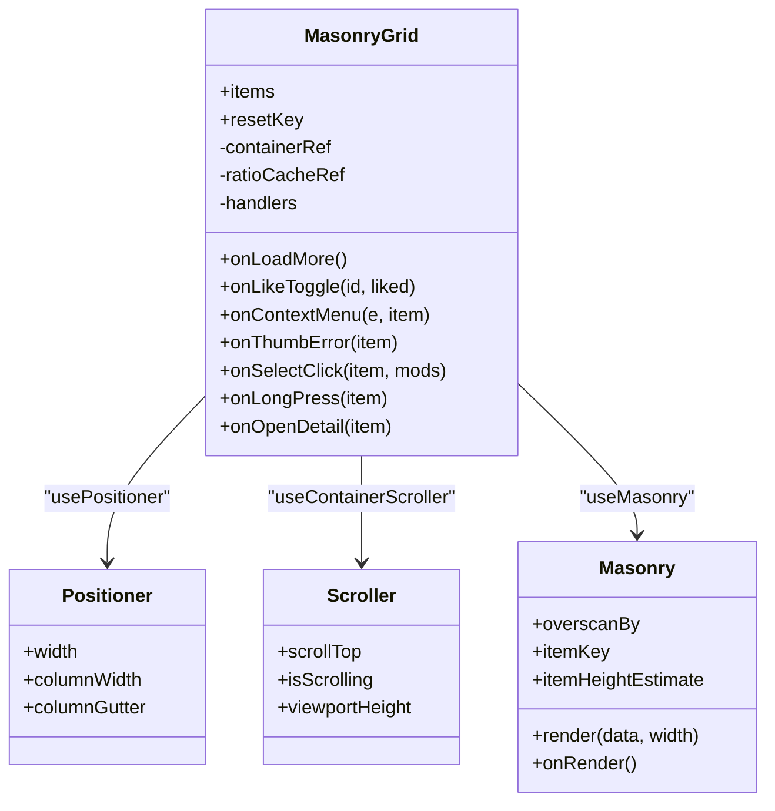
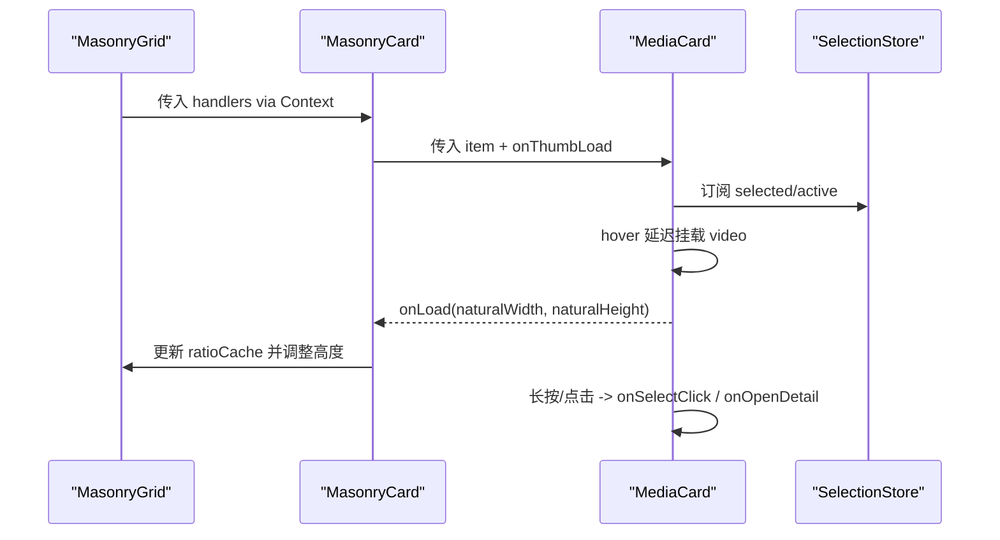
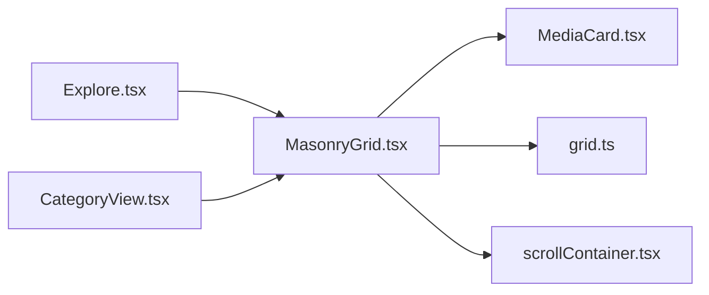

# MasonryGrid 瀑布流网格组件

<cite>
**本文引用的文件**
- [MasonryGrid.tsx](file://src/renderer/src/components/MasonryGrid.tsx)
- [MediaCard.tsx](file://src/renderer/src/components/MediaCard.tsx)
- [grid.ts](file://src/renderer/src/lib/grid.ts)
- [scrollContainer.tsx](file://src/renderer/src/lib/scrollContainer.tsx)
- [Explore.tsx](file://src/renderer/src/views/Explore.tsx)
- [CategoryView.tsx](file://src/renderer/src/views/CategoryView.tsx)
</cite>

## 目录
1. [简介](#简介)
2. [项目结构](#项目结构)
3. [核心组件](#核心组件)
4. [架构总览](#架构总览)
5. [详细组件分析](#详细组件分析)
6. [依赖关系分析](#依赖关系分析)
7. [性能考量](#性能考量)
8. [故障排查指南](#故障排查指南)
9. [结论](#结论)
10. [附录：配置与使用示例](#附录配置与使用示例)

## 简介
本文件为 MasonryGrid 瀑布流网格组件的技术文档，聚焦以下目标：
- 深入解析瀑布流布局算法的实现原理：动态列数计算、元素高度自适应、滚动性能优化。
- 说明组件的布局策略、虚拟滚动实现与内存管理机制。
- 解释与 MediaCard 组件的集成方式、数据绑定模式与渲染优化技术。
- 提供具体配置选项与使用示例，涵盖响应式适配、大列表性能优化与浏览器兼容性处理。
- 给出自定义样式主题、动画效果与交互行为的扩展方法，帮助前端开发者高效开发与调优。

## 项目结构
MasonryGrid 位于渲染层（renderer）的 components 目录，配合 lib 中的 grid 与 scrollContainer 工具模块，以及 Explore 与 CategoryView 两个视图共同构成完整的瀑布流体验。

图表来源
- [MasonryGrid.tsx:1-211](file://src/renderer/src/components/MasonryGrid.tsx#L1-L211)
- [MediaCard.tsx:1-614](file://src/renderer/src/components/MediaCard.tsx#L1-L614)
- [grid.ts:1-29](file://src/renderer/src/lib/grid.ts#L1-L29)
- [scrollContainer.tsx:1-77](file://src/renderer/src/lib/scrollContainer.tsx#L1-L77)
- [Explore.tsx:367-408](file://src/renderer/src/views/Explore.tsx#L367-L408)
- [CategoryView.tsx:312-322](file://src/renderer/src/views/CategoryView.tsx#L312-L322)

章节来源
- [MasonryGrid.tsx:1-211](file://src/renderer/src/components/MasonryGrid.tsx#L1-L211)
- [grid.ts:1-29](file://src/renderer/src/lib/grid.ts#L1-L29)
- [scrollContainer.tsx:1-77](file://src/renderer/src/lib/scrollContainer.tsx#L1-L77)
- [Explore.tsx:367-408](file://src/renderer/src/views/Explore.tsx#L367-L408)
- [CategoryView.tsx:312-322](file://src/renderer/src/views/CategoryView.tsx#L312-L322)

## 核心组件
- MasonryGrid：基于 masonic 的虚拟化瀑布流容器，负责列宽与间距、视口与滚动状态、无限加载、比例缓存与上下文传递。
- MediaCard：媒体卡片展示与交互，包括图片/视频预览、点赞、多选、拖拽、右键菜单等。
- grid.ts：统一的“目标列宽”配置与列数计算工具。
- scrollContainer.tsx：将滚动模型从 window 切换到主区容器，提供 scrollTop、isScrolling、viewportHeight。

章节来源
- [MasonryGrid.tsx:1-211](file://src/renderer/src/components/MasonryGrid.tsx#L1-L211)
- [MediaCard.tsx:1-614](file://src/renderer/src/components/MediaCard.tsx#L1-L614)
- [grid.ts:1-29](file://src/renderer/src/lib/grid.ts#L1-L29)
- [scrollContainer.tsx:1-77](file://src/renderer/src/lib/scrollContainer.tsx#L1-L77)

## 架构总览
MasonryGrid 通过 usePositioner + useResizeObserver + useMasonry 组合，完成“按列宽反推列数 + 视口窗口化 + 按需渲染”。滚动模型由 useContainerScroller 接管，避免默认 window 滚动带来的错位。MediaCard 作为单元格渲染器，内部通过 memo 与事件节流减少重渲染。

图表来源
- [MasonryGrid.tsx:161-202](file://src/renderer/src/components/MasonryGrid.tsx#L161-L202)
- [scrollContainer.tsx:34-76](file://src/renderer/src/lib/scrollContainer.tsx#L34-L76)
- [MediaCard.tsx:444-454](file://src/renderer/src/components/MediaCard.tsx#L444-L454)

## 详细组件分析

### 瀑布流布局算法与动态列数
- 列宽策略：通过 TARGET_WIDTH 定义 small/medium/large 三档目标列宽，masonic 根据容器宽度与 columnWidth 自动计算列数。
- 间距控制：统一 SPACING 常量作为列/行间距，保证视觉一致性。
- 高度自适应：每个单元格初始高度优先取数据库记录的宽高比，其次取会话级实测缓存，最后回退到固定比例；缩略图 onLoad 后以真实 naturalWidth/naturalHeight 修正比例，触发 ResizeObserver 重排该格。

图表来源
- [MasonryGrid.tsx:51-84](file://src/renderer/src/components/MasonryGrid.tsx#L51-L84)
- [MasonryGrid.tsx:161-170](file://src/renderer/src/components/MasonryGrid.tsx#L161-L170)
- [grid.ts:9-21](file://src/renderer/src/lib/grid.ts#L9-L21)

章节来源
- [MasonryGrid.tsx:29-84](file://src/renderer/src/components/MasonryGrid.tsx#L29-L84)
- [grid.ts:1-29](file://src/renderer/src/lib/grid.ts#L1-L29)

### 虚拟滚动与内存管理
- 窗口化渲染：useMasonry 仅挂载视口附近及 overscanBy 预渲染区域，DOM 数量恒定，避免长列表卡顿。
- 稳定 key：itemKey 基于 data.id，确保滚回时复用节点，保持状态一致。
- 高度估算：itemHeightEstimate 用于提前分配空间，减少二次布局抖动。
- 比例缓存：ratioCache 跨卸载/重挂保留，避免二次抖动。
- 滚动模型替换：useContainerScroller 监听主区容器的 scrollTop 与 clientHeight，使滚动条出现在主区而非 window，提升整体 UI 一致性。

图表来源
- [MasonryGrid.tsx:161-202](file://src/renderer/src/components/MasonryGrid.tsx#L161-L202)
- [scrollContainer.tsx:34-76](file://src/renderer/src/lib/scrollContainer.tsx#L34-L76)

章节来源
- [MasonryGrid.tsx:86-202](file://src/renderer/src/components/MasonryGrid.tsx#L86-L202)
- [scrollContainer.tsx:1-77](file://src/renderer/src/lib/scrollContainer.tsx#L1-L77)

### 与 MediaCard 的集成与渲染优化
- 回调注入：MasonryGrid 通过 Context 将操作回调注入到 MasonryCard，再透传到 MediaCard，避免每次 render 重建函数引用。
- 媒体播放控制：MediaCard 对视频进行冷却池与看门狗保护，限制同时播放数量，错误进入退避冷却，避免频繁失败重试。
- 选择与长按：支持多选模式、Ctrl/Cmd/Shift 修饰键点击、长按进入多选，且与拖拽共存，移动超过阈值取消长按。
- 性能优化：MediaCard 外层包裹 memo，防止父级重排导致整表重渲染；hover 延迟挂载 video 元素，减少快速划过抖动。

图表来源
- [MasonryGrid.tsx:172-182](file://src/renderer/src/components/MasonryGrid.tsx#L172-L182)
- [MediaCard.tsx:96-146](file://src/renderer/src/components/MediaCard.tsx#L96-L146)
- [MediaCard.tsx:179-221](file://src/renderer/src/components/MediaCard.tsx#L179-L221)
- [MediaCard.tsx:361-416](file://src/renderer/src/components/MediaCard.tsx#L361-L416)

章节来源
- [MediaCard.tsx:1-614](file://src/renderer/src/components/MediaCard.tsx#L1-L614)
- [MasonryGrid.tsx:172-182](file://src/renderer/src/components/MasonryGrid.tsx#L172-L182)

### 响应式布局与大列表优化
- 侧边栏折叠适配：sidebarCollapsed 变化后延时读取容器宽度，避免动画过程中每帧抖动。
- 容器尺寸监听：ResizeObserver 监听 grid 与 scrollEl，实时更新 containerWidth 与 viewportHeight。
- 无限加载：useInfiniteLoader 在接近可视区域底部前触发加载更多，threshold 控制预拉取距离。
- 去抖与节流：滚动 idle 计时器关闭 pointer-events 优化，减少不必要的重绘。

章节来源
- [MasonryGrid.tsx:141-159](file://src/renderer/src/components/MasonryGrid.tsx#L141-L159)
- [MasonryGrid.tsx:184-202](file://src/renderer/src/components/MasonryGrid.tsx#L184-L202)
- [scrollContainer.tsx:45-69](file://src/renderer/src/lib/scrollContainer.tsx#L45-L69)

### 浏览器兼容性与注意事项
- ResizeObserver 与 IntersectionObserver 在现代浏览器广泛支持，若需兼容旧环境可降级为 window.resize 与手动边界检测。
- 视频 autoplay 与 playsInline 在不同平台行为差异较大，建议结合 muted 与用户手势策略。
- 滚动容器替换 window 滚动后，注意 sticky 定位与 z-index 层级，避免浮层被遮挡。

[本节为通用指导，不直接分析具体文件]

## 依赖关系分析
- 视图层（Explore/CategoryView）通过 props 向 MasonryGrid 注入数据与回调。
- MasonryGrid 依赖 masonic 的底层 hooks 完成布局与渲染。
- grid.ts 提供目标列宽与列数计算，确保多视图一致的列宽策略。
- scrollContainer.tsx 提供容器滚动能力，替代 window 滚动。

图表来源
- [Explore.tsx:367-408](file://src/renderer/src/views/Explore.tsx#L367-L408)
- [CategoryView.tsx:312-322](file://src/renderer/src/views/CategoryView.tsx#L312-L322)
- [MasonryGrid.tsx:1-211](file://src/renderer/src/components/MasonryGrid.tsx#L1-L211)
- [MediaCard.tsx:1-614](file://src/renderer/src/components/MediaCard.tsx#L1-L614)
- [grid.ts:1-29](file://src/renderer/src/lib/grid.ts#L1-L29)
- [scrollContainer.tsx:1-77](file://src/renderer/src/lib/scrollContainer.tsx#L1-L77)

章节来源
- [Explore.tsx:367-408](file://src/renderer/src/views/Explore.tsx#L367-L408)
- [CategoryView.tsx:312-322](file://src/renderer/src/views/CategoryView.tsx#L312-L322)
- [MasonryGrid.tsx:1-211](file://src/renderer/src/components/MasonryGrid.tsx#L1-L211)
- [grid.ts:1-29](file://src/renderer/src/lib/grid.ts#L1-L29)
- [scrollContainer.tsx:1-77](file://src/renderer/src/lib/scrollContainer.tsx#L1-L77)

## 性能考量
- 虚拟滚动：只渲染可视区域与少量预渲染项，显著降低 DOM 节点数量与重排成本。
- 稳定引用：handlers 与 itemKey 稳定，避免无谓重渲染与节点重建。
- 比例缓存：跨卸载/重挂保留宽高比，避免二次抖动。
- 视频冷却池：限制并发播放数量，错误退避冷却，避免资源浪费。
- 延迟挂载：hover 延迟挂载 video 元素，减少快速划过抖动。
- 容器滚动：替换 window 滚动，避免全局滚动导致的布局抖动与性能问题。

[本节为通用指导，不直接分析具体文件]

## 故障排查指南
- 缩略图加载失败：MediaCard 触发 onThumbError，视图层应移除该项并标记不可用，避免重复渲染失败内容。
- 视频无法播放：检查冷却池是否处于冷却期，查看看门狗超时日志；确认 muted/autoplay/playsInline 策略是否符合平台要求。
- 滚动位置异常：确认 offsetTop 计算正确，确保 useContainerScroller 的 scrollTop 减去偏移量。
- 列宽不正确：检查 gridSize 与 TARGET_WIDTH 配置，确认容器宽度读取时机（侧边栏动画结束后）。

章节来源
- [MediaCard.tsx:355-358](file://src/renderer/src/components/MediaCard.tsx#L355-L358)
- [MediaCard.tsx:263-279](file://src/renderer/src/components/MediaCard.tsx#L263-L279)
- [MasonryGrid.tsx:124-138](file://src/renderer/src/components/MasonryGrid.tsx#L124-L138)
- [MasonryGrid.tsx:141-159](file://src/renderer/src/components/MasonryGrid.tsx#L141-L159)

## 结论
MasonryGrid 通过 masonic 的底层 API 实现了高性能的瀑布流布局，结合容器滚动替换、比例缓存与稳定的渲染策略，在大列表场景下具备优秀的性能表现。与 MediaCard 的深度集成提供了丰富的交互能力，并通过多项优化手段保障了用户体验。

[本节为总结性内容，不直接分析具体文件]

## 附录：配置与使用示例

### 配置选项（MasonryGrid Props）
- items：媒体项数组，类型参考 MediaItem。
- resetKey：当数据根本性重置时变化（如切换探索模式或根目录），用于整体重挂与滚动归零。
- onLoadMore：触底加载更多回调；省略表示有限列表（分类/喜欢一次拉全）。
- onLikeToggle：点赞切换回调。
- onContextMenu：右键菜单回调。
- onThumbError：缩略图加载失败回调。
- onSelectClick：多选点击回调（含 Ctrl/Cmd/Shift 修饰键逻辑）。
- onLongPress：长按进入多选回调。
- onOpenDetail：普通单击打开详情回调。

章节来源
- [MasonryGrid.tsx:91-97](file://src/renderer/src/components/MasonryGrid.tsx#L91-L97)
- [MasonryGrid.tsx:99-109](file://src/renderer/src/components/MasonryGrid.tsx#L99-L109)

### 使用示例（Explore 视图）
- 数据加载：按批次获取推荐内容，去重后追加到 items。
- 无限加载：通过 onLoadMore 触发 loadMore，结合 useInfiniteLoader 控制预拉取。
- 交互：点赞、右键菜单、多选、长按、打开详情等。

章节来源
- [Explore.tsx:65-103](file://src/renderer/src/views/Explore.tsx#L65-L103)
- [Explore.tsx:367-408](file://src/renderer/src/views/Explore.tsx#L367-L408)

### 使用示例（Category 视图）
- 一次性加载分类全部项，无需分页。
- 支持批量操作（全选、喜欢、加入分类、从分类移除等）。
- 通过 categoryRefreshNonce 刷新当前分类视图。

章节来源
- [CategoryView.tsx:72-86](file://src/renderer/src/views/CategoryView.tsx#L72-L86)
- [CategoryView.tsx:312-322](file://src/renderer/src/views/CategoryView.tsx#L312-L322)

### 响应式与主题扩展
- 列宽档位：TARGET_WIDTH 提供 small/medium/large 三档目标列宽，可在 header 中切换 gridSize。
- 主题变量：UI store 持久化 theme，并在首次绘制前写入 documentElement，Tailwind 主题变量生效。
- 自定义样式：MediaCard 使用 Tailwind 类名，可通过覆盖 CSS 变量或类名实现主题定制。

章节来源
- [grid.ts:9-13](file://src/renderer/src/lib/grid.ts#L9-L13)
- [CLAUDE.md:55-56](file://CLAUDE.md#L55-L56)