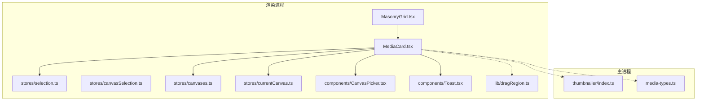
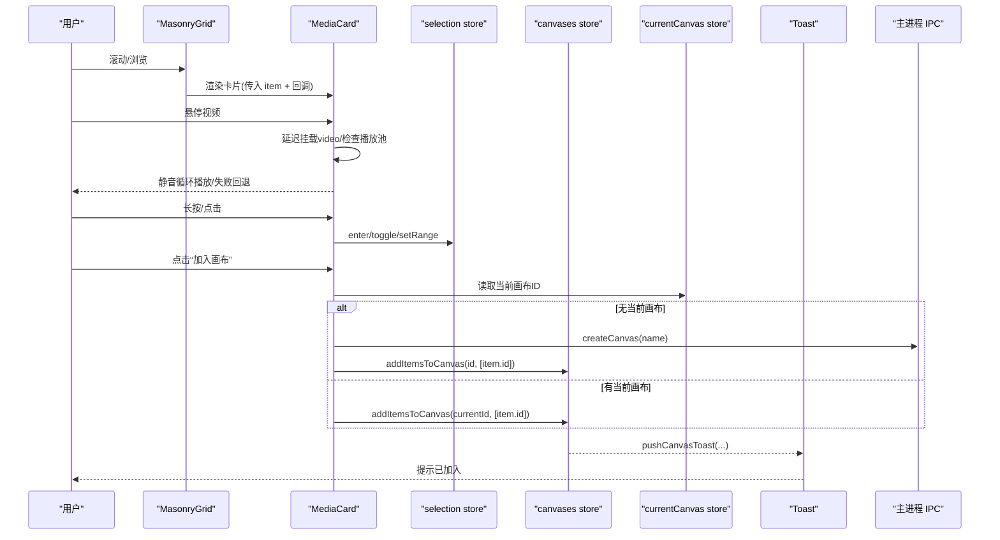
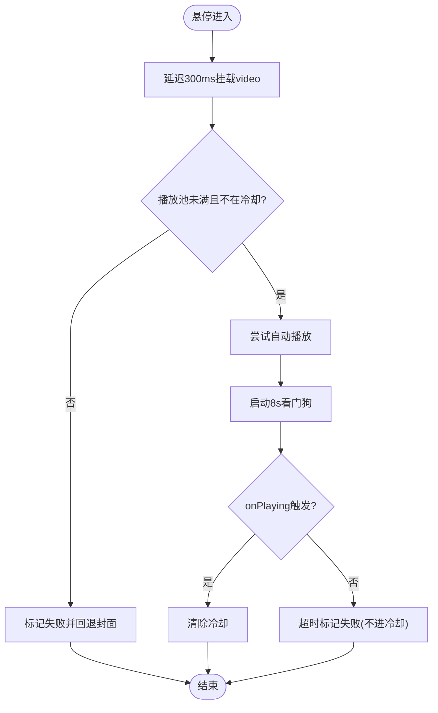
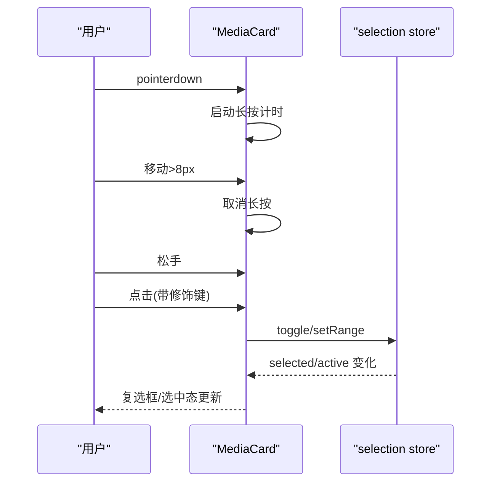
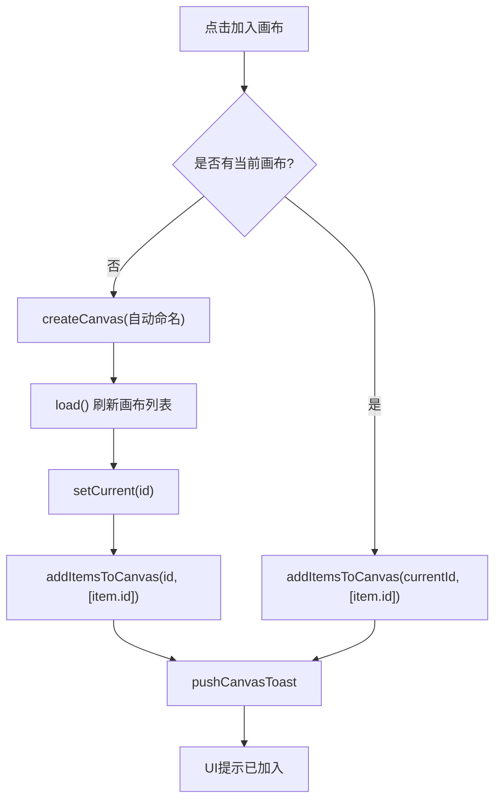
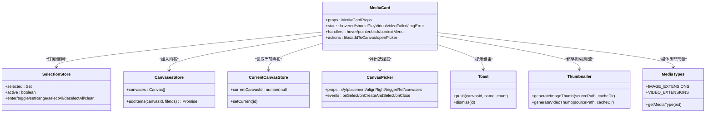

# MediaCard 媒体卡片组件

<cite>
**本文引用的文件**
- [MediaCard.tsx](file://src/renderer/src/components/MediaCard.tsx)
- [MasonryGrid.tsx](file://src/renderer/src/components/MasonryGrid.tsx)
- [selection.ts](file://src/renderer/src/stores/selection.ts)
- [canvasSelection.ts](file://src/renderer/src/stores/canvasSelection.ts)
- [canvases.ts](file://src/renderer/src/stores/canvases.ts)
- [currentCanvas.ts](file://src/renderer/src/stores/currentCanvas.ts)
- [CanvasPicker.tsx](file://src/renderer/src/components/CanvasPicker.tsx)
- [Toast.tsx](file://src/renderer/src/components/Toast.tsx)
- [dragRegion.ts](file://src/renderer/src/lib/dragRegion.ts)
- [index.ts（缩略图生成）](file://src/main/thumbnailer/index.ts)
- [media-types.ts](file://src/main/media-types.ts)
</cite>

## 目录
1. [简介](#简介)
2. [项目结构](#项目结构)
3. [核心组件](#核心组件)
4. [架构总览](#架构总览)
5. [详细组件分析](#详细组件分析)
6. [依赖关系分析](#依赖关系分析)
7. [性能考量](#性能考量)
8. [故障排查指南](#故障排查指南)
9. [结论](#结论)
10. [附录：使用示例与集成模式](#附录使用示例与集成模式)

## 简介
MediaCard 是用于展示单个媒体项（图片/视频）的卡片组件，提供以下关键能力：
- 缩略图加载与错误处理：通过自定义协议加载主进程生成的缩略图，失败时回退占位并上报。
- 视频悬停播放控制：鼠标悬停延迟挂载 video 元素，静音循环播放，具备播放池与冷却算法，避免资源浪费。
- 拖拽功能集成：基于 dnd-kit 注册可拖拽对象，支持将媒体拖入侧栏分类或画布。
- 多选模式支持：长按进入多选、Ctrl/Cmd 点击切换、Shift 区间选择；卡片内显示复选框与选中态样式。
- 画布操作：一键加入当前画布或新建画布，弹出画布选择器进行快速选择或创建。
- 响应式与可访问性：瀑布流布局下自适应宽高，焦点与键盘交互友好。
- 动画过渡：hover 遮罩、选中态 ring、拖拽透明度等过渡效果。

## 项目结构
MediaCard 位于渲染进程 UI 层，与多个 store 和子组件协作，同时依赖主进程的缩略图与视频流服务。

图表来源
- [MediaCard.tsx:1-614](file://src/renderer/src/components/MediaCard.tsx#L1-L614)
- [MasonryGrid.tsx:1-211](file://src/renderer/src/components/MasonryGrid.tsx#L1-L211)
- [selection.ts:1-141](file://src/renderer/src/stores/selection.ts#L1-L141)
- [canvasSelection.ts:1-62](file://src/renderer/src/stores/canvasSelection.ts#L1-L62)
- [canvases.ts:1-115](file://src/renderer/src/stores/canvases.ts#L1-L115)
- [currentCanvas.ts:1-18](file://src/renderer/src/stores/currentCanvas.ts#L1-L18)
- [CanvasPicker.tsx:1-162](file://src/renderer/src/components/CanvasPicker.tsx#L1-L162)
- [Toast.tsx:1-109](file://src/renderer/src/components/Toast.tsx#L1-L109)
- [dragRegion.ts:1-17](file://src/renderer/src/lib/dragRegion.ts#L1-L17)
- [index.ts（缩略图生成）:1-138](file://src/main/thumbnailer/index.ts#L1-L138)
- [media-types.ts:1-38](file://src/main/media-types.ts#L1-L38)

章节来源
- [MediaCard.tsx:1-614](file://src/renderer/src/components/MediaCard.tsx#L1-L614)
- [MasonryGrid.tsx:1-211](file://src/renderer/src/components/MasonryGrid.tsx#L1-L211)

## 核心组件
- MediaCard 负责单条媒体的展示与交互，包括：
  - 缩略图加载与错误回退
  - 视频悬停播放（含播放池与冷却）
  - 长按检测与多选状态联动
  - 拖拽注册与事件协调
  - 画布操作（加入/新建/选择）
  - hover 遮罩与操作按钮（点赞、更多、加入画布）
  - 多选模式下复选框常显与选中态高亮

章节来源
- [MediaCard.tsx:13-29](file://src/renderer/src/components/MediaCard.tsx#L13-L29)
- [MediaCard.tsx:96-606](file://src/renderer/src/components/MediaCard.tsx#L96-L606)

## 架构总览
MediaCard 作为视图层原子组件，向上被 MasonryGrid 虚拟化渲染，向下通过 props 回调与 store 交互，并通过 IPC 与主进程通信完成缩略图/视频流获取与画布持久化。

图表来源
- [MasonryGrid.tsx:69-84](file://src/renderer/src/components/MasonryGrid.tsx#L69-L84)
- [MediaCard.tsx:179-221](file://src/renderer/src/components/MediaCard.tsx#L179-L221)
- [MediaCard.tsx:286-353](file://src/renderer/src/components/MediaCard.tsx#L286-L353)
- [canvases.ts:58-99](file://src/renderer/src/stores/canvases.ts#L58-L99)
- [Toast.tsx:67-69](file://src/renderer/src/components/Toast.tsx#L67-L69)

## 详细组件分析

### 属性接口（MediaCardProps）
- item: 媒体项数据，包含 id、type、liked、duration_ms 等字段。
- onLikeToggle: 点赞切换回调。
- onContextMenu: 右键菜单触发。
- onThumbError: 缩略图加载失败回调，用于上报并从列表移除。
- onThumbLoad: 缩略图加载成功回调，上报自然宽高以纠正瀑布流格子比例。
- draggable: 是否启用拖拽，默认开启。
- onSelectClick: 多选点击回调，接收修饰键信息（Ctrl/Cmd、Shift）。
- onLongPress: 长按进入多选的回调。
- onOpenDetail: 普通单击打开详情页的回调。

章节来源
- [MediaCard.tsx:13-29](file://src/renderer/src/components/MediaCard.tsx#L13-L29)

### 缩略图加载与错误处理
- 缩略图地址采用自定义协议 serendip://thumb/{id}，由主进程根据媒体路径生成 WebP 缩略图并缓存。
- 加载失败时设置 imgError 并调用 onThumbError，上层可据此从列表移除该条目。
- 加载成功时通过 onLoad 上报 naturalWidth/naturalHeight，供瀑布流修正格子高度，避免冷数据导致的尺寸抖动。

章节来源
- [MediaCard.tsx:418-459](file://src/renderer/src/components/MediaCard.tsx#L418-L459)
- [index.ts（缩略图生成）:27-52](file://src/main/thumbnailer/index.ts#L27-L52)
- [index.ts（缩略图生成）:59-94](file://src/main/thumbnailer/index.ts#L59-L94)

### 视频悬停播放控制与播放池
- 悬停进入后延迟 300ms 才挂载 video 元素，离开后延迟 250ms 卸载，减少频繁 mount/unmount 抖动。
- 播放池限制最多同时播放 N 个视频（默认 3），超出则标记失败并回退封面。
- 看门狗机制：若 8 秒内未真正开始播放，仅标记本次失败，不进入冷却，避免大文件慢 IO 误伤。
- 冷却算法：仅在 error 事件时进入冷却，按指数退避（10s→20s→40s→60s封顶），成功后清除冷却。

图表来源
- [MediaCard.tsx:179-221](file://src/renderer/src/components/MediaCard.tsx#L179-L221)
- [MediaCard.tsx:224-279](file://src/renderer/src/components/MediaCard.tsx#L224-L279)
- [MediaCard.tsx:36-94](file://src/renderer/src/components/MediaCard.tsx#L36-L94)

章节来源
- [MediaCard.tsx:36-94](file://src/renderer/src/components/MediaCard.tsx#L36-L94)
- [MediaCard.tsx:179-279](file://src/renderer/src/components/MediaCard.tsx#L179-L279)

### 拖拽功能集成
- 使用 @dnd-kit/core 的 useDraggable 将卡片注册为可拖拽对象，激活阈值与 PointerSensor 配置一致（移动超过 8px 才触发拖拽）。
- 拖拽数据携带 type=fileId/item，便于上层处理分类或画布落点。
- 与长按检测共存：pointerdown 先交给 dnd-kit，再启动长按计时；移动超阈值取消长按，避免冲突。

章节来源
- [MediaCard.tsx:134-145](file://src/renderer/src/components/MediaCard.tsx#L134-L145)
- [MediaCard.tsx:360-390](file://src/renderer/src/components/MediaCard.tsx#L360-L390)
- [dragRegion.ts:1-17](file://src/renderer/src/lib/dragRegion.ts#L1-L17)

### 多选模式支持
- 长按进入多选：pointerdown 起计时，达到阈值触发 onLongPress，随后 click 被吞掉以避免重复切换。
- 修饰键点击：Ctrl/Cmd 切换单项，Shift 结合锚点进行区间选择；多选模式下复选框常显。
- 选择状态由 selection store 管理，卡片自身订阅 selected/active，避免透传导致整表重渲染。

图表来源
- [MediaCard.tsx:360-416](file://src/renderer/src/components/MediaCard.tsx#L360-L416)
- [selection.ts:40-77](file://src/renderer/src/stores/selection.ts#L40-L77)
- [selection.ts:85-141](file://src/renderer/src/stores/selection.ts#L85-L141)

章节来源
- [MediaCard.tsx:360-416](file://src/renderer/src/components/MediaCard.tsx#L360-L416)
- [selection.ts:1-141](file://src/renderer/src/stores/selection.ts#L1-L141)

### 画布操作
- 若无当前画布，自动创建新画布并加入媒体项，随后刷新画布列表并推送 Toast。
- 若有当前画布，直接加入；也可通过胶囊按钮展开 CanvasPicker 选择已有画布或创建并选择。
- 加入画布逻辑在 canvases store 中计算等高行网格位置，保持现有元素不动，返回新 canvas_item id 列表。

图表来源
- [MediaCard.tsx:286-353](file://src/renderer/src/components/MediaCard.tsx#L286-L353)
- [canvases.ts:58-99](file://src/renderer/src/stores/canvases.ts#L58-L99)
- [Toast.tsx:67-69](file://src/renderer/src/components/Toast.tsx#L67-L69)

章节来源
- [MediaCard.tsx:286-353](file://src/renderer/src/components/MediaCard.tsx#L286-L353)
- [canvases.ts:1-115](file://src/renderer/src/stores/canvases.ts#L1-L115)
- [CanvasPicker.tsx:1-162](file://src/renderer/src/components/CanvasPicker.tsx#L1-L162)
- [currentCanvas.ts:1-18](file://src/renderer/src/stores/currentCanvas.ts#L1-L18)

### 事件处理机制与状态管理策略
- 事件优先级：pointerdown 优先交给 dnd-kit，再启动长按计时；move 超阈值取消长按；click 根据长按标记与修饰键决定多选或详情。
- 状态隔离：selected/active 由 store 管理，卡片只订阅必要切片，避免父级重排导致全表重渲染。
- 生命周期清理：所有定时器在 useEffect 卸载时清理，防止内存泄漏。

章节来源
- [MediaCard.tsx:158-177](file://src/renderer/src/components/MediaCard.tsx#L158-L177)
- [MediaCard.tsx:360-416](file://src/renderer/src/components/MediaCard.tsx#L360-L416)
- [selection.ts:1-141](file://src/renderer/src/stores/selection.ts#L1-L141)

### 视频播放池管理机制与冷却算法实现
- 播放池 Map<number, HTMLVideoElement> 记录当前正在播放的视频元素，容量上限为 3。
- canPlayVideo 判断是否在冷却、是否已有同 id 元素占用、池是否已满。
- 冷却 Map<number, CooldownEntry> 记录 until 时间与 failures 次数，error 事件触发指数退避，playing 事件清除冷却。
- 看门狗区分“慢加载”与“损坏”，仅 error 进入冷却，避免误伤。

章节来源
- [MediaCard.tsx:36-94](file://src/renderer/src/components/MediaCard.tsx#L36-L94)
- [MediaCard.tsx:224-279](file://src/renderer/src/components/MediaCard.tsx#L224-L279)

### 性能优化技巧
- memo 包裹 MediaCardImpl，避免瀑布流重排导致的无谓重渲染。
- 延迟挂载/卸载 video 元素，减少 DOM 抖动与解码开销。
- 缩略图懒加载与失败回退，提升首屏体验。
- 选择状态局部订阅，降低全局状态变更对列表的影响。

章节来源
- [MediaCard.tsx:601-606](file://src/renderer/src/components/MediaCard.tsx#L601-L606)
- [MediaCard.tsx:179-221](file://src/renderer/src/components/MediaCard.tsx#L179-L221)
- [MediaCard.tsx:444-459](file://src/renderer/src/components/MediaCard.tsx#L444-L459)
- [MediaCard.tsx:115-118](file://src/renderer/src/components/MediaCard.tsx#L115-L118)

### 响应式设计原则与可访问性支持
- 瀑布流容器根据列宽与间距动态计算卡片高度，保证不同屏幕下的适配。
- 卡片使用 outline-none 与 focus-visible 规范，确保键盘导航可见性。
- 多选模式下复选框常驻，视觉反馈清晰。

章节来源
- [MasonryGrid.tsx:161-202](file://src/renderer/src/components/MasonryGrid.tsx#L161-L202)
- [MediaCard.tsx:424-430](file://src/renderer/src/components/MediaCard.tsx#L424-L430)
- [MediaCard.tsx:568-579](file://src/renderer/src/components/MediaCard.tsx#L568-L579)

### 用户体验优化
- hover 遮罩渐变与按钮淡入淡出，操作入口直观。
- 点赞按钮在 liked 状态下高亮，即时反馈。
- 加入画布后 Toast 合并计数，避免打扰。

章节来源
- [MediaCard.tsx:490-549](file://src/renderer/src/components/MediaCard.tsx#L490-L549)
- [Toast.tsx:22-64](file://src/renderer/src/components/Toast.tsx#L22-L64)

## 依赖关系分析
- 组件依赖：
  - 渲染层：MasonryGrid 提供虚拟化渲染与上下文回调。
  - 状态层：selection store 管理多选，canvases/currentCanvas store 管理画布。
  - UI 辅助：CanvasPicker 弹窗选择画布，Toast 提示结果。
  - 工具库：dnd-kit 拖拽、clsx 类名拼接、lucide-react 图标。
- 主进程依赖：
  - thumbnailer 生成缩略图与视频元数据。
  - media-types 定义支持的媒体扩展名与类型判定。

图表来源
- [MediaCard.tsx:1-614](file://src/renderer/src/components/MediaCard.tsx#L1-L614)
- [selection.ts:1-141](file://src/renderer/src/stores/selection.ts#L1-L141)
- [canvases.ts:1-115](file://src/renderer/src/stores/canvases.ts#L1-L115)
- [currentCanvas.ts:1-18](file://src/renderer/src/stores/currentCanvas.ts#L1-L18)
- [CanvasPicker.tsx:1-162](file://src/renderer/src/components/CanvasPicker.tsx#L1-L162)
- [Toast.tsx:1-109](file://src/renderer/src/components/Toast.tsx#L1-L109)
- [index.ts（缩略图生成）:1-138](file://src/main/thumbnailer/index.ts#L1-L138)
- [media-types.ts:1-38](file://src/main/media-types.ts#L1-L38)

章节来源
- [MediaCard.tsx:1-614](file://src/renderer/src/components/MediaCard.tsx#L1-L614)
- [selection.ts:1-141](file://src/renderer/src/stores/selection.ts#L1-L141)
- [canvases.ts:1-115](file://src/renderer/src/stores/canvases.ts#L1-L115)
- [currentCanvas.ts:1-18](file://src/renderer/src/stores/currentCanvas.ts#L1-L18)
- [CanvasPicker.tsx:1-162](file://src/renderer/src/components/CanvasPicker.tsx#L1-L162)
- [Toast.tsx:1-109](file://src/renderer/src/components/Toast.tsx#L1-L109)
- [index.ts（缩略图生成）:1-138](file://src/main/thumbnailer/index.ts#L1-L138)
- [media-types.ts:1-38](file://src/main/media-types.ts#L1-L38)

## 性能考量
- 虚拟化渲染：MasonryGrid 基于 masonic 的窗口化渲染，仅挂载视口附近卡片，DOM 数量恒定。
- 视频资源控制：播放池上限与冷却算法避免过多解码线程竞争；看门狗区分慢加载与损坏，减少无效重试。
- 缩略图缓存：主进程生成 WebP 缩略图并缓存，客户端按需加载，降低带宽与 CPU 压力。
- 状态粒度：选择状态局部订阅，避免整表重渲染；memo 阻断无关重渲。

[本节为通用指导，无需具体文件引用]

## 故障排查指南
- 缩略图加载失败：
  - 现象：卡片显示“加载失败”。
  - 排查：确认主进程缩略图生成是否成功，检查 onThumbError 上报逻辑与列表移除流程。
- 视频无法播放：
  - 现象：悬停无视频或一直显示封面。
  - 排查：查看播放池是否已满、冷却是否生效、看门狗是否超时；确认 onError 与 onPlaying 事件链路。
- 多选异常：
  - 现象：Shift 区间选择不生效或重复切换。
  - 排查：确认 anchor 是否正确设置，handleSelectClick 的区间计算逻辑是否命中。
- 画布操作失败：
  - 现象：加入画布无提示或报错。
  - 排查：检查 currentCanvasId 是否存在、createCanvas 是否成功、addItemsToCanvas 返回值与 Toast 推送。

章节来源
- [MediaCard.tsx:355-358](file://src/renderer/src/components/MediaCard.tsx#L355-L358)
- [MediaCard.tsx:263-279](file://src/renderer/src/components/MediaCard.tsx#L263-L279)
- [selection.ts:104-121](file://src/renderer/src/stores/selection.ts#L104-L121)
- [MediaCard.tsx:286-353](file://src/renderer/src/components/MediaCard.tsx#L286-L353)

## 结论
MediaCard 通过精细的事件协调、播放池与冷却算法、以及良好的状态管理与性能优化，提供了稳定高效的媒体卡片体验。其模块化设计与清晰的接口使得在不同视图（探索/分类/喜欢）中复用成为可能，并与画布系统无缝集成，满足复杂业务场景需求。

[本节为总结，无需具体文件引用]

## 附录：使用示例与集成模式

### 在瀑布流中使用 MediaCard
- 通过 MasonryGrid 传入 items 与回调，卡片会自动处理悬停、多选、画布操作等。
- 推荐在父级稳定回调引用，配合 memo 避免不必要的重渲染。

章节来源
- [MasonryGrid.tsx:69-84](file://src/renderer/src/components/MasonryGrid.tsx#L69-L84)
- [MediaCard.tsx:601-606](file://src/renderer/src/components/MediaCard.tsx#L601-L606)

### 多选模式集成
- 在视图层使用 useGridSelection hook 提供 handleSelectClick/handleLongPress 等回调。
- 卡片内部根据修饰键与长按触发选择逻辑，store 维护 selected/anchor。

章节来源
- [selection.ts:85-141](file://src/renderer/src/stores/selection.ts#L85-L141)
- [MediaCard.tsx:360-416](file://src/renderer/src/components/MediaCard.tsx#L360-L416)

### 画布操作集成
- 卡片点击“加入画布”时，若无当前画布则自动创建；否则加入当前画布。
- 可通过胶囊按钮弹出 CanvasPicker 选择或创建画布，完成后推送 Toast。

章节来源
- [MediaCard.tsx:286-353](file://src/renderer/src/components/MediaCard.tsx#L286-L353)
- [CanvasPicker.tsx:1-162](file://src/renderer/src/components/CanvasPicker.tsx#L1-L162)
- [Toast.tsx:67-69](file://src/renderer/src/components/Toast.tsx#L67-L69)

### 自定义主题与可访问性
- 使用 clsx 组合 Tailwind 类名，实现 hover/选中态/禁用态的视觉差异。
- 确保焦点可见性与键盘导航，避免覆盖原生行为。

章节来源
- [MediaCard.tsx:424-430](file://src/renderer/src/components/MediaCard.tsx#L424-L430)
- [MediaCard.tsx:568-579](file://src/renderer/src/components/MediaCard.tsx#L568-L579)