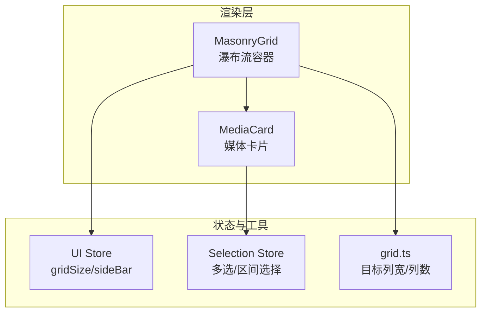
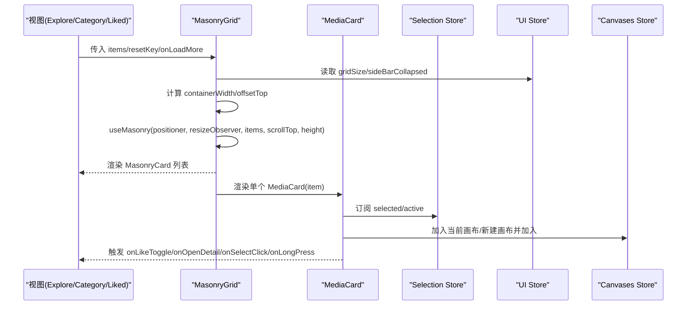
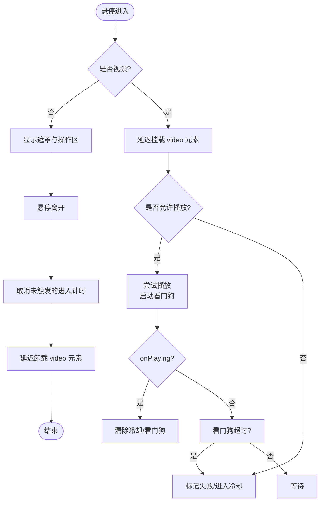
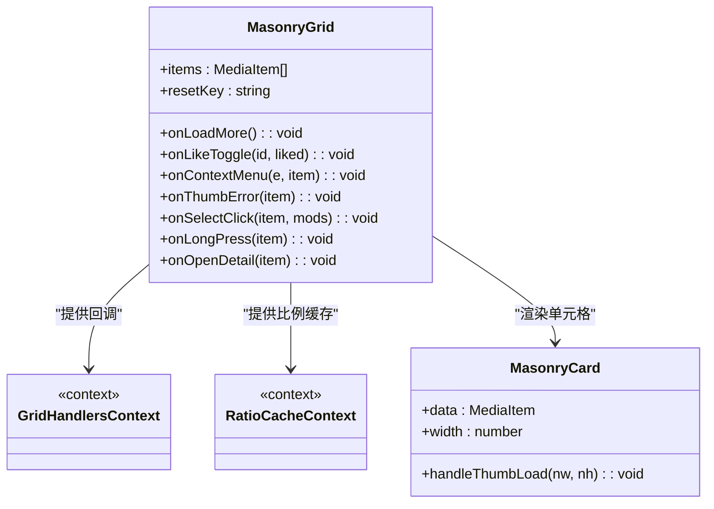
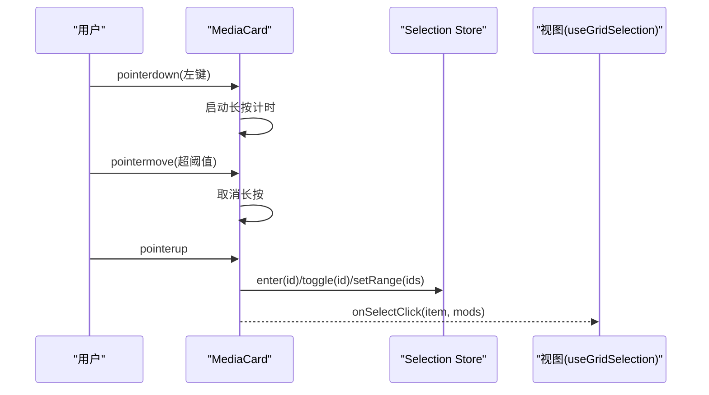
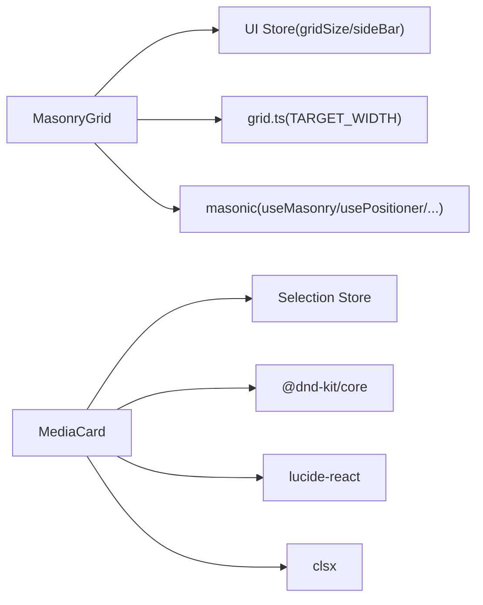

# 媒体展示组件

<cite>
**本文引用的文件**
- [MediaCard.tsx](file://src/renderer/src/components/MediaCard.tsx)
- [MasonryGrid.tsx](file://src/renderer/src/components/MasonryGrid.tsx)
- [grid.ts](file://src/renderer/src/lib/grid.ts)
- [selection.ts](file://src/renderer/src/stores/selection.ts)
- [ui.ts](file://src/renderer/src/stores/ui.ts)
</cite>

## 目录
1. [简介](#简介)
2. [项目结构](#项目结构)
3. [核心组件](#核心组件)
4. [架构总览](#架构总览)
5. [详细组件分析](#详细组件分析)
6. [依赖关系分析](#依赖关系分析)
7. [性能考量](#性能考量)
8. [故障排查指南](#故障排查指南)
9. [结论](#结论)
10. [附录：使用示例与集成模式](#附录使用示例与集成模式)

## 简介
本文件面向前端开发者，系统化梳理 Serendip 应用中的媒体展示组件，重点覆盖 MediaCard 媒体卡片与 MasonryGrid 瀑布流网格。内容涵盖缩略图加载、视频播放控制、悬停效果、拖拽交互、多选与长按、画布加入流程、瀑布流布局算法与虚拟化、响应式与可访问性、动画与过渡、组合复用策略等，帮助读者快速理解并正确集成这些组件。

## 项目结构
媒体展示相关代码位于渲染进程的前端部分，核心由两个组件构成：
- MediaCard：单张媒体卡片的展示与交互（缩略图/视频、悬停、点赞、加入画布、多选、拖拽）
- MasonryGrid：基于 masonic 的虚拟化瀑布流容器，负责列宽计算、滚动窗口化、无限加载与比例校正

图表来源
- [MasonryGrid.tsx:1-212](file://src/renderer/src/components/MasonryGrid.tsx#L1-L212)
- [MediaCard.tsx:1-614](file://src/renderer/src/components/MediaCard.tsx#L1-L614)
- [grid.ts:1-29](file://src/renderer/src/lib/grid.ts#L1-L29)
- [ui.ts:1-98](file://src/renderer/src/stores/ui.ts#L1-L98)
- [selection.ts:1-141](file://src/renderer/src/stores/selection.ts#L1-L141)

章节来源
- [MasonryGrid.tsx:1-212](file://src/renderer/src/components/MasonryGrid.tsx#L1-L212)
- [MediaCard.tsx:1-614](file://src/renderer/src/components/MediaCard.tsx#L1-L614)
- [grid.ts:1-29](file://src/renderer/src/lib/grid.ts#L1-L29)
- [ui.ts:1-98](file://src/renderer/src/stores/ui.ts#L1-L98)
- [selection.ts:1-141](file://src/renderer/src/stores/selection.ts#L1-L141)

## 核心组件
本节从属性接口、事件处理、状态管理三个维度概述组件能力。

- MediaCard
  - 输入项：媒体数据对象（含 id、类型、时长等）
  - 关键回调：点赞切换、右键菜单、缩略图错误上报、缩略图自然尺寸上报、多选点击、长按进入多选、打开详情
  - 行为特性：悬停显示遮罩与操作按钮；视频在悬停时延迟挂载并静音循环播放；支持拖拽到侧栏分类或画布；多选模式下常显复选框；长按进入多选；加入当前画布或新建画布并加入
  - 内部状态：hovered、shouldPlayVideo、videoFailed、imgError、canvasPicker 位置与方向、多选选中态（订阅 store）

- MasonryGrid
  - 输入项：媒体列表、重置键、可选的“触底加载更多”回调
  - 布局参数：列间距、目标列宽（来自 grid.ts）、容器宽度自适应
  - 虚拟化：masonic 提供 usePositioner/useResizeObserver/useMasonry/useInfiniteLoader，仅渲染视口附近卡片
  - 比例校正：优先使用会话内实测宽高比缓存，其次 DB 记录，最后兜底 3:4；通过 onThumbLoad 动态更新高度触发重排

章节来源
- [MediaCard.tsx:13-29](file://src/renderer/src/components/MediaCard.tsx#L13-L29)
- [MediaCard.tsx:96-127](file://src/renderer/src/components/MediaCard.tsx#L96-L127)
- [MasonryGrid.tsx:44-84](file://src/renderer/src/components/MasonryGrid.tsx#L44-L84)
- [MasonryGrid.tsx:91-109](file://src/renderer/src/components/MasonryGrid.tsx#L91-L109)
- [grid.ts:1-29](file://src/renderer/src/lib/grid.ts#L1-L29)

## 架构总览
MediaCard 与 MasonryGrid 的组合遵循“容器-单元格”模式：
- MasonryGrid 作为容器，负责列宽、滚动窗口化、无限加载、比例缓存与上下文分发
- MediaCard 作为单元格，专注单条媒体的展示与交互，并通过回调与上层视图通信

图表来源
- [MasonryGrid.tsx:161-202](file://src/renderer/src/components/MasonryGrid.tsx#L161-L202)
- [MediaCard.tsx:115-127](file://src/renderer/src/components/MediaCard.tsx#L115-L127)
- [MediaCard.tsx:286-353](file://src/renderer/src/components/MediaCard.tsx#L286-L353)

## 详细组件分析

### MediaCard 媒体卡片
- 缩略图加载与失败回退
  - 使用自定义协议加载缩略图，失败时显示占位文本并上报错误
  - 成功加载后上报自然宽高，供父级修正格子比例，避免首次冷库导致的统一比例失真

- 视频播放控制
  - 悬停进入时延迟挂载 video 元素，离开后延迟卸载，减少抖动
  - 全局维护最多同时播放数量，超出则排队或标记失败
  - 冷却机制：当视频明确 error 时进入指数退避冷却，看门狗超时只标记本次失败不进入冷却
  - 播放成功后清除冷却与看门狗

- 悬停效果与操作区
  - 渐变遮罩淡入，左下角点赞按钮，右下角“加入画布胶囊”与“展开画布选择器”
  - 多选模式下隐藏操作区，常显复选框

- 拖拽与长按
  - 基于 dnd-kit 注册为可拖拽对象，激活阈值与移动取消长按一致
  - 长按进入多选，移动超过阈值取消长按，避免与拖拽冲突

- 多选与单击路由
  - 多选模式或修饰键下走选择逻辑；普通单击打开详情
  - 长按触发后拦截后续 click，防止重复切换

- 加入画布
  - 无当前画布自动创建并加入；有当前画布直接加入
  - 弹出画布选择器，支持选择已有画布或新建并加入

图表来源
- [MediaCard.tsx:179-221](file://src/renderer/src/components/MediaCard.tsx#L179-L221)
- [MediaCard.tsx:224-279](file://src/renderer/src/components/MediaCard.tsx#L224-L279)
- [MediaCard.tsx:48-68](file://src/renderer/src/components/MediaCard.tsx#L48-L68)

章节来源
- [MediaCard.tsx:13-29](file://src/renderer/src/components/MediaCard.tsx#L13-L29)
- [MediaCard.tsx:96-127](file://src/renderer/src/components/MediaCard.tsx#L96-L127)
- [MediaCard.tsx:179-221](file://src/renderer/src/components/MediaCard.tsx#L179-L221)
- [MediaCard.tsx:224-279](file://src/renderer/src/components/MediaCard.tsx#L224-L279)
- [MediaCard.tsx:286-353](file://src/renderer/src/components/MediaCard.tsx#L286-L353)
- [MediaCard.tsx:360-416](file://src/renderer/src/components/MediaCard.tsx#L360-L416)
- [MediaCard.tsx:420-598](file://src/renderer/src/components/MediaCard.tsx#L420-L598)

### MasonryGrid 瀑布流网格
- 布局算法与列宽
  - 目标列宽来自 grid.ts 的尺寸档配置，按容器宽度反推列数
  - 行/列间距固定，masonic 根据 columnWidth 与 columnGutter 计算布局

- 虚拟化与滚动
  - 使用 usePositioner/useResizeObserver/useMasonry 实现无副作用的底层 API 组合
  - 替换默认 window 滚动为容器滚动，使滚动条出现在主区域而非顶栏之上
  - overscanBy 控制预渲染行数，平衡流畅度与内存占用

- 比例校正与抖动抑制
  - 初始比例优先级：会话内实测 > DB 记录 > 3:4 兜底
  - 通过 ResizeObserver 监听 cell 真实高度变化，自动重排该格
  - 模块级 ratioCacheRef 跨重挂复用，避免二次抖动

- 无限加载
  - useInfiniteLoader 配合 isItemLoaded 与 threshold 提前触发 onLoadMore

图表来源
- [MasonryGrid.tsx:40-84](file://src/renderer/src/components/MasonryGrid.tsx#L40-L84)
- [MasonryGrid.tsx:91-109](file://src/renderer/src/components/MasonryGrid.tsx#L91-L109)
- [MasonryGrid.tsx:161-202](file://src/renderer/src/components/MasonryGrid.tsx#L161-L202)

章节来源
- [MasonryGrid.tsx:1-212](file://src/renderer/src/components/MasonryGrid.tsx#L1-L212)
- [grid.ts:1-29](file://src/renderer/src/lib/grid.ts#L1-L29)

### 多选与长按交互
- 多选状态集中管理，卡片自身订阅 selected/active，避免将选中态透传到父级导致整表重渲染
- 长按进入多选，移动超过阈值取消长按；Shift+点击进行区间选择，锚点由最近一次点选决定

图表来源
- [MediaCard.tsx:360-416](file://src/renderer/src/components/MediaCard.tsx#L360-L416)
- [selection.ts:85-141](file://src/renderer/src/stores/selection.ts#L85-L141)

章节来源
- [selection.ts:1-141](file://src/renderer/src/stores/selection.ts#L1-L141)
- [MediaCard.tsx:360-416](file://src/renderer/src/components/MediaCard.tsx#L360-L416)

## 依赖关系分析
- 组件耦合
  - MasonryGrid 依赖 UI Store 获取 gridSize 与侧栏折叠状态，依赖 grid.ts 的目标列宽
  - MediaCard 依赖 Selection Store 的多选状态，依赖 Canvases Store 的画布操作
- 外部库
  - masonic：提供虚拟化瀑布流的 positioner、resizeObserver、infinite loader 等
  - dnd-kit：提供拖拽能力
  - lucide-react：图标
  - clsx：类名合并

图表来源
- [MasonryGrid.tsx:1-14](file://src/renderer/src/components/MasonryGrid.tsx#L1-L14)
- [MediaCard.tsx:1-11](file://src/renderer/src/components/MediaCard.tsx#L1-L11)
- [grid.ts:1-29](file://src/renderer/src/lib/grid.ts#L1-L29)
- [ui.ts:1-98](file://src/renderer/src/stores/ui.ts#L1-L98)
- [selection.ts:1-141](file://src/renderer/src/stores/selection.ts#L1-L141)

章节来源
- [MasonryGrid.tsx:1-212](file://src/renderer/src/components/MasonryGrid.tsx#L1-L212)
- [MediaCard.tsx:1-614](file://src/renderer/src/components/MediaCard.tsx#L1-L614)
- [grid.ts:1-29](file://src/renderer/src/lib/grid.ts#L1-L29)
- [ui.ts:1-98](file://src/renderer/src/stores/ui.ts#L1-L98)
- [selection.ts:1-141](file://src/renderer/src/stores/selection.ts#L1-L141)

## 性能考量
- 虚拟化与窗口化
  - 仅渲染视口附近卡片，结合 overscanBy 控制预渲染范围，降低 DOM 节点数量
- 比例校正与重排优化
  - 使用会话级 ratioCache 避免回滚时的二次抖动；仅在比例差异显著时更新，减少不必要的重排
- 视频播放池与冷却
  - 限制同时播放数量，避免资源争用；error 事件触发冷却，看门狗区分慢加载与损坏，避免误伤
- 懒加载与延迟挂载
  - 缩略图 lazy loading；视频悬停延迟挂载与离开延迟卸载，减少频繁 mount/unmount 抖动
- 稳定引用与 memo
  - 卡片 props 稳定，外层 memo 屏蔽父级无谓重渲染；masonic 的 render 引用稳定，利于无限加载缓存命中

[本节为通用性能建议，无需特定文件来源]

## 故障排查指南
- 缩略图加载失败
  - 现象：卡片显示“加载失败”占位
  - 排查：确认缩略图服务可用；检查 onThumbError 上报链路是否正确
  - 参考路径：[MediaCard.tsx:355-358](file://src/renderer/src/components/MediaCard.tsx#L355-L358)

- 视频无法播放
  - 现象：悬停出现播放标识但不播放
  - 排查：查看是否处于冷却期；检查 canPlayVideo 池满情况；关注看门狗日志
  - 参考路径：[MediaCard.tsx:70-87](file://src/renderer/src/components/MediaCard.tsx#L70-L87), [MediaCard.tsx:235-248](file://src/renderer/src/components/MediaCard.tsx#L235-L248)

- 瀑布流比例异常
  - 现象：图片被裁剪或呈现统一比例
  - 排查：确认 onThumbLoad 是否上报自然宽高；检查 ratioCache 是否写入；观察 DB 记录是否缺失
  - 参考路径：[MasonryGrid.tsx:58-67](file://src/renderer/src/components/MasonryGrid.tsx#L58-L67)

- 多选/长按冲突
  - 现象：长按后仍触发单击或拖拽
  - 排查：确认长按触发后是否拦截 click；移动阈值是否生效
  - 参考路径：[MediaCard.tsx:392-416](file://src/renderer/src/components/MediaCard.tsx#L392-L416)

章节来源
- [MediaCard.tsx:355-358](file://src/renderer/src/components/MediaCard.tsx#L355-L358)
- [MediaCard.tsx:70-87](file://src/renderer/src/components/MediaCard.tsx#L70-L87)
- [MediaCard.tsx:235-248](file://src/renderer/src/components/MediaCard.tsx#L235-L248)
- [MasonryGrid.tsx:58-67](file://src/renderer/src/components/MasonryGrid.tsx#L58-L67)
- [MediaCard.tsx:392-416](file://src/renderer/src/components/MediaCard.tsx#L392-L416)

## 结论
MediaCard 与 MasonryGrid 共同构成了高效、可扩展的媒体展示方案。前者聚焦单条媒体的交互体验与健壮性，后者提供高性能的瀑布流布局与虚拟化。通过合理的比例校正、播放池与冷却机制、稳定的引用与 memo 优化，整体具备优秀的性能与用户体验。

[本节为总结性内容，无需特定文件来源]

## 附录：使用示例与集成模式

- 基本用法
  - 在探索/分类/喜欢视图中引入 MasonryGrid，传入 items、resetKey 与可选 onLoadMore
  - 为 MasonryGrid 提供 onLikeToggle、onContextMenu、onSelectClick、onLongPress、onOpenDetail 等回调
  - 参考路径：[MasonryGrid.tsx:91-109](file://src/renderer/src/components/MasonryGrid.tsx#L91-L109)

- 响应式设计
  - 通过 UI Store 的 gridSize 切换小/中/大尺寸档，影响目标列宽与列数
  - 参考路径：[ui.ts:6-7](file://src/renderer/src/stores/ui.ts#L6-L7), [grid.ts:9-13](file://src/renderer/src/lib/grid.ts#L9-L13)

- 可访问性
  - 卡片外层设置 outline-none 与 focus-visible 规则，确保键盘导航可见
  - 图片 alt 为空字符串（装饰性），操作按钮具备语义化名称与焦点样式
  - 参考路径：[MediaCard.tsx:424-430](file://src/renderer/src/components/MediaCard.tsx#L424-L430)

- 跨浏览器兼容性
  - 使用 playsInline 与 muted 提升移动端播放成功率
  - 使用 ResizeObserver 与 Pointer Events 增强现代浏览器体验
  - 参考路径：[MediaCard.tsx:462-474](file://src/renderer/src/components/MediaCard.tsx#L462-L474)

- 动画与过渡
  - 悬停遮罩与操作区使用 transition-opacity 平滑显示
  - 多选复选框与选中态使用 ring 与 saturate 反馈
  - 参考路径：[MediaCard.tsx:490-596](file://src/renderer/src/components/MediaCard.tsx#L490-L596)

- 组合与复用
  - 将 GridHandlers 通过 Context 注入，避免每次 render 重建影响 masonic 缓存
  - 使用 memo 包裹 MediaCard，屏蔽父级无意义重渲染
  - 参考路径：[MasonryGrid.tsx:172-182](file://src/renderer/src/components/MasonryGrid.tsx#L172-L182), [MediaCard.tsx:601-606](file://src/renderer/src/components/MediaCard.tsx#L601-L606)

章节来源
- [MasonryGrid.tsx:91-109](file://src/renderer/src/components/MasonryGrid.tsx#L91-L109)
- [ui.ts:6-7](file://src/renderer/src/stores/ui.ts#L6-L7)
- [grid.ts:9-13](file://src/renderer/src/lib/grid.ts#L9-L13)
- [MediaCard.tsx:424-430](file://src/renderer/src/components/MediaCard.tsx#L424-L430)
- [MediaCard.tsx:462-474](file://src/renderer/src/components/MediaCard.tsx#L462-L474)
- [MediaCard.tsx:490-596](file://src/renderer/src/components/MediaCard.tsx#L490-L596)
- [MasonryGrid.tsx:172-182](file://src/renderer/src/components/MasonryGrid.tsx#L172-L182)
- [MediaCard.tsx:601-606](file://src/renderer/src/components/MediaCard.tsx#L601-L606)