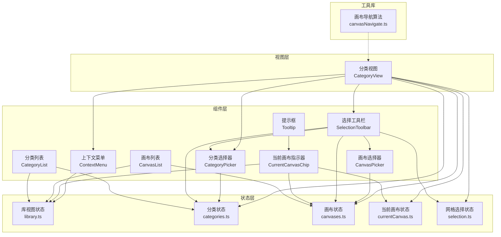
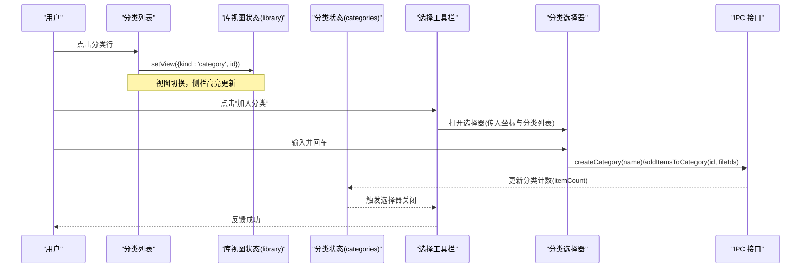
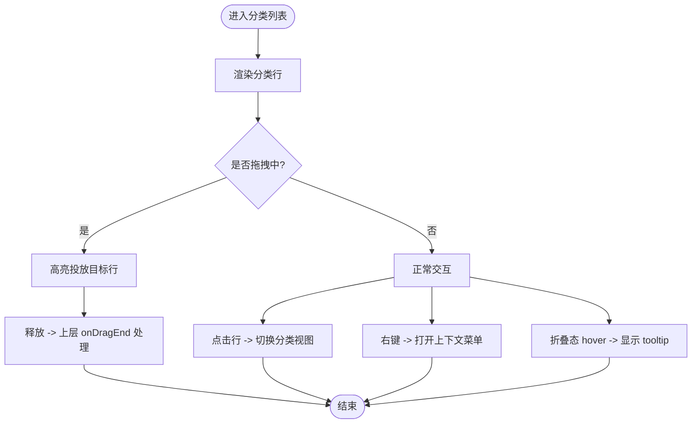
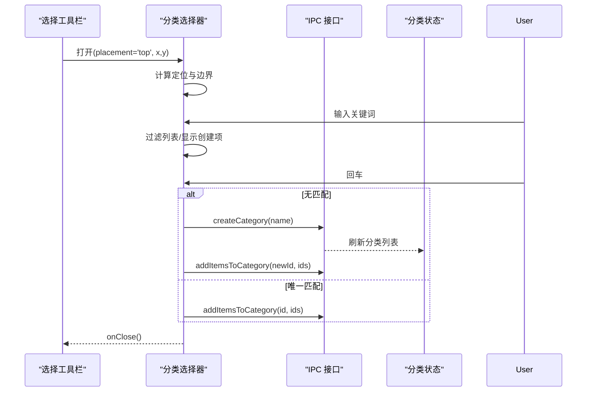
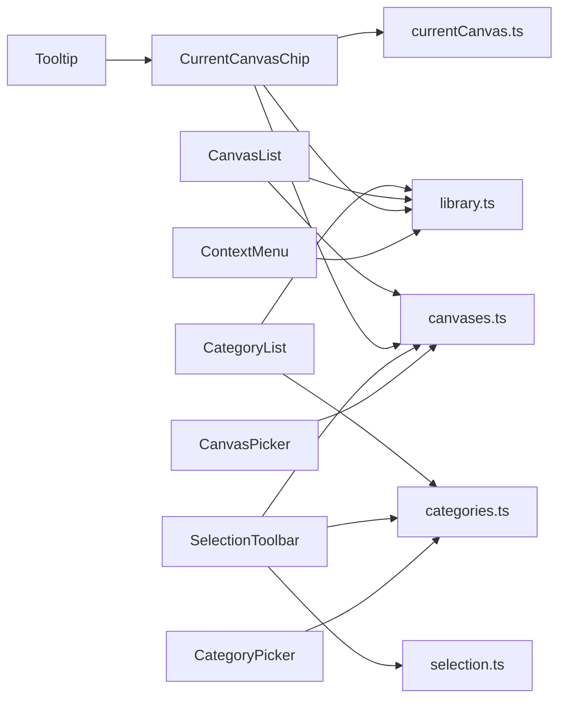

# 导航组件

<cite>
**本文引用的文件**
- [CategoryList.tsx](file://src/renderer/src/components/CategoryList.tsx)
- [CanvasList.tsx](file://src/renderer/src/components/CanvasList.tsx)
- [CurrentCanvasChip.tsx](file://src/renderer/src/components/CurrentCanvasChip.tsx)
- [SelectionToolbar.tsx](file://src/renderer/src/components/SelectionToolbar.tsx)
- [CategoryPicker.tsx](file://src/renderer/src/components/CategoryPicker.tsx)
- [CanvasPicker.tsx](file://src/renderer/src/components/CanvasPicker.tsx)
- [ContextMenu.tsx](file://src/renderer/src/components/ContextMenu.tsx)
- [Tooltip.tsx](file://src/renderer/src/components/Tooltip.tsx)
- [library.ts](file://src/renderer/src/stores/library.ts)
- [categories.ts](file://src/renderer/src/stores/categories.ts)
- [canvases.ts](file://src/renderer/src/stores/canvases.ts)
- [currentCanvas.ts](file://src/renderer/src/stores/currentCanvas.ts)
- [selection.ts](file://src/renderer/src/stores/selection.ts)
- [canvasNavigate.ts](file://src/renderer/src/lib/canvasNavigate.ts)
- [CategoryView.tsx](file://src/renderer/src/views/CategoryView.tsx)
</cite>

## 目录
1. [简介](#简介)
2. [项目结构](#项目结构)
3. [核心组件](#核心组件)
4. [架构总览](#架构总览)
5. [详细组件分析](#详细组件分析)
6. [依赖关系分析](#依赖关系分析)
7. [性能与体验优化](#性能与体验优化)
8. [故障排查指南](#故障排查指南)
9. [结论](#结论)
10. [附录：集成与扩展指南](#附录集成与扩展指南)

## 简介
本文件为 Serendip 应用的“导航组件”提供系统化文档，覆盖以下关键能力：
- 分类列表、画布列表：支持拖拽排序、右键菜单、折叠态提示、投放高亮。
- 分类选择器、画布选择器：搜索过滤、创建并选中、智能定位与边界检测。
- 当前画布指示器：快速跳转与清除当前画布。
- 选择工具栏：批量操作入口（喜欢/取消、加入分类/画布、移除等）。
- 上下文菜单与 Tooltip：通用交互支撑。
- 状态管理与数据绑定：基于 Zustand 的 store 驱动 UI 更新。
- 用户交互流程：点击、长按、Shift/Ctrl 多选、键盘与窗口移动事件。
- 响应式布局与移动端适配：面板定位、滚动穿透防护、触摸手势。
- 组件间通信与数据同步：store 订阅、IPC 调用、乐观更新策略。
- 性能优化与用户体验改进：局部更新、防抖/节流、可访问性建议。
- 集成与扩展指导：如何接入新视图、新增导航项、自定义样式与行为。

## 项目结构
导航相关代码主要位于渲染进程前端：
- components：UI 组件（列表、选择器、工具栏、菜单、提示）
- stores：全局状态（库视图、分类、画布、当前画布、选择）
- views：页面级组合（如分类视图使用选择工具栏与选择器）
- lib：辅助算法（画布导航方向计算等）

图表来源
- [CategoryList.tsx:1-212](file://src/renderer/src/components/CategoryList.tsx#L1-L212)
- [CanvasList.tsx:1-200](file://src/renderer/src/components/CanvasList.tsx#L1-L200)
- [CurrentCanvasChip.tsx:1-73](file://src/renderer/src/components/CurrentCanvasChip.tsx#L1-L73)
- [SelectionToolbar.tsx:1-212](file://src/renderer/src/components/SelectionToolbar.tsx#L1-L212)
- [CategoryPicker.tsx:1-173](file://src/renderer/src/components/CategoryPicker.tsx#L1-L173)
- [CanvasPicker.tsx:1-162](file://src/renderer/src/components/CanvasPicker.tsx#L1-L162)
- [ContextMenu.tsx:1-166](file://src/renderer/src/components/ContextMenu.tsx#L1-L166)
- [Tooltip.tsx:1-98](file://src/renderer/src/components/Tooltip.tsx#L1-L98)
- [library.ts:1-100](file://src/renderer/src/stores/library.ts#L1-L100)
- [categories.ts:1-95](file://src/renderer/src/stores/categories.ts#L1-L95)
- [canvases.ts:1-115](file://src/renderer/src/stores/canvases.ts#L1-L115)
- [currentCanvas.ts:1-18](file://src/renderer/src/stores/currentCanvas.ts#L1-L18)
- [selection.ts:1-141](file://src/renderer/src/stores/selection.ts#L1-L141)
- [canvasNavigate.ts:1-88](file://src/renderer/src/lib/canvasNavigate.ts#L1-L88)
- [CategoryView.tsx:1-414](file://src/renderer/src/views/CategoryView.tsx#L1-L414)

章节来源
- [CategoryList.tsx:1-212](file://src/renderer/src/components/CategoryList.tsx#L1-L212)
- [CanvasList.tsx:1-200](file://src/renderer/src/components/CanvasList.tsx#L1-L200)
- [CurrentCanvasChip.tsx:1-73](file://src/renderer/src/components/CurrentCanvasChip.tsx#L1-L73)
- [SelectionToolbar.tsx:1-212](file://src/renderer/src/components/SelectionToolbar.tsx#L1-L212)
- [CategoryPicker.tsx:1-173](file://src/renderer/src/components/CategoryPicker.tsx#L1-L173)
- [CanvasPicker.tsx:1-162](file://src/renderer/src/components/CanvasPicker.tsx#L1-L162)
- [ContextMenu.tsx:1-166](file://src/renderer/src/components/ContextMenu.tsx#L1-L166)
- [Tooltip.tsx:1-98](file://src/renderer/src/components/Tooltip.tsx#L1-L98)
- [library.ts:1-100](file://src/renderer/src/stores/library.ts#L1-L100)
- [categories.ts:1-95](file://src/renderer/src/stores/categories.ts#L1-L95)
- [canvases.ts:1-115](file://src/renderer/src/stores/canvases.ts#L1-L115)
- [currentCanvas.ts:1-18](file://src/renderer/src/stores/currentCanvas.ts#L1-L18)
- [selection.ts:1-141](file://src/renderer/src/stores/selection.ts#L1-L141)
- [canvasNavigate.ts:1-88](file://src/renderer/src/lib/canvasNavigate.ts#L1-L88)
- [CategoryView.tsx:1-414](file://src/renderer/src/views/CategoryView.tsx#L1-L414)

## 核心组件
本节概述各导航组件的职责、配置项、事件与样式定制要点。

- 分类列表（CategoryList）
  - 职责：展示分类树；支持拖拽重排；作为媒体投放目标；折叠态显示图标+悬浮提示。
  - 关键 props：activeDragType、hoveredDropCategoryId、collapsed、onRename、onDelete。
  - 交互：点击切换分类视图；右键打开上下文菜单；拖拽时高亮投放目标。
  - 样式：通过 Tailwind 类名控制激活态、悬停态、投放高亮环；折叠态居中图标。
  - 数据绑定：从 categories store 读取分类列表；点击通过 library store 切换 view。

- 画布列表（CanvasList）
  - 职责：展示画布树；支持拖拽重排；作为媒体投放目标；折叠态提示。
  - 关键 props：activeDragType、hoveredDropCanvasId、collapsed、onRename、onDelete。
  - 交互：点击切换画布视图；右键菜单重命名/删除；拖拽高亮。
  - 样式：与分类列表一致的设计语言。
  - 数据绑定：从 canvases store 读取；点击通过 library store 切换 view。

- 当前画布指示器（CurrentCanvasChip）
  - 职责：在任意视图下显示当前画布入口；点击进入画布；关闭按钮清除当前画布并回退到上次非画布视图。
  - 关键 props：style（用于外部定位）。
  - 交互：点击切换视图；右上角 X 清除当前画布。
  - 数据绑定：currentCanvas store + canvases store + library store。

- 选择工具栏（SelectionToolbar）
  - 职责：多选模式下的批量操作入口（全选/清空、喜欢/取消、不感兴趣、加入分类/画布、移除）。
  - 关键 props：active、count、totalCount、onClear、onSelectAll/onDeselectAll、categories、canvases、currentCanvasId、各类回调。
  - 交互：打开分类/画布选择器；根据 currentCanvasId 快捷加入当前画布。
  - 样式：底部固定、毛玻璃背景、圆角胶囊风格。

- 分类选择器（CategoryPicker）
  - 职责：弹出式分类选择面板；支持搜索过滤与“创建并选中”。
  - 关键 props：x/y、placement、parentLeft、categories、onSelect、onCreateAndSelect、onClose。
  - 交互：Enter 键快速选择或创建；点击外部区域/ESC/窗口移动关闭；自动边界检测与翻转。
  - 定位：top/submenu/cursor 三种锚点模式；子菜单模式下对齐父菜单左侧。

- 画布选择器（CanvasPicker）
  - 职责：弹出式画布选择面板；支持搜索过滤与“创建并选中”。
  - 关键 props：x/y、placement、alignRight、triggerRef、canvases、onSelect、onCreateAndSelect、onClose。
  - 交互：Enter 键快速选择或创建；点击外部区域/ESC/窗口移动关闭；top 模式采用 bottom 锚定以稳定高度变化时的位置。
  - 定位：top/bottom/cursor 三种模式；支持右对齐。

- 上下文菜单（ContextMenu）
  - 职责：通用右键/悬停展开的子菜单；支持分隔符、危险项、子菜单。
  - 关键 props：x/y、items、onClose、placement、onSubmenuClose。
  - 交互：鼠标悬停延迟展开子菜单；离开非子菜单项关闭子菜单；ESC/滚动/失焦/窗口移动关闭。

- 提示框（Tooltip）
  - 职责：轻量提示，支持多方位定位与延迟显示。
  - 关键 props：text、children、side、delay。
  - 交互：hover/focus 显示；blur/leave 隐藏；通过 cloneElement 注入事件。

章节来源
- [CategoryList.tsx:1-212](file://src/renderer/src/components/CategoryList.tsx#L1-L212)
- [CanvasList.tsx:1-200](file://src/renderer/src/components/CanvasList.tsx#L1-L200)
- [CurrentCanvasChip.tsx:1-73](file://src/renderer/src/components/CurrentCanvasChip.tsx#L1-L73)
- [SelectionToolbar.tsx:1-212](file://src/renderer/src/components/SelectionToolbar.tsx#L1-L212)
- [CategoryPicker.tsx:1-173](file://src/renderer/src/components/CategoryPicker.tsx#L1-L173)
- [CanvasPicker.tsx:1-162](file://src/renderer/src/components/CanvasPicker.tsx#L1-L162)
- [ContextMenu.tsx:1-166](file://src/renderer/src/components/ContextMenu.tsx#L1-L166)
- [Tooltip.tsx:1-98](file://src/renderer/src/components/Tooltip.tsx#L1-L98)

## 架构总览
导航组件通过 Zustand store 管理应用视图与实体状态，结合 IPC 与后端交互，形成“组件 → store → IPC → 主进程”的数据流。

图表来源
- [CategoryList.tsx:1-212](file://src/renderer/src/components/CategoryList.tsx#L1-L212)
- [library.ts:1-100](file://src/renderer/src/stores/library.ts#L1-L100)
- [categories.ts:1-95](file://src/renderer/src/stores/categories.ts#L1-L95)
- [SelectionToolbar.tsx:1-212](file://src/renderer/src/components/SelectionToolbar.tsx#L1-L212)
- [CategoryPicker.tsx:1-173](file://src/renderer/src/components/CategoryPicker.tsx#L1-L173)

## 详细组件分析

### 分类列表（CategoryList）
- 设计要点
  - 使用 dnd-kit 的 SortableContext + useSortable 实现行内拖拽排序。
  - 每行同时作为“分类拖拽源”和“媒体投放目标”，由上层 App 的 onDragEnd 根据 active.data.type 区分处理。
  - 折叠态下仅显示图标，hover 时通过 Portal 渲染 tooltip 显示名称与数量。
- 状态与数据
  - 读取 categories store 的列表；点击设置 library store 的 view。
  - 右键菜单通过本地 state 控制 ContextMenu 显隐。
- 交互流程
  - 拖拽排序：dragStart/dragOver/dragEnd 由 dnd-kit 驱动，乐观更新顺序后持久化。
  - 投放高亮：当 activeDragType === 'media' 且 hoveredDropCategoryId 匹配时，行高亮。
- 样式定制
  - 激活态文本色、悬停背景、投放高亮边框与半透明背景均可通过 Tailwind 类名调整。
- 可访问性
  - 提供 aria 语义（如 role="menuitem" 在 ContextMenu），建议为分类行增加 aria-label。

图表来源
- [CategoryList.tsx:1-212](file://src/renderer/src/components/CategoryList.tsx#L1-L212)
- [categories.ts:1-95](file://src/renderer/src/stores/categories.ts#L1-L95)
- [library.ts:1-100](file://src/renderer/src/stores/library.ts#L1-L100)

章节来源
- [CategoryList.tsx:1-212](file://src/renderer/src/components/CategoryList.tsx#L1-L212)
- [categories.ts:1-95](file://src/renderer/src/stores/categories.ts#L1-L95)
- [library.ts:1-100](file://src/renderer/src/stores/library.ts#L1-L100)

### 画布列表（CanvasList）
- 设计要点
  - 与分类列表结构对称，支持拖拽排序与投放高亮。
  - 点击切换至画布视图；右键菜单支持重命名/删除。
- 状态与数据
  - 读取 canvases store；点击设置 library store 的 view。
- 交互流程
  - 拖拽排序：乐观更新顺序后持久化。
  - 投放高亮：同分类列表逻辑。
- 样式定制
  - 与分类列表一致的视觉风格。

章节来源
- [CanvasList.tsx:1-200](file://src/renderer/src/components/CanvasList.tsx#L1-L200)
- [canvases.ts:1-115](file://src/renderer/src/stores/canvases.ts#L1-L115)
- [library.ts:1-100](file://src/renderer/src/stores/library.ts#L1-L100)

### 当前画布指示器（CurrentCanvasChip）
- 设计要点
  - 在任何视图下显示当前画布入口；点击进入画布；关闭按钮清除当前画布并回退到最近一次非画布视图。
- 状态与数据
  - 读取 currentCanvas store 的 currentCanvasId；查找 canvases store 获取画布信息；通过 library store 切换视图。
- 交互流程
  - 点击：若已在画布视图则回退；否则进入对应画布。
  - 关闭：清除 currentCanvasId，必要时切换回 prevViewRef.current。
- 样式定制
  - 激活态边框与背景色；关闭按钮悬停变色。

章节来源
- [CurrentCanvasChip.tsx:1-73](file://src/renderer/src/components/CurrentCanvasChip.tsx#L1-L73)
- [currentCanvas.ts:1-18](file://src/renderer/src/stores/currentCanvas.ts#L1-L18)
- [canvases.ts:1-115](file://src/renderer/src/stores/canvases.ts#L1-L115)
- [library.ts:1-100](file://src/renderer/src/stores/library.ts#L1-L100)

### 选择工具栏（SelectionToolbar）
- 设计要点
  - 多选模式下的统一操作入口；支持全选/清空、喜欢/取消、不感兴趣、加入分类/画布、移除。
  - 当存在 currentCanvasId 时，“加入画布”直接添加到当前画布，无需弹窗。
- 状态与数据
  - 接收 count/totalCount 等派生状态；categories/canvases 来自各自 store。
- 交互流程
  - 打开分类选择器：计算按钮中心坐标，传入 placement='top'。
  - 打开画布选择器：若无 currentCanvasId，则计算坐标打开；否则直接调用 onAddToCanvas(currentCanvasId)。
- 样式定制
  - 底部固定、毛玻璃背景、圆角胶囊风格；危险操作红色主题。

章节来源
- [SelectionToolbar.tsx:1-212](file://src/renderer/src/components/SelectionToolbar.tsx#L1-L212)
- [CategoryPicker.tsx:1-173](file://src/renderer/src/components/CategoryPicker.tsx#L1-L173)
- [CanvasPicker.tsx:1-162](file://src/renderer/src/components/CanvasPicker.tsx#L1-L162)
- [categories.ts:1-95](file://src/renderer/src/stores/categories.ts#L1-L95)
- [canvases.ts:1-115](file://src/renderer/src/stores/canvases.ts#L1-L115)
- [currentCanvas.ts:1-18](file://src/renderer/src/stores/currentCanvas.ts#L1-L18)

### 分类选择器（CategoryPicker）
- 设计要点
  - 弹出式面板，支持搜索过滤与“创建并选中”。
  - 三种 placement：top（按钮上沿中心）、submenu（子菜单行右侧）、cursor（鼠标位置）。
  - 子菜单模式：优先向右紧贴父菜单，不足时向左对齐父菜单左边；垂直方向超出底部则上移。
- 状态与数据
  - 本地 search 状态；filtered 列表；showCreate 条件渲染“创建”项。
- 交互流程
  - Enter：若为空匹配则创建并选中；若唯一匹配则直接选中。
  - 关闭：点击外部区域、ESC、窗口移动均关闭。
- 定位与边界检测
  - 计算 left/top 并做四边边界修正；确保始终可见。

图表来源
- [SelectionToolbar.tsx:1-212](file://src/renderer/src/components/SelectionToolbar.tsx#L1-L212)
- [CategoryPicker.tsx:1-173](file://src/renderer/src/components/CategoryPicker.tsx#L1-L173)
- [categories.ts:1-95](file://src/renderer/src/stores/categories.ts#L1-L95)

章节来源
- [CategoryPicker.tsx:1-173](file://src/renderer/src/components/CategoryPicker.tsx#L1-L173)
- [SelectionToolbar.tsx:1-212](file://src/renderer/src/components/SelectionToolbar.tsx#L1-L212)
- [categories.ts:1-95](file://src/renderer/src/stores/categories.ts#L1-L95)

### 画布选择器（CanvasPicker）
- 设计要点
  - 弹出式面板，支持搜索过滤与“创建并选中”。
  - top 模式采用 bottom 锚定，使面板高度变化时底部固定不动；bottom/cursor 使用 top 定位。
  - 支持 alignRight 与 triggerRef 透传，便于与触发元素对齐。
- 状态与数据
  - 本地 search 状态；filtered 列表；showCreate 条件渲染“创建”项。
- 交互流程
  - Enter：若为空匹配则创建并选中；若唯一匹配则直接选中。
  - 关闭：点击外部区域、ESC、窗口移动均关闭。
- 定位与边界检测
  - 计算 left/top/bottom 并做边界修正；top 模式用 bottom 定位避免抖动。

章节来源
- [CanvasPicker.tsx:1-162](file://src/renderer/src/components/CanvasPicker.tsx#L1-L162)
- [SelectionToolbar.tsx:1-212](file://src/renderer/src/components/SelectionToolbar.tsx#L1-L212)
- [canvases.ts:1-115](file://src/renderer/src/stores/canvases.ts#L1-L115)

### 上下文菜单（ContextMenu）
- 设计要点
  - 支持分隔符、头部标题、危险项、子菜单。
  - 子菜单通过 onSubmenuOpen(rect) 打开，hover 延迟 150ms 展开；离开非子菜单项关闭子菜单。
- 交互流程
  - 点击非子菜单项执行 onClick 并关闭；ESC/滚动/失焦/窗口移动关闭。
- 定位与边界检测
  - cursor 模式默认；top 模式居中于 y 上方；四边边界修正。

章节来源
- [ContextMenu.tsx:1-166](file://src/renderer/src/components/ContextMenu.tsx#L1-L166)

### 提示框（Tooltip）
- 设计要点
  - 通过 cloneElement 注入 hover/focus 事件，不侵入子组件。
  - 支持 side 定位与 delay 延迟显示。
- 交互流程
  - hover/focus 显示；blur/leave 隐藏；Portal 渲染到 body。

章节来源
- [Tooltip.tsx:1-98](file://src/renderer/src/components/Tooltip.tsx#L1-L98)

### 分类视图中的导航集成（CategoryView）
- 设计要点
  - 使用 SelectionToolbar 进行批量操作；使用 CategoryPicker 进行“添加到分类”子菜单。
  - 使用 ContextMenu 提供单条操作的“添加到分类”子菜单。
- 交互流程
  - 多选：长按/Shift/Ctrl 点击进入多选；工具栏显示批量操作。
  - 批量加入分类/画布：调用 categories/canvases store 的 addItems 方法。
  - 批量移除：确认后调用 removeItemsFromCategory。

章节来源
- [CategoryView.tsx:1-414](file://src/renderer/src/views/CategoryView.tsx#L1-L414)
- [SelectionToolbar.tsx:1-212](file://src/renderer/src/components/SelectionToolbar.tsx#L1-L212)
- [CategoryPicker.tsx:1-173](file://src/renderer/src/components/CategoryPicker.tsx#L1-L173)
- [ContextMenu.tsx:1-166](file://src/renderer/src/components/ContextMenu.tsx#L1-L166)
- [categories.ts:1-95](file://src/renderer/src/stores/categories.ts#L1-L95)
- [canvases.ts:1-115](file://src/renderer/src/stores/canvases.ts#L1-L115)

## 依赖关系分析
- 组件耦合
  - CategoryList/CanvasList 强依赖各自 store 与 library store 的 view 切换。
  - SelectionToolbar 聚合多个选择器与 store，承担批量操作编排。
  - CategoryPicker/CanvasPicker 独立性强，仅依赖各自 store 的 CRUD 与 IPC。
- 外部依赖
  - dnd-kit：拖拽排序。
  - lucide-react：图标。
  - clsx：条件类名拼接。
  - zustand：状态管理。
  - electron IPC：与主进程通信。
- 潜在循环依赖
  - 组件与 store 单向依赖，未见循环导入。
- 界面与状态解耦
  - 所有 UI 变更通过 store 的 setter 触发，保证单一数据源。

图表来源
- [CategoryList.tsx:1-212](file://src/renderer/src/components/CategoryList.tsx#L1-L212)
- [CanvasList.tsx:1-200](file://src/renderer/src/components/CanvasList.tsx#L1-L200)
- [CurrentCanvasChip.tsx:1-73](file://src/renderer/src/components/CurrentCanvasChip.tsx#L1-L73)
- [SelectionToolbar.tsx:1-212](file://src/renderer/src/components/SelectionToolbar.tsx#L1-L212)
- [CategoryPicker.tsx:1-173](file://src/renderer/src/components/CategoryPicker.tsx#L1-L173)
- [CanvasPicker.tsx:1-162](file://src/renderer/src/components/CanvasPicker.tsx#L1-L162)
- [ContextMenu.tsx:1-166](file://src/renderer/src/components/ContextMenu.tsx#L1-L166)
- [Tooltip.tsx:1-98](file://src/renderer/src/components/Tooltip.tsx#L1-L98)
- [library.ts:1-100](file://src/renderer/src/stores/library.ts#L1-L100)
- [categories.ts:1-95](file://src/renderer/src/stores/categories.ts#L1-L95)
- [canvases.ts:1-115](file://src/renderer/src/stores/canvases.ts#L1-L115)
- [currentCanvas.ts:1-18](file://src/renderer/src/stores/currentCanvas.ts#L1-L18)
- [selection.ts:1-141](file://src/renderer/src/stores/selection.ts#L1-L141)

章节来源
- [library.ts:1-100](file://src/renderer/src/stores/library.ts#L1-L100)
- [categories.ts:1-95](file://src/renderer/src/stores/categories.ts#L1-L95)
- [canvases.ts:1-115](file://src/renderer/src/stores/canvases.ts#L1-L115)
- [currentCanvas.ts:1-18](file://src/renderer/src/stores/currentCanvas.ts#L1-L18)
- [selection.ts:1-141](file://src/renderer/src/stores/selection.ts#L1-L141)

## 性能与体验优化
- 局部更新
  - categories/canvases store 在执行增删改后对 itemCount 进行局部增量更新，避免整表重拉。
- 乐观更新
  - reorder 先更新本地顺序再持久化，减少重排闪烁。
- 定位稳定性
  - CanvasPicker 的 top 模式使用 bottom 锚定，避免面板高度变化导致跳动。
- 事件清理
  - 选择器与上下文菜单在卸载时移除 mousedown/contextmenu/keydown/window move 监听，防止内存泄漏。
- 滚动穿透防护
  - 选择器阻止 wheel 传播，避免底层滚动影响面板。
- 可访问性
  - 上下文菜单使用 role="menu"/role="menuitem"；建议为分类/画布行添加 aria-label 与键盘导航支持。
- 移动端适配
  - 触摸手势：长按进入多选（见 selection hook）；点击外部区域关闭面板；窗口移动关闭面板。
  - 建议在移动端增加滑动关闭面板与更大触控区域。

[本节为通用指导，不直接分析具体文件]

## 故障排查指南
- 面板未正确定位
  - 检查 placement 参数与 parentLeft/alignRight 是否正确传入。
  - 确认窗口尺寸变化后是否重新计算定位（useLayoutEffect 已处理）。
- 面板无法关闭
  - 检查是否在外部点击/ESC/窗口移动事件中调用了 onClose。
  - 确认事件监听是否被正确移除。
- 拖拽无效
  - 确认 SortableContext 的 items 与 useSortable 的 id 一致。
  - 检查 activeDragType 与 hoveredDrop* 是否由上层正确传递。
- 选择器未触发创建
  - 确认 showCreate 条件：search.trim().length > 0 且 filtered.length === 0。
  - 检查 Enter 键处理分支。
- 当前画布指示器异常
  - 检查 currentCanvasId 是否为 null；确认 prevViewRef 是否正确记录最近非画布视图。

章节来源
- [CategoryPicker.tsx:1-173](file://src/renderer/src/components/CategoryPicker.tsx#L1-L173)
- [CanvasPicker.tsx:1-162](file://src/renderer/src/components/CanvasPicker.tsx#L1-L162)
- [ContextMenu.tsx:1-166](file://src/renderer/src/components/ContextMenu.tsx#L1-L166)
- [CategoryList.tsx:1-212](file://src/renderer/src/components/CategoryList.tsx#L1-L212)
- [CanvasList.tsx:1-200](file://src/renderer/src/components/CanvasList.tsx#L1-L200)
- [CurrentCanvasChip.tsx:1-73](file://src/renderer/src/components/CurrentCanvasChip.tsx#L1-L73)

## 结论
导航组件围绕“列表—选择器—工具栏—指示器”的体系构建，通过统一的 store 与 IPC 机制实现跨视图的状态同步与数据一致性。组件具备完善的定位与边界检测、丰富的交互（拖拽、多选、键盘、窗口移动）、良好的可扩展性与可定制性。遵循本文档的配置与最佳实践，可快速集成与扩展新的导航能力。

[本节为总结，不直接分析具体文件]

## 附录：集成与扩展指南
- 在新视图中启用多选
  - 引入 useGridSelection(items)，将 handleSelectClick/handleLongPress 透传给卡片。
  - 在视图挂载时注册 clear 清理，避免残留选择状态。
- 接入批量操作
  - 在视图中传入 SelectionToolbar 的 categories/canvases 与回调（如 onAddToCategory/onAddToCanvas）。
  - 如需“创建并加入”，实现 onCreateAndAddToCategory/onCreateAndAddToCanvas。
- 自定义样式
  - 通过 Tailwind 类名覆盖激活态、悬停态、危险态等；注意保持对比度与可访问性。
- 扩展拖拽目标
  - 在列表组件中维护 hoveredDrop* 状态，并在 onDragOver 中更新；在 onDragEnd 中根据 active.data.type 分发处理。
- 键盘与可访问性
  - 为列表项添加 tabindex 与 onKeyDown 支持；为菜单项提供焦点管理与方向键导航。
- 移动端增强
  - 增加滑动手势关闭面板；增大触控区域；优化触摸反馈。

章节来源
- [selection.ts:1-141](file://src/renderer/src/stores/selection.ts#L1-L141)
- [CategoryView.tsx:1-414](file://src/renderer/src/views/CategoryView.tsx#L1-L414)
- [SelectionToolbar.tsx:1-212](file://src/renderer/src/components/SelectionToolbar.tsx#L1-L212)
- [CategoryList.tsx:1-212](file://src/renderer/src/components/CategoryList.tsx#L1-L212)
- [CanvasList.tsx:1-200](file://src/renderer/src/components/CanvasList.tsx#L1-L200)