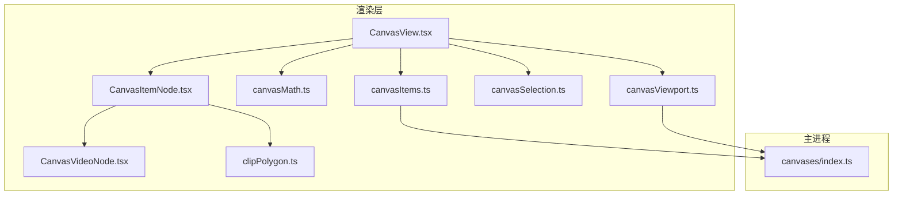
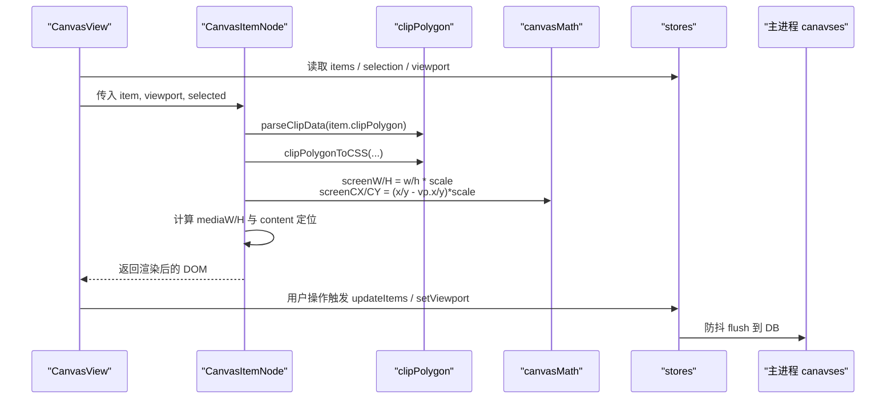
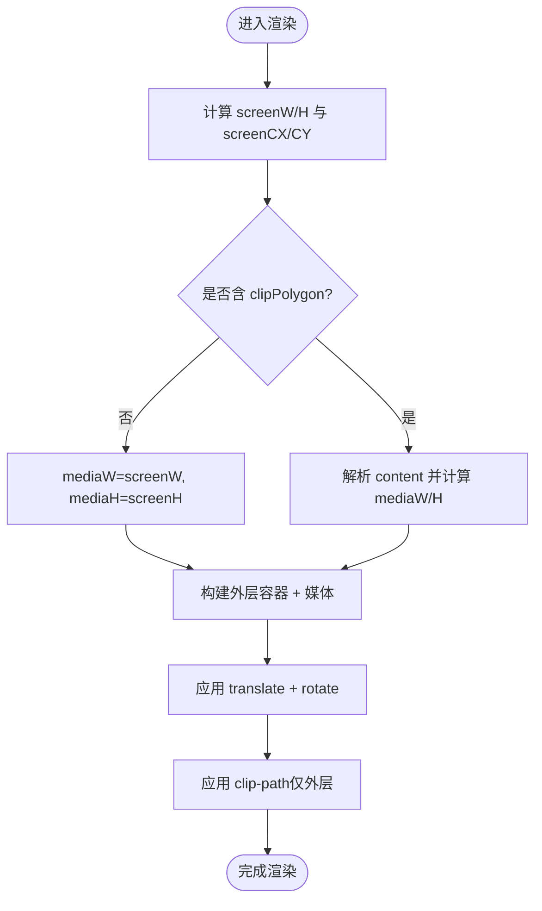
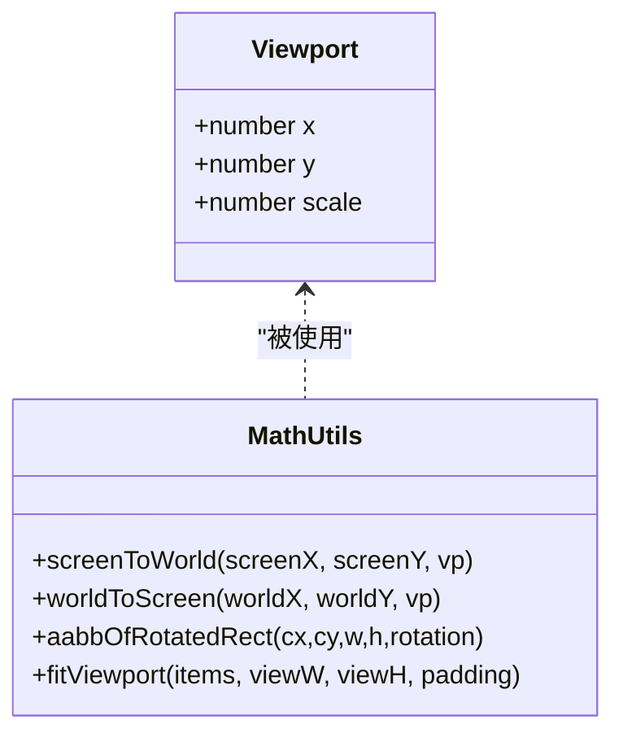
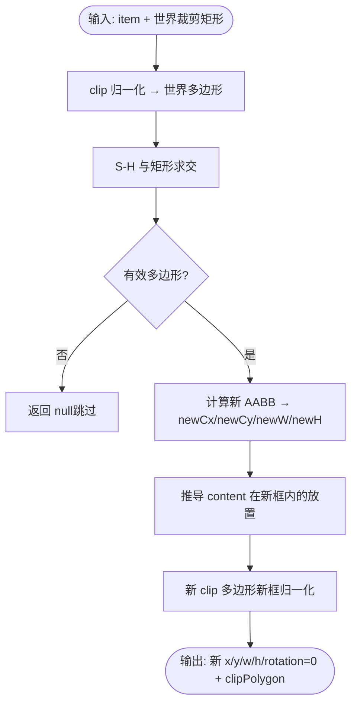
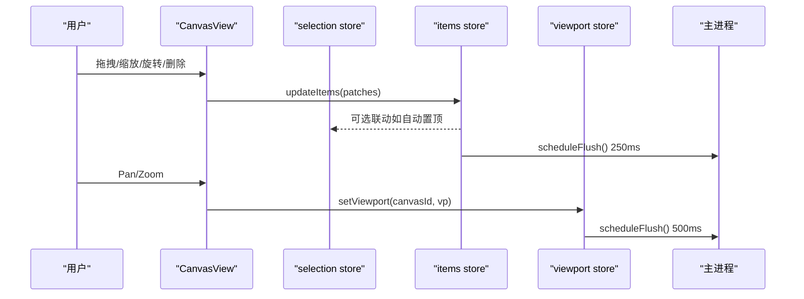
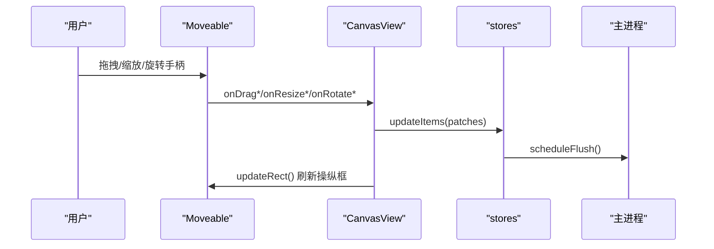
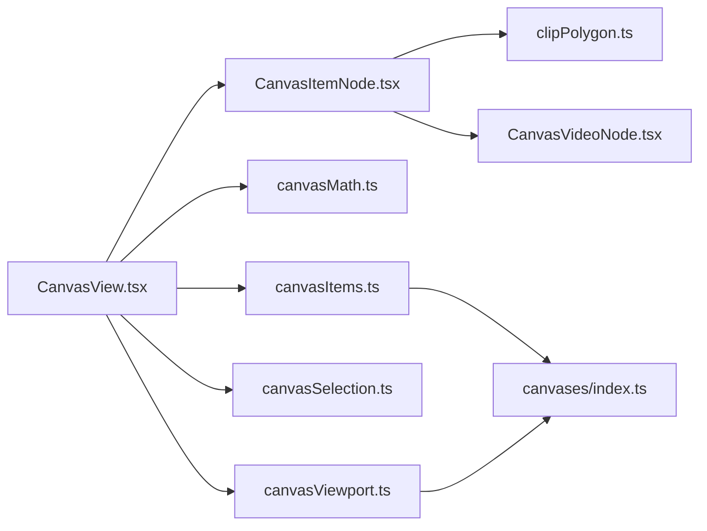

# CanvasItemNode 画布元素节点

<cite>
**本文引用的文件**
- [CanvasItemNode.tsx](file://src/renderer/src/views/canvas/CanvasItemNode.tsx)
- [CanvasView.tsx](file://src/renderer/src/views/canvas/CanvasView.tsx)
- [clipPolygon.ts](file://src/renderer/src/lib/clipPolygon.ts)
- [canvasMath.ts](file://src/renderer/src/lib/canvasMath.ts)
- [canvasItems.ts](file://src/renderer/src/stores/canvasItems.ts)
- [canvasSelection.ts](file://src/renderer/src/stores/canvasSelection.ts)
- [canvasViewport.ts](file://src/renderer/src/stores/canvasViewport.ts)
- [CanvasVideoNode.tsx](file://src/renderer/src/views/canvas/CanvasVideoNode.tsx)
- [index.ts（主进程画布模型）](file://src/main/canvases/index.ts)
</cite>

## 目录
1. [简介](#简介)
2. [项目结构](#项目结构)
3. [核心组件](#核心组件)
4. [架构总览](#架构总览)
5. [详细组件分析](#详细组件分析)
6. [依赖关系分析](#依赖关系分析)
7. [性能考量](#性能考量)
8. [故障排查指南](#故障排查指南)
9. [结论](#结论)
10. [附录：扩展自定义元素类型](#附录扩展自定义元素类型)

## 简介
本文件围绕 CanvasItemNode 画布元素节点，系统性阐述单个画布元素的渲染逻辑、变换矩阵计算与视觉呈现；深入解析定位系统、尺寸计算、旋转处理与层级管理；详解 clipPolygon 裁剪多边形的实现原理与性能优化；覆盖状态管理、选中效果、悬停反馈与编辑模式切换；并提供图片、视频等元素类型的扩展方法与拖拽响应、碰撞检测、边界约束的实现细节，最终给出开发者自定义元素类型的完整指南。

## 项目结构
CanvasItemNode 位于渲染层视图模块中，负责将数据模型中的“画布项”渲染为 DOM 元素，并配合视口、选择、存储等子系统完成交互与持久化。

图表来源
- [CanvasView.tsx:1-120](file://src/renderer/src/views/canvas/CanvasView.tsx#L1-L120)
- [CanvasItemNode.tsx:1-154](file://src/renderer/src/views/canvas/CanvasItemNode.tsx#L1-L154)
- [clipPolygon.ts:1-283](file://src/renderer/src/lib/clipPolygon.ts#L1-L283)
- [canvasMath.ts:1-226](file://src/renderer/src/lib/canvasMath.ts#L1-L226)
- [canvasItems.ts:1-94](file://src/renderer/src/stores/canvasItems.ts#L1-L94)
- [canvasSelection.ts:1-62](file://src/renderer/src/stores/canvasSelection.ts#L1-L62)
- [canvasViewport.ts:1-53](file://src/renderer/src/stores/canvasViewport.ts#L1-L53)
- [index.ts（主进程画布模型）:1-320](file://src/main/canvases/index.ts#L1-L320)

章节来源
- [CanvasView.tsx:1-120](file://src/renderer/src/views/canvas/CanvasView.tsx#L1-L120)
- [CanvasItemNode.tsx:1-154](file://src/renderer/src/views/canvas/CanvasItemNode.tsx#L1-L154)

## 核心组件
- CanvasItemNode：单元素渲染器，负责根据视口缩放计算屏幕坐标与尺寸，应用 transform 进行平移与旋转，支持 clip-path 多边形裁剪与内层媒体内容定位，提供选中高亮与 z-index 层级控制。
- CanvasView：画布容器，集成视口导航、框选、拖拽、缩放、旋转、复制粘贴、删除、层级调整、键盘快捷键、摄影机手摇等全局交互，并通过 Moveable/Selecto 驱动元素操作。
- clipPolygon：裁剪几何库，维护 clip 多边形与 content 放置信息，提供 Sutherland–Hodgman 矩形裁剪、CSS clip-path 生成、内容缩放适配等能力。
- canvasMath：数学工具集，包含视口变换、AABB 包围盒、自动布局、黄金角落点算法等。
- stores：Zustand 状态管理，包括 items 列表、选择集合、视口缓存与防抖持久化。
- CanvasVideoNode：视频元素专用渲染器，基于 IntersectionObserver 与占比阈值控制播放/暂停，首帧缩略图占位提升体验。

章节来源
- [CanvasItemNode.tsx:1-154](file://src/renderer/src/views/canvas/CanvasItemNode.tsx#L1-L154)
- [CanvasView.tsx:1-120](file://src/renderer/src/views/canvas/CanvasView.tsx#L1-L120)
- [clipPolygon.ts:1-283](file://src/renderer/src/lib/clipPolygon.ts#L1-L283)
- [canvasMath.ts:1-226](file://src/renderer/src/lib/canvasMath.ts#L1-L226)
- [canvasItems.ts:1-94](file://src/renderer/src/stores/canvasItems.ts#L1-L94)
- [canvasSelection.ts:1-62](file://src/renderer/src/stores/canvasSelection.ts#L1-L62)
- [canvasViewport.ts:1-53](file://src/renderer/src/stores/canvasViewport.ts#L1-L53)
- [CanvasVideoNode.tsx:1-109](file://src/renderer/src/views/canvas/CanvasVideoNode.tsx#L1-L109)

## 架构总览
CanvasItemNode 作为叶子节点，接收来自 CanvasView 的 item 与 viewport，结合 clipPolygon 与 canvasMath 完成渲染。CanvasView 通过 store 与主进程通信，实现数据的加载、更新与持久化。

图表来源
- [CanvasView.tsx:1068-1182](file://src/renderer/src/views/canvas/CanvasView.tsx#L1068-L1182)
- [CanvasItemNode.tsx:29-154](file://src/renderer/src/views/canvas/CanvasItemNode.tsx#L29-L154)
- [clipPolygon.ts:124-144](file://src/renderer/src/lib/clipPolygon.ts#L124-L144)
- [canvasMath.ts:20-28](file://src/renderer/src/lib/canvasMath.ts#L20-L28)
- [canvasItems.ts:66-85](file://src/renderer/src/stores/canvasItems.ts#L66-L85)
- [canvasViewport.ts:46-49](file://src/renderer/src/stores/canvasViewport.ts#L46-L49)
- [index.ts（主进程画布模型）:278-288](file://src/main/canvases/index.ts#L278-L288)

## 详细组件分析

### CanvasItemNode 渲染与变换
- 定位与尺寸
  - 屏幕宽高：item.w/h × viewport.scale
  - 屏幕中心：(item.x - viewport.x) × scale, (item.y - viewport.y) × scale
  - 外层容器使用绝对定位 + transform translate + rotate，transformOrigin 居中，willChange 提示浏览器优化合成
- 裁剪与内容
  - 若存在 clipPolygon，则解析为 {clip, content}，clip 用于 CSS clip-path 在外层框上裁剪；content 描述图像在框内的世界单位偏移与旋转，单独用内层 div 定位并保持原朝向
  - 未裁剪时 mediaW/H 等于外层框尺寸；裁剪后 mediaW/H 由 content.w/h × scale 决定
- 媒体资源
  - 图片：先显示缩略图，再异步预加载全分辨率并淡入覆盖
  - 视频：交由 CanvasVideoNode，按可视占比与选中态控制播放/暂停，IntersectionObserver 懒挂载 video 节点
- 视觉反馈
  - 选中：outline 与 boxShadow 高亮
  - 层级：z-index 取自 item.z
  - 指针事件：内部媒体禁用 pointerEvents，避免干扰上层交互

图表来源
- [CanvasItemNode.tsx:41-52](file://src/renderer/src/views/canvas/CanvasItemNode.tsx#L41-L52)
- [CanvasItemNode.tsx:103-154](file://src/renderer/src/views/canvas/CanvasItemNode.tsx#L103-L154)
- [clipPolygon.ts:124-144](file://src/renderer/src/lib/clipPolygon.ts#L124-L144)

章节来源
- [CanvasItemNode.tsx:1-154](file://src/renderer/src/views/canvas/CanvasItemNode.tsx#L1-L154)

### 定位系统与视口变换
- 世界坐标与屏幕坐标互转：screenToWorld/worldToScreen
- 视口缩放离散档位：以 ZOOM_STEP 为步长，clampScale 限制范围
- 自动适配：fitViewport 基于所有元素 AABB 计算最佳缩放与中心

图表来源
- [canvasMath.ts:3-18](file://src/renderer/src/lib/canvasMath.ts#L3-L18)
- [canvasMath.ts:20-28](file://src/renderer/src/lib/canvasMath.ts#L20-L28)
- [canvasMath.ts:30-104](file://src/renderer/src/lib/canvasMath.ts#L30-L104)

章节来源
- [canvasMath.ts:1-226](file://src/renderer/src/lib/canvasMath.ts#L1-L226)

### 裁剪多边形 clipPolygon 原理与优化
- 数据结构
  - clip：归一化多边形（[0,1]²），用于 CSS clip-path
  - content：图像相对外层框的世界单位偏移 cx/cy、尺寸 w/h、相对旋转 rot
- 裁剪流程
  - 将 clip 从归一化映射到世界坐标，与世界裁剪矩形求交（Sutherland–Hodgman）
  - 输出新 AABB 作为新的外层框（rotation 归零），重新计算 content 在新框内的放置
  - 生成新的 clip 多边形（新框归一化）
- 性能优化
  - clip 多边形在缩放时不变，仅 content 按比例缩放（scaleClipContent）
  - 拖拽缩放过程中实时同步 .canvas-content 的尺寸与位置，避免 clip-path 缩放但内容不缩放导致的错位
  - 最小面积过滤：小于阈值的裁剪结果直接丢弃

图表来源
- [clipPolygon.ts:87-118](file://src/renderer/src/lib/clipPolygon.ts#L87-L118)
- [clipPolygon.ts:164-254](file://src/renderer/src/lib/clipPolygon.ts#L164-L254)
- [clipPolygon.ts:273-282](file://src/renderer/src/lib/clipPolygon.ts#L273-L282)

章节来源
- [clipPolygon.ts:1-283](file://src/renderer/src/lib/clipPolygon.ts#L1-L283)

### 状态管理与交互
- 选择状态
  - 单选/多选/全选/范围选择，anchor 用于 Shift 区间选择
  - 点击空白清空选区，修饰键 Ctrl/Cmd 切换 toggle，Shift 加选
- 视口状态
  - byId 缓存每个画布的视口，setViewport 触发 500ms 防抖写入 DB，unmount 时立即 flush
- 数据更新
  - updateItems 乐观更新本地状态，250ms 合并去重后批量 flush 到主进程

图表来源
- [canvasSelection.ts:17-61](file://src/renderer/src/stores/canvasSelection.ts#L17-L61)
- [canvasItems.ts:66-85](file://src/renderer/src/stores/canvasItems.ts#L66-L85)
- [canvasViewport.ts:46-49](file://src/renderer/src/stores/canvasViewport.ts#L46-L49)
- [CanvasView.tsx:1108-1180](file://src/renderer/src/views/canvas/CanvasView.tsx#L1108-L1180)

章节来源
- [canvasSelection.ts:1-62](file://src/renderer/src/stores/canvasSelection.ts#L1-L62)
- [canvasItems.ts:1-94](file://src/renderer/src/stores/canvasItems.ts#L1-L94)
- [canvasViewport.ts:1-53](file://src/renderer/src/stores/canvasViewport.ts#L1-L53)
- [CanvasView.tsx:1108-1180](file://src/renderer/src/views/canvas/CanvasView.tsx#L1108-L1180)

### 拖拽、缩放、旋转与层级
- 拖拽
  - 单选：Moveable onDrag/onDragEnd 计算位移并写回 x/y
  - 多选：onDragGroup* 对每个目标分别累加位移
  - 组拖拽启动：等待 >8px 移动才触发，避免单击误触
- 缩放
  - keepRatio=true，统一比例缩放；裁剪元素在缩放时调用 scaleClipContent 保持内容比例
  - 拖拽缩放期间实时更新 .canvas-content 尺寸与位置，保证 clip-path 与内容一致
- 旋转
  - 四角热区叠加 CornerRotateOverlay，提交时累积角度增量，多选时绕组质心旋转
- 层级
  - 支持前移/后移/置顶/置底，多选时保持相对顺序，自动置顶开关可启用

图表来源
- [CanvasView.tsx:1212-1589](file://src/renderer/src/views/canvas/CanvasView.tsx#L1212-L1589)
- [CanvasView.tsx:979-1042](file://src/renderer/src/views/canvas/CanvasView.tsx#L979-L1042)
- [CanvasView.tsx:1328-1388](file://src/renderer/src/views/canvas/CanvasView.tsx#L1328-L1388)

章节来源
- [CanvasView.tsx:1212-1589](file://src/renderer/src/views/canvas/CanvasView.tsx#L1212-L1589)
- [CanvasView.tsx:979-1042](file://src/renderer/src/views/canvas/CanvasView.tsx#L979-L1042)

### 碰撞检测与边界约束
- 碰撞检测
  - rectsOverlap：轴对齐矩形相交测试（用于布局与落点搜索）
  - aabbOfRotatedRect：旋转矩形的 AABB 计算（用于 fitViewport、布局、落点）
- 边界约束
  - 当前未实现硬边界约束（无 snap/bounds 配置），元素可自由移出视口
  - 可通过扩展 Moveable 的 bounds/snappable 或自行在 onDragEnd 中钳制 x/y 实现

章节来源
- [canvasMath.ts:30-60](file://src/renderer/src/lib/canvasMath.ts#L30-L60)
- [canvasMath.ts:114-123](file://src/renderer/src/lib/canvasMath.ts#L114-L123)
- [CanvasView.tsx:1192-1210](file://src/renderer/src/views/canvas/CanvasView.tsx#L1192-L1210)

### 视频元素渲染与性能
- 首帧缩略图始终显示，video 仅在入视口且满足条件时挂载
- 根据屏幕占比与选中态决定是否播放，全局冻结选项可强制暂停
- 使用 IntersectionObserver 减少不必要的 video 实例创建

章节来源
- [CanvasVideoNode.tsx:1-109](file://src/renderer/src/views/canvas/CanvasVideoNode.tsx#L1-L109)

## 依赖关系分析
- CanvasItemNode 依赖：
  - clipPolygon：裁剪数据解析与 CSS 生成
  - canvasMath：视口换算（间接由 CanvasView 提供）
  - CanvasVideoNode：视频渲染
- CanvasView 依赖：
  - stores：items/selection/viewport
  - lib：canvasMath、clipPolygon、navigate/handCursor
  - 第三方：Moveable、Selecto
- 主进程：
  - canvases/index.ts：数据模型与 CRUD 接口

图表来源
- [CanvasItemNode.tsx:1-154](file://src/renderer/src/views/canvas/CanvasItemNode.tsx#L1-L154)
- [CanvasView.tsx:1-120](file://src/renderer/src/views/canvas/CanvasView.tsx#L1-L120)
- [canvasItems.ts:1-94](file://src/renderer/src/stores/canvasItems.ts#L1-L94)
- [canvasViewport.ts:1-53](file://src/renderer/src/stores/canvasViewport.ts#L1-L53)
- [index.ts（主进程画布模型）:1-320](file://src/main/canvases/index.ts#L1-L320)

章节来源
- [CanvasItemNode.tsx:1-154](file://src/renderer/src/views/canvas/CanvasItemNode.tsx#L1-L154)
- [CanvasView.tsx:1-120](file://src/renderer/src/views/canvas/CanvasView.tsx#L1-L120)

## 性能考量
- 合成优化
  - willChange: 'transform' 提示 GPU 加速
  - clip-path 在外层框上生效，避免内容层重复裁剪
- 资源加载
  - 图片延迟全分辨率加载，缩略图秒出占位
  - 视频懒挂载与按需播放，降低内存占用
- 状态持久化
  - 250ms/500ms 防抖合并更新，减少 IO 次数
- 交互流畅性
  - 拖拽/缩放/旋转过程中即时更新 DOM transform，减少重排
  - 使用 flushSync 确保关键更新同帧提交

[本节为通用指导，无需源码引用]

## 故障排查指南
- 裁剪后内容错位
  - 检查 syncContentResize 是否在 onResize/onResizeGroup 中正确执行
  - 确认 clipPolygon 的 content 字段是否随框缩放而更新
- 视频卡顿或频繁启停
  - 检查 isLargeEnough 阈值与 IntersectionObserver 的 root/container 是否正确
  - 全局冻结选项会强制暂停所有视频
- 拖拽/缩放后操纵框不同步
  - 确认 updateRect 在更新后调用
  - 视口变化时使用 useLayoutEffect 同步
- 选区异常
  - 检查 onClick/onPointerDown 的修饰键分支与 groupDragStartedRef 标志
  - 框选结束后 selectoJustSelectedRef 标记防止清空

章节来源
- [CanvasView.tsx:103-119](file://src/renderer/src/views/canvas/CanvasView.tsx#L103-L119)
- [CanvasView.tsx:1108-1180](file://src/renderer/src/views/canvas/CanvasView.tsx#L1108-L1180)
- [CanvasView.tsx:1604-1680](file://src/renderer/src/views/canvas/CanvasView.tsx#L1604-L1680)
- [CanvasVideoNode.tsx:25-65](file://src/renderer/src/views/canvas/CanvasVideoNode.tsx#L25-L65)

## 结论
CanvasItemNode 通过解耦“外层框”和“内层内容”，实现了灵活的裁剪与内容定位；配合视口变换与选择/存储子系统，提供了高性能、可扩展的画布元素渲染方案。clipPolygon 的设计兼顾了交互直观性与渲染效率，适合复杂场景下的多媒体编辑需求。

[本节为总结，无需源码引用]

## 附录：扩展自定义元素类型
- 数据模型扩展
  - 在主进程模型中增加新字段（例如 fileType 枚举扩展、新增属性列）
  - 在 addItemsToCanvas/addItemsToCanvasRaw/updateCanvasItems 中支持新字段
- 渲染层扩展
  - 在 CanvasItemNode 中根据 fileType 分支渲染新组件（参考视频分支）
  - 如需特殊交互，可在 CanvasView 中注册对应的事件处理器
- 状态与持久化
  - 在 stores 的 patch 结构中允许新字段
  - 确保 updateItems 能合并并 flush 新字段
- 示例路径
  - 主进程模型定义与更新：[index.ts（主进程画布模型）:22-73](file://src/main/canvases/index.ts#L22-L73)、[index.ts（主进程画布模型）:258-288](file://src/main/canvases/index.ts#L258-L288)
  - 渲染分支示例：[CanvasItemNode.tsx:72-101](file://src/renderer/src/views/canvas/CanvasItemNode.tsx#L72-L101)
  - 视频组件参考：[CanvasVideoNode.tsx:1-109](file://src/renderer/src/views/canvas/CanvasVideoNode.tsx#L1-L109)

章节来源
- [index.ts（主进程画布模型）:22-73](file://src/main/canvases/index.ts#L22-L73)
- [index.ts（主进程画布模型）:258-288](file://src/main/canvases/index.ts#L258-L288)
- [CanvasItemNode.tsx:72-101](file://src/renderer/src/views/canvas/CanvasItemNode.tsx#L72-L101)
- [CanvasVideoNode.tsx:1-109](file://src/renderer/src/views/canvas/CanvasVideoNode.tsx#L1-L109)