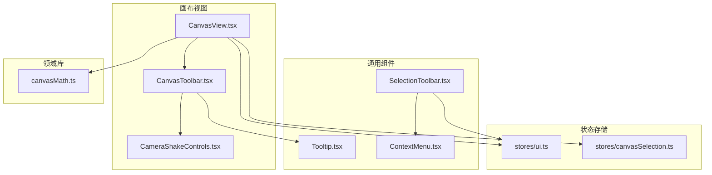
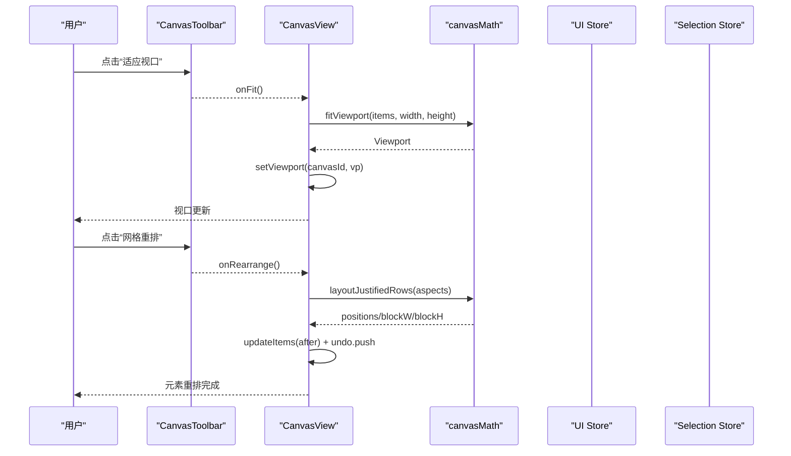
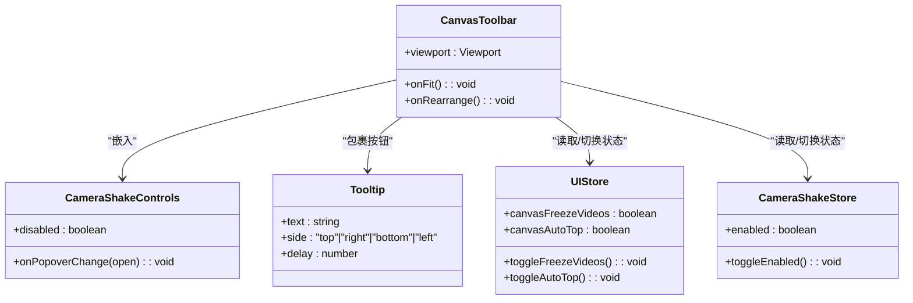
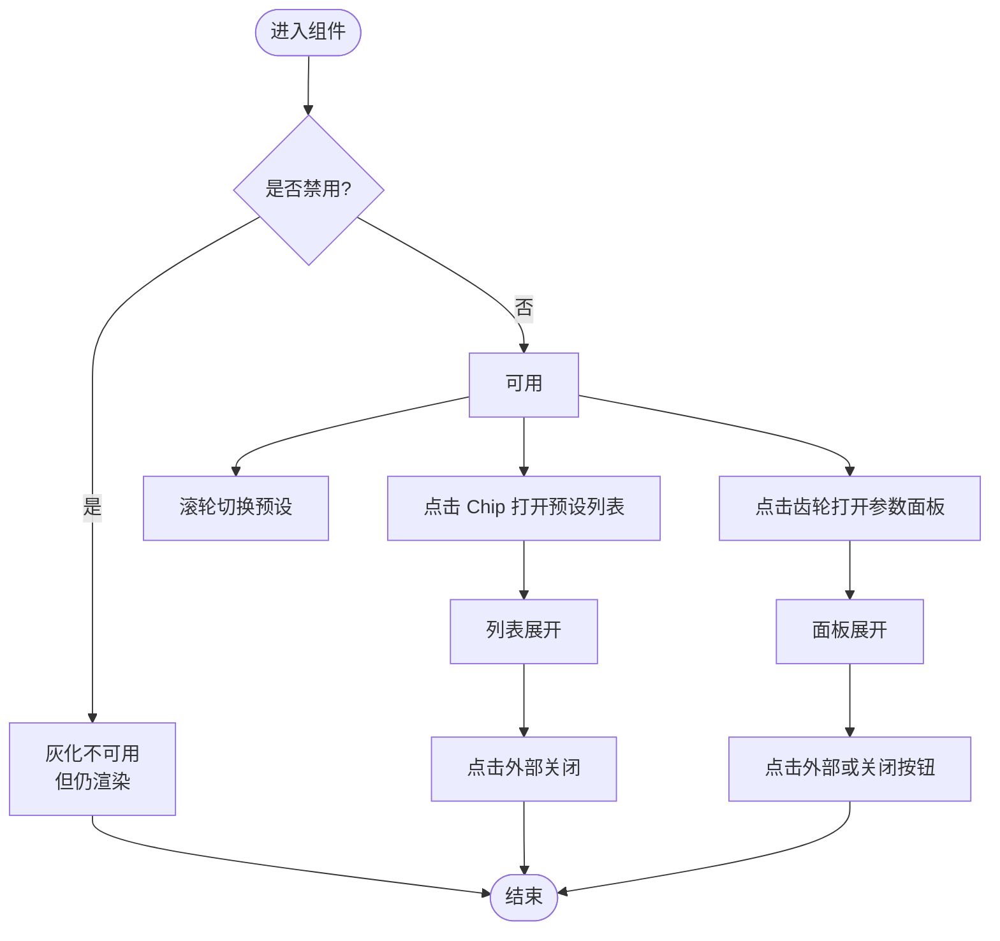
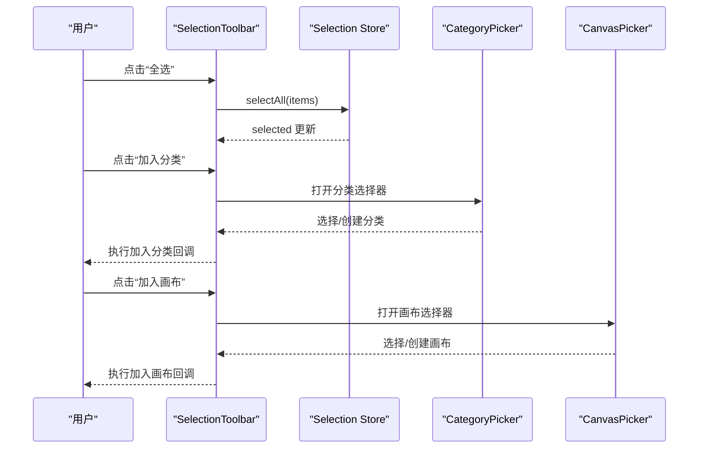
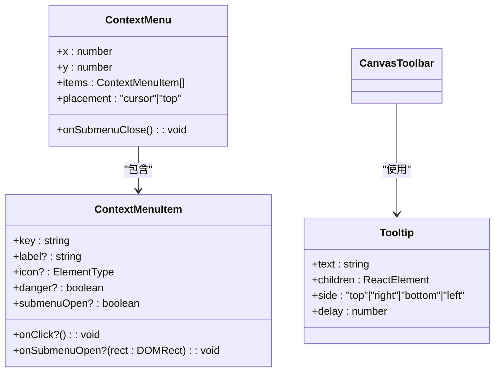
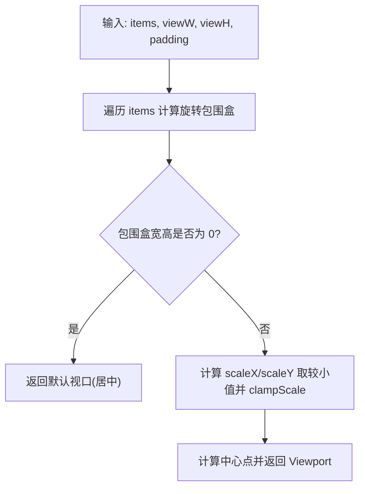
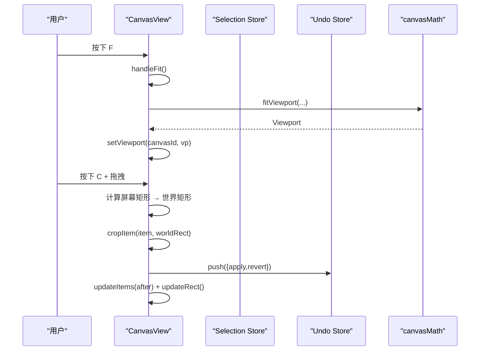
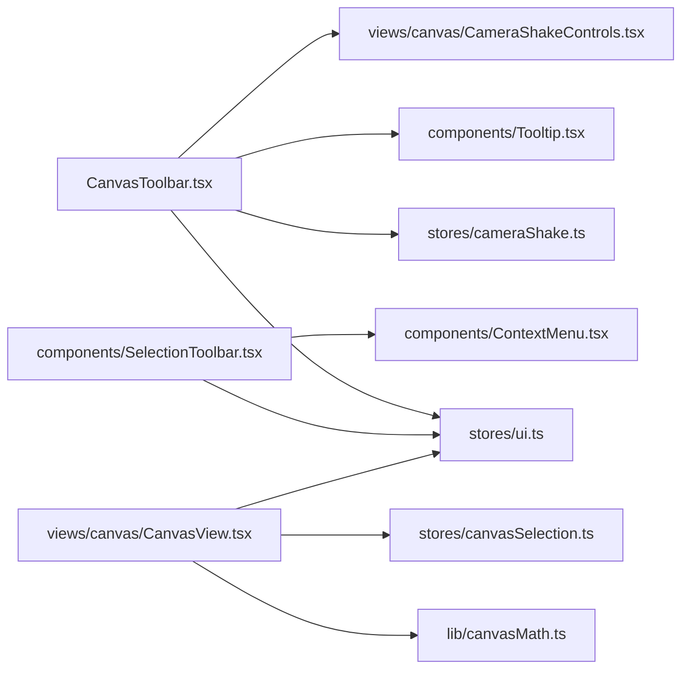

# CanvasToolbar 画布工具栏

<cite>
**本文引用的文件**   
- [CanvasToolbar.tsx](file://src/renderer/src/views/canvas/CanvasToolbar.tsx)
- [CameraShakeControls.tsx](file://src/renderer/src/views/canvas/CameraShakeControls.tsx)
- [Tooltip.tsx](file://src/renderer/src/components/Tooltip.tsx)
- [ContextMenu.tsx](file://src/renderer/src/components/ContextMenu.tsx)
- [SelectionToolbar.tsx](file://src/renderer/src/components/SelectionToolbar.tsx)
- [canvasMath.ts](file://src/renderer/src/lib/canvasMath.ts)
- [ui.ts](file://src/renderer/src/stores/ui.ts)
- [canvasSelection.ts](file://src/renderer/src/stores/canvasSelection.ts)
- [CanvasView.tsx](file://src/renderer/src/views/canvas/CanvasView.tsx)
</cite>

## 目录
1. [简介](#简介)
2. [项目结构](#项目结构)
3. [核心组件](#核心组件)
4. [架构总览](#架构总览)
5. [详细组件分析](#详细组件分析)
6. [依赖关系分析](#依赖关系分析)
7. [性能与交互特性](#性能与交互特性)
8. [故障排查指南](#故障排查指南)
9. [结论](#结论)
10. [附录：新工具开发指南](#附录新工具开发指南)

## 简介
本文件面向开发者，系统化梳理 CanvasToolbar 画布工具栏的界面设计、交互逻辑与实现细节。内容覆盖：
- 工具按钮功能：适应视口、网格重排、自动置顶、视频冻结、摄影机手摇开关及参数面板
- 状态切换机制：基于全局 UI Store 与相机手摇 Store 的状态联动
- 快捷键绑定：F 键适配视口、C 键裁剪模式、Space 平移等（由画布视图层统一处理）
- 批量操作、对齐与布局：选择工具栏与等高行布局算法集成
- 可配置性与主题定制：UI Store 持久化主题与偏好
- 辅助能力：Tooltip 提示、ContextMenu 上下文菜单、辅助线（Moveable 吸附）集成
- 扩展指南：如何新增一个工具按钮并接入现有状态与事件流

## 项目结构
CanvasToolbar 位于画布视图子目录中，作为底部悬浮工具条，负责提供“视图控制”和“编辑模式开关”两类能力；与之协作的还包括选择工具栏、通用 Tooltip/ContextMenu 以及数学库提供的布局与视口计算函数。

图表来源
- [CanvasToolbar.tsx:1-94](file://src/renderer/src/views/canvas/CanvasToolbar.tsx#L1-L94)
- [CameraShakeControls.tsx:1-155](file://src/renderer/src/views/canvas/CameraShakeControls.tsx#L1-L155)
- [Tooltip.tsx:1-98](file://src/renderer/src/components/Tooltip.tsx#L1-L98)
- [ContextMenu.tsx:1-166](file://src/renderer/src/components/ContextMenu.tsx#L1-L166)
- [SelectionToolbar.tsx:1-212](file://src/renderer/src/components/SelectionToolbar.tsx#L1-L212)
- [canvasMath.ts:1-226](file://src/renderer/src/lib/canvasMath.ts#L1-L226)
- [ui.ts:1-98](file://src/renderer/src/stores/ui.ts#L1-L98)
- [canvasSelection.ts:1-62](file://src/renderer/src/stores/canvasSelection.ts#L1-L62)

章节来源
- [CanvasToolbar.tsx:1-94](file://src/renderer/src/views/canvas/CanvasToolbar.tsx#L1-L94)
- [CanvasView.tsx:1-800](file://src/renderer/src/views/canvas/CanvasView.tsx#L1-L800)

## 核心组件
- CanvasToolbar：底部工具栏，提供“适应视口”、“网格重排”、“自动置顶”、“视频冻结/恢复”、“摄影机手摇总开关 + 参数面板入口”。通过 Tooltip 提供操作说明，并通过 Store 驱动按钮高亮态。
- CameraShakeControls：摄影机手摇的参数预设与设置面板入口，支持滚轮快速切换预设、弹出列表与设置面板，且受总开关禁用态控制。
- SelectionToolbar：选中项工具栏，提供全选/清空、喜欢/取消喜欢/不感兴趣、加入分类/画布、移除等操作，配合弹窗选择器完成批量操作。
- Tooltip / ContextMenu：通用提示与右键菜单组件，用于增强用户反馈与快捷操作。
- canvasMath：提供视口适配、缩放档位、旋转包围盒、等高行布局与空白落点查找等算法。
- stores/ui.ts：全局 UI 偏好（主题、网格尺寸、视频冻结、自动置顶等），持久化到本地。
- stores/canvasSelection.ts：画布元素选区管理（单选、多选、范围选择、全选、清空）。

章节来源
- [CanvasToolbar.tsx:1-94](file://src/renderer/src/views/canvas/CanvasToolbar.tsx#L1-L94)
- [CameraShakeControls.tsx:1-155](file://src/renderer/src/views/canvas/CameraShakeControls.tsx#L1-L155)
- [SelectionToolbar.tsx:1-212](file://src/renderer/src/components/SelectionToolbar.tsx#L1-L212)
- [Tooltip.tsx:1-98](file://src/renderer/src/components/Tooltip.tsx#L1-L98)
- [ContextMenu.tsx:1-166](file://src/renderer/src/components/ContextMenu.tsx#L1-L166)
- [canvasMath.ts:1-226](file://src/renderer/src/lib/canvasMath.ts#L1-L226)
- [ui.ts:1-98](file://src/renderer/src/stores/ui.ts#L1-L98)
- [canvasSelection.ts:1-62](file://src/renderer/src/stores/canvasSelection.ts#L1-L62)

## 架构总览
CanvasToolbar 本身是纯展示与触发层，具体业务逻辑集中在 CanvasView 与相关 Store 中。工具栏通过回调将动作上抛给父级 CanvasView，后者再调用 math 库与 Store 完成状态变更与撤销记录。

图表来源
- [CanvasToolbar.tsx:1-94](file://src/renderer/src/views/canvas/CanvasToolbar.tsx#L1-L94)
- [CanvasView.tsx:335-397](file://src/renderer/src/views/canvas/CanvasView.tsx#L335-L397)
- [canvasMath.ts:63-104](file://src/renderer/src/lib/canvasMath.ts#L63-L104)
- [canvasMath.ts:133-177](file://src/renderer/src/lib/canvasMath.ts#L133-L177)

## 详细组件分析

### CanvasToolbar 组件
- 职责
  - 显示当前缩放档位标签（基于 ZOOM_STEP 离散档位）
  - 提供“适应视口”、“网格重排”、“自动置顶”、“视频冻结/恢复”、“摄影机手摇总开关”等按钮
  - 通过 Tooltip 提供操作提示
  - 集成 CameraShakeControls 以打开手摇参数面板
- 状态来源
  - 缩放档位：由 viewport.scale 与 ZOOM_STEP 计算
  - 视频冻结/自动置顶：来自 UI Store
  - 摄影机手摇开关：来自 cameraShake Store
- 交互要点
  - 所有按钮均包裹 Tooltip，hover 显示说明
  - 按钮激活态使用主题色高亮，非激活态为中性色
  - 右侧常驻控件在总开关关闭时灰化不可用

图表来源
- [CanvasToolbar.tsx:1-94](file://src/renderer/src/views/canvas/CanvasToolbar.tsx#L1-L94)
- [CameraShakeControls.tsx:1-155](file://src/renderer/src/views/canvas/CameraShakeControls.tsx#L1-L155)
- [Tooltip.tsx:1-98](file://src/renderer/src/components/Tooltip.tsx#L1-L98)
- [ui.ts:1-98](file://src/renderer/src/stores/ui.ts#L1-L98)

章节来源
- [CanvasToolbar.tsx:1-94](file://src/renderer/src/views/canvas/CanvasToolbar.tsx#L1-L94)

### CameraShakeControls 组件
- 职责
  - 预设 chip：固定宽度，滚轮循环切换预设，点击展开预设列表
  - 设置齿轮：打开手摇参数面板
  - 通知宿主弹层展开态，以便锁定模式浮条保持可见
- 交互要点
  - 禁用态下整体灰化不可用，但组件仍渲染以避免 effect 同步 setState
  - 列表外点击关闭，面板独立于总开关保持展开

图表来源
- [CameraShakeControls.tsx:1-155](file://src/renderer/src/views/canvas/CameraShakeControls.tsx#L1-L155)

章节来源
- [CameraShakeControls.tsx:1-155](file://src/renderer/src/views/canvas/CameraShakeControls.tsx#L1-L155)

### 选择工具栏 SelectionToolbar
- 职责
  - 显示已选项数量，提供全选/清空、喜欢/取消喜欢/不感兴趣、加入分类/画布、移除等操作
  - 弹出分类/画布选择器，支持新建并直接添加
- 交互要点
  - 根据 count/totalCount 动态切换全选图标与文案
  - 无选中项时多数按钮禁用
  - 与 CanvasView 的选区 Store 联动

图表来源
- [SelectionToolbar.tsx:1-212](file://src/renderer/src/components/SelectionToolbar.tsx#L1-L212)
- [canvasSelection.ts:1-62](file://src/renderer/src/stores/canvasSelection.ts#L1-L62)

章节来源
- [SelectionToolbar.tsx:1-212](file://src/renderer/src/components/SelectionToolbar.tsx#L1-L212)
- [canvasSelection.ts:1-62](file://src/renderer/src/stores/canvasSelection.ts#L1-L62)

### 工具提示与上下文菜单
- Tooltip
  - 通过 cloneElement 注入 hover/focus 事件，延迟显示，四向定位，portal 渲染
  - 与工具栏按钮结合，提升可发现性
- ContextMenu
  - 支持子菜单、危险样式、ESC 关闭、滚动/失焦/窗口移动时自动关闭
  - 可用于扩展右键操作（如批量删除、复制粘贴等）

图表来源
- [Tooltip.tsx:1-98](file://src/renderer/src/components/Tooltip.tsx#L1-L98)
- [ContextMenu.tsx:1-166](file://src/renderer/src/components/ContextMenu.tsx#L1-L166)

章节来源
- [Tooltip.tsx:1-98](file://src/renderer/src/components/Tooltip.tsx#L1-L98)
- [ContextMenu.tsx:1-166](file://src/renderer/src/components/ContextMenu.tsx#L1-L166)

### 布局与视口算法（canvasMath）
- 视口适配
  - fitViewport：计算能完整展示所有元素的视口（含 padding），考虑旋转包围盒
- 缩放档位
  - ZOOM_STEP：离散缩放每档倍率，scale=1 为 0 档
- 等高行布局
  - layoutJustifiedRows：按统一行高排列，宽按比例，贪心换行使整块趋近正方形
- 空白落点
  - findBlockPlacement：黄金角螺旋候选 + AABB 碰撞测试，找到离现有内容最近的空白位置

图表来源
- [canvasMath.ts:63-104](file://src/renderer/src/lib/canvasMath.ts#L63-L104)
- [canvasMath.ts:133-177](file://src/renderer/src/lib/canvasMath.ts#L133-L177)
- [canvasMath.ts:184-226](file://src/renderer/src/lib/canvasMath.ts#L184-L226)

章节来源
- [canvasMath.ts:1-226](file://src/renderer/src/lib/canvasMath.ts#L1-L226)

### 快捷键与交互模式（由 CanvasView 统一管理）
- 键盘
  - F：适应视口（聚焦选中项或全部）
  - C：进入裁剪模式（需有选中项）
  - Space：按住平移画布
  - Ctrl/Cmd + A：全选
  - Ctrl/Cmd + C/V/D：复制/粘贴/再制
  - Delete/Backspace：删除选中
- 鼠标/手势
  - 滚轮：以光标为中心进行离散档位缩放
  - 中键或 Space+左键：拖拽平移
  - Moveable：拖拽、缩放、旋转（多选整体框 AABB，旋转由 CornerRotateOverlay 自绘）
  - 裁剪：C 键 + 左键拖拽矩形，提交后更新 clipPolygon 并刷新操纵框

图表来源
- [CanvasView.tsx:818-847](file://src/renderer/src/views/canvas/CanvasView.tsx#L818-L847)
- [CanvasView.tsx:551-679](file://src/renderer/src/views/canvas/CanvasView.tsx#L551-L679)
- [CanvasView.tsx:335-397](file://src/renderer/src/views/canvas/CanvasView.tsx#L335-L397)

章节来源
- [CanvasView.tsx:1-800](file://src/renderer/src/views/canvas/CanvasView.tsx#L1-L800)
- [CanvasView.tsx:940-1208](file://src/renderer/src/views/canvas/CanvasView.tsx#L940-L1208)

## 依赖关系分析
- 组件耦合
  - CanvasToolbar 仅依赖 UI Store 与 CameraShake Store 暴露的读写方法，低耦合、易替换
  - CameraShakeControls 依赖 cameraShake Store 与参数面板，具备独立的可插拔性
  - SelectionToolbar 依赖 UI Store 与选择 Store，同时与分类/画布选择器解耦
- 外部依赖
  - lucide-react：图标资源
  - react-moveable/react-selecto：拖拽/选择（由 CanvasView 集成）
  - zustand：状态管理
  - tailwind：样式系统

图表来源
- [CanvasToolbar.tsx:1-94](file://src/renderer/src/views/canvas/CanvasToolbar.tsx#L1-L94)
- [SelectionToolbar.tsx:1-212](file://src/renderer/src/components/SelectionToolbar.tsx#L1-L212)
- [CanvasView.tsx:1-800](file://src/renderer/src/views/canvas/CanvasView.tsx#L1-L800)
- [canvasMath.ts:1-226](file://src/renderer/src/lib/canvasMath.ts#L1-L226)
- [ui.ts:1-98](file://src/renderer/src/stores/ui.ts#L1-L98)
- [canvasSelection.ts:1-62](file://src/renderer/src/stores/canvasSelection.ts#L1-L62)

章节来源
- [CanvasToolbar.tsx:1-94](file://src/renderer/src/views/canvas/CanvasToolbar.tsx#L1-L94)
- [SelectionToolbar.tsx:1-212](file://src/renderer/src/components/SelectionToolbar.tsx#L1-L212)
- [CanvasView.tsx:1-800](file://src/renderer/src/views/canvas/CanvasView.tsx#L1-L800)

## 性能与交互特性
- 视口与缩放
  - 离散档位缩放避免频繁浮点运算，ZOOM_STEP 控制步长
  - fitViewport 一次性计算包围盒与缩放比例，减少重排
- 布局算法
  - layoutJustifiedRows 采用 O(n) 扫描与常数时间换行判断，适合大量元素
  - findBlockPlacement 使用黄金角螺旋与 AABB 碰撞，上限迭代次数可控
- 交互优化
  - 多选整体框使用 AABB，避免斜框导致的视觉不一致
  - Resize 手柄 cursor 动态计算，提升操作直观性
  - 摄影机手摇开启时锁定编辑，避免误触

[本节为通用指导，无需源码引用]

## 故障排查指南
- 工具按钮无响应
  - 检查对应回调是否从父级 CanvasView 正确传入
  - 确认 UI Store 状态是否被其他逻辑覆盖
- 摄影机手摇无法操作
  - 确认总开关已开启；若开启则编辑模式被锁定，需关闭后再编辑
- 网格重排后视图跳动
  - 重排会重新计算布局并调用 handleFit，属预期行为；如需稳定可调整 padding 或先缩小视口再重排
- 裁剪无效
  - 确保存在选中项；拖拽矩形过小会被忽略；确认 C 键状态与指针捕获未被其他事件拦截

章节来源
- [CanvasView.tsx:551-679](file://src/renderer/src/views/canvas/CanvasView.tsx#L551-L679)
- [CanvasView.tsx:335-397](file://src/renderer/src/views/canvas/CanvasView.tsx#L335-L397)
- [CameraShakeControls.tsx:1-155](file://src/renderer/src/views/canvas/CameraShakeControls.tsx#L1-L155)

## 结论
CanvasToolbar 作为画布的轻量控制层，通过简洁的按钮与 Tooltip 提供关键视图与模式控制；复杂交互与数据变更交由 CanvasView 与 Store 协同完成。借助 canvasMath 的布局与视口算法，实现了高效、直观的画布体验。通过统一的 Tooltip/ContextMenu 与 Store 体系，具备良好的可扩展性与主题一致性。

[本节为总结，无需源码引用]

## 附录：新工具开发指南
目标：在 CanvasToolbar 中添加一个新工具按钮，并接入现有状态与事件流。

步骤
1. 确定工具职责
   - 若为视图控制（如缩放、布局），优先在 CanvasView 中实现回调，再由 Toolbar 触发
   - 若为全局偏好（如主题、冻结视频），写入 UI Store
   - 若为模式开关（如摄影机手摇），写入对应 Store
2. 在 CanvasToolbar 中添加按钮
   - 引入 Tooltip 包裹按钮，设置 text 与 side
   - 从 UI Store 或对应 Store 读取状态，决定高亮样式
   - 定义 onClick 回调，调用父级传入的 handler 或直接修改 Store
3. 在 CanvasView 中实现业务逻辑
   - 对视图类操作：计算新的 Viewport/Items，调用 setViewport/updateItems，并压入 Undo 栈
   - 对批量操作：组合多个 CanvasItemPatch，批量更新
4. 可选：集成快捷键
   - 在 CanvasView 的 keydown 监听中增加新快捷键分支，调用相应 handler
5. 可选：集成上下文菜单
   - 在需要的位置使用 ContextMenu，提供快捷入口（如批量删除、复制粘贴）
6. 可选：集成辅助线/吸附
   - 利用 Moveable 的 snappable 能力或在拖拽回调中计算吸附偏移
7. 测试与回归
   - 验证按钮状态切换、Tooltip 显示、快捷键生效、撤销/重做正常
   - 在摄影机手摇开启/关闭两种模式下验证行为差异

参考路径
- 工具栏按钮示例：[CanvasToolbar.tsx:1-94](file://src/renderer/src/views/canvas/CanvasToolbar.tsx#L1-L94)
- 视口适配回调：[CanvasView.tsx:335-344](file://src/renderer/src/views/canvas/CanvasView.tsx#L335-L344)
- 网格重排回调：[CanvasView.tsx:347-397](file://src/renderer/src/views/canvas/CanvasView.tsx#L347-L397)
- 快捷键处理：[CanvasView.tsx:818-847](file://src/renderer/src/views/canvas/CanvasView.tsx#L818-L847)
- 选择 Store 用法：[canvasSelection.ts:1-62](file://src/renderer/src/stores/canvasSelection.ts#L1-L62)
- UI Store 持久化：[ui.ts:1-98](file://src/renderer/src/stores/ui.ts#L1-L98)
- 布局算法：[canvasMath.ts:133-177](file://src/renderer/src/lib/canvasMath.ts#L133-L177)

章节来源
- [CanvasToolbar.tsx:1-94](file://src/renderer/src/views/canvas/CanvasToolbar.tsx#L1-L94)
- [CanvasView.tsx:335-397](file://src/renderer/src/views/canvas/CanvasView.tsx#L335-L397)
- [CanvasView.tsx:818-847](file://src/renderer/src/views/canvas/CanvasView.tsx#L818-L847)
- [canvasSelection.ts:1-62](file://src/renderer/src/stores/canvasSelection.ts#L1-L62)
- [ui.ts:1-98](file://src/renderer/src/stores/ui.ts#L1-L98)
- [canvasMath.ts:133-177](file://src/renderer/src/lib/canvasMath.ts#L133-L177)