# CanvasView 主画布视图

<cite>
**本文引用的文件**   
- [CanvasView.tsx](file://src/renderer/src/views/canvas/CanvasView.tsx)
- [CornerRotateOverlay.tsx](file://src/renderer/src/views/canvas/CornerRotateOverlay.tsx)
- [CanvasItemNode.tsx](file://src/renderer/src/views/canvas/CanvasItemNode.tsx)
- [canvasViewport.ts](file://src/renderer/src/stores/canvasViewport.ts)
- [canvasItems.ts](file://src/renderer/src/stores/canvasItems.ts)
- [canvasSelection.ts](file://src/renderer/src/stores/canvasSelection.ts)
- [canvasClipboard.ts](file://src/renderer/src/stores/canvasClipboard.ts)
- [canvasUndo.ts](file://src/renderer/src/stores/canvasUndo.ts)
- [canvasMath.ts](file://src/renderer/src/lib/canvasMath.ts)
- [canvasNavigate.ts](file://src/renderer/src/lib/canvasNavigate.ts)
- [handCursor.ts](file://src/renderer/src/lib/handCursor.ts)
</cite>

## 目录
1. [简介](#简介)
2. [项目结构](#项目结构)
3. [核心组件](#核心组件)
4. [架构总览](#架构总览)
5. [详细组件分析](#详细组件分析)
6. [依赖关系分析](#依赖关系分析)
7. [性能考量](#性能考量)
8. [故障排查指南](#故障排查指南)
9. [结论](#结论)
10. [附录](#附录)

## 简介
本文件为 CanvasView 主画布视图组件的技术文档，聚焦以下能力：
- 渲染与视口管理：世界/屏幕坐标转换、离散缩放、平移、自动适配。
- 元素交互与手势：拖拽、等比缩放、旋转（含四角自定义旋转区）、框选、复制粘贴再制。
- 裁剪功能：C 键进入裁剪模式，矩形裁剪并封装到 AABB，内容层实时跟随。
- Moveable 集成：拖动/缩放/旋转事件处理、组操作、手柄光标覆盖。
- 键盘快捷键：F 聚焦、C 裁剪、Ctrl+C/V/D、方向键导航、层级调整、撤销重做。
- 状态与数据流：Zustand 多 store 协同、防抖持久化、撤销栈。
- 性能优化：防抖落盘、增量更新、GPU 加速、懒加载全图、布局同步时机。

## 项目结构
CanvasView 位于 views/canvas 下，配合 lib 数学工具与 stores 状态模块，形成“视图—状态—工具”的清晰分层。

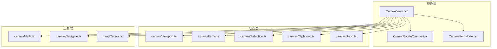

图表来源
- [CanvasView.tsx:1-120](file://src/renderer/src/views/canvas/CanvasView.tsx#L1-L120)
- [canvasViewport.ts:1-53](file://src/renderer/src/stores/canvasViewport.ts#L1-L53)
- [canvasItems.ts:1-94](file://src/renderer/src/stores/canvasItems.ts#L1-L94)
- [canvasSelection.ts:1-62](file://src/renderer/src/stores/canvasSelection.ts#L1-L62)
- [canvasClipboard.ts:1-29](file://src/renderer/src/stores/canvasClipboard.ts#L1-L29)
- [canvasUndo.ts:1-49](file://src/renderer/src/stores/canvasUndo.ts#L1-L49)
- [canvasMath.ts:1-120](file://src/renderer/src/lib/canvasMath.ts#L1-L120)
- [canvasNavigate.ts:1-88](file://src/renderer/src/lib/canvasNavigate.ts#L1-L88)
- [handCursor.ts:1-31](file://src/renderer/src/lib/handCursor.ts#L1-L31)

章节来源
- [CanvasView.tsx:1-120](file://src/renderer/src/views/canvas/CanvasView.tsx#L1-L120)
- [canvasViewport.ts:1-53](file://src/renderer/src/stores/canvasViewport.ts#L1-L53)
- [canvasItems.ts:1-94](file://src/renderer/src/stores/canvasItems.ts#L1-L94)
- [canvasSelection.ts:1-62](file://src/renderer/src/stores/canvasSelection.ts#L1-L62)
- [canvasClipboard.ts:1-29](file://src/renderer/src/stores/canvasClipboard.ts#L1-L29)
- [canvasUndo.ts:1-49](file://src/renderer/src/stores/canvasUndo.ts#L1-L49)
- [canvasMath.ts:1-120](file://src/renderer/src/lib/canvasMath.ts#L1-L120)
- [canvasNavigate.ts:1-88](file://src/renderer/src/lib/canvasNavigate.ts#L1-L88)
- [handCursor.ts:1-31](file://src/renderer/src/lib/handCursor.ts#L1-L31)

## 核心组件
- CanvasView：画布容器、事件总线、Moveable/Selecto 集成、视口控制、裁剪/框选/拖拽/缩放/旋转、快捷键、撤销、自动布局与聚焦。
- CornerRotateOverlay：四角旋转感应区与自定义旋转框，支持单选/多选刚体旋转。
- CanvasItemNode：单元素渲染节点，负责定位、裁剪 clip-path、媒体双层渲染（缩略图+全图）。

章节来源
- [CanvasView.tsx:1068-1705](file://src/renderer/src/views/canvas/CanvasView.tsx#L1068-L1705)
- [CornerRotateOverlay.tsx:151-367](file://src/renderer/src/views/canvas/CornerRotateOverlay.tsx#L151-L367)
- [CanvasItemNode.tsx:29-154](file://src/renderer/src/views/canvas/CanvasItemNode.tsx#L29-L154)

## 架构总览
CanvasView 作为协调者，将用户输入（鼠标/键盘/滚轮）转换为对状态层的变更，并通过工具函数完成坐标变换与几何计算；同时驱动 Moveable/Selecto 进行即时视觉反馈。

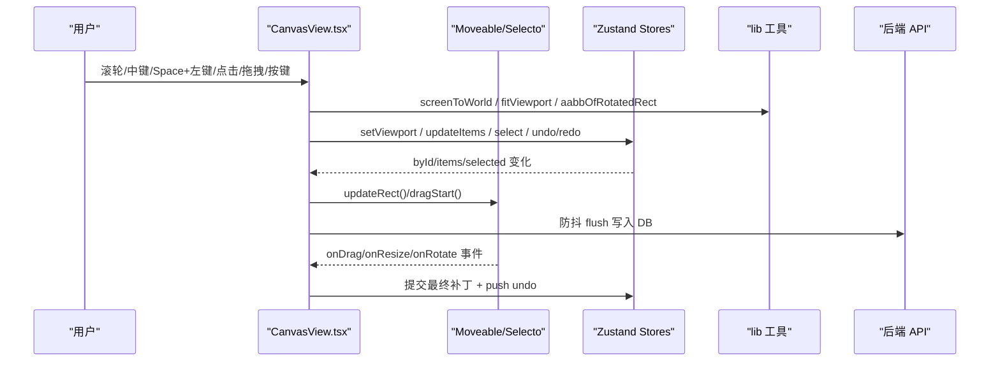

图表来源
- [CanvasView.tsx:456-549](file://src/renderer/src/views/canvas/CanvasView.tsx#L456-L549)
- [CanvasView.tsx:1192-1590](file://src/renderer/src/views/canvas/CanvasView.tsx#L1192-L1590)
- [canvasViewport.ts:16-34](file://src/renderer/src/stores/canvasViewport.ts#L16-L34)
- [canvasItems.ts:22-32](file://src/renderer/src/stores/canvasItems.ts#L22-L32)
- [canvasMath.ts:20-28](file://src/renderer/src/lib/canvasMath.ts#L20-L28)

## 详细组件分析

### 视口管理与缩放平移
- 离散缩放：以 ZOOM_STEP 为档位的幂次缩放，以光标位置为锚点，避免跳动。
- 平移：中键或 Space+左键，pointerdown/move/up 维护 panStartRef，按 scale 反算世界坐标偏移。
- 自动适配：首次有 items 且视口未初始化时，基于所有元素 AABB 计算 fitViewport。
- 持久化：setViewport 触发 500ms 防抖 flush，unmount 时立即 flush 防止丢失。

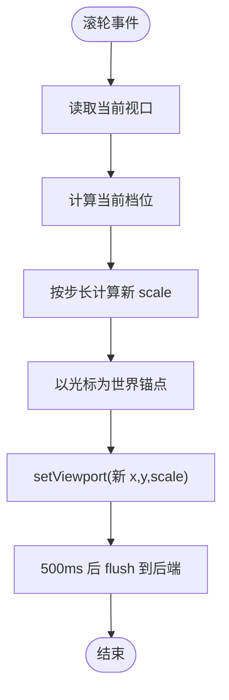

图表来源
- [CanvasView.tsx:456-480](file://src/renderer/src/views/canvas/CanvasView.tsx#L456-L480)
- [canvasViewport.ts:16-34](file://src/renderer/src/stores/canvasViewport.ts#L16-L34)
- [canvasMath.ts:14-18](file://src/renderer/src/lib/canvasMath.ts#L14-L18)

章节来源
- [CanvasView.tsx:456-549](file://src/renderer/src/views/canvas/CanvasView.tsx#L456-L549)
- [canvasViewport.ts:1-53](file://src/renderer/src/stores/canvasViewport.ts#L1-L53)
- [canvasMath.ts:1-104](file://src/renderer/src/lib/canvasMath.ts#L1-L104)

### 框选与选择逻辑
- Selecto 配置：仅空白处框选，hitRate=0，selectByClick=false，避免与元素交互冲突。
- 模式切换：无修饰键替换、Shift 加选、Ctrl/Meta 减选；记录起始快照，onSelect 实时合并。
- 收尾保护：onSelectEnd 标记 selectoJustSelectedRef，阻止容器 onClick 清空选区。
- 选中态：Store 维护 selected Set，Moveable target 由 selectedElements 动态生成。

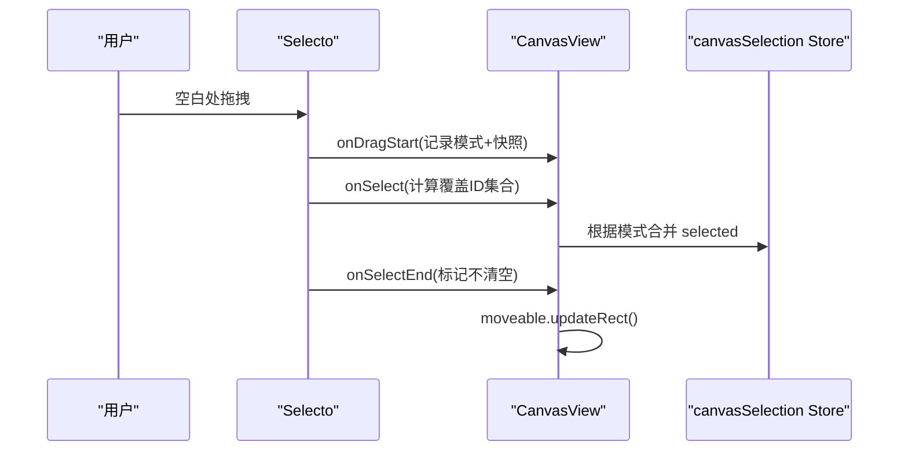

图表来源
- [CanvasView.tsx:1605-1679](file://src/renderer/src/views/canvas/CanvasView.tsx#L1605-L1679)
- [canvasSelection.ts:17-62](file://src/renderer/src/stores/canvasSelection.ts#L17-L62)

章节来源
- [CanvasView.tsx:1605-1679](file://src/renderer/src/views/canvas/CanvasView.tsx#L1605-L1679)
- [canvasSelection.ts:1-62](file://src/renderer/src/stores/canvasSelection.ts#L1-L62)

### 拖拽与组操作
- 单选拖拽：Moveable onDrag/onDragEnd 计算 lastEvent.dist/scale，写回 x/y，push undo。
- 多选拖拽：onDragGroup* 批量计算每个元素的位移，统一提交，保留相对位置。
- 阈值启动：在 per-item onPointerDown 等待 >8px 才调用 dragStart，避免单击误触。
- 组框行为：useDefaultGroupRotate=true，整组框始终 AABB，避免斜框干扰。

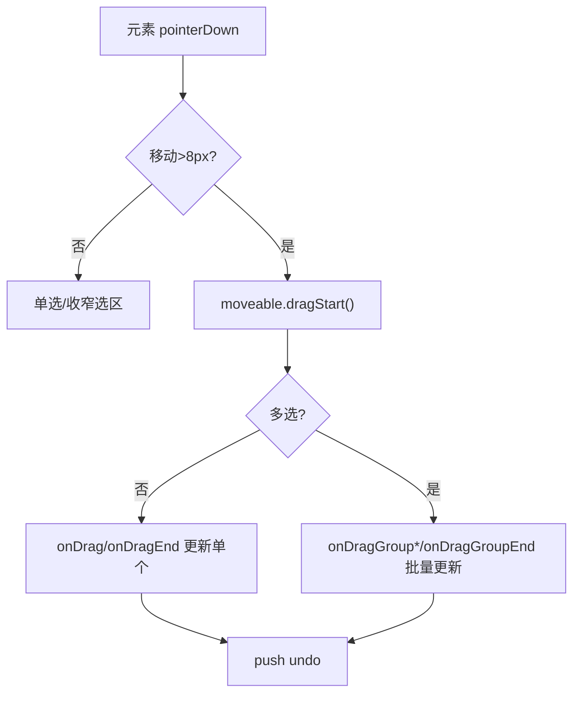

图表来源
- [CanvasView.tsx:1108-1161](file://src/renderer/src/views/canvas/CanvasView.tsx#L1108-L1161)
- [CanvasView.tsx:1212-1314](file://src/renderer/src/views/canvas/CanvasView.tsx#L1212-L1314)

章节来源
- [CanvasView.tsx:1108-1161](file://src/renderer/src/views/canvas/CanvasView.tsx#L1108-L1161)
- [CanvasView.tsx:1212-1314](file://src/renderer/src/views/canvas/CanvasView.tsx#L1212-L1314)

### 缩放与裁剪内容同步
- 等比缩放：keepRatio=true，onResize*/onResizeGroup* 计算 newW/newH，按中心对齐更新 x/y。
- 裁剪内容同步：resize 期间通过 .canvas-content 类名查询内容层，按 content 的世界尺寸×scale 实时更新宽高与位置，保证 mask 与内容一致。
- 裁剪数据：clipPolygon 存储 {clip, content}，resize 时 scaleClipContent 按比例缩放 content。

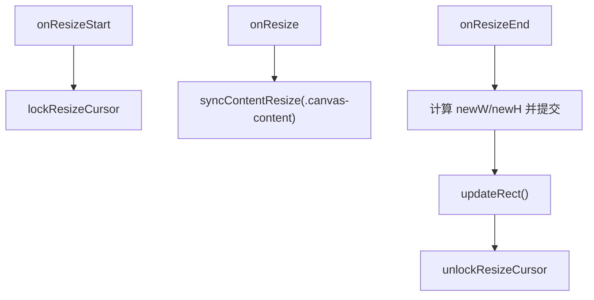

图表来源
- [CanvasView.tsx:1316-1388](file://src/renderer/src/views/canvas/CanvasView.tsx#L1316-L1388)
- [CanvasView.tsx:103-119](file://src/renderer/src/views/canvas/CanvasView.tsx#L103-L119)

章节来源
- [CanvasView.tsx:1316-1388](file://src/renderer/src/views/canvas/CanvasView.tsx#L1316-L1388)
- [CanvasView.tsx:103-119](file://src/renderer/src/views/canvas/CanvasView.tsx#L103-L119)

### 旋转与四角旋转区
- Moveable 原生旋转：onRotate*/onRotateGroup* 累积角度，提交 rotation 增量。
- 四角旋转区：CornerRotateOverlay 检测鼠标是否在图片角点外侧感应区，捕获 pointerdown，计算 totalDeltaRad，提交 handleRotateCommit。
- 多选旋转：隐藏 Moveable 的 group 框，绘制自定义刚体框随组旋转，松手恢复。

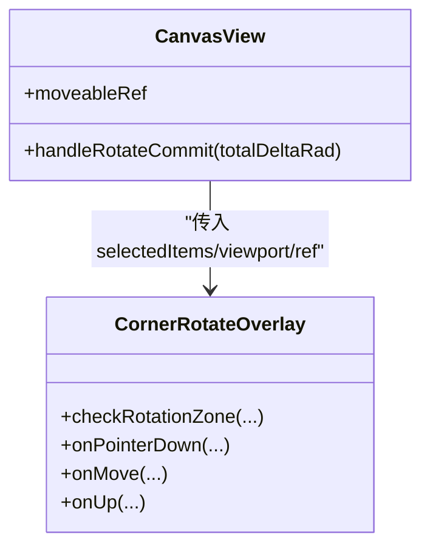

图表来源
- [CanvasView.tsx:400-453](file://src/renderer/src/views/canvas/CanvasView.tsx#L400-L453)
- [CornerRotateOverlay.tsx:72-149](file://src/renderer/src/views/canvas/CornerRotateOverlay.tsx#L72-L149)
- [CornerRotateOverlay.tsx:202-352](file://src/renderer/src/views/canvas/CornerRotateOverlay.tsx#L202-L352)

章节来源
- [CanvasView.tsx:400-453](file://src/renderer/src/views/canvas/CanvasView.tsx#L400-L453)
- [CornerRotateOverlay.tsx:151-367](file://src/renderer/src/views/canvas/CornerRotateOverlay.tsx#L151-L367)

### 裁剪功能（C 键 + 拖拽）
- 进入裁剪态：KeyC 按下设置 cKeyHeldRef，若已选中则切换十字光标。
- 拖拽绘制：pointerdown/move/up 维护 cropRectRef 与 cropDragRect 虚线框。
- 应用裁剪：screenToWorld 转世界矩形，遍历选中项 cropItem，得到新的 AABB + clipPolygon，flushSync 提交并 push undo。
- 收尾保护：cropJustEndedRef 阻止 click 清空选区。

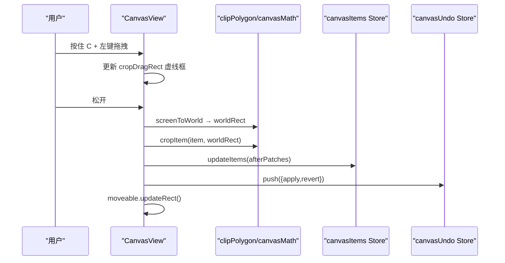

图表来源
- [CanvasView.tsx:551-679](file://src/renderer/src/views/canvas/CanvasView.tsx#L551-L679)
- [CanvasView.tsx:605-616](file://src/renderer/src/views/canvas/CanvasView.tsx#L605-L616)

章节来源
- [CanvasView.tsx:551-679](file://src/renderer/src/views/canvas/CanvasView.tsx#L551-L679)

### 复制/粘贴/再制与剪贴板
- 构建剪贴板：buildClipsFromSelection 收集选中项完整变换（含 clipPolygon）。
- 粘贴：计算组包围盒中心，目标中心优先取光标（视口内），否则取视口中心，按最大 z 递增插入，addItemsWithUndo 包装撤销。
- 再制：原地偏移固定世界距离，同样走 addItemsWithUndo。

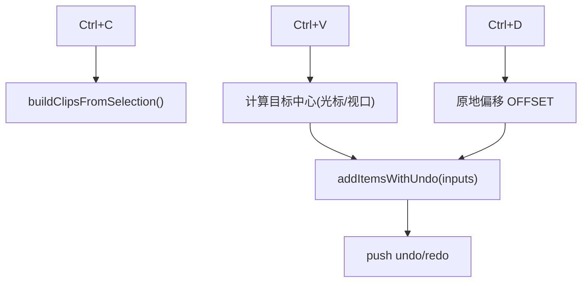

图表来源
- [CanvasView.tsx:683-727](file://src/renderer/src/views/canvas/CanvasView.tsx#L683-L727)
- [CanvasView.tsx:729-809](file://src/renderer/src/views/canvas/CanvasView.tsx#L729-L809)
- [canvasClipboard.ts:1-29](file://src/renderer/src/stores/canvasClipboard.ts#L1-L29)

章节来源
- [CanvasView.tsx:683-809](file://src/renderer/src/views/canvas/CanvasView.tsx#L683-L809)
- [canvasClipboard.ts:1-29](file://src/renderer/src/stores/canvasClipboard.ts#L1-L29)

### 键盘快捷键与导航
- F：fitViewport 聚焦（选中集或全部）。
- C：裁剪态切换。
- Space：平移态切换（cursor 全局注入）。
- Ctrl/Cmd+A：全选。
- Delete/Backspace：删除选中项，异步重建并 push undo。
- [/] 与 Ctrl+Shift+[/]：层级前移/后移/置顶/置底。
- Ctrl+Z/Y：撤销/重做。
- 方向键：navigateDirection 选择最近邻，panToItem 平滑居中。

```mermaid
flowchart TD
Key["keydown"] --> Mode{"键位判断"}
Mode --> |F| Fit["fitViewport()"]
Mode --> |C| Crop["cKeyHeldRef=true"]
Mode --> |Space| Pan["spaceHeldRef=true"]
Mode --> |Del| Remove["removeItems + undo"]
Mode --> |[/]| ZOrder["applyZOrder(mode)"]
Mode --> |Ctrl+Z/Y| UndoRedo["undo/redo"]
Mode --> |方向键| Nav["navigateDirection + panToItem"]
```

图表来源
- [CanvasView.tsx:812-974](file://src/renderer/src/views/canvas/CanvasView.tsx#L812-L974)
- [canvasNavigate.ts:18-88](file://src/renderer/src/lib/canvasNavigate.ts#L18-L88)

章节来源
- [CanvasView.tsx:812-974](file://src/renderer/src/views/canvas/CanvasView.tsx#L812-L974)
- [canvasNavigate.ts:1-88](file://src/renderer/src/lib/canvasNavigate.ts#L1-L88)

### 元素渲染与裁剪显示
- CanvasItemNode 使用 transform 定位（translate + rotate），clip-path 在外层生效，不受旋转影响。
- 裁剪分支：外层 clip-path 裁剪，内层 .canvas-content 按 content 的 world 尺寸与旋转放置媒体。
- 图片懒加载：缩略图常驻，全图延迟加载并淡入，视频直接渲染播放器节点。

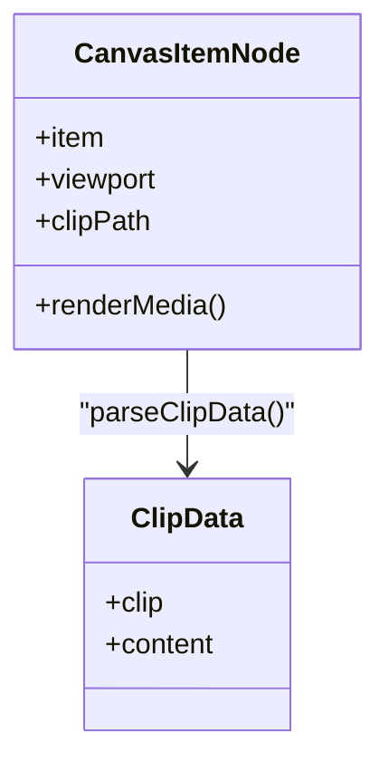

图表来源
- [CanvasItemNode.tsx:29-154](file://src/renderer/src/views/canvas/CanvasItemNode.tsx#L29-L154)

章节来源
- [CanvasItemNode.tsx:1-154](file://src/renderer/src/views/canvas/CanvasItemNode.tsx#L1-L154)

## 依赖关系分析
- 视图依赖状态：CanvasView 订阅多个 Zustand store，读写 byId/items/selected/clips/undo。
- 工具解耦：坐标/布局/导航算法集中在 lib，便于复用与测试。
- 外部库：react-moveable 提供拖拽/缩放/旋转，react-selecto 提供框选。
- 后端通信：window.api.updateCanvasViewport/updateCanvasItems/addItemsToCanvasRaw/removeItemsFromCanvas 等。

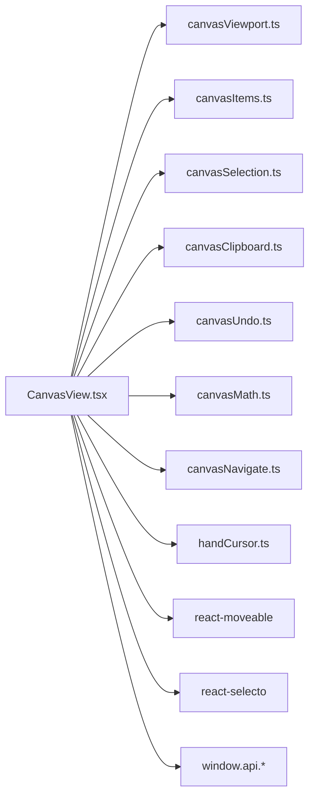

图表来源
- [CanvasView.tsx:1-31](file://src/renderer/src/views/canvas/CanvasView.tsx#L1-L31)
- [canvasViewport.ts:1-53](file://src/renderer/src/stores/canvasViewport.ts#L1-L53)
- [canvasItems.ts:1-94](file://src/renderer/src/stores/canvasItems.ts#L1-L94)
- [canvasSelection.ts:1-62](file://src/renderer/src/stores/canvasSelection.ts#L1-L62)
- [canvasClipboard.ts:1-29](file://src/renderer/src/stores/canvasClipboard.ts#L1-L29)
- [canvasUndo.ts:1-49](file://src/renderer/src/stores/canvasUndo.ts#L1-L49)
- [canvasMath.ts:1-120](file://src/renderer/src/lib/canvasMath.ts#L1-L120)
- [canvasNavigate.ts:1-88](file://src/renderer/src/lib/canvasNavigate.ts#L1-L88)
- [handCursor.ts:1-31](file://src/renderer/src/lib/handCursor.ts#L1-L31)

章节来源
- [CanvasView.tsx:1-31](file://src/renderer/src/views/canvas/CanvasView.tsx#L1-L31)
- [canvasViewport.ts:1-53](file://src/renderer/src/stores/canvasViewport.ts#L1-L53)
- [canvasItems.ts:1-94](file://src/renderer/src/stores/canvasItems.ts#L1-L94)
- [canvasSelection.ts:1-62](file://src/renderer/src/stores/canvasSelection.ts#L1-L62)
- [canvasClipboard.ts:1-29](file://src/renderer/src/stores/canvasClipboard.ts#L1-L29)
- [canvasUndo.ts:1-49](file://src/renderer/src/stores/canvasUndo.ts#L1-L49)
- [canvasMath.ts:1-120](file://src/renderer/src/lib/canvasMath.ts#L1-L120)
- [canvasNavigate.ts:1-88](file://src/renderer/src/lib/canvasNavigate.ts#L1-L88)
- [handCursor.ts:1-31](file://src/renderer/src/lib/handCursor.ts#L1-L31)

## 性能考量
- 防抖落盘：视口 500ms、items 250ms 合并多次更新，减少 I/O。
- GPU 加速：willChange: transform、transform 组合定位，避免回流。
- 布局同步：useLayoutEffect 在 DOM commit 后、paint 前更新 Moveable 手柄，避免闪烁。
- 懒加载全图：图片延迟加载并按 index 错开，首屏秒出缩略图。
- 增量更新：updateItems 基于 Map 合并 patch，避免全量重建。
- 虚拟滚动：当前实现为绝对定位列表，未启用虚拟滚动；如需扩展可结合可视区域裁剪与分页加载策略。

[本节为通用指导，不直接分析具体文件]

## 故障排查指南
- 平移后 click 清空选区：检查 panJustEndedRef 是否被正确设置与消费。
- 框选后 click 清空选区：检查 selectoJustSelectedRef 与 onSelectEnd 标志。
- 裁剪后 click 清空选区：检查 cropJustEndedRef 与裁剪收尾逻辑。
- 手柄位置不同步：确认 viewport 变化后 useLayoutEffect 调用了 updateRect。
- 旋转框错位：检查 CornerRotateOverlay 的感应区计算与 frameAABB 初始位置。
- 粘贴位置异常：确认指针坐标是否在容器范围内，以及 screenToWorld 转换是否正确。

章节来源
- [CanvasView.tsx:1073-1091](file://src/renderer/src/views/canvas/CanvasView.tsx#L1073-L1091)
- [CanvasView.tsx:1671-1678](file://src/renderer/src/views/canvas/CanvasView.tsx#L1671-L1678)
- [CanvasView.tsx:1062-1066](file://src/renderer/src/views/canvas/CanvasView.tsx#L1062-L1066)
- [CornerRotateOverlay.tsx:251-288](file://src/renderer/src/views/canvas/CornerRotateOverlay.tsx#L251-L288)
- [CanvasView.tsx:759-771](file://src/renderer/src/views/canvas/CanvasView.tsx#L759-L771)

## 结论
CanvasView 通过清晰的职责划分与稳健的状态管理，实现了高性能、高可用的画布交互体验。借助 Moveable/Selecto 与自定义四角旋转区，兼顾了易用性与专业性；裁剪、复制粘贴、撤销重做等功能完善，满足复杂编辑场景。未来可在大规模数据下引入虚拟滚动与更细粒度的渲染分区以提升吞吐。

[本节为总结，不直接分析具体文件]

## 附录
- 数据结构要点
  - Viewport：{x, y, scale}，用于世界/屏幕坐标转换与视口控制。
  - CanvasItem：包含 fileId、x/y（中心）、w/h、rotation、z、clipPolygon 等。
  - CanvasClip：剪贴板中的完整变换快照，跨画布有效。
  - UndoCommand：{apply, revert} 命令式撤销单元。
- 关键常量
  - DEFAULT_VIEWPORT、ZOOM_STEP、GRID_ROW_HEIGHT、GRID_GAP、MIN_CORNER_GAP、ROTATION_RADIUS。
- 常用工具
  - screenToWorld/worldToScreen、aabbOfRotatedRect、fitViewport、layoutJustifiedRows、findBlockPlacement、navigateDirection、panToItem。

章节来源
- [canvasMath.ts:1-226](file://src/renderer/src/lib/canvasMath.ts#L1-L226)
- [canvasNavigate.ts:1-88](file://src/renderer/src/lib/canvasNavigate.ts#L1-L88)
- [canvasClipboard.ts:1-29](file://src/renderer/src/stores/canvasClipboard.ts#L1-L29)
- [canvasUndo.ts:1-49](file://src/renderer/src/stores/canvasUndo.ts#L1-L49)