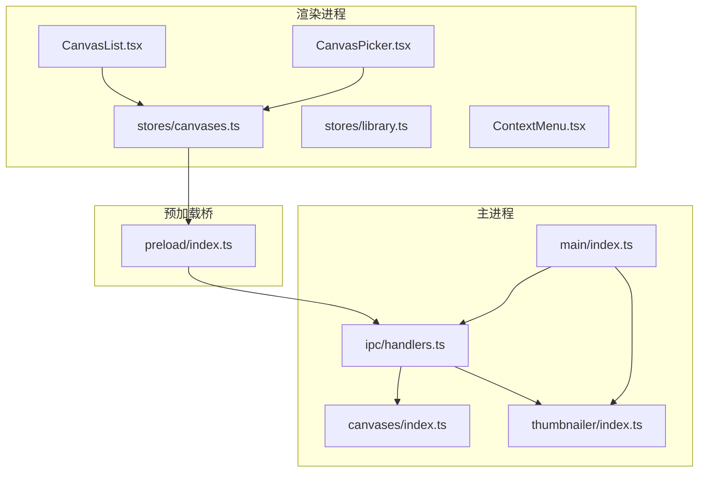
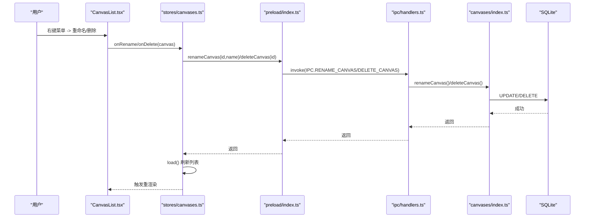
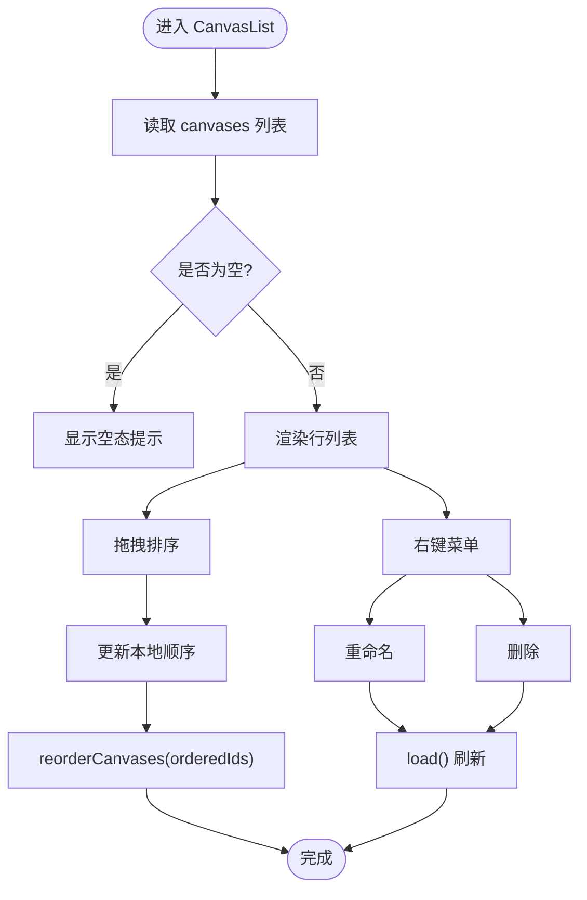
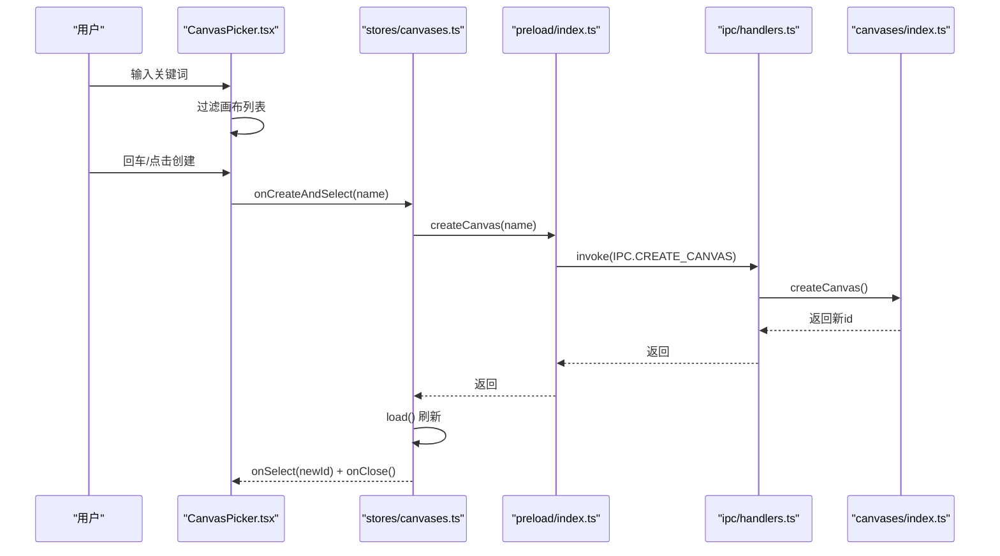
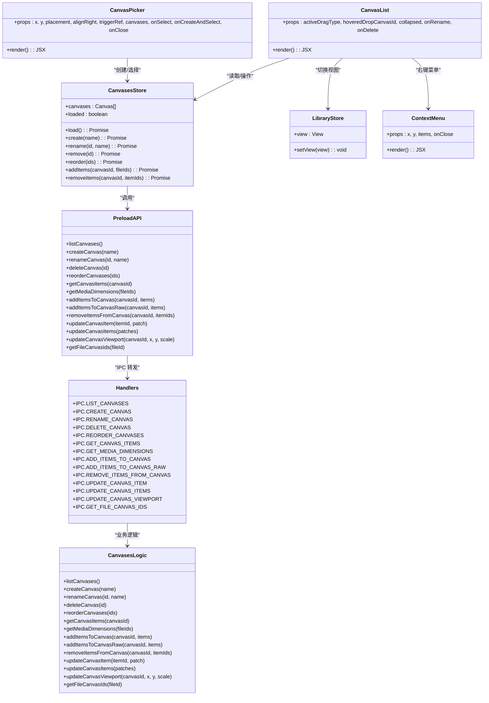

# 画布列表与选择器

<cite>
**本文引用的文件**   
- [CanvasList.tsx](file://src/renderer/src/components/CanvasList.tsx)
- [CanvasPicker.tsx](file://src/renderer/src/components/CanvasPicker.tsx)
- [canvases.ts](file://src/renderer/src/stores/canvases.ts)
- [library.ts](file://src/renderer/src/stores/library.ts)
- [ContextMenu.tsx](file://src/renderer/src/components/ContextMenu.tsx)
- [index.ts（主进程入口）](file://src/main/index.ts)
- [handlers.ts（IPC 处理器）](file://src/main/ipc/handlers.ts)
- [index.ts（画布业务逻辑）](file://src/main/canvases/index.ts)
- [index.ts（缩略图生成）](file://src/main/thumbnailer/index.ts)
- [preload/index.ts（预加载桥接）](file://src/preload/index.ts)
</cite>

## 目录
1. [简介](#简介)
2. [项目结构](#项目结构)
3. [核心组件](#核心组件)
4. [架构总览](#架构总览)
5. [详细组件分析](#详细组件分析)
6. [依赖关系分析](#依赖关系分析)
7. [性能考量](#性能考量)
8. [故障排查指南](#故障排查指南)
9. [结论](#结论)
10. [附录：扩展指南](#附录扩展指南)

## 简介
本文件围绕“画布列表”和“画布选择器”两个前端组件，系统性梳理其设计、实现与交互流程，并扩展到数据加载策略、缓存机制、实时更新、缩略图生成与预览、批量操作、模板系统与预设布局、导入导出与迁移支持，以及面向开发者的扩展指南。目标是帮助开发者快速理解并高效扩展画布管理能力。

## 项目结构
与画布管理相关的前端组件与状态集中在渲染进程，后端能力通过 IPC 暴露到渲染层；缩略图生成在主进程完成并通过自定义协议提供资源访问。

图表来源
- [CanvasList.tsx:1-200](file://src/renderer/src/components/CanvasList.tsx#L1-L200)
- [CanvasPicker.tsx:1-162](file://src/renderer/src/components/CanvasPicker.tsx#L1-L162)
- [canvases.ts:1-115](file://src/renderer/src/stores/canvases.ts#L1-L115)
- [library.ts:1-100](file://src/renderer/src/stores/library.ts#L1-L100)
- [ContextMenu.tsx:1-166](file://src/renderer/src/components/ContextMenu.tsx#L1-L166)
- [preload/index.ts:1-104](file://src/preload/index.ts#L1-L104)
- [handlers.ts:1-292](file://src/main/ipc/handlers.ts#L1-L292)
- [index.ts（画布业务逻辑）:1-320](file://src/main/canvases/index.ts#L1-L320)
- [index.ts（缩略图生成）:1-138](file://src/main/thumbnailer/index.ts#L1-L138)
- [index.ts（主进程入口）:1-134](file://src/main/index.ts#L1-L134)

章节来源
- [CanvasList.tsx:1-200](file://src/renderer/src/components/CanvasList.tsx#L1-L200)
- [CanvasPicker.tsx:1-162](file://src/renderer/src/components/CanvasPicker.tsx#L1-L162)
- [canvases.ts:1-115](file://src/renderer/src/stores/canvases.ts#L1-L115)
- [library.ts:1-100](file://src/renderer/src/stores/library.ts#L1-L100)
- [ContextMenu.tsx:1-166](file://src/renderer/src/components/ContextMenu.tsx#L1-L166)
- [preload/index.ts:1-104](file://src/preload/index.ts#L1-L104)
- [handlers.ts:1-292](file://src/main/ipc/handlers.ts#L1-L292)
- [index.ts（画布业务逻辑）:1-320](file://src/main/canvases/index.ts#L1-L320)
- [index.ts（缩略图生成）:1-138](file://src/main/thumbnailer/index.ts#L1-L138)
- [index.ts（主进程入口）:1-134](file://src/main/index.ts#L1-L134)

## 核心组件
- CanvasList：侧边栏画布列表，支持拖拽排序、右键菜单重命名/删除、折叠态 Tooltip 展示名称与项数、点击切换当前视图为对应画布。
- CanvasPicker：弹出式画布选择器，支持搜索过滤、空输入时创建新画布并选中、多种定位模式（top/bottom/cursor）、窗口移动自动关闭。
- canvases Store：封装画布的增删改查、排序、批量添加元素、移除元素等状态与副作用，驱动 UI 更新。
- library Store：维护应用级视图状态（如当前打开的画布），供 CanvasList 切换视图使用。
- ContextMenu：通用上下文菜单组件，被 CanvasList 用于重命名/删除等操作。
- 主进程 IPC：将画布 CRUD、排序、元素操作、视口持久化等能力暴露给渲染层。
- 缩略图模块：图片/视频缩略图生成与缓存，配合自定义协议在渲染层以资源 URL 访问。

章节来源
- [CanvasList.tsx:1-200](file://src/renderer/src/components/CanvasList.tsx#L1-L200)
- [CanvasPicker.tsx:1-162](file://src/renderer/src/components/CanvasPicker.tsx#L1-L162)
- [canvases.ts:1-115](file://src/renderer/src/stores/canvases.ts#L1-L115)
- [library.ts:1-100](file://src/renderer/src/stores/library.ts#L1-L100)
- [ContextMenu.tsx:1-166](file://src/renderer/src/components/ContextMenu.tsx#L1-L166)
- [handlers.ts:213-250](file://src/main/ipc/handlers.ts#L213-L250)
- [index.ts（画布业务逻辑）:75-320](file://src/main/canvases/index.ts#L75-L320)
- [index.ts（缩略图生成）:1-138](file://src/main/thumbnailer/index.ts#L1-L138)

## 架构总览
渲染层通过 Zustand store 调用 window.api（由 preload 注入），经由 IPC 路由至主进程 handlers，再进入画布业务逻辑与数据库操作。缩略图生成结果写入缓存目录，并通过自定义协议 serendip:// 在渲染层直接引用。

图表来源
- [CanvasList.tsx:42-58](file://src/renderer/src/components/CanvasList.tsx#L42-L58)
- [canvases.ts:35-43](file://src/renderer/src/stores/canvases.ts#L35-L43)
- [preload/index.ts:53-56](file://src/preload/index.ts#L53-L56)
- [handlers.ts:215-219](file://src/main/ipc/handlers.ts#L215-L219)
- [index.ts（画布业务逻辑）:114-137](file://src/main/canvases/index.ts#L114-L137)

## 详细组件分析

### CanvasList 画布列表
- 功能要点
  - 列表渲染：从 canvaes Store 读取画布集合，按 position 升序显示。
  - 拖拽排序：基于 @dnd-kit/sortable 的垂直列表策略，拖拽后更新本地顺序并持久化。
  - 右键菜单：重命名、删除，通过 ContextMenu 组件呈现。
  - 折叠态提示：收起时鼠标悬停显示名称与项数。
  - 视图切换：点击行将 library Store 的 view 设置为 canvas 类型并指向目标 id。
- 关键交互路径
  - 重命名：onRename -> store.rename -> IPC -> 主进程更新 -> store.load 刷新。
  - 删除：onDelete -> store.remove -> IPC -> 主进程删除 -> store.load 刷新。
  - 排序：拖拽结束 -> reorder -> IPC -> 主进程事务更新 position -> 本地同步顺序。
- 复杂度与性能
  - 列表渲染 O(n)，排序更新 O(n)。
  - 拖拽过程仅更新本地 state，避免频繁 IO。
- 错误处理
  - 重命名/删除失败由主进程抛出异常，上层可捕获并提示（可在调用处补充）。

图表来源
- [CanvasList.tsx:30-98](file://src/renderer/src/components/CanvasList.tsx#L30-L98)
- [CanvasList.tsx:108-199](file://src/renderer/src/components/CanvasList.tsx#L108-L199)
- [canvases.ts:45-56](file://src/renderer/src/stores/canvases.ts#L45-L56)

章节来源
- [CanvasList.tsx:1-200](file://src/renderer/src/components/CanvasList.tsx#L1-L200)
- [ContextMenu.tsx:1-166](file://src/renderer/src/components/ContextMenu.tsx#L1-L166)
- [canvases.ts:45-56](file://src/renderer/src/stores/canvases.ts#L45-L56)

### CanvasPicker 画布选择器
- 功能要点
  - 搜索过滤：根据输入文本对画布名进行大小写不敏感过滤。
  - 新建画布：当无匹配且输入非空时，显示“创建「xxx」”按钮，回车或点击即创建并选中。
  - 定位策略：支持 top/bottom/cursor 三种放置模式，自动计算 left/top/bottom 防止溢出。
  - 交互边界：点击外部区域、按下 Escape、窗口移动均会关闭选择器。
- 状态管理
  - 内部 search 状态控制过滤与创建按钮显隐。
  - 位置状态通过 useLayoutEffect 计算，保证首次渲染即正确定位。
- 事件处理
  - mousedown/contextmenu/keydown 监听全局关闭条件。
  - 监听窗口移动事件（IPC.WINDOW_MOVE）以及时关闭。

图表来源
- [CanvasPicker.tsx:37-99](file://src/renderer/src/components/CanvasPicker.tsx#L37-L99)
- [canvases.ts:29-33](file://src/renderer/src/stores/canvases.ts#L29-L33)
- [preload/index.ts:53-54](file://src/preload/index.ts#L53-L54)
- [handlers.ts:215-216](file://src/main/ipc/handlers.ts#L215-L216)
- [index.ts（画布业务逻辑）:92-112](file://src/main/canvases/index.ts#L92-L112)

章节来源
- [CanvasPicker.tsx:1-162](file://src/renderer/src/components/CanvasPicker.tsx#L1-L162)
- [canvases.ts:29-33](file://src/renderer/src/stores/canvases.ts#L29-L33)

### 画布数据加载策略与实时更新
- 加载策略
  - 初始化加载：store.load 调用 listCanvases 获取所有画布并按 position 排序。
  - 增量刷新：每次增删改后重新 load，确保 UI 与数据库一致。
- 实时更新
  - 拖拽排序：先乐观更新本地顺序，再持久化，失败时可回滚（当前实现未显式回滚，建议在上层捕获异常后恢复）。
  - 元素增减：addItems/removeItems 成功后，立即更新对应画布的 itemCount，并触发当前画布的元素 store 刷新（bump）。
- 缓存机制
  - 画布列表采用内存缓存（Zustand store），无额外本地缓存。
  - 缩略图缓存：主进程生成缩略图并落盘，渲染层通过自定义协议访问，避免重复生成。

章节来源
- [canvases.ts:24-27](file://src/renderer/src/stores/canvases.ts#L24-L27)
- [canvases.ts:58-99](file://src/renderer/src/stores/canvases.ts#L58-L99)
- [index.ts（缩略图生成）:27-52](file://src/main/thumbnailer/index.ts#L27-L52)
- [index.ts（缩略图生成）:59-94](file://src/main/thumbnailer/index.ts#L59-L94)

### 画布缩略图生成与预览
- 图片缩略图
  - 使用 sharp 读取元数据并生成固定宽度 WebP 缩略图，若已存在则跳过。
  - 返回相对路径与原始宽高，便于渲染层按需缩放。
- 视频缩略图
  - 使用 ffprobe 获取时长与分辨率，抽取中间帧生成缩略图。
  - 返回时长与尺寸信息，供播放器与布局使用。
- 缓存目录
  - 统一写入 .serendip-cache/thumbs，不存在则自动创建。
- 预览
  - 渲染层可通过自定义协议 serendip:// 访问缩略图资源（协议注册于主进程入口）。

章节来源
- [index.ts（缩略图生成）:1-138](file://src/main/thumbnailer/index.ts#L1-L138)
- [index.ts（主进程入口）:26-36](file://src/main/index.ts#L26-L36)

### 批量操作与网格布局
- 批量添加元素
  - addItemsToCanvasRaw：传入完整变换（含 w/h/rotation/clipPolygon），原样写入，适合复制/粘贴/再制场景。
  - addItemsToCanvas：按文件真实宽高比推算目标宽 CANVAS_DISPLAY_W 下的 h，保持视觉一致性。
- 等高行网格布局
  - 渲染层根据 fileIds 顺序与真实宽高比，调用 layoutJustifiedRows 计算 positions，再通过 findBlockPlacement 找到离现有内容最近的空白块放置整组元素，不打乱已有元素。
- 批量删除
  - removeItemsFromCanvas：按 canvas_item.id 批量删除，事务执行。

章节来源
- [canvases.ts:58-99](file://src/renderer/src/stores/canvases.ts#L58-L99)
- [index.ts（画布业务逻辑）:180-245](file://src/main/canvases/index.ts#L180-L245)
- [index.ts（画布业务逻辑）:247-256](file://src/main/canvases/index.ts#L247-L256)

### 画布模板系统与预设布局
- 现状说明
  - 代码中未发现显式的“模板系统”或“预设布局”持久化模型。
  - 但可通过以下方案实现：
    - 模板定义：保存一组元素的 fileId、x/y/w/h/rotation/z/clipPolygon 序列。
    - 应用模板：调用 addItemsToCanvasRaw 批量插入，结合 findBlockPlacement 自动对齐到空白区域。
    - 预设布局：对特定比例或主题的组合，预先计算 positions 并作为模板下发。
- 推荐实现
  - 新增模板表（templates）与模板-画布关联（template_items）。
  - 提供 API：listTemplates、createTemplate、applyTemplate(canvasId, templateId)。
  - 在 CanvasPicker 或工具栏增加“应用模板”入口。

[本节为概念性扩展建议，不直接分析具体源码文件]

### 画布导入导出与数据迁移
- 现状说明
  - 代码中未见直接的导入导出接口。
- 建议方案
  - 导出：序列化画布元数据与元素集合（JSON），包含 viewport、items 等字段。
  - 导入：校验 JSON 结构，去重/冲突策略（同名画布追加后缀），批量插入。
  - 迁移：针对旧版本 schema 变更，提供迁移脚本（例如字段重命名、默认值填充）。
  - 安全：限制导入文件大小与数量，校验 file_id 有效性，避免脏数据。

[本节为概念性扩展建议，不直接分析具体源码文件]

## 依赖关系分析

图表来源
- [CanvasList.tsx:1-200](file://src/renderer/src/components/CanvasList.tsx#L1-L200)
- [CanvasPicker.tsx:1-162](file://src/renderer/src/components/CanvasPicker.tsx#L1-L162)
- [canvases.ts:1-115](file://src/renderer/src/stores/canvases.ts#L1-L115)
- [library.ts:1-100](file://src/renderer/src/stores/library.ts#L1-L100)
- [ContextMenu.tsx:1-166](file://src/renderer/src/components/ContextMenu.tsx#L1-L166)
- [preload/index.ts:52-76](file://src/preload/index.ts#L52-L76)
- [handlers.ts:213-250](file://src/main/ipc/handlers.ts#L213-L250)
- [index.ts（画布业务逻辑）:75-320](file://src/main/canvases/index.ts#L75-L320)

章节来源
- [CanvasList.tsx:1-200](file://src/renderer/src/components/CanvasList.tsx#L1-L200)
- [CanvasPicker.tsx:1-162](file://src/renderer/src/components/CanvasPicker.tsx#L1-L162)
- [canvases.ts:1-115](file://src/renderer/src/stores/canvases.ts#L1-L115)
- [library.ts:1-100](file://src/renderer/src/stores/library.ts#L1-L100)
- [ContextMenu.tsx:1-166](file://src/renderer/src/components/ContextMenu.tsx#L1-L166)
- [preload/index.ts:52-76](file://src/preload/index.ts#L52-L76)
- [handlers.ts:213-250](file://src/main/ipc/handlers.ts#L213-L250)
- [index.ts（画布业务逻辑）:75-320](file://src/main/canvases/index.ts#L75-L320)

## 性能考量
- 列表渲染与排序
  - 使用虚拟滚动或分页可优化大量画布时的渲染性能（当前实现为全量渲染）。
  - 拖拽排序采用本地乐观更新，减少 IO 次数。
- 批量操作
  - 主进程使用事务批量写入，降低磁盘 I/O 压力。
- 缩略图生成
  - 命中缓存则跳过生成，显著降低 CPU 与磁盘开销。
  - 图片使用 sharp 流水线，视频使用 ffprobe+ffmpeg 抽取帧，注意并发控制以避免阻塞。
- 网络与协议
  - 自定义协议 serendip:// 可直接访问本地缓存，避免额外请求。

[本节为一般性指导，不直接分析具体源码文件]

## 故障排查指南
- 常见问题
  - 重命名失败：检查唯一约束冲突与名称长度限制。
  - 删除无效：确认画布是否存在，查看 ON DELETE CASCADE 是否生效。
  - 排序不一致：确认 reorderCanvases 事务是否成功，必要时回滚本地顺序。
  - 选择器不关闭：检查全局事件监听是否正确清理，窗口移动事件是否触发。
  - 缩略图缺失：确认缓存目录权限与路径，检查 sharp/ffmpeg 二进制可用。
- 调试建议
  - 在 handlers 层打印关键参数与返回值。
  - 在 store 层记录异步操作的异常栈。
  - 使用浏览器 DevTools 观察 IPC 消息与响应。

章节来源
- [handlers.ts:213-250](file://src/main/ipc/handlers.ts#L213-L250)
- [index.ts（画布业务逻辑）:92-137](file://src/main/canvases/index.ts#L92-L137)
- [index.ts（缩略图生成）:1-138](file://src/main/thumbnailer/index.ts#L1-L138)

## 结论
CanvasList 与 CanvasPicker 提供了直观的画布管理与选择体验，配合 canvaes Store 与主进程 IPC 实现了完整的 CRUD、排序与元素批量操作。缩略图模块保障了高效的媒体预览。建议在后续迭代中引入模板系统与导入导出能力，以提升复用性与数据迁移便利性。

[本节为总结性内容，不直接分析具体源码文件]

## 附录：扩展指南
- 新增画布属性
  - 在 main/canvases/index.ts 的 Canvas 接口与 SQL 查询中添加字段，并在 handlers 中暴露相应 IPC。
- 增强搜索与筛选
  - 在 CanvasPicker 中增加高级筛选（按创建时间、项数范围等），并在 store 层提供过滤后的只读视图。
- 模板系统
  - 新增模板表与 API，提供 applyTemplate 方法，结合 addItemsToCanvasRaw 实现保真插入。
- 导入导出
  - 提供 exportCanvas/importCanvas IPC，支持 JSON 格式，包含画布元数据与元素集合。
- 错误处理与重试
  - 在 store 层捕获异常并提示用户，必要时提供重试机制。
- 性能优化
  - 对大列表启用虚拟滚动，对缩略图生成加入队列与并发上限。

[本节为扩展建议，不直接分析具体源码文件]