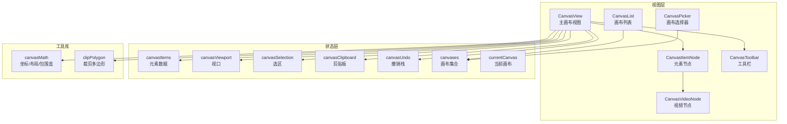
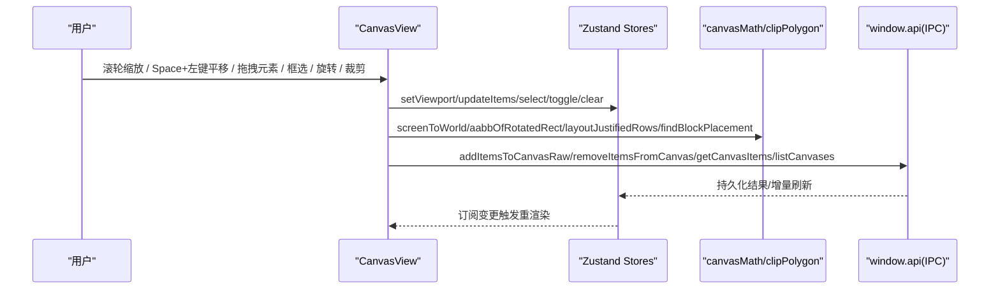
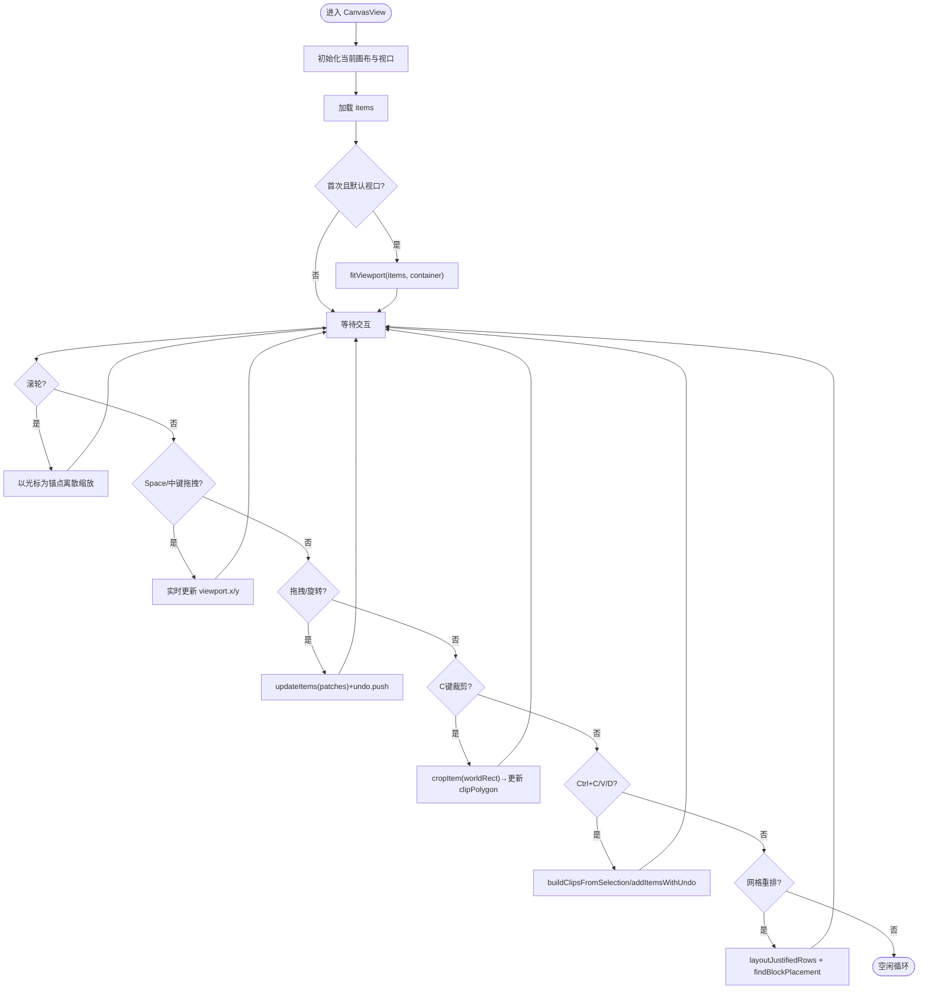
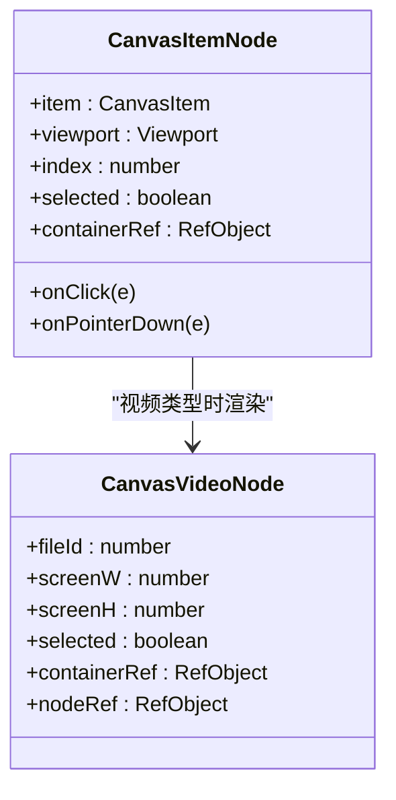
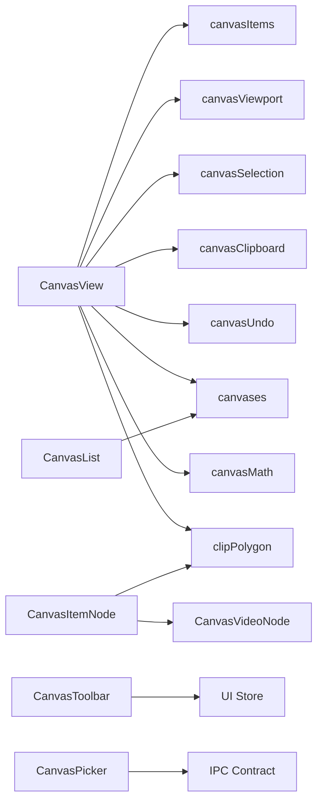

# 画布组件

<cite>
**本文引用的文件**   
- [CanvasView.tsx](file://src/renderer/src/views/canvas/CanvasView.tsx)
- [CanvasItemNode.tsx](file://src/renderer/src/views/canvas/CanvasItemNode.tsx)
- [CanvasVideoNode.tsx](file://src/renderer/src/views/canvas/CanvasVideoNode.tsx)
- [CanvasToolbar.tsx](file://src/renderer/src/views/canvas/CanvasToolbar.tsx)
- [CanvasList.tsx](file://src/renderer/src/components/CanvasList.tsx)
- [CanvasPicker.tsx](file://src/renderer/src/components/CanvasPicker.tsx)
- [canvasItems.ts](file://src/renderer/src/stores/canvasItems.ts)
- [canvasViewport.ts](file://src/renderer/src/stores/canvasViewport.ts)
- [canvases.ts](file://src/renderer/src/stores/canvases.ts)
- [currentCanvas.ts](file://src/renderer/src/stores/currentCanvas.ts)
- [canvasSelection.ts](file://src/renderer/src/stores/canvasSelection.ts)
- [canvasClipboard.ts](file://src/renderer/src/stores/canvasClipboard.ts)
- [canvasUndo.ts](file://src/renderer/src/stores/canvasUndo.ts)
- [canvasMath.ts](file://src/renderer/src/lib/canvasMath.ts)
- [clipPolygon.ts](file://src/renderer/src/lib/clipPolygon.ts)
</cite>

## 目录
1. [简介](#简介)
2. [项目结构](#项目结构)
3. [核心组件](#核心组件)
4. [架构总览](#架构总览)
5. [详细组件分析](#详细组件分析)
6. [依赖关系分析](#依赖关系分析)
7. [性能与渲染优化](#性能与渲染优化)
8. [故障排查指南](#故障排查指南)
9. [结论](#结论)
10. [附录：API 与配置参考](#附录api-与配置参考)

## 简介
本文件为 Serendip 应用的画布系统组件文档，覆盖 CanvasView 主画布视图、CanvasList 画布列表、CanvasPicker 画布选择器、CanvasItemNode 画布元素节点、CanvasToolbar 画布工具栏等核心组件的设计与实现。文档从系统架构、数据流、交互逻辑（拖拽、缩放平移、层级管理）、视口管理、裁剪与旋转、复制粘贴与重做撤销、视频播放策略、性能优化等方面展开，并提供开发者扩展指南与常见问题排查方法。

## 项目结构
画布系统位于渲染进程前端，采用 React + Zustand 状态管理，结合第三方库进行移动/选择/拖拽能力增强。关键目录与职责：
- views/canvas：画布主视图与子节点（CanvasView、CanvasItemNode、CanvasVideoNode、CanvasToolbar）
- components：通用 UI 组件（CanvasList、CanvasPicker 等）
- stores：Zustand 状态模块（items、viewport、selection、clipboard、undo、canvases、currentCanvas）
- lib：数学与几何工具（canvasMath、clipPolygon）

图表来源
- [CanvasView.tsx:1-120](file://src/renderer/src/views/canvas/CanvasView.tsx#L1-L120)
- [CanvasItemNode.tsx:1-60](file://src/renderer/src/views/canvas/CanvasItemNode.tsx#L1-L60)
- [CanvasVideoNode.tsx:1-40](file://src/renderer/src/views/canvas/CanvasVideoNode.tsx#L1-L40)
- [CanvasToolbar.tsx:1-40](file://src/renderer/src/views/canvas/CanvasToolbar.tsx#L1-L40)
- [CanvasList.tsx:1-40](file://src/renderer/src/components/CanvasList.tsx#L1-L40)
- [CanvasPicker.tsx:1-40](file://src/renderer/src/components/CanvasPicker.tsx#L1-L40)
- [canvasItems.ts:1-40](file://src/renderer/src/stores/canvasItems.ts#L1-L40)
- [canvasViewport.ts:1-35](file://src/renderer/src/stores/canvasViewport.ts#L1-L35)
- [canvasSelection.ts:1-30](file://src/renderer/src/stores/canvasSelection.ts#L1-L30)
- [canvasClipboard.ts:1-25](file://src/renderer/src/stores/canvasClipboard.ts#L1-L25)
- [canvasUndo.ts:1-30](file://src/renderer/src/stores/canvasUndo.ts#L1-L30)
- [canvases.ts:1-40](file://src/renderer/src/stores/canvases.ts#L1-L40)
- [canvasMath.ts:1-40](file://src/renderer/src/lib/canvasMath.ts#L1-L40)
- [clipPolygon.ts:1-40](file://src/renderer/src/lib/clipPolygon.ts#L1-L40)

章节来源
- [CanvasView.tsx:1-120](file://src/renderer/src/views/canvas/CanvasView.tsx#L1-L120)
- [CanvasList.tsx:1-60](file://src/renderer/src/components/CanvasList.tsx#L1-L60)
- [CanvasPicker.tsx:1-60](file://src/renderer/src/components/CanvasPicker.tsx#L1-L60)
- [canvasItems.ts:1-40](file://src/renderer/src/stores/canvasItems.ts#L1-L40)
- [canvasViewport.ts:1-35](file://src/renderer/src/stores/canvasViewport.ts#L1-L35)
- [canvasMath.ts:1-40](file://src/renderer/src/lib/canvasMath.ts#L1-L40)
- [clipPolygon.ts:1-40](file://src/renderer/src/lib/clipPolygon.ts#L1-L40)

## 核心组件
- CanvasView：画布容器与交互中枢，负责视口更新、缩放平移、框选、拖拽、旋转、裁剪、复制粘贴、重排、键盘快捷键、摄影机手摇联动等。
- CanvasItemNode：单个元素的渲染节点，处理位置/旋转、裁剪多边形、缩略图与全分辨率图片的渐进加载、视频节点的嵌入。
- CanvasVideoNode：视频节点，基于 IntersectionObserver 控制挂载与播放，支持全局冻结与选中强制播放。
- CanvasToolbar：底部工具栏，提供适应视口、网格重排、自动置顶开关、视频冻结、摄影机手摇开关与参数控件。
- CanvasList：侧边画布列表，支持排序、右键菜单、悬停提示、激活态高亮。
- CanvasPicker：弹出式画布选择器，支持搜索、创建并选择、定位与点击外部关闭。

章节来源
- [CanvasView.tsx:1-120](file://src/renderer/src/views/canvas/CanvasView.tsx#L1-L120)
- [CanvasItemNode.tsx:1-60](file://src/renderer/src/views/canvas/CanvasItemNode.tsx#L1-L60)
- [CanvasVideoNode.tsx:1-40](file://src/renderer/src/views/canvas/CanvasVideoNode.tsx#L1-L40)
- [CanvasToolbar.tsx:1-40](file://src/renderer/src/views/canvas/CanvasToolbar.tsx#L1-L40)
- [CanvasList.tsx:1-60](file://src/renderer/src/components/CanvasList.tsx#L1-L60)
- [CanvasPicker.tsx:1-60](file://src/renderer/src/components/CanvasPicker.tsx#L1-L60)

## 架构总览
画布系统以“视图-状态-工具”三层组织：
- 视图层：React 组件负责事件捕获与 UI 呈现
- 状态层：Zustand store 维护 items、viewport、selection、clipboard、undo、canvases、currentCanvas
- 工具层：canvasMath 与 clipPolygon 提供坐标变换、布局算法与裁剪几何

图表来源
- [CanvasView.tsx:450-550](file://src/renderer/src/views/canvas/CanvasView.tsx#L450-L550)
- [canvasViewport.ts:36-53](file://src/renderer/src/stores/canvasViewport.ts#L36-L53)
- [canvasItems.ts:66-85](file://src/renderer/src/stores/canvasItems.ts#L66-L85)
- [canvasMath.ts:20-104](file://src/renderer/src/lib/canvasMath.ts#L20-L104)
- [clipPolygon.ts:164-254](file://src/renderer/src/lib/clipPolygon.ts#L164-L254)

## 详细组件分析

### CanvasView 主画布视图
职责与特性：
- 视口初始化与自动适配：首次加载时根据元素 AABB 计算 fitViewport，居中并设置 scale
- 缩放：以光标为锚点的离散档位缩放（ZOOM_STEP），通过 setViewport 更新 byId[canvasId]
- 平移：中键或 Space+左键拖拽，实时计算世界坐标偏移
- 框选：基于 Selecto，支持 replace/add/subtract 模式，Shift/Ctrl 组合
- 拖拽与旋转：基于 Moveable，支持多选组拖拽与四角旋转提交；旋转后按组中心旋转
- 裁剪：C 键按住拖拽矩形，使用 clipPolygon.cropItem 对每个选中元素求交，生成新 clipPolygon 与 AABB
- 复制/粘贴/再制：构建完整变换快照到剪贴板，粘贴时按组包围盒中心对齐光标
- 重排：将全部元素按等高行网格重新布局，保持比例，居中于现有内容质心
- 摄影机手摇：开启时锁定编辑、清空选区，吞掉选择/拖拽手势
- 键盘快捷键：F 适应视口、Ctrl+C/V/D、Delete 删除、Enter 确认等
- 光标与手柄：动态注入 resize cursor，覆盖 Moveable 手柄 hover 样式

图表来源
- [CanvasView.tsx:316-344](file://src/renderer/src/views/canvas/CanvasView.tsx#L316-L344)
- [CanvasView.tsx:456-480](file://src/renderer/src/views/canvas/CanvasView.tsx#L456-L480)
- [CanvasView.tsx:494-549](file://src/renderer/src/views/canvas/CanvasView.tsx#L494-L549)
- [CanvasView.tsx:552-679](file://src/renderer/src/views/canvas/CanvasView.tsx#L552-L679)
- [CanvasView.tsx:681-788](file://src/renderer/src/views/canvas/CanvasView.tsx#L681-L788)
- [CanvasView.tsx:347-397](file://src/renderer/src/views/canvas/CanvasView.tsx#L347-L397)
- [canvasMath.ts:63-104](file://src/renderer/src/lib/canvasMath.ts#L63-L104)
- [clipPolygon.ts:164-254](file://src/renderer/src/lib/clipPolygon.ts#L164-L254)

章节来源
- [CanvasView.tsx:1-800](file://src/renderer/src/views/canvas/CanvasView.tsx#L1-L800)
- [canvasViewport.ts:36-53](file://src/renderer/src/stores/canvasViewport.ts#L36-L53)
- [canvasItems.ts:66-85](file://src/renderer/src/stores/canvasItems.ts#L66-L85)
- [canvasSelection.ts:17-62](file://src/renderer/src/stores/canvasSelection.ts#L17-L62)
- [canvasClipboard.ts:18-29](file://src/renderer/src/stores/canvasClipboard.ts#L18-L29)
- [canvasUndo.ts:19-49](file://src/renderer/src/stores/canvasUndo.ts#L19-L49)
- [canvasMath.ts:20-104](file://src/renderer/src/lib/canvasMath.ts#L20-L104)
- [clipPolygon.ts:164-254](file://src/renderer/src/lib/clipPolygon.ts#L164-L254)

### CanvasItemNode 画布元素节点
职责与特性：
- 屏幕尺寸与位置：根据 item.w/h、viewport.scale 计算屏幕宽高与中心偏移
- 旋转与裁剪：外层 transform 包含 rotate；clip-path 由 clipPolygonToCSS 生成
- 媒体渲染：
  - 图片：先显示缩略图，延迟异步加载全分辨率并淡入覆盖
  - 视频：嵌入 CanvasVideoNode，按可见性与大小决定是否播放
- 裁剪内容同步：当外层框被 resize 时，内部 canvas-content 需按比例更新尺寸与位置，确保 clip-path 与内容一致

图表来源
- [CanvasItemNode.tsx:29-154](file://src/renderer/src/views/canvas/CanvasItemNode.tsx#L29-L154)
- [CanvasVideoNode.tsx:19-109](file://src/renderer/src/views/canvas/CanvasVideoNode.tsx#L19-L109)

章节来源
- [CanvasItemNode.tsx:1-154](file://src/renderer/src/views/canvas/CanvasItemNode.tsx#L1-L154)
- [CanvasVideoNode.tsx:1-109](file://src/renderer/src/views/canvas/CanvasVideoNode.tsx#L1-L109)
- [clipPolygon.ts:259-283](file://src/renderer/src/lib/clipPolygon.ts#L259-L283)

### CanvasToolbar 画布工具栏
职责与特性：
- 显示当前缩放等级标签（基于 ZOOM_STEP 的对数级别）
- 按钮功能：适应视口（F）、网格重排、自动置顶开关、视频冻结/恢复、摄影机手摇开关
- 集成 CameraShakeControls 作为手摇参数控件

章节来源
- [CanvasToolbar.tsx:1-94](file://src/renderer/src/views/canvas/CanvasToolbar.tsx#L1-L94)
- [canvasMath.ts:14](file://src/renderer/src/lib/canvasMath.ts#L14)

### CanvasList 画布列表
职责与特性：
- 使用 @dnd-kit/sortable 实现垂直列表排序
- 支持右键菜单（重命名、删除）
- 折叠模式下悬停显示名称与项数 Tooltip（Portal 渲染）
- 激活态高亮与媒体拖拽时的落位高亮

章节来源
- [CanvasList.tsx:1-200](file://src/renderer/src/components/CanvasList.tsx#L1-L200)

### CanvasPicker 画布选择器
职责与特性：
- 固定定位面板，支持 top/bottom/cursor 三种放置模式
- 输入过滤与无结果时显示“创建新画布”选项
- 监听窗口移动与点击外部区域关闭

章节来源
- [CanvasPicker.tsx:1-162](file://src/renderer/src/components/CanvasPicker.tsx#L1-L162)

## 依赖关系分析
- 组件依赖：
  - CanvasView 依赖多个 store（items、viewport、selection、clipboard、undo、canvases、currentCanvas）与工具库（canvasMath、clipPolygon）
  - CanvasItemNode 依赖 clipPolygon 与 CanvasVideoNode
  - CanvasToolbar 依赖 UI 与 CameraShake 相关 store
  - CanvasList 依赖 canvases store 与 dnd-kit
  - CanvasPicker 依赖 IPC 契约与 window.electron.ipcRenderer
- 状态耦合：
  - updateItems 与 undo 紧密配合，所有可逆操作均 push UndoCommand
  - setViewport 防抖写入 DB，unmount 时 flushViewportNow 保证最后一次 pan 不丢失
  - selection 与 moveable target 通过 DOM 查询同步，避免 stale ref

图表来源
- [CanvasView.tsx:1-120](file://src/renderer/src/views/canvas/CanvasView.tsx#L1-L120)
- [canvasItems.ts:1-40](file://src/renderer/src/stores/canvasItems.ts#L1-L40)
- [canvasViewport.ts:1-35](file://src/renderer/src/stores/canvasViewport.ts#L1-L35)
- [canvasSelection.ts:1-30](file://src/renderer/src/stores/canvasSelection.ts#L1-L30)
- [canvasClipboard.ts:1-25](file://src/renderer/src/stores/canvasClipboard.ts#L1-L25)
- [canvasUndo.ts:1-30](file://src/renderer/src/stores/canvasUndo.ts#L1-L30)
- [canvases.ts:1-40](file://src/renderer/src/stores/canvases.ts#L1-L40)
- [canvasMath.ts:1-40](file://src/renderer/src/lib/canvasMath.ts#L1-L40)
- [clipPolygon.ts:1-40](file://src/renderer/src/lib/clipPolygon.ts#L1-L40)

章节来源
- [CanvasView.tsx:1-120](file://src/renderer/src/views/canvas/CanvasView.tsx#L1-L120)
- [canvasItems.ts:1-40](file://src/renderer/src/stores/canvasItems.ts#L1-L40)
- [canvasViewport.ts:1-35](file://src/renderer/src/stores/canvasViewport.ts#L1-L35)
- [canvasSelection.ts:1-30](file://src/renderer/src/stores/canvasSelection.ts#L1-L30)
- [canvasClipboard.ts:1-25](file://src/renderer/src/stores/canvasClipboard.ts#L1-L25)
- [canvasUndo.ts:1-30](file://src/renderer/src/stores/canvasUndo.ts#L1-L30)
- [canvases.ts:1-40](file://src/renderer/src/stores/canvases.ts#L1-L40)
- [canvasMath.ts:1-40](file://src/renderer/src/lib/canvasMath.ts#L1-L40)
- [clipPolygon.ts:1-40](file://src/renderer/src/lib/clipPolygon.ts#L1-L40)

## 性能与渲染优化
- 视口与元素更新：
  - setViewport 按 canvasId 独立防抖（500ms），避免频繁写盘；unmount 时立即 flush
  - updateItems 合并同 id 的 patch，250ms 批量 flush，减少 IPC 调用次数
- 渲染路径：
  - 图片双层渲染：缩略图常驻，全分辨率延迟加载并淡入，降低首帧阻塞
  - 视频按需挂载：IntersectionObserver 控制 video 节点挂载，占比低于阈值或全局冻结时暂停
- 变换与合成：
  - 使用 willChange: transform 与 CSS transform 提升 GPU 加速
  - clip-path 在外层框生效，不受 rotate 影响，避免复杂矩阵计算
- 布局算法：
  - layoutJustifiedRows 贪心换行，目标行数近似 sqrt(ΣW/H)，使整块趋近正方形
  - findBlockPlacement 黄金角螺旋候选 + AABB 碰撞测试，快速找到空白落点
- 内存管理：
  - unload 清空 items 与选区，防止跨画布切换残留引用
  - MutationObserver 仅观察必要属性，及时断开释放

章节来源
- [canvasViewport.ts:16-34](file://src/renderer/src/stores/canvasViewport.ts#L16-L34)
- [canvasItems.ts:22-32](file://src/renderer/src/stores/canvasItems.ts#L22-L32)
- [CanvasItemNode.tsx:55-69](file://src/renderer/src/views/canvas/CanvasItemNode.tsx#L55-L69)
- [CanvasVideoNode.tsx:36-49](file://src/renderer/src/views/canvas/CanvasVideoNode.tsx#L36-L49)
- [canvasMath.ts:133-177](file://src/renderer/src/lib/canvasMath.ts#L133-L177)
- [canvasMath.ts:184-225](file://src/renderer/src/lib/canvasMath.ts#L184-L225)

## 故障排查指南
- 视口未保存或切画布后跳动：
  - 检查 unmount 是否调用 flushViewportNow；确认 setViewport 防抖定时器未被提前清理
- 裁剪后图像错位：
  - 确认 resize 过程中 syncContentResize 已按新框尺寸更新 canvas-content 的 width/height/left/top
- 视频卡顿或占用过高：
  - 检查 isLargeEnough 判断与 IntersectionObserver 是否正确卸载；确认全局冻结开关
- 框选/拖拽冲突：
  - 确认 marqueeActiveRef/panJustEndedRef/cropJustEndedRef 标志位正确阻止收尾 click 清空选区
- 旋转手柄光标异常：
  - 检查 MutationObserver 是否观察到 data-direction 变化，rAF 后 getBoundingClientRect 取到手柄实际中心

章节来源
- [canvasViewport.ts:27-34](file://src/renderer/src/stores/canvasViewport.ts#L27-L34)
- [CanvasView.tsx:100-119](file://src/renderer/src/views/canvas/CanvasView.tsx#L100-L119)
- [CanvasVideoNode.tsx:26-33](file://src/renderer/src/views/canvas/CanvasVideoNode.tsx#L26-L33)
- [CanvasView.tsx:230-243](file://src/renderer/src/views/canvas/CanvasView.tsx#L230-L243)
- [CanvasView.tsx:150-217](file://src/renderer/src/views/canvas/CanvasView.tsx#L150-L217)

## 结论
画布系统通过清晰的视图-状态-工具分层，实现了高性能、可扩展的可视化编辑体验。核心在于：
- 精确的坐标与几何计算（canvasMath、clipPolygon）
- 高效的视口与元素状态管理（Zustand + 防抖 flush）
- 完善的交互闭环（拖拽、旋转、裁剪、复制粘贴、撤销重做）
- 针对大图与视频的渲染优化策略

开发者可基于现有组件与 store 接口进行扩展，如新增自定义工具、扩展裁剪形状、接入更多布局算法等。

## 附录：API 与配置参考

### 视口与缩放
- 常量：DEFAULT_VIEWPORT、ZOOM_STEP、SCALE_MIN/MAX
- 函数：clampScale、screenToWorld、worldToScreen、fitViewport、aabbOfRotatedRect
- 行为：setViewport 防抖写入；flushViewportNow 立即写入

章节来源
- [canvasMath.ts:9-18](file://src/renderer/src/lib/canvasMath.ts#L9-L18)
- [canvasMath.ts:20-28](file://src/renderer/src/lib/canvasMath.ts#L20-L28)
- [canvasMath.ts:63-104](file://src/renderer/src/lib/canvasMath.ts#L63-L104)
- [canvasViewport.ts:36-53](file://src/renderer/src/stores/canvasViewport.ts#L36-L53)

### 元素与布局
- 布局：layoutJustifiedRows（等高行）、findBlockPlacement（空白落点）
- 几何：aabbOfRotatedRect（旋转矩形包围盒）
- 插入：addItems（自动排列）、addItemsToCanvasRaw（原始写入）

章节来源
- [canvasMath.ts:133-177](file://src/renderer/src/lib/canvasMath.ts#L133-L177)
- [canvasMath.ts:184-225](file://src/renderer/src/lib/canvasMath.ts#L184-L225)
- [canvases.ts:58-99](file://src/renderer/src/stores/canvases.ts#L58-L99)

### 裁剪与多边形
- 解析：parseClipData（JSON → ClipData）
- 裁剪：cropItem（世界矩形裁剪，返回新 AABB 与 clipPolygon）
- 渲染：clipPolygonToCSS（ClipData → CSS polygon）
- 缩放：scaleClipContent（resize 时内容等比缩放）

章节来源
- [clipPolygon.ts:124-144](file://src/renderer/src/lib/clipPolygon.ts#L124-L144)
- [clipPolygon.ts:164-254](file://src/renderer/src/lib/clipPolygon.ts#L164-L254)
- [clipPolygon.ts:259-283](file://src/renderer/src/lib/clipPolygon.ts#L259-L283)

### 状态与持久化
- items：load/unload/bump/updateItems/removeItems
- viewport：initViewport/setViewport/flushViewportNow
- selection：toggle/select/selectRange/selectAll/clear
- clipboard：setClips/clear（跨画布有效）
- undo：push/undo/redo/clear（最多 50 条）
- canvases：create/rename/remove/reorder/addItems/removeItems

章节来源
- [canvasItems.ts:34-93](file://src/renderer/src/stores/canvasItems.ts#L34-L93)
- [canvasViewport.ts:36-53](file://src/renderer/src/stores/canvasViewport.ts#L36-L53)
- [canvasSelection.ts:17-62](file://src/renderer/src/stores/canvasSelection.ts#L17-L62)
- [canvasClipboard.ts:18-29](file://src/renderer/src/stores/canvasClipboard.ts#L18-L29)
- [canvasUndo.ts:19-49](file://src/renderer/src/stores/canvasUndo.ts#L19-L49)
- [canvases.ts:20-115](file://src/renderer/src/stores/canvases.ts#L20-L115)

### 组件配置与事件
- CanvasView：props.canvasId；事件包括 wheel、pointerdown/move/up、keydown、click 等
- CanvasItemNode：props.item/viewport/index/selected/containerRef；事件 onClick/onPointerDown
- CanvasVideoNode：props.fileId/screenW/screenH/selected/containerRef/nodeRef
- CanvasToolbar：props.viewport/onFit/onRearrange
- CanvasList：props.activeDragType/hoveredDropCanvasId/collapsed/onRename/onDelete
- CanvasPicker：props.x/y/placement/alignRight/triggerRef/canvases/onSelect/onCreateAndSelect/onClose

章节来源
- [CanvasView.tsx:50-58](file://src/renderer/src/views/canvas/CanvasView.tsx#L50-L58)
- [CanvasItemNode.tsx:7-15](file://src/renderer/src/views/canvas/CanvasItemNode.tsx#L7-L15)
- [CanvasVideoNode.tsx:4-14](file://src/renderer/src/views/canvas/CanvasVideoNode.tsx#L4-L14)
- [CanvasToolbar.tsx:9-13](file://src/renderer/src/views/canvas/CanvasToolbar.tsx#L9-L13)
- [CanvasList.tsx:16-22](file://src/renderer/src/components/CanvasList.tsx#L16-L22)
- [CanvasPicker.tsx:8-18](file://src/renderer/src/components/CanvasPicker.tsx#L8-L18)