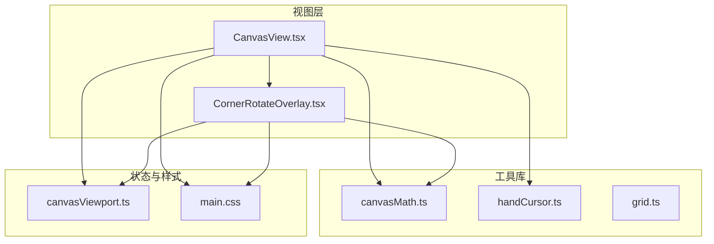
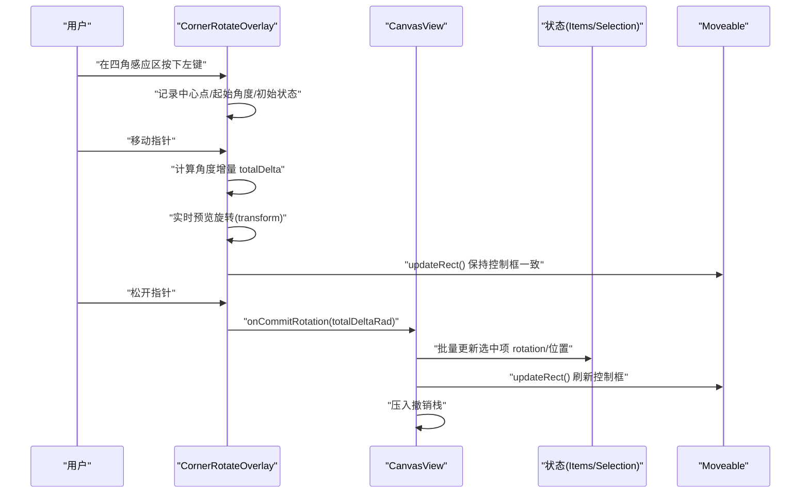
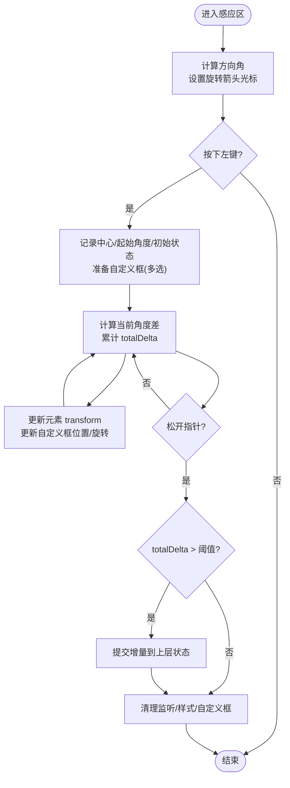
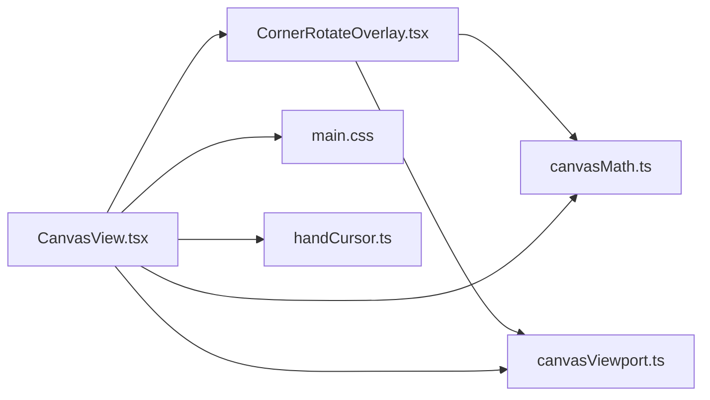

# 画布覆盖层与特效

<cite>
**本文引用的文件**   
- [CornerRotateOverlay.tsx](file://src/renderer/src/views/canvas/CornerRotateOverlay.tsx)
- [CanvasView.tsx](file://src/renderer/src/views/canvas/CanvasView.tsx)
- [canvasMath.ts](file://src/renderer/src/lib/canvasMath.ts)
- [canvasViewport.ts](file://src/renderer/src/stores/canvasViewport.ts)
- [main.css](file://src/renderer/src/assets/main.css)
- [handCursor.ts](file://src/renderer/src/lib/handCursor.ts)
- [grid.ts](file://src/renderer/src/lib/grid.ts)
</cite>

## 目录
1. [简介](#简介)
2. [项目结构](#项目结构)
3. [核心组件](#核心组件)
4. [架构总览](#架构总览)
5. [详细组件分析](#详细组件分析)
6. [依赖关系分析](#依赖关系分析)
7. [性能考量](#性能考量)
8. [故障排查指南](#故障排查指南)
9. [结论](#结论)
10. [附录](#附录)

## 简介
本文件聚焦于画布覆盖层与特效，尤其是四角旋转覆盖层 CornerRotateOverlay 的实现原理、绘制逻辑、交互响应与性能优化；同时扩展说明其他可能的覆盖层效果（网格线、参考线、对齐辅助线等），并提供自定义覆盖层的开发方法与样式定制建议。文档还涵盖覆盖层与画布坐标系统的转换与同步机制，帮助开发者快速构建丰富的视觉增强功能。

## 项目结构
围绕画布覆盖层与特效的相关代码主要分布在渲染进程视图与工具库中：
- 视图层：CanvasView 负责整体交互编排，CornerRotateOverlay 提供四角旋转覆盖层能力
- 数学与视口：canvasMath 提供坐标转换、包围盒计算、自动布局等；canvasViewport 管理视口状态与持久化刷新
- 样式与光标：main.css 定义主题与覆盖层样式；handCursor 提供手型光标资源
- 通用布局：grid.ts 提供瀑布流列数计算（虽非画布覆盖层直接相关，但体现“网格/参考线”类效果的思路）

图表来源
- [CanvasView.tsx:1-120](file://src/renderer/src/views/canvas/CanvasView.tsx#L1-L120)
- [CornerRotateOverlay.tsx:151-366](file://src/renderer/src/views/canvas/CornerRotateOverlay.tsx#L151-L366)
- [canvasMath.ts:1-104](file://src/renderer/src/lib/canvasMath.ts#L1-L104)
- [canvasViewport.ts:1-53](file://src/renderer/src/stores/canvasViewport.ts#L1-L53)
- [main.css:153-171](file://src/renderer/src/assets/main.css#L153-L171)
- [handCursor.ts:1-31](file://src/renderer/src/lib/handCursor.ts#L1-L31)
- [grid.ts:1-29](file://src/renderer/src/lib/grid.ts#L1-L29)

章节来源
- [CanvasView.tsx:1-120](file://src/renderer/src/views/canvas/CanvasView.tsx#L1-L120)
- [CornerRotateOverlay.tsx:151-366](file://src/renderer/src/views/canvas/CornerRotateOverlay.tsx#L151-L366)
- [canvasMath.ts:1-104](file://src/renderer/src/lib/canvasMath.ts#L1-L104)
- [canvasViewport.ts:1-53](file://src/renderer/src/stores/canvasViewport.ts#L1-L53)
- [main.css:153-171](file://src/renderer/src/assets/main.css#L153-L171)
- [handCursor.ts:1-31](file://src/renderer/src/lib/handCursor.ts#L1-L31)
- [grid.ts:1-29](file://src/renderer/src/lib/grid.ts#L1-L29)

## 核心组件
- CornerRotateOverlay：四角旋转覆盖层，提供悬停感应区、方向光标、拖拽旋转、多选刚体旋转框、提交增量到上层等能力
- CanvasView：画布主视图，集成 Moveable/Selecto、缩放平移、裁剪、复制粘贴、撤销重做等，并调用 CornerRotateOverlay 的旋转提交回调
- canvasMath：坐标系统转换、AABB 计算、fitViewport、等高行布局等
- canvasViewport：按画布维度维护视口状态，防抖写入后端
- main.css：覆盖层主题色、选择框样式、隐藏顶部旋转手柄等
- handCursor：手型光标 SVG 生成器
- grid.ts：瀑布流列数计算（可借鉴为网格/参考线效果）

章节来源
- [CornerRotateOverlay.tsx:151-366](file://src/renderer/src/views/canvas/CornerRotateOverlay.tsx#L151-L366)
- [CanvasView.tsx:399-453](file://src/renderer/src/views/canvas/CanvasView.tsx#L399-L453)
- [canvasMath.ts:1-104](file://src/renderer/src/lib/canvasMath.ts#L1-L104)
- [canvasViewport.ts:1-53](file://src/renderer/src/stores/canvasViewport.ts#L1-L53)
- [main.css:153-171](file://src/renderer/src/assets/main.css#L153-L171)
- [handCursor.ts:1-31](file://src/renderer/src/lib/handCursor.ts#L1-L31)
- [grid.ts:1-29](file://src/renderer/src/lib/grid.ts#L1-L29)

## 架构总览
下图展示了四角旋转覆盖层在画布中的交互流程与数据流向：指针事件由覆盖层捕获，计算旋转增量后通过回调通知 CanvasView，后者更新选中项状态并触发 UI 刷新。

图表来源
- [CornerRotateOverlay.tsx:202-352](file://src/renderer/src/views/canvas/CornerRotateOverlay.tsx#L202-L352)
- [CanvasView.tsx:399-453](file://src/renderer/src/views/canvas/CanvasView.tsx#L399-L453)

## 详细组件分析

### CornerRotateOverlay 四角旋转覆盖层
- 目标
  - 在图片矩形外侧靠近四角处提供旋转感应区
  - 根据鼠标相对中心的方向动态切换旋转箭头光标
  - 支持单选与多选旋转；多选时以选区中心为支点进行刚体旋转
  - 拖动期间隐藏原生 Moveable 组框，绘制随组旋转的自定义框，松手后恢复
  - 将累积旋转增量提交给上层，完成状态更新与撤销记录

- 关键算法与数据结构
  - 感应区判定 checkRotationZone：将鼠标坐标变换到元素本地坐标系，判断是否位于元素 AABB 外侧且距离任一角点在指定区间内
  - 方向光标 getDirCursor：基于 atan2 计算方位角，映射到八个方向的旋转箭头光标
  - 多选刚体旋转：计算整组 AABB 作为自定义框，绕选区中心旋转，保持与单个元素一致的旋转支点
  - 坐标转换：世界坐标 → 屏幕局部坐标 (item.x - vp.x)*scale + container.left

- 交互与事件处理
  - pointermove：hover 阶段注入全局 cursor 样式，进入感应区显示旋转箭头
  - pointerdown（capture）：拦截事件，锁定拖拽光标，记录初始角度与状态
  - window.pointermove/window.pointerup：计算增量并实时更新 transform；松手后清理监听与临时样式
  - 防止 click 冒泡清空选区：pointerup 后短暂捕获一次 click 阻止误操作

- 视觉效果与样式
  - 自定义旋转箭头光标：SVG 路径 + 投影滤镜，按方向旋转
  - 多选旋转框：绝对定位 div，边框使用主题强调色，z-index 高于内容层
  - 隐藏原生控制框：通过 !important 覆盖 .moveable-control-box 透明度

- 性能优化
  - 使用 ref 镜像 props，避免 effect 因引用变化重复注册监听
  - 仅在必要时创建/更新 <style> 节点，比较文本内容避免重复插入
  - 拖动过程中仅更新 DOM transform，不触发 React 重渲染
  - 使用 updateRect 同步 Moveable 控制框，减少额外计算

图表来源
- [CornerRotateOverlay.tsx:72-149](file://src/renderer/src/views/canvas/CornerRotateOverlay.tsx#L72-L149)
- [CornerRotateOverlay.tsx:177-352](file://src/renderer/src/views/canvas/CornerRotateOverlay.tsx#L177-L352)

章节来源
- [CornerRotateOverlay.tsx:151-366](file://src/renderer/src/views/canvas/CornerRotateOverlay.tsx#L151-L366)

### CanvasView 集成与旋转提交
- 职责
  - 接收 onCommitRotation(totalDeltaRad)，对单选/多选分别计算 afterPatches
  - 使用 flushSync 立即更新 items，随后 updateRect 刷新控制框
  - 压入撤销栈，支持 revert/apply 回滚与重做

- 与覆盖层协作
  - 通过 moveableRef 同步控制框
  - 与 viewport 协同确保屏幕坐标与世界坐标一致

章节来源
- [CanvasView.tsx:399-453](file://src/renderer/src/views/canvas/CanvasView.tsx#L399-L453)

### 坐标系统与视口同步
- 坐标转换
  - screenToWorld / worldToScreen：在视口缩放和平移下实现双向转换
  - aabbOfRotatedRect：计算旋转矩形的轴对齐包围盒，用于 fitViewport、感应区判断、多选框计算

- 视口状态
  - byId 按画布维度缓存视口
  - setViewport 触发防抖 flush，unmount 时 flushViewportNow 保证最终值落盘

章节来源
- [canvasMath.ts:20-60](file://src/renderer/src/lib/canvasMath.ts#L20-L60)
- [canvasViewport.ts:1-53](file://src/renderer/src/stores/canvasViewport.ts#L1-L53)

### 光标与主题样式
- 手型光标：makeHandCursor 生成带描边与阴影的手型 SVG，供平移模式使用
- 主题变量：--color-primary 等通过 CSS 变量驱动，覆盖层与选择框统一风格
- 覆盖层样式：隐藏顶部旋转手柄、统一控制框颜色、选择框半透明填充

章节来源
- [handCursor.ts:1-31](file://src/renderer/src/lib/handCursor.ts#L1-L31)
- [main.css:153-171](file://src/renderer/src/assets/main.css#L153-L171)

### 其他覆盖层效果（概念性扩展）
- 网格线：可按固定间隔绘制横线/竖线，结合视口 scale 调整间距，使用 requestAnimationFrame 节流绘制
- 参考线：从元素边缘或中心向视口延伸，吸附时高亮显示
- 对齐辅助线：检测多个元素之间的对齐关系（水平/垂直/中心等），在接近阈值时绘制虚线提示
- 栅格背景：以 CSS background-size 或 Canvas 绘制低对比度网格，配合主题变量

[本节为概念性内容，无需源码引用]

## 依赖关系分析
- CornerRotateOverlay 依赖 canvasMath 的坐标转换与 AABB 计算，依赖 canvasViewport 获取当前视口
- CanvasView 依赖 CornerRotateOverlay 的旋转提交回调，依赖 canvasMath 的布局与几何函数，依赖 canvasViewport 的视口状态
- 样式依赖 main.css 的主题变量与覆盖层样式规则
- 光标依赖 handCursor 生成的 SVG 数据 URL

图表来源
- [CornerRotateOverlay.tsx:151-366](file://src/renderer/src/views/canvas/CornerRotateOverlay.tsx#L151-L366)
- [CanvasView.tsx:1-120](file://src/renderer/src/views/canvas/CanvasView.tsx#L1-L120)
- [canvasMath.ts:1-104](file://src/renderer/src/lib/canvasMath.ts#L1-L104)
- [canvasViewport.ts:1-53](file://src/renderer/src/stores/canvasViewport.ts#L1-L53)
- [main.css:153-171](file://src/renderer/src/assets/main.css#L153-L171)
- [handCursor.ts:1-31](file://src/renderer/src/lib/handCursor.ts#L1-L31)

章节来源
- [CornerRotateOverlay.tsx:151-366](file://src/renderer/src/views/canvas/CornerRotateOverlay.tsx#L151-L366)
- [CanvasView.tsx:1-120](file://src/renderer/src/views/canvas/CanvasView.tsx#L1-L120)
- [canvasMath.ts:1-104](file://src/renderer/src/lib/canvasMath.ts#L1-L104)
- [canvasViewport.ts:1-53](file://src/renderer/src/stores/canvasViewport.ts#L1-L53)
- [main.css:153-171](file://src/renderer/src/assets/main.css#L153-L171)
- [handCursor.ts:1-31](file://src/renderer/src/lib/handCursor.ts#L1-L31)

## 性能考量
- 事件与渲染
  - 使用 capture 阶段拦截 pointerdown，避免与其他手势冲突
  - 拖动过程仅更新 DOM transform，不触发 React 重渲染，降低开销
  - 使用 updateRect 同步 Moveable 控制框，避免多余布局计算
- 样式注入
  - 按需创建 <style> 节点，比较文本内容避免重复插入
  - 使用 !important 覆盖第三方库样式，确保主题一致性
- 视口持久化
  - setViewport 防抖写入后端，unmount 时 flushViewportNow 保证最终值保存
- 几何计算
  - 感应区与多选框计算采用 O(n) 遍历，常规场景开销极低
  - 使用 clampScale 限制缩放范围，避免极端缩放导致的精度问题

章节来源
- [CornerRotateOverlay.tsx:177-352](file://src/renderer/src/views/canvas/CornerRotateOverlay.tsx#L177-L352)
- [canvasViewport.ts:16-34](file://src/renderer/src/stores/canvasViewport.ts#L16-L34)
- [canvasMath.ts:16-18](file://src/renderer/src/lib/canvasMath.ts#L16-L18)

## 故障排查指南
- 旋转无效
  - 检查是否在感应区内（外侧且距角点距离在阈值范围内）
  - 确认 isResizing 状态未阻断旋转
  - 查看 totalDelta 是否超过阈值才提交
- 光标异常
  - 确认 hover/drag 阶段的全局 cursor 样式是否正确注入与移除
  - 检查主题变量 --color-primary 是否生效
- 多选框错位
  - 验证 frameAABB 的计算是否基于初始状态
  - 确认 rotCx/rotCy 与选区中心一致
- 视口丢失
  - 检查 unmount 时是否调用 flushViewportNow
  - 确认 setViewport 的防抖定时器未被意外清除

章节来源
- [CornerRotateOverlay.tsx:177-352](file://src/renderer/src/views/canvas/CornerRotateOverlay.tsx#L177-L352)
- [canvasViewport.ts:26-34](file://src/renderer/src/stores/canvasViewport.ts#L26-L34)
- [main.css:153-171](file://src/renderer/src/assets/main.css#L153-L171)

## 结论
CornerRotateOverlay 通过精确的感应区判定、方向光标反馈与高效的 DOM 变换更新，提供了流畅的四角旋转体验；与 CanvasView 的状态同步和撤销机制共同构成完整的编辑闭环。借助 canvasMath 的坐标与几何工具以及 canvasViewport 的视口管理，覆盖层能够稳定地与画布坐标系统保持一致。在此基础上，开发者可以便捷地扩展网格线、参考线、对齐辅助线等覆盖层效果，并通过主题变量与样式覆盖实现统一的视觉风格。

## 附录
- 自定义覆盖层开发方法
  - 确定覆盖层类型（网格/参考线/对齐辅助线）与触发条件
  - 使用 canvasMath 的坐标转换与 AABB 计算进行命中测试
  - 在容器上监听 pointermove，按需绘制或更新 DOM/CSS
  - 使用主题变量与 !important 覆盖第三方库样式，确保一致性
  - 在合适时机（如滚动/缩放）触发 requestAnimationFrame 节流更新
- 与画布坐标系统的转换与同步
  - 使用 screenToWorld/worldToScreen 进行双向转换
  - 使用 aabbOfRotatedRect 计算旋转元素的包围盒
  - 通过 canvasViewport 的 byId/setViewport 管理视口状态，并在 unmount 时 flushViewportNow

章节来源
- [canvasMath.ts:20-60](file://src/renderer/src/lib/canvasMath.ts#L20-L60)
- [canvasViewport.ts:1-53](file://src/renderer/src/stores/canvasViewport.ts#L1-L53)
- [main.css:153-171](file://src/renderer/src/assets/main.css#L153-L171)