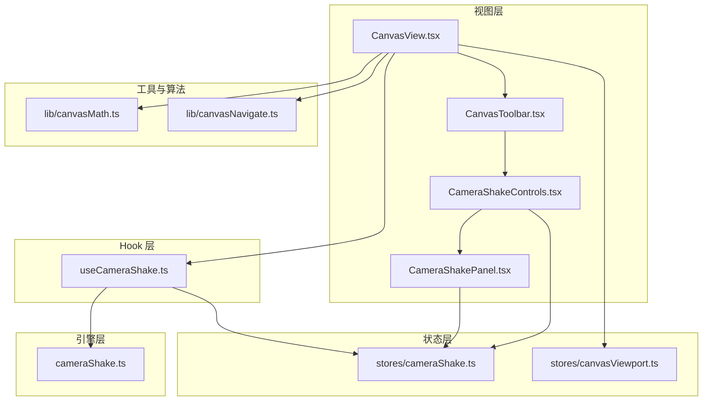
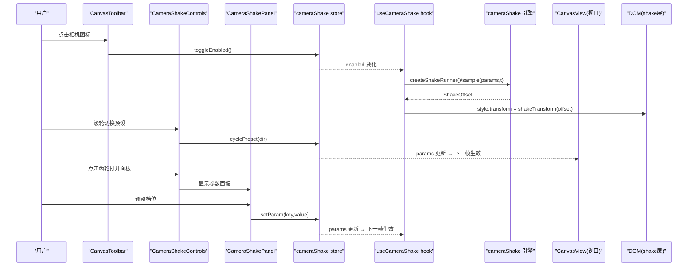
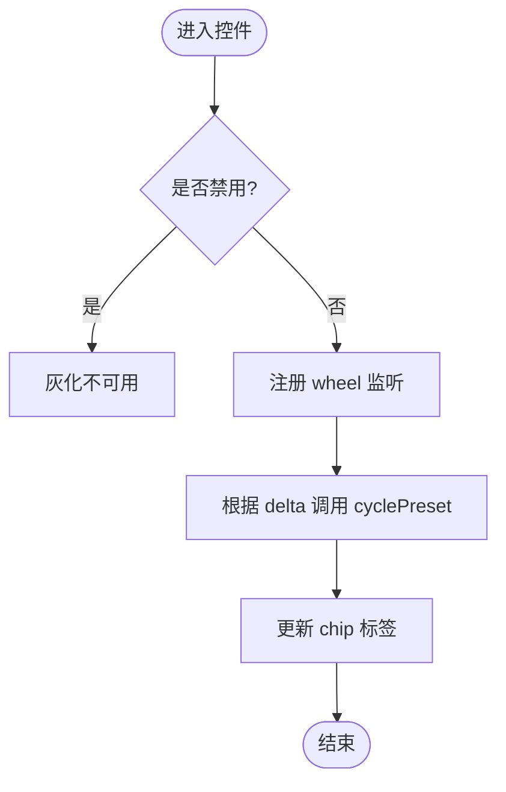
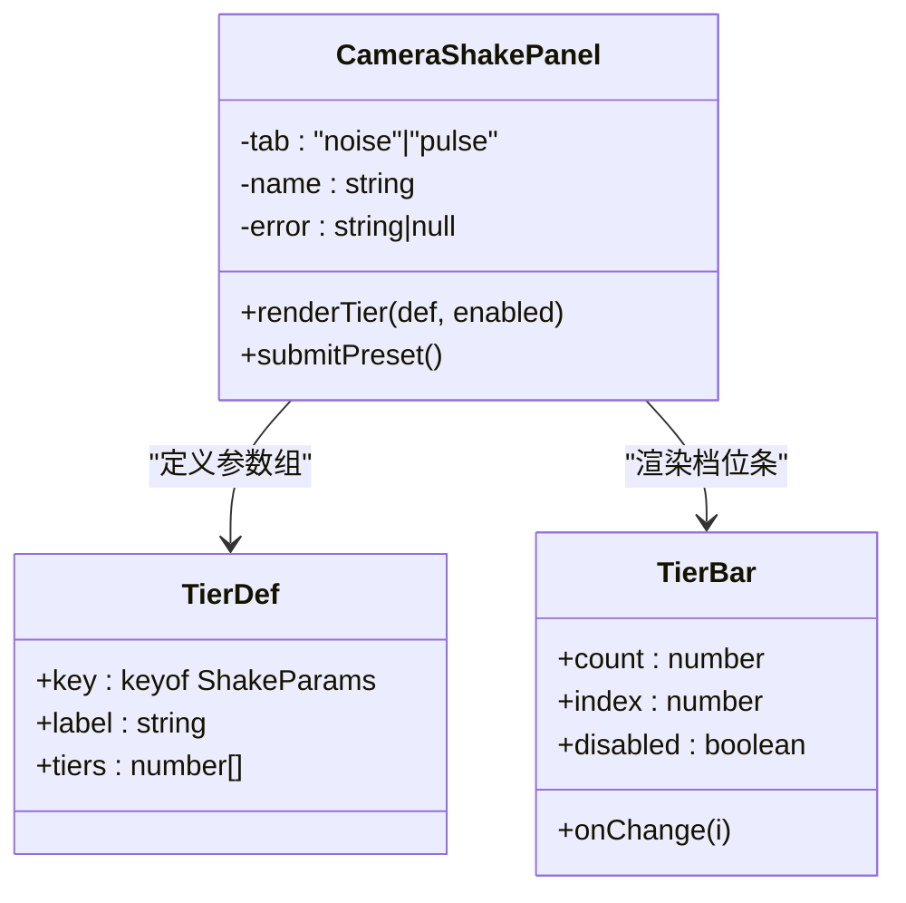
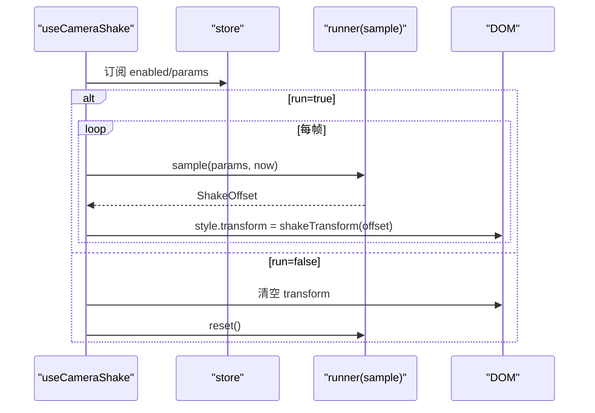
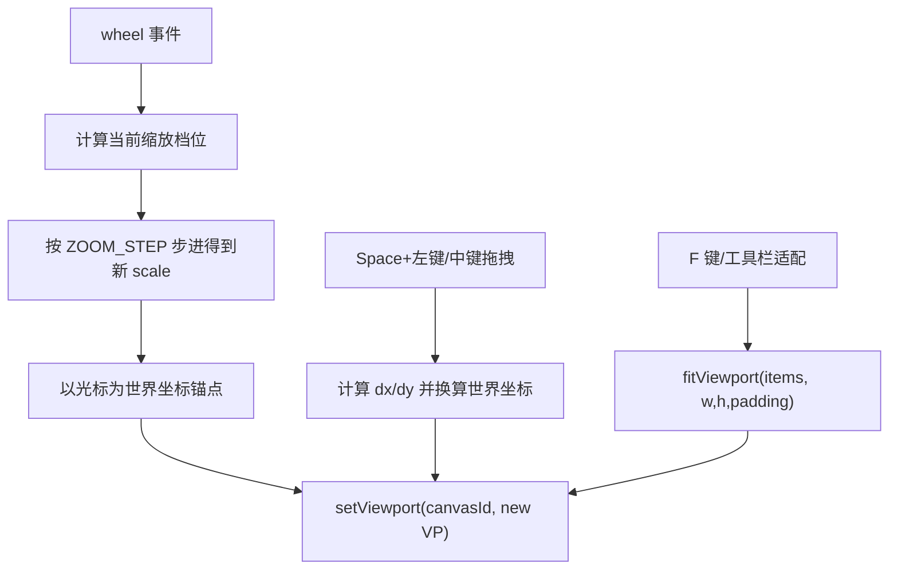
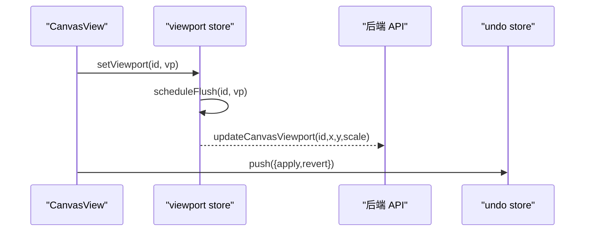
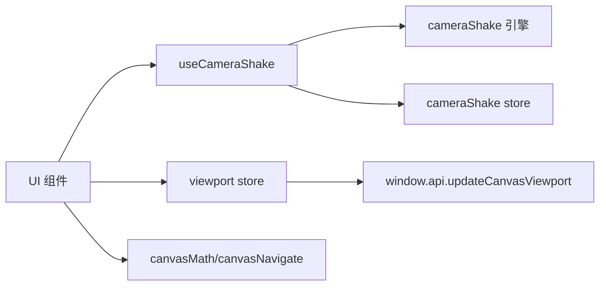

# 画布视口控制

<cite>
**本文引用的文件**   
- [CameraShakeControls.tsx](file://src/renderer/src/views/canvas/CameraShakeControls.tsx)
- [CameraShakePanel.tsx](file://src/renderer/src/views/canvas/CameraShakePanel.tsx)
- [useCameraShake.ts](file://src/renderer/src/hooks/useCameraShake.ts)
- [cameraShake.ts](file://src/renderer/src/lib/cameraShake.ts)
- [cameraShake.ts（store）](file://src/renderer/src/stores/cameraShake.ts)
- [CanvasView.tsx](file://src/renderer/src/views/canvas/CanvasView.tsx)
- [CanvasToolbar.tsx](file://src/renderer/src/views/canvas/CanvasToolbar.tsx)
- [canvasViewport.ts](file://src/renderer/src/stores/canvasViewport.ts)
- [canvasNavigate.ts](file://src/renderer/src/lib/canvasNavigate.ts)
- [canvasMath.ts](file://src/renderer/src/lib/canvasMath.ts)
- [stage6.md](file://docs/CanvasPlan/stage6.md)
</cite>

## 目录
1. [简介](#简介)
2. [项目结构](#项目结构)
3. [核心组件](#核心组件)
4. [架构总览](#架构总览)
5. [详细组件分析](#详细组件分析)
6. [依赖关系分析](#依赖关系分析)
7. [性能与优化](#性能与优化)
8. [故障排查指南](#故障排查指南)
9. [结论](#结论)
10. [附录：扩展与定制指南](#附录扩展与定制指南)

## 简介
本文件围绕“画布视口控制”展开，重点覆盖以下能力：
- CameraShakeControls 摄影机手摇控件与 CameraShakePanel 控制面板的设计与实现
- 视口导航：缩放、平移、聚焦与适配
- 摄影机手摇效果：参数调节、动画曲线、性能优化
- 视口状态持久化、历史记录与撤销重做支持
- 自定义导航手势与快捷键配置
- 多画布协调与视口同步
- 面向开发者的扩展与定制指南

## 项目结构
与视口控制和手摇功能相关的代码主要分布在 renderer 层，采用“UI 组件 + Hook + 纯引擎 + Store + 数学库”的分层组织方式。

图表来源
- [CanvasView.tsx:1-120](file://src/renderer/src/views/canvas/CanvasView.tsx#L1-L120)
- [CanvasToolbar.tsx:1-94](file://src/renderer/src/views/canvas/CanvasToolbar.tsx#L1-L94)
- [CameraShakeControls.tsx:1-155](file://src/renderer/src/views/canvas/CameraShakeControls.tsx#L1-L155)
- [CameraShakePanel.tsx:1-274](file://src/renderer/src/views/canvas/CameraShakePanel.tsx#L1-L274)
- [useCameraShake.ts:1-55](file://src/renderer/src/hooks/useCameraShake.ts#L1-L55)
- [cameraShake.ts:1-236](file://src/renderer/src/lib/cameraShake.ts#L1-L236)
- [cameraShake.ts（store）:1-97](file://src/renderer/src/stores/cameraShake.ts#L1-L97)
- [canvasViewport.ts:1-53](file://src/renderer/src/stores/canvasViewport.ts#L1-L53)
- [canvasNavigate.ts:1-88](file://src/renderer/src/lib/canvasNavigate.ts#L1-L88)
- [canvasMath.ts:1-226](file://src/renderer/src/lib/canvasMath.ts#L1-L226)

章节来源
- [CanvasView.tsx:1-120](file://src/renderer/src/views/canvas/CanvasView.tsx#L1-L120)
- [CanvasToolbar.tsx:1-94](file://src/renderer/src/views/canvas/CanvasToolbar.tsx#L1-L94)
- [CameraShakeControls.tsx:1-155](file://src/renderer/src/views/canvas/CameraShakeControls.tsx#L1-L155)
- [CameraShakePanel.tsx:1-274](file://src/renderer/src/views/canvas/CameraShakePanel.tsx#L1-L274)
- [useCameraShake.ts:1-55](file://src/renderer/src/hooks/useCameraShake.ts#L1-L55)
- [cameraShake.ts:1-236](file://src/renderer/src/lib/cameraShake.ts#L1-L236)
- [cameraShake.ts（store）:1-97](file://src/renderer/src/stores/cameraShake.ts#L1-L97)
- [canvasViewport.ts:1-53](file://src/renderer/src/stores/canvasViewport.ts#L1-L53)
- [canvasNavigate.ts:1-88](file://src/renderer/src/lib/canvasNavigate.ts#L1-L88)
- [canvasMath.ts:1-226](file://src/renderer/src/lib/canvasMath.ts#L1-L226)

## 核心组件
- CameraShakeControls：位于工具栏右侧的常驻控件，提供预设快速切换与参数面板入口；禁用时整体灰化不可用。
- CameraShakePanel：浮动参数面板，以“档位条”形式呈现噪声与脉冲两组参数，并支持新建预设。
- useCameraShake：通用 Hook，负责在每帧将手摇偏移写入目标 DOM 的 transform，避免 React 重渲染。
- cameraShake（引擎）：纯函数运动引擎，输出位移、旋转、缩放的合成偏移，并提供淡入淡出与脉冲调度。
- stores/cameraShake：共享状态管理，包含开关、参数、预设列表、当前激活预设等，支持持久化。
- CanvasView / CanvasToolbar：集成视口导航（缩放、平移、聚焦）、手摇开关与控件挂载点。
- canvasViewport：按画布 ID 维护视口状态，防抖持久化到后端。
- canvasNavigate / canvasMath：方向键导航、元素居中定位、fit 适配、坐标转换等数学与导航算法。

章节来源
- [CameraShakeControls.tsx:1-155](file://src/renderer/src/views/canvas/CameraShakeControls.tsx#L1-L155)
- [CameraShakePanel.tsx:1-274](file://src/renderer/src/views/canvas/CameraShakePanel.tsx#L1-L274)
- [useCameraShake.ts:1-55](file://src/renderer/src/hooks/useCameraShake.ts#L1-L55)
- [cameraShake.ts:1-236](file://src/renderer/src/lib/cameraShake.ts#L1-L236)
- [cameraShake.ts（store）:1-97](file://src/renderer/src/stores/cameraShake.ts#L1-L97)
- [CanvasView.tsx:1-120](file://src/renderer/src/views/canvas/CanvasView.tsx#L1-L120)
- [CanvasToolbar.tsx:1-94](file://src/renderer/src/views/canvas/CanvasToolbar.tsx#L1-L94)
- [canvasViewport.ts:1-53](file://src/renderer/src/stores/canvasViewport.ts#L1-L53)
- [canvasNavigate.ts:1-88](file://src/renderer/src/lib/canvasNavigate.ts#L1-L88)
- [canvasMath.ts:1-226](file://src/renderer/src/lib/canvasMath.ts#L1-L226)

## 架构总览
下图展示了从 UI 到引擎再到 DOM 的完整数据流与控制流。

图表来源
- [CanvasToolbar.tsx:76-91](file://src/renderer/src/views/canvas/CanvasToolbar.tsx#L76-L91)
- [CameraShakeControls.tsx:44-56](file://src/renderer/src/views/canvas/CameraShakeControls.tsx#L44-L56)
- [CameraShakePanel.tsx:187-201](file://src/renderer/src/views/canvas/CameraShakePanel.tsx#L187-L201)
- [useCameraShake.ts:31-53](file://src/renderer/src/hooks/useCameraShake.ts#L31-L53)
- [cameraShake.ts:148-224](file://src/renderer/src/lib/cameraShake.ts#L148-L224)
- [cameraShake.ts（store）:38-83](file://src/renderer/src/stores/cameraShake.ts#L38-L83)

## 详细组件分析

### CameraShakeControls 摄影机手摇控件
职责与交互
- 预设 chip：固定宽度，滚轮循环切换预设（阻止事件穿透到画布缩放），点击弹出预设列表。
- 设置齿轮：状态按钮，点击打开参数面板；面板保持独立展开，不随总开关收起。
- 禁用态：当总开关关闭时，控件整体灰化不可用，但弹层仍受控于内部状态以避免 effect 中同步 setState。

关键实现要点
- 使用 store 的 presetOrder、activePreset、applyPreset、deletePreset、cyclePreset 完成预设生命周期。
- 通过原生 wheel 监听并 stopPropagation，阻断穿透到画布的缩放逻辑。
- 外点关闭预设列表，通知宿主 onPopoverChange 用于锁定模式浮条可见性联动。

图表来源
- [CameraShakeControls.tsx:44-56](file://src/renderer/src/views/canvas/CameraShakeControls.tsx#L44-L56)
- [CameraShakeControls.tsx:70-128](file://src/renderer/src/views/canvas/CameraShakeControls.tsx#L70-L128)

章节来源
- [CameraShakeControls.tsx:1-155](file://src/renderer/src/views/canvas/CameraShakeControls.tsx#L1-L155)
- [cameraShake.ts（store）:74-83](file://src/renderer/src/stores/cameraShake.ts#L74-L83)

### CameraShakePanel 控制面板
职责与交互
- 分组开关：摇摆（噪声）与脉冲两个 tab，各自带开关，互不影响。
- 档位条：每个参数为离散档位，滑块取值=档位下标，右侧显示真实值；支持点击或拖动选择。
- 新建预设：输入名称后保存为预设，成功后自动关闭面板。
- 总强度：不受分组开关影响，始终可用。

关键实现要点
- nearestTier 计算最接近当前值的档位下标，保证持久化/预设值也能正确映射到档位。
- TierBar 使用 pointer 事件捕获，实现拖拽选档体验。
- 外点关闭与 Esc 关闭，避免与触发按钮 onClick 冲突。

图表来源
- [CameraShakePanel.tsx:11-57](file://src/renderer/src/views/canvas/CameraShakePanel.tsx#L11-L57)
- [CameraShakePanel.tsx:63-107](file://src/renderer/src/views/canvas/CameraShakePanel.tsx#L63-L107)
- [CameraShakePanel.tsx:138-274](file://src/renderer/src/views/canvas/CameraShakePanel.tsx#L138-L274)

章节来源
- [CameraShakePanel.tsx:1-274](file://src/renderer/src/views/canvas/CameraShakePanel.tsx#L1-L274)

### useCameraShake Hook 与 cameraShake 引擎
职责与交互
- Hook 订阅 store 的 enabled 与 params，在 active && enabled 时启动 RAF，每帧读取最新 params 并写 transform。
- 引擎提供 sample(t) 输出 ShakeOffset，compose 噪声与脉冲，应用 masterIntensity 与 ramp 淡入。
- 每个消费者持有独立的 runner 实例，使两处（画布与详情锁定）脉冲时序不同步，更自然。

图表来源
- [useCameraShake.ts:20-54](file://src/renderer/src/hooks/useCameraShake.ts#L20-L54)
- [cameraShake.ts:121-224](file://src/renderer/src/lib/cameraShake.ts#L121-L224)
- [cameraShake.ts:232-236](file://src/renderer/src/lib/cameraShake.ts#L232-L236)

章节来源
- [useCameraShake.ts:1-55](file://src/renderer/src/hooks/useCameraShake.ts#L1-L55)
- [cameraShake.ts:1-236](file://src/renderer/src/lib/cameraShake.ts#L1-L236)

### 视口导航：缩放、平移、聚焦与适配
- 缩放：wheel 以光标为锚点进行离散档位缩放（ZOOM_STEP），基于对数档位计算新 scale，并以世界坐标反算 x/y 保持视觉锚点。
- 平移：中键或 Space+左键拖拽进行 pan，实时按当前 scale 换算世界坐标差。
- 聚焦与适配：F 键或工具栏“适应视口”调用 fitViewport，选中项为空则适配全部元素；首次加载 items 且视口为默认值时自动 fit。
- 方向键导航：navigateDirection 在无选中时选择视口中心最近元素，有选中时沿方向锥搜索最近未选中元素。
- 元素居中：panToItem 若元素不在视口内，返回使其居中的新视口。

图表来源
- [CanvasView.tsx:456-480](file://src/renderer/src/views/canvas/CanvasView.tsx#L456-L480)
- [CanvasView.tsx:494-549](file://src/renderer/src/views/canvas/CanvasView.tsx#L494-L549)
- [CanvasView.tsx:335-344](file://src/renderer/src/views/canvas/CanvasView.tsx#L335-L344)
- [canvasNavigate.ts:18-64](file://src/renderer/src/lib/canvasNavigate.ts#L18-L64)
- [canvasNavigate.ts:69-87](file://src/renderer/src/lib/canvasNavigate.ts#L69-L87)
- [canvasMath.ts:63-104](file://src/renderer/src/lib/canvasMath.ts#L63-L104)

章节来源
- [CanvasView.tsx:456-549](file://src/renderer/src/views/canvas/CanvasView.tsx#L456-L549)
- [canvasNavigate.ts:1-88](file://src/renderer/src/lib/canvasNavigate.ts#L1-L88)
- [canvasMath.ts:1-226](file://src/renderer/src/lib/canvasMath.ts#L1-L226)

### 视口状态持久化、历史记录与撤销重做
- 视口持久化：byId 缓存各画布视口，setViewport 触发 500ms 防抖 flush，unmount 时立即 flush 防止丢失最后一次 pan。
- 历史记录与撤销重做：CanvasView 中对裁剪、旋转、重排等操作均压入 undo 栈，支持 apply/revert 回调。
- 手摇参数持久化：store 使用 persist 中间件，持久化 enabled、params、presets、presetOrder、activePreset。

图表来源
- [canvasViewport.ts:16-34](file://src/renderer/src/stores/canvasViewport.ts#L16-L34)
- [CanvasView.tsx:305-314](file://src/renderer/src/views/canvas/CanvasView.tsx#L305-L314)
- [cameraShake.ts（store）:85-96](file://src/renderer/src/stores/cameraShake.ts#L85-L96)

章节来源
- [canvasViewport.ts:1-53](file://src/renderer/src/stores/canvasViewport.ts#L1-L53)
- [CanvasView.tsx:305-314](file://src/renderer/src/views/canvas/CanvasView.tsx#L305-L314)
- [cameraShake.ts（store）:1-97](file://src/renderer/src/stores/cameraShake.ts#L1-L97)

### 自定义导航手势与快捷键
- 缩放：wheel 以光标为锚点离散缩放。
- 平移：中键拖拽或 Space+左键拖拽。
- 聚焦：F 键或工具栏适配按钮。
- 方向键导航：navigateDirection 支持上下左右选择下一个元素。
- 其他：复制粘贴再制（Ctrl+C/V/D）在 hand 模式下被禁用，确保沉浸观看不被编辑干扰。

章节来源
- [CanvasView.tsx:456-549](file://src/renderer/src/views/canvas/CanvasView.tsx#L456-L549)
- [canvasNavigate.ts:1-88](file://src/renderer/src/lib/canvasNavigate.ts#L1-L88)

### 视口同步与多画布协调
- 多画布：viewport store 以 byId 区分不同画布，initViewport 仅在首次初始化，避免覆盖已存在的视口。
- 防抖与即时刷新：scheduleFlush 按画布独立定时器，flushViewportNow 在 unmount 时强制刷新，避免切画布时丢失最后一次 pan。

章节来源
- [canvasViewport.ts:1-53](file://src/renderer/src/stores/canvasViewport.ts#L1-L53)

## 依赖关系分析
- UI 层依赖 store 与工具库，Hook 层解耦 DOM 操作与业务逻辑，引擎层完全无 React 依赖便于测试与复用。
- 手摇与视口两套坐标系完全解耦：手摇通过独立 transform 层叠加，不修改 viewport store，避免矩阵合成复杂度。

图表来源
- [CanvasView.tsx:1-120](file://src/renderer/src/views/canvas/CanvasView.tsx#L1-L120)
- [useCameraShake.ts:1-55](file://src/renderer/src/hooks/useCameraShake.ts#L1-L55)
- [cameraShake.ts:1-236](file://src/renderer/src/lib/cameraShake.ts#L1-L236)
- [canvasViewport.ts:16-34](file://src/renderer/src/stores/canvasViewport.ts#L16-L34)

章节来源
- [CanvasView.tsx:1-120](file://src/renderer/src/views/canvas/CanvasView.tsx#L1-L120)
- [useCameraShake.ts:1-55](file://src/renderer/src/hooks/useCameraShake.ts#L1-L55)
- [cameraShake.ts:1-236](file://src/renderer/src/lib/cameraShake.ts#L1-L236)
- [canvasViewport.ts:1-53](file://src/renderer/src/stores/canvasViewport.ts#L1-L53)

## 性能与优化
- 直接写 DOM transform：每帧通过 requestAnimationFrame 直接写入 style.transform，避免 React state 变更导致的重渲染。
- 独立 runner 实例：每个消费者拥有独立 runner，脉冲时序互不同步，提升自然感且不互相干扰。
- 淡入淡出：启用时 ramp 缓动，避免突兀跳变；停用立刻复位 transform。
- 视口持久化防抖：500ms 合并多次 pan，减少 IPC 调用频率；unmount 时立即 flush 保证一致性。
- 离散缩放：以 ZOOM_STEP 对数档位缩放，减少频繁连续缩放带来的抖动与计算开销。

章节来源
- [useCameraShake.ts:31-53](file://src/renderer/src/hooks/useCameraShake.ts#L31-L53)
- [cameraShake.ts:148-224](file://src/renderer/src/lib/cameraShake.ts#L148-L224)
- [canvasViewport.ts:16-34](file://src/renderer/src/stores/canvasViewport.ts#L16-L34)
- [canvasMath.ts:13-18](file://src/renderer/src/lib/canvasMath.ts#L13-L18)

## 故障排查指南
- 手摇无效
  - 检查总开关是否开启；确认 targetRef 指向 shake 层且 transform-origin 为 center。
  - 查看 Hook 是否在 active 状态下运行，RAF 是否被取消。
- 预设无法切换
  - 确认 presetOrder 非空；检查 cyclePreset 是否被调用；注意控件 disabled 态会阻止交互。
- 视口未持久化
  - 检查 setViewport 是否触发 scheduleFlush；unmount 是否调用 flushViewportNow。
- 方向键导航不生效
  - 确认 navigateDirection 的参数 items、selected、viewport、容器尺寸是否正确传入。

章节来源
- [useCameraShake.ts:31-53](file://src/renderer/src/hooks/useCameraShake.ts#L31-L53)
- [CameraShakeControls.tsx:44-56](file://src/renderer/src/views/canvas/CameraShakeControls.tsx#L44-L56)
- [canvasViewport.ts:16-34](file://src/renderer/src/stores/canvasViewport.ts#L16-L34)
- [canvasNavigate.ts:18-64](file://src/renderer/src/lib/canvasNavigate.ts#L18-L64)

## 结论
本方案通过“独立 transform 层 + 纯引擎 + 通用 Hook + 共享 Store”的架构，实现了摄影机手摇与视口控制的解耦与高性能表现。视口导航提供了直观的缩放、平移、聚焦与适配能力，配合方向键导航与快捷键，形成完整的交互闭环。状态持久化与撤销重做机制保障了用户体验的一致性与可恢复性。

[本节不直接分析具体文件，无需列出来源]

## 附录：扩展与定制指南
- 新增参数
  - 在 cameraShake.ts 的 ShakeParams 中添加字段，并在 CameraShakePanel 的档位定义中补充对应条目。
  - 在 engine 的 sample 中接入新参数的计算逻辑，并确保 shakeTransform 能正确反映变化。
- 自定义手势
  - 在 CanvasView 中追加新的 pointer/wheel 监听，结合 screenToWorld/worldToScreen 进行坐标转换。
  - 如需新增快捷键，可在全局键盘事件中分发到 handleFit、navigateDirection 等现有函数。
- 多画布协同
  - 通过 byId 扩展更多跨画布同步策略（如统一缩放、联动平移），在 setViewport 处加入广播逻辑。
- 主题与样式
  - 面板与控件使用 Tailwind 类名，可按需替换颜色与阴影风格，保持玻璃拟态或实色风格一致。

章节来源
- [cameraShake.ts:13-50](file://src/renderer/src/lib/cameraShake.ts#L13-L50)
- [CameraShakePanel.tsx:18-37](file://src/renderer/src/views/canvas/CameraShakePanel.tsx#L18-L37)
- [CanvasView.tsx:456-549](file://src/renderer/src/views/canvas/CanvasView.tsx#L456-L549)
- [canvasMath.ts:20-28](file://src/renderer/src/lib/canvasMath.ts#L20-L28)