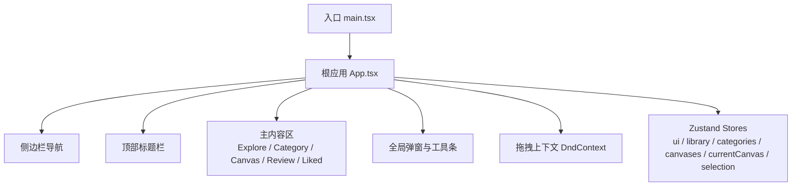
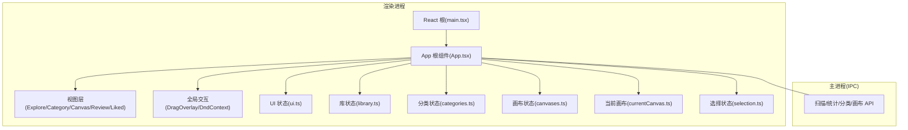
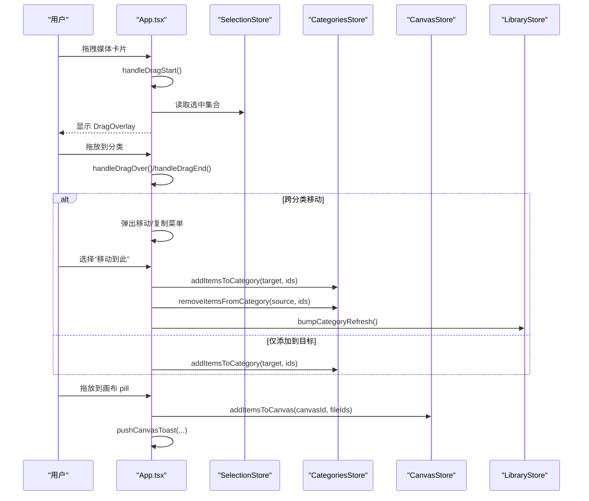
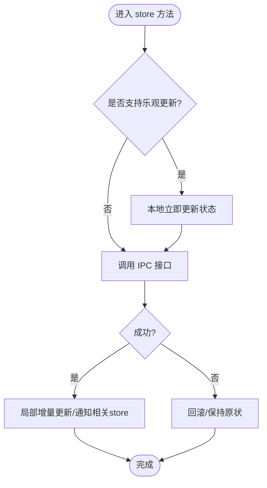
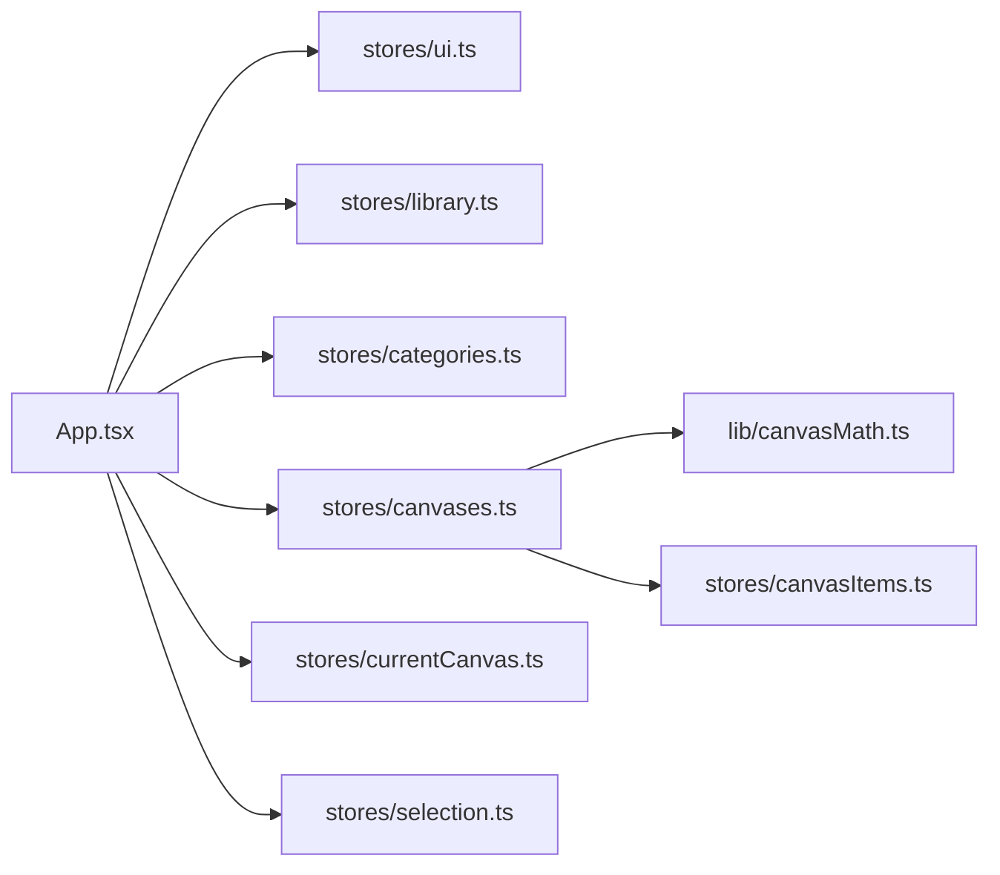

# 前端架构

<cite>
**本文引用的文件**   
- [README.md](file://README.md)
- [main.tsx](file://src/renderer/src/main.tsx)
- [App.tsx](file://src/renderer/src/App.tsx)
- [ui.ts](file://src/renderer/src/stores/ui.ts)
- [library.ts](file://src/renderer/src/stores/library.ts)
- [categories.ts](file://src/renderer/src/stores/categories.ts)
- [canvases.ts](file://src/renderer/src/stores/canvases.ts)
- [currentCanvas.ts](file://src/renderer/src/stores/currentCanvas.ts)
- [selection.ts](file://src/renderer/src/stores/selection.ts)
</cite>

## 目录
1. [简介](#简介)
2. [项目结构](#项目结构)
3. [核心组件](#核心组件)
4. [架构总览](#架构总览)
5. [详细组件分析](#详细组件分析)
6. [依赖分析](#依赖分析)
7. [性能考虑](#性能考虑)
8. [故障排查指南](#故障排查指南)
9. [结论](#结论)
10. [附录](#附录)

## 简介
本文件面向 Serendip 的前端（渲染进程）技术文档，聚焦基于 React 与 TypeScript 的架构设计、状态管理（Zustand）、路由与视图组织、响应式 UI 与主题系统、虚拟滚动与拖拽交互、以及性能优化与错误处理策略。文档以仓库现有实现为依据，提供可追溯的代码片段路径与可视化图示，帮助开发者快速理解并扩展功能。

## 项目结构
渲染层采用“单入口 + 根应用 + 多视图”的组织方式：
- 入口挂载 React 根节点，启用严格模式
- App 作为全局布局与交互中枢，集成拖拽、侧栏、顶栏、主内容区与弹窗
- 视图按功能划分（探索、评审、喜欢、分类、画布等），各自负责独立滚动区域
- 状态通过 Zustand store 分模块管理，UI 偏好持久化，业务数据通过 IPC 与主进程通信

图表来源
- [main.tsx:1-12](file://src/renderer/src/main.tsx#L1-L12)
- [App.tsx:1-120](file://src/renderer/src/App.tsx#L1-L120)

章节来源
- [README.md:1-66](file://README.md#L1-L66)
- [main.tsx:1-12](file://src/renderer/src/main.tsx#L1-L12)
- [App.tsx:1-120](file://src/renderer/src/App.tsx#L1-L120)

## 核心组件
- 根应用 App.tsx
  - 职责：全局布局、视图切换、拖拽上下文、主题同步、全屏监听、键盘快捷键、弹窗与工具条协调
  - 关键能力：
    - 使用 @dnd-kit 配置传感器、碰撞检测、拖拽浮层中心吸附
    - 根据当前视图条件渲染 ExploreView / CategoryView / CanvasView / ReviewView / LikedView
    - 与多个 Zustand store 协作，驱动侧栏、顶栏、主区行为
    - 与 Electron IPC 桥接，处理扫描进度、全屏变化、WCO 主题同步
- 入口 main.tsx
  - 职责：引入样式、创建 React 根节点、挂载 App
- 状态管理 stores
  - ui.ts：主题、探索模式、网格尺寸、侧栏折叠、面板开关等，支持持久化
  - library.ts：根目录、扫描进度、统计信息、当前视图、评审进度
  - categories.ts：分类 CRUD、重排、批量增删项
  - canvases.ts：画布 CRUD、重排、批量添加元素（含自动布局计算）
  - currentCanvas.ts：当前画布选择，持久化
  - selection.ts：多选状态与区间选择 hook

章节来源
- [App.tsx:120-250](file://src/renderer/src/App.tsx#L120-L250)
- [main.tsx:1-12](file://src/renderer/src/main.tsx#L1-L12)
- [ui.ts:1-98](file://src/renderer/src/stores/ui.ts#L1-L98)
- [library.ts:1-100](file://src/renderer/src/stores/library.ts#L1-L100)
- [categories.ts:1-95](file://src/renderer/src/stores/categories.ts#L1-L95)
- [canvases.ts:1-115](file://src/renderer/src/stores/canvases.ts#L1-L115)
- [currentCanvas.ts:1-18](file://src/renderer/src/stores/currentCanvas.ts#L1-L18)
- [selection.ts:1-141](file://src/renderer/src/stores/selection.ts#L1-L141)

## 架构总览
整体为“Electron 渲染进程 + React 单页应用 + Zustand 状态管理 + Tailwind CSS 主题 + masonic 虚拟瀑布流 + @dnd-kit 拖拽”的组合。

图表来源
- [main.tsx:1-12](file://src/renderer/src/main.tsx#L1-L12)
- [App.tsx:1-120](file://src/renderer/src/App.tsx#L1-L120)
- [ui.ts:1-98](file://src/renderer/src/stores/ui.ts#L1-L98)
- [library.ts:1-100](file://src/renderer/src/stores/library.ts#L1-L100)
- [categories.ts:1-95](file://src/renderer/src/stores/categories.ts#L1-L95)
- [canvases.ts:1-115](file://src/renderer/src/stores/canvases.ts#L1-L115)
- [currentCanvas.ts:1-18](file://src/renderer/src/stores/currentCanvas.ts#L1-L18)
- [selection.ts:1-141](file://src/renderer/src/stores/selection.ts#L1-L141)

## 详细组件分析

### 根应用与拖拽体系（App.tsx）
- 拖拽上下文
  - 使用 DndContext 统一配置传感器、碰撞检测、开始/结束回调
  - 自定义碰撞检测：媒体拖拽严格命中分类；分类/画布重排回退最近中心
  - 自定义修饰器：使 DragOverlay 浮层中心跟随鼠标
- 视图切换与滚动容器
  - 主内容区按 view.kind 条件渲染不同视图
  - ExploreView 常驻挂载并通过容器控制显示，保留滚动位置
  - 其他视图各自拥有独立滚动容器
- 事件与副作用
  - 监听全屏变化，调整 WCO 占位宽度
  - Tab 键切换侧栏折叠
  - 初始化加载根目录、分类、画布，校验当前画布有效性
- 弹窗与工具条
  - 新建/重命名/删除分类与画布的 PromptDialog 与 ConfirmDialog
  - 投放菜单用于“移动/复制”到目标分类

图表来源
- [App.tsx:250-403](file://src/renderer/src/App.tsx#L250-L403)
- [selection.ts:1-141](file://src/renderer/src/stores/selection.ts#L1-L141)
- [categories.ts:1-95](file://src/renderer/src/stores/categories.ts#L1-L95)
- [canvases.ts:1-115](file://src/renderer/src/stores/canvases.ts#L1-L115)
- [library.ts:1-100](file://src/renderer/src/stores/library.ts#L1-L100)

章节来源
- [App.tsx:120-403](file://src/renderer/src/App.tsx#L120-L403)

### 状态管理（Zustand）
- 组织方式
  - 按领域拆分 store：ui、library、categories、canvases、currentCanvas、selection
  - 每个 store 暴露最小化的读写方法，组件按需订阅
- 数据持久化
  - ui.ts 与 currentCanvas.ts 使用 persist 中间件，将用户偏好与当前画布选择持久化
  - onRehydrateStorage 钩子恢复 DOM 主题属性
- 状态同步策略
  - 乐观更新：分类/画布重排先本地更新顺序，再调用 IPC
  - 局部增量更新：增删项时只更新对应条目计数，避免全量刷新
  - 非持久化状态：selection 不持久化，随视图切换清空
- 典型流程
  - 扫描：library.startScan 订阅 IPC 进度，完成后加载统计
  - 分类操作：create/rename/remove/reorder/addItems/removeItems 均触发 load 或局部更新
  - 画布添加：计算新元素布局，写入后更新 itemCount 并通知 items store 刷新

图表来源
- [ui.ts:1-98](file://src/renderer/src/stores/ui.ts#L1-L98)
- [library.ts:1-100](file://src/renderer/src/stores/library.ts#L1-L100)
- [categories.ts:1-95](file://src/renderer/src/stores/categories.ts#L1-L95)
- [canvases.ts:1-115](file://src/renderer/src/stores/canvases.ts#L1-L115)
- [currentCanvas.ts:1-18](file://src/renderer/src/stores/currentCanvas.ts#L1-L18)
- [selection.ts:1-141](file://src/renderer/src/stores/selection.ts#L1-L141)

章节来源
- [ui.ts:1-98](file://src/renderer/src/stores/ui.ts#L1-L98)
- [library.ts:1-100](file://src/renderer/src/stores/library.ts#L1-L100)
- [categories.ts:1-95](file://src/renderer/src/stores/categories.ts#L1-L95)
- [canvases.ts:1-115](file://src/renderer/src/stores/canvases.ts#L1-L115)
- [currentCanvas.ts:1-18](file://src/renderer/src/stores/currentCanvas.ts#L1-L18)
- [selection.ts:1-141](file://src/renderer/src/stores/selection.ts#L1-L141)

### 响应式 UI 与主题系统
- 主题切换
  - ui.store 维护 theme，setTheme/toggleTheme 同步 data-theme 属性
  - onRehydrateStorage 在恢复时重新设置 DOM 主题
- 网格尺寸与探索模式
  - gridSize 影响瀑布流列数；exploreMode 控制推荐策略
- 侧栏折叠与分组展开
  - sidebarCollapsed、categoriesGroupOpen、canvasesGroupOpen 控制布局与交互

章节来源
- [ui.ts:1-98](file://src/renderer/src/stores/ui.ts#L1-L98)

### 虚拟滚动与瀑布流
- 使用 masonic 进行瀑布流虚拟化渲染，提升大数据量下的滚动与渲染性能
- 结合 ScrollContainerProvider 将滚动容器限定在主内容区，避免 window 滚动模型带来的坐标计算问题

章节来源
- [README.md:1-66](file://README.md#L1-L66)
- [App.tsx:190-210](file://src/renderer/src/App.tsx#L190-L210)

### 拖拽交互（@dnd-kit）
- 传感器：PointerSensor 设置距离阈值，避免误触
- 碰撞检测：pointerWithin 优先命中，媒体拖拽落空返回空，分类/画布重排回退 closestCenter
- 浮层居中：自定义 Modifier 让 DragOverlay 中心跟随光标
- 业务联动：拖拽结果驱动分类/画布增删与重排

章节来源
- [App.tsx:90-127](file://src/renderer/src/App.tsx#L90-L127)
- [App.tsx:250-403](file://src/renderer/src/App.tsx#L250-L403)

### 多选与区间选择
- selection store 维护 selected、active、anchor
- useGridSelection hook 封装区间选择逻辑，按当前视图顺序计算锚点到目标的范围
- 长按、Ctrl/Cmd 点击、Shift 点击三种路径进入多选

章节来源
- [selection.ts:1-141](file://src/renderer/src/stores/selection.ts#L1-L141)

## 依赖分析
- 外部依赖
  - React 19、TypeScript、Tailwind CSS 3
  - Zustand（含 persist 中间件）
  - @dnd-kit（core/sortable/utilities）
  - masonic（瀑布流虚拟化）
  - lucide-react（图标）
  - better-sqlite3（主进程数据库）
  - sharp/fluent-ffmpeg（缩略图）
  - chokidar（文件监听）
- 内部依赖关系
  - App.tsx 依赖多个 store 与视图组件
  - canvases.ts 依赖 canvasMath 布局算法与 canvasItems store
  - library.ts 通过 window.api 与主进程通信

图表来源
- [App.tsx:1-120](file://src/renderer/src/App.tsx#L1-L120)
- [ui.ts:1-98](file://src/renderer/src/stores/ui.ts#L1-L98)
- [library.ts:1-100](file://src/renderer/src/stores/library.ts#L1-L100)
- [categories.ts:1-95](file://src/renderer/src/stores/categories.ts#L1-L95)
- [canvases.ts:1-115](file://src/renderer/src/stores/canvases.ts#L1-L115)
- [currentCanvas.ts:1-18](file://src/renderer/src/stores/currentCanvas.ts#L1-L18)
- [selection.ts:1-141](file://src/renderer/src/stores/selection.ts#L1-L141)

章节来源
- [README.md:1-66](file://README.md#L1-L66)
- [App.tsx:1-120](file://src/renderer/src/App.tsx#L1-L120)

## 性能考虑
- 虚拟滚动：masonic 大幅降低长列表渲染开销
- 局部更新：分类/画布增删项仅更新受影响字段，减少重渲染
- 常驻挂载：ExploreView 常驻挂载，切换视图不销毁，保留滚动与缓存
- 拖拽体验：自定义碰撞与浮层居中，减少不必要的重绘
- 主题切换：通过 data-theme 属性切换，避免整树重建

[本节为通用指导，无需代码引用]

## 故障排查指南
- 扫描失败
  - 现象：startScan 捕获异常，isScanning 置为 false
  - 排查：检查 IPC 通道、主进程扫描逻辑、权限与路径
- 分类/画布操作失败
  - 现象：addItemsToCategory/addItemsToCanvas 抛出错误
  - 排查：确认目标存在、参数合法、IPC 返回值正确
- 当前画布失效
  - 现象：当前画布 ID 对应的画布已被删除
  - 处理：初始化时校验并清空 currentCanvasId
- 主题未生效
  - 现象：data-theme 未同步
  - 排查：persist 恢复钩子与 setTheme 是否执行

章节来源
- [library.ts:58-81](file://src/renderer/src/stores/library.ts#L58-L81)
- [App.tsx:218-229](file://src/renderer/src/App.tsx#L218-L229)
- [ui.ts:86-96](file://src/renderer/src/stores/ui.ts#L86-L96)

## 结论
Serendip 前端采用清晰的模块化结构与轻量级状态管理，结合虚拟滚动与拖拽交互，实现了高性能与良好用户体验。Zustand 的持久化与乐观更新策略有效提升了交互流畅度与数据一致性。建议后续继续完善错误边界与空态/加载态，并在大数据量场景下持续压测与调优。

[本节为总结性内容，无需代码引用]

## 附录
- 开发命令与阶段规划参见 README
- 组件与视图文件位于 src/renderer/src/components 与 views 目录
- 工具函数与库位于 lib 目录

章节来源
- [README.md:1-66](file://README.md#L1-L66)