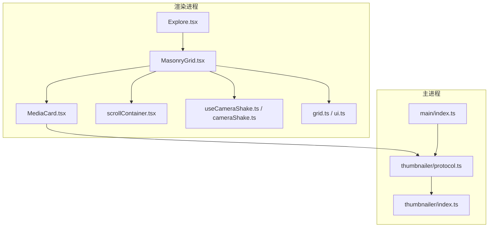
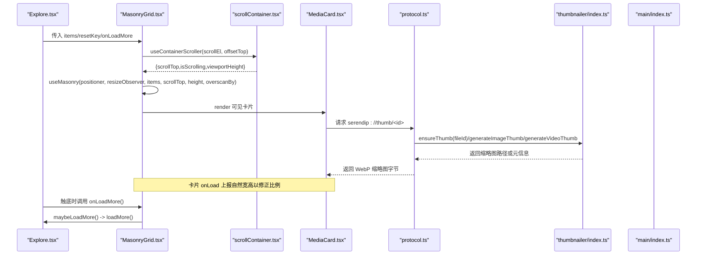
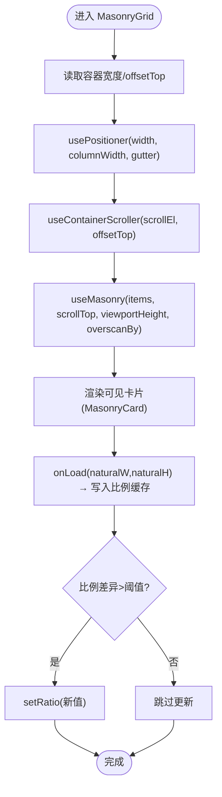
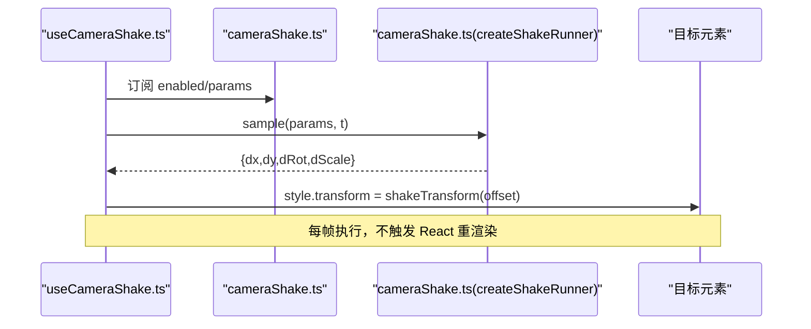
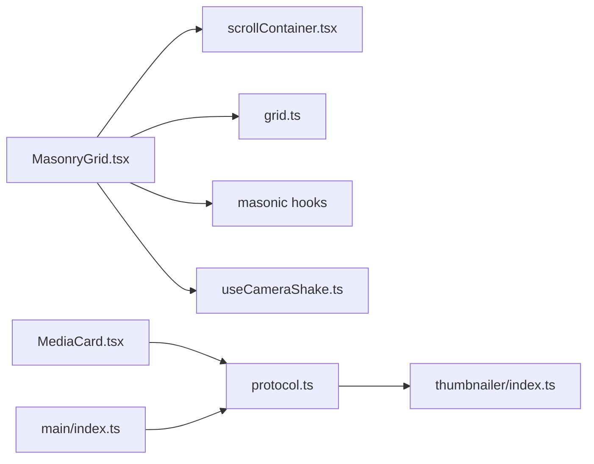

# 性能优化

<cite>
**本文引用的文件**   
- [MasonryGrid.tsx](file://src/renderer/src/components/MasonryGrid.tsx)
- [scrollContainer.tsx](file://src/renderer/src/lib/scrollContainer.tsx)
- [useCameraShake.ts](file://src/renderer/src/hooks/useCameraShake.ts)
- [cameraShake.ts](file://src/renderer/src/lib/cameraShake.ts)
- [MediaCard.tsx](file://src/renderer/src/components/MediaCard.tsx)
- [grid.ts](file://src/renderer/src/lib/grid.ts)
- [ui.ts](file://src/renderer/src/stores/ui.ts)
- [Explore.tsx](file://src/renderer/src/views/Explore.tsx)
- [protocol.ts](file://src/main/thumbnailer/protocol.ts)
- [index.ts（缩略图生成）](file://src/main/thumbnailer/index.ts)
- [index.ts（主进程入口）](file://src/main/index.ts)
</cite>

## 目录
1. [简介](#简介)
2. [项目结构](#项目结构)
3. [核心组件](#核心组件)
4. [架构总览](#架构总览)
5. [详细组件分析](#详细组件分析)
6. [依赖关系分析](#依赖关系分析)
7. [性能考量与优化策略](#性能考量与优化策略)
8. [故障排查指南](#故障排查指南)
9. [结论](#结论)
10. [附录：最佳实践与示例路径](#附录最佳实践与示例路径)

## 简介
本文件面向 Serendip 前端性能优化，聚焦以下方面：
- 基于 masonic 的虚拟滚动瀑布流实现与渲染池管理
- 自定义滚动容器（替代 window 滚动）的位置同步、视口计算与增量渲染
- 摄影机抖动效果 useCameraShake 的性能考虑与动画优化
- 图片懒加载、缩略图缓存与大数据集渲染优化
- 性能监控工具使用、瓶颈分析与优化策略
- 与 Electron 主进程的协作与资源管理

## 项目结构
Serendip 采用 Electron + React 架构。渲染层负责 UI 与交互，主进程提供文件系统访问、缩略图生成与协议服务。关键路径包括：
- 渲染层：MasonryGrid 瀑布流虚拟化、MediaCard 卡片渲染、useCameraShake 抖动动画、scrollContainer 滚动容器适配
- 主进程：thumbnailer 缩略图/视频帧抽取、serendip 协议处理、IPC 处理器



图表来源
- [MasonryGrid.tsx:1-212](file://src/renderer/src/components/MasonryGrid.tsx#L1-L212)
- [scrollContainer.tsx:1-77](file://src/renderer/src/lib/scrollContainer.tsx#L1-L77)
- [useCameraShake.ts:1-55](file://src/renderer/src/hooks/useCameraShake.ts#L1-L55)
- [cameraShake.ts:1-236](file://src/renderer/src/lib/cameraShake.ts#L1-L236)
- [MediaCard.tsx:1-614](file://src/renderer/src/components/MediaCard.tsx#L1-L614)
- [grid.ts:1-29](file://src/renderer/src/lib/grid.ts#L1-L29)
- [ui.ts:1-98](file://src/renderer/src/stores/ui.ts#L1-L98)
- [Explore.tsx:1-430](file://src/renderer/src/views/Explore.tsx#L1-L430)
- [protocol.ts:1-297](file://src/main/thumbnailer/protocol.ts#L1-L297)
- [index.ts（缩略图生成）:1-138](file://src/main/thumbnailer/index.ts#L1-L138)
- [index.ts（主进程入口）:1-134](file://src/main/index.ts#L1-L134)

章节来源
- [MasonryGrid.tsx:1-212](file://src/renderer/src/components/MasonryGrid.tsx#L1-L212)
- [scrollContainer.tsx:1-77](file://src/renderer/src/lib/scrollContainer.tsx#L1-L77)
- [useCameraShake.ts:1-55](file://src/renderer/src/hooks/useCameraShake.ts#L1-L55)
- [cameraShake.ts:1-236](file://src/renderer/src/lib/cameraShake.ts#L1-L236)
- [MediaCard.tsx:1-614](file://src/renderer/src/components/MediaCard.tsx#L1-L614)
- [grid.ts:1-29](file://src/renderer/src/lib/grid.ts#L1-L29)
- [ui.ts:1-98](file://src/renderer/src/stores/ui.ts#L1-L98)
- [Explore.tsx:1-430](file://src/renderer/src/views/Explore.tsx#L1-L430)
- [protocol.ts:1-297](file://src/main/thumbnailer/protocol.ts#L1-L297)
- [index.ts（缩略图生成）:1-138](file://src/main/thumbnailer/index.ts#L1-L138)
- [index.ts（主进程入口）:1-134](file://src/main/index.ts#L1-L134)

## 核心组件
- MasonryGrid：基于 masonic 的无副作用 API（useMasonry/usePositioner/useResizeObserver）构建的虚拟化瀑布流，仅挂载可视区域卡片，DOM 数量恒定；通过 useContainerScroller 替换默认 window 滚动模型，使滚动条出现在主区而非页面顶部。
- MediaCard：单卡渲染，包含图片/视频预览、懒加载、错误降级、视频播放池与冷却机制、长按多选等。
- scrollContainer：提供主滚动容器的 scrollTop、isScrolling、viewportHeight，并处理 offsetTop 换算与 ResizeObserver。
- useCameraShake：每帧直接写 transform，不触发 React 重渲染；结合 store 参数与淡入淡出控制。
- grid/ui：根据 gridSize 和目标列宽反推列数，影响瀑布流密度与卡片尺寸。
- Explore：分页加载推荐数据，去重与触底加载更多，驱动 MasonryGrid。

章节来源
- [MasonryGrid.tsx:1-212](file://src/renderer/src/components/MasonryGrid.tsx#L1-L212)
- [MediaCard.tsx:1-614](file://src/renderer/src/components/MediaCard.tsx#L1-L614)
- [scrollContainer.tsx:1-77](file://src/renderer/src/lib/scrollContainer.tsx#L1-L77)
- [useCameraShake.ts:1-55](file://src/renderer/src/hooks/useCameraShake.ts#L1-L55)
- [grid.ts:1-29](file://src/renderer/src/lib/grid.ts#L1-L29)
- [ui.ts:1-98](file://src/renderer/src/stores/ui.ts#L1-L98)
- [Explore.tsx:1-430](file://src/renderer/src/views/Explore.tsx#L1-L430)

## 架构总览
下图展示从视图到渲染、再到主进程协议与缩略图生成的完整链路，以及滚动与动画的关键路径。



图表来源
- [Explore.tsx:1-430](file://src/renderer/src/views/Explore.tsx#L1-L430)
- [MasonryGrid.tsx:1-212](file://src/renderer/src/components/MasonryGrid.tsx#L1-L212)
- [scrollContainer.tsx:1-77](file://src/renderer/src/lib/scrollContainer.tsx#L1-L77)
- [MediaCard.tsx:1-614](file://src/renderer/src/components/MediaCard.tsx#L1-L614)
- [protocol.ts:1-297](file://src/main/thumbnailer/protocol.ts#L1-L297)
- [index.ts（缩略图生成）:1-138](file://src/main/thumbnailer/index.ts#L1-L138)
- [index.ts（主进程入口）:1-134](file://src/main/index.ts#L1-L134)

## 详细组件分析

### 虚拟滚动瀑布流（MasonryGrid）
- 渲染池与内存控制
  - 使用 masonic 的 useMasonry/usePositioner/useResizeObserver，仅渲染可视区域及 overscanBy 扩展区域，保持 DOM 数量稳定。
  - itemKey 基于 data.id，确保回滚复用节点，避免重复随机与布局抖动。
  - 模块级 isItemLoaded/itemKey 稳定引用，避免无限加载缓存失效。
- 滚动容器适配
  - 通过 useContainerScroller 获取 scrollTop/isScrolling/viewportHeight，替代 window 滚动，解决“顶栏不滚”场景下的滚动位置同步问题。
  - offsetTop 用于将容器在滚动容器内的偏移纳入 scrollTop 计算，保证定位准确。
- 尺寸与列数
  - 根据 gridSize 与 TARGET_WIDTH 计算 columnWidth，再交由 positioner 决定列数与布局。
  - 侧边栏折叠后延迟读取容器宽度，避免动画期间频繁重排。
- 比例缓存与二次抖动抑制
  - RatioCacheContext 跨卸载/重挂持久化 id→ratio，首次渲染即使用实测宽高比，减少 positioner 位置不一致导致的抖动。
  - 仅在 ratio 变化超过阈值时才更新，避免 DB 已准的热库场景下无谓重排。



图表来源
- [MasonryGrid.tsx:1-212](file://src/renderer/src/components/MasonryGrid.tsx#L1-L212)
- [scrollContainer.tsx:1-77](file://src/renderer/src/lib/scrollContainer.tsx#L1-L77)
- [grid.ts:1-29](file://src/renderer/src/lib/grid.ts#L1-L29)

章节来源
- [MasonryGrid.tsx:1-212](file://src/renderer/src/components/MasonryGrid.tsx#L1-L212)
- [scrollContainer.tsx:1-77](file://src/renderer/src/lib/scrollContainer.tsx#L1-L77)
- [grid.ts:1-29](file://src/renderer/src/lib/grid.ts#L1-L29)

### 滚动容器优化（scrollContainer.tsx）
- 行为对齐 masonic 的 useScroller：
  - scrollTop = container.scrollTop - offsetTop
  - isScrolling 在滚动事件后设置，空闲约 140ms 后关闭，便于 masonic 切换 pointer-events 优化
  - viewportHeight 取自容器 clientHeight，随 ResizeObserver 更新
- 订阅与清理
  - passive scroll 监听，避免阻塞滚动
  - 组件卸载时移除监听、断开 ResizeObserver、清空定时器

```mermaid
classDiagram
class ScrollContainer {
+useScrollContainer() : HTMLElement|null
+useContainerScroller(scrollEl, offsetTop) : {scrollTop,isScrolling,viewportHeight}
}
```

图表来源
- [scrollContainer.tsx:1-77](file://src/renderer/src/lib/scrollContainer.tsx#L1-L77)

章节来源
- [scrollContainer.tsx:1-77](file://src/renderer/src/lib/scrollContainer.tsx#L1-L77)

### 摄影机抖动（useCameraShake）
- 性能要点
  - 每帧通过 requestAnimationFrame 直接写入 targetRef.style.transform，绕过 React state 与重渲染
  - 每个消费者持有独立的 ShakeRunner，时序独立但算法同源
  - 启用淡入 RAMP_DURATION，脉冲衰减至阈值后剔除，避免无效计算
- 参数与预设
  - 噪声游移与脉冲抖动可分别开关，支持 masterIntensity 总强度控制
  - 预设系统持久化，切换预设即时生效



图表来源
- [useCameraShake.ts:1-55](file://src/renderer/src/hooks/useCameraShake.ts#L1-L55)
- [cameraShake.ts:1-236](file://src/renderer/src/lib/cameraShake.ts#L1-L236)

章节来源
- [useCameraShake.ts:1-55](file://src/renderer/src/hooks/useCameraShake.ts#L1-L55)
- [cameraShake.ts:1-236](file://src/renderer/src/lib/cameraShake.ts#L1-L236)

### 媒体卡片（MediaCard）
- 图片懒加载与错误降级
  - 使用 loading="lazy"，onError 回调上报失败并显示占位
- 视频播放池与冷却
  - 最多同时播放 N 个视频，超出则标记失败；错误进入退避冷却（指数退避，上限封顶）
  - 看门狗超时未播放成功仅标记本次失败，不进冷却，避免误伤大文件/慢 IO
- hover 延迟挂载
  - 进入 hover 延迟 300ms 才挂载 video，离开延迟 250ms 卸载，降低快速划过带来的抖动与开销

章节来源
- [MediaCard.tsx:1-614](file://src/renderer/src/components/MediaCard.tsx#L1-L614)

### 网格尺寸与列数（grid.ts / ui.ts）
- 通过 gridSize 选择目标列宽，反推列数，控制瀑布流密度与卡片大小
- 用户可在 UI 中循环切换 small/medium/large

章节来源
- [grid.ts:1-29](file://src/renderer/src/lib/grid.ts#L1-L29)
- [ui.ts:1-98](file://src/renderer/src/stores/ui.ts#L1-L98)

### 数据加载与分页（Explore.tsx）
- 初始加载与去重：维护 seenIdsRef，避免重复项
- 触底加载更多：当 items 不足半批且仍有更多时自动拉取
- 批量操作：喜欢/不喜欢、加入分类/画布等

章节来源
- [Explore.tsx:1-430](file://src/renderer/src/views/Explore.tsx#L1-L430)

## 依赖关系分析
- 渲染层内部依赖
  - MasonryGrid 依赖 scrollContainer、grid、masonic hooks
  - MediaCard 依赖 selection/currentCanvas/canvases 等状态
  - useCameraShake 依赖 cameraShake 引擎与 cameraShake store
- 主进程集成
  - serendip 协议由 main/index.ts 注册特权，thumbnailer/protocol.ts 处理 thumb/image/video 请求
  - thumbnailer/index.ts 负责缩略图/视频帧抽取与缓存



图表来源
- [MasonryGrid.tsx:1-212](file://src/renderer/src/components/MasonryGrid.tsx#L1-L212)
- [scrollContainer.tsx:1-77](file://src/renderer/src/lib/scrollContainer.tsx#L1-L77)
- [grid.ts:1-29](file://src/renderer/src/lib/grid.ts#L1-L29)
- [useCameraShake.ts:1-55](file://src/renderer/src/hooks/useCameraShake.ts#L1-L55)
- [MediaCard.tsx:1-614](file://src/renderer/src/components/MediaCard.tsx#L1-L614)
- [protocol.ts:1-297](file://src/main/thumbnailer/protocol.ts#L1-L297)
- [index.ts（缩略图生成）:1-138](file://src/main/thumbnailer/index.ts#L1-L138)
- [index.ts（主进程入口）:1-134](file://src/main/index.ts#L1-L134)

章节来源
- [MasonryGrid.tsx:1-212](file://src/renderer/src/components/MasonryGrid.tsx#L1-L212)
- [scrollContainer.tsx:1-77](file://src/renderer/src/lib/scrollContainer.tsx#L1-L77)
- [grid.ts:1-29](file://src/renderer/src/lib/grid.ts#L1-L29)
- [useCameraShake.ts:1-55](file://src/renderer/src/hooks/useCameraShake.ts#L1-L55)
- [MediaCard.tsx:1-614](file://src/renderer/src/components/MediaCard.tsx#L1-L614)
- [protocol.ts:1-297](file://src/main/thumbnailer/protocol.ts#L1-L297)
- [index.ts（缩略图生成）:1-138](file://src/main/thumbnailer/index.ts#L1-L138)
- [index.ts（主进程入口）:1-134](file://src/main/index.ts#L1-L134)

## 性能考量与优化策略
- 虚拟滚动与渲染池
  - 使用 masonic 的无副作用 API，配合 overscanBy 控制预渲染范围，平衡流畅度与内存占用
  - 稳定的 itemKey 与 isItemLoaded，避免无限加载缓存失效
  - 比例缓存避免回滚时的二次抖动
- 滚动容器优化
  - 使用 passive 监听与 ResizeObserver，避免阻塞滚动与频繁重排
  - 侧边栏动画结束后延迟读取容器宽度，减少抖动
- 图片与视频优化
  - 缩略图按需生成与本地缓存（WebP），大图直读原图，HEIC/HEIF 转高质量 JPEG 并缓存
  - 视频播放池限制并发，错误退避冷却，hover 延迟挂载/卸载
- 动画优化
  - 抖动效果直接写 transform，零 React 重渲染；脉冲衰减阈值剔除，避免无效计算
- 主进程协作
  - 自定义协议支持 Range 流式响应，减少首屏压力
  - 启动时静默扫描并启动文件监听，提升后续交互响应性

[本节为通用指导，无需具体文件分析]

## 故障排查指南
- 缩略图加载失败
  - 现象：卡片显示“加载失败”，并从列表移除
  - 排查：检查 ensureThumb 流程与数据库记录，确认文件是否存在；查看 markUnavailable 是否被调用
  - 参考路径
    - [MediaCard.tsx:355-358](file://src/renderer/src/components/MediaCard.tsx#L355-L358)
    - [protocol.ts:264-297](file://src/main/thumbnailer/protocol.ts#L264-L297)
- 视频无法播放
  - 现象：hover 无视频或长时间黑屏
  - 排查：查看冷却表与看门狗逻辑，确认是否因错误进入冷却或超时未播放
  - 参考路径
    - [MediaCard.tsx:224-279](file://src/renderer/src/components/MediaCard.tsx#L224-L279)
- 滚动错位或跳动
  - 现象：滚动位置不正确或布局抖动
  - 排查：确认 offsetTop 计算、scrollTop 减去偏移是否正确；检查 ResizeObserver 是否及时更新 viewportHeight
  - 参考路径
    - [scrollContainer.tsx:34-76](file://src/renderer/src/lib/scrollContainer.tsx#L34-L76)
    - [MasonryGrid.tsx:130-159](file://src/renderer/src/components/MasonryGrid.tsx#L130-L159)
- 窗口全屏/移动事件
  - 现象：全屏或移动导致布局异常
  - 排查：确认主进程 IPC 事件发送与渲染层订阅是否正常
  - 参考路径
    - [index.ts（主进程入口）:71-79](file://src/main/index.ts#L71-L79)

章节来源
- [MediaCard.tsx:224-279](file://src/renderer/src/components/MediaCard.tsx#L224-L279)
- [MediaCard.tsx:355-358](file://src/renderer/src/components/MediaCard.tsx#L355-L358)
- [scrollContainer.tsx:34-76](file://src/renderer/src/lib/scrollContainer.tsx#L34-L76)
- [MasonryGrid.tsx:130-159](file://src/renderer/src/components/MasonryGrid.tsx#L130-L159)
- [index.ts（主进程入口）:71-79](file://src/main/index.ts#L71-L79)

## 结论
通过 masonic 虚拟化、自定义滚动容器、严格的图片/视频加载策略与高效的抖动动画实现，Serendip 在大体量媒体浏览场景下保持了高帧率与低内存占用。主进程提供的缩略图与协议服务进一步降低了渲染端 I/O 压力。建议持续监控滚动与动画路径，结合业务指标（FPS、内存峰值、首屏时间）进行迭代优化。

[本节为总结，无需具体文件分析]

## 附录：最佳实践与示例路径
- 虚拟滚动最佳实践
  - 使用稳定的 itemKey 与 isItemLoaded，避免缓存失效
  - 合理设置 overscanBy，兼顾流畅与内存
  - 对卡片高度估算与比例缓存，减少重排
  - 参考路径
    - [MasonryGrid.tsx:86-90](file://src/renderer/src/components/MasonryGrid.tsx#L86-L90)
    - [MasonryGrid.tsx:189-202](file://src/renderer/src/components/MasonryGrid.tsx#L189-L202)
- 滚动容器优化
  - 使用 passive 监听与 ResizeObserver，避免阻塞
  - 在容器尺寸变化后延迟读取，减少抖动
  - 参考路径
    - [scrollContainer.tsx:45-69](file://src/renderer/src/lib/scrollContainer.tsx#L45-L69)
    - [MasonryGrid.tsx:141-159](file://src/renderer/src/components/MasonryGrid.tsx#L141-L159)
- 图片/视频加载
  - 缩略图优先，原图异步覆盖；错误降级与冷却
  - 视频并发限制与看门狗
  - 参考路径
    - [MediaCard.tsx:444-474](file://src/renderer/src/components/MediaCard.tsx#L444-L474)
    - [MediaCard.tsx:224-279](file://src/renderer/src/components/MediaCard.tsx#L224-L279)
- 抖动动画
  - 直接写 transform，避免重渲染；脉冲衰减阈值剔除
  - 参考路径
    - [useCameraShake.ts:31-53](file://src/renderer/src/hooks/useCameraShake.ts#L31-L53)
    - [cameraShake.ts:148-221](file://src/renderer/src/lib/cameraShake.ts#L148-L221)
- 主进程协作
  - 自定义协议与缩略图缓存
  - 参考路径
    - [protocol.ts:33-54](file://src/main/thumbnailer/protocol.ts#L33-L54)
    - [index.ts（缩略图生成）:27-52](file://src/main/thumbnailer/index.ts#L27-L52)