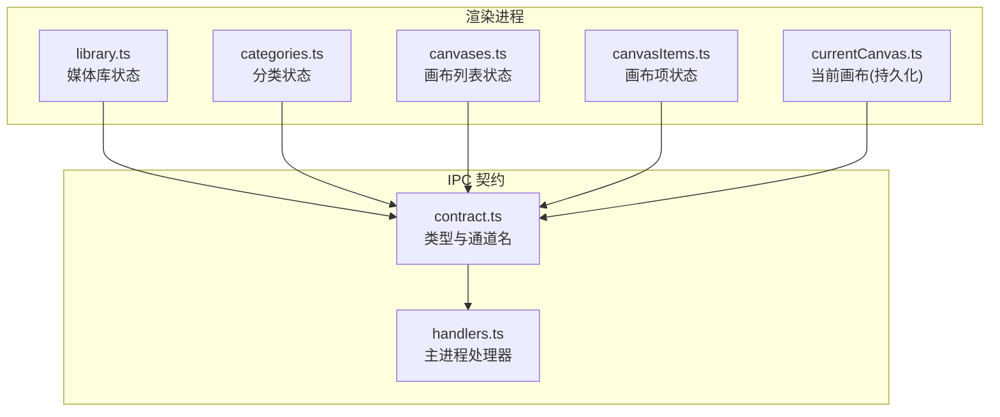
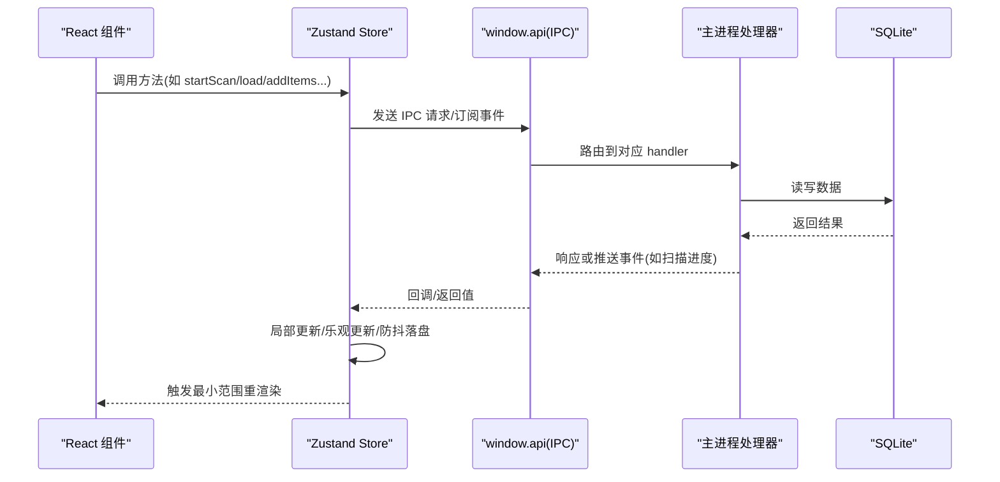
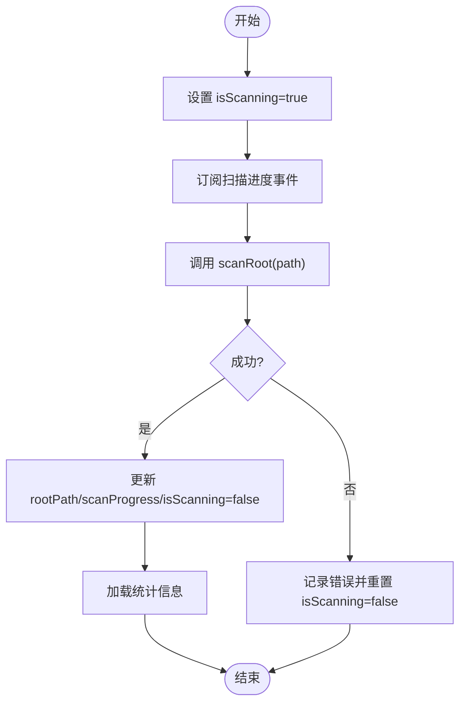
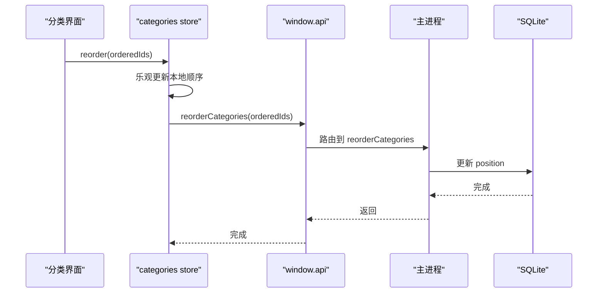
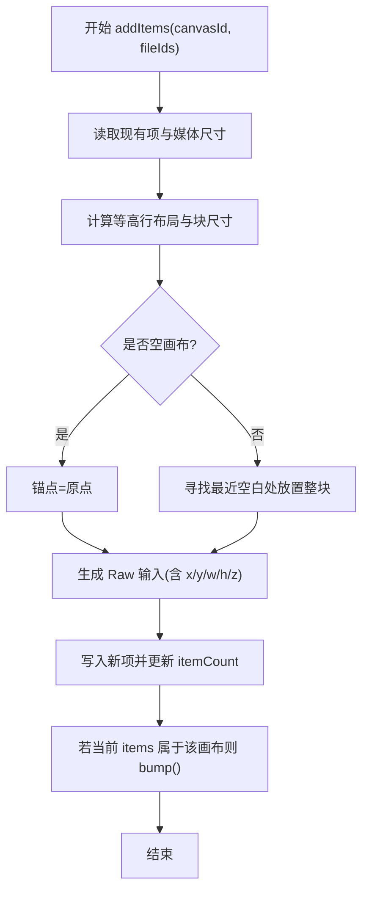
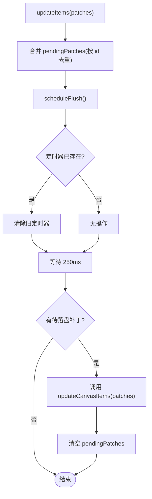
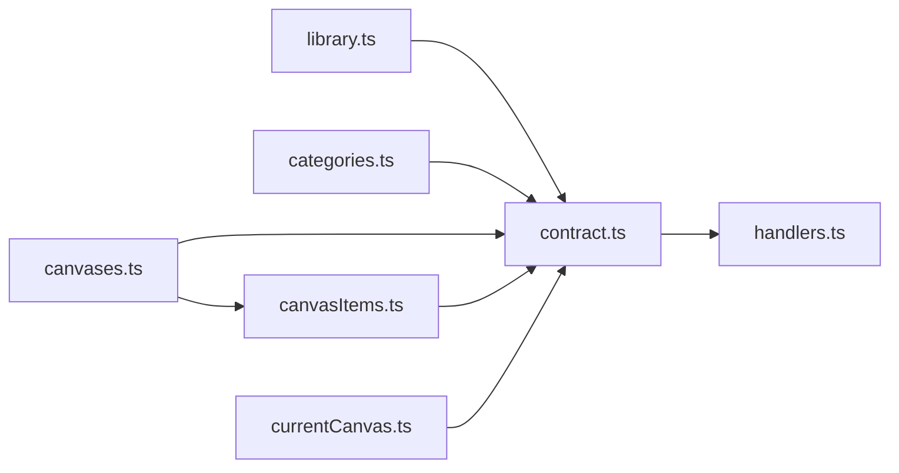

# 状态管理

<cite>
**本文引用的文件**
- [README.md](file://README.md)
- [library.ts](file://src/renderer/src/stores/library.ts)
- [categories.ts](file://src/renderer/src/stores/categories.ts)
- [canvases.ts](file://src/renderer/src/stores/canvases.ts)
- [canvasItems.ts](file://src/renderer/src/stores/canvasItems.ts)
- [currentCanvas.ts](file://src/renderer/src/stores/currentCanvas.ts)
- [handlers.ts](file://src/main/ipc/handlers.ts)
- [contract.ts](file://src/main/ipc/contract.ts)
</cite>

## 目录
1. [简介](#简介)
2. [项目结构](#项目结构)
3. [核心组件](#核心组件)
4. [架构总览](#架构总览)
5. [详细组件分析](#详细组件分析)
6. [依赖关系分析](#依赖关系分析)
7. [性能考虑](#性能考虑)
8. [故障排查指南](#故障排查指南)
9. [结论](#结论)
10. [附录](#附录)

## 简介
本文件为 Serendip 基于 Zustand 的状态管理系统提供全面技术文档。内容涵盖：
- 各 store 的职责划分与数据流设计（媒体库、分类、画布等）
- 选择器使用模式、中间件配置与性能优化策略
- 跨 store 同步机制、异步操作处理与错误状态管理
- 调试工具与状态迁移策略
- 复杂状态操作与订阅模式的实践示例
- 与 IPC 层的集成方式与数据持久化实现

## 项目结构
渲染层 stores 位于 src/renderer/src/stores，主进程 IPC 处理器位于 src/main/ipc。Zustand 负责前端状态，IPC 负责与主进程通信，主进程通过 better-sqlite3 进行数据持久化。

图表来源
- [library.ts:1-100](file://src/renderer/src/stores/library.ts#L1-L100)
- [categories.ts:1-95](file://src/renderer/src/stores/categories.ts#L1-L95)
- [canvases.ts:1-115](file://src/renderer/src/stores/canvases.ts#L1-L115)
- [canvasItems.ts:1-94](file://src/renderer/src/stores/canvasItems.ts#L1-L94)
- [currentCanvas.ts:1-18](file://src/renderer/src/stores/currentCanvas.ts#L1-L18)
- [contract.ts:1-130](file://src/main/ipc/contract.ts#L1-L130)
- [handlers.ts:1-292](file://src/main/ipc/handlers.ts#L1-L292)

章节来源
- [README.md:1-66](file://README.md#L1-L66)

## 核心组件
- library store：管理媒体库根路径、扫描进度、统计信息、视图切换与评审进度；通过 IPC 订阅扫描进度并更新本地状态。
- categories store：维护分类列表与计数，支持创建、重命名、删除、排序与批量增删媒体项；采用乐观更新减少闪烁。
- canvases store：维护画布列表与计数，支持创建、重命名、删除、排序与批量添加/移除画布项；自动计算网格布局并触发 items 刷新。
- canvasItems store：维护当前画布的项集合，支持懒加载、卸载、增量更新与 250ms 防抖落盘。
- currentCanvas store：持久化当前选中的画布 id，用于页面刷新后恢复上下文。

章节来源
- [library.ts:1-100](file://src/renderer/src/stores/library.ts#L1-L100)
- [categories.ts:1-95](file://src/renderer/src/stores/categories.ts#L1-L95)
- [canvases.ts:1-115](file://src/renderer/src/stores/canvases.ts#L1-L115)
- [canvasItems.ts:1-94](file://src/renderer/src/stores/canvasItems.ts#L1-L94)
- [currentCanvas.ts:1-18](file://src/renderer/src/stores/currentCanvas.ts#L1-L18)

## 架构总览
整体数据流遵循“渲染层 Zustand → IPC 契约 → 主进程处理器 → 数据库”的单向流。关键交互包括：
- 媒体库扫描：渲染层发起扫描请求，主进程推送进度事件，渲染层实时更新 UI。
- 分类与画布 CRUD：渲染层调用 IPC 接口，主进程执行 DB 操作并返回结果。
- 画布项编辑：渲染层先乐观更新，再防抖合并写入，避免频繁 IO。

图表来源
- [handlers.ts:40-292](file://src/main/ipc/handlers.ts#L40-L292)
- [contract.ts:84-130](file://src/main/ipc/contract.ts#L84-L130)
- [library.ts:58-99](file://src/renderer/src/stores/library.ts#L58-L99)
- [canvasItems.ts:66-85](file://src/renderer/src/stores/canvasItems.ts#L66-L85)

## 详细组件分析

### 媒体库状态（library store）
职责
- 管理媒体库根路径、扫描状态与进度、统计信息与视图切换。
- 通过 IPC 订阅扫描进度，完成后加载统计数据。

关键流程
- 启动扫描：设置 isScanning=true，订阅进度事件，调用 scanRoot，成功后更新 rootPath 与 scanProgress，并加载 stats。
- 加载当前根：读取持久化的 rootPath，若存在则加载统计。
- 视图切换：提供 bumpCategoryRefresh 以触发分类视图重载。

图表来源
- [library.ts:58-99](file://src/renderer/src/stores/library.ts#L58-L99)
- [handlers.ts:52-81](file://src/main/ipc/handlers.ts#L52-L81)

章节来源
- [library.ts:1-100](file://src/renderer/src/stores/library.ts#L1-L100)
- [handlers.ts:52-81](file://src/main/ipc/handlers.ts#L52-L81)

### 分类状态（categories store）
职责
- 维护分类列表与 itemCount，支持创建、重命名、删除、排序与批量增删媒体项。
- 对 reorder 与 add/remove 操作采用乐观更新，提升交互流畅度。

关键模式
- 乐观更新：在本地立即调整顺序或计数，随后再调用后端确认。
- 局部更新：仅变更受影响分类的字段，避免整表重拉。

图表来源
- [categories.ts:47-59](file://src/renderer/src/stores/categories.ts#L47-L59)
- [handlers.ts:194-196](file://src/main/ipc/handlers.ts#L194-L196)

章节来源
- [categories.ts:1-95](file://src/renderer/src/stores/categories.ts#L1-L95)
- [handlers.ts:188-211](file://src/main/ipc/handlers.ts#L188-L211)

### 画布状态（canvases store）
职责
- 维护画布列表与 itemCount，支持创建、重命名、删除、排序与批量添加/移除画布项。
- 添加项时根据媒体宽高比计算等高行网格布局，定位空白区域插入，不破坏已有元素。

关键流程
- 添加项：获取现有项与媒体尺寸，计算布局位置与块大小，选择锚点，生成 Raw 输入写入，更新 itemCount，并触发 items store 刷新。

图表来源
- [canvases.ts:58-99](file://src/renderer/src/stores/canvases.ts#L58-L99)
- [handlers.ts:223-235](file://src/main/ipc/handlers.ts#L223-L235)

章节来源
- [canvases.ts:1-115](file://src/renderer/src/stores/canvases.ts#L1-L115)
- [handlers.ts:214-250](file://src/main/ipc/handlers.ts#L214-L250)

### 画布项状态（canvasItems store）
职责
- 维护当前画布的项集合，支持懒加载、卸载、增量更新与 250ms 防抖落盘。
- 对外暴露 bump() 供其他 store 在外部修改项后触发重新拉取。

关键模式
- 防抖落盘：将多次 patch 合并，延迟写入，降低 IO 频率。
- 条件加载：load 内部判断 canvasId 一致性，避免竞态导致旧数据覆盖。

图表来源
- [canvasItems.ts:18-32](file://src/renderer/src/stores/canvasItems.ts#L18-L32)
- [canvasItems.ts:66-85](file://src/renderer/src/stores/canvasItems.ts#L66-L85)
- [handlers.ts:242-244](file://src/main/ipc/handlers.ts#L242-L244)

章节来源
- [canvasItems.ts:1-94](file://src/renderer/src/stores/canvasItems.ts#L1-L94)
- [handlers.ts:239-244](file://src/main/ipc/handlers.ts#L239-L244)

### 当前画布（currentCanvas store）
职责
- 持久化当前选中画布 id，确保刷新后恢复上下文。

中间件
- 使用 persist 中间件，以指定名称存储于浏览器存储中。

章节来源
- [currentCanvas.ts:1-18](file://src/renderer/src/stores/currentCanvas.ts#L1-L18)

## 依赖关系分析
- 渲染层 stores 均通过 window.api 调用 IPC 接口，类型由 contract.ts 统一声明。
- 主进程 handlers.ts 集中注册所有 IPC 处理器，并访问数据库模块。
- canvases store 与 canvasItems store 之间存在弱耦合：前者在添加/删除项后调用后者的 bump() 触发刷新。

图表来源
- [contract.ts:1-130](file://src/main/ipc/contract.ts#L1-L130)
- [handlers.ts:1-292](file://src/main/ipc/handlers.ts#L1-L292)
- [canvases.ts:1-115](file://src/renderer/src/stores/canvases.ts#L1-L115)
- [canvasItems.ts:1-94](file://src/renderer/src/stores/canvasItems.ts#L1-L94)

章节来源
- [contract.ts:1-130](file://src/main/ipc/contract.ts#L1-L130)
- [handlers.ts:1-292](file://src/main/ipc/handlers.ts#L1-L292)

## 性能考虑
- 选择器粒度：组件应只订阅必要字段，避免全量订阅导致不必要重渲染。
- 乐观更新：reorder、add/remove 等操作先在本地更新，再落盘，减少视觉抖动。
- 防抖落盘：画布项编辑使用 250ms 防抖合并补丁，显著降低 IO 次数。
- 局部更新：仅变更受影响字段（如 itemCount），避免整表重拉。
- 懒加载：画布项按需加载与卸载，控制内存占用。
- 批处理：主进程侧对喜欢/不感兴趣等写操作使用事务批写，提高吞吐。

[本节为通用指导，无需源码引用]

## 故障排查指南
- 扫描失败：检查 isScanning 是否被正确重置；查看控制台错误日志；确认 IPC 通道是否正常注册。
- 分类/画布计数不一致：确认是否存在并发更新导致乐观更新未回滚；必要时调用 load() 强制刷新。
- 画布项未保存：检查 pendingPatches 是否为空；确认 scheduleFlush 定时器是否被清理；观察 updateCanvasItems 是否被调用。
- 当前画布丢失：确认 persist 中间件的 name 是否与预期一致；检查浏览器存储是否可用。

章节来源
- [library.ts:75-80](file://src/renderer/src/stores/library.ts#L75-L80)
- [canvasItems.ts:22-32](file://src/renderer/src/stores/canvasItems.ts#L22-L32)
- [currentCanvas.ts:9-17](file://src/renderer/src/stores/currentCanvas.ts#L9-L17)

## 结论
Serendip 的状态管理以 Zustand 为核心，结合 IPC 与持久化中间件，形成了清晰的分层架构。通过乐观更新、防抖落盘与局部更新等策略，在保证一致性的同时提升了交互体验。后续可进一步引入更细粒度的选择器与状态快照对比，以提升调试效率与性能。

[本节为总结性内容，无需源码引用]

## 附录

### 状态选择器使用模式
- 精确订阅：组件仅订阅所需字段，例如只订阅当前画布 id 或分类列表长度。
- 派生状态：在组件内根据基础状态计算派生值，避免在 store 中维护冗余字段。
- 组合订阅：对多个 store 的片段进行组合，减少跨 store 同步复杂度。

[本节为概念说明，无需源码引用]

### 中间件配置与扩展
- 持久化：currentCanvas store 使用 persist 中间件，可按需对其他轻量状态启用。
- 扩展建议：如需全局日志与快照对比，可在开发环境启用 logger 中间件；生产环境保持精简。

章节来源
- [currentCanvas.ts:9-17](file://src/renderer/src/stores/currentCanvas.ts#L9-L17)

### 跨 store 同步机制
- 事件式联动：canvases store 在添加/删除项后调用 canvasItems store 的 bump()，触发懒加载刷新。
- 非侵入式：通过 getState() 直接读取另一 store 的当前状态，避免循环依赖。

章节来源
- [canvases.ts:95-98](file://src/renderer/src/stores/canvases.ts#L95-L98)
- [canvases.ts:111-113](file://src/renderer/src/stores/canvases.ts#L111-L113)
- [canvasItems.ts:59-64](file://src/renderer/src/stores/canvasItems.ts#L59-L64)

### 异步操作与错误处理
- 扫描流程：在 try/catch 中捕获异常，确保 finally 中取消订阅，避免内存泄漏。
- 网络/IO 错误：在 catch 分支中重置相关标志位，保证 UI 处于一致状态。

章节来源
- [library.ts:66-81](file://src/renderer/src/stores/library.ts#L66-L81)

### 与 IPC 层的集成
- 类型契约：contract.ts 定义 SerendipAPI 与 IPC 通道常量，前后端共享类型。
- 处理器注册：handlers.ts 集中注册所有 handle 函数，并按通道分发到具体业务逻辑。

章节来源
- [contract.ts:12-82](file://src/main/ipc/contract.ts#L12-L82)
- [contract.ts:84-130](file://src/main/ipc/contract.ts#L84-L130)
- [handlers.ts:40-292](file://src/main/ipc/handlers.ts#L40-L292)

### 数据持久化实现
- 偏好设置：rootPath 等设置保存在 settings 表中，通过 IPC 查询与更新。
- 媒体与分类/画布：通过各自模块的 SQL 操作进行持久化，渲染层通过 IPC 间接访问。

章节来源
- [handlers.ts:63-81](file://src/main/ipc/handlers.ts#L63-L81)
- [handlers.ts:188-250](file://src/main/ipc/handlers.ts#L188-L250)

### 状态调试工具
- 开发建议：在开发环境启用 logger 中间件，输出每次 set 的前后快照，便于定位问题。
- 手动快照：在关键操作前后打印 store 快照，辅助比对差异。

[本节为通用指导，无需源码引用]

### 状态迁移策略
- 版本化 key：为持久化数据增加版本号，启动时检测并迁移旧格式。
- 渐进兼容：新增字段提供默认值，避免旧数据缺失导致崩溃。
- 灰度发布：在过渡期同时支持新旧结构，逐步淘汰旧字段。

[本节为通用指导，无需源码引用]

### 实际代码示例（路径指引）
- 复杂状态操作：画布批量添加项与自动布局
  - [canvases.ts:58-99](file://src/renderer/src/stores/canvases.ts#L58-L99)
- 状态订阅模式：分类列表懒加载与乐观更新
  - [categories.ts:26-35](file://src/renderer/src/stores/categories.ts#L26-L35)
  - [categories.ts:47-59](file://src/renderer/src/stores/categories.ts#L47-L59)
- 防抖落盘：画布项编辑合并与延迟写入
  - [canvasItems.ts:18-32](file://src/renderer/src/stores/canvasItems.ts#L18-L32)
  - [canvasItems.ts:66-85](file://src/renderer/src/stores/canvasItems.ts#L66-L85)
- IPC 集成：扫描进度订阅与更新
  - [library.ts:58-81](file://src/renderer/src/stores/library.ts#L58-L81)
  - [handlers.ts:52-60](file://src/main/ipc/handlers.ts#L52-L60)