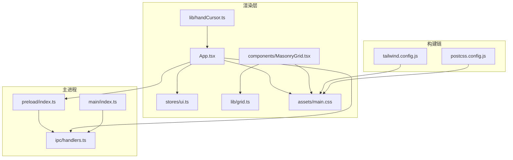
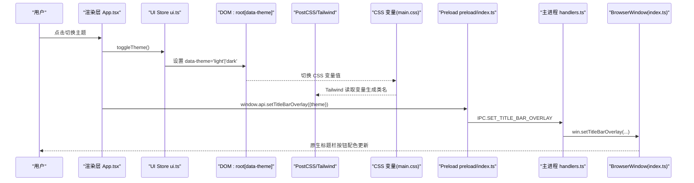
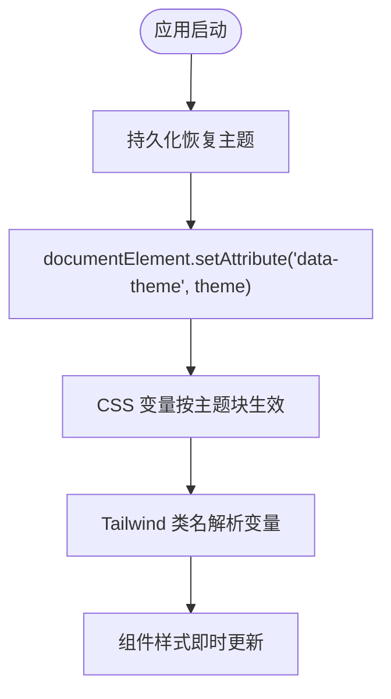
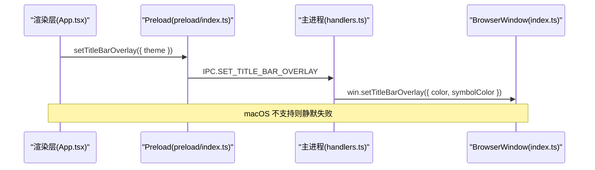
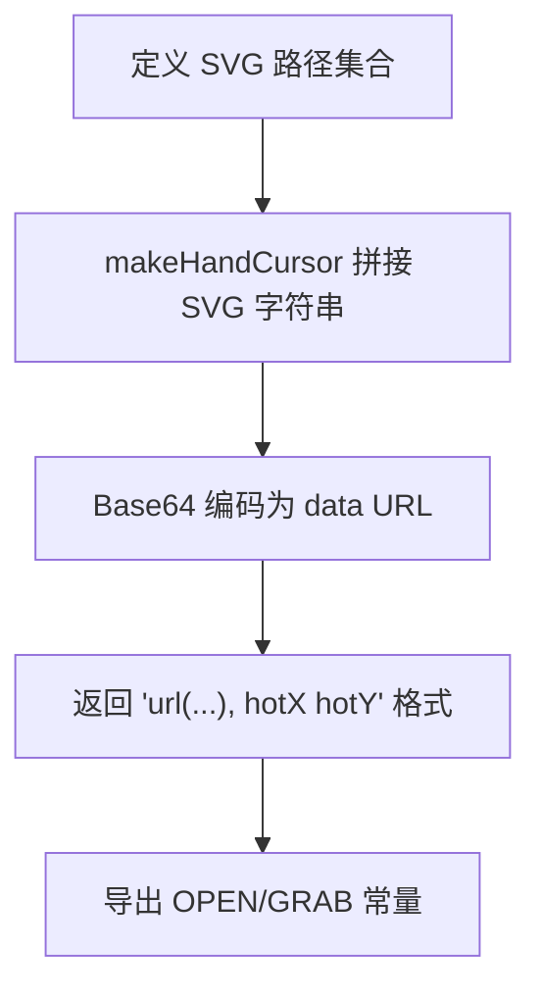
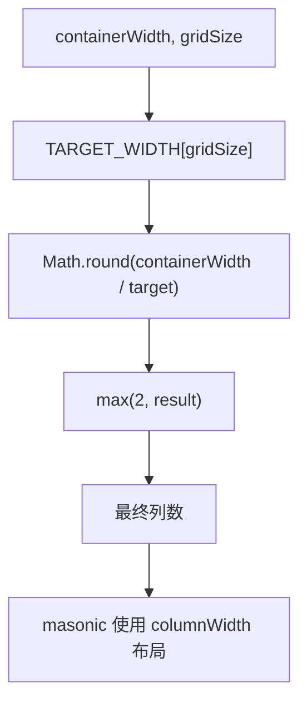
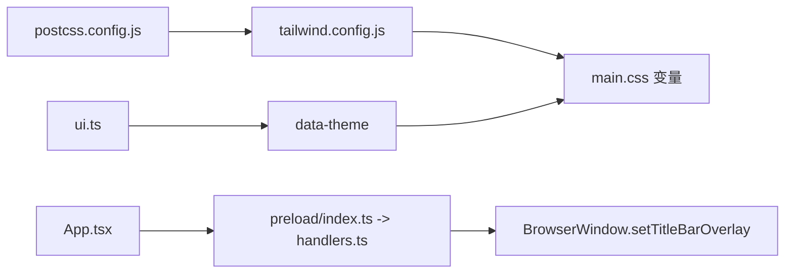

# 用户界面系统

<cite>
**本文引用的文件**   
- [tailwind.config.js](file://tailwind.config.js)
- [postcss.config.js](file://postcss.config.js)
- [main.css](file://src/renderer/src/assets/main.css)
- [ui.ts](file://src/renderer/src/stores/ui.ts)
- [grid.ts](file://src/renderer/src/lib/grid.ts)
- [handCursor.ts](file://src/renderer/src/lib/handCursor.ts)
- [MasonryGrid.tsx](file://src/renderer/src/components/MasonryGrid.tsx)
- [App.tsx](file://src/renderer/src/App.tsx)
- [index.ts（主进程）](file://src/main/index.ts)
- [handlers.ts（IPC 处理器）](file://src/main/ipc/handlers.ts)
- [preload/index.ts](file://src/preload/index.ts)
</cite>

## 目录
1. [简介](#简介)
2. [项目结构](#项目结构)
3. [核心组件](#核心组件)
4. [架构总览](#架构总览)
5. [详细组件分析](#详细组件分析)
6. [依赖关系分析](#依赖关系分析)
7. [性能考量](#性能考量)
8. [故障排查指南](#故障排查指南)
9. [结论](#结论)
10. [附录：主题定制与调试](#附录主题定制与调试)

## 简介
本文件面向 Serendip 的用户界面系统，聚焦基于 Tailwind CSS 3.x 的样式架构、主题系统与响应式布局策略。文档覆盖以下要点：
- 主题系统实现：CSS 变量驱动、Tailwind 颜色映射、亮/暗主题切换机制
- 原生标题栏主题同步：Electron Windows Controls Overlay（WCO）与渲染层联动
- 自定义光标系统 handCursor：SVG 光标生成与热点定位
- 网格布局算法 grid.ts：目标列宽反推列数与自适应瀑布流
- 组件样式规范、动画过渡与可访问性取舍
- 主题定制指南、样式调试技巧与性能优化建议
- Electron 原生功能集成与跨平台兼容性处理

## 项目结构
UI 相关代码主要位于 renderer 层，配合主进程的窗口装饰能力与 IPC 通道完成主题与原生能力的联动；样式体系由 Tailwind + PostCSS 构建，通过 CSS 变量在运行时切换主题。

图表来源
- [App.tsx:472-476](file://src/renderer/src/App.tsx#L472-L476)
- [ui.ts:54-63](file://src/renderer/src/stores/ui.ts#L54-L63)
- [MasonryGrid.tsx:110-118](file://src/renderer/src/components/MasonryGrid.tsx#L110-L118)
- [grid.ts:1-21](file://src/renderer/src/lib/grid.ts#L1-L21)
- [handCursor.ts:17-31](file://src/renderer/src/lib/handCursor.ts#L17-L31)
- [main.css:1-48](file://src/renderer/src/assets/main.css#L1-L48)
- [tailwind.config.js:1-28](file://tailwind.config.js#L1-L28)
- [postcss.config.js:1-6](file://postcss.config.js#L1-L6)
- [index.ts（主进程）:38-65](file://src/main/index.ts#L38-L65)
- [handlers.ts（IPC 处理器）:259-283](file://src/main/ipc/handlers.ts#L259-L283)
- [preload/index.ts:88-89](file://src/preload/index.ts#L88-L89)

章节来源
- [tailwind.config.js:1-28](file://tailwind.config.js#L1-L28)
- [postcss.config.js:1-6](file://postcss.config.js#L1-L6)
- [main.css:1-48](file://src/renderer/src/assets/main.css#L1-L48)
- [ui.ts:54-63](file://src/renderer/src/stores/ui.ts#L54-L63)
- [grid.ts:1-21](file://src/renderer/src/lib/grid.ts#L1-L21)
- [handCursor.ts:17-31](file://src/renderer/src/lib/handCursor.ts#L17-L31)
- [MasonryGrid.tsx:110-118](file://src/renderer/src/components/MasonryGrid.tsx#L110-L118)
- [App.tsx:472-476](file://src/renderer/src/App.tsx#L472-L476)
- [index.ts（主进程）:38-65](file://src/main/index.ts#L38-L65)
- [handlers.ts（IPC 处理器）:259-283](file://src/main/ipc/handlers.ts#L259-L283)
- [preload/index.ts:88-89](file://src/preload/index.ts#L88-L89)

## 核心组件
- 主题状态管理：使用持久化 store 维护 theme、gridSize 等 UI 偏好，并在 DOM 上设置 data-theme 以触发 CSS 变量切换。
- 样式系统：Tailwind 颜色别名全部映射到 CSS 变量，支持透明度修饰符（如 bg-primary/10）。
- 网格布局：根据容器宽度与目标列宽计算列数，结合 masonic 虚拟化渲染瀑布流。
- 自定义光标：通过 SVG 路径生成带阴影描边的高对比度手型光标，并指定热点坐标。
- 原生标题栏同步：渲染层通过 IPC 调用主进程设置 WCO 背景与符号色，保持与业务区一致。

章节来源
- [ui.ts:54-63](file://src/renderer/src/stores/ui.ts#L54-L63)
- [tailwind.config.js:9-24](file://tailwind.config.js#L9-L24)
- [main.css:15-48](file://src/renderer/src/assets/main.css#L15-L48)
- [grid.ts:9-21](file://src/renderer/src/lib/grid.ts#L9-L21)
- [handCursor.ts:17-31](file://src/renderer/src/lib/handCursor.ts#L17-L31)
- [App.tsx:472-476](file://src/renderer/src/App.tsx#L472-L476)
- [handlers.ts（IPC 处理器）:259-283](file://src/main/ipc/handlers.ts#L259-L283)

## 架构总览
下图展示从“主题切换”到“样式生效”的完整链路，包括渲染层、构建链与主进程协作。

图表来源
- [App.tsx:472-476](file://src/renderer/src/App.tsx#L472-L476)
- [ui.ts:54-63](file://src/renderer/src/stores/ui.ts#L54-L63)
- [main.css:15-48](file://src/renderer/src/assets/main.css#L15-L48)
- [tailwind.config.js:9-24](file://tailwind.config.js#L9-L24)
- [postcss.config.js:1-6](file://postcss.config.js#L1-L6)
- [preload/index.ts:88-89](file://src/preload/index.ts#L88-L89)
- [handlers.ts（IPC 处理器）:259-283](file://src/main/ipc/handlers.ts#L259-L283)
- [index.ts（主进程）:38-65](file://src/main/index.ts#L38-L65)

## 详细组件分析

### 主题系统与颜色变量
- 设计思路
  - 品牌色通过两个根变量控制色相与饱和度，亮/暗两套变量块定义所有语义化颜色。
  - Tailwind 扩展 colors，将语义类名映射为 CSS 变量引用，从而在运行时仅切换 data-theme 即可全局换肤。
  - primary 使用 HSL 通道变量，使 Tailwind 透明度修饰符（如 /10）可直接工作。
- 关键实现点
  - 根变量与主题块：在 main.css 中定义 :root[data-theme='light'|'dark'] 下的 --color-* 系列变量。
  - Tailwind 映射：在 tailwind.config.js 中将 background、foreground、primary 等映射到对应变量。
  - 构建链：postcss.config.js 启用 tailwindcss 与 autoprefixer。
- 动态更新
  - 通过 ui.ts 的 setTheme/toggleTheme 在 documentElement 上写入 data-theme，浏览器即时应用新变量。
  - 首次加载时 onRehydrateStorage 恢复已保存的主题到 DOM。

图表来源
- [main.css:15-48](file://src/renderer/src/assets/main.css#L15-L48)
- [tailwind.config.js:9-24](file://tailwind.config.js#L9-L24)
- [postcss.config.js:1-6](file://postcss.config.js#L1-L6)
- [ui.ts:88-96](file://src/renderer/src/stores/ui.ts#L88-L96)

章节来源
- [main.css:1-48](file://src/renderer/src/assets/main.css#L1-L48)
- [tailwind.config.js:1-28](file://tailwind.config.js#L1-L28)
- [postcss.config.js:1-6](file://postcss.config.js#L1-L6)
- [ui.ts:54-63](file://src/renderer/src/stores/ui.ts#L54-L63)
- [ui.ts:88-96](file://src/renderer/src/stores/ui.ts#L88-L96)

### 原生标题栏主题同步（WCO）
- 目标
  - 在 Win/Linux 上使用自绘标题栏与系统控件叠加（WCO），并根据当前主题同步背景与符号色，保证高亮可见性与视觉一致性。
- 流程
  - 渲染层监听主题变化，调用 window.api.setTitleBarOverlay({ theme })。
  - Preload 暴露 API，转发至主进程 IPC.SET_TITLE_BAR_OVERLAY。
  - 主进程获取 BrowserWindow 实例并调用 setTitleBarOverlay，传入 color/symbolColor。
  - macOS 不支持 WCO，调用会抛异常，代码静默忽略。
- 初始值
  - 主进程创建窗口时设置默认 WCO 配色，后续由渲染层随主题切换重设。

图表来源
- [App.tsx:472-476](file://src/renderer/src/App.tsx#L472-L476)
- [preload/index.ts:88-89](file://src/preload/index.ts#L88-L89)
- [handlers.ts（IPC 处理器）:259-283](file://src/main/ipc/handlers.ts#L259-L283)
- [index.ts（主进程）:38-65](file://src/main/index.ts#L38-L65)

章节来源
- [App.tsx:472-476](file://src/renderer/src/App.tsx#L472-L476)
- [handlers.ts（IPC 处理器）:259-283](file://src/main/ipc/handlers.ts#L259-L283)
- [index.ts（主进程）:38-65](file://src/main/index.ts#L38-L65)
- [preload/index.ts:88-89](file://src/preload/index.ts#L88-L89)

### 自定义光标系统（handCursor）
- 目标
  - 提供一套高对比度的手型光标，适用于画布模式与详情页锁定模式，避免系统光标在不同 OS/主题下表现不一致。
- 实现原理
  - 使用两组 SVG path 分别表示“张开/抓取”两种状态。
  - 通过 makeHandCursor 生成带双层描边的 SVG（深色外描边+浅色内描边），再转为 base64 data URL 作为 cursor 值。
  - 指定热点坐标（hotX/hotY）确保指针命中区域符合手掌中心直觉。
- 导出
  - CURSOR_HAND_OPEN、CURSOR_HAND_GRAB 供组件直接引用。

图表来源
- [handCursor.ts:3-15](file://src/renderer/src/lib/handCursor.ts#L3-L15)
- [handCursor.ts:17-31](file://src/renderer/src/lib/handCursor.ts#L17-L31)

章节来源
- [handCursor.ts:17-31](file://src/renderer/src/lib/handCursor.ts#L17-L31)

### 网格布局算法（grid.ts）与瀑布流
- 算法
  - 定义不同尺寸档的目标列宽 TARGET_WIDTH。
  - getColumns(containerWidth, size) 用 containerWidth 除以目标列宽并四舍五入，最小列数为 2，保证小屏可读性。
- 瀑布流集成
  - MasonryGrid 读取 gridSize 得到 columnWidth，结合 usePositioner/useMasonry 进行虚拟化布局。
  - 通过 ResizeObserver 与侧边栏折叠后的延迟测量，稳定获取容器宽度，避免动画期间频繁重排。
  - 单元格高度优先使用会话级宽高比缓存，减少回滚抖动。

图表来源
- [grid.ts:9-21](file://src/renderer/src/lib/grid.ts#L9-L21)
- [MasonryGrid.tsx:110-118](file://src/renderer/src/components/MasonryGrid.tsx#L110-L118)
- [MasonryGrid.tsx:161-168](file://src/renderer/src/components/MasonryGrid.tsx#L161-L168)

章节来源
- [grid.ts:1-21](file://src/renderer/src/lib/grid.ts#L1-L21)
- [MasonryGrid.tsx:110-118](file://src/renderer/src/components/MasonryGrid.tsx#L110-L118)
- [MasonryGrid.tsx:161-168](file://src/renderer/src/components/MasonryGrid.tsx#L161-L168)

### 组件样式规范与动画
- 样式规范
  - 所有语义色通过 Tailwind 变量映射，禁止硬编码颜色值。
  - 滚动条、选中框、第三方库（moveable/selecto）的控制元素均通过 CSS 变量统一主题色。
- 动画与过渡
  - 详情页切图滑入、评审卡片入场、画布全图层淡入等通过 @keyframes 定义，配合 transition 提升交互反馈。
  - 顶部标题栏与侧栏宽度变化使用 CSS transition 平滑过渡。
- 可访问性
  - 桌面端关闭全局 outline，侧重鼠标交互体验；如需键盘导航，可在特定输入域保留焦点样式。

章节来源
- [main.css:83-108](file://src/renderer/src/assets/main.css#L83-L108)
- [main.css:110-187](file://src/renderer/src/assets/main.css#L110-L187)
- [App.tsx:497-514](file://src/renderer/src/App.tsx#L497-L514)

## 依赖关系分析
- 样式依赖
  - postcss.config.js 引入 tailwindcss 与 autoprefixer。
  - tailwind.config.js 扩展 colors，指向 CSS 变量。
  - main.css 定义 :root 与 data-theme 主题块，提供变量源。
- 运行时依赖
  - ui.ts 负责主题状态与持久化，修改 DOM 属性触发样式切换。
  - App.tsx 在主题变化时调用 IPC 更新 WCO。
  - handlers.ts 接收 IPC 并调用 BrowserWindow.setTitleBarOverlay。
  - index.ts（主进程）初始化窗口与默认 WCO 配色。

图表来源
- [postcss.config.js:1-6](file://postcss.config.js#L1-L6)
- [tailwind.config.js:1-28](file://tailwind.config.js#L1-L28)
- [main.css:15-48](file://src/renderer/src/assets/main.css#L15-L48)
- [ui.ts:54-63](file://src/renderer/src/stores/ui.ts#L54-L63)
- [App.tsx:472-476](file://src/renderer/src/App.tsx#L472-L476)
- [preload/index.ts:88-89](file://src/preload/index.ts#L88-L89)
- [handlers.ts（IPC 处理器）:259-283](file://src/main/ipc/handlers.ts#L259-L283)
- [index.ts（主进程）:38-65](file://src/main/index.ts#L38-L65)

章节来源
- [postcss.config.js:1-6](file://postcss.config.js#L1-L6)
- [tailwind.config.js:1-28](file://tailwind.config.js#L1-L28)
- [main.css:15-48](file://src/renderer/src/assets/main.css#L15-L48)
- [ui.ts:54-63](file://src/renderer/src/stores/ui.ts#L54-L63)
- [App.tsx:472-476](file://src/renderer/src/App.tsx#L472-L476)
- [preload/index.ts:88-89](file://src/preload/index.ts#L88-L89)
- [handlers.ts（IPC 处理器）:259-283](file://src/main/ipc/handlers.ts#L259-L283)
- [index.ts（主进程）:38-65](file://src/main/index.ts#L38-L65)

## 性能考量
- 主题切换
  - 仅切换 data-theme 与 CSS 变量，无需重建样式表，开销极低。
- 瀑布流布局
  - 使用 masonic 虚拟化，只挂载视口附近卡片，DOM 数量恒定。
  - 通过 ResizeObserver 与侧边栏动画结束后的延迟测量，避免每帧重排。
  - 会话级宽高比缓存减少二次抖动。
- 原生标题栏
  - WCO 仅在主题变化或全屏切换时更新，频率可控。
- 视频播放闪烁修复
  - 主进程禁用 DirectComposition 视频叠加，避免 Windows 下色彩管线切换导致的闪烁。

章节来源
- [MasonryGrid.tsx:140-159](file://src/renderer/src/components/MasonryGrid.tsx#L140-L159)
- [MasonryGrid.tsx:161-168](file://src/renderer/src/components/MasonryGrid.tsx#L161-L168)
- [index.ts（主进程）:17-23](file://src/main/index.ts#L17-L23)

## 故障排查指南
- 主题未生效
  - 检查 documentElement 是否设置了正确的 data-theme。
  - 确认 Tailwind 输出包含对应的 CSS 变量类名。
- WCO 不显示或颜色异常
  - 确认平台是否支持 WCO（macOS 不支持）。
  - 检查 IPC 调用是否成功，主进程 setTitleBarOverlay 是否抛出异常被捕获。
- 瀑布流错位或抖动
  - 检查容器 ref 是否存在且可见（offsetWidth > 0）。
  - 确认 ResizeObserver 是否正确观察了滚动容器与网格容器。
- 光标不可见或命中不准
  - 检查 handCursor 生成的 data URL 是否有效。
  - 调整热点坐标以匹配手掌中心。

章节来源
- [ui.ts:54-63](file://src/renderer/src/stores/ui.ts#L54-L63)
- [handlers.ts（IPC 处理器）:259-283](file://src/main/ipc/handlers.ts#L259-L283)
- [MasonryGrid.tsx:130-138](file://src/renderer/src/components/MasonryGrid.tsx#L130-L138)
- [handCursor.ts:17-31](file://src/renderer/src/lib/handCursor.ts#L17-L31)

## 结论
Serendip 的 UI 系统以 CSS 变量为核心，结合 Tailwind 的语义化类名，实现了低开销、可扩展的主题方案；通过 IPC 与主进程协作，将主题同步到原生标题栏，获得一致的视觉体验。网格布局采用目标列宽反推算法与虚拟化渲染，兼顾性能与灵活性。自定义光标与丰富的动画过渡提升了交互质感。整体架构清晰、耦合度低，便于后续扩展与跨平台适配。

## 附录：主题定制与调试
- 定制步骤
  - 在 main.css 的 :root 中调整品牌色相与饱和度，亮/暗主题块中的 --color-* 会自动派生。
  - 若需新增语义色，先在 main.css 定义变量，再在 tailwind.config.js 的 extend.colors 中映射。
- 调试技巧
  - 打开浏览器开发者工具，查看 :root[data-theme] 下的变量值是否按预期切换。
  - 在控制台执行 document.documentElement.getAttribute('data-theme') 验证当前主题。
  - 对 WCO，检查主进程日志与 IPC 调用返回值，确认 setTitleBarOverlay 是否成功。
- 性能优化建议
  - 避免在高频回调中读写布局属性，合并到 requestAnimationFrame 或使用 ResizeObserver。
  - 合理使用 will-change 与 transform，减少重排重绘。
  - 对大图资源使用懒加载与缩略图缓存。

章节来源
- [main.css:10-48](file://src/renderer/src/assets/main.css#L10-L48)
- [tailwind.config.js:9-24](file://tailwind.config.js#L9-L24)
- [handlers.ts（IPC 处理器）:259-283](file://src/main/ipc/handlers.ts#L259-L283)