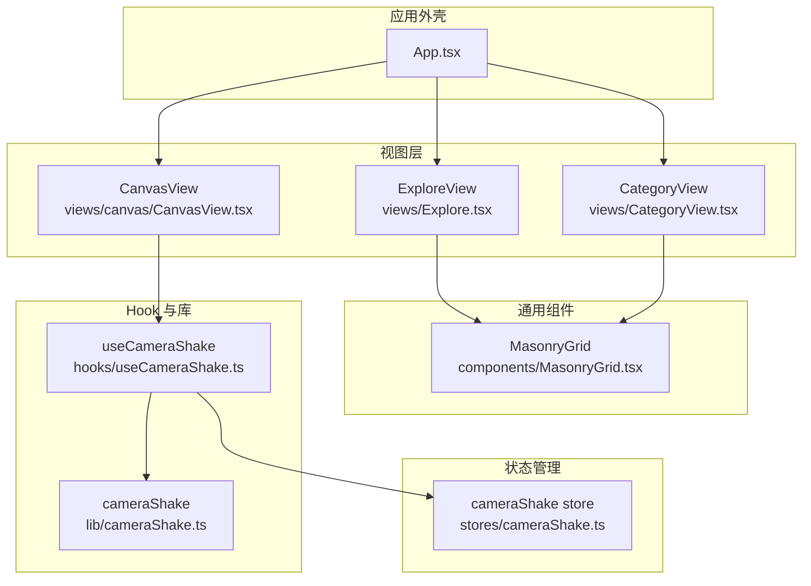
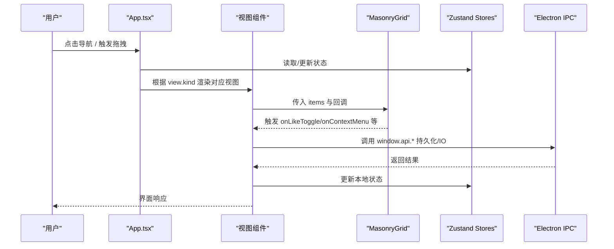
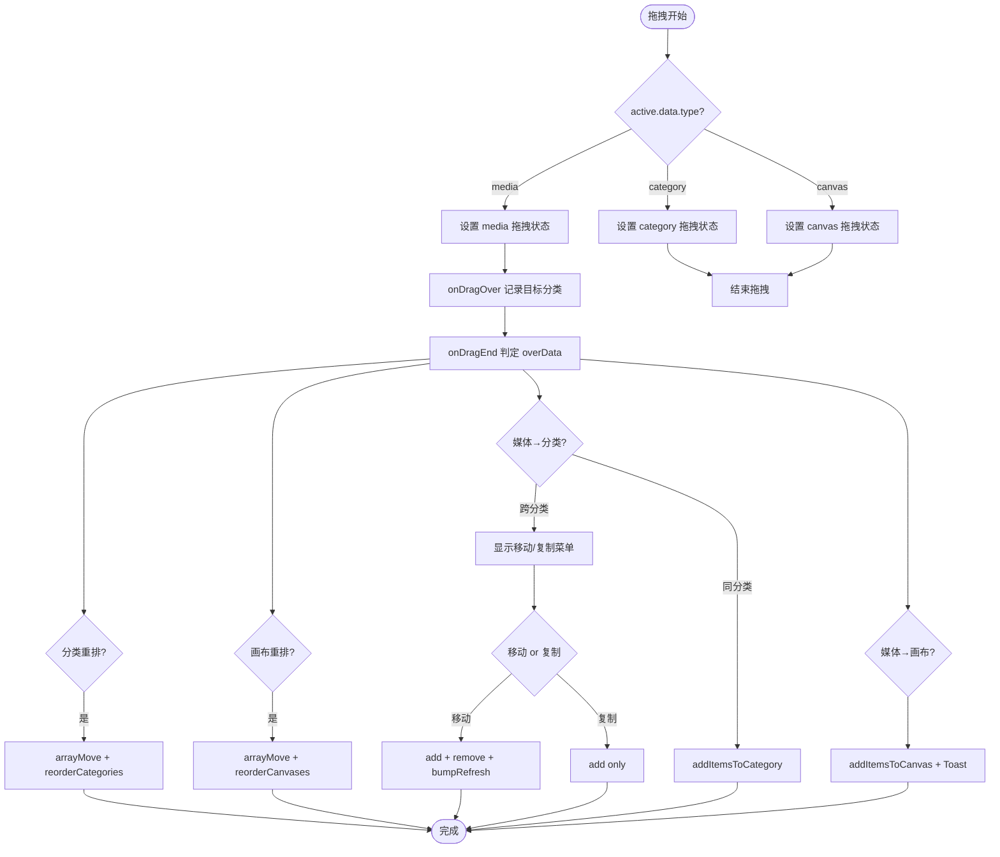
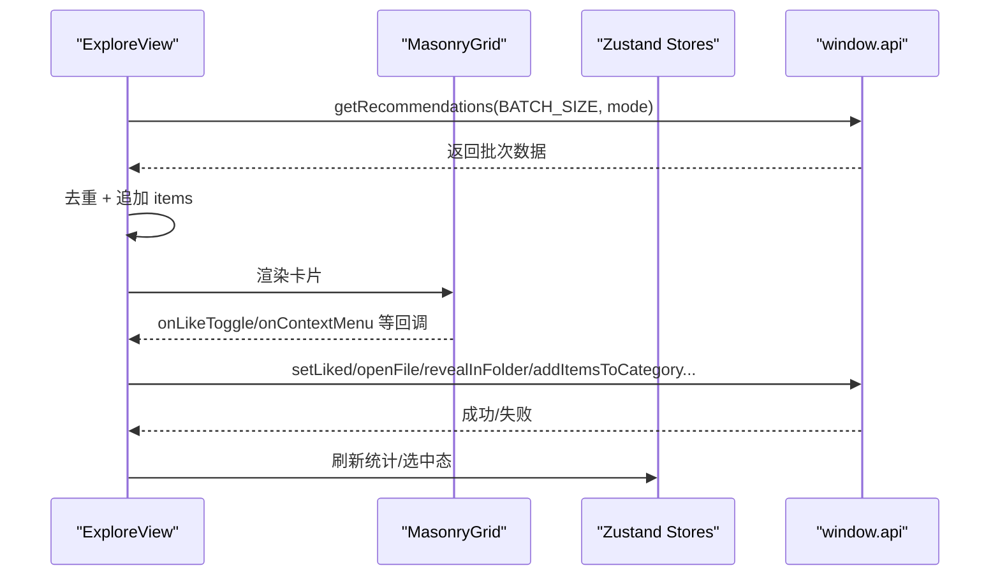
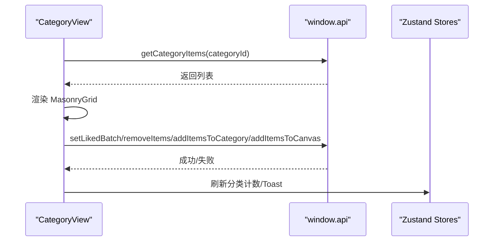
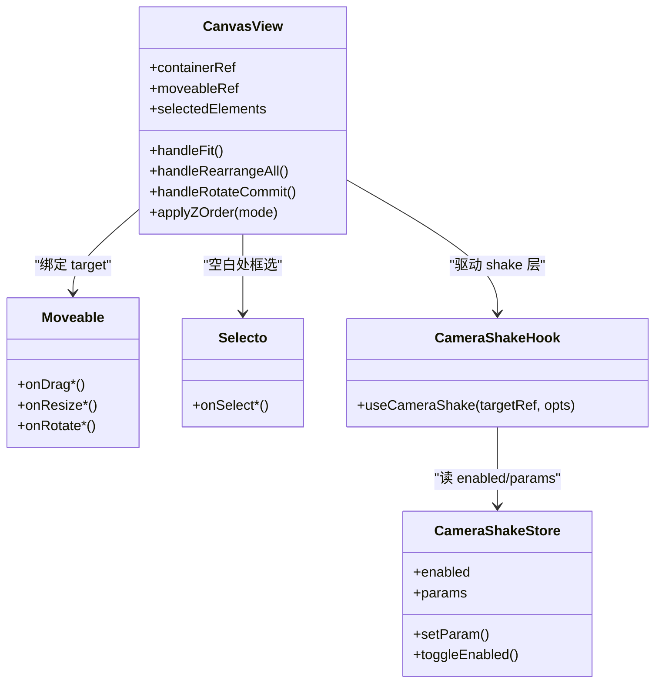
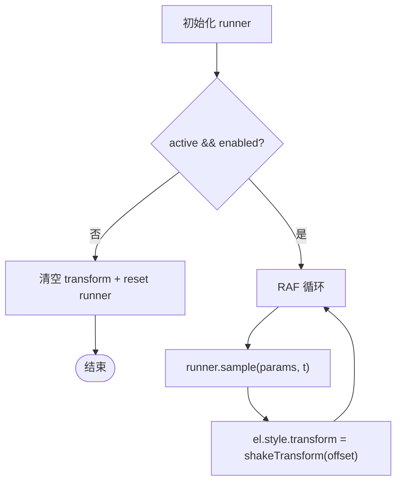
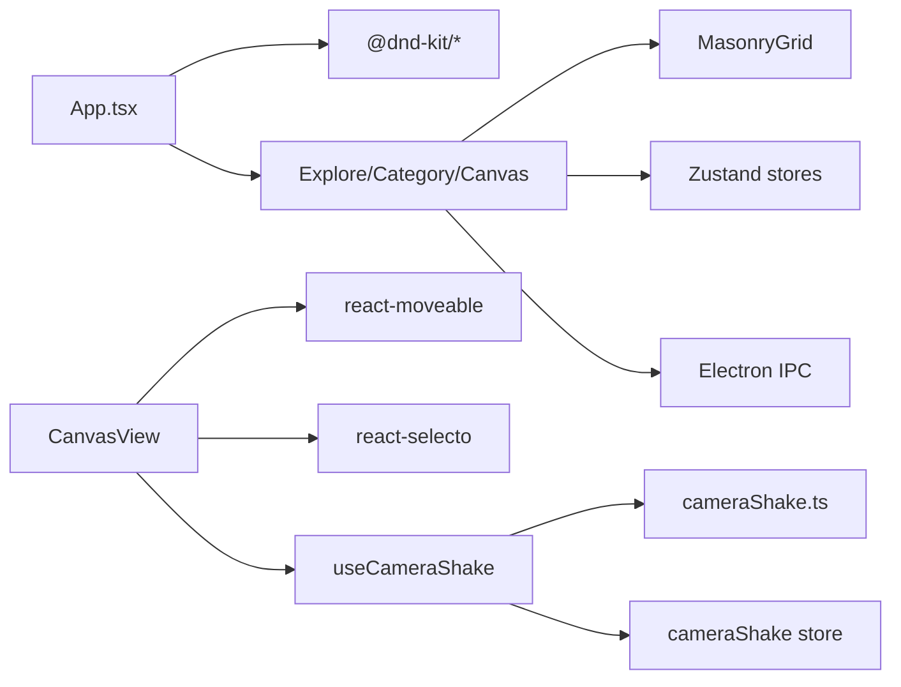

# 组件架构

<cite>
**本文引用的文件**   
- [App.tsx](file://src/renderer/src/App.tsx)
- [Explore.tsx](file://src/renderer/src/views/Explore.tsx)
- [CategoryView.tsx](file://src/renderer/src/views/CategoryView.tsx)
- [CanvasView.tsx](file://src/renderer/src/views/canvas/CanvasView.tsx)
- [useCameraShake.ts](file://src/renderer/src/hooks/useCameraShake.ts)
- [cameraShake.ts](file://src/renderer/src/lib/cameraShake.ts)
- [MasonryGrid.tsx](file://src/renderer/src/components/MasonryGrid.tsx)
- [cameraShake.ts (store)](file://src/renderer/src/stores/cameraShake.ts)
</cite>

## 目录
1. [简介](#简介)
2. [项目结构](#项目结构)
3. [核心组件](#核心组件)
4. [架构总览](#架构总览)
5. [详细组件分析](#详细组件分析)
6. [依赖关系分析](#依赖关系分析)
7. [性能考量](#性能考量)
8. [故障排查指南](#故障排查指南)
9. [结论](#结论)
10. [附录：开发规范与最佳实践](#附录开发规范与最佳实践)

## 简介
本技术文档聚焦于 Serendip 基于 React 18 的前端渲染层（renderer）组件架构，围绕 App 根组件的组织方式、三大视图组件 ExploreView、CategoryView、CanvasView 的职责划分与复用策略展开。同时深入解析自定义 Hook useCameraShake 的设计模式与实现原理，说明组件间通信机制（props、事件回调、状态提升），并详述拖拽交互在 @dnd-kit 的集成方案（DragOverlay、碰撞检测）。文末提供组件开发规范、命名约定与代码组织最佳实践，辅以实际示例路径与错误边界设计思路。

## 项目结构
渲染层采用“视图 + 通用组件 + 工具库 + 状态管理”的分层组织：
- 视图层：ExploreView、CategoryView、CanvasView 等页面级组件
- 通用组件：MasonryGrid、MediaCard、ContextMenu、SelectionToolbar 等可复用 UI 块
- 工具库：cameraShake、canvasMath、grid、handCursor 等纯函数或无副作用模块
- 状态管理：Zustand store（ui、library、categories、canvases、selection、cameraShake 等）

图表来源
- [App.tsx:129-780](file://src/renderer/src/App.tsx#L129-L780)
- [Explore.tsx:32-430](file://src/renderer/src/views/Explore.tsx#L32-L430)
- [CategoryView.tsx:34-414](file://src/renderer/src/views/CategoryView.tsx#L34-L414)
- [CanvasView.tsx:54-1705](file://src/renderer/src/views/canvas/CanvasView.tsx#L54-L1705)
- [MasonryGrid.tsx:99-212](file://src/renderer/src/components/MasonryGrid.tsx#L99-L212)
- [useCameraShake.ts:20-54](file://src/renderer/src/hooks/useCameraShake.ts#L20-L54)
- [cameraShake.ts:121-236](file://src/renderer/src/lib/cameraShake.ts#L121-L236)
- [cameraShake.ts (store):28-97](file://src/renderer/src/stores/cameraShake.ts#L28-L97)

章节来源
- [App.tsx:129-780](file://src/renderer/src/App.tsx#L129-L780)
- [Explore.tsx:32-430](file://src/renderer/src/views/Explore.tsx#L32-L430)
- [CategoryView.tsx:34-414](file://src/renderer/src/views/CategoryView.tsx#L34-L414)
- [CanvasView.tsx:54-1705](file://src/renderer/src/views/canvas/CanvasView.tsx#L54-L1705)
- [MasonryGrid.tsx:99-212](file://src/renderer/src/components/MasonryGrid.tsx#L99-L212)
- [useCameraShake.ts:20-54](file://src/renderer/src/hooks/useCameraShake.ts#L20-L54)
- [cameraShake.ts:121-236](file://src/renderer/src/lib/cameraShake.ts#L121-L236)
- [cameraShake.ts (store):28-97](file://src/renderer/src/stores/cameraShake.ts#L28-L97)

## 核心组件
- App 根组件
  - 负责全局布局（顶栏、侧栏、主区）、路由式视图切换、全局 DnD 上下文、弹窗与 Toast 容器、主题与窗口控制等。
  - 通过 Zustand store 订阅并驱动各视图所需数据与操作。
- ExploreView 探索视图
  - 瀑布流展示推荐内容，支持分页加载、批量操作、右键菜单、分类选择器、添加到画布等。
- CategoryView 分类视图
  - 展示指定分类下的媒体项，支持增删改、批量操作、从分类移除确认对话框等。
- CanvasView 画布视图
  - 自由画布编辑：平移、缩放、框选、拖拽、旋转、裁剪、复制粘贴、层级调整、撤销重做、摄影机手摇等。
- MasonryGrid 瀑布流网格
  - 基于 masonic 的虚拟化瀑布流，统一被 ExploreView 与 CategoryView 复用。

章节来源
- [App.tsx:129-780](file://src/renderer/src/App.tsx#L129-L780)
- [Explore.tsx:32-430](file://src/renderer/src/views/Explore.tsx#L32-L430)
- [CategoryView.tsx:34-414](file://src/renderer/src/views/CategoryView.tsx#L34-L414)
- [CanvasView.tsx:54-1705](file://src/renderer/src/views/canvas/CanvasView.tsx#L54-L1705)
- [MasonryGrid.tsx:99-212](file://src/renderer/src/components/MasonryGrid.tsx#L99-L212)

## 架构总览
整体采用“单根 App + 多视图条件渲染 + 共享 DnD 上下文 + 独立滚动容器”的模式。App 作为顶层 DndContext 提供者，统一管理跨视图的拖拽行为；各视图内部再组合通用组件完成具体业务。

图表来源
- [App.tsx:129-780](file://src/renderer/src/App.tsx#L129-L780)
- [Explore.tsx:32-430](file://src/renderer/src/views/Explore.tsx#L32-L430)
- [CategoryView.tsx:34-414](file://src/renderer/src/views/CategoryView.tsx#L34-L414)
- [MasonryGrid.tsx:99-212](file://src/renderer/src/components/MasonryGrid.tsx#L99-L212)

## 详细组件分析

### App 根组件与全局拖拽
- 职责
  - 提供 DndContext 包裹整个应用，定义传感器、碰撞检测、拖拽生命周期处理。
  - 维护 ActiveDrag 类型，用于 DragOverlay 浮层渲染。
  - 实现 snapToCursor 修饰器，使浮层中心吸附鼠标。
  - 自定义 collisionDetection：优先 pointerWithin，媒体拖拽严格命中，分类/画布重排回退 closestCenter。
  - 处理三类拖拽：分类重排、画布重排、媒体投放到分类/画布。
  - 管理新建/重命名/删除分类与画布的弹窗状态，以及 Toast 提示。
- 关键流程
  - onDragStart：识别 active.data.current.type，设置 dragType 与 activeDrag。
  - onDragOver：记录 hover 的目标分类 id，用于高亮反馈。
  - onDragEnd：按类型分支执行重排或添加逻辑，必要时弹出“移动/复制”菜单。
- 与视图的关系
  - 通过 props 将 dragType/hoveredDropCategoryId 传递给 CategoryList 等子组件，形成跨组件协作。
  - 通过 setView 切换视图，保持 ExploreView 常驻挂载以保留滚动位置。

图表来源
- [App.tsx:253-403](file://src/renderer/src/App.tsx#L253-L403)
- [App.tsx:97-127](file://src/renderer/src/App.tsx#L97-L127)

章节来源
- [App.tsx:129-780](file://src/renderer/src/App.tsx#L129-L780)

### ExploreView 探索视图
- 职责
  - 分页加载推荐内容，去重与“已抽样完”提示。
  - 单项/批量操作：喜欢/不喜欢、打开文件、在文件管理器中显示、添加到分类/画布、创建分类并添加。
  - 右键菜单与分类选择器子菜单。
  - 使用 MasonryGrid 渲染瀑布流卡片。
- 数据流
  - 通过 window.api.getRecommendations 拉取数据，结合 exploreMode 与 rootPath 重置列表。
  - 本地维护 items 数组与 loading/hasMore 状态，配合 MasonryGrid 的无限加载。
- 与 App 的协作
  - 通过 SelectionToolbar 暴露批量操作，最终由 zustand store 写入持久化。

图表来源
- [Explore.tsx:65-103](file://src/renderer/src/views/Explore.tsx#L65-L103)
- [Explore.tsx:118-182](file://src/renderer/src/views/Explore.tsx#L118-L182)
- [Explore.tsx:212-304](file://src/renderer/src/views/Explore.tsx#L212-L304)
- [MasonryGrid.tsx:99-212](file://src/renderer/src/components/MasonryGrid.tsx#L99-L212)

章节来源
- [Explore.tsx:32-430](file://src/renderer/src/views/Explore.tsx#L32-L430)

### CategoryView 分类视图
- 职责
  - 加载指定分类的媒体项，支持单项/批量操作（喜欢、打开、显示、移动到其它分类、添加到画布、从当前分类移除）。
  - 提供确认对话框防止误删。
- 数据流
  - 通过 getCategoryItems 获取列表，categoryRefreshNonce 变化时重新加载。
  - 批量操作后即时更新本地 items，失败则回滚。
- 与 App 的协作
  - 与 App 的拖拽系统联动：可从其他分类拖入媒体项。

图表来源
- [CategoryView.tsx:72-86](file://src/renderer/src/views/CategoryView.tsx#L72-L86)
- [CategoryView.tsx:160-248](file://src/renderer/src/views/CategoryView.tsx#L160-L248)

章节来源
- [CategoryView.tsx:34-414](file://src/renderer/src/views/CategoryView.tsx#L34-L414)

### CanvasView 画布视图
- 职责
  - 视口管理（pan/zoom）、元素变换（拖拽/缩放/旋转）、框选、裁剪、复制粘贴、层级调整、撤销重做。
  - 摄影机手摇效果：启用后锁定编辑，清空选区，吞掉选择/拖拽手势。
  - 键盘快捷键：Space 平移、F 适配、方向键导航、Ctrl+C/V/D、Delete、[/] 层级、Ctrl+Z/Y 撤销重做。
- 关键实现
  - 使用 react-moveable 与 react-selecto 实现变换与框选。
  - 使用 useCameraShake 钩子驱动 transform 层，直接写 style.transform，避免 React 重渲染。
  - 使用 flushSync 与 requestAnimationFrame 保证 UI 同步与手柄更新。
- 与 store 的协作
  - 读写 canvasItems、canvasViewport、canvasSelection、canvasUndo、canvasClipboard 等 store。

图表来源
- [CanvasView.tsx:54-1705](file://src/renderer/src/views/canvas/CanvasView.tsx#L54-L1705)
- [useCameraShake.ts:20-54](file://src/renderer/src/hooks/useCameraShake.ts#L20-L54)
- [cameraShake.ts (store):28-97](file://src/renderer/src/stores/cameraShake.ts#L28-L97)

章节来源
- [CanvasView.tsx:54-1705](file://src/renderer/src/views/canvas/CanvasView.tsx#L54-L1705)

### 自定义 Hook：useCameraShake
- 设计模式
  - 将运动引擎（纯函数）与 React 解耦：createShakeRunner 生成独立运行器实例，sample 计算偏移，shakeTransform 输出 CSS transform。
  - Hook 仅负责生命周期与 DOM 写入：active && enabled 时启动 RAF，每帧采样并写入 targetRef.style.transform；停用/卸载时清理。
  - 通过 store 的 enabled/params 控制开关与参数，避免每次参数变更重启 RAF。
- 使用场景
  - 画布视图：始终可用（active=true），开启后进入“摄影机模式”，锁定编辑。
  - 详情锁定模式：同样复用该 hook，确保体验一致。
- 性能特性
  - 直接操作 DOM transform，不触发 React 重渲染。
  - 每个消费者持有独立 runner，时序互不同步，更自然。

图表来源
- [useCameraShake.ts:20-54](file://src/renderer/src/hooks/useCameraShake.ts#L20-L54)
- [cameraShake.ts:121-236](file://src/renderer/src/lib/cameraShake.ts#L121-L236)

章节来源
- [useCameraShake.ts:20-54](file://src/renderer/src/hooks/useCameraShake.ts#L20-L54)
- [cameraShake.ts:121-236](file://src/renderer/src/lib/cameraShake.ts#L121-L236)
- [cameraShake.ts (store):28-97](file://src/renderer/src/stores/cameraShake.ts#L28-L97)

### 瀑布流网格：MasonryGrid
- 职责
  - 基于 masonic 的虚拟化瀑布流，只渲染可视区域卡片，DOM 数量恒定。
  - 替换默认 window 滚动模型为容器滚动，滚动条不出现在顶栏上方。
  - 缓存图片宽高比，避免回滚二次抖动。
- 复用策略
  - ExploreView 与 CategoryView 共用同一组件，通过 props 注入回调与数据。
  - 通过 resetKey 控制整体重挂时机，保持滚动位置与缓存稳定。

章节来源
- [MasonryGrid.tsx:99-212](file://src/renderer/src/components/MasonryGrid.tsx#L99-L212)
- [Explore.tsx:367-429](file://src/renderer/src/views/Explore.tsx#L367-L429)
- [CategoryView.tsx:312-322](file://src/renderer/src/views/CategoryView.tsx#L312-L322)

## 依赖关系分析
- 组件耦合
  - App 与视图：松耦合，通过 view.kind 与 props 传递，视图内部自管局部状态。
  - 视图与通用组件：通过 props 与回调通信，职责清晰。
  - CanvasView 与第三方库：react-moveable、react-selecto 提供交互能力，CanvasView 编排其生命周期。
- 外部依赖
  - @dnd-kit/core、@dnd-kit/sortable、@dnd-kit/utilities：拖拽与碰撞检测。
  - masonic：虚拟化瀑布流。
  - zustand：轻量状态管理。
  - Electron IPC：与主进程通信（扫描、文件操作、画布持久化等）。

图表来源
- [App.tsx:1-68](file://src/renderer/src/App.tsx#L1-L68)
- [CanvasView.tsx:1-31](file://src/renderer/src/views/canvas/CanvasView.tsx#L1-L31)
- [MasonryGrid.tsx:1-15](file://src/renderer/src/components/MasonryGrid.tsx#L1-L15)
- [useCameraShake.ts:1-4](file://src/renderer/src/hooks/useCameraShake.ts#L1-L4)

章节来源
- [App.tsx:1-68](file://src/renderer/src/App.tsx#L1-L68)
- [CanvasView.tsx:1-31](file://src/renderer/src/views/canvas/CanvasView.tsx#L1-L31)
- [MasonryGrid.tsx:1-15](file://src/renderer/src/components/MasonryGrid.tsx#L1-L15)
- [useCameraShake.ts:1-4](file://src/renderer/src/hooks/useCameraShake.ts#L1-L4)

## 性能考量
- 虚拟化瀑布流：masonic 仅渲染可视区域，减少 DOM 节点数量，提升长列表性能。
- 比例缓存：MasonryGrid 缓存图片宽高比，避免回滚时的二次抖动。
- 直接 DOM 操作：useCameraShake 直接写 style.transform，避免 React 重渲染开销。
- 延迟与节流：侧边栏动画结束后才读取容器宽度，避免动画过程中的频繁重排。
- 增量更新：批量操作先乐观更新本地状态，失败再回滚，提高交互流畅度。

[本节为通用指导，无需列出具体文件来源]

## 故障排查指南
- 拖拽未命中目标
  - 检查 collisionDetection 是否因媒体严格模式返回空命中。
  - 确认 PointerSensor 的 activationConstraint.distance 阈值是否过大。
- 拖拽浮层位置异常
  - 校验 snapToCursor 的 overlayNodeRect/draggingNodeRect 是否为空。
- 摄影机手摇无效
  - 确认 targetRef 存在且 transform-origin=center。
  - 检查 store.enabled 与 active 参数。
- 画布手势冲突
  - Space 平移与框选/拖拽的优先级需正确判断，避免误触。
- 滚动位置丢失
  - 确保 ExploreView 使用独立滚动容器，且 resetKey 仅在数据根本性变化时改变。

章节来源
- [App.tsx:97-127](file://src/renderer/src/App.tsx#L97-L127)
- [useCameraShake.ts:20-54](file://src/renderer/src/hooks/useCameraShake.ts#L20-L54)
- [CanvasView.tsx:1092-1182](file://src/renderer/src/views/canvas/CanvasView.tsx#L1092-L1182)
- [MasonryGrid.tsx:140-159](file://src/renderer/src/components/MasonryGrid.tsx#L140-L159)

## 结论
Serendip 的渲染层采用清晰的层次结构与职责分离：App 负责全局布局与跨视图协作，视图组件专注业务逻辑，通用组件提供稳定的 UI 能力，工具库与 Hook 封装复杂交互与算法。通过 Zustand 集中管理状态，结合 @dnd-kit 与 masonic 等成熟库，实现了高性能、可扩展的交互体验。摄影机手摇 Hook 展示了纯函数与 React 的良好解耦方式，便于测试与复用。

[本节为总结，无需列出具体文件来源]

## 附录：开发规范与最佳实践
- 命名约定
  - 组件：PascalCase，如 ExploreView、CategoryView、CanvasView。
  - Hook：camelCase，以 use 开头，如 useCameraShake。
  - Store：按功能域拆分，如 cameraShake.ts、canvasItems.ts。
- 代码组织
  - 视图与通用组件分离，避免在视图中实现过多底层逻辑。
  - 工具库保持纯函数与零副作用，便于单测与复用。
- 组件通信
  - 优先 props 与回调，复杂状态提升到 store，避免深层 props 透传。
  - 跨组件协作通过 Context 或 store 共享，减少耦合。
- 错误边界
  - 建议在视图层引入 ErrorBoundary，捕获渲染期异常，提供降级 UI。
  - 对异步操作（IPC 调用）进行 try/catch，并给出用户可见的错误提示（Toast）。
- 性能优化
  - 大数据列表使用虚拟化（masonic）。
  - 高频动画直接操作 DOM transform，避免 React 重渲染。
  - 合理拆分组件，使用 useMemo/useCallback 稳定引用。

[本节为通用指导，无需列出具体文件来源]