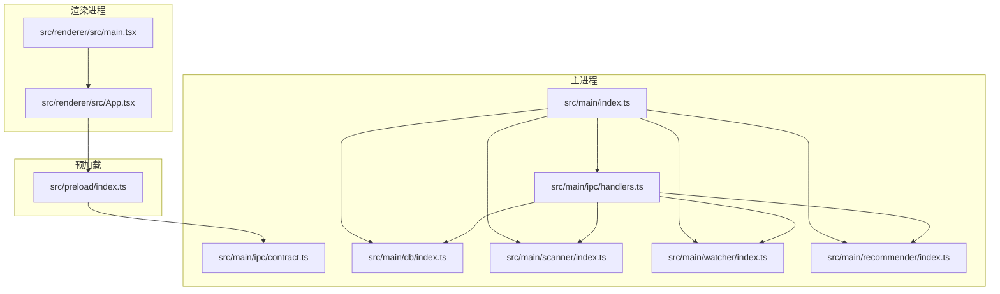
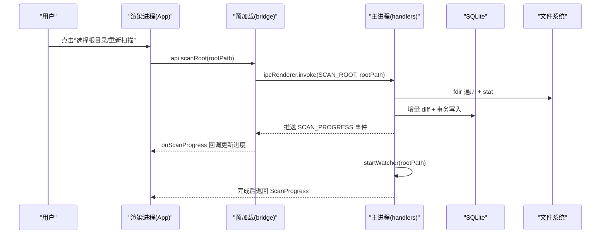
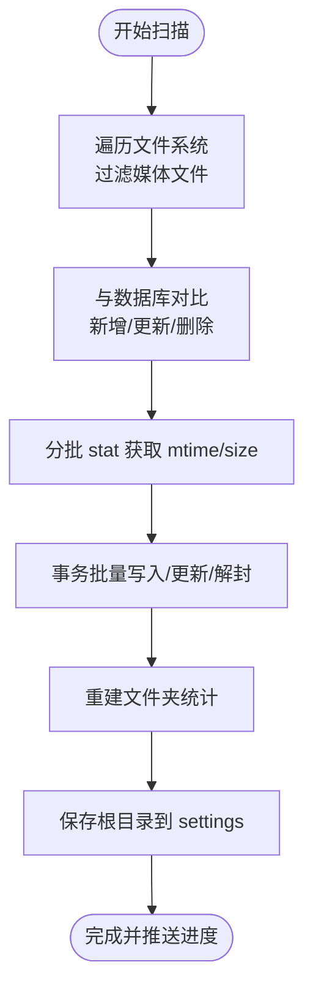
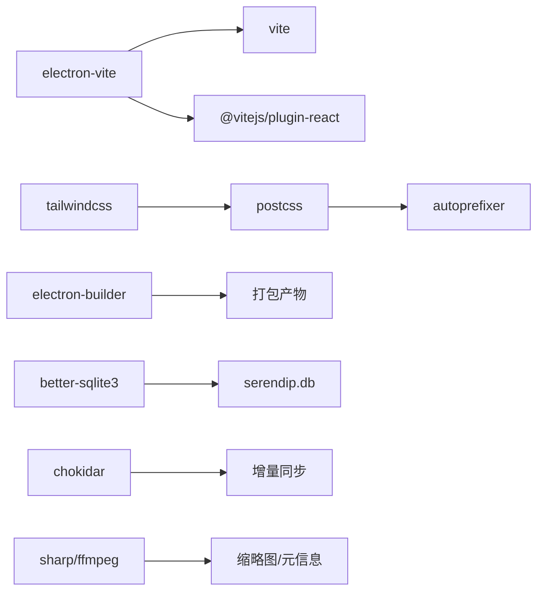

# 开发指南

<cite>
**本文引用的文件**   
- [README.md](file://README.md)
- [package.json](file://package.json)
- [electron.vite.config.ts](file://electron.vite.config.ts)
- [tsconfig.json](file://tsconfig.json)
- [tsconfig.node.json](file://tsconfig.node.json)
- [tsconfig.web.json](file://tsconfig.web.json)
- [eslint.config.mjs](file://eslint.config.mjs)
- [.prettierrc.yaml](file://.prettierrc.yaml)
- [src/main/index.ts](file://src/main/index.ts)
- [src/preload/index.ts](file://src/preload/index.ts)
- [src/renderer/src/App.tsx](file://src/renderer/src/App.tsx)
- [src/renderer/src/main.tsx](file://src/renderer/src/main.tsx)
- [src/main/ipc/contract.ts](file://src/main/ipc/contract.ts)
- [src/main/ipc/handlers.ts](file://src/main/ipc/handlers.ts)
- [src/main/db/index.ts](file://src/main/db/index.ts)
- [src/main/scanner/index.ts](file://src/main/scanner/index.ts)
- [src/main/watcher/index.ts](file://src/main/watcher/index.ts)
- [src/main/recommender/index.ts](file://src/main/recommender/index.ts)
</cite>

## 目录
1. [简介](#简介)
2. [项目结构](#项目结构)
3. [核心组件](#核心组件)
4. [架构总览](#架构总览)
5. [详细组件分析](#详细组件分析)
6. [依赖关系分析](#依赖关系分析)
7. [性能与构建优化](#性能与构建优化)
8. [调试与工具链](#调试与工具链)
9. [测试策略与实践](#测试策略与实践)
10. [代码规范与提交规范](#代码规范与提交规范)
11. [分支管理与发布流程](#分支管理与发布流程)
12. [常见问题与故障排除](#常见问题与故障排除)
13. [结论](#结论)

## 简介
Serendip 是一款基于 Electron + React 的本地智能相册应用，提供“智能随机”浏览、分类收藏、画布排版等能力。本项目采用 electron-vite 作为构建与开发工具链，使用 Zustand 进行状态管理，better-sqlite3 作为本地数据库，sharp/fluent-ffmpeg 生成缩略图，chokidar 实现增量同步。

本指南面向新加入的开发者，覆盖环境搭建、代码规范、TypeScript 配置、构建与打包、开发工作流、调试技巧、测试实践、代码审查与贡献流程、以及常见问题排查。

## 项目结构
仓库采用分层组织：主进程（Electron）、预加载脚本（IPC 桥）、渲染进程（React）。根目录包含构建与工程化配置（ESLint、Prettier、Vite/electron-vite、Tailwind、PostCSS、TS 多项目引用）。

图表来源
- [src/main/index.ts:1-134](file://src/main/index.ts#L1-L134)
- [src/main/ipc/handlers.ts:1-292](file://src/main/ipc/handlers.ts#L1-L292)
- [src/main/ipc/contract.ts:1-130](file://src/main/ipc/contract.ts#L1-L130)
- [src/main/db/index.ts:1-190](file://src/main/db/index.ts#L1-L190)
- [src/main/scanner/index.ts:1-323](file://src/main/scanner/index.ts#L1-L323)
- [src/main/watcher/index.ts:1-117](file://src/main/watcher/index.ts#L1-L117)
- [src/main/recommender/index.ts:1-518](file://src/main/recommender/index.ts#L1-L518)
- [src/preload/index.ts:1-104](file://src/preload/index.ts#L1-L104)
- [src/renderer/src/main.tsx:1-12](file://src/renderer/src/main.tsx#L1-L12)
- [src/renderer/src/App.tsx:1-800](file://src/renderer/src/App.tsx#L1-L800)

章节来源
- [README.md:1-66](file://README.md#L1-L66)
- [package.json:1-70](file://package.json#L1-L70)

## 核心组件
- 主进程入口与窗口生命周期：负责注册协议、创建窗口、监听全屏/移动事件、启动时自动扫描与监听器。
- IPC 契约与处理器：集中定义通道名与 API 类型，并在主进程注册所有 handle 回调，桥接文件系统、数据库与推荐算法。
- 数据库层：WAL 模式、迁移系统、索引优化。
- 扫描器：fdir 遍历、增量 diff、事务批量写入、文件夹统计重建。
- 文件监听：chokidar 增量变更聚合、去重与批处理入库。
- 推荐引擎：两级加权抽样（文件夹级 + 文件级），支持 prefer/balanced/explore 三种模式与分层路径推荐。
- 预加载桥：将 SerendipAPI 暴露到渲染进程，封装 ipcRenderer.invoke/on。
- 渲染层：React + Tailwind + dnd-kit + masonic，Zustand 状态管理，自绘标题栏与 WCO 配色联动。

章节来源
- [src/main/index.ts:1-134](file://src/main/index.ts#L1-L134)
- [src/main/ipc/contract.ts:1-130](file://src/main/ipc/contract.ts#L1-L130)
- [src/main/ipc/handlers.ts:1-292](file://src/main/ipc/handlers.ts#L1-L292)
- [src/main/db/index.ts:1-190](file://src/main/db/index.ts#L1-L190)
- [src/main/scanner/index.ts:1-323](file://src/main/scanner/index.ts#L1-L323)
- [src/main/watcher/index.ts:1-117](file://src/main/watcher/index.ts#L1-L117)
- [src/main/recommender/index.ts:1-518](file://src/main/recommender/index.ts#L1-L518)
- [src/preload/index.ts:1-104](file://src/preload/index.ts#L1-L104)
- [src/renderer/src/App.tsx:1-800](file://src/renderer/src/App.tsx#L1-L800)

## 架构总览
整体为典型的 Electron 三进程模型：主进程协调资源与系统能力；预加载脚本通过 contextBridge 安全暴露 API；渲染进程专注 UI 与交互。数据持久化在 better-sqlite3，媒体扫描与监听在主进程完成，推荐算法在主进程计算后返回给渲染层展示。

图表来源
- [src/renderer/src/App.tsx:233-251](file://src/renderer/src/App.tsx#L233-L251)
- [src/preload/index.ts:10-16](file://src/preload/index.ts#L10-L16)
- [src/main/ipc/handlers.ts:52-60](file://src/main/ipc/handlers.ts#L52-L60)
- [src/main/scanner/index.ts:36-239](file://src/main/scanner/index.ts#L36-L239)
- [src/main/watcher/index.ts:16-37](file://src/main/watcher/index.ts#L16-L37)

## 详细组件分析

### 主进程入口与窗口管理
- 启动阶段：设置命令行开关修复 Windows 视频叠加闪烁问题；注册自定义协议；创建 BrowserWindow；监听全屏/移动事件；根据环境变量决定加载开发 URL 或静态资源。
- 初始化顺序：app.whenReady → 设置 AppUserModelId → 注册窗口快捷键 → 打开数据库 → 注册缩略图协议与 IPC 处理器 → 读取根目录并执行静默扫描 → 启动文件监听 → 创建主窗口。
- 退出清理：关闭监听器、关闭数据库、非 macOS 平台退出应用。

章节来源
- [src/main/index.ts:1-134](file://src/main/index.ts#L1-L134)

### IPC 契约与处理器
- 契约：集中定义 SerendipAPI 接口与 IPC 常量，供主/预加载/渲染共享类型。
- 处理器：按功能域分组（库管理、推荐与浏览、收藏分类、画布、窗口装饰），统一调用数据库与业务模块，必要时广播进度事件。
- 关键特性：
  - 批量操作使用事务提升性能（如批量喜欢/不感兴趣）。
  - 路径 LIKE 查询对反斜杠与通配符转义，避免 SQL 注入与匹配异常。
  - 标题栏覆盖（WCO）动态切换主题色，兼容不支持的平台静默失败。

章节来源
- [src/main/ipc/contract.ts:1-130](file://src/main/ipc/contract.ts#L1-L130)
- [src/main/ipc/handlers.ts:1-292](file://src/main/ipc/handlers.ts#L1-L292)

### 数据库层与迁移
- 连接与配置：WAL 模式、NORMAL 同步、外键开启，减少锁竞争并保证一致性。
- 迁移系统：_migrations 表记录版本，按序执行 up 脚本，新增 media_files/folders/categories/category_items/canvases/canvas_items/settings 等表及索引。
- 索引设计：针对 folder_path、type、liked/disliked、last_shown_at、unavailable、position 等高频查询字段建立索引，提升推荐与列表查询性能。

章节来源
- [src/main/db/index.ts:1-190](file://src/main/db/index.ts#L1-L190)

### 扫描器（增量同步）
- 流程：
  1) fdir 遍历过滤媒体文件，跳过缓存与隐藏目录。
  2) 与数据库现有记录做 diff（新增/更新/删除）。
  3) 分批 stat 获取 mtime/size，事务批量写入，更新 unavailable 标记。
  4) 重建 folders 统计（path/parent_path/depth/file_count/recursive_count/mtime）。
  5) 保存 rootPath 到 settings，推送进度事件。
- 性能要点：BATCH_SIZE=200，transaction 包裹，避免频繁 IO 与锁竞争。

图表来源
- [src/main/scanner/index.ts:36-239](file://src/main/scanner/index.ts#L36-L239)

章节来源
- [src/main/scanner/index.ts:1-323](file://src/main/scanner/index.ts#L1-L323)

### 文件监听（增量变更）
- 使用 chokidar 监听 add/change/unlink，忽略隐藏目录与缓存目录。
- 变更队列 + 定时器合并（500ms），批量 stat 后事务写入，缺失文件直接删除记录。
- 与扫描器互补：首次全量扫描，后续实时增量同步。

章节来源
- [src/main/watcher/index.ts:1-117](file://src/main/watcher/index.ts#L1-L117)

### 推荐引擎（智能随机 v1）
- 两级加权抽样：先选文件夹（抑制大文件夹虹吸效应），再在文件夹内选文件（考虑 liked、冷却、显示次数惩罚）。
- 模式参数：prefer（偏好放大）、balanced（均衡）、explore（探索优先）。
- 分层路径推荐：以当前文件夹为锚点，向上父链放宽采样，最多 50% 分配给当前层，并按权重分配数量。
- 结果更新：批次命中后更新 shown_count 与 last_shown_at，驱动后续冷却与降权。

章节来源
- [src/main/recommender/index.ts:1-518](file://src/main/recommender/index.ts#L1-L518)

### 预加载桥与渲染层集成
- 预加载：将 SerendipAPI 方法映射到 ipcRenderer.invoke/on，统一封装类型与事件订阅（如 onScanProgress）。
- 渲染层：App.tsx 组合侧栏、主视图、拖拽、弹窗、Toast、Tooltip 等；通过 window.api 调用后端能力；通过 window.electron.ipcRenderer 监听窗口事件（全屏变化、窗口移动）；与 Zustand store 协同更新 UI。

章节来源
- [src/preload/index.ts:1-104](file://src/preload/index.ts#L1-L104)
- [src/renderer/src/App.tsx:1-800](file://src/renderer/src/App.tsx#L1-L800)
- [src/renderer/src/main.tsx:1-12](file://src/renderer/src/main.tsx#L1-L12)

## 依赖关系分析
- 构建与开发：electron-vite、vite、@vitejs/plugin-react、tailwindcss、postcss、autoprefixer。
- 运行时：react/react-dom、zustand、@dnd-kit/*、masonic、lucide-react、better-sqlite3、sharp、fluent-ffmpeg、chokidar、fdir。
- 工程化：eslint、eslint-plugin-react(-hooks/-refresh)、@electron-toolkit/eslint-config-ts、@electron-toolkit/eslint-config-prettier、prettier、typescript。

图表来源
- [package.json:1-70](file://package.json#L1-L70)

章节来源
- [package.json:1-70](file://package.json#L1-L70)

## 性能与构建优化
- 数据库：启用 WAL 与 NORMAL 同步，合理索引减少全表扫描；批量更新使用事务。
- 扫描：fdir 高性能遍历；BATCH_SIZE 控制内存与 IO 压力；增量 diff 避免重复写入。
- 监听：变更合并与事务批处理，降低抖动影响。
- 渲染：masonic 虚拟化瀑布流；按需缩略图；独立滚动容器保留滚动位置。
- 构建：electron-vite 分离 main/preload/renderer 构建；生产构建前执行 typecheck 确保类型安全。

章节来源
- [src/main/db/index.ts:1-190](file://src/main/db/index.ts#L1-L190)
- [src/main/scanner/index.ts:124-168](file://src/main/scanner/index.ts#L124-L168)
- [src/main/watcher/index.ts:52-116](file://src/main/watcher/index.ts#L52-L116)
- [electron.vite.config.ts:1-17](file://electron.vite.config.ts#L1-L17)
- [package.json:17-21](file://package.json#L17-L21)

## 调试与工具链
- 开发服务器：npm run dev 启动 electron-vite dev，支持热重载与类型检查。
- 类型检查：npm run typecheck 同时检查 node/web 两个 TS 项目。
- 代码格式化：npm run format 使用 Prettier 统一风格。
- 构建与打包：
  - npm run build 构建产物。
  - npm run build:win / build:mac / build:linux 使用 electron-builder 打包对应平台。
- 调试建议：
  - 主进程：Node.js 调试器附加 out/main 输出目录。
  - 渲染进程：启用 Electron DevTools（默认快捷键 Ctrl/Cmd+Shift+I），结合 React DevTools 定位组件状态。
  - 性能分析：使用浏览器 Performance 面板录制渲染帧，关注长任务与布局抖动；数据库层面可观察 WAL 日志与慢查询。

章节来源
- [package.json:9-21](file://package.json#L9-L21)
- [electron.vite.config.ts:1-17](file://electron.vite.config.ts#L1-L17)

## 测试策略与实践
- 单元测试：建议对纯函数与算法（如推荐权重计算、冷却函数、Fisher-Yates 洗牌）编写单测，验证边界条件与数值稳定性。
- 集成测试：对 IPC 处理器与数据库交互进行集成测试，模拟不同场景（新增/更新/删除、批量操作、LIKE 转义）。
- 端到端测试：使用 Playwright/Electron 测试框架覆盖关键用户流程（选择根目录→扫描→浏览→分类/画布操作）。
- 运行方式：可在 package.json scripts 中扩展 test 命令，结合 CI 自动化执行。

[本节为通用指导，不直接分析具体文件]

## 代码规范与提交规范
- ESLint：
  - 使用 @electron-toolkit/eslint-config-ts 与 react/react-hooks/react-refresh 插件。
  - 忽略 node_modules/dist/out 目录。
  - 规则继承 recommended 与 vite 刷新相关规则。
- Prettier：
  - 单引号、无分号、行宽 100、尾逗号 none。
- TypeScript：
  - 双项目引用（node/web），分别配置 include/types/jsx/baseURL/paths。
  - 使用 composite 加速增量编译。
- 编辑器集成：
  - 建议在 VS Code 中启用 ESLint/Prettier 保存自动格式化与错误提示。

章节来源
- [eslint.config.mjs:1-33](file://eslint.config.mjs#L1-L33)
- [.prettierrc.yaml:1-5](file://.prettierrc.yaml#L1-L5)
- [tsconfig.json:1-5](file://tsconfig.json#L1-L5)
- [tsconfig.node.json:1-9](file://tsconfig.node.json#L1-L9)
- [tsconfig.web.json:1-20](file://tsconfig.web.json#L1-L20)

## 分支管理与发布流程
- 分支策略（建议）：
  - main：稳定分支，仅接受经过评审与测试的合并。
  - develop：日常开发集成分支。
  - feature/*：新功能分支，完成后 PR 至 develop。
  - hotfix/*：紧急修复，PR 至 main 并回推到 develop。
- 提交规范（建议）：
  - 使用约定式提交（feat/fix/docs/style/refactor/test/chore 等），便于自动生成变更日志。
- 发布流程：
  - 版本号遵循语义化版本（主.次.修订）。
  - 打 tag 后触发构建与打包，产出安装包与分发制品。
  - 发布说明包含重要变更、已知问题与升级注意事项。

[本节为通用指导，不直接分析具体文件]

## 常见问题与故障排除
- Windows 视频 hover 播放导致全屏色彩闪烁：
  - 已在主进程禁用 DirectCompositionVideoOverlays 与 UseMultiPlaneOverlayForVideo，若个别驱动仍异常，可放开 disable-direct-composition 开关（可能影响合成性能）。
- 缩略图生成失败或文件被误删：
  - 扫描器会尝试解封 unavailable 标记；也可手动调用 markUnavailable 标记失效原因，或在文件管理器中 reveal 后自动修复。
- 路径 LIKE 匹配异常：
  - 已对反斜杠与通配符进行转义，确保 Windows 路径正确匹配。
- 标题栏按钮不可见或高亮不明显：
  - 检查 setTitleBarOverlay 传入的 theme/color/symbolColor；详情页使用透明背景，主页使用近似玻璃态颜色以提升 hover 可见性。
- 增量同步未生效：
  - 确认 watcher 已启动且未被 stopWatcher 关闭；检查 ignored 规则是否误过滤目标目录。

章节来源
- [src/main/index.ts:17-23](file://src/main/index.ts#L17-L23)
- [src/main/ipc/handlers.ts:149-171](file://src/main/ipc/handlers.ts#L149-L171)
- [src/main/scanner/index.ts:117-122](file://src/main/scanner/index.ts#L117-L122)
- [src/main/watcher/index.ts:16-37](file://src/main/watcher/index.ts#L16-L37)
- [src/main/ipc/handlers.ts:259-283](file://src/main/ipc/handlers.ts#L259-L283)

## 结论
本指南从工程化、架构、核心模块、调试与测试、规范与流程等方面全面梳理了 Serendip 的开发要点。建议新成员首先完成环境搭建与基础命令体验，随后阅读主进程与 IPC 契约理解数据流向，再逐步深入扫描器、监听器与推荐算法的实现细节。配合 ESLint/Prettier 与类型检查，保持代码质量与可维护性，并通过合理的分支与发布流程保障交付稳定性。