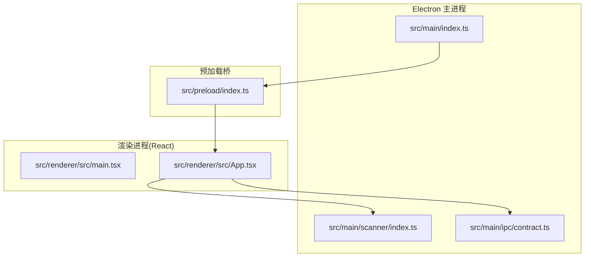
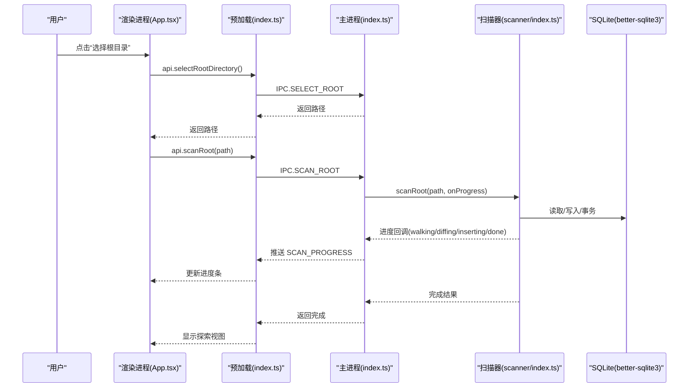
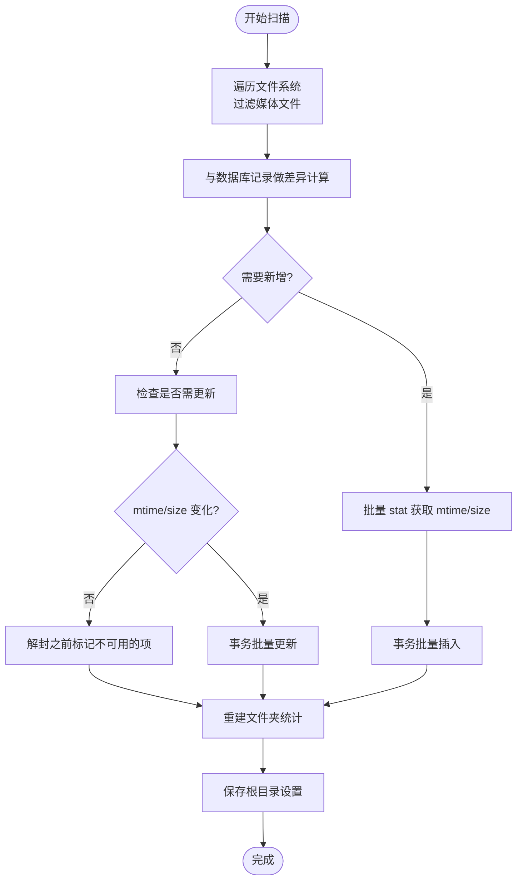
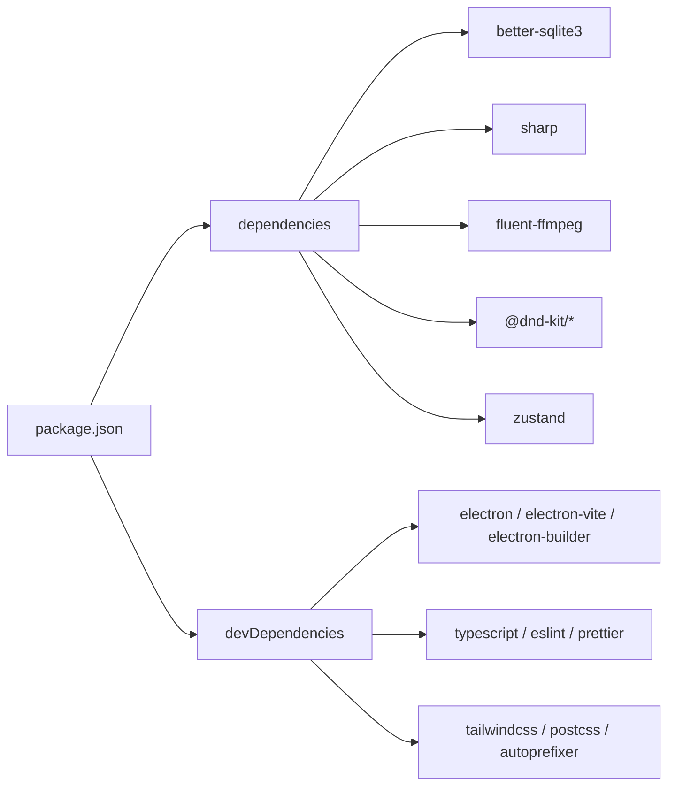

# 快速开始

<cite>
**本文引用的文件**   
- [package.json](file://package.json)
- [README.md](file://README.md)
- [.npmrc](file://.npmrc)
- [electron.vite.config.ts](file://electron.vite.config.ts)
- [tsconfig.json](file://tsconfig.json)
- [tsconfig.node.json](file://tsconfig.node.json)
- [tsconfig.web.json](file://tsconfig.web.json)
- [src/main/index.ts](file://src/main/index.ts)
- [src/preload/index.ts](file://src/preload/index.ts)
- [src/renderer/src/main.tsx](file://src/renderer/src/main.tsx)
- [src/renderer/src/App.tsx](file://src/renderer/src/App.tsx)
- [src/main/ipc/contract.ts](file://src/main/ipc/contract.ts)
- [src/main/scanner/index.ts](file://src/main/scanner/index.ts)
- [electron-builder.yml](file://electron-builder.yml)
</cite>

## 目录
1. [简介](#简介)
2. [项目结构](#项目结构)
3. [核心组件](#核心组件)
4. [架构总览](#架构总览)
5. [详细组件分析](#详细组件分析)
6. [依赖分析](#依赖分析)
7. [性能考虑](#性能考虑)
8. [故障排除指南](#故障排除指南)
9. [结论](#结论)
10. [附录](#附录)

## 简介
Serendip 是一款智能随机本地相册应用，基于 Electron + React + TypeScript 构建，提供无限瀑布流浏览、智能推荐、收藏分类与画布编排等能力。本快速开始指南帮助你在最短时间内完成环境搭建、依赖安装、开发启动与首次运行体验，并覆盖常用命令与跨平台构建说明。

## 项目结构
仓库采用 Electron 多进程架构：主进程负责文件系统扫描、数据库与 IPC；预加载脚本暴露安全 API；渲染层使用 React + Zustand 管理状态。



图示来源
- [src/main/index.ts:1-134](file://src/main/index.ts#L1-L134)
- [src/preload/index.ts:1-104](file://src/preload/index.ts#L1-L104)
- [src/renderer/src/main.tsx:1-12](file://src/renderer/src/main.tsx#L1-L12)
- [src/renderer/src/App.tsx:1-800](file://src/renderer/src/App.tsx#L1-L800)
- [src/main/ipc/contract.ts:1-130](file://src/main/ipc/contract.ts#L1-L130)
- [src/main/scanner/index.ts:1-323](file://src/main/scanner/index.ts#L1-L323)

章节来源
- [README.md:36-52](file://README.md#L36-L52)
- [electron.vite.config.ts:1-17](file://electron.vite.config.ts#L1-L17)
- [tsconfig.json:1-5](file://tsconfig.json#L1-L5)
- [tsconfig.node.json:1-9](file://tsconfig.node.json#L1-L9)
- [tsconfig.web.json:1-20](file://tsconfig.web.json#L1-L20)

## 核心组件
- 主进程入口：注册协议、创建窗口、初始化数据库、注册缩略图协议与 IPC 处理器、启动时增量同步与监听器。
- 预加载桥：将主进程能力以类型安全的 API 暴露给渲染进程，封装 IPC 调用与事件订阅。
- 渲染入口：挂载 React 根节点与应用组件。
- 应用外壳：侧栏导航、顶栏（自绘标题栏）、视图切换、拖拽与交互逻辑。
- 扫描器：高性能递归遍历媒体文件，增量 diff 后批量写入 SQLite，重建文件夹统计。
- IPC 契约：定义主/渲染共享的接口与通道名，保证前后端一致。

章节来源
- [src/main/index.ts:1-134](file://src/main/index.ts#L1-L134)
- [src/preload/index.ts:1-104](file://src/preload/index.ts#L1-L104)
- [src/renderer/src/main.tsx:1-12](file://src/renderer/src/main.tsx#L1-L12)
- [src/renderer/src/App.tsx:1-800](file://src/renderer/src/App.tsx#L1-L800)
- [src/main/scanner/index.ts:1-323](file://src/main/scanner/index.ts#L1-L323)
- [src/main/ipc/contract.ts:1-130](file://src/main/ipc/contract.ts#L1-L130)

## 架构总览
下图展示了从“选择根目录”到“开始浏览”的完整流程，包括主进程扫描、进度推送与渲染层展示。



图示来源
- [src/renderer/src/App.tsx:233-247](file://src/renderer/src/App.tsx#L233-L247)
- [src/preload/index.ts:9-16](file://src/preload/index.ts#L9-L16)
- [src/main/index.ts:104-118](file://src/main/index.ts#L104-L118)
- [src/main/scanner/index.ts:36-239](file://src/main/scanner/index.ts#L36-L239)
- [src/main/ipc/contract.ts:85-90](file://src/main/ipc/contract.ts#L85-L90)

## 详细组件分析

### 环境与依赖
- Node.js 版本要求
  - 本项目未显式声明引擎版本约束，建议安装当前长期支持版本（LTS），以确保原生模块（sharp、better-sqlite3、electron）顺利编译与运行。
- 系统兼容性
  - Windows：支持 WCO 自绘标题栏与桌面快捷方式，打包产物为 NSIS 安装包。
  - macOS：支持权限描述配置与 DMG 打包。
  - Linux：支持 AppImage、snap、deb 目标。
- 国内镜像源
  - 已配置 npm 与 Electron/sharp/better-sqlite3 等二进制下载镜像，加速依赖安装与构建。

章节来源
- [package.json:1-70](file://package.json#L1-L70)
- [.npmrc:1-17](file://.npmrc#L1-L17)
- [electron-builder.yml:1-45](file://electron-builder.yml#L1-L45)

### 开发环境启动流程
- 安装依赖（已配置国内镜像）
  - 执行：npm install
- 启动开发服务器
  - 执行：npm run dev
- 预览生产构建
  - 执行：npm run start
- 类型检查
  - 执行：npm run typecheck
- 代码格式化
  - 执行：npm run format

章节来源
- [package.json:9-22](file://package.json#L9-L22)
- [README.md:17-34](file://README.md#L17-L34)

### 首次运行应用的完整流程
- 步骤一：选择根目录
  - 在顶部工具栏点击“选择根目录”，通过系统对话框选择一个包含图片/视频的根文件夹。
- 步骤二：扫描文件
  - 自动触发增量扫描：遍历媒体文件、与数据库对比差异、批量写入、重建文件夹统计。
  - 界面实时显示扫描阶段与进度（walking → diffing → inserting → done）。
- 步骤三：开始浏览
  - 扫描完成后进入“探索”视图，即可开始浏览与操作。

章节来源
- [src/renderer/src/App.tsx:233-247](file://src/renderer/src/App.tsx#L233-L247)
- [src/main/scanner/index.ts:36-239](file://src/main/scanner/index.ts#L36-L239)

### 常用命令行操作
- 开发
  - 启动开发服务器：npm run dev
  - 预览构建产物：npm run start
- 质量保障
  - 类型检查：npm run typecheck
  - 代码格式化：npm run format
- 构建与打包
  - 通用构建：npm run build
  - 仅打包不签名（Windows）：npm run build:win
  - 仅打包不签名（macOS）：npm run build:mac
  - 仅打包不签名（Linux）：npm run build:linux
  - 生成可调试目录（unpack）：npm run build:unpack

章节来源
- [package.json:9-22](file://package.json#L9-L22)

### 跨平台构建说明
- Windows
  - 产物：NSIS 安装包，默认创建桌面快捷方式。
  - 图标与可执行名由配置文件指定。
- macOS
  - 产物：DMG，支持相机/麦克风/文档/下载权限描述。
- Linux
  - 产物：AppImage、snap、deb。

章节来源
- [electron-builder.yml:14-41](file://electron-builder.yml#L14-L41)

### 关键数据流与处理逻辑

#### 扫描与增量同步流程图


图示来源
- [src/main/scanner/index.ts:36-239](file://src/main/scanner/index.ts#L36-L239)
- [src/main/scanner/index.ts:274-317](file://src/main/scanner/index.ts#L274-L317)

#### 主进程与渲染进程交互类图
```mermaid
classDiagram
class SerendipAPI {
+selectRootDirectory() Promise~string|null~
+scanRoot(rootPath) Promise~ScanProgress~
+getCurrentRoot() Promise~string|null~
+getStats() Promise~{totalFiles,totalFolders,liked}~
+getRecommendations(count,mode,onlyUnrated?,scopePath?) Promise~MediaItem[]~
+setLiked(fileId,liked) Promise~void~
+setDisliked(fileId,disliked) Promise~void~
+listCategories() Promise~Category[]~
+createCategory(name) Promise~number~
+renameCategory(id,newName) Promise~void~
+deleteCategory(id) Promise~void~
+reorderCategories(orderedIds) Promise~void~
+getCategoryItems(categoryId) Promise~MediaItem[]~
+addItemsToCategory(categoryId,fileIds) Promise~number~
+removeItemFromCategory(categoryId,fileId) Promise~void~
+removeItemsFromCategory(categoryId,fileIds) Promise~void~
+getFileCategoryIds(fileId) Promise~number[]~
+listCanvases() Promise~Canvas[]~
+createCanvas(name) Promise~number~
+renameCanvas(id,newName) Promise~void~
+deleteCanvas(id) Promise~void~
+reorderCanvases(orderedIds) Promise~void~
+getCanvasItems(canvasId) Promise~CanvasItem[]~
+getMediaDimensions(fileIds) Promise~Array~
+addItemsToCanvas(canvasId,items) Promise~number[]~
+addItemsToCanvasRaw(canvasId,items) Promise~number[]~
+removeItemsFromCanvas(canvasId,itemIds) Promise~void~
+updateCanvasItem(itemId,patch) Promise~void~
+updateCanvasItems(patches) Promise~void~
+updateCanvasViewport(canvasId,x,y,scale) Promise~void~
+getFileCanvasIds(fileId) Promise~number[]~
+onScanProgress(callback) () => void
+setTitleBarOverlay(opts) Promise~void~
}
class PreloadIndex {
+api : SerendipAPI
}
class RendererApp {
+handleSelectRoot()
+handleRescan()
}
RendererApp --> PreloadIndex : "调用 window.api"
PreloadIndex --> SerendipAPI : "IPC 转发"
```

图示来源
- [src/main/ipc/contract.ts:12-82](file://src/main/ipc/contract.ts#L12-L82)
- [src/preload/index.ts:9-89](file://src/preload/index.ts#L9-L89)
- [src/renderer/src/App.tsx:233-251](file://src/renderer/src/App.tsx#L233-L251)

## 依赖分析
- 运行时依赖
  - 数据库：better-sqlite3
  - 缩略图：sharp（图片）、fluent-ffmpeg（视频）
  - 文件监听：chokidar
  - 拖拽：@dnd-kit/core、@dnd-kit/sortable
  - 状态管理：zustand
  - 其他：react、react-dom、lucide-react、masonic 等
- 开发依赖
  - electron、electron-vite、electron-builder
  - typescript、eslint、prettier、tailwindcss、postcss、autoprefixer
  - @vitejs/plugin-react



图示来源
- [package.json:23-68](file://package.json#L23-L68)

章节来源
- [package.json:23-68](file://package.json#L23-L68)

## 性能考虑
- 扫描性能
  - 使用 fdir 进行高性能目录遍历，跳过缓存与隐藏目录。
  - 增量 diff 策略减少不必要的写入。
  - 批量事务写入提升数据库吞吐。
- 渲染性能
  - 使用虚拟化列表（masonic）优化大数据量瀑布流。
  - 按需缩略图与懒加载降低内存占用。
- 构建与打包
  - 使用 electron-builder 的 asarUnpack 与 npmRebuild=false 减少打包体积与时间。

章节来源
- [src/main/scanner/index.ts:245-268](file://src/main/scanner/index.ts#L245-L268)
- [src/main/scanner/index.ts:124-132](file://src/main/scanner/index.ts#L124-L132)
- [electron-builder.yml:12-13](file://electron-builder.yml#L12-L13)
- [electron-builder.yml:41](file://electron-builder.yml#L41)

## 故障排除指南
- 依赖安装缓慢或失败
  - 确认 .npmrc 中的镜像源可用；必要时清理缓存后重试。
  - 若原生模块编译失败，检查 Node.js 版本与系统工具链（Python、C++ 编译器）是否满足要求。
- 扫描无进展或报错
  - 检查所选根目录是否存在且可读。
  - 查看控制台日志中扫描阶段与错误信息，确认是否有权限问题。
- 缩略图不显示
  - sharp 或 ffmpeg 相关二进制可能未正确下载；尝试重新安装依赖或更换网络环境。
- 打包失败
  - Windows/macOS/Linux 分别需要对应平台工具链；确保在对应系统上执行构建命令。
  - 若出现权限或签名问题，检查 electron-builder.yml 中的权限描述与证书配置。

章节来源
- [.npmrc:1-17](file://.npmrc#L1-L17)
- [src/main/scanner/index.ts:36-239](file://src/main/scanner/index.ts#L36-L239)
- [electron-builder.yml:22-41](file://electron-builder.yml#L22-L41)

## 结论
通过以上步骤，你可以在本地快速搭建 Serendip 的开发与运行环境，完成首次扫描并开始浏览。结合常用命令与跨平台构建说明，你可以高效迭代功能并发布到不同平台。

## 附录
- 项目配置要点
  - Vite/Electron 配置：别名与插件在 electron.vite.config.ts 中定义。
  - TypeScript 多项目引用：tsconfig.json 引用 node/web 两个子配置，分别用于主进程与渲染进程。
- 入口文件关系
  - 主进程入口：src/main/index.ts
  - 预加载桥：src/preload/index.ts
  - 渲染入口：src/renderer/src/main.tsx
  - 应用外壳：src/renderer/src/App.tsx

章节来源
- [electron.vite.config.ts:1-17](file://electron.vite.config.ts#L1-L17)
- [tsconfig.json:1-5](file://tsconfig.json#L1-L5)
- [tsconfig.node.json:1-9](file://tsconfig.node.json#L1-L9)
- [tsconfig.web.json:1-20](file://tsconfig.web.json#L1-L20)
- [src/main/index.ts:1-134](file://src/main/index.ts#L1-L134)
- [src/preload/index.ts:1-104](file://src/preload/index.ts#L1-L104)
- [src/renderer/src/main.tsx:1-12](file://src/renderer/src/main.tsx#L1-L12)
- [src/renderer/src/App.tsx:1-800](file://src/renderer/src/App.tsx#L1-L800)