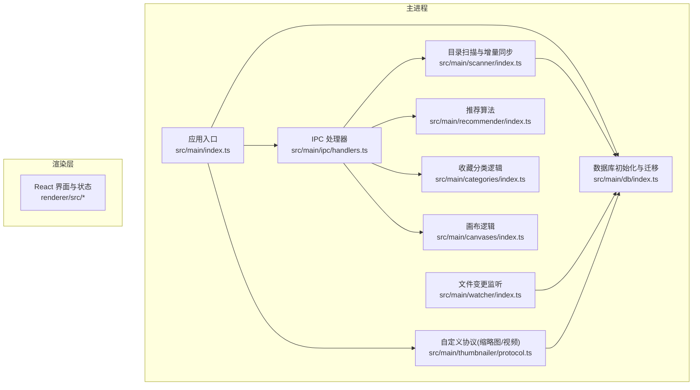
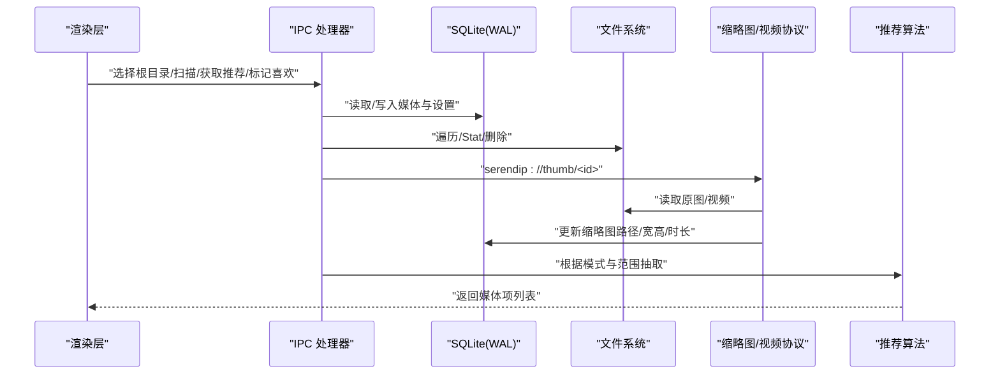
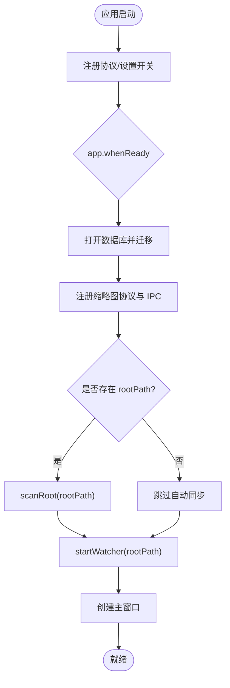
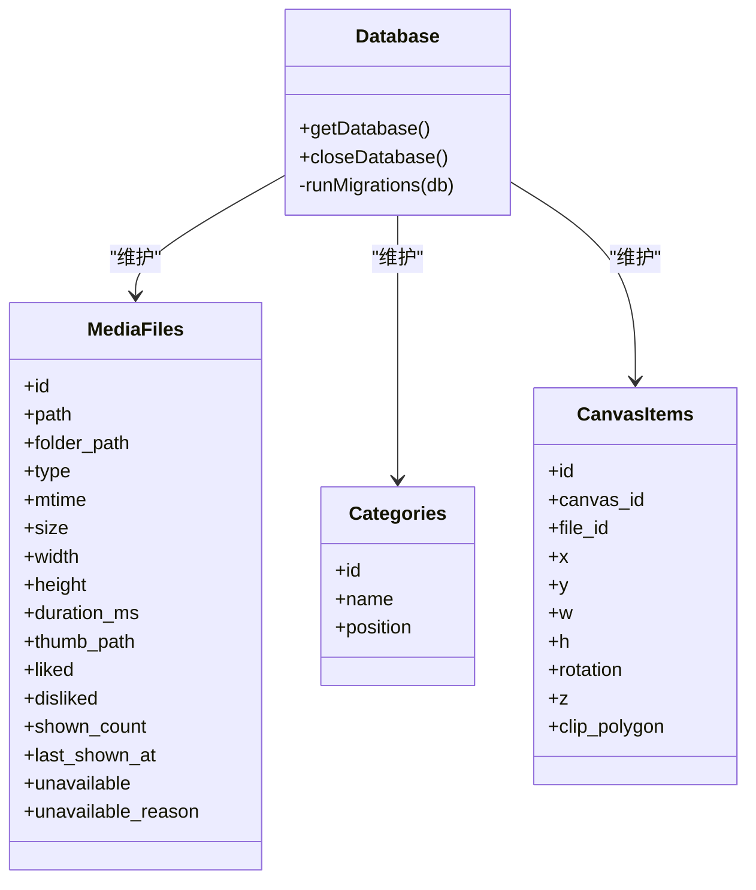
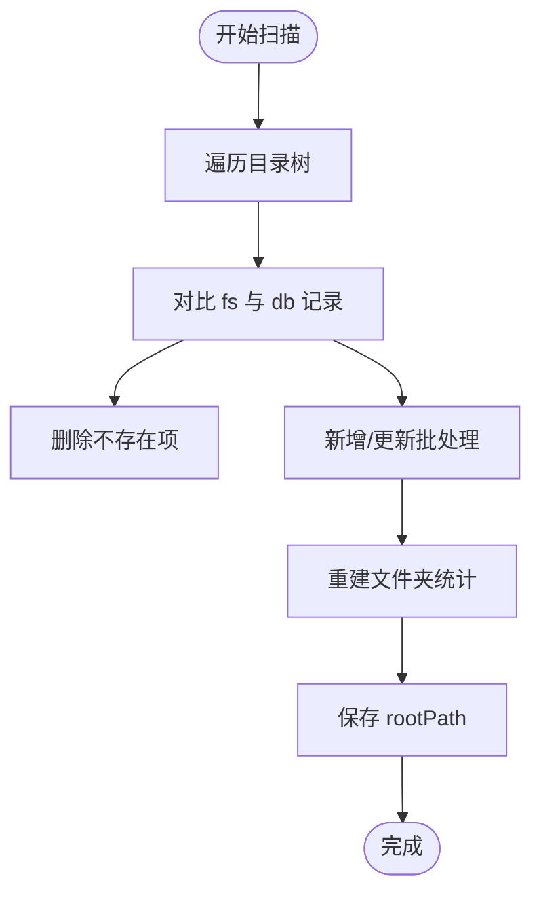
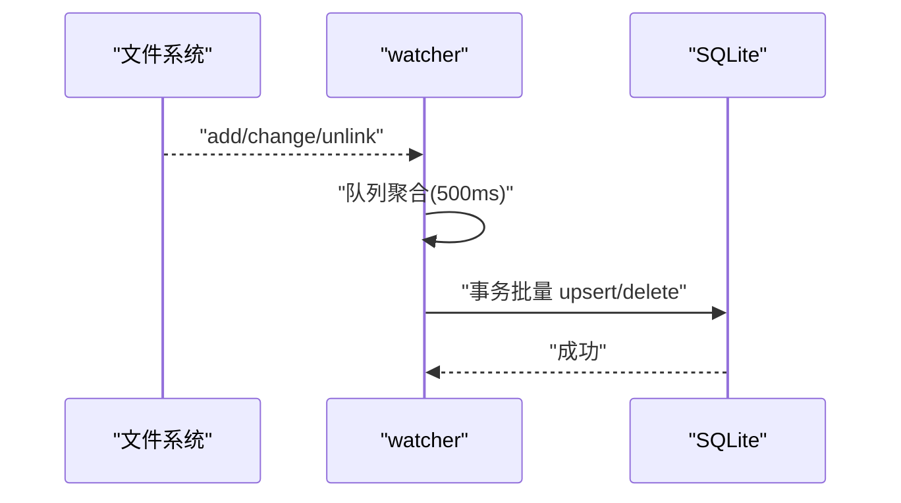
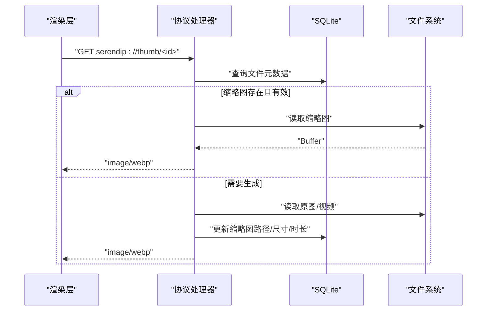
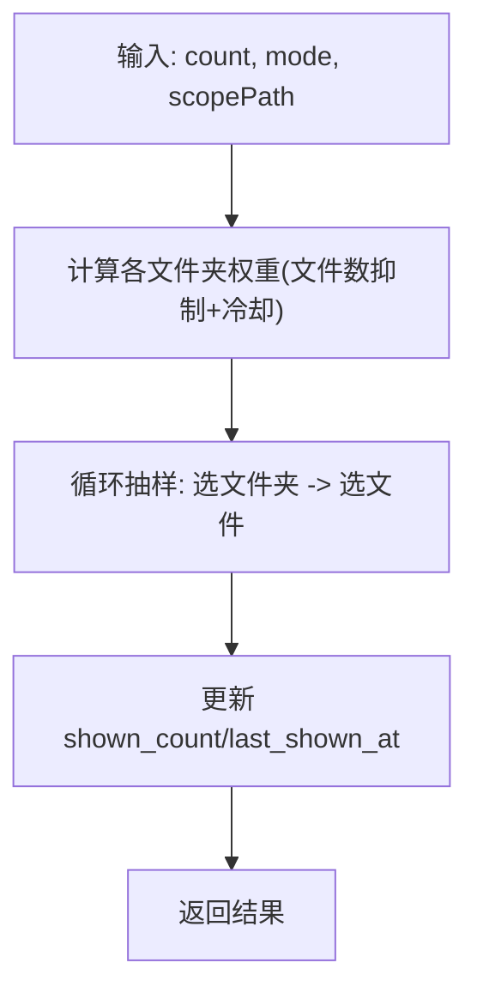

# 故障排除

<cite>
**本文引用的文件**   
- [README.md](file://README.md)
- [package.json](file://package.json)
- [src/main/index.ts](file://src/main/index.ts)
- [src/main/db/index.ts](file://src/main/db/index.ts)
- [src/main/ipc/handlers.ts](file://src/main/ipc/handlers.ts)
- [src/main/scanner/index.ts](file://src/main/scanner/index.ts)
- [src/main/watcher/index.ts](file://src/main/watcher/index.ts)
- [src/main/thumbnailer/protocol.ts](file://src/main/thumbnailer/protocol.ts)
- [src/main/recommender/index.ts](file://src/main/recommender/index.ts)
- [src/main/categories/index.ts](file://src/main/categories/index.ts)
- [src/main/canvases/index.ts](file://src/main/canvases/index.ts)
</cite>

## 目录
1. [简介](#简介)
2. [项目结构](#项目结构)
3. [核心组件](#核心组件)
4. [架构总览](#架构总览)
5. [详细组件分析](#详细组件分析)
6. [依赖分析](#依赖分析)
7. [性能考虑](#性能考虑)
8. [故障排除指南](#故障排除指南)
9. [结论](#结论)
10. [附录](#附录)

## 简介
本指南面向 Serendip 用户与开发者，提供从安装到运行、从性能调优到问题定位的完整自助排障手册。内容覆盖：
- 安装与环境问题（Node/Electron/平台差异）
- 运行时错误（数据库、扫描、缩略图、视频播放、IPC）
- 性能问题（CPU/内存/磁盘 I/O）
- 兼容性冲突（Windows 视频叠加、HEIC/HEIF 渲染）
- 日志分析与调试技巧
- 诊断信息收集与问题报告模板
- 社区支持与反馈流程

## 项目结构
Serendip 基于 Electron + electron-vite 构建，主进程负责文件系统扫描、数据库、缩略图协议、实时监听；渲染层使用 React + Zustand 管理 UI 状态。

图表来源
- [src/main/index.ts:1-134](file://src/main/index.ts#L1-L134)
- [src/main/db/index.ts:1-190](file://src/main/db/index.ts#L1-L190)
- [src/main/ipc/handlers.ts:1-292](file://src/main/ipc/handlers.ts#L1-L292)
- [src/main/scanner/index.ts:1-323](file://src/main/scanner/index.ts#L1-L323)
- [src/main/watcher/index.ts:1-117](file://src/main/watcher/index.ts#L1-L117)
- [src/main/thumbnailer/protocol.ts:1-298](file://src/main/thumbnailer/protocol.ts#L1-L298)
- [src/main/recommender/index.ts:1-518](file://src/main/recommender/index.ts#L1-L518)
- [src/main/categories/index.ts:1-166](file://src/main/categories/index.ts#L1-L166)
- [src/main/canvases/index.ts:1-320](file://src/main/canvases/index.ts#L1-L320)

章节来源
- [README.md:1-66](file://README.md#L1-L66)
- [package.json:1-70](file://package.json#L1-L70)

## 核心组件
- 应用启动与窗口管理：注册协议、创建窗口、处理全屏/移动事件、自动同步根目录并启动监听器。
- 数据库：WAL 模式、外键开启、迁移脚本（媒体库、文件夹统计、收藏分类、画布）。
- IPC 桥：选择根目录、扫描、推荐、喜欢/不感兴趣、分类与画布操作、标题栏覆盖设置等。
- 扫描器：fdir 遍历、增量 diff、批量事务写入、重建文件夹统计。
- 监听器：chokidar 监听增删改，聚合后批量落库。
- 缩略图与视频流：自定义 serendip:// 协议，按需生成缩略图，支持 Range 流式视频播放。
- 推荐算法：两级加权抽样（文件夹级+文件级），支持 prefer/balanced/explore 模式与分层推荐。
- 收藏分类与画布：CRUD、拖拽排序、多对多关联、视口持久化。

章节来源
- [src/main/index.ts:1-134](file://src/main/index.ts#L1-L134)
- [src/main/db/index.ts:1-190](file://src/main/db/index.ts#L1-L190)
- [src/main/ipc/handlers.ts:1-292](file://src/main/ipc/handlers.ts#L1-L292)
- [src/main/scanner/index.ts:1-323](file://src/main/scanner/index.ts#L1-L323)
- [src/main/watcher/index.ts:1-117](file://src/main/watcher/index.ts#L1-L117)
- [src/main/thumbnailer/protocol.ts:1-298](file://src/main/thumbnailer/protocol.ts#L1-L298)
- [src/main/recommender/index.ts:1-518](file://src/main/recommender/index.ts#L1-L518)
- [src/main/categories/index.ts:1-166](file://src/main/categories/index.ts#L1-L166)
- [src/main/canvases/index.ts:1-320](file://src/main/canvases/index.ts#L1-L320)

## 架构总览
下图展示关键请求链路：渲染层通过 IPC 调用主进程能力，主进程访问数据库、文件系统与外部工具（sharp/ffmpeg），并通过自定义协议向浏览器返回资源。

图表来源
- [src/main/ipc/handlers.ts:1-292](file://src/main/ipc/handlers.ts#L1-L292)
- [src/main/thumbnailer/protocol.ts:1-298](file://src/main/thumbnailer/protocol.ts#L1-L298)
- [src/main/recommender/index.ts:1-518](file://src/main/recommender/index.ts#L1-L518)
- [src/main/db/index.ts:1-190](file://src/main/db/index.ts#L1-L190)

## 详细组件分析

### 应用启动与初始化
- 启动时禁用可能导致 Windows 视频叠加闪烁的特性，避免全屏色彩异常。
- 注册自定义协议特权，确保缩略图与视频流可用。
- 若存在已配置的根目录，则静默执行一次增量同步，随后启动文件监听器。
- 窗口事件广播全屏变化与移动事件，供渲染层调整标题栏覆盖。

图表来源
- [src/main/index.ts:1-134](file://src/main/index.ts#L1-L134)
- [src/main/db/index.ts:1-190](file://src/main/db/index.ts#L1-L190)
- [src/main/scanner/index.ts:1-323](file://src/main/scanner/index.ts#L1-L323)
- [src/main/watcher/index.ts:1-117](file://src/main/watcher/index.ts#L1-L117)

章节来源
- [src/main/index.ts:1-134](file://src/main/index.ts#L1-L134)

### 数据库与迁移
- 启用 WAL 与外键约束，提升并发与一致性。
- 内置迁移：媒体文件表、文件夹统计表、收藏分类表、画布表及关联表。
- 关闭数据库在退出时释放句柄。

图表来源
- [src/main/db/index.ts:1-190](file://src/main/db/index.ts#L1-L190)

章节来源
- [src/main/db/index.ts:1-190](file://src/main/db/index.ts#L1-L190)

### 扫描与增量同步
- 使用 fdir 高性能遍历，过滤缓存与隐藏目录。
- 与数据库记录做 diff，计算新增/更新/删除集合。
- 分批 stat + 事务写入，减少 IO 与锁竞争。
- 完成后重建 folders 统计并保存 rootPath。

图表来源
- [src/main/scanner/index.ts:1-323](file://src/main/scanner/index.ts#L1-L323)

章节来源
- [src/main/scanner/index.ts:1-323](file://src/main/scanner/index.ts#L1-L323)

### 文件监听与实时同步
- chokidar 监听 add/change/unlink，忽略系统/缓存目录。
- 合并短时间内的变更，批量 stat 后事务落库。
- 删除时直接按 path 删除记录。

图表来源
- [src/main/watcher/index.ts:1-117](file://src/main/watcher/index.ts#L1-L117)

章节来源
- [src/main/watcher/index.ts:1-117](file://src/main/watcher/index.ts#L1-L117)

### 缩略图与视频流（自定义协议）
- 注册 serendip:// 协议，支持 thumb/image/video 三种子域。
- 缩略图按需生成并缓存，失败时标记 unavailable。
- 视频响应支持 Range，实现秒开与拖动播放。

图表来源
- [src/main/thumbnailer/protocol.ts:1-298](file://src/main/thumbnailer/protocol.ts#L1-L298)

章节来源
- [src/main/thumbnailer/protocol.ts:1-298](file://src/main/thumbnailer/protocol.ts#L1-L298)

### 推荐算法与分层推荐
- 两级加权：先选文件夹再选文件，考虑 liked/disliked、冷却时间、显示次数惩罚。
- 支持 prefer/balanced/explore 三种模式参数。
- 分层推荐：以当前文件夹为锚点，向上父链放宽采样，打乱顺序输出。

图表来源
- [src/main/recommender/index.ts:1-518](file://src/main/recommender/index.ts#L1-L518)

章节来源
- [src/main/recommender/index.ts:1-518](file://src/main/recommender/index.ts#L1-L518)

### 收藏分类与画布
- 分类：唯一名、位置排序、多对多关联、级联删除。
- 画布：视口持久化、项目变换属性、批量更新、维度回退策略。

章节来源
- [src/main/categories/index.ts:1-166](file://src/main/categories/index.ts#L1-L166)
- [src/main/canvases/index.ts:1-320](file://src/main/canvases/index.ts#L1-L320)

## 依赖分析
- 运行时依赖：better-sqlite3、sharp、fluent-ffmpeg、chokidar、masonic、@dnd-kit、zustand 等。
- 开发依赖：electron、electron-builder、electron-vite、Tailwind、TypeScript、Vite 等。
- 平台相关：Windows 视频叠加特性开关、Linux 图标配置、macOS 标题栏行为。

章节来源
- [package.json:1-70](file://package.json#L1-L70)
- [src/main/index.ts:1-134](file://src/main/index.ts#L1-L134)

## 性能考虑
- 数据库
  - 使用 WAL 模式与 NORMAL 同步级别，提高并发读写性能。
  - 大量写入采用事务批处理，降低磁盘 I/O 压力。
- 扫描与监听
  - fdir 异步遍历，批量 stat + 插入，避免频繁小事务。
  - 监听器聚合短时变更，减少重复 IO。
- 缩略图与视频
  - 按需生成与缓存，避免首屏全量生成。
  - 视频 Range 流式传输，减少首帧加载时间。
- 渲染
  - 瀑布流虚拟化（masonic）降低大列表渲染开销。
  - 图片/视频懒加载与可见性触发。

[本节为通用性能建议，无需特定源码引用]

## 故障排除指南

### 一、安装与环境问题
- Node.js 版本不兼容
  - 现象：npm install 报错或构建失败。
  - 排查：确认 Node 版本满足依赖要求；清理 node_modules 与 lock 后重试。
  - 参考：包管理与脚本定义。
- Electron 原生模块编译失败
  - 现象：安装 sharp/better-sqlite3 时报错。
  - 排查：检查是否具备编译工具链；必要时使用预编译二进制或更换镜像源。
- 国内网络/镜像问题
  - 现象：下载依赖缓慢或失败。
  - 排查：配置 npm 镜像或使用代理；参考 README 中的脚本说明。

章节来源
- [README.md:17-34](file://README.md#L17-L34)
- [package.json:9-22](file://package.json#L9-L22)

### 二、启动与初始化问题
- 无法打开数据库或迁移失败
  - 现象：启动即崩溃或提示 SQLite 错误。
  - 排查：检查 userData 目录权限；查看控制台错误；确认迁移脚本未中断。
  - 定位：数据库初始化与迁移逻辑。
- 自动同步未执行
  - 现象：启动后无媒体入库。
  - 排查：确认 settings.rootPath 是否存在；查看启动日志中“Auto-syncing root”与“Sync complete/fail”。
  - 定位：应用入口的启动流程。

章节来源
- [src/main/db/index.ts:1-190](file://src/main/db/index.ts#L1-L190)
- [src/main/index.ts:93-125](file://src/main/index.ts#L93-L125)

### 三、扫描与监听问题
- 扫描进度卡住或极慢
  - 现象：长时间停留在 walking/diffing/inserting。
  - 排查：检查根目录大小与文件数量；观察 currentPath 定位卡顿文件；确认磁盘健康与权限。
  - 优化：增大批次大小（代码内已分片）、避免同时大量写盘。
- 文件未被识别或类型错误
  - 现象：部分图片/视频未入库。
  - 排查：确认扩展名与媒体类型映射；检查被忽略的目录（缓存/隐藏/系统目录）。
- 监听无效或频繁抖动
  - 现象：文件变更后未更新或反复触发。
  - 排查：检查 ignored 规则；确认 awaitWriteFinish 稳定阈值；查看 watcher 错误日志。

章节来源
- [src/main/scanner/index.ts:1-323](file://src/main/scanner/index.ts#L1-L323)
- [src/main/watcher/index.ts:1-117](file://src/main/watcher/index.ts#L1-L117)

### 四、缩略图与视频播放问题
- 缩略图不显示或 404
  - 现象：thumb 请求返回 404。
  - 排查：检查文件是否存在；查看 ensureThumb 生成过程；确认缩略图缓存目录可写。
  - 兜底：协议层会将失败原因写入 unavailable_reason。
- HEIC/HEIF 图片无法渲染
  - 现象：Chromium 不支持直接渲染。
  - 排查：协议层会转码为高质量 JPEG 并缓存；确认 fullres 缓存目录存在。
- 视频无法播放或卡顿
  - 现象：首帧加载慢或拖动卡顿。
  - 排查：确认 Range 头是否正确解析；检查 Content-Length/Content-Range/Accept-Ranges；观察服务端流式响应。
- Windows 全屏颜色闪烁
  - 现象：视频 hover 播放时桌面短暂变暗/过饱和。
  - 排查：应用已禁用 DirectCompositionVideoOverlays 等特性；如仍出现，可尝试更激进的开关（注意合成性能影响）。

章节来源
- [src/main/thumbnailer/protocol.ts:1-298](file://src/main/thumbnailer/protocol.ts#L1-L298)
- [src/main/index.ts:12-24](file://src/main/index.ts#L12-L24)

### 五、推荐与浏览体验问题
- 推荐内容重复或不合理
  - 现象：频繁看到相同文件或文件夹。
  - 排查：检查 liked/disliked 与 last_shown_at 更新；确认模式参数（prefer/balanced/explore）是否符合预期。
- 详情页右侧面板推荐不符合预期
  - 现象：未按当前文件夹层级分布。
  - 排查：检查分层计划构建逻辑与父链权重分配。

章节来源
- [src/main/recommender/index.ts:1-518](file://src/main/recommender/index.ts#L1-L518)

### 六、收藏分类与画布问题
- 分类名冲突或重命名失败
  - 现象：抛出唯一约束错误。
  - 排查：检查名称长度与唯一性；确认分类存在。
- 画布项目尺寸异常
  - 现象：加入画布后宽高不正确。
  - 排查：若媒体宽高未知，将沿用输入值；否则按目标宽与原始比例计算。

章节来源
- [src/main/categories/index.ts:1-166](file://src/main/categories/index.ts#L1-L166)
- [src/main/canvases/index.ts:1-320](file://src/main/canvases/index.ts#L1-L320)

### 七、IPC 与跨进程通信问题
- 渲染层调用 IPC 无响应
  - 现象：Promise 挂起或回调未触发。
  - 排查：确认 handler 已注册；检查参数类型与必填字段；查看主进程控制台错误。
- 标题栏覆盖（WCO）样式异常
  - 现象：按钮区颜色或可见性与主题不一致。
  - 排查：确认 theme/color/symbolColor 传入；macOS 不支持 WCO 会静默忽略。

章节来源
- [src/main/ipc/handlers.ts:1-292](file://src/main/ipc/handlers.ts#L1-L292)

### 八、日志分析与调试技巧
- 关键日志关键字
  - 启动阶段："[Startup] Auto-syncing root:"、"[Startup] Sync complete, starting file watcher"、"[Startup] Sync failed:"
  - 监听阶段："[Watcher] Error:"、"[Watcher] Processed: +X -Y"
  - 协议阶段："Failed to serve thumb for file ..."、"Failed to serve image/video for file ..."
- 定位方法
  - 在开发环境使用 electron-vite dev，捕获控制台输出。
  - 生产环境可通过打包后的控制台或系统日志收集。
  - 针对缩略图/视频，关注协议层的错误堆栈与 unavailable_reason。

章节来源
- [src/main/index.ts:104-118](file://src/main/index.ts#L104-L118)
- [src/main/watcher/index.ts:36](file://src/main/watcher/index.ts#L36)
- [src/main/watcher/index.ts:112-113](file://src/main/watcher/index.ts#L112-L113)
- [src/main/thumbnailer/protocol.ts:48-53](file://src/main/thumbnailer/protocol.ts#L48-L53)

### 九、诊断信息收集与问题报告模板
- 收集清单
  - 操作系统与版本（Windows/macOS/Linux）
  - Electron/Node 版本（可从 package.json 与运行时环境获取）
  - 根目录路径（脱敏）、媒体规模（文件/文件夹数量）
  - 数据库路径（userData/serendip.db）与最近修改时间
  - 缩略图与 fullres 缓存目录（根目录/.serendip-cache）
  - 控制台日志（包含上述关键字）
  - 复现步骤与期望行为
- 报告模板
  - 标题：[平台] 问题简述
  - 环境：操作系统、Electron/Node 版本、Serendip 版本
  - 复现步骤：1) ... 2) ... 3) ...
  - 期望行为：...
  - 实际行为：...
  - 日志片段：粘贴关键日志（含时间戳）
  - 附件：截图/录屏、数据库与缓存目录（可选，脱敏）

[本节为通用指导，无需特定源码引用]

### 十、平台特定问题与解决方案
- Windows
  - 视频叠加导致全屏闪烁：已禁用相关特性；若仍有问题，可评估更激进开关的影响。
  - 路径转义：LIKE 查询中对反斜杠与通配符进行转义，避免匹配异常。
- macOS
  - 标题栏覆盖不可用：setTitleBarOverlay 调用会被静默忽略，走默认信号灯。
- Linux
  - 窗口图标需显式设置；确保资源路径正确。

章节来源
- [src/main/index.ts:12-24](file://src/main/index.ts#L12-L24)
- [src/main/index.ts:49-60](file://src/main/index.ts#L49-L60)
- [src/main/ipc/handlers.ts:259-283](file://src/main/ipc/handlers.ts#L259-L283)
- [src/main/scanner/index.ts:60-63](file://src/main/scanner/index.ts#L60-L63)

### 十一、性能监控与瓶颈分析
- CPU
  - 扫描阶段：关注批量 stat 与事务写入耗时；适当调整批次大小。
  - 推荐算法：大数据集下加权计算可能成为热点，可考虑缓存中间结果。
- 内存
  - 监听器队列与 Map 结构：确保及时清空与限制大小，避免长期增长。
  - 视频流：确保 ReadableStream 取消时销毁 Node 流，防止 fd 泄漏。
- 磁盘 I/O
  - 数据库：WAL 模式配合事务批处理；避免频繁单条写入。
  - 缩略图：命中缓存优先；fullres 转码异步落盘，避免阻塞响应。

章节来源
- [src/main/watcher/index.ts:12-16](file://src/main/watcher/index.ts#L12-L16)
- [src/main/thumbnailer/protocol.ts:152-169](file://src/main/thumbnailer/protocol.ts#L152-L169)
- [src/main/db/index.ts:19-22](file://src/main/db/index.ts#L19-L22)

### 十二、错误堆栈跟踪与异常处理最佳实践
- 统一错误分类
  - 文件/IO 错误：路径不存在、权限不足、格式不支持。
  - 数据库错误：唯一约束、外键约束、迁移失败。
  - 协议错误：缩略图/视频服务失败，记录 unavailable_reason。
- 建议
  - 在 IPC 层捕获并包装错误，返回明确的状态码与消息。
  - 对关键路径（扫描、监听、协议）增加 try/catch 与日志。
  - 对不可恢复错误（如迁移失败）尽早中止并提示用户。

章节来源
- [src/main/thumbnailer/protocol.ts:223-232](file://src/main/thumbnailer/protocol.ts#L223-L232)
- [src/main/categories/index.ts:35-56](file://src/main/categories/index.ts#L35-L56)
- [src/main/canvases/index.ts:93-111](file://src/main/canvases/index.ts#L93-L111)

### 十三、社区支持与反馈流程
- 仓库主页与 Issue 提交
  - 使用 GitHub Issues 提交问题，附上诊断信息与复现步骤。
- 贡献与讨论
  - 遵循 README 中的开发与构建流程，便于本地复现与验证。

章节来源
- [README.md:1-16](file://README.md#L1-L16)
- [package.json:8](file://package.json#L8)

## 结论
通过理解应用架构与关键组件的职责边界，结合日志关键字与平台特性，可以快速定位并解决大多数安装、运行与性能问题。建议在问题报告中提供完整的诊断信息，以便高效复现与修复。

## 附录
- 常用命令
  - 安装依赖：npm install
  - 开发运行：npm run dev
  - 类型检查：npm run typecheck
  - 构建安装包：npm run build:win / npm run build:mac / npm run build:linux

章节来源
- [README.md:17-34](file://README.md#L17-L34)
- [package.json:9-22](file://package.json#L9-L22)