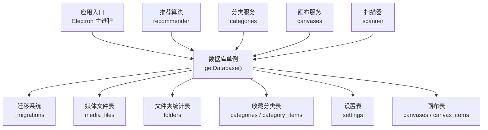
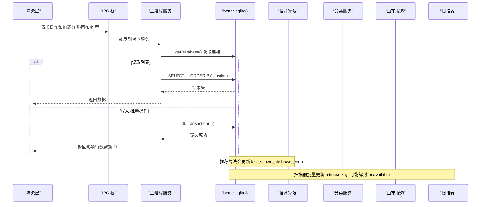
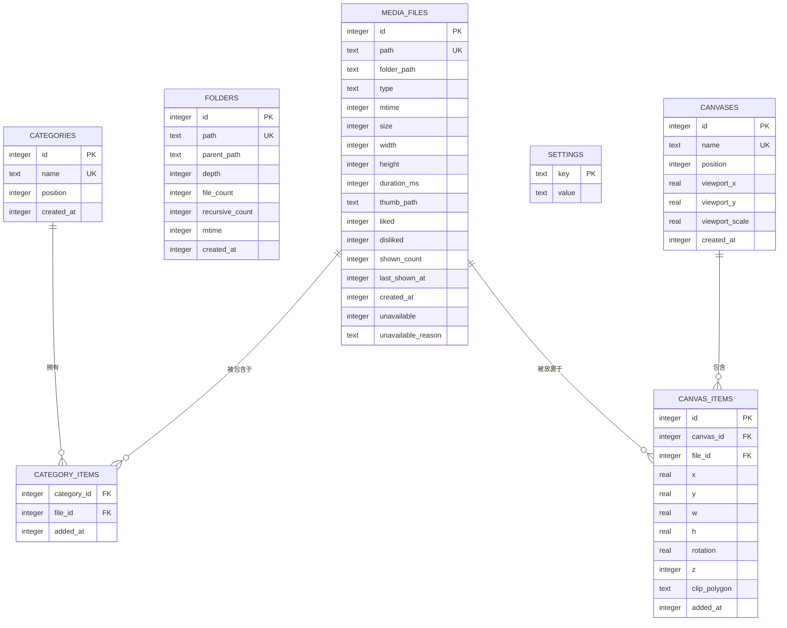
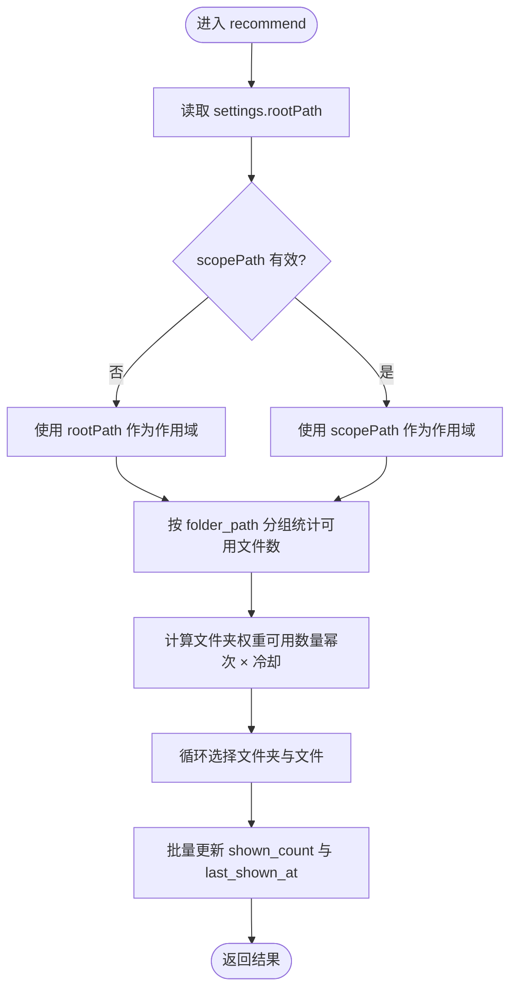
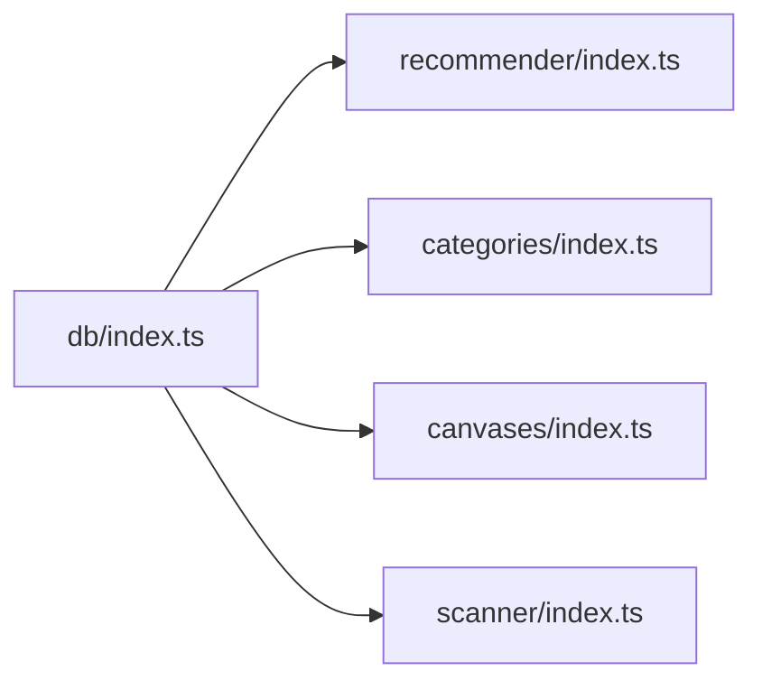

# 数据库设计

<cite>
**本文引用的文件**   
- [src/main/db/index.ts](file://src/main/db/index.ts)
- [src/main/recommender/index.ts](file://src/main/recommender/index.ts)
- [src/main/categories/index.ts](file://src/main/categories/index.ts)
- [src/main/canvases/index.ts](file://src/main/canvases/index.ts)
- [src/main/scanner/index.ts](file://src/main/scanner/index.ts)
- [README.md](file://README.md)
</cite>

## 目录
1. [简介](#简介)
2. [项目结构](#项目结构)
3. [核心组件](#核心组件)
4. [架构总览](#架构总览)
5. [详细组件分析](#详细组件分析)
6. [依赖关系分析](#依赖关系分析)
7. [性能考虑](#性能考虑)
8. [故障排查指南](#故障排查指南)
9. [结论](#结论)
10. [附录](#附录)

## 简介
本文件为 Serendip 应用的数据库设计文档，聚焦基于 better-sqlite3 的本地数据库架构。内容涵盖表结构与字段定义、数据类型与约束、实体关系模型（媒体文件、分类、画布、用户偏好等）、SQL Schema 与索引策略、数据迁移机制、备份恢复策略、性能优化方案、数据访问模式与查询优化技巧、事务处理机制、数据生命周期管理、清理策略与存储优化建议，以及数据库维护工具与监控指标，旨在为开发者提供深入的设计与运维指导。

## 项目结构
Serendip 使用 Electron + better-sqlite3 作为主进程持久化层，数据库位于用户数据目录下的单个 SQLite 文件。数据库初始化、WAL 配置与迁移逻辑集中在主进程数据库模块中；业务模块（推荐算法、分类、画布、扫描器）通过 getDatabase() 获取连接并执行 SQL。

图表来源
- [src/main/db/index.ts:8-28](file://src/main/db/index.ts#L8-L28)
- [src/main/recommender/index.ts:57-149](file://src/main/recommender/index.ts#L57-L149)
- [src/main/categories/index.ts:21-111](file://src/main/categories/index.ts#L21-L111)
- [src/main/canvases/index.ts:76-170](file://src/main/canvases/index.ts#L76-L170)
- [src/main/scanner/index.ts:171-214](file://src/main/scanner/index.ts#L171-L214)

章节来源
- [README.md:1-66](file://README.md#L1-L66)
- [src/main/db/index.ts:8-28](file://src/main/db/index.ts#L8-L28)

## 核心组件
- 数据库连接与配置：单例连接、WAL 模式、外键开启、同步级别设置。
- 迁移系统：按版本顺序执行 up 脚本，记录已应用版本。
- 核心表族：
  - media_files：媒体元数据与评分/曝光统计。
  - folders：文件夹级统计（用于智能随机算法）。
  - categories / category_items：收藏分类及其多对多关联。
  - settings：键值配置（如根路径 rootPath）。
  - canvases / canvas_items：画布及画布项（位置、尺寸、旋转、裁剪多边形等）。
- 业务模块：
  - 推荐算法：两级加权抽样，更新 last_shown_at 与 shown_count。
  - 分类服务：CRUD、排序、批量增删、级联删除。
  - 画布服务：CRUD、批量插入（支持原始变换保真）、批量更新、视口持久化。
  - 扫描器：增量扫描、批量更新 mtime/size、失效解封。

章节来源
- [src/main/db/index.ts:19-28](file://src/main/db/index.ts#L19-L28)
- [src/main/db/index.ts:37-189](file://src/main/db/index.ts#L37-L189)
- [src/main/recommender/index.ts:57-149](file://src/main/recommender/index.ts#L57-L149)
- [src/main/categories/index.ts:21-111](file://src/main/categories/index.ts#L21-L111)
- [src/main/canvases/index.ts:76-170](file://src/main/canvases/index.ts#L76-L170)
- [src/main/scanner/index.ts:171-214](file://src/main/scanner/index.ts#L171-L214)

## 架构总览
下图展示数据库在应用中的角色与各模块交互方式。

图表来源
- [src/main/db/index.ts:8-28](file://src/main/db/index.ts#L8-L28)
- [src/main/recommender/index.ts:136-149](file://src/main/recommender/index.ts#L136-L149)
- [src/main/categories/index.ts:84-94](file://src/main/categories/index.ts#L84-L94)
- [src/main/canvases/index.ts:139-149](file://src/main/canvases/index.ts#L139-L149)
- [src/main/scanner/index.ts:194-206](file://src/main/scanner/index.ts#L194-L206)

## 详细组件分析

### 表结构与字段定义
- media_files
  - id: INTEGER PRIMARY KEY AUTOINCREMENT
  - path: TEXT UNIQUE NOT NULL（文件绝对路径）
  - folder_path: TEXT NOT NULL（所属文件夹路径）
  - type: TEXT NOT NULL CHECK(type IN ('image', 'video'))
  - mtime: INTEGER NOT NULL（修改时间毫秒）
  - size: INTEGER NOT NULL（字节）
  - width: INTEGER（可为空）
  - height: INTEGER（可为空）
  - duration_ms: INTEGER（视频时长毫秒）
  - thumb_path: TEXT（缩略图路径）
  - liked: INTEGER NOT NULL DEFAULT 0
  - disliked: INTEGER NOT NULL DEFAULT 0
  - shown_count: INTEGER NOT NULL DEFAULT 0
  - last_shown_at: INTEGER（最近显示时间戳）
  - created_at: INTEGER NOT NULL DEFAULT (unixepoch())
  - unavailable: INTEGER NOT NULL DEFAULT 0（迁移 2 新增）
  - unavailable_reason: TEXT（迁移 2 新增）
- folders
  - id: INTEGER PRIMARY KEY AUTOINCREMENT
  - path: TEXT UNIQUE NOT NULL
  - parent_path: TEXT
  - depth: INTEGER NOT NULL
  - file_count: INTEGER NOT NULL DEFAULT 0
  - recursive_count: INTEGER NOT NULL DEFAULT 0
  - mtime: INTEGER NOT NULL
  - created_at: INTEGER NOT NULL DEFAULT (unixepoch())
- categories
  - id: INTEGER PRIMARY KEY AUTOINCREMENT
  - name: TEXT UNIQUE NOT NULL
  - position: INTEGER NOT NULL DEFAULT 0（迁移 3 新增）
  - created_at: INTEGER NOT NULL DEFAULT (unixepoch())
- category_items
  - category_id: INTEGER NOT NULL
  - file_id: INTEGER NOT NULL
  - added_at: INTEGER NOT NULL DEFAULT (unixepoch())
  - 复合主键 (category_id, file_id)
  - 外键：category_id -> categories(id) ON DELETE CASCADE
  - 外键：file_id -> media_files(id) ON DELETE CASCADE
- settings
  - key: TEXT PRIMARY KEY
  - value: TEXT NOT NULL
- canvases
  - id: INTEGER PRIMARY KEY AUTOINCREMENT
  - name: TEXT UNIQUE NOT NULL
  - position: INTEGER NOT NULL DEFAULT 0
  - viewport_x: REAL NOT NULL DEFAULT 0
  - viewport_y: REAL NOT NULL DEFAULT 0
  - viewport_scale: REAL NOT NULL DEFAULT 1
  - created_at: INTEGER NOT NULL DEFAULT (unixepoch())
- canvas_items
  - id: INTEGER PRIMARY KEY AUTOINCREMENT
  - canvas_id: INTEGER NOT NULL
  - file_id: INTEGER NOT NULL
  - x: REAL NOT NULL DEFAULT 0
  - y: REAL NOT NULL DEFAULT 0
  - w: REAL NOT NULL DEFAULT 240
  - h: REAL NOT NULL DEFAULT 180
  - rotation: REAL NOT NULL DEFAULT 0
  - z: INTEGER NOT NULL DEFAULT 0
  - clip_polygon: TEXT（可空）
  - added_at: INTEGER NOT NULL DEFAULT (unixepoch())
  - 外键：canvas_id -> canvases(id) ON DELETE CASCADE
  - 外键：file_id -> media_files(id) ON DELETE CASCADE

章节来源
- [src/main/db/index.ts:50-176](file://src/main/db/index.ts#L50-L176)

### 索引策略
- media_files
  - idx_files_folder(folder_path)
  - idx_files_type(type)
  - idx_files_liked(liked) WHERE liked = 1（部分索引）
  - idx_files_disliked(disliked) WHERE disliked = 1（部分索引）
  - idx_files_shown(last_shown_at)
  - idx_files_unavailable(unavailable) WHERE unavailable = 1（迁移 2 新增）
- folders
  - idx_folders_parent(parent_path)
  - idx_folders_depth(depth)
- categories
  - idx_categories_position(position)（迁移 3 新增）
- category_items
  - idx_category_items_file(file_id)
- canvases
  - idx_canvases_position(position)（迁移 4 新增）
- canvas_items
  - idx_canvas_items_canvas(canvas_id)
  - idx_canvas_items_file(file_id)

说明
- 部分索引用于快速筛选“已喜欢/不感兴趣/不可用”的记录，减少扫描范围。
- 针对高频查询路径（folder_path、position、canvas_id/file_id）建立索引以加速排序与过滤。

章节来源
- [src/main/db/index.ts:73-92](file://src/main/db/index.ts#L73-L92)
- [src/main/db/index.ts:124-127](file://src/main/db/index.ts#L124-L127)
- [src/main/db/index.ts:133-134](file://src/main/db/index.ts#L133-L134)
- [src/main/db/index.ts:154](file://src/main/db/index.ts#L154)
- [src/main/db/index.ts:173-174](file://src/main/db/index.ts#L173-L174)

### 实体关系模型（ER）

图表来源
- [src/main/db/index.ts:50-176](file://src/main/db/index.ts#L50-L176)

### 数据迁移机制
- 迁移表 _migrations(version, applied_at) 记录已应用版本。
- 启动时计算当前最大 version，依次执行未应用的 up 脚本。
- 已存在的迁移不得修改，仅追加新版本。
- 示例迁移：
  - v1：初始 schema（media_files、folders、categories、category_items、settings）
  - v2：media_files 增加 unavailable/unavailable_reason 与部分索引
  - v3：categories.position 与排序索引
  - v4：canvases 与 canvas_items 表族

章节来源
- [src/main/db/index.ts:37-189](file://src/main/db/index.ts#L37-L189)

### 数据访问模式与查询优化
- 推荐算法
  - 两级加权抽样：先按文件夹权重选文件夹，再在文件夹内按文件权重选文件。
  - 权重因素：文件夹可用数量幂次抑制、冷却半衰期、liked 加成、shown_count 惩罚。
  - 每批次更新 last_shown_at 与 shown_count，避免重复曝光。
  - 分层推荐：根据当前路径与父链构建采样计划，逐级放宽范围。
- 分类服务
  - listCategories 使用子查询统计 itemCount，避免冗余计数列。
  - reorderCategories 使用事务批量更新 position。
  - addItemsToCategory 使用 INSERT OR IGNORE 去重，返回实际新增数。
  - removeItemsFromCategory 批量删除使用事务。
- 画布服务
  - listCanvases 使用子查询统计 itemCount。
  - addItemsToCanvas 依据文件宽高比自动计算 w/h；addItemsToCanvasRaw 原样写入完整变换。
  - updateCanvasItems 批量更新使用事务。
  - getFileCanvasIds 返回文件所在的所有画布 ID。
- 扫描器
  - 增量扫描：对比 path/mtime/size，批量更新 mtime/size，必要时解封 unavailable。
  - 批量更新使用事务，分批次推进进度。

章节来源
- [src/main/recommender/index.ts:57-149](file://src/main/recommender/index.ts#L57-L149)
- [src/main/recommender/index.ts:155-206](file://src/main/recommender/index.ts#L155-L206)
- [src/main/categories/index.ts:21-111](file://src/main/categories/index.ts#L21-L111)
- [src/main/categories/index.ts:84-94](file://src/main/categories/index.ts#L84-L94)
- [src/main/categories/index.ts:117-136](file://src/main/categories/index.ts#L117-L136)
- [src/main/categories/index.ts:148-156](file://src/main/categories/index.ts#L148-L156)
- [src/main/canvases/index.ts:76-90](file://src/main/canvases/index.ts#L76-L90)
- [src/main/canvases/index.ts:180-209](file://src/main/canvases/index.ts#L180-L209)
- [src/main/canvases/index.ts:216-245](file://src/main/canvases/index.ts#L216-L245)
- [src/main/canvases/index.ts:278-288](file://src/main/canvases/index.ts#L278-L288)
- [src/main/scanner/index.ts:171-214](file://src/main/scanner/index.ts#L171-L214)

### 事务处理机制
- 分类重排：reorderCategories 使用事务批量更新 position。
- 分类批量添加/移除：addItemsToCategory、removeItemsFromCategory 使用事务。
- 画布重排：reorderCanvases 使用事务批量更新 position。
- 画布批量插入/删除/更新：addItemsToCanvas、addItemsToCanvasRaw、removeItemsFromCanvas、updateCanvasItems 使用事务。
- 扫描器批量更新：分批次事务更新 mtime/size 与解封 unavailable。

章节来源
- [src/main/categories/index.ts:84-94](file://src/main/categories/index.ts#L84-L94)
- [src/main/categories/index.ts:117-136](file://src/main/categories/index.ts#L117-L136)
- [src/main/categories/index.ts:148-156](file://src/main/categories/index.ts#L148-L156)
- [src/main/canvases/index.ts:139-149](file://src/main/canvases/index.ts#L139-L149)
- [src/main/canvases/index.ts:193-209](file://src/main/canvases/index.ts#L193-L209)
- [src/main/canvases/index.ts:226-245](file://src/main/canvases/index.ts#L226-L245)
- [src/main/canvases/index.ts:248-256](file://src/main/canvases/index.ts#L248-L256)
- [src/main/canvases/index.ts:278-288](file://src/main/canvases/index.ts#L278-L288)
- [src/main/scanner/index.ts:194-206](file://src/main/scanner/index.ts#L194-L206)

### 数据生命周期管理与清理策略
- 媒体文件生命周期：
  - 扫描阶段：新增/更新 path/mtime/size，重建 folders 统计。
  - 失效标记：unavailable=1 表示文件缺失/损坏/缩略图失败；unavailable_reason 记录原因。
  - 解封：当文件恢复且 mtime/size 未变但标记失效时，扫描器将其解封。
  - 曝光统计：推荐算法每批更新 shown_count 与 last_shown_at，驱动后续权重。
- 分类与画布：
  - 删除分类/画布通过 ON DELETE CASCADE 自动清理关联项。
  - 分类/画布名称唯一性约束防止重复。
- 设置项：
  - settings.rootPath 限定推荐范围，scopePath 必须位于 rootPath 之下。

章节来源
- [src/main/scanner/index.ts:171-214](file://src/main/scanner/index.ts#L171-L214)
- [src/main/recommender/index.ts:57-149](file://src/main/recommender/index.ts#L57-L149)
- [src/main/db/index.ts:124-127](file://src/main/db/index.ts#L124-L127)
- [src/main/db/index.ts:107-109](file://src/main/db/index.ts#L107-L109)
- [src/main/db/index.ts:169-171](file://src/main/db/index.ts#L169-L171)

### 备份恢复策略
- 单文件数据库：serendip.db 可直接复制备份。
- WAL 模式：启用后会产生 .db-wal 与 .db-shm 文件，备份时需一并拷贝以保证一致性。
- 建议：
  - 定期关闭应用后进行冷备份，或在 WAL 模式下进行一致性快照。
  - 将备份文件归档至外部存储或云盘，保留历史版本以便回滚。

章节来源
- [src/main/db/index.ts:19-22](file://src/main/db/index.ts#L19-L22)

### 性能优化方案
- 数据库层面：
  - WAL 模式提升并发读性能。
  - synchronous=NORMAL 平衡安全与性能。
  - foreign_keys=ON 保证引用完整性。
  - 部分索引减少大表扫描成本（liked/disliked/unavailable）。
- 查询层面：
  - 使用 prepare 预编译语句，减少解析开销。
  - 批量操作使用事务，降低磁盘 IO 次数。
  - 利用 LIKE 前缀与精确匹配结合，限制 scopePath 范围。
- 算法层面：
  - 两级抽样避免全库扫描。
  - 冷却函数与 shown_count 惩罚控制重复曝光。
  - 分层推荐提高局部相关性。

章节来源
- [src/main/db/index.ts:19-22](file://src/main/db/index.ts#L19-L22)
- [src/main/recommender/index.ts:57-149](file://src/main/recommender/index.ts#L57-L149)
- [src/main/recommender/index.ts:155-206](file://src/main/recommender/index.ts#L155-L206)
- [src/main/categories/index.ts:84-94](file://src/main/categories/index.ts#L84-L94)
- [src/main/canvases/index.ts:139-149](file://src/main/canvases/index.ts#L139-L149)

### 数据访问流程图（推荐算法）

图表来源
- [src/main/recommender/index.ts:57-149](file://src/main/recommender/index.ts#L57-L149)

## 依赖关系分析
- 模块耦合：
  - recommender、categories、canvases、scanner 均依赖 db/index.ts 提供的 getDatabase()。
  - 业务模块之间无直接依赖，通过数据库解耦。
- 外部依赖：
  - better-sqlite3：同步高性能 SQLite 客户端。
  - Electron app.getPath('userData')：定位数据库文件路径。
- 潜在风险：
  - 长事务可能导致 WAL 增长，需合理拆分批次。
  - 大量 LIKE 前缀查询需注意转义与索引命中。

图表来源
- [src/main/db/index.ts:8-28](file://src/main/db/index.ts#L8-L28)
- [src/main/recommender/index.ts:14-16](file://src/main/recommender/index.ts#L14-L16)
- [src/main/categories/index.ts:9-10](file://src/main/categories/index.ts#L9-L10)
- [src/main/canvases/index.ts:9-10](file://src/main/canvases/index.ts#L9-L10)
- [src/main/scanner/index.ts:171-214](file://src/main/scanner/index.ts#L171-L214)

章节来源
- [src/main/db/index.ts:8-28](file://src/main/db/index.ts#L8-L28)
- [src/main/recommender/index.ts:14-16](file://src/main/recommender/index.ts#L14-L16)
- [src/main/categories/index.ts:9-10](file://src/main/categories/index.ts#L9-L10)
- [src/main/canvases/index.ts:9-10](file://src/main/canvases/index.ts#L9-L10)
- [src/main/scanner/index.ts:171-214](file://src/main/scanner/index.ts#L171-L214)

## 性能考虑
- WAL 模式与同步级别已在初始化时配置，适合桌面端高并发读写场景。
- 部分索引显著降低“已喜欢/不感兴趣/不可用”筛选的扫描成本。
- 批量事务减少磁盘 IO，提升插入/更新吞吐。
- 推荐算法的两级抽样与冷却机制避免热点文件过度曝光，保持浏览多样性。
- 分层推荐在局部范围内优先，兼顾相关性与探索性。

[本节为通用性能讨论，无需特定文件分析]

## 故障排查指南
- 常见错误与处理：
  - 唯一约束冲突：分类名/画布名重复抛出友好中文错误。
  - 分类不存在：更新分类时检查 changes 是否为 0。
  - 画布不存在：插入画布项前校验画布存在。
  - 文件失效：unavailable=1 时跳过参与推荐与展示；扫描器可在文件恢复后解封。
- 调试建议：
  - 查看 _migrations 表确认当前版本与已应用迁移。
  - 检查 WAL 文件是否存在，确保备份一致性。
  - 关注推荐算法的 mode 参数与冷却半衰期，调整曝光策略。

章节来源
- [src/main/categories/index.ts:60-76](file://src/main/categories/index.ts#L60-L76)
- [src/main/canvases/index.ts:93-112](file://src/main/canvases/index.ts#L93-L112)
- [src/main/canvases/index.ts:180-186](file://src/main/canvases/index.ts#L180-L186)
- [src/main/scanner/index.ts:184-187](file://src/main/scanner/index.ts#L184-L187)

## 结论
Serendip 的数据库设计围绕 better-sqlite3 的单文件模型，采用迁移机制保障演进，结合 WAL 与部分索引实现高效读写。推荐算法、分类与画布服务通过事务与批量操作保证一致性与性能。整体架构清晰、扩展性强，适合本地相册与画布创作场景。

[本节为总结，无需特定文件分析]

## 附录

### 完整 SQL Schema 定义（按迁移顺序）
- 迁移 1（初始 schema）
  - 创建 media_files、folders、categories、category_items、settings 表及相应索引。
- 迁移 2（文件失效标记）
  - 为 media_files 增加 unavailable、unavailable_reason 字段与部分索引。
- 迁移 3（分类排序位置）
  - 为 categories 增加 position 字段与索引，并初始化 position。
- 迁移 4（画布表族）
  - 创建 canvases 与 canvas_items 表及索引。

章节来源
- [src/main/db/index.ts:50-176](file://src/main/db/index.ts#L50-L176)

### 关键查询与事务示例路径
- 分类列表与计数：[src/main/categories/index.ts:21-32](file://src/main/categories/index.ts#L21-L32)
- 分类重排事务：[src/main/categories/index.ts:84-94](file://src/main/categories/index.ts#L84-L94)
- 分类批量添加：[src/main/categories/index.ts:117-136](file://src/main/categories/index.ts#L117-L136)
- 画布列表与计数：[src/main/canvases/index.ts:76-90](file://src/main/canvases/index.ts#L76-L90)
- 画布批量插入（自动尺寸）：[src/main/canvases/index.ts:180-209](file://src/main/canvases/index.ts#L180-L209)
- 画布批量插入（原始变换）：[src/main/canvases/index.ts:216-245](file://src/main/canvases/index.ts#L216-L245)
- 画布批量更新：[src/main/canvases/index.ts:278-288](file://src/main/canvases/index.ts#L278-L288)
- 推荐算法更新曝光统计：[src/main/recommender/index.ts:136-149](file://src/main/recommender/index.ts#L136-L149)
- 扫描器批量更新与解封：[src/main/scanner/index.ts:194-206](file://src/main/scanner/index.ts#L194-L206)