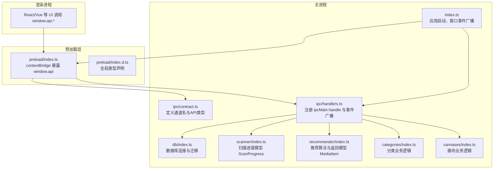
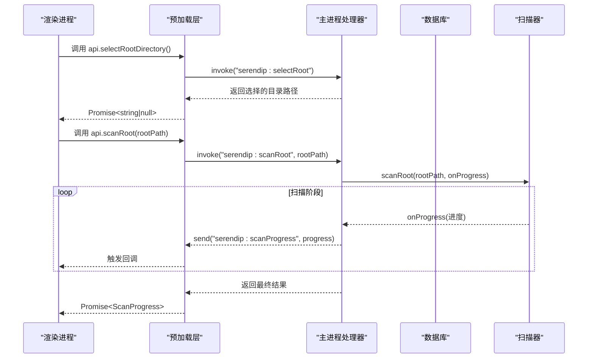
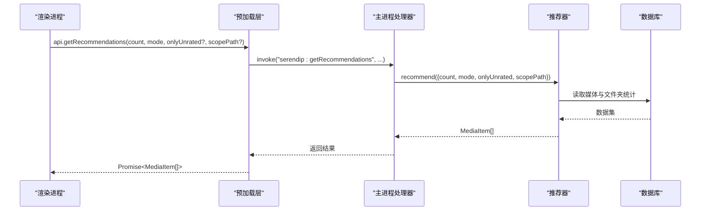
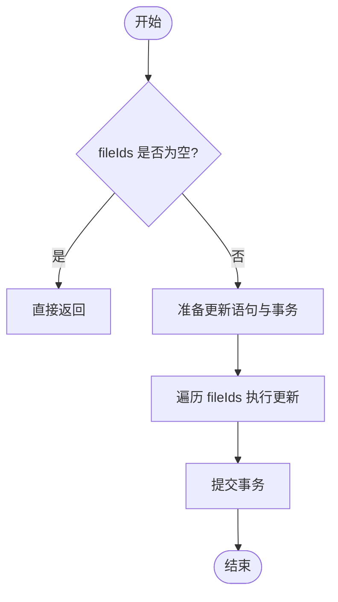
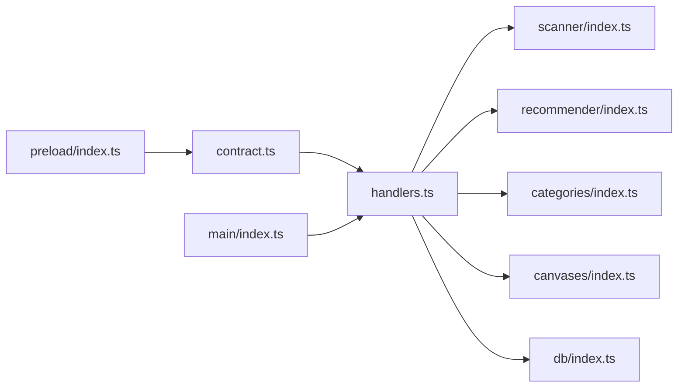

# IPC 协议设计

<cite>
**本文引用的文件**
- [src/main/ipc/contract.ts](file://src/main/ipc/contract.ts)
- [src/main/ipc/handlers.ts](file://src/main/ipc/handlers.ts)
- [src/preload/index.ts](file://src/preload/index.ts)
- [src/preload/index.d.ts](file://src/preload/index.d.ts)
- [src/main/index.ts](file://src/main/index.ts)
- [src/main/scanner/index.ts](file://src/main/scanner/index.ts)
- [src/main/recommender/index.ts](file://src/main/recommender/index.ts)
- [src/main/categories/index.ts](file://src/main/categories/index.ts)
- [src/main/canvases/index.ts](file://src/main/canvases/index.ts)
- [src/main/db/index.ts](file://src/main/db/index.ts)
</cite>

## 目录
1. [简介](#简介)
2. [项目结构](#项目结构)
3. [核心组件](#核心组件)
4. [架构总览](#架构总览)
5. [详细组件分析](#详细组件分析)
6. [依赖关系分析](#依赖关系分析)
7. [性能考量](#性能考量)
8. [故障排查指南](#故障排查指南)
9. [结论](#结论)
10. [附录：协议扩展与版本兼容规范](#附录协议扩展与版本兼容规范)

## 简介
本文件为 Serendip 应用的 IPC（进程间通信）协议设计文档，面向主进程、预加载脚本与渲染进程之间的通信契约。文档覆盖以下要点：
- 通信契约定义方式：消息类型常量、事件名称规范、参数与返回值类型
- 请求-响应模式：方法命名约定、参数校验规则、返回值格式
- 事件广播机制：事件命名空间、数据载荷结构、监听器管理
- 协议示例：如何新增接口与扩展现有协议
- 版本兼容策略与向后兼容保证
- 协议文档化最佳实践与开发规范

## 项目结构
IPC 相关代码集中在 main 进程的 contract 与 handlers 模块，preload 层暴露安全 API 给渲染进程使用，main 入口负责注册处理器并初始化窗口事件广播。

图表来源
- [src/main/ipc/contract.ts:1-130](file://src/main/ipc/contract.ts#L1-L130)
- [src/main/ipc/handlers.ts:1-292](file://src/main/ipc/handlers.ts#L1-L292)
- [src/preload/index.ts:1-104](file://src/preload/index.ts#L1-L104)
- [src/preload/index.d.ts:1-10](file://src/preload/index.d.ts#L1-L10)
- [src/main/index.ts:1-134](file://src/main/index.ts#L1-L134)
- [src/main/db/index.ts:1-190](file://src/main/db/index.ts#L1-L190)
- [src/main/scanner/index.ts:1-323](file://src/main/scanner/index.ts#L1-L323)
- [src/main/recommender/index.ts:1-518](file://src/main/recommender/index.ts#L1-L518)
- [src/main/categories/index.ts:1-166](file://src/main/categories/index.ts#L1-L166)
- [src/main/canvases/index.ts:1-320](file://src/main/canvases/index.ts#L1-L320)

章节来源
- [src/main/ipc/contract.ts:1-130](file://src/main/ipc/contract.ts#L1-L130)
- [src/main/ipc/handlers.ts:1-292](file://src/main/ipc/handlers.ts#L1-L292)
- [src/preload/index.ts:1-104](file://src/preload/index.ts#L1-L104)
- [src/preload/index.d.ts:1-10](file://src/preload/index.d.ts#L1-L10)
- [src/main/index.ts:1-134](file://src/main/index.ts#L1-L134)

## 核心组件
- 通信契约定义（通道名与 API 类型）
  - 统一在 contract 中集中维护，包含所有 IPC 通道常量与对外 API 的 TypeScript 类型签名，确保主/预加载/渲染三端类型一致。
- 处理器注册（主进程）
  - 通过 ipcMain.handle 将通道名映射到具体实现；对需要推送进度的操作，使用 sender.send 或 broadcastProgress 向渲染层推送事件。
- 预加载桥接（安全暴露）
  - 使用 contextBridge.exposeInMainWorld 将 api 对象注入 window，供渲染进程以强类型方式调用。
- 窗口事件广播
  - 主进程在窗口全屏切换、移动等系统事件发生时，通过 webContents.send 向渲染层广播。

章节来源
- [src/main/ipc/contract.ts:1-130](file://src/main/ipc/contract.ts#L1-L130)
- [src/main/ipc/handlers.ts:1-292](file://src/main/ipc/handlers.ts#L1-L292)
- [src/preload/index.ts:1-104](file://src/preload/index.ts#L1-L104)
- [src/main/index.ts:67-79](file://src/main/index.ts#L67-L79)

## 架构总览
下图展示一次典型“选择根目录并扫描”的请求-响应流程，以及扫描过程中的进度事件广播。

图表来源
- [src/preload/index.ts:9-11](file://src/preload/index.ts#L9-L11)
- [src/main/ipc/handlers.ts:42-60](file://src/main/ipc/handlers.ts#L42-L60)
- [src/main/scanner/index.ts:36-239](file://src/main/scanner/index.ts#L36-L239)

## 详细组件分析

### 通信契约与类型体系
- 通道常量
  - 所有 IPC 通道名集中于一个只读常量对象，采用统一的命名空间前缀，避免冲突。
- API 类型
  - 定义 SerendipAPI 接口，明确每个方法的入参与返回值类型，便于 TS 编译期检查与 IDE 提示。
- 共享类型
  - 将领域模型（如媒体项、分类、画布等）从业务模块导出并在契约中复用，确保跨进程数据结构一致。

章节来源
- [src/main/ipc/contract.ts:12-82](file://src/main/ipc/contract.ts#L12-L82)
- [src/main/ipc/contract.ts:84-130](file://src/main/ipc/contract.ts#L84-L130)

### 请求-响应模式设计规范
- 方法命名约定
  - 动词+名词形式，语义清晰，例如 selectRootDirectory、getRecommendations、updateCanvasViewport。
- 参数验证规则
  - 主进程侧进行必要校验（如空值、长度限制、存在性），失败时抛出错误，由 Electron 自动转为 Promise reject。
- 返回值格式
  - 成功返回结构化数据（数组/对象/基本类型），失败通过异常传播；无副作用的查询尽量幂等。

章节来源
- [src/main/ipc/handlers.ts:42-284](file://src/main/ipc/handlers.ts#L42-L284)
- [src/main/categories/index.ts:34-76](file://src/main/categories/index.ts#L34-L76)
- [src/main/canvases/index.ts:92-131](file://src/main/canvases/index.ts#L92-L131)

### 事件广播机制
- 事件命名空间
  - 所有事件通道均以统一前缀开头，区分于请求通道，便于管理与调试。
- 数据载荷结构
  - 进度事件使用统一的 ScanProgress 结构，包含阶段、统计计数与当前路径等字段。
- 监听器管理
  - 预加载层提供 onXxx 方法，内部注册 ipcRenderer.on 并返回取消订阅函数，避免内存泄漏。

章节来源
- [src/main/ipc/contract.ts:84-130](file://src/main/ipc/contract.ts#L84-L130)
- [src/main/scanner/index.ts:8-18](file://src/main/scanner/index.ts#L8-L18)
- [src/main/ipc/handlers.ts:52-60](file://src/main/ipc/handlers.ts#L52-L60)
- [src/main/ipc/handlers.ts:286-292](file://src/main/ipc/handlers.ts#L286-L292)
- [src/preload/index.ts:78-86](file://src/preload/index.ts#L78-L86)

### 窗口事件与系统交互
- 全屏与移动事件
  - 主进程在窗口进入/退出全屏与移动时，向渲染层发送对应事件，用于 UI 自适应布局。
- 标题栏覆盖设置
  - 通过专用 IPC 设置 Windows Controls Overlay 的可见性与颜色，适配不同主题与沉浸式场景。

章节来源
- [src/main/index.ts:71-79](file://src/main/index.ts#L71-L79)
- [src/main/ipc/handlers.ts:259-283](file://src/main/ipc/handlers.ts#L259-L283)

### 关键业务流程时序图

#### 获取推荐内容

图表来源
- [src/preload/index.ts:15-16](file://src/preload/index.ts#L15-L16)
- [src/main/ipc/handlers.ts:84-86](file://src/main/ipc/handlers.ts#L84-L86)
- [src/main/recommender/index.ts:57-149](file://src/main/recommender/index.ts#L57-L149)

#### 批量设置喜欢（事务批写）

图表来源
- [src/main/ipc/handlers.ts:106-114](file://src/main/ipc/handlers.ts#L106-L114)

## 依赖关系分析
- 低耦合高内聚
  - contract 仅定义类型与通道名，不引入业务实现；handlers 聚合各业务模块，保持单一职责。
- 外部依赖
  - 数据库访问通过 db 模块统一管理，启用 WAL 提升并发性能；文件系统与 Shell 操作通过 Electron API 完成。
- 潜在循环依赖
  - 当前按模块边界划分清晰，未见循环引用风险。

图表来源
- [src/main/ipc/contract.ts:1-130](file://src/main/ipc/contract.ts#L1-L130)
- [src/main/ipc/handlers.ts:1-292](file://src/main/ipc/handlers.ts#L1-L292)
- [src/preload/index.ts:1-104](file://src/preload/index.ts#L1-L104)
- [src/main/index.ts:1-134](file://src/main/index.ts#L1-L134)

章节来源
- [src/main/ipc/contract.ts:1-130](file://src/main/ipc/contract.ts#L1-L130)
- [src/main/ipc/handlers.ts:1-292](file://src/main/ipc/handlers.ts#L1-L292)
- [src/main/db/index.ts:1-190](file://src/main/db/index.ts#L1-L190)

## 性能考量
- 批量写入与事务
  - 大量更新（如批量喜欢/不喜欢、批量添加画布项）使用事务包裹，减少磁盘 I/O 次数。
- 扫描增量同步
  - 基于 mtime/size 差异计算，避免全量重算；分批 stat 与插入，控制内存占用。
- 数据库优化
  - 启用 WAL 模式与合适的索引，提高读写并发与查询效率。

章节来源
- [src/main/ipc/handlers.ts:106-125](file://src/main/ipc/handlers.ts#L106-L125)
- [src/main/canvases/index.ts:180-245](file://src/main/canvases/index.ts#L180-L245)
- [src/main/scanner/index.ts:124-218](file://src/main/scanner/index.ts#L124-L218)
- [src/main/db/index.ts:19-22](file://src/main/db/index.ts#L19-L22)

## 故障排查指南
- 常见错误来源
  - 参数校验失败：分类/画布名称为空或过长、ID 不存在等，会抛出错误并由 IPC 转为 Promise reject。
  - 文件缺失：打开文件或显示目录时若文件不存在，会标记为不可用并返回。
- 定位建议
  - 在 handlers 中增加日志输出，记录通道名与关键参数；在扫描过程中关注进度事件的 phase 与 currentPath。
  - 使用浏览器 DevTools 的 Console 查看预加载层的 onScanProgress 回调输出。

章节来源
- [src/main/ipc/handlers.ts:148-185](file://src/main/ipc/handlers.ts#L148-L185)
- [src/main/categories/index.ts:34-76](file://src/main/categories/index.ts#L34-L76)
- [src/main/canvases/index.ts:92-131](file://src/main/canvases/index.ts#L92-L131)

## 结论
Serendip 的 IPC 协议以集中式契约为核心，结合严格的类型系统与清晰的命名空间，实现了主进程与渲染进程之间稳定、可维护的通信。通过事务批写、增量扫描与 WAL 模式，系统在性能与一致性方面取得良好平衡。后续扩展应遵循本文档的设计规范，确保向后兼容与可读性。

## 附录：协议扩展与版本兼容规范

### 新增 IPC 接口步骤
- 在契约中定义通道名与方法签名
  - 在通道常量对象中添加新通道名，并在 SerendipAPI 接口中补充方法定义。
- 在主进程中注册处理器
  - 在 handlers 中新增 ipcMain.handle 绑定，实现业务逻辑与必要的参数校验。
- 在预加载层暴露方法
  - 在 preload 的 api 对象中新增对应方法，调用 ipcRenderer.invoke 并使用契约中的通道名。
- 在渲染进程中使用
  - 通过 window.api 调用新方法，TS 类型检查将确保参数与返回值正确。

章节来源
- [src/main/ipc/contract.ts:12-82](file://src/main/ipc/contract.ts#L12-L82)
- [src/main/ipc/contract.ts:84-130](file://src/main/ipc/contract.ts#L84-L130)
- [src/main/ipc/handlers.ts:1-292](file://src/main/ipc/handlers.ts#L1-L292)
- [src/preload/index.ts:1-104](file://src/preload/index.ts#L1-L104)

### 事件扩展与监听器管理
- 新增事件通道
  - 在契约的事件常量中追加新事件名，确保命名空间一致。
- 主进程广播
  - 在合适时机使用 sender.send 或 broadcastProgress 广播事件，携带结构化载荷。
- 渲染进程订阅
  - 在预加载层提供 onXxx 方法，内部注册 ipcRenderer.on 并返回取消订阅函数，避免重复订阅与内存泄漏。

章节来源
- [src/main/ipc/contract.ts:84-130](file://src/main/ipc/contract.ts#L84-L130)
- [src/main/ipc/handlers.ts:286-292](file://src/main/ipc/handlers.ts#L286-L292)
- [src/preload/index.ts:78-86](file://src/preload/index.ts#L78-L86)

### 版本兼容与向后兼容保证
- 渐进式扩展
  - 新增可选参数与字段，旧客户端忽略未知字段仍可正常工作。
- 废弃策略
  - 保留旧通道名与方法至少两个大版本，期间同时支持新旧行为，逐步引导迁移。
- 变更通知
  - 在重大变更时通过事件或配置项通知渲染层，以便 UI 做降级处理。

[本节为通用规范说明，不直接分析具体文件]

### 协议文档化最佳实践与开发规范
- 命名规范
  - 通道名使用小写字母与冒号分隔的命名空间；方法名使用动宾短语，语义清晰。
- 类型优先
  - 所有入参与返回值均具备明确的 TypeScript 类型，禁止 any 与隐式转换。
- 错误处理
  - 主进程侧进行严格校验，抛出明确错误信息；渲染侧捕获并友好提示用户。
- 测试与回归
  - 为关键 IPC 接口编写单元测试与集成测试，覆盖正常路径与异常分支。

[本节为通用规范说明，不直接分析具体文件]