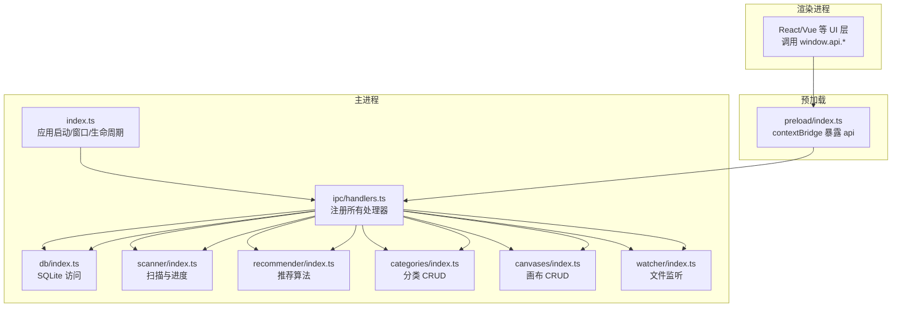
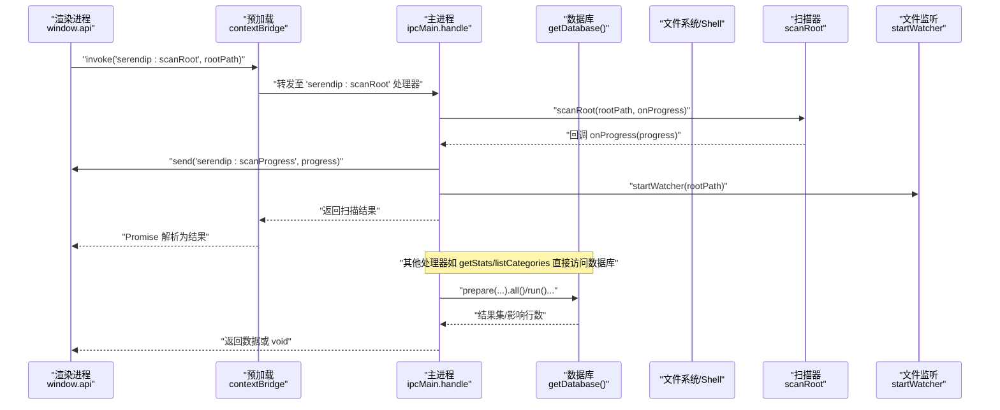
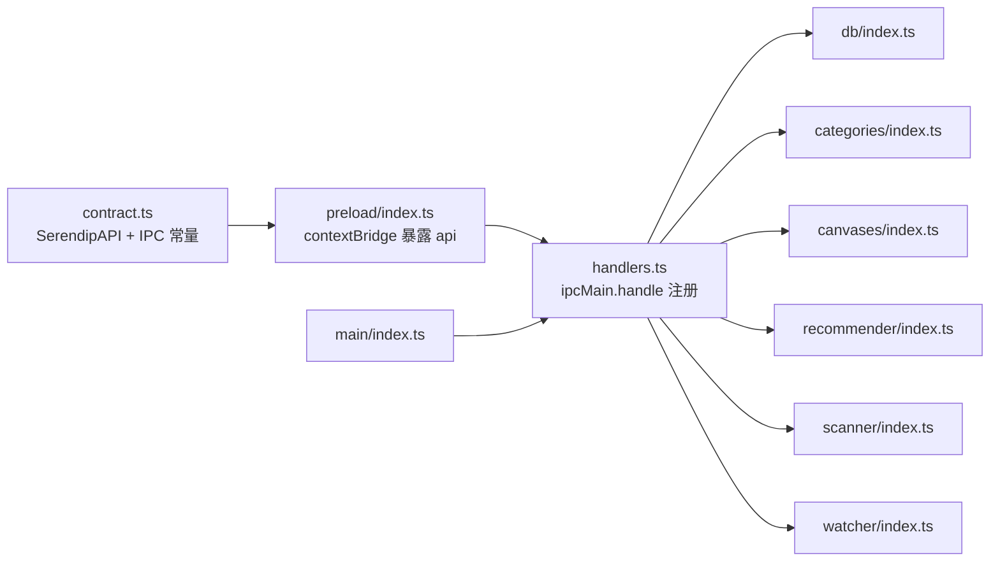

# IPC 处理器实现

<cite>
**本文引用的文件**   
- [src/main/index.ts](file://src/main/index.ts)
- [src/main/ipc/handlers.ts](file://src/main/ipc/handlers.ts)
- [src/main/ipc/contract.ts](file://src/main/ipc/contract.ts)
- [src/preload/index.ts](file://src/preload/index.ts)
</cite>

## 目录
1. [简介](#简介)
2. [项目结构](#项目结构)
3. [核心组件](#核心组件)
4. [架构总览](#架构总览)
5. [详细组件分析](#详细组件分析)
6. [依赖关系分析](#依赖关系分析)
7. [性能考量](#性能考量)
8. [故障排查指南](#故障排查指南)
9. [结论](#结论)

## 简介
本文件聚焦于 Serendip 应用在主进程中的 IPC（进程间通信）处理器实现，系统性阐述：
- 主进程中 IPC 处理器的注册机制与生命周期管理
- 同步、异步与事件型处理器的实现模式
- 错误处理机制（异常捕获、错误码定义、用户友好返回）
- 典型业务场景的处理器示例（文件操作、数据库查询、业务逻辑调用）
- 性能优化技巧（批量操作、事务处理、缓存策略）
- 调试技巧与日志记录最佳实践

## 项目结构
IPC 相关代码主要分布在以下位置：
- 主进程入口：负责初始化数据库、注册协议、创建窗口、启动扫描与监听器，并在应用就绪时注册所有 IPC 处理器。
- IPC 契约与通道名：集中定义渲染层可用的 API 类型与 IPC 通道常量，保证主/预加载/渲染三端类型一致。
- 预加载桥接：将主进程暴露的 API 通过 contextBridge 安全地注入到渲染进程 window.api。
- 处理器实现：在 ipcMain.handle 中按通道名注册具体处理函数，封装文件系统、数据库与业务模块调用。

图表来源
- [src/main/index.ts:93-125](file://src/main/index.ts#L93-L125)
- [src/main/ipc/handlers.ts:40-284](file://src/main/ipc/handlers.ts#L40-L284)
- [src/preload/index.ts:9-89](file://src/preload/index.ts#L9-L89)

章节来源
- [src/main/index.ts:1-134](file://src/main/index.ts#L1-L134)
- [src/main/ipc/handlers.ts:1-292](file://src/main/ipc/handlers.ts#L1-L292)
- [src/main/ipc/contract.ts:1-130](file://src/main/ipc/contract.ts#L1-L130)
- [src/preload/index.ts:1-104](file://src/preload/index.ts#L1-L104)

## 核心组件
- 契约与通道名（contract.ts）
  - 定义 SerendipAPI 接口，统一主/预加载/渲染三端的类型约束。
  - 集中维护 IPC 通道名常量，避免硬编码字符串散落各处。
- 预加载桥接（preload/index.ts）
  - 使用 contextBridge.exposeInMainWorld 将 api 对象注入 window.api。
  - 对事件订阅提供 onXxx 方法并返回取消订阅函数，便于生命周期管理。
- 处理器注册（handlers.ts）
  - 通过 registerIpcHandlers 一次性注册全部 ipcMain.handle 处理器。
  - 封装系统能力（dialog/shell）、数据库访问、扫描与推荐、分类与画布等业务模块。
- 应用生命周期（index.ts）
  - app.whenReady 后执行：获取数据库实例、注册缩略图协议、注册 IPC 处理器、按需自动扫描与启动文件监听、创建主窗口。
  - 窗口事件向渲染层广播全屏变化与移动事件；退出时停止监听并关闭数据库。

章节来源
- [src/main/ipc/contract.ts:13-82](file://src/main/ipc/contract.ts#L13-L82)
- [src/main/ipc/contract.ts:84-130](file://src/main/ipc/contract.ts#L84-L130)
- [src/preload/index.ts:9-89](file://src/preload/index.ts#L9-L89)
- [src/main/ipc/handlers.ts:40-284](file://src/main/ipc/handlers.ts#L40-L284)
- [src/main/index.ts:93-134](file://src/main/index.ts#L93-L134)

## 架构总览
下图展示了从渲染进程发起请求到主进程处理器响应、再到数据源或系统能力的完整链路，以及事件推送路径。

图表来源
- [src/main/ipc/handlers.ts:52-60](file://src/main/ipc/handlers.ts#L52-L60)
- [src/main/ipc/handlers.ts:72-81](file://src/main/ipc/handlers.ts#L72-L81)
- [src/main/ipc/handlers.ts:188-211](file://src/main/ipc/handlers.ts#L188-L211)
- [src/main/index.ts:100-102](file://src/main/index.ts#L100-L102)

## 详细组件分析

### 处理器注册机制与生命周期
- 注册时机
  - 在 app.whenReady 回调中，先获取数据库连接、注册自定义协议，再调用 registerIpcHandlers 完成所有处理器注册。
- 生命周期
  - 应用启动：注册处理器 → 读取已配置根目录 → 若存在则静默扫描 → 启动文件监听 → 创建主窗口。
  - 应用退出：触发 window-all-closed 时停止文件监听并关闭数据库。
- 窗口事件广播
  - 进入/退出全屏与窗口移动事件通过 BrowserWindow.webContents.send 推送到渲染层，供 UI 调整布局或状态。

章节来源
- [src/main/index.ts:93-125](file://src/main/index.ts#L93-L125)
- [src/main/index.ts:127-134](file://src/main/index.ts#L127-L134)
- [src/main/index.ts:71-79](file://src/main/index.ts#L71-L79)

### 处理器类型与实现模式

#### 同步处理器
- 特点
  - 处理器内部仅进行轻量计算或简单查询，无外部 I/O 阻塞，直接返回结果。
- 示例
  - 获取当前根目录、统计信息、列出分类/画布等。
- 注意事项
  - 确保 SQL 查询尽量走索引字段，避免全表扫描；必要时分页或限制返回数量。

章节来源
- [src/main/ipc/handlers.ts:63-81](file://src/main/ipc/handlers.ts#L63-L81)
- [src/main/ipc/handlers.ts:188-196](file://src/main/ipc/handlers.ts#L188-L196)
- [src/main/ipc/handlers.ts:214-222](file://src/main/ipc/handlers.ts#L214-L222)

#### 异步处理器
- 特点
  - 涉及文件系统、网络、媒体元数据提取等耗时操作，使用 async/await 返回 Promise。
- 示例
  - 选择根目录、打开文件或文件夹、标记不可用、获取媒体尺寸等。
- 注意事项
  - 对可能失败的操作增加 try/catch，向上抛出结构化错误，由预加载/渲染层统一处理。

章节来源
- [src/main/ipc/handlers.ts:42-49](file://src/main/ipc/handlers.ts#L42-L49)
- [src/main/ipc/handlers.ts:149-185](file://src/main/ipc/handlers.ts#L149-L185)
- [src/main/ipc/handlers.ts:226-228](file://src/main/ipc/handlers.ts#L226-L228)

#### 事件处理器（双向通信）
- 特点
  - 主进程通过 send 主动推送事件，渲染进程通过 onXxx 订阅并返回取消订阅函数。
- 示例
  - 扫描进度推送：主进程在 scanRoot 回调中发送 SCAN_PROGRESS，预加载层 onScanProgress 接收并转发给 UI。
- 注意事项
  - 务必在组件卸载或页面切换时调用返回的清理函数，防止内存泄漏与重复回调。

章节来源
- [src/main/ipc/handlers.ts:52-60](file://src/main/ipc/handlers.ts#L52-L60)
- [src/preload/index.ts:78-86](file://src/preload/index.ts#L78-L86)

### 错误处理机制
- 异常捕获
  - 对可能抛错的系统调用（如 shell.openPath、setTitleBarOverlay）使用 try/catch 包裹，避免崩溃。
  - 对数据库更新/删除等操作，建议外层统一 try/catch，并将错误包装为包含 code/message 的对象返回。
- 错误码定义
  - 建议在 contract.ts 中新增枚举或常量，例如 FILE_NOT_FOUND、DB_ERROR、IO_ERROR 等，配合 message 描述。
- 用户友好的错误信息
  - 返回给用户的信息应避免泄露内部细节，采用可读性强的提示文案；同时保留结构化错误用于日志与调试。
- 缺失资源处理
  - 当文件不存在时，可自动标记 unavailable 并返回空结果，避免上层反复重试。

章节来源
- [src/main/ipc/handlers.ts:157-181](file://src/main/ipc/handlers.ts#L157-L181)
- [src/main/ipc/handlers.ts:272-283](file://src/main/ipc/handlers.ts#L272-L283)

### 典型处理器示例

#### 文件操作类
- 选择根目录
  - 通过 dialog.showOpenDialog 选择目录，返回路径或 null。
- 在文件管理器中显示/打开文件
  - 查询 media_files.path，校验存在性后调用 shell.showItemInFolder/openPath；若文件缺失则标记 unavailable。
- 打开目录
  - 直接调用 shell.openPath 打开指定目录。

章节来源
- [src/main/ipc/handlers.ts:42-49](file://src/main/ipc/handlers.ts#L42-L49)
- [src/main/ipc/handlers.ts:157-185](file://src/main/ipc/handlers.ts#L157-L185)

#### 数据库查询类
- 获取统计信息
  - 分别 COUNT media_files、folders、liked 文件数，聚合返回。
- 列出喜欢视图
  - 基于 rootPath 前缀匹配未失效且 liked=1 的文件，注意转义 LIKE 通配符。
- 收藏分类与画布 CRUD
  - 通过 categories/canvases 模块提供的函数完成增删改查与排序。

章节来源
- [src/main/ipc/handlers.ts:72-81](file://src/main/ipc/handlers.ts#L72-L81)
- [src/main/ipc/handlers.ts:128-146](file://src/main/ipc/handlers.ts#L128-L146)
- [src/main/ipc/handlers.ts:188-211](file://src/main/ipc/handlers.ts#L188-L211)
- [src/main/ipc/handlers.ts:214-250](file://src/main/ipc/handlers.ts#L214-L250)

#### 业务逻辑调用类
- 扫描根目录
  - 调用 scanRoot 并传入进度回调，完成后启动 watcher；向所有窗口广播进度。
- 推荐内容
  - 根据 ExploreMode 与过滤条件调用 recommend/getHierarchicalRecommendations。
- 标题栏覆盖设置
  - 根据主题派生颜色，兼容不支持 WCO 的平台（macOS）。

章节来源
- [src/main/ipc/handlers.ts:52-60](file://src/main/ipc/handlers.ts#L52-L60)
- [src/main/ipc/handlers.ts:84-91](file://src/main/ipc/handlers.ts#L84-L91)
- [src/main/ipc/handlers.ts:259-283](file://src/main/ipc/handlers.ts#L259-L283)

### 性能优化技巧

#### 批量操作与事务处理
- 批量喜欢/不感兴趣
  - 使用 db.transaction 包裹多次 UPDATE，减少磁盘 IO 次数，提升写入吞吐。
- 批量添加/更新画布项
  - 通过 addItemsToCanvasRaw/updateCanvasItems 等接口合并写入，降低往返开销。

章节来源
- [src/main/ipc/handlers.ts:106-125](file://src/main/ipc/handlers.ts#L106-L125)
- [src/main/ipc/handlers.ts:229-244](file://src/main/ipc/handlers.ts#L229-L244)

#### 缓存策略
- 建议对高频只读数据（如分类列表、画布列表、统计信息）引入内存缓存，设置合理过期时间。
- 对于媒体尺寸等昂贵计算，可按 fileId 建立本地缓存，避免重复解析。

[本节为通用建议，无需源码引用]

#### 并发控制与背压
- 对大量文件扫描或批量更新，建议分片处理与限流，避免长时间占用主线程。
- 结合事件推送（SCAN_PROGRESS）反馈进度，提升用户体验。

章节来源
- [src/main/ipc/handlers.ts:52-60](file://src/main/ipc/handlers.ts#L52-L60)

### 调试技巧与日志记录最佳实践
- 启动阶段日志
  - 在自动扫描前后打印关键日志，便于定位启动失败原因。
- 错误日志
  - 捕获异常并输出上下文（如 fileId、rootPath），便于复现问题。
- 事件调试
  - 在预加载层 onScanProgress 中打印进度，确认主进程推送是否到达渲染层。
- 平台差异
  - 针对 Windows/Mac/Linux 的行为差异（如 WCO 支持），在处理器内做兼容性处理并记录平台信息。

章节来源
- [src/main/index.ts:110-117](file://src/main/index.ts#L110-L117)
- [src/preload/index.ts:78-86](file://src/preload/index.ts#L78-L86)
- [src/main/ipc/handlers.ts:272-283](file://src/main/ipc/handlers.ts#L272-L283)

## 依赖关系分析
- 耦合与内聚
  - handlers.ts 作为 IPC 适配层，低耦合地调用各业务模块（db/categories/canvases/recommender/scanner/watcher），职责清晰。
- 直接依赖
  - 主进程入口 index.ts 依赖 handlers.ts 完成注册；预加载层 preload/index.ts 依赖 contract.ts 的类型与通道名。
- 潜在循环依赖
  - 当前未见明显循环依赖；如需扩展，建议保持“适配器→业务模块”单向依赖。
- 外部集成点
  - Electron API（ipcMain/ipcRenderer、dialog、shell、BrowserWindow）
  - SQLite（通过 getDatabase 访问）
  - 文件系统与媒体元数据（通过 scanner/canvases 模块间接调用）

图表来源
- [src/main/ipc/contract.ts:13-82](file://src/main/ipc/contract.ts#L13-L82)
- [src/main/ipc/contract.ts:84-130](file://src/main/ipc/contract.ts#L84-L130)
- [src/preload/index.ts:9-89](file://src/preload/index.ts#L9-L89)
- [src/main/ipc/handlers.ts:40-284](file://src/main/ipc/handlers.ts#L40-L284)
- [src/main/index.ts:100-102](file://src/main/index.ts#L100-L102)

章节来源
- [src/main/ipc/contract.ts:1-130](file://src/main/ipc/contract.ts#L1-L130)
- [src/preload/index.ts:1-104](file://src/preload/index.ts#L1-L104)
- [src/main/ipc/handlers.ts:1-292](file://src/main/ipc/handlers.ts#L1-L292)
- [src/main/index.ts:1-134](file://src/main/index.ts#L1-L134)

## 性能考量
- 批量写入优先使用事务，减少磁盘 IO 与锁竞争。
- 大列表查询应限制返回条数或分页，避免一次性传输过多数据。
- 媒体尺寸等昂贵计算需缓存并按需刷新。
- 扫描与长任务通过事件推送进度，避免阻塞主线程。
- 对频繁调用的只读接口考虑内存缓存与失效策略。

[本节为通用建议，无需源码引用]

## 故障排查指南
- 常见问题
  - 文件不存在导致打开失败：检查是否存在并自动标记 unavailable。
  - 平台差异导致 WCO 设置失败：在 try/catch 中静默忽略，避免崩溃。
  - 扫描进度未到达渲染层：确认主进程是否正确 send，预加载是否正确 on/off。
- 定位步骤
  - 查看启动日志与错误堆栈，确认数据库连接与协议注册成功。
  - 在处理器入口处打印参数与返回值，验证数据一致性。
  - 在预加载层打印事件回调，确认事件链路畅通。

章节来源
- [src/main/ipc/handlers.ts:157-181](file://src/main/ipc/handlers.ts#L157-L181)
- [src/main/ipc/handlers.ts:272-283](file://src/main/ipc/handlers.ts#L272-L283)
- [src/main/index.ts:110-117](file://src/main/index.ts#L110-L117)

## 结论
本实现以契约驱动的方式，将主进程的 IPC 处理器集中在 handlers.ts 中注册，并通过 preload/index.ts 安全暴露给渲染进程。该设计具备清晰的职责边界、良好的可扩展性与跨平台兼容性。在生产环境中，建议进一步完善错误码体系、增强日志与监控，并结合缓存与批量化策略持续提升性能与稳定性。