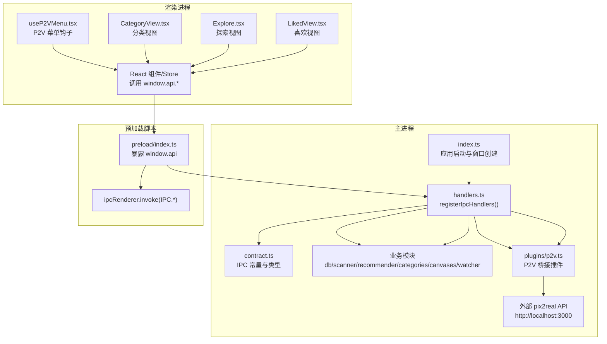
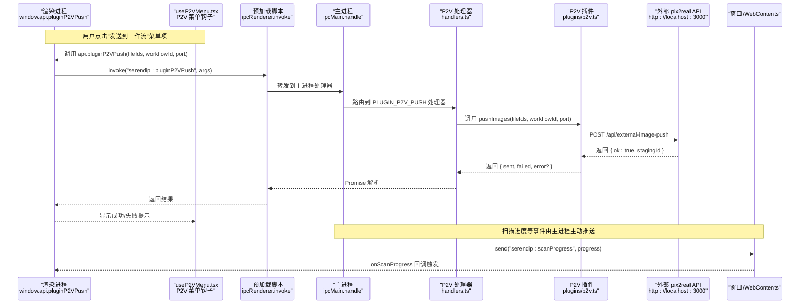
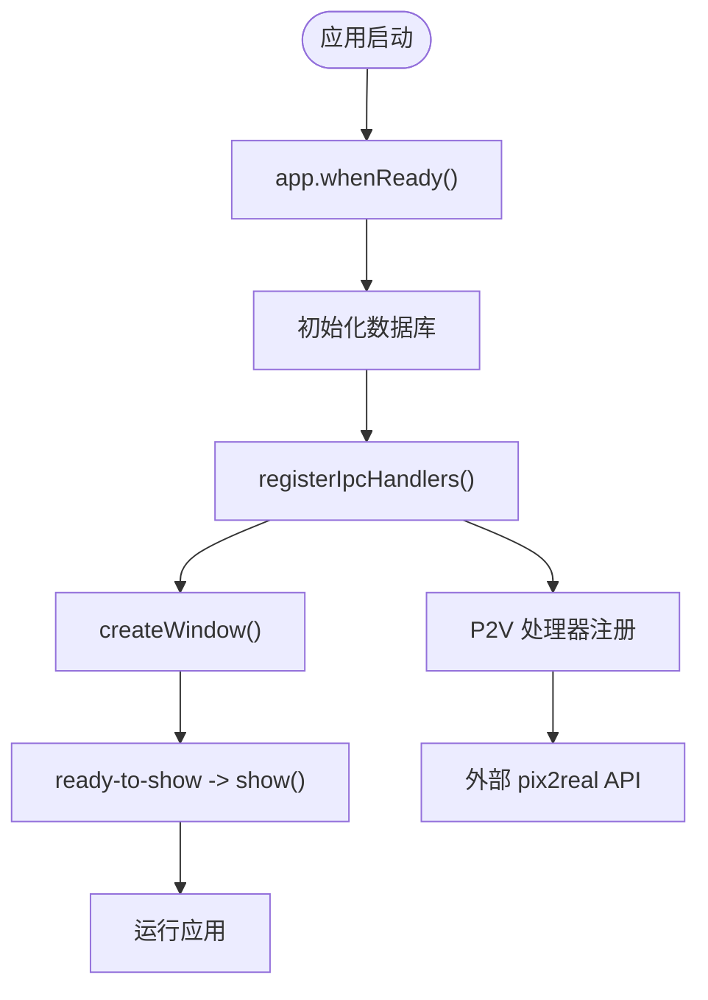
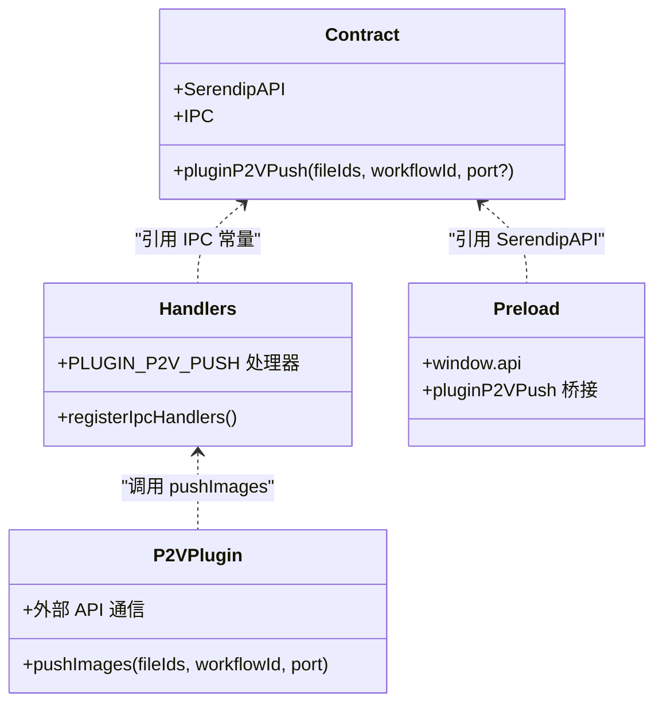
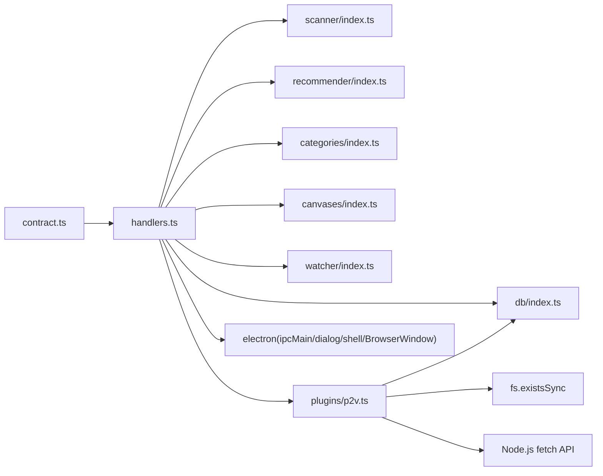

# IPC 处理器注册机制

<cite>
**本文引用的文件**   
- [src/main/index.ts](file://src/main/index.ts)
- [src/main/ipc/contract.ts](file://src/main/ipc/contract.ts)
- [src/main/ipc/handlers.ts](file://src/main/ipc/handlers.ts)
- [src/preload/index.ts](file://src/preload/index.ts)
- [src/main/plugins/p2v.ts](file://src/main/plugins/p2v.ts)
- [src/renderer/src/hooks/useP2VMenu.tsx](file://src/renderer/src/hooks/useP2VMenu.tsx)
</cite>

## 更新摘要
**所做更改**   
- 新增 P2V 桥接插件通信接口章节，详细说明 pluginP2VPush 处理器的实现
- 更新处理器注册示例，包含 P2V 插件推送功能的完整示例
- 扩展错误处理策略，涵盖外部 API 连接失败的异常处理
- 增加性能优化技巧，包括批量处理和超时控制
- 更新依赖关系分析，反映新的 P2V 插件模块集成

## 目录
1. [简介](#简介)
2. [项目结构](#项目结构)
3. [核心组件](#核心组件)
4. [架构总览](#架构总览)
5. [详细组件分析](#详细组件分析)
6. [依赖关系分析](#依赖关系分析)
7. [性能考虑](#性能考虑)
8. [故障排查指南](#故障排查指南)
9. [结论](#结论)
10. [附录](#附录)

## 简介
本文面向 Serendip 应用的 IPC（进程间通信）子系统，聚焦主进程的处理器注册机制与生命周期管理。重点解释 registerIpcHandlers 的实现原理、ipcMain.handle 的调用模式与参数传递机制、IPC 契约定义与处理器实现的解耦设计，并提供具体注册示例、错误处理策略、性能优化技巧以及调试与日志最佳实践。**最新更新**：新增 P2V（pix2real）桥接插件通信接口，支持将媒体文件推送到外部图片处理工作流。

## 项目结构
Serendip 采用"契约先行"的 IPC 设计：在 contract.ts 中集中声明通道名与 API 类型；在 handlers.ts 中实现各通道的处理器；在 preload/index.ts 中以 Promise 风格封装 ipcRenderer.invoke；在主进程入口 index.ts 中完成初始化并注册所有处理器。**新增**：P2V 插件模块提供独立的外部 API 通信能力。

**图表来源**
- [src/main/index.ts:93-125](file://src/main/index.ts#L93-L125)
- [src/main/ipc/handlers.ts:40-284](file://src/main/ipc/handlers.ts#L40-L284)
- [src/main/ipc/contract.ts:84-129](file://src/main/ipc/contract.ts#L84-L129)
- [src/preload/index.ts:9-89](file://src/preload/index.ts#L9-L89)
- [src/main/plugins/p2v.ts:19-105](file://src/main/plugins/p2v.ts#L19-L105)
- [src/renderer/src/hooks/useP2VMenu.tsx:74-81](file://src/renderer/src/hooks/useP2VMenu.tsx#L74-L81)

**章节来源**
- [src/main/index.ts:93-125](file://src/main/index.ts#L93-L125)
- [src/main/ipc/contract.ts:1-139](file://src/main/ipc/contract.ts#L1-L139)
- [src/main/ipc/handlers.ts:1-298](file://src/main/ipc/handlers.ts#L1-L298)
- [src/preload/index.ts:1-107](file://src/preload/index.ts#L1-L107)
- [src/main/plugins/p2v.ts:1-106](file://src/main/plugins/p2v.ts#L1-L106)

## 核心组件
- 契约层（contract.ts）
  - 定义 SerendipAPI 接口与 IPC 通道常量，作为主进程与渲染进程共享的类型与命名约定。
  - **新增**：包含 pluginP2VPush 方法签名，支持文件 ID 数组、工作流 ID 和可选端口参数的推送操作。
- 处理器层（handlers.ts）
  - 提供 registerIpcHandlers 函数，集中使用 ipcMain.handle 将通道名映射到异步处理器。
  - **新增**：PLUGIN_P2V_PUSH 处理器，负责接收渲染进程的 P2V 推送请求并调用 pushImages 函数。
- 预加载桥接（preload/index.ts）
  - 通过 contextBridge 暴露 window.api，内部以 ipcRenderer.invoke 调用对应通道。
  - **新增**：pluginP2VPush 方法桥接，将渲染进程调用转发到主进程处理器。
- 应用入口（index.ts）
  - 在 app.whenReady 后执行 registerIpcHandlers，确保所有处理器在首个窗口创建前就绪。
- **新增**：P2V 插件模块（plugins/p2v.ts）
  - 实现 pushImages 函数，负责将本地媒体文件推送到运行中的 pix2real 服务。
  - 提供完整的错误处理、超时控制和连接状态管理。

**章节来源**
- [src/main/ipc/contract.ts:13-83](file://src/main/ipc/contract.ts#L13-L83)
- [src/main/ipc/handlers.ts:40-284](file://src/main/ipc/handlers.ts#L40-L284)
- [src/preload/index.ts:9-89](file://src/preload/index.ts#L9-L89)
- [src/main/index.ts:93-125](file://src/main/index.ts#L93-L125)
- [src/main/plugins/p2v.ts:19-105](file://src/main/plugins/p2v.ts#L19-L105)

## 架构总览
下图展示了从渲染进程发起请求到主进程处理器执行的完整链路，包括事件订阅与广播，以及新增的 P2V 插件通信流程。

**图表来源**
- [src/renderer/src/hooks/useP2VMenu.tsx:74-81](file://src/renderer/src/hooks/useP2VMenu.tsx#L74-L81)
- [src/preload/index.ts:78-79](file://src/preload/index.ts#L78-L79)
- [src/main/ipc/handlers.ts:253-256](file://src/main/ipc/handlers.ts#L253-L256)
- [src/main/plugins/p2v.ts:53-80](file://src/main/plugins/p2v.ts#L53-L80)
- [src/main/ipc/handlers.ts:52-60](file://src/main/ipc/handlers.ts#L52-L60)

## 详细组件分析

### registerIpcHandlers 函数与生命周期管理
- 注册时机
  - 在 app.whenReady 之后、createWindow 之前调用 registerIpcHandlers，确保所有 IPC 处理器在窗口可用前已就绪。
- 职责边界
  - 仅负责通道绑定与参数转发，不直接耦合业务细节；业务逻辑委托给 db、scanner、recommender、categories、canvases、watcher 等业务模块。
  - **新增**：P2V 插件处理器专门处理外部 API 通信，保持与核心业务逻辑的解耦。
- 事件订阅与广播
  - 对于需要向渲染端推送的事件（如扫描进度），处理器内通过 event.sender.send 或 broadcastProgress 进行广播。

**图表来源**
- [src/main/index.ts:93-125](file://src/main/index.ts#L93-L125)
- [src/main/ipc/handlers.ts:40-60](file://src/main/ipc/handlers.ts#L40-L60)
- [src/main/ipc/handlers.ts:253-256](file://src/main/ipc/handlers.ts#L253-L256)

**章节来源**
- [src/main/index.ts:93-125](file://src/main/index.ts#L93-L125)
- [src/main/ipc/handlers.ts:40-60](file://src/main/ipc/handlers.ts#L40-L60)

### ipcMain.handle 调用模式与参数传递
- 基本模式
  - ipcMain.handle(channel, async (event, ...args) => handler(...args))
  - 返回值会被序列化并通过 Promise 返回给渲染端。
- 参数顺序
  - 第一个参数为 Electron.IpcMainInvokeEvent，后续参数按调用方传入的顺序一一对应。
- 无参与可选参数
  - 当无需 event 时可使用占位符 _event；可选参数在调用侧按需传入。
- 事件订阅
  - 对单向推送（如进度）使用 event.sender.send 或 BrowserWindow.getAllWindows().forEach(win => win.webContents.send)。
- **新增**：P2V 处理器参数模式
  - 接收 fileIds 数组、workflowId 数字和可选的 port 参数
  - 返回包含 sent、failed 计数和可选 error 消息的对象

**章节来源**
- [src/main/ipc/handlers.ts:42-91](file://src/main/ipc/handlers.ts#L42-L91)
- [src/main/ipc/handlers.ts:253-256](file://src/main/ipc/handlers.ts#L253-L256)
- [src/main/ipc/handlers.ts:286-291](file://src/main/ipc/handlers.ts#L286-L291)

### IPC 契约与处理器实现的解耦设计
- 契约层（contract.ts）
  - 统一声明 API 方法签名与 IPC 通道常量，保证两端类型一致。
  - **新增**：pluginP2VPush 方法定义，明确参数类型和返回值结构。
- 处理器层（handlers.ts）
  - 仅依赖契约中的常量，不关心调用方细节；通过通道名路由到具体业务函数。
  - **新增**：PLUGIN_P2V_PUSH 处理器，将请求转发到 P2V 插件模块。
- 预加载桥接（preload/index.ts）
  - 将 window.api 方法与 ipcRenderer.invoke 绑定，屏蔽底层 IPC 细节。
  - **新增**：pluginP2VPush 桥接方法，提供类型安全的调用接口。

**图表来源**
- [src/main/ipc/contract.ts:13-83](file://src/main/ipc/contract.ts#L13-L83)
- [src/main/ipc/handlers.ts:1-10](file://src/main/ipc/handlers.ts#L1-L10)
- [src/preload/index.ts:1-10](file://src/preload/index.ts#L1-L10)
- [src/main/plugins/p2v.ts:19-23](file://src/main/plugins/p2v.ts#L19-L23)

**章节来源**
- [src/main/ipc/contract.ts:1-139](file://src/main/ipc/contract.ts#L1-L139)
- [src/main/ipc/handlers.ts:1-38](file://src/main/ipc/handlers.ts#L1-L38)
- [src/preload/index.ts:1-10](file://src/preload/index.ts#L1-L10)

### 处理器注册示例与请求类型覆盖
- 简单查询类
  - 例如获取当前根目录、统计信息、列表项等，通常无参或少量参数，直接返回数据。
- 写操作类
  - 例如设置喜欢/不喜欢、更新画布项等，可能涉及数据库写入。
- 批量操作类
  - 例如批量设置喜欢/不喜欢、批量添加分类项等，建议使用事务批写提升性能。
- 长耗时任务
  - 例如扫描根目录，需配合进度事件推送，避免 UI 阻塞。
- 系统交互类
  - 例如打开文件/文件夹、显示在资源管理器中，调用 shell API。
- **新增**：外部 API 通信类
  - P2V 插件推送：将选中的媒体文件推送到外部 pix2real 服务
  - 支持批量发送、超时控制、连接失败处理和进度反馈

**章节来源**
- [src/main/ipc/handlers.ts:63-81](file://src/main/ipc/handlers.ts#L63-L81)
- [src/main/ipc/handlers.ts:94-125](file://src/main/ipc/handlers.ts#L94-L125)
- [src/main/ipc/handlers.ts:128-146](file://src/main/ipc/handlers.ts#L128-L146)
- [src/main/ipc/handlers.ts:149-185](file://src/main/ipc/handlers.ts#L149-L185)
- [src/main/ipc/handlers.ts:187-250](file://src/main/ipc/handlers.ts#L187-L250)
- [src/main/ipc/handlers.ts:253-256](file://src/main/ipc/handlers.ts#L253-L256)

### P2V 桥接插件通信接口详解
**新增**：P2V（pix2real）桥接插件提供了将本地媒体文件推送到外部图片处理工作流的能力。

#### 处理器实现
- 通道名称：`serendip:pluginP2VPush`
- 参数：
  - `fileIds`: number[] - 要推送的文件 ID 数组
  - `workflowId`: number - 目标工作流 ID（0-10）
  - `port?: number` - 可选的 pix2real 服务端口，默认为 3000
- 返回值：Promise<{ sent: number; failed: number; error?: string }>

#### 插件功能特性
- **批量处理**：支持一次推送多个文件
- **连接检测**：首次连接失败时立即返回错误，避免不必要的重试
- **超时控制**：每个请求 8 秒超时，防止长时间阻塞
- **错误隔离**：单个文件推送失败不影响其他文件的处理
- **路径验证**：自动检查文件是否存在于文件系统

#### 渲染进程使用示例
- **上下文菜单集成**：在右键菜单中添加"P2V Bridge"分组
- **工作流选择器**：提供可视化的工作流选择界面
- **实时反馈**：显示发送成功/失败的 Toast 通知
- **错误处理**：捕获网络异常并显示友好提示

**章节来源**
- [src/main/ipc/handlers.ts:253-256](file://src/main/ipc/handlers.ts#L253-L256)
- [src/main/plugins/p2v.ts:19-105](file://src/main/plugins/p2v.ts#L19-L105)
- [src/renderer/src/hooks/useP2VMenu.tsx:74-81](file://src/renderer/src/hooks/useP2VMenu.tsx#L74-L81)
- [src/renderer/src/views/CategoryView.tsx:404-412](file://src/renderer/src/views/CategoryView.tsx#L404-L412)

### 错误处理与异常捕获策略
- 处理器内异常
  - 未显式 try/catch 的异常会沿 Promise 链传播，最终被渲染端 reject。建议在关键路径（如 I/O、外部 API）增加 try/catch 并返回明确错误对象或状态码。
- 平台差异
  - 如标题栏覆盖 API 在不同平台行为不同，需 catch 静默处理以避免崩溃。
- 空值与边界
  - 对缺失配置、不存在文件等场景做防御性判断，避免抛出意外异常。
- **新增**：外部 API 通信异常
  - **连接失败处理**：首次请求连接失败时返回明确的错误消息，告知用户检查 pix2real 服务状态
  - **超时异常**：8 秒超时后中断请求，避免长时间等待
  - **HTTP 错误**：非 200 响应状态码计入失败计数，继续处理其他文件
  - **网络异常**：捕获 DNS 解析失败、连接拒绝等网络层错误

**章节来源**
- [src/main/ipc/handlers.ts:259-283](file://src/main/ipc/handlers.ts#L259-L283)
- [src/main/ipc/handlers.ts:157-171](file://src/main/ipc/handlers.ts#L157-L171)
- [src/main/plugins/p2v.ts:81-96](file://src/main/plugins/p2v.ts#L81-L96)

### 性能优化技巧
- 批量处理与事务
  - 对大量写操作使用数据库事务包裹，减少磁盘同步次数，提高吞吐。
- 懒加载与分页
  - 对大列表查询建议分页或增量加载，避免一次性传输过多数据。
- 去重与缓存
  - 对频繁读取且变化小的数据（如主题色、窗口尺寸）可在内存中缓存。
- 事件节流
  - 高频事件（如窗口移动、滚动）应在渲染层节流后再发送 IPC，降低主进程压力。
- **新增**：外部 API 通信优化
  - **并发控制**：串行处理文件推送，避免同时建立过多网络连接
  - **超时管理**：为每个 HTTP 请求设置合理的超时时间
  - **连接复用**：利用 Node.js fetch 的连接池机制，减少 TCP 握手开销
  - **错误快速失败**：首次连接失败时立即返回，避免无效的网络尝试

**章节来源**
- [src/main/ipc/handlers.ts:105-125](file://src/main/ipc/handlers.ts#L105-L125)
- [src/main/plugins/p2v.ts:57-99](file://src/main/plugins/p2v.ts#L57-L99)

### 调试技巧与日志记录最佳实践
- 结构化日志
  - 在关键路径输出带上下文信息的日志（如操作类型、目标 ID、耗时）。
- 前端断点
  - 在预加载桥接处打断点，确认 invoke 的参数与返回值是否符合预期。
- 事件追踪
  - 对进度等事件，记录发送频率与内容，便于定位卡顿或重复推送问题。
- 平台差异验证
  - 针对标题栏覆盖等跨平台特性，分别在 Windows/Linux/macOS 下验证行为。
- **新增**：P2V 插件调试
  - **网络请求日志**：记录每个 HTTP 请求的 URL、请求体和响应状态
  - **文件路径验证**：输出解析后的文件路径和存在性检查结果
  - **错误堆栈跟踪**：捕获并记录详细的错误信息，便于问题诊断
  - **性能监控**：记录每个文件的处理时间和整体推送统计

**章节来源**
- [src/main/index.ts:110-118](file://src/main/index.ts#L110-L118)
- [src/main/ipc/handlers.ts:52-60](file://src/main/ipc/handlers.ts#L52-L60)
- [src/main/plugins/p2v.ts:24-104](file://src/main/plugins/p2v.ts#L24-L104)

## 依赖关系分析
- 模块耦合
  - handlers.ts 依赖 contract.ts 的通道常量与类型；依赖 db、scanner、recommender、categories、canvases、watcher 等业务模块。
  - **新增**：handlers.ts 还依赖 plugins/p2v.ts 模块，用于处理 P2V 插件相关的 IPC 请求。
- 外部集成
  - 使用 electron 的 ipcMain、dialog、shell、BrowserWindow 等能力；使用 fs.existsSync 进行文件存在性检查。
  - **新增**：P2V 插件模块使用 Node.js 内置的 fetch API 进行 HTTP 请求，使用 AbortController 实现超时控制。
- 潜在循环依赖
  - 当前结构清晰，未见循环导入；若新增模块，应保持"契约—处理器—业务"分层不变。

**图表来源**
- [src/main/ipc/handlers.ts:1-38](file://src/main/ipc/handlers.ts#L1-L38)
- [src/main/plugins/p2v.ts:10-12](file://src/main/plugins/p2v.ts#L10-L12)

**章节来源**
- [src/main/ipc/handlers.ts:1-38](file://src/main/ipc/handlers.ts#L1-L38)
- [src/main/plugins/p2v.ts:10-12](file://src/main/plugins/p2v.ts#L10-L12)

## 性能考虑
- 批量写操作优先使用事务，减少 I/O 开销。
- 对大对象传输进行分片或分页，避免单次 IPC 负载过大。
- 对高频事件在渲染层进行节流/防抖，降低主进程调度压力。
- 对只读热点数据引入内存缓存，缩短响应时间。
- **新增**：外部 API 通信性能优化
  - 合理设置 HTTP 请求超时时间，避免长时间占用资源
  - 利用连接池机制，减少 TCP 连接建立的开销
  - 实现快速失败策略，在网络不可用时立即返回错误
  - 对批量操作进行错误隔离，单个失败不影响整体处理

## 故障排查指南
- 现象：调用 window.api.* 无响应
  - 检查是否在 app.whenReady 后调用了 registerIpcHandlers。
  - 确认通道名是否与 contract.ts 保持一致。
- 现象：进度事件未触发
  - 检查是否已在渲染端正确订阅 onScanProgress，并在主进程中通过 event.sender.send 或 broadcastProgress 推送。
- 现象：打开文件失败
  - 检查数据库中路径是否存在，必要时标记为不可用。
- 现象：标题栏覆盖样式异常
  - 在非支持平台（如 macOS）上，setTitleBarOverlay 可能抛异常，需 catch 静默处理。
- **新增**：P2V 插件相关问题
  - **无法连接到 pix2real**：检查服务是否正在运行，确认端口配置是否正确
  - **部分文件推送失败**：检查文件路径是否有效，查看具体的错误日志
  - **推送速度缓慢**：检查网络连接质量，考虑调整超时时间或分批处理
  - **工作流选择器不显示**：确认 P2V 插件是否启用，检查工作流配置是否正确

**章节来源**
- [src/main/index.ts:93-125](file://src/main/index.ts#L93-L125)
- [src/main/ipc/handlers.ts:52-60](file://src/main/ipc/handlers.ts#L52-L60)
- [src/main/ipc/handlers.ts:157-171](file://src/main/ipc/handlers.ts#L157-L171)
- [src/main/ipc/handlers.ts:259-283](file://src/main/ipc/handlers.ts#L259-L283)
- [src/main/plugins/p2v.ts:84-92](file://src/main/plugins/p2v.ts#L84-L92)

## 结论
Serendip 的 IPC 子系统通过"契约先行、处理器集中、预加载桥接"的分层设计，实现了清晰的职责划分与良好的可维护性。registerIpcHandlers 作为统一的注册入口，结合 ipcMain.handle 的 Promise 模型，使渲染端能以简洁的 API 调用主进程能力。**新增的 P2V 桥接插件**进一步扩展了应用的功能边界，通过标准化的 IPC 接口实现了与外部服务的无缝集成。通过事务批写、事件节流、超时控制和结构化日志等手段，可进一步提升系统的稳定性与性能。

## 附录
- 常用通道参考（节选）
  - 库管理：选择根目录、扫描根目录、获取当前根、统计信息
  - 推荐与浏览：获取推荐、分层推荐、喜欢/不喜欢、列出喜欢、打开文件/文件夹
  - 收藏分类：增删改查、排序、批量操作
  - 画布：增删改查、批量更新、视口更新、媒体尺寸批量获取
  - **新增**：P2V 插件：文件推送、工作流管理
  - 窗口装饰：设置标题栏覆盖可见性与颜色

**章节来源**
- [src/main/ipc/contract.ts:84-139](file://src/main/ipc/contract.ts#L84-L139)
- [src/main/ipc/handlers.ts:40-284](file://src/main/ipc/handlers.ts#L40-L284)
- [src/main/plugins/p2v.ts:19-105](file://src/main/plugins/p2v.ts#L19-L105)