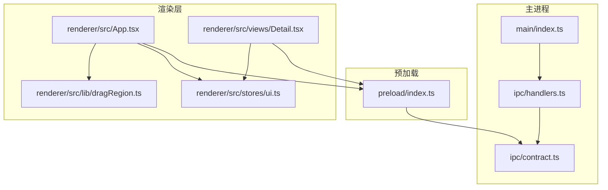
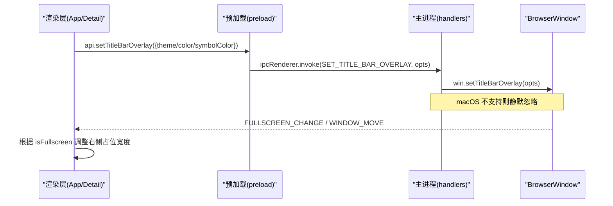
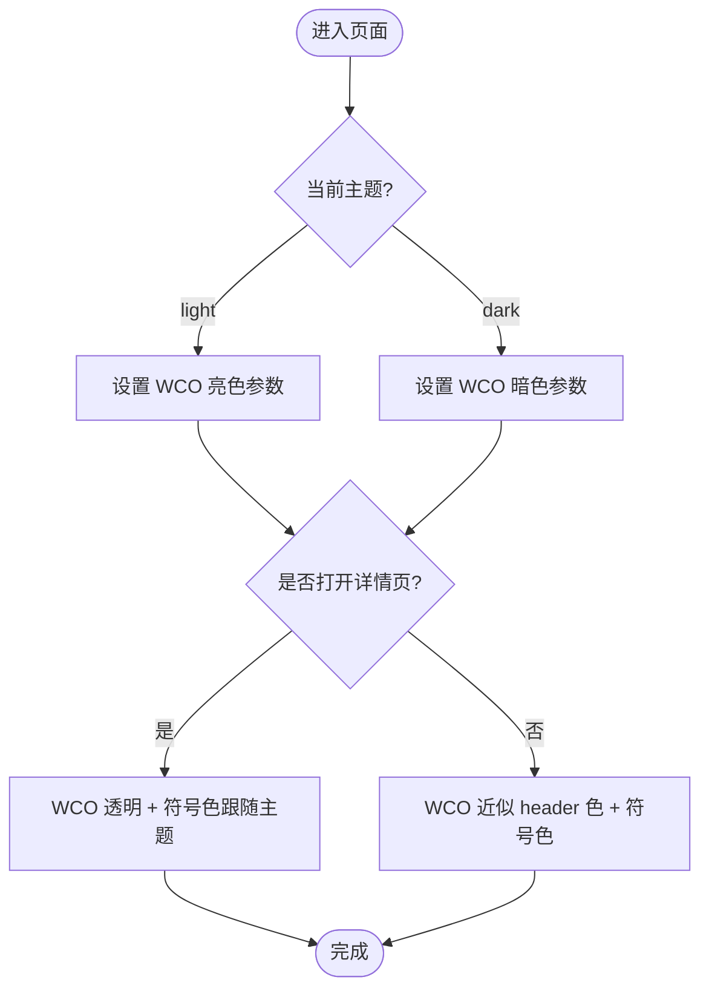
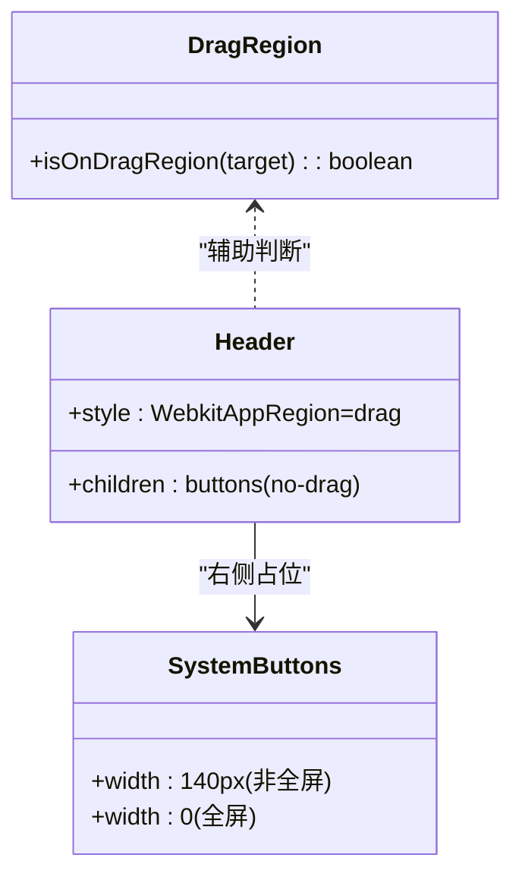
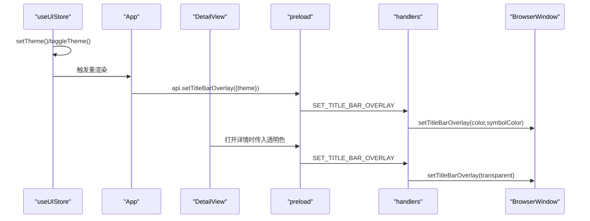
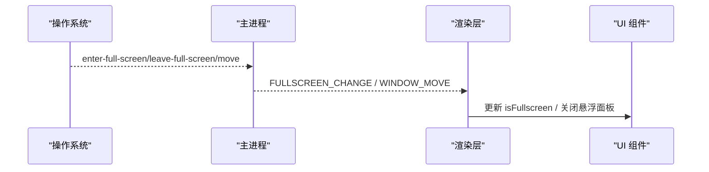
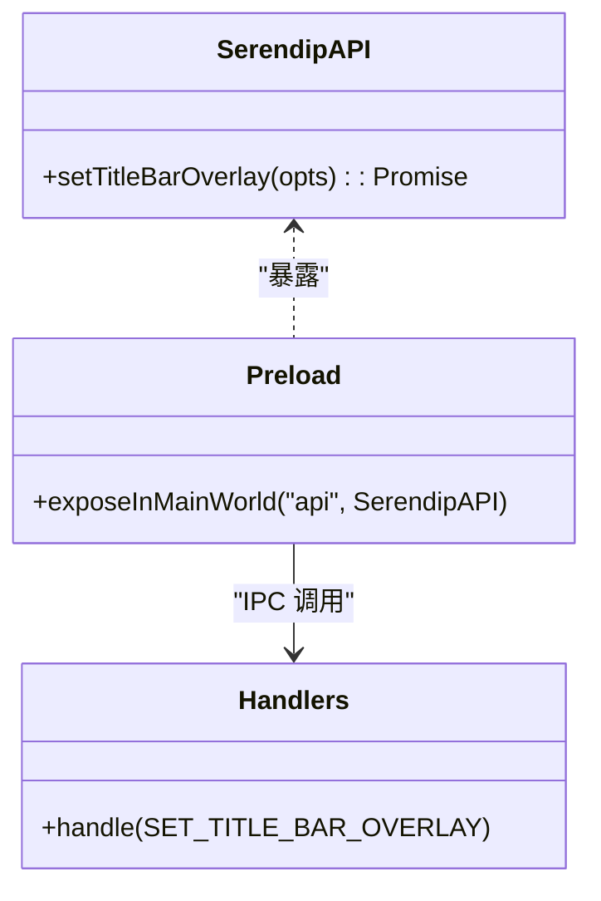
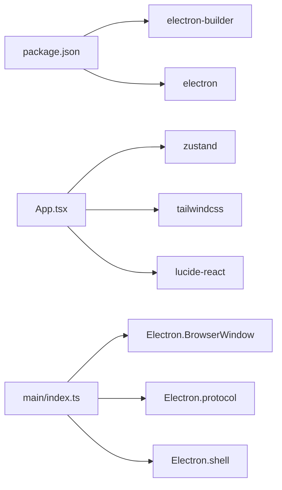

# UI 集成处理器

<cite>
**本文引用的文件**   
- [src/main/index.ts](file://src/main/index.ts)
- [src/main/ipc/contract.ts](file://src/main/ipc/contract.ts)
- [src/main/ipc/handlers.ts](file://src/main/ipc/handlers.ts)
- [src/preload/index.ts](file://src/preload/index.ts)
- [src/renderer/src/App.tsx](file://src/renderer/src/App.tsx)
- [src/renderer/src/views/Detail.tsx](file://src/renderer/src/views/Detail.tsx)
- [src/renderer/src/stores/ui.ts](file://src/renderer/src/stores/ui.ts)
- [src/renderer/src/lib/dragRegion.ts](file://src/renderer/src/lib/dragRegion.ts)
- [package.json](file://package.json)
</cite>

## 目录
1. [简介](#简介)
2. [项目结构](#项目结构)
3. [核心组件](#核心组件)
4. [架构总览](#架构总览)
5. [详细组件分析](#详细组件分析)
6. [依赖关系分析](#依赖关系分析)
7. [性能与体验优化](#性能与体验优化)
8. [故障排查指南](#故障排查指南)
9. [结论](#结论)
10. [附录：示例与测试方法](#附录示例与测试方法)

## 简介
本文件面向 Serendip 应用的“UI 集成处理器”，聚焦以下能力：
- 窗口装饰与标题栏覆盖（Windows Controls Overlay，简称 WCO）
- 主题切换对系统按钮、标题栏背景的影响
- 浏览器窗口控制与系统集成 API 的使用
- 跨平台差异处理与错误降级策略
- 用户体验优化与视觉一致性保证
- 平台特定适配方案与测试方法

该处理器贯穿主进程、预加载脚本与渲染层，通过 IPC 契约暴露统一 API，使业务侧以声明式方式驱动窗口外观与行为。

## 项目结构
与 UI 集成相关的关键路径如下：
- 主进程入口负责创建 BrowserWindow、注册协议、监听全屏/移动事件、初始化数据库与扫描器
- IPC 契约集中定义主/渲染端共享类型与通道名
- 预加载桥接 window.api 与 window.electron，将主进程能力安全暴露给渲染层
- 渲染层 App 与 Detail 视图负责自绘标题栏拖拽区域、WCO 配色同步、全屏状态联动
- UI 状态由 Zustand store 管理并持久化，主题变化触发 DOM 属性与 WCO 更新

图表来源
- [src/main/index.ts:38-91](file://src/main/index.ts#L38-L91)
- [src/main/ipc/handlers.ts:252-284](file://src/main/ipc/handlers.ts#L252-L284)
- [src/main/ipc/contract.ts:72-82](file://src/main/ipc/contract.ts#L72-L82)
- [src/preload/index.ts:88-94](file://src/preload/index.ts#L88-L94)
- [src/renderer/src/App.tsx:469-476](file://src/renderer/src/App.tsx#L469-L476)
- [src/renderer/src/views/Detail.tsx:239-249](file://src/renderer/src/views/Detail.tsx#L239-L249)
- [src/renderer/src/stores/ui.ts:54-63](file://src/renderer/src/stores/ui.ts#L54-L63)
- [src/renderer/src/lib/dragRegion.ts:1-16](file://src/renderer/src/lib/dragRegion.ts#L1-L16)

章节来源
- [src/main/index.ts:38-91](file://src/main/index.ts#L38-L91)
- [src/main/ipc/contract.ts:72-82](file://src/main/ipc/contract.ts#L72-L82)
- [src/main/ipc/handlers.ts:252-284](file://src/main/ipc/handlers.ts#L252-L284)
- [src/preload/index.ts:88-94](file://src/preload/index.ts#L88-L94)
- [src/renderer/src/App.tsx:469-476](file://src/renderer/src/App.tsx#L469-L476)
- [src/renderer/src/views/Detail.tsx:239-249](file://src/renderer/src/views/Detail.tsx#L239-L249)
- [src/renderer/src/stores/ui.ts:54-63](file://src/renderer/src/stores/ui.ts#L54-L63)
- [src/renderer/src/lib/dragRegion.ts:1-16](file://src/renderer/src/lib/dragRegion.ts#L1-L16)

## 核心组件
- 窗口创建与初始配置：设置 titleBarStyle、titleBarOverlay（Win/Linux）、图标（Linux）、webPreferences.preload
- 全屏与移动事件广播：enter-full-screen/leave-full-screen/move → 渲染层订阅
- IPC 契约与处理器：统一暴露 setTitleBarOverlay、全屏变更、窗口移动等能力
- 预加载桥接：contextBridge.exposeInMainWorld('api', ...) 与 electronAPI
- 渲染层 UI 集成：
  - 自绘标题栏拖拽区（WebkitAppRegion: drag/no-drag）
  - 主题切换时调用 setTitleBarOverlay 同步 WCO 颜色
  - 详情页沉浸式模式切换 WCO 透明度与符号色
  - 全屏占位宽度动态调整，避免内容遮挡系统按钮

章节来源
- [src/main/index.ts:38-91](file://src/main/index.ts#L38-L91)
- [src/main/index.ts:67-79](file://src/main/index.ts#L67-L79)
- [src/main/ipc/contract.ts:72-82](file://src/main/ipc/contract.ts#L72-L82)
- [src/main/ipc/handlers.ts:252-284](file://src/main/ipc/handlers.ts#L252-L284)
- [src/preload/index.ts:88-94](file://src/preload/index.ts#L88-L94)
- [src/renderer/src/App.tsx:469-476](file://src/renderer/src/App.tsx#L469-L476)
- [src/renderer/src/views/Detail.tsx:239-249](file://src/renderer/src/views/Detail.tsx#L239-L249)

## 架构总览
下图展示 UI 集成的端到端流程：渲染层发起主题或沉浸态变更请求，经预加载桥接到主进程，主进程调用 Electron 的 setTitleBarOverlay 更新 WCO；同时主进程广播全屏/移动事件，渲染层据此调整布局与交互。

图表来源
- [src/main/ipc/handlers.ts:252-284](file://src/main/ipc/handlers.ts#L252-L284)
- [src/main/index.ts:67-79](file://src/main/index.ts#L67-L79)
- [src/preload/index.ts:88-94](file://src/preload/index.ts#L88-L94)
- [src/renderer/src/App.tsx:469-476](file://src/renderer/src/App.tsx#L469-L476)
- [src/renderer/src/views/Detail.tsx:239-249](file://src/renderer/src/views/Detail.tsx#L239-L249)

## 详细组件分析

### 组件一：窗口装饰与 WCO 配置
- 主进程在创建窗口时：
  - Windows/Linux：titleBarStyle='hidden' + titleBarOverlay 初始值（亮色近白背景、深灰符号），高度固定
  - macOS：使用默认 hidden（信号灯在左上角），不启用 WCO
- 渲染层在主题切换时：
  - 调用 setTitleBarOverlay(theme)，主进程按 theme 派生 color/symbolColor
- 详情页打开/关闭时：
  - 打开：color 设为全透明，symbolColor 随主题切换，实现沉浸式
  - 关闭：恢复 header 色，保持 hover 高亮可见

图表来源
- [src/main/index.ts:47-60](file://src/main/index.ts#L47-L60)
- [src/main/ipc/handlers.ts:259-283](file://src/main/ipc/handlers.ts#L259-L283)
- [src/renderer/src/App.tsx:469-476](file://src/renderer/src/App.tsx#L469-L476)
- [src/renderer/src/views/Detail.tsx:239-249](file://src/renderer/src/views/Detail.tsx#L239-L249)

章节来源
- [src/main/index.ts:47-60](file://src/main/index.ts#L47-L60)
- [src/main/ipc/handlers.ts:259-283](file://src/main/ipc/handlers.ts#L259-L283)
- [src/renderer/src/App.tsx:469-476](file://src/renderer/src/App.tsx#L469-L476)
- [src/renderer/src/views/Detail.tsx:239-249](file://src/renderer/src/views/Detail.tsx#L239-L249)

### 组件二：标题栏覆盖与拖拽区域
- 自绘标题栏整体启用 WebkitAppRegion: drag，内部按钮/输入需 no-drag
- 提供工具函数 isOnDragRegion 用于判断事件目标是否在拖拽区域
- 顶部右侧预留约 140px 空间给系统按钮，全屏时收为 0

图表来源
- [src/renderer/src/lib/dragRegion.ts:1-16](file://src/renderer/src/lib/dragRegion.ts#L1-L16)
- [src/renderer/src/App.tsx:497-514](file://src/renderer/src/App.tsx#L497-L514)
- [src/renderer/src/App.tsx:609-614](file://src/renderer/src/App.tsx#L609-L614)

章节来源
- [src/renderer/src/lib/dragRegion.ts:1-16](file://src/renderer/src/lib/dragRegion.ts#L1-L16)
- [src/renderer/src/App.tsx:497-514](file://src/renderer/src/App.tsx#L497-L514)
- [src/renderer/src/App.tsx:609-614](file://src/renderer/src/App.tsx#L609-L614)

### 组件三：主题切换与动态样式
- UI Store 维护 theme，切换时设置 documentElement 的 data-theme 属性
- 渲染层监听 theme 变化，调用 setTitleBarOverlay 同步 WCO 颜色
- 详情页打开时强制透明背景，关闭时恢复 header 色

图表来源
- [src/renderer/src/stores/ui.ts:54-63](file://src/renderer/src/stores/ui.ts#L54-L63)
- [src/renderer/src/App.tsx:469-476](file://src/renderer/src/App.tsx#L469-L476)
- [src/renderer/src/views/Detail.tsx:239-249](file://src/renderer/src/views/Detail.tsx#L239-L249)
- [src/main/ipc/handlers.ts:259-283](file://src/main/ipc/handlers.ts#L259-L283)

章节来源
- [src/renderer/src/stores/ui.ts:54-63](file://src/renderer/src/stores/ui.ts#L54-L63)
- [src/renderer/src/App.tsx:469-476](file://src/renderer/src/App.tsx#L469-L476)
- [src/renderer/src/views/Detail.tsx:239-249](file://src/renderer/src/views/Detail.tsx#L239-L249)
- [src/main/ipc/handlers.ts:259-283](file://src/main/ipc/handlers.ts#L259-L283)

### 组件四：全屏与窗口移动联动
- 主进程监听 enter-full-screen/leave-full-screen/move，向渲染层发送事件
- 渲染层订阅后：
  - 全屏：收起右侧系统按钮占位，让内容贴右
  - 窗口移动：关闭悬浮面板（如设置面板、上下文菜单）

图表来源
- [src/main/index.ts:67-79](file://src/main/index.ts#L67-L79)
- [src/renderer/src/App.tsx:199-203](file://src/renderer/src/App.tsx#L199-L203)
- [src/renderer/src/App.tsx:955-967](file://src/renderer/src/App.tsx#L955-L967)
- [src/renderer/src/components/ContextMenu.tsx:84-98](file://src/renderer/src/components/ContextMenu.tsx#L84-L98)

章节来源
- [src/main/index.ts:67-79](file://src/main/index.ts#L67-L79)
- [src/renderer/src/App.tsx:199-203](file://src/renderer/src/App.tsx#L199-L203)
- [src/renderer/src/App.tsx:955-967](file://src/renderer/src/App.tsx#L955-L967)
- [src/renderer/src/components/ContextMenu.tsx:84-98](file://src/renderer/src/components/ContextMenu.tsx#L84-L98)

### 组件五：IPC 契约与预加载桥接
- contract.ts 定义 SerendipAPI 接口与 IPC 常量，包含 setTitleBarOverlay、FULLSCREEN_CHANGE、WINDOW_MOVE 等
- preload/index.ts 将 api 暴露到 window.api，供 React 组件直接调用
- handlers.ts 实现 SET_TITLE_BAR_OVERLAY，调用 win.setTitleBarOverlay，并在不支持的平台静默失败

图表来源
- [src/main/ipc/contract.ts:72-82](file://src/main/ipc/contract.ts#L72-L82)
- [src/preload/index.ts:88-94](file://src/preload/index.ts#L88-L94)
- [src/main/ipc/handlers.ts:259-283](file://src/main/ipc/handlers.ts#L259-L283)

章节来源
- [src/main/ipc/contract.ts:72-82](file://src/main/ipc/contract.ts#L72-L82)
- [src/preload/index.ts:88-94](file://src/preload/index.ts#L88-L94)
- [src/main/ipc/handlers.ts:259-283](file://src/main/ipc/handlers.ts#L259-L283)

## 依赖关系分析
- 主进程依赖 Electron 的 app、BrowserWindow、protocol、shell 等模块
- 渲染层依赖 React、Zustand、Tailwind CSS 与 lucide-react 图标库
- 预加载桥接 @electron-toolkit/preload 提供的 electronAPI
- 构建与打包依赖 electron-builder，支持多平台产物生成

图表来源
- [package.json:1-70](file://package.json#L1-L70)
- [src/main/index.ts:1-10](file://src/main/index.ts#L1-L10)
- [src/renderer/src/App.tsx:1-20](file://src/renderer/src/App.tsx#L1-L20)

章节来源
- [package.json:1-70](file://package.json#L1-L70)
- [src/main/index.ts:1-10](file://src/main/index.ts#L1-L10)
- [src/renderer/src/App.tsx:1-20](file://src/renderer/src/App.tsx#L1-L20)

## 性能与体验优化
- 视频叠加闪烁修复：禁用 DirectCompositionVideoOverlays 与 UseMultiPlaneOverlayForVideo，避免 Windows 下视频 hover 播放导致的整屏色彩/HDR 管线切换
- 滚动模型优化：主区独立滚动容器，顶栏不滚，避免滚动条冲到标题栏上
- 全屏占位动画：右侧系统按钮占位宽度带过渡动画，提升视觉连贯性
- 沉浸式详情页：顶部渐变遮罩与透明 WCO 结合，减少干扰，提升专注度
- 键盘与滚轮冷却：详情页滚轮翻页加入冷却时间，防止高频事件导致卡顿

章节来源
- [src/main/index.ts:12-23](file://src/main/index.ts#L12-L23)
- [src/renderer/src/App.tsx:617-619](file://src/renderer/src/App.tsx#L617-L619)
- [src/renderer/src/App.tsx:609-614](file://src/renderer/src/App.tsx#L609-L614)
- [src/renderer/src/views/Detail.tsx:356-366](file://src/renderer/src/views/Detail.tsx#L356-L366)
- [src/renderer/src/views/Detail.tsx:268-280](file://src/renderer/src/views/Detail.tsx#L268-L280)

## 故障排查指南
- WCO 不可用或报错
  - 现象：macOS 等平台调用 setTitleBarOverlay 抛异常
  - 处理：主进程 try/catch 静默忽略，不影响功能
  - 参考：[src/main/ipc/handlers.ts:272-283](file://src/main/ipc/handlers.ts#L272-L283)
- 标题栏按钮被遮挡
  - 检查右侧占位宽度是否正确（全屏时为 0，非全屏为 140px）
  - 参考：[src/renderer/src/App.tsx:609-614](file://src/renderer/src/App.tsx#L609-L614)
- 拖拽区域误触
  - 确认子元素是否设置了 no-drag 或 data-drag-region="true"
  - 参考：[src/renderer/src/lib/dragRegion.ts:1-16](file://src/renderer/src/lib/dragRegion.ts#L1-L16)
- 悬浮面板未随窗口移动关闭
  - 确保监听 WINDOW_MOVE 事件并关闭面板
  - 参考：[src/renderer/src/App.tsx:955-967](file://src/renderer/src/App.tsx#L955-L967)、[src/renderer/src/components/ContextMenu.tsx:84-98](file://src/renderer/src/components/ContextMenu.tsx#L84-L98)

章节来源
- [src/main/ipc/handlers.ts:272-283](file://src/main/ipc/handlers.ts#L272-L283)
- [src/renderer/src/App.tsx:609-614](file://src/renderer/src/App.tsx#L609-L614)
- [src/renderer/src/lib/dragRegion.ts:1-16](file://src/renderer/src/lib/dragRegion.ts#L1-L16)
- [src/renderer/src/App.tsx:955-967](file://src/renderer/src/App.tsx#L955-L967)
- [src/renderer/src/components/ContextMenu.tsx:84-98](file://src/renderer/src/components/ContextMenu.tsx#L84-L98)

## 结论
Serendip 的 UI 集成处理器通过统一的 IPC 契约与预加载桥接，实现了跨平台的窗口装饰与标题栏覆盖能力。渲染层以主题与沉浸态为中心，驱动 WCO 的动态更新；主进程负责平台差异与错误降级，保障一致的用户体验。配合全屏/移动事件联动与滚动模型优化，应用在不同平台上均能提供流畅、一致的界面表现。

## 附录：示例与测试方法

### 示例一：动态主题切换
- 步骤
  - 在 UI Store 中切换 theme
  - 渲染层 useEffect 监听 theme，调用 api.setTitleBarOverlay({theme})
  - 主进程根据 theme 派生 color/symbolColor 并调用 win.setTitleBarOverlay
- 验证
  - 观察系统按钮符号色与标题栏背景随主题变化
  - 参考：[src/renderer/src/stores/ui.ts:54-63](file://src/renderer/src/stores/ui.ts#L54-L63)、[src/renderer/src/App.tsx:469-476](file://src/renderer/src/App.tsx#L469-L476)、[src/main/ipc/handlers.ts:259-283](file://src/main/ipc/handlers.ts#L259-L283)

### 示例二：沉浸式详情页
- 步骤
  - 打开详情页时，调用 setTitleBarOverlay({color:'#00000000', symbolColor})
  - 关闭详情页时，恢复 header 色
- 验证
  - 顶部透明，系统按钮符号色清晰可见
  - 参考：[src/renderer/src/views/Detail.tsx:239-249](file://src/renderer/src/views/Detail.tsx#L239-L249)

### 示例三：全屏状态管理
- 步骤
  - 主进程监听全屏事件并广播
  - 渲染层根据 isFullscreen 调整右侧占位宽度
- 验证
  - 全屏时右侧无占位，非全屏时占位 140px
  - 参考：[src/main/index.ts:67-79](file://src/main/index.ts#L67-L79)、[src/renderer/src/App.tsx:609-614](file://src/renderer/src/App.tsx#L609-L614)

### 跨平台差异与降级
- Windows/Linux：启用 WCO，自定义背景与符号色
- macOS：使用默认 hidden 信号灯，WCO 调用静默失败
- 参考：[src/main/index.ts:47-60](file://src/main/index.ts#L47-L60)、[src/main/ipc/handlers.ts:272-283](file://src/main/ipc/handlers.ts#L272-L283)

### 测试方法建议
- 手动测试
  - 切换主题，观察 WCO 颜色变化
  - 打开/关闭详情页，验证沉浸式效果
  - 进入/退出全屏，验证右侧占位宽度
  - 拖动标题栏，验证拖拽区域与 no-drag 按钮
- 自动化建议
  - 使用 Playwright/Electron 测试框架模拟全屏与窗口移动事件
  - 断言 WCO 配置与占位宽度符合预期
  - 校验 IPC 调用链路与错误降级路径