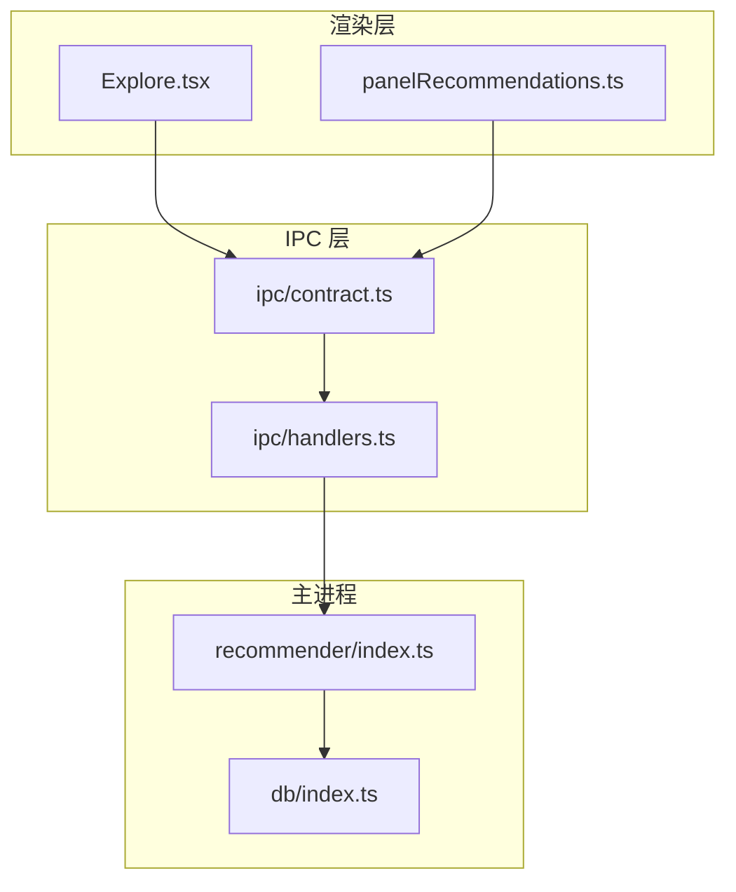
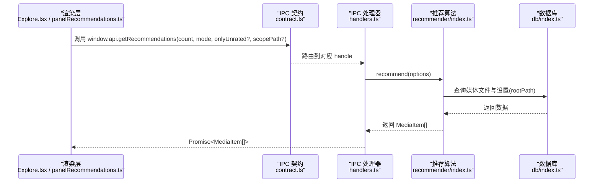
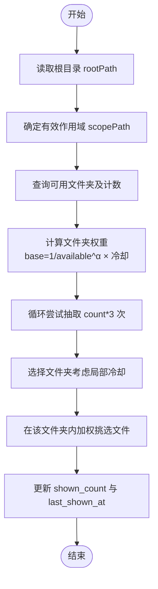
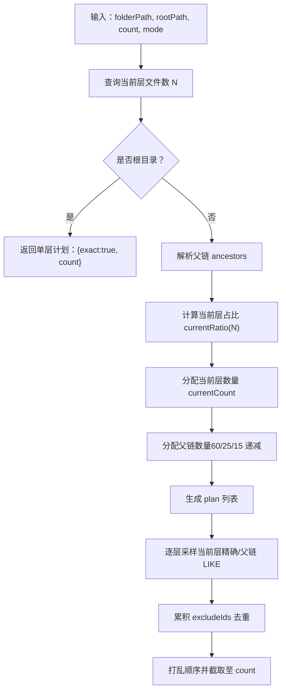
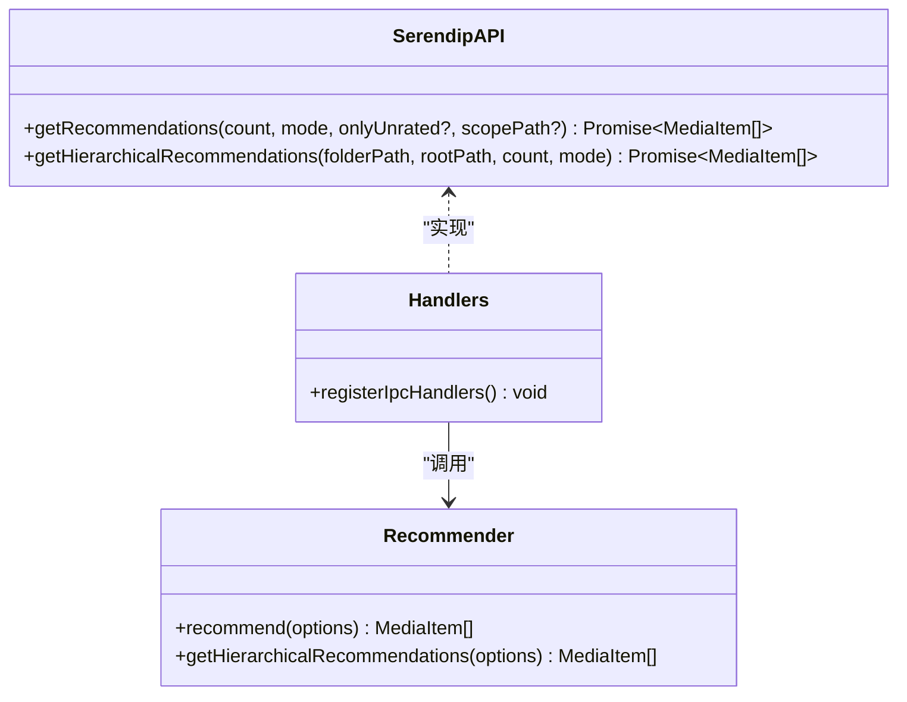
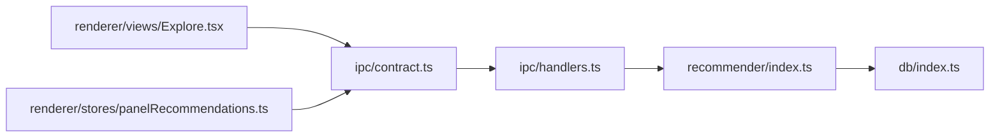

# 推荐系统处理器

<cite>
**本文引用的文件列表**
- [src/main/recommender/index.ts](file://src/main/recommender/index.ts)
- [src/main/ipc/handlers.ts](file://src/main/ipc/handlers.ts)
- [src/main/ipc/contract.ts](file://src/main/ipc/contract.ts)
- [src/renderer/src/stores/panelRecommendations.ts](file://src/renderer/src/stores/panelRecommendations.ts)
- [src/renderer/src/views/Explore.tsx](file://src/renderer/src/views/Explore.tsx)
- [src/main/db/index.ts](file://src/main/db/index.ts)
</cite>

## 目录
1. [简介](#简介)
2. [项目结构](#项目结构)
3. [核心组件](#核心组件)
4. [架构总览](#架构总览)
5. [详细组件分析](#详细组件分析)
6. [依赖关系分析](#依赖关系分析)
7. [性能与缓存策略](#性能与缓存策略)
8. [故障排查指南](#故障排查指南)
9. [结论](#结论)
10. [附录：参数调优与监控实践](#附录参数调优与监控实践)

## 简介
本文件面向 Serendip 应用的“智能推荐系统处理器”，聚焦以下目标：
- 深入解释 IPC 接口实现（主进程与渲染进程的通信契约）
- 详细说明 exploreMode 的三种模式及其处理逻辑
- 阐述分层推荐算法的实现与文件夹级别的权重计算
- 提供具体的推荐请求处理示例（含参数校验与结果格式化）
- 解释推荐结果的缓存策略与性能优化
- 给出算法调优与参数配置的最佳实践
- 包含推荐效果的监控与分析方法

## 项目结构
推荐系统涉及主进程、IPC 层与渲染层的协作，关键文件如下：
- 主进程推荐算法：src/main/recommender/index.ts
- IPC 通道与类型契约：src/main/ipc/contract.ts、src/main/ipc/handlers.ts
- 数据库与迁移：src/main/db/index.ts
- 渲染层使用端点：src/renderer/src/stores/panelRecommendations.ts、src/renderer/src/views/Explore.tsx

图表来源
- [src/main/ipc/contract.ts:84-130](file://src/main/ipc/contract.ts#L84-L130)
- [src/main/ipc/handlers.ts:84-91](file://src/main/ipc/handlers.ts#L84-L91)
- [src/main/recommender/index.ts:57-149](file://src/main/recommender/index.ts#L57-L149)
- [src/main/db/index.ts:1-28](file://src/main/db/index.ts#L1-L28)

章节来源
- [src/main/recommender/index.ts:1-518](file://src/main/recommender/index.ts#L1-L518)
- [src/main/ipc/handlers.ts:1-292](file://src/main/ipc/handlers.ts#L1-L292)
- [src/main/ipc/contract.ts:1-130](file://src/main/ipc/contract.ts#L1-L130)
- [src/renderer/src/stores/panelRecommendations.ts:1-128](file://src/renderer/src/stores/panelRecommendations.ts#L1-L128)
- [src/renderer/src/views/Explore.tsx:1-430](file://src/renderer/src/views/Explore.tsx#L1-L430)
- [src/main/db/index.ts:1-190](file://src/main/db/index.ts#L1-L190)

## 核心组件
- 推荐算法模块（主进程）
  - 两级加权抽样：先按权重选文件夹，再在文件夹内按权重选文件
  - 支持三种探索模式：prefer、balanced、explore
  - 支持分层推荐：以当前路径为锚点，逐级向上放宽采样范围
- IPC 契约与处理器（主进程）
  - 暴露 getRecommendations 与 getHierarchicalRecommendations 等 API
  - 负责参数透传与返回 MediaItem[]
- 渲染层调用方
  - Explore 视图：分页加载推荐内容
  - 详情页右侧面板：分层推荐，带去重与防抖

章节来源
- [src/main/recommender/index.ts:57-149](file://src/main/recommender/index.ts#L57-L149)
- [src/main/ipc/handlers.ts:84-91](file://src/main/ipc/handlers.ts#L84-L91)
- [src/renderer/src/views/Explore.tsx:65-103](file://src/renderer/src/views/Explore.tsx#L65-L103)
- [src/renderer/src/stores/panelRecommendations.ts:88-127](file://src/renderer/src/stores/panelRecommendations.ts#L88-L127)

## 架构总览
从渲染层到主进程的推荐请求流程如下：

图表来源
- [src/main/ipc/contract.ts:20-22](file://src/main/ipc/contract.ts#L20-L22)
- [src/main/ipc/handlers.ts:84-91](file://src/main/ipc/handlers.ts#L84-L91)
- [src/main/recommender/index.ts:57-149](file://src/main/recommender/index.ts#L57-L149)
- [src/main/db/index.ts:1-28](file://src/main/db/index.ts#L1-L28)

## 详细组件分析

### 推荐算法模块（主进程）
- 两级加权抽样
  - 文件夹级权重：基础权重 = 1 / available_count^α；结合冷却因子（最近显示时间）进行降权
  - 文件级权重：liked 加成、冷却因子、显示次数惩罚
- 探索模式参数
  - prefer：偏好放大、冷却弱、文件夹平均化弱
  - balanced：均衡
  - explore：更多探索，文件夹高度均权、冷却强、liked 不加成
- 分层推荐
  - 基于当前文件夹文件数决定当前层占比（最多 50%），父链按固定比例分配
  - 当前层精确匹配 folder_path，父链层用 LIKE 前缀递归采样
- 更新统计
  - 每批次抽中的文件更新 shown_count 与 last_shown_at，用于后续冷却与惩罚

图表来源
- [src/main/recommender/index.ts:57-149](file://src/main/recommender/index.ts#L57-L149)
- [src/main/recommender/index.ts:364-389](file://src/main/recommender/index.ts#L364-L389)
- [src/main/recommender/index.ts:394-448](file://src/main/recommender/index.ts#L394-L448)
- [src/main/recommender/index.ts:454-460](file://src/main/recommender/index.ts#L454-L460)

章节来源
- [src/main/recommender/index.ts:57-149](file://src/main/recommender/index.ts#L57-L149)
- [src/main/recommender/index.ts:155-206](file://src/main/recommender/index.ts#L155-L206)
- [src/main/recommender/index.ts:211-274](file://src/main/recommender/index.ts#L211-L274)
- [src/main/recommender/index.ts:279-359](file://src/main/recommender/index.ts#L279-L359)
- [src/main/recommender/index.ts:364-389](file://src/main/recommender/index.ts#L364-L389)
- [src/main/recommender/index.ts:394-448](file://src/main/recommender/index.ts#L394-L448)
- [src/main/recommender/index.ts:454-460](file://src/main/recommender/index.ts#L454-L460)
- [src/main/recommender/index.ts:471-504](file://src/main/recommender/index.ts#L471-L504)

#### 分层推荐算法与文件夹级别权重
- 分层计划构建
  - 根据当前层文件数 N 决定当前层占比：N≤2→0%，N≤15→25%，N≤50→35%，N≤200→45%，否则 50%
  - 若已在根目录则强制当前层 100%
  - 父链权重分配：60%/25%/15%（超过三层时余量归最后一层）
- 逐层采样
  - 当前层：精确匹配 folder_path
  - 父链层：LIKE 前缀递归调用 recommend，scopePath 限定范围
  - 累积 excludeIds 去重，最终 Fisher-Yates 打乱顺序并截取至 count

图表来源
- [src/main/recommender/index.ts:155-206](file://src/main/recommender/index.ts#L155-L206)
- [src/main/recommender/index.ts:211-274](file://src/main/recommender/index.ts#L211-L274)
- [src/main/recommender/index.ts:279-359](file://src/main/recommender/index.ts#L279-L359)

章节来源
- [src/main/recommender/index.ts:155-206](file://src/main/recommender/index.ts#L155-L206)
- [src/main/recommender/index.ts:211-274](file://src/main/recommender/index.ts#L211-L274)
- [src/main/recommender/index.ts:279-359](file://src/main/recommender/index.ts#L279-L359)

### IPC 接口实现
- 契约定义
  - 渲染层通过 window.api.* 调用主进程能力
  - 推荐相关接口：getRecommendations、getHierarchicalRecommendations
- 处理器实现
  - 接收参数后直接转发给推荐算法模块
  - 返回 MediaItem[] 供渲染层消费

图表来源
- [src/main/ipc/contract.ts:20-22](file://src/main/ipc/contract.ts#L20-L22)
- [src/main/ipc/handlers.ts:84-91](file://src/main/ipc/handlers.ts#L84-L91)
- [src/main/recommender/index.ts:57-149](file://src/main/recommender/index.ts#L57-L149)
- [src/main/recommender/index.ts:155-206](file://src/main/recommender/index.ts#L155-L206)

章节来源
- [src/main/ipc/contract.ts:1-130](file://src/main/ipc/contract.ts#L1-L130)
- [src/main/ipc/handlers.ts:84-91](file://src/main/ipc/handlers.ts#L84-L91)

### 探索模式 exploreMode 详解
- 模式含义
  - prefer：偏好放大，适合用户已建立明确喜好的场景
  - balanced：均衡，兼顾偏好与探索
  - explore：更多探索，适合冷启动或希望发现新内容的场景
- 参数差异（示意）
  - folderAlpha：越大越抑制大文件夹虹吸效应
  - likedBoost：对喜欢文件的加成倍数
  - fileCooldownHalfLifeSec/folderCooldownHalfLifeSec：冷却半衰期，越大越不容易重复
  - shownCountPenalty：显示次数惩罚，越大越鼓励发现未看过的内容
  - localCooldownDecay：同批次内文件夹被重抽的衰减系数

章节来源
- [src/main/recommender/index.ts:471-504](file://src/main/recommender/index.ts#L471-L504)

### 具体推荐请求处理示例
- 常规推荐（Explore 视图）
  - 渲染层调用：window.api.getRecommendations(BATCH_SIZE, exploreMode)
  - 参数说明：count 为正整数；mode 为 'prefer' | 'balanced' | 'explore'
  - 结果：MediaItem[]，渲染层做本地去重与追加
- 分层推荐（详情页右侧面板）
  - 渲染层调用：window.api.getHierarchicalRecommendations(folderPath, rootPath, count, mode)
  - 参数说明：folderPath 为当前详情所在文件夹；rootPath 为库根目录
  - 结果：MediaItem[]，面板侧做去重与增量加载

章节来源
- [src/renderer/src/views/Explore.tsx:65-103](file://src/renderer/src/views/Explore.tsx#L65-L103)
- [src/renderer/src/stores/panelRecommendations.ts:88-127](file://src/renderer/src/stores/panelRecommendations.ts#L88-L127)
- [src/main/ipc/handlers.ts:84-91](file://src/main/ipc/handlers.ts#L84-L91)

### 结果数据结构与格式化
- MediaItem 字段
  - id、path、folder_path、type、width、height、duration_ms、liked、disliked
- 过滤与清洗
  - 仅返回 disliked=0 且 unavailable=0 的文件
  - 可选 onlyUnrated 限制为未评级文件（评审模式）
- 排序与打乱
  - 分层推荐会 Fisher-Yates 打乱顺序，避免按层分组的视觉感

章节来源
- [src/main/recommender/index.ts:19-29](file://src/main/recommender/index.ts#L19-L29)
- [src/main/recommender/index.ts:78-98](file://src/main/recommender/index.ts#L78-L98)
- [src/main/recommender/index.ts:202-206](file://src/main/recommender/index.ts#L202-L206)

## 依赖关系分析
- 模块耦合
  - handlers.ts 依赖 contract.ts 的类型与通道名，并调用 recommender/index.ts
  - recommender/index.ts 依赖 db/index.ts 获取数据库连接与执行 SQL
  - 渲染层通过 window.api.* 间接依赖 contract.ts 的 SerendipAPI 类型
- 外部依赖
  - better-sqlite3 作为嵌入式数据库
  - Electron IPC 机制用于跨进程通信

图表来源
- [src/main/ipc/contract.ts:1-130](file://src/main/ipc/contract.ts#L1-L130)
- [src/main/ipc/handlers.ts:1-292](file://src/main/ipc/handlers.ts#L1-L292)
- [src/main/recommender/index.ts:1-518](file://src/main/recommender/index.ts#L1-L518)
- [src/main/db/index.ts:1-190](file://src/main/db/index.ts#L1-L190)
- [src/renderer/src/views/Explore.tsx:1-430](file://src/renderer/src/views/Explore.tsx#L1-L430)
- [src/renderer/src/stores/panelRecommendations.ts:1-128](file://src/renderer/src/stores/panelRecommendations.ts#L1-L128)

章节来源
- [src/main/ipc/contract.ts:1-130](file://src/main/ipc/contract.ts#L1-L130)
- [src/main/ipc/handlers.ts:1-292](file://src/main/ipc/handlers.ts#L1-L292)
- [src/main/recommender/index.ts:1-518](file://src/main/recommender/index.ts#L1-L518)
- [src/main/db/index.ts:1-190](file://src/main/db/index.ts#L1-L190)
- [src/renderer/src/views/Explore.tsx:1-430](file://src/renderer/src/views/Explore.tsx#L1-L430)
- [src/renderer/src/stores/panelRecommendations.ts:1-128](file://src/renderer/src/stores/panelRecommendations.ts#L1-L128)

## 性能与缓存策略
- 数据库层面
  - WAL 模式提升并发读写性能
  - 针对常用查询列创建索引（如 folder_path、liked、disliked、last_shown_at、unavailable）
- 算法层面
  - 两级抽样减少全表扫描成本
  - 冷却函数与显示次数惩罚降低重复曝光
  - 分层推荐将搜索空间限制在合理范围内
- 渲染层
  - 分页加载与去重，避免重复请求与渲染开销
  - 详情页面板采用防抖与 AbortController 取消旧请求

章节来源
- [src/main/db/index.ts:18-28](file://src/main/db/index.ts#L18-L28)
- [src/main/db/index.ts:54-77](file://src/main/db/index.ts#L54-L77)
- [src/main/recommender/index.ts:454-460](file://src/main/recommender/index.ts#L454-L460)
- [src/renderer/src/stores/panelRecommendations.ts:31-61](file://src/renderer/src/stores/panelRecommendations.ts#L31-L61)
- [src/renderer/src/stores/panelRecommendations.ts:88-127](file://src/renderer/src/stores/panelRecommendations.ts#L88-L127)

## 故障排查指南
- 常见问题
  - 无根目录：当 settings.rootPath 缺失时，推荐返回空数组
  - 文件失效：unavailable=1 的文件不参与推荐
  - 权限或路径问题：LIKE 转义需正确处理反斜杠与通配符
- 定位建议
  - 检查根目录设置与路径有效性
  - 确认 media_files 中 disliked/unavailable 标记
  - 观察 last_shown_at 与 shown_count 更新是否正常

章节来源
- [src/main/recommender/index.ts:65-74](file://src/main/recommender/index.ts#L65-L74)
- [src/main/recommender/index.ts:78-98](file://src/main/recommender/index.ts#L78-L98)
- [src/main/ipc/handlers.ts:149-171](file://src/main/ipc/handlers.ts#L149-L171)

## 结论
Serendip 的推荐系统通过两级加权抽样与分层推荐，实现了在大规模媒体库中的高效、可控的随机浏览体验。三种 exploreMode 提供了从“偏好”到“探索”的连续调节能力，配合数据库索引与渲染层分页/去重，整体具备良好的性能与可扩展性。

## 附录：参数调优与监控实践

### 参数调优最佳实践
- 冷启动阶段
  - 使用 explore 模式，增大 shownCountPenalty 与冷却半衰期，鼓励发现新内容
- 用户偏好稳定后
  - 切换到 prefer 或 balanced，适当提高 likedBoost，适度降低冷却强度
- 文件夹分布不均
  - 调整 folderAlpha 以抑制大文件夹虹吸效应；必要时扩大 scopePath 限定范围

章节来源
- [src/main/recommender/index.ts:471-504](file://src/main/recommender/index.ts#L471-L504)

### 监控与分析方法
- 指标采集建议
  - 每次推荐批次的 count、mode、scopePath、实际返回数量
  - 文件维度：shown_count、last_shown_at、liked/disliked 变更
  - 层级维度：分层推荐各层采样数量与命中率
- 可视化与报表
  - 绘制不同模式的曝光分布与重复率曲线
  - 统计文件夹覆盖率与长尾文件夹曝光情况
- 埋点位置
  - IPC 处理器入口/出口记录请求与响应
  - 推荐算法关键步骤记录耗时与中间状态（可选）

章节来源
- [src/main/ipc/handlers.ts:84-91](file://src/main/ipc/handlers.ts#L84-L91)
- [src/main/recommender/index.ts:136-149](file://src/main/recommender/index.ts#L136-L149)
- [src/main/recommender/index.ts:202-206](file://src/main/recommender/index.ts#L202-L206)