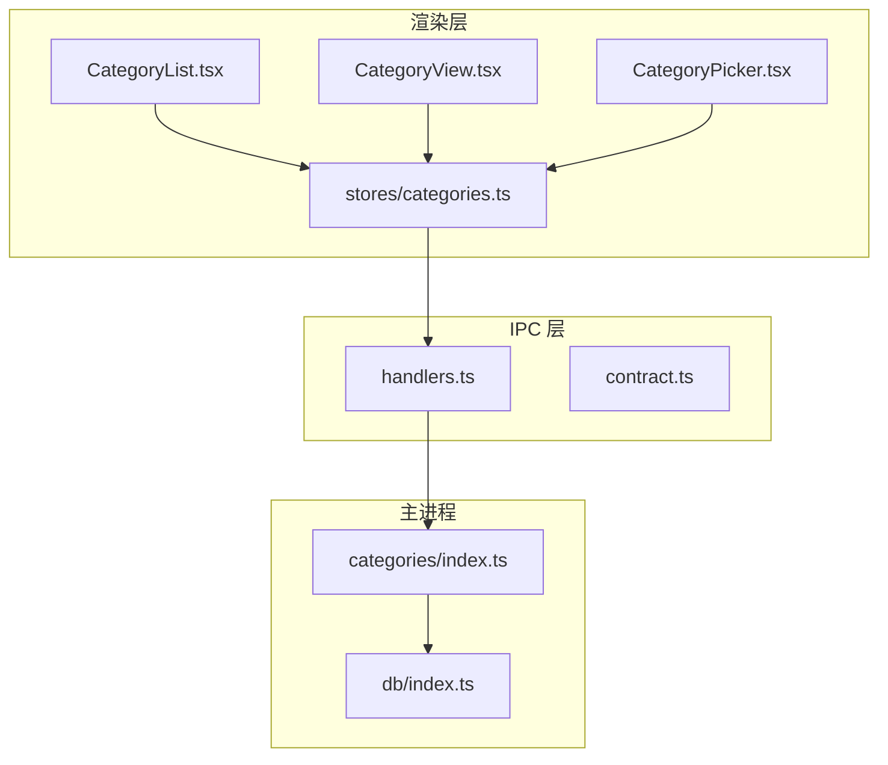
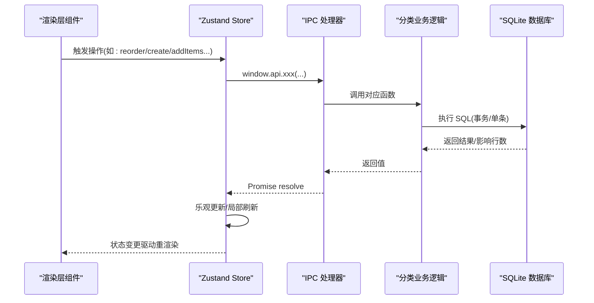
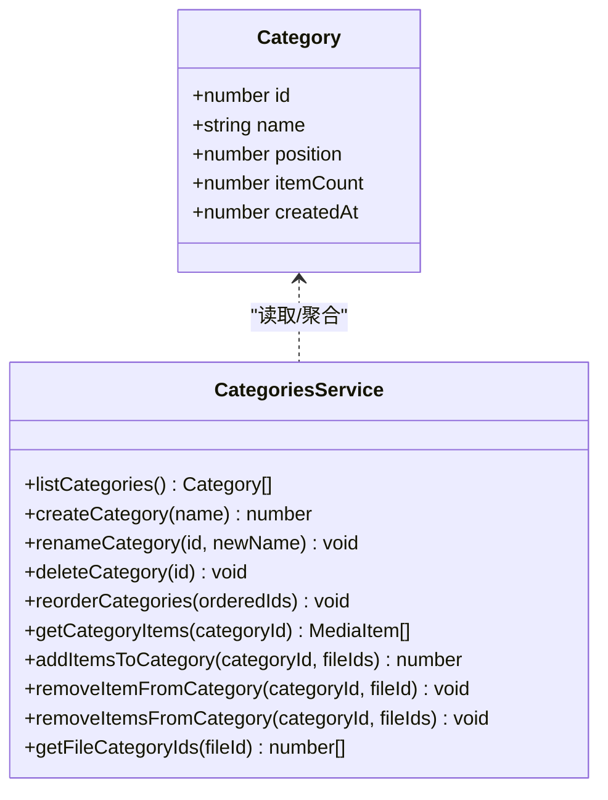
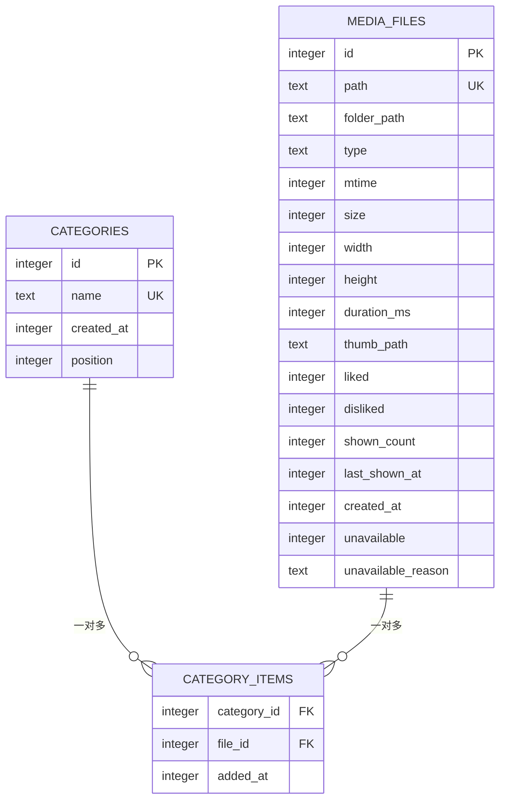
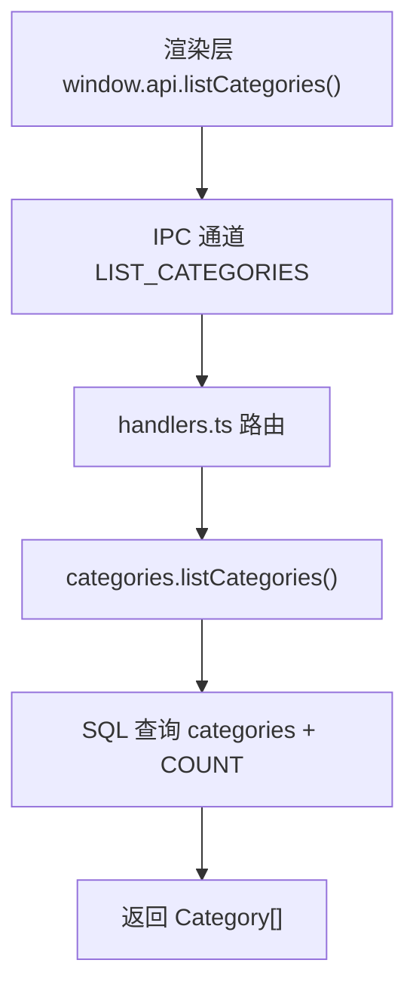
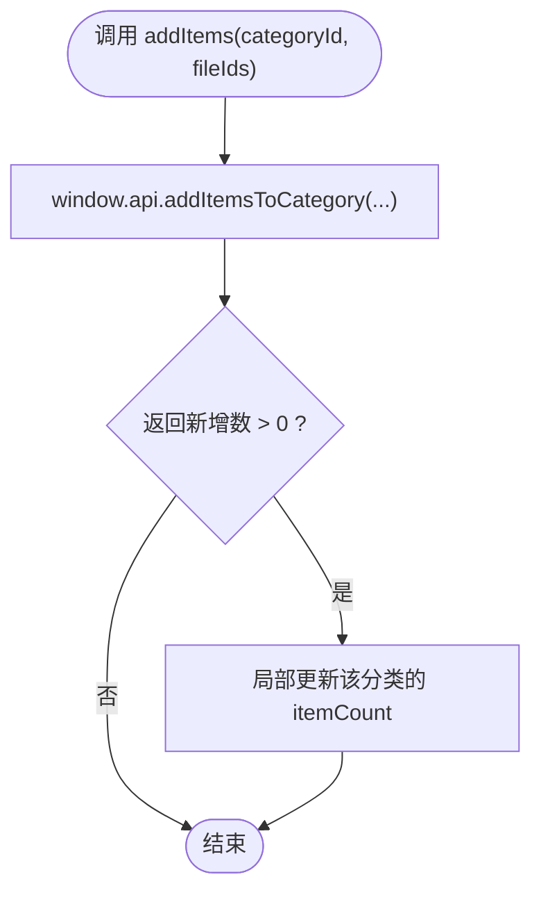
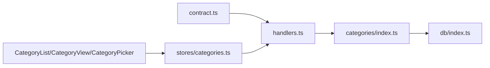

# 分类管理处理器

<cite>
**本文引用的文件**   
- [src/main/categories/index.ts](file://src/main/categories/index.ts)
- [src/main/db/index.ts](file://src/main/db/index.ts)
- [src/main/ipc/handlers.ts](file://src/main/ipc/handlers.ts)
- [src/main/ipc/contract.ts](file://src/main/ipc/contract.ts)
- [src/renderer/src/stores/categories.ts](file://src/renderer/src/stores/categories.ts)
- [src/renderer/src/components/CategoryList.tsx](file://src/renderer/src/components/CategoryList.tsx)
- [src/renderer/src/views/CategoryView.tsx](file://src/renderer/src/views/CategoryView.tsx)
- [src/renderer/src/components/CategoryPicker.tsx](file://src/renderer/src/components/CategoryPicker.tsx)
</cite>

## 目录
1. [简介](#简介)
2. [项目结构](#项目结构)
3. [核心组件](#核心组件)
4. [架构总览](#架构总览)
5. [详细组件分析](#详细组件分析)
6. [依赖关系分析](#依赖关系分析)
7. [性能与索引优化](#性能与索引优化)
8. [故障排查指南](#故障排查指南)
9. [结论](#结论)
10. [附录：API 使用示例](#附录api-使用示例)

## 简介
本文件为 Serendip 应用的“收藏分类”系统提供完整的技术文档，覆盖分类的 CRUD、排序、与媒体文件的多对多关联管理、前端交互与状态同步、IPC 通信契约、数据库迁移与索引策略，以及扩展性与兼容性建议。读者可据此理解从渲染层到主进程再到 SQLite 的端到端数据流与业务逻辑。

## 项目结构
分类管理涉及三层：
- 渲染层（React + Zustand）：负责用户交互、本地状态与乐观更新
- IPC 层（Electron）：暴露 API 通道并转发调用
- 主进程（Node.js + better-sqlite3）：实现业务逻辑与持久化

图表来源
- [src/renderer/src/components/CategoryList.tsx:1-212](file://src/renderer/src/components/CategoryList.tsx#L1-L212)
- [src/renderer/src/views/CategoryView.tsx:1-414](file://src/renderer/src/views/CategoryView.tsx#L1-L414)
- [src/renderer/src/components/CategoryPicker.tsx:1-173](file://src/renderer/src/components/CategoryPicker.tsx#L1-L173)
- [src/renderer/src/stores/categories.ts:1-95](file://src/renderer/src/stores/categories.ts#L1-L95)
- [src/main/ipc/handlers.ts:1-292](file://src/main/ipc/handlers.ts#L1-L292)
- [src/main/ipc/contract.ts:1-130](file://src/main/ipc/contract.ts#L1-L130)
- [src/main/categories/index.ts:1-166](file://src/main/categories/index.ts#L1-L166)
- [src/main/db/index.ts:1-190](file://src/main/db/index.ts#L1-L190)

章节来源
- [src/main/categories/index.ts:1-166](file://src/main/categories/index.ts#L1-L166)
- [src/main/db/index.ts:1-190](file://src/main/db/index.ts#L1-L190)
- [src/main/ipc/handlers.ts:1-292](file://src/main/ipc/handlers.ts#L1-L292)
- [src/main/ipc/contract.ts:1-130](file://src/main/ipc/contract.ts#L1-L130)
- [src/renderer/src/stores/categories.ts:1-95](file://src/renderer/src/stores/categories.ts#L1-L95)
- [src/renderer/src/components/CategoryList.tsx:1-212](file://src/renderer/src/components/CategoryList.tsx#L1-L212)
- [src/renderer/src/views/CategoryView.tsx:1-414](file://src/renderer/src/views/CategoryView.tsx#L1-L414)
- [src/renderer/src/components/CategoryPicker.tsx:1-173](file://src/renderer/src/components/CategoryPicker.tsx#L1-L173)

## 核心组件
- 分类领域模型与业务函数（主进程）
  - 数据结构：包含 id、name、position、itemCount、createdAt
  - 关键方法：列出、创建、重命名、删除、重排、获取分类下媒体项、添加/移除媒体项、查询文件所属分类
- IPC 契约与处理器（主进程）
  - 定义 SerendipAPI 接口与 IPC 通道名
  - 将渲染层调用映射到分类业务函数
- 渲染层 Store（Zustand）
  - 封装 window.api 调用，维护 categories 列表与计数
  - 支持乐观更新（重排时立即刷新本地顺序）
- 渲染层 UI 组件
  - CategoryList：侧栏分类列表，支持拖拽排序、右键菜单、折叠态提示
  - CategoryView：分类详情页，支持批量操作、上下文菜单、选择工具栏
  - CategoryPicker：弹出式分类选择器，支持搜索与快速新建

章节来源
- [src/main/categories/index.ts:12-166](file://src/main/categories/index.ts#L12-L166)
- [src/main/ipc/contract.ts:13-75](file://src/main/ipc/contract.ts#L13-L75)
- [src/main/ipc/handlers.ts:187-211](file://src/main/ipc/handlers.ts#L187-L211)
- [src/renderer/src/stores/categories.ts:22-94](file://src/renderer/src/stores/categories.ts#L22-L94)
- [src/renderer/src/components/CategoryList.tsx:41-110](file://src/renderer/src/components/CategoryList.tsx#L41-L110)
- [src/renderer/src/views/CategoryView.tsx:34-414](file://src/renderer/src/views/CategoryView.tsx#L34-L414)
- [src/renderer/src/components/CategoryPicker.tsx:25-173](file://src/renderer/src/components/CategoryPicker.tsx#L25-L173)

## 架构总览
分类管理的请求路径如下：
- 渲染层通过 window.api 调用 IPC 通道
- handlers.ts 接收请求并调用 categories/index.ts 的业务函数
- 业务函数访问 getDatabase() 进行 SQL 读写
- 渲染层 store 在成功后执行局部或全局状态更新

图表来源
- [src/renderer/src/stores/categories.ts:22-94](file://src/renderer/src/stores/categories.ts#L22-L94)
- [src/main/ipc/handlers.ts:187-211](file://src/main/ipc/handlers.ts#L187-L211)
- [src/main/categories/index.ts:20-94](file://src/main/categories/index.ts#L20-L94)
- [src/main/db/index.ts:8-28](file://src/main/db/index.ts#L8-L28)

## 详细组件分析

### 分类领域模型与业务函数（主进程）
- 数据模型
  - Category：id、name、position、itemCount、createdAt
- 主要能力
  - listCategories：按 position 升序返回分类及 itemCount
  - createCategory：校验名称长度与唯一性，分配最大 position+1
  - renameCategory：校验与唯一性约束
  - deleteCategory：级联删除关联
  - reorderCategories：事务内按传入 id 序列重写 position
  - getCategoryItems：返回分类下未失效媒体项，按加入时间倒序
  - addItemsToCategory：去重插入，返回新增数量
  - removeItemFromCategory/removeItemsFromCategory：单条/批量删除
  - getFileCategoryIds：返回文件所属的分类 id 列表

图表来源
- [src/main/categories/index.ts:12-166](file://src/main/categories/index.ts#L12-L166)

章节来源
- [src/main/categories/index.ts:20-166](file://src/main/categories/index.ts#L20-L166)

### 数据库迁移与索引策略
- 表结构
  - categories：id、name（UNIQUE）、created_at、position（用于排序）
  - category_items：category_id、file_id（复合主键），added_at；外键 ON DELETE CASCADE
- 迁移版本
  - v1：初始 schema（media_files、folders、categories、category_items、settings）
  - v2：media_files 增加 unavailable/unavailable_reason 字段与索引
  - v3：categories 增加 position 列与索引，并对已有分类初始化 position=id
  - v4：画布相关表（与分类无关）
- 索引
  - idx_categories_position：加速按 position 排序
  - idx_category_items_file：加速按 file_id 查询所属分类
  - media_files 相关索引：folder_path、type、liked/disliked 部分索引、last_shown_at、unavailable 部分索引

图表来源
- [src/main/db/index.ts:37-176](file://src/main/db/index.ts#L37-L176)

章节来源
- [src/main/db/index.ts:37-176](file://src/main/db/index.ts#L37-L176)

### IPC 契约与处理器
- 契约
  - SerendipAPI 中定义了所有分类相关方法签名
  - IPC 常量集中声明了通道名
- 处理器
  - 将 LIST_CATEGORIES、CREATE_CATEGORY、RENAME_CATEGORY、DELETE_CATEGORY、REORDER_CATEGORIES、GET_CATEGORY_ITEMS、ADD_ITEMS_TO_CATEGORY、REMOVE_ITEM_FROM_CATEGORY、REMOVE_ITEMS_FROM_CATEGORY、GET_FILE_CATEGORY_IDS 等通道映射到业务函数

图表来源
- [src/main/ipc/contract.ts:38-50](file://src/main/ipc/contract.ts#L38-L50)
- [src/main/ipc/handlers.ts:187-211](file://src/main/ipc/handlers.ts#L187-L211)
- [src/main/categories/index.ts:20-32](file://src/main/categories/index.ts#L20-L32)

章节来源
- [src/main/ipc/contract.ts:13-75](file://src/main/ipc/contract.ts#L13-L75)
- [src/main/ipc/handlers.ts:187-211](file://src/main/ipc/handlers.ts#L187-L211)

### 渲染层 Store（Zustand）
- 职责
  - 加载分类列表
  - 封装 create/rename/remove/reorder/addItems/removeItem/removeItems 等方法
  - 乐观更新：reorder 时直接按新顺序设置本地 position，避免闪烁
  - 局部更新：add/remove 后仅更新受影响分类的 itemCount
- 错误处理
  - 失败时回滚 UI 或重新拉取（例如移除失败时 reload）

图表来源
- [src/renderer/src/stores/categories.ts:61-72](file://src/renderer/src/stores/categories.ts#L61-L72)

章节来源
- [src/renderer/src/stores/categories.ts:22-94](file://src/renderer/src/stores/categories.ts#L22-L94)

### 渲染层 UI 组件
- CategoryList
  - 使用 @dnd-kit/sortable 实现分类拖拽排序
  - 支持右键菜单（重命名/删除）
  - 折叠模式下以 tooltip 展示名称与计数
- CategoryView
  - 加载分类下的媒体项
  - 支持多选、批量喜欢、批量添加到分类/画布、批量移除
  - 上下文菜单支持“添加到分类”子菜单（打开 CategoryPicker）
- CategoryPicker
  - 支持搜索过滤与快速创建新分类并选中
  - 智能定位（top/submenu/cursor）与边界检测

章节来源
- [src/renderer/src/components/CategoryList.tsx:41-212](file://src/renderer/src/components/CategoryList.tsx#L41-L212)
- [src/renderer/src/views/CategoryView.tsx:34-414](file://src/renderer/src/views/CategoryView.tsx#L34-L414)
- [src/renderer/src/components/CategoryPicker.tsx:25-173](file://src/renderer/src/components/CategoryPicker.tsx#L25-L173)

## 依赖关系分析
- 耦合与内聚
  - categories/index.ts 仅依赖 db 与类型，内聚度高
  - handlers.ts 作为薄路由层，低耦合
  - 渲染层通过 window.api 解耦具体实现
- 外部依赖
  - better-sqlite3：同步高性能 SQLite 绑定
  - Electron IPC：跨进程通信
  - @dnd-kit/sortable：拖拽排序
- 潜在循环依赖
  - 当前无循环引用；IPC 与业务层单向依赖

图表来源
- [src/main/ipc/contract.ts:1-130](file://src/main/ipc/contract.ts#L1-L130)
- [src/main/ipc/handlers.ts:1-292](file://src/main/ipc/handlers.ts#L1-L292)
- [src/main/categories/index.ts:1-166](file://src/main/categories/index.ts#L1-L166)
- [src/main/db/index.ts:1-190](file://src/main/db/index.ts#L1-L190)
- [src/renderer/src/stores/categories.ts:1-95](file://src/renderer/src/stores/categories.ts#L1-L95)
- [src/renderer/src/components/CategoryList.tsx:1-212](file://src/renderer/src/components/CategoryList.tsx#L1-L212)
- [src/renderer/src/views/CategoryView.tsx:1-414](file://src/renderer/src/views/CategoryView.tsx#L1-L414)
- [src/renderer/src/components/CategoryPicker.tsx:1-173](file://src/renderer/src/components/CategoryPicker.tsx#L1-L173)

## 性能与索引优化
- 数据库层面
  - WAL 模式与 NORMAL 同步级别提升并发与写入吞吐
  - categories.position 索引加速排序
  - category_items.file_id 索引加速“文件所属分类”查询
  - media_files 的部分索引（liked/disliked/unavailable）减少扫描范围
- 应用层面
  - 批量操作采用事务（reorder、addItems、removeItems）降低 IO 次数
  - 渲染层局部更新（只改受影响分类的 itemCount），避免整表重拉
  - 乐观更新（reorder）改善用户体验
- 查询优化
  - listCategories 使用子查询统计 itemCount，适合中小规模；若分类极多可考虑物化计数或增量更新
  - getCategoryItems 按 added_at 倒序，便于“最近加入优先”的浏览体验

[本节为通用性能讨论，不直接分析具体代码行]

## 故障排查指南
- 常见错误
  - 分类名重复：抛出“分类名已存在”，检查唯一约束
  - 分类不存在：重命名时若影响行为为 0，抛出“分类不存在”
  - 分类不存在：添加媒体前会校验分类是否存在
- 定位步骤
  - 确认 IPC 通道是否注册且参数正确
  - 查看主进程日志（迁移打印、异常堆栈）
  - 检查 SQLite 外键约束与级联删除是否符合预期
- 恢复策略
  - 渲染层在失败时回滚或重新拉取数据
  - 对于批量操作，确保事务原子性，失败则整体回滚

章节来源
- [src/main/categories/index.ts:35-82](file://src/main/categories/index.ts#L35-L82)
- [src/main/categories/index.ts:117-136](file://src/main/categories/index.ts#L117-L136)
- [src/renderer/src/views/CategoryView.tsx:145-156](file://src/renderer/src/views/CategoryView.tsx#L145-L156)

## 结论
分类管理系统以清晰的层次划分与强约束的数据模型为基础，结合事务与索引优化，提供了稳定高效的 CRUD、排序与多对多关联管理能力。渲染层的乐观更新与局部刷新进一步提升了交互体验。未来可在计数物化、分页/懒加载、更细粒度的权限控制等方面继续演进。

[本节为总结性内容，不直接分析具体代码行]

## 附录：API 使用示例
以下示例基于 IPC 契约与渲染层调用方式，描述典型用法（不展示源码片段）。

- 列出分类
  - 调用：window.api.listCategories()
  - 返回：Category[]，按 position 升序，附带 itemCount
  - 参考路径：[src/main/ipc/contract.ts:39](file://src/main/ipc/contract.ts#L39)、[src/main/ipc/handlers.ts:188](file://src/main/ipc/handlers.ts#L188)、[src/main/categories/index.ts:20-32](file://src/main/categories/index.ts#L20-L32)

- 创建分类
  - 调用：window.api.createCategory("旅行")
  - 返回：新分类 id
  - 注意：名称不能为空且不超过长度限制，重复名称抛错
  - 参考路径：[src/main/ipc/contract.ts:40](file://src/main/ipc/contract.ts#L40)、[src/main/ipc/handlers.ts:189](file://src/main/ipc/handlers.ts#L189)、[src/main/categories/index.ts:35-57](file://src/main/categories/index.ts#L35-L57)

- 重命名分类
  - 调用：window.api.renameCategory(id, "新名称")
  - 注意：唯一性校验与存在性校验
  - 参考路径：[src/main/ipc/contract.ts:41](file://src/main/ipc/contract.ts#L41)、[src/main/ipc/handlers.ts:190-192](file://src/main/ipc/handlers.ts#L190-L192)、[src/main/categories/index.ts:60-76](file://src/main/categories/index.ts#L60-L76)

- 删除分类
  - 调用：window.api.deleteCategory(id)
  - 说明：级联删除 category_items
  - 参考路径：[src/main/ipc/contract.ts:42](file://src/main/ipc/contract.ts#L42)、[src/main/ipc/handlers.ts:193](file://src/main/ipc/handlers.ts#L193)、[src/main/categories/index.ts:79-82](file://src/main/categories/index.ts#L79-L82)

- 重排分类
  - 调用：window.api.reorderCategories([id1, id2, ...])
  - 说明：按传入顺序分配 position=1..N，事务保证一致性
  - 参考路径：[src/main/ipc/contract.ts:43](file://src/main/ipc/contract.ts#L43)、[src/main/ipc/handlers.ts:194-196](file://src/main/ipc/handlers.ts#L194-L196)、[src/main/categories/index.ts:85-94](file://src/main/categories/index.ts#L85-L94)

- 获取分类下的媒体项
  - 调用：window.api.getCategoryItems(categoryId)
  - 返回：MediaItem[]，按 added_at 倒序，排除失效项
  - 参考路径：[src/main/ipc/contract.ts:44](file://src/main/ipc/contract.ts#L44)、[src/main/ipc/handlers.ts:197-199](file://src/main/ipc/handlers.ts#L197-L199)、[src/main/categories/index.ts:97-111](file://src/main/categories/index.ts#L97-L111)

- 批量添加媒体到分类
  - 调用：window.api.addItemsToCategory(categoryId, [fileId1, fileId2, ...])
  - 返回：实际新增数量（忽略重复）
  - 参考路径：[src/main/ipc/contract.ts:45](file://src/main/ipc/contract.ts#L45)、[src/main/ipc/handlers.ts:200-202](file://src/main/ipc/handlers.ts#L200-L202)、[src/main/categories/index.ts:117-136](file://src/main/categories/index.ts#L117-L136)

- 从分类移除媒体
  - 单条：window.api.removeItemFromCategory(categoryId, fileId)
  - 批量：window.api.removeItemsFromCategory(categoryId, [fileId1, ...])
  - 参考路径：[src/main/ipc/contract.ts:46-48](file://src/main/ipc/contract.ts#L46-L48)、[src/main/ipc/handlers.ts:203-208](file://src/main/ipc/handlers.ts#L203-L208)、[src/main/categories/index.ts:139-156](file://src/main/categories/index.ts#L139-L156)

- 查询文件所属分类
  - 调用：window.api.getFileCategoryIds(fileId)
  - 用途：评审视图胶囊高亮
  - 参考路径：[src/main/ipc/contract.ts:50](file://src/main/ipc/contract.ts#L50)、[src/main/ipc/handlers.ts:209-211](file://src/main/ipc/handlers.ts#L209-L211)、[src/main/categories/index.ts:159-165](file://src/main/categories/index.ts#L159-L165)

- 复杂查询与批量操作（推荐实践）
  - 批量喜欢/不喜欢：使用 setLikedBatch/setDislikedBatch（非分类专属，但常与分类视图配合）
  - 批量添加到分类：先 select 多选得到 fileIds，再调用 addItemsToCategory
  - 批量移除：使用 removeItemsFromCategory，并在渲染层做局部更新

章节来源
- [src/main/ipc/contract.ts:38-50](file://src/main/ipc/contract.ts#L38-L50)
- [src/main/ipc/handlers.ts:187-211](file://src/main/ipc/handlers.ts#L187-L211)
- [src/main/categories/index.ts:20-166](file://src/main/categories/index.ts#L20-L166)