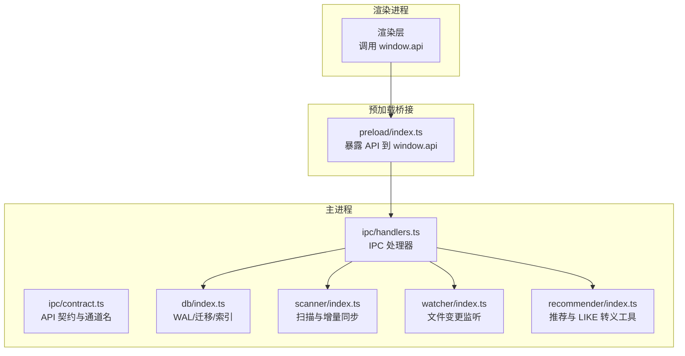
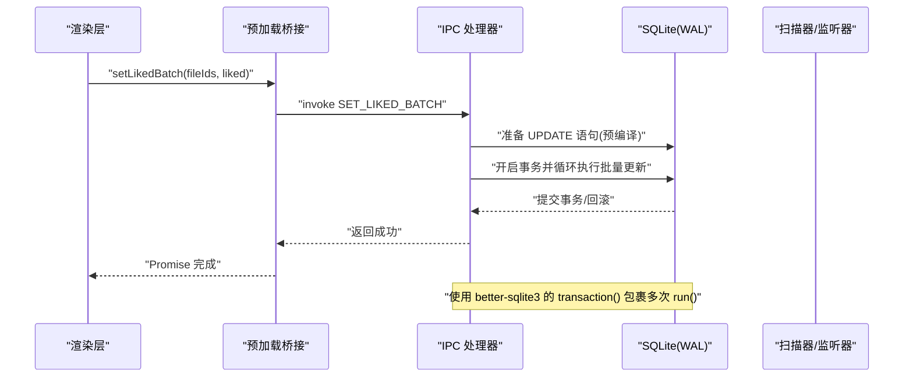
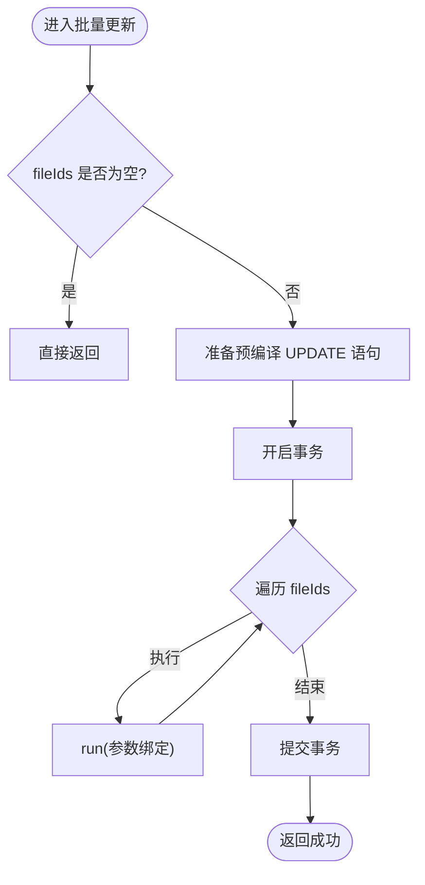
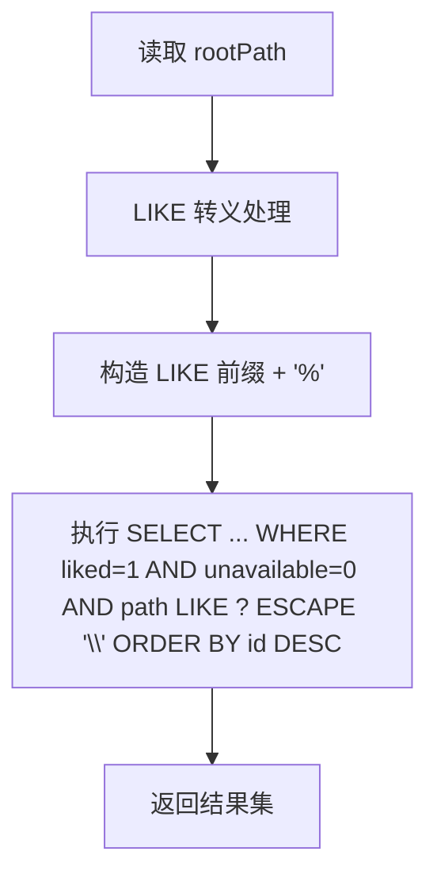
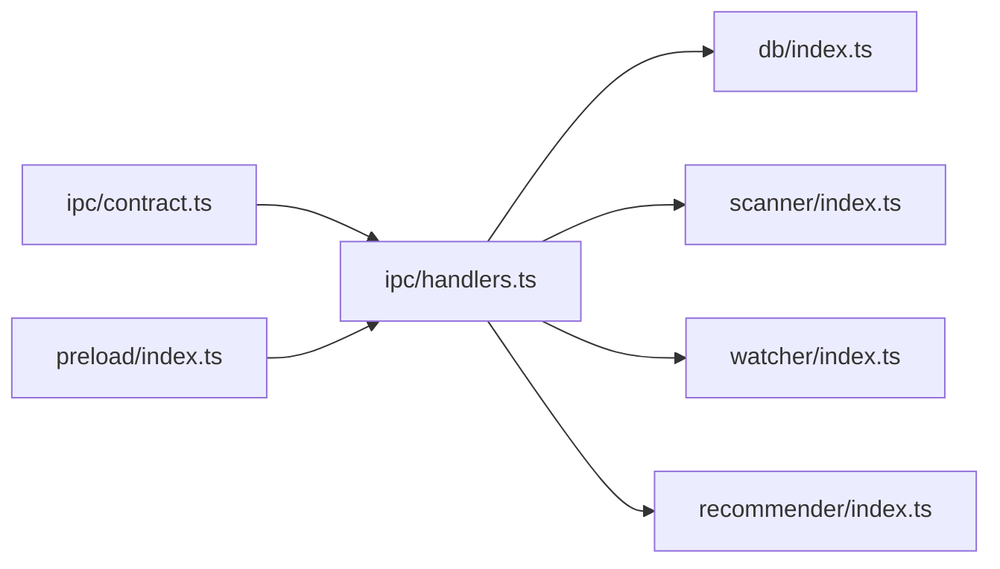

# 媒体文件操作处理器

<cite>
**本文引用的文件**
- [src/main/ipc/handlers.ts](file://src/main/ipc/handlers.ts)
- [src/main/ipc/contract.ts](file://src/main/ipc/contract.ts)
- [src/preload/index.ts](file://src/preload/index.ts)
- [src/main/db/index.ts](file://src/main/db/index.ts)
- [src/main/scanner/index.ts](file://src/main/scanner/index.ts)
- [src/main/recommender/index.ts](file://src/main/recommender/index.ts)
- [src/main/watcher/index.ts](file://src/main/watcher/index.ts)
</cite>

## 目录
1. [简介](#简介)
2. [项目结构](#项目结构)
3. [核心组件](#核心组件)
4. [架构总览](#架构总览)
5. [详细组件分析](#详细组件分析)
6. [依赖分析](#依赖分析)
7. [性能考虑](#性能考虑)
8. [故障排查指南](#故障排查指南)
9. [结论](#结论)
10. [附录](#附录)

## 简介
本文件面向 Serendip 应用中的“媒体文件操作处理器”，聚焦以下能力：
- 媒体文件的统计查询（总数、文件夹数、喜欢数）
- 单个与批量“喜欢/不感兴趣”状态管理
- 喜欢列表的过滤与排序
- 事务化批量更新机制（SET_LIKED_BATCH、SET_DISLIKED_BATCH）
- SQL LIKE 路径转义优化策略
- 数据一致性与完整性保证（事务、索引、约束）
- 预编译语句复用与批量写入优化
- 错误处理与异常场景的最佳实践

## 项目结构
媒体文件操作涉及主进程 IPC 处理器、数据库初始化与迁移、渲染层调用桥接，以及扫描器/监听器等辅助模块。下图展示与媒体文件操作相关的核心文件关系。

图表来源
- [src/preload/index.ts:1-104](file://src/preload/index.ts#L1-L104)
- [src/main/ipc/handlers.ts:1-292](file://src/main/ipc/handlers.ts#L1-L292)
- [src/main/ipc/contract.ts:1-130](file://src/main/ipc/contract.ts#L1-L130)
- [src/main/db/index.ts:1-190](file://src/main/db/index.ts#L1-L190)
- [src/main/scanner/index.ts:1-200](file://src/main/scanner/index.ts#L1-L200)
- [src/main/watcher/index.ts:58-116](file://src/main/watcher/index.ts#L58-L116)
- [src/main/recommender/index.ts:500-518](file://src/main/recommender/index.ts#L500-L518)

章节来源
- [src/main/ipc/handlers.ts:1-292](file://src/main/ipc/handlers.ts#L1-L292)
- [src/main/ipc/contract.ts:1-130](file://src/main/ipc/contract.ts#L1-L130)
- [src/preload/index.ts:1-104](file://src/preload/index.ts#L1-L104)
- [src/main/db/index.ts:1-190](file://src/main/db/index.ts#L1-L190)

## 核心组件
- IPC 契约与通道定义：集中声明 API 方法与通道常量，供渲染层与主进程共享类型与命名。
- IPC 处理器：实现具体业务逻辑，包括统计、喜欢/不感兴趣设置、批量更新、喜欢列表查询等。
- 数据库层：负责 SQLite 连接、WAL 模式、外键约束、表结构与索引迁移。
- 预加载桥接：将主进程 API 安全暴露给渲染进程。
- 扫描器与监听器：提供媒体文件入库、增量同步与失效标记等支持。
- 推荐器：提供 LIKE 路径转义工具函数，避免通配符误匹配。

章节来源
- [src/main/ipc/contract.ts:12-75](file://src/main/ipc/contract.ts#L12-L75)
- [src/main/ipc/handlers.ts:71-146](file://src/main/ipc/handlers.ts#L71-L146)
- [src/main/db/index.ts:18-28](file://src/main/db/index.ts#L18-L28)
- [src/preload/index.ts:9-32](file://src/preload/index.ts#L9-L32)

## 架构总览
媒体文件操作的端到端流程如下：渲染层通过 window.api 调用方法，预加载桥接转发至主进程 IPC 处理器，处理器访问数据库执行 SQL，必要时联动扫描器或监听器完成数据一致性维护。

图表来源
- [src/preload/index.ts:23-26](file://src/preload/index.ts#L23-L26)
- [src/main/ipc/handlers.ts:105-125](file://src/main/ipc/handlers.ts#L105-L125)
- [src/main/db/index.ts:18-28](file://src/main/db/index.ts#L18-L28)

## 详细组件分析

### 统计查询（GET_STATS）
- 功能：返回媒体文件总数、文件夹总数、已喜欢数量。
- 关键点：
  - 使用 COUNT(*) 聚合查询，利用索引加速过滤条件（如 liked=1）。
  - 读取 settings 表获取根路径信息用于其他查询（此处仅统计不涉及路径）。
- 性能：
  - 对 media_files.liked 存在部分索引，WHERE liked = 1 可命中索引。
  - 建议保持 WAL 模式与 NORMAL 同步级别以平衡并发与持久性。

章节来源
- [src/main/ipc/handlers.ts:71-81](file://src/main/ipc/handlers.ts#L71-L81)
- [src/main/db/index.ts:74-77](file://src/main/db/index.ts#L74-L77)

### 单个喜欢/不感兴趣（SET_LIKED / SET_DISLIKED）
- 功能：根据 fileId 切换 liked/disliked 标志位。
- 关键点：
  - 使用预编译 UPDATE 语句，参数绑定避免注入风险。
  - 布尔值转换为整数 0/1 存储。
- 一致性：
  - 单条更新天然原子；若需与多步操作组合，应使用事务包裹。

章节来源
- [src/main/ipc/handlers.ts:93-103](file://src/main/ipc/handlers.ts#L93-L103)

### 批量喜欢/不感兴趣（SET_LIKED_BATCH / SET_DISLIKED_BATCH）
- 功能：对多个 fileId 批量设置 liked/disliked。
- 关键实现：
  - 在处理器中创建预编译 UPDATE 语句，减少重复解析开销。
  - 使用 db.transaction 包裹循环 run，确保全部成功或全部失败。
  - 空数组快速返回，避免无意义事务。
- 复杂度：
  - 时间 O(n)，空间 O(1)（除参数数组外）。
- 注意事项：
  - 大批量时建议前端分片调用，避免单次参数过大。
  - 如需与其他写操作合并，应在更高层统一事务边界。

图表来源
- [src/main/ipc/handlers.ts:105-125](file://src/main/ipc/handlers.ts#L105-L125)

章节来源
- [src/main/ipc/handlers.ts:105-125](file://src/main/ipc/handlers.ts#L105-L125)

### 喜欢列表查询（LIST_LIKED）
- 功能：列出所有 liked=1 且未失效的文件，按 id 倒序（近似最近入库优先）。
- 关键点：
  - 从 settings 读取 rootPath，构造 LIKE 前缀过滤。
  - 对路径进行 LIKE 转义，防止反斜杠与通配符导致误匹配。
  - 使用 ESCAPE '\\' 显式指定转义字符，兼容 Windows 路径。
- 性能：
  - WHERE liked = 1 命中部分索引。
  - path LIKE ? 使用前缀匹配，结合文件系统路径特性通常可用索引（视具体引擎与统计信息而定）。

图表来源
- [src/main/ipc/handlers.ts:127-146](file://src/main/ipc/handlers.ts#L127-L146)
- [src/main/recommender/index.ts:506-509](file://src/main/recommender/index.ts#L506-L509)

章节来源
- [src/main/ipc/handlers.ts:127-146](file://src/main/ipc/handlers.ts#L127-L146)
- [src/main/recommender/index.ts:506-509](file://src/main/recommender/index.ts#L506-L509)

### 失效标记与恢复（MARK_UNAVAILABLE / 扫描解封）
- 功能：
  - 手动标记文件不可用（缩略图生成失败、文件缺失、损坏等），记录原因。
  - 扫描器在发现文件仍存在且 mtime/size 未变但被标记为不可用时，自动解封。
- 关键点：
  - unavailable 字段与 unavailable_reason 文本字段配合，便于诊断。
  - 扫描器使用事务批量更新，提升性能与一致性。

章节来源
- [src/main/ipc/handlers.ts:148-154](file://src/main/ipc/handlers.ts#L148-L154)
- [src/main/scanner/index.ts:117-121](file://src/main/scanner/index.ts#L117-L121)
- [src/main/scanner/index.ts:194-207](file://src/main/scanner/index.ts#L194-L207)

### 数据模型与索引（media_files）
- 关键字段：id、path、folder_path、type、mtime、size、width、height、duration_ms、thumb_path、liked、disliked、shown_count、last_shown_at、unavailable、unavailable_reason、created_at。
- 索引设计：
  - folder_path、type：常用过滤维度。
  - liked/disliked 的部分索引：加速只读筛选。
  - last_shown_at：推荐算法相关。
  - unavailable 的部分索引：快速定位失效文件。
- 约束：
  - path UNIQUE：避免重复入库。
  - 外键级联删除：关联表清理。

章节来源
- [src/main/db/index.ts:54-77](file://src/main/db/index.ts#L54-L77)
- [src/main/db/index.ts:123-127](file://src/main/db/index.ts#L123-L127)

### 预编译语句与事务批写
- 预编译语句：
  - 在处理器中预先 prepare UPDATE 语句，循环内仅 run 参数绑定，降低解析成本。
- 事务批写：
  - 使用 better-sqlite3 的 transaction 包装多次 run，确保原子性与性能。
  - 扫描器与监听器同样采用事务批量写入，减少磁盘 I/O 次数。

章节来源
- [src/main/ipc/handlers.ts:108-124](file://src/main/ipc/handlers.ts#L108-L124)
- [src/main/scanner/index.ts:123-132](file://src/main/scanner/index.ts#L123-L132)
- [src/main/watcher/index.ts:92-116](file://src/main/watcher/index.ts#L92-L116)

### 路径 LIKE 转义策略
- 问题：Windows 路径包含反斜杠，SQL LIKE 默认转义符可能冲突；% 与 _ 作为通配符需转义。
- 方案：
  - 统一使用 escapeLike 工具函数对路径进行转义。
  - 在 SQL 中使用 ESCAPE '\\' 明确转义字符。
- 适用场景：
  - 喜欢列表查询、扫描器按根路径范围操作、推荐器作用域过滤等。

章节来源
- [src/main/ipc/handlers.ts:134-145](file://src/main/ipc/handlers.ts#L134-L145)
- [src/main/scanner/index.ts:60-63](file://src/main/scanner/index.ts#L60-L63)
- [src/main/recommender/index.ts:506-509](file://src/main/recommender/index.ts#L506-L509)

### 错误处理与异常最佳实践
- 单点失败不回滚：
  - 单个 SET_LIKED/SET_DISLIKED 无事务包裹，失败不影响后续调用；适合幂等操作。
- 批量失败整体回滚：
  - SET_LIKED_BATCH/SET_DISLIKED_BATCH 使用事务，任一失败则整体回滚，保证一致性。
- 外部资源异常：
  - 打开文件/显示文件夹时，若文件不存在则标记 unavailable，避免脏引用。
- 日志与诊断：
  - unavailable_reason 记录失败原因，便于追踪与修复。

章节来源
- [src/main/ipc/handlers.ts:93-103](file://src/main/ipc/handlers.ts#L93-L103)
- [src/main/ipc/handlers.ts:105-125](file://src/main/ipc/handlers.ts#L105-L125)
- [src/main/ipc/handlers.ts:156-171](file://src/main/ipc/handlers.ts#L156-L171)

## 依赖分析
- 组件耦合：
  - IPC 处理器依赖数据库层、扫描器、监听器与推荐器工具函数。
  - 预加载桥接仅负责类型与通道映射，低耦合。
- 外部依赖：
  - better-sqlite3：提供同步 API、事务与预编译语句。
  - Electron：IPC、文件系统访问、窗口控制。
- 潜在循环依赖：
  - 当前结构清晰，未见循环导入。

图表来源
- [src/main/ipc/contract.ts:84-130](file://src/main/ipc/contract.ts#L84-L130)
- [src/preload/index.ts:1-32](file://src/preload/index.ts#L1-L32)
- [src/main/ipc/handlers.ts:1-40](file://src/main/ipc/handlers.ts#L1-L40)

章节来源
- [src/main/ipc/contract.ts:84-130](file://src/main/ipc/contract.ts#L84-L130)
- [src/preload/index.ts:1-32](file://src/preload/index.ts#L1-L32)
- [src/main/ipc/handlers.ts:1-40](file://src/main/ipc/handlers.ts#L1-L40)

## 性能考虑
- 数据库层面：
  - 启用 WAL 模式与 NORMAL 同步级别，提高并发读写性能。
  - 针对 liked/disliked/unavailable 建立部分索引，缩小扫描范围。
- 查询优化：
  - 使用预编译语句减少解析开销。
  - LIKE 前缀匹配配合转义，避免全表扫描。
- 批量写入：
  - 使用事务包裹多次 run，显著降低 I/O 次数。
  - 扫描器与监听器均采用分批处理与事务封装。
- 前端交互：
  - 批量操作建议分片调用，避免单次参数过大导致序列化与传输开销。

章节来源
- [src/main/db/index.ts:18-28](file://src/main/db/index.ts#L18-L28)
- [src/main/db/index.ts:74-77](file://src/main/db/index.ts#L74-L77)
- [src/main/scanner/index.ts:123-132](file://src/main/scanner/index.ts#L123-L132)
- [src/main/watcher/index.ts:92-116](file://src/main/watcher/index.ts#L92-L116)

## 故障排查指南
- 现象：批量更新后部分文件状态不一致
  - 检查是否使用了事务包裹；确认是否有上层事务嵌套导致意外回滚。
- 现象：喜欢列表为空或结果异常
  - 检查 rootPath 是否正确设置；确认 LIKE 转义是否生效；验证 unavailable 标记。
- 现象：打开文件失败但仍显示在列表
  - 检查是否存在“文件不存在”分支，确保触发 unavailable 标记。
- 现象：性能退化
  - 评估批量大小与事务粒度；检查索引是否命中；确认 WAL 模式与同步级别配置。

章节来源
- [src/main/ipc/handlers.ts:127-146](file://src/main/ipc/handlers.ts#L127-L146)
- [src/main/ipc/handlers.ts:156-171](file://src/main/ipc/handlers.ts#L156-L171)
- [src/main/db/index.ts:18-28](file://src/main/db/index.ts#L18-L28)

## 结论
Serendip 的媒体文件操作处理器通过清晰的 IPC 契约、预编译语句与事务批写，实现了高效且一致的媒体状态管理。配合完善的索引设计与 LIKE 路径转义策略，系统在大数据量下仍保持良好性能与稳定性。建议在大规模批量操作中继续采用分片与事务封装，并在异常路径上完善日志与诊断信息。

## 附录
- 典型用法示例（概念说明）
  - 单个文件喜欢：调用 setLiked(fileId, true)。
  - 批量文件喜欢：调用 setLikedBatch([id1, id2, ...], true)。
  - 批量文件不感兴趣：调用 setDislikedBatch([id1, id2, ...], false)。
  - 查看喜欢列表：调用 listLiked()，后端基于 liked=1 与 unavailable=0 过滤并按 id 倒序返回。
- 参考实现位置
  - 单个/批量设置：[src/main/ipc/handlers.ts:93-125](file://src/main/ipc/handlers.ts#L93-L125)
  - 喜欢列表查询：[src/main/ipc/handlers.ts:127-146](file://src/main/ipc/handlers.ts#L127-L146)
  - 预加载桥接：[src/preload/index.ts:19-26](file://src/preload/index.ts#L19-L26)
  - 数据库迁移与索引：[src/main/db/index.ts:54-77](file://src/main/db/index.ts#L54-L77)
  - LIKE 转义工具：[src/main/recommender/index.ts:506-509](file://src/main/recommender/index.ts#L506-L509)