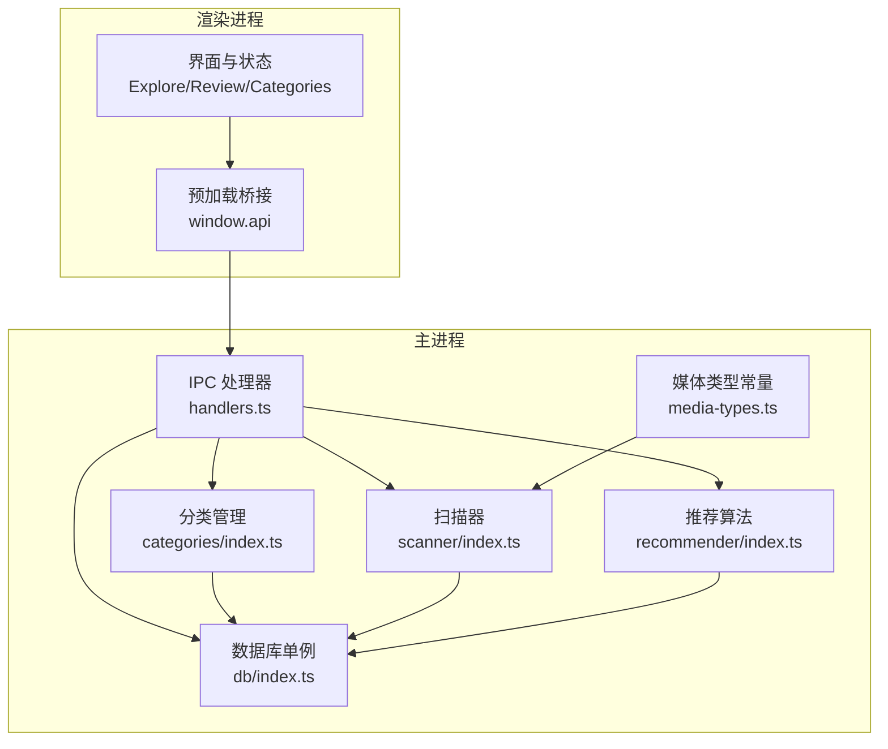
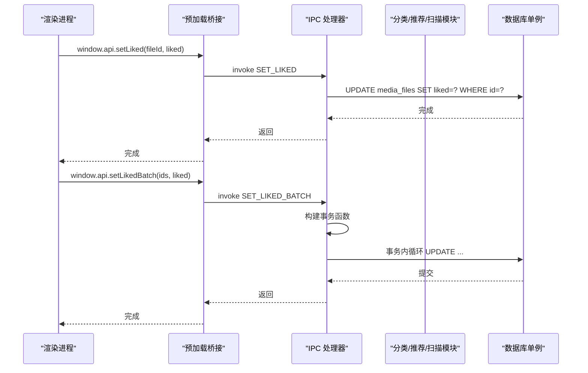
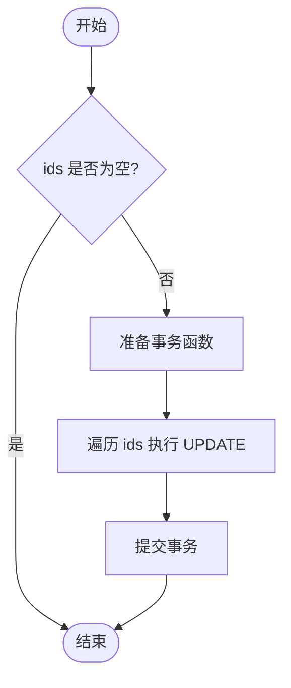
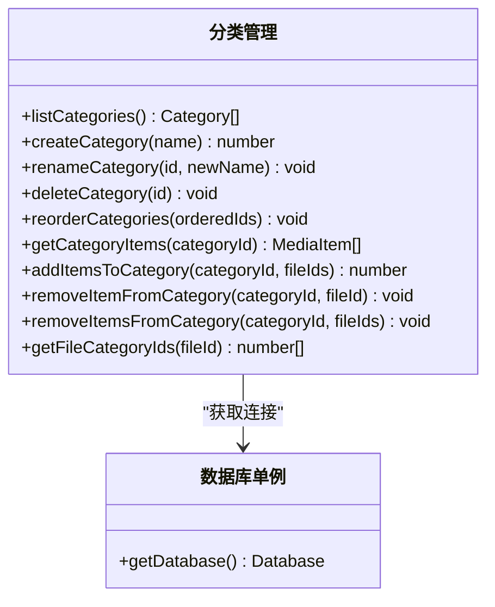
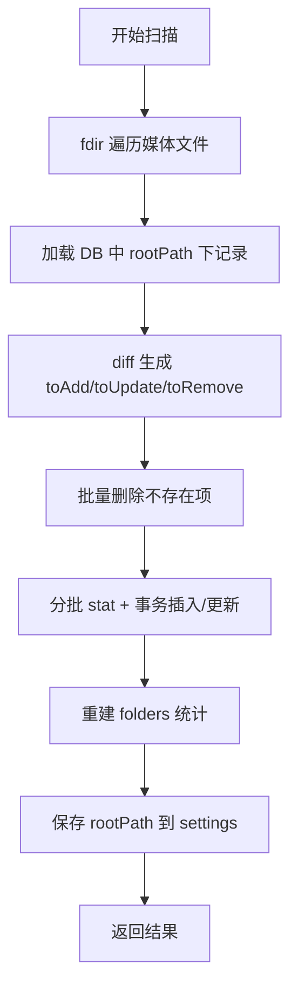
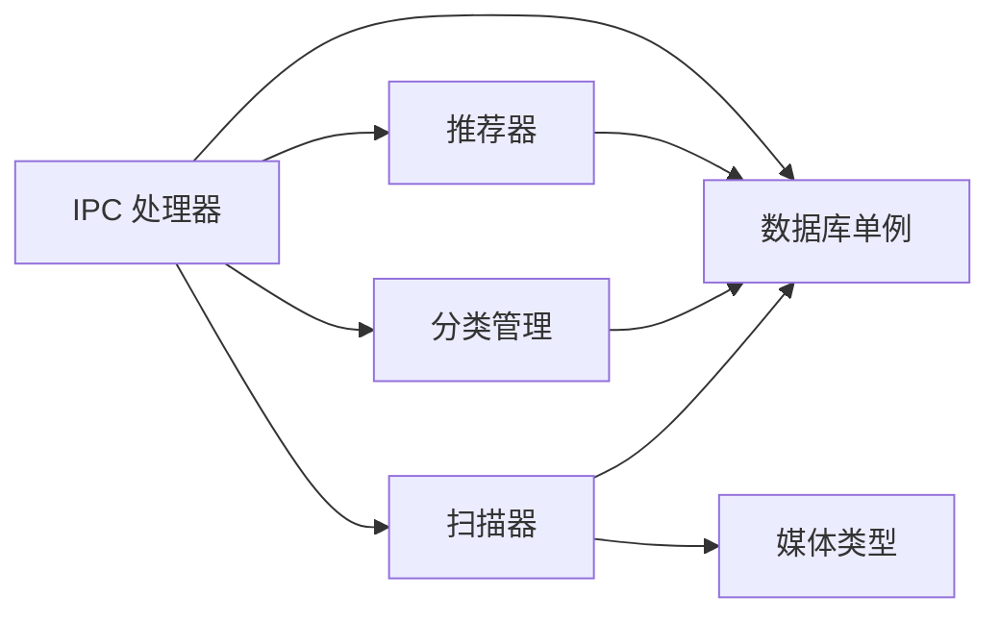

# 数据库操作处理器

<cite>
**本文引用的文件列表**
- [src/main/db/index.ts](file://src/main/db/index.ts)
- [src/main/ipc/handlers.ts](file://src/main/ipc/handlers.ts)
- [src/main/ipc/contract.ts](file://src/main/ipc/contract.ts)
- [src/main/scanner/index.ts](file://src/main/scanner/index.ts)
- [src/main/recommender/index.ts](file://src/main/recommender/index.ts)
- [src/main/categories/index.ts](file://src/main/categories/index.ts)
- [src/main/media-types.ts](file://src/main/media-types.ts)
- [src/preload/index.ts](file://src/preload/index.ts)
</cite>

## 目录
1. [简介](#简介)
2. [项目结构](#项目结构)
3. [核心组件](#核心组件)
4. [架构总览](#架构总览)
5. [详细组件分析](#详细组件分析)
6. [依赖关系分析](#依赖关系分析)
7. [性能与优化](#性能与优化)
8. [故障排查指南](#故障排查指南)
9. [结论](#结论)
10. [附录：迁移与版本管理最佳实践](#附录迁移与版本管理最佳实践)

## 简介
本文件聚焦 Serendip 应用的数据库操作处理器，系统性阐述媒体文件统计、喜欢状态管理、分类管理等数据库操作的实现方式；深入解释批量更新的事务处理机制；总结 SQL 查询优化与索引策略；提供复杂查询与批量写入示例路径；说明数据一致性与完整性保证机制；并给出连接池、缓存、迁移与版本管理的最佳实践。

## 项目结构
Serendip 使用 Electron 主进程通过 better-sqlite3 访问 SQLite 数据库，渲染进程通过 IPC 调用主进程暴露的 API。数据库初始化、迁移、WAL 模式等集中在数据库模块；IPC 层将业务逻辑（推荐、扫描、分类、画布）与前端解耦；扫描器负责增量同步文件系统到数据库；分类模块提供收藏分类 CRUD 与多对多关联管理。

图表来源
- [src/main/ipc/handlers.ts:1-292](file://src/main/ipc/handlers.ts#L1-L292)
- [src/main/db/index.ts:1-190](file://src/main/db/index.ts#L1-L190)
- [src/main/scanner/index.ts:1-323](file://src/main/scanner/index.ts#L1-L323)
- [src/main/recommender/index.ts:1-518](file://src/main/recommender/index.ts#L1-L518)
- [src/main/categories/index.ts:1-166](file://src/main/categories/index.ts#L1-L166)
- [src/main/media-types.ts:1-38](file://src/main/media-types.ts#L1-L38)

章节来源
- [src/main/ipc/handlers.ts:1-292](file://src/main/ipc/handlers.ts#L1-L292)
- [src/main/db/index.ts:1-190](file://src/main/db/index.ts#L1-L190)

## 核心组件
- 数据库单例与迁移：负责 WAL 模式、外键约束、索引创建与迁移执行。
- IPC 处理器：统一暴露给渲染进程的 API，封装事务与批处理。
- 扫描器：增量扫描文件系统，按批次事务写入 media_files 与 folders 统计表。
- 推荐器：两级加权抽样，基于 liked/disliked/unavailable/shown_count/last_shown_at 进行权重计算与冷却。
- 分类管理：分类元数据与多对多关联，支持重排、批量加入/移除、级联删除。
- 媒体类型：图片/视频扩展名集合与缩略图缓存目录常量。

章节来源
- [src/main/db/index.ts:1-190](file://src/main/db/index.ts#L1-L190)
- [src/main/ipc/handlers.ts:1-292](file://src/main/ipc/handlers.ts#L1-L292)
- [src/main/scanner/index.ts:1-323](file://src/main/scanner/index.ts#L1-L323)
- [src/main/recommender/index.ts:1-518](file://src/main/recommender/index.ts#L1-L518)
- [src/main/categories/index.ts:1-166](file://src/main/categories/index.ts#L1-L166)
- [src/main/media-types.ts:1-38](file://src/main/media-types.ts#L1-L38)

## 架构总览
从渲染进程发起请求，经预加载桥接到主进程 IPC 处理器，再进入具体业务模块（推荐、扫描、分类），最终通过数据库单例执行 SQL。所有写操作尽量使用事务包裹，读操作利用索引与条件过滤提升性能。

图表来源
- [src/preload/index.ts:1-104](file://src/preload/index.ts#L1-L104)
- [src/main/ipc/handlers.ts:94-125](file://src/main/ipc/handlers.ts#L94-L125)
- [src/main/db/index.ts:1-190](file://src/main/db/index.ts#L1-L190)

## 详细组件分析

### 数据库单例与迁移
- 连接与配置
  - 使用 better-sqlite3 打开用户数据目录下的 serendip.db。
  - 启用 WAL 模式、NORMAL 同步、开启外键约束，提高并发与一致性。
- 迁移系统
  - 维护 _migrations 表记录已应用版本。
  - 按 version 顺序执行 up SQL，包含初始 schema、失效标记、分类排序位置、画布相关表及索引。
- 关键索引
  - media_files: folder_path、type、liked(部分索引)、disliked(部分索引)、last_shown_at、unavailable(部分索引)。
  - categories: position。
  - category_items: file_id。
  - canvases: position。
  - canvas_items: canvas_id、file_id。

章节来源
- [src/main/db/index.ts:1-190](file://src/main/db/index.ts#L1-L190)

### 媒体文件统计
- 统计接口
  - GET_STATS 返回 totalFiles、totalFolders、liked 计数。
- 文件夹统计重建
  - 扫描完成后重建 folders 表，清空当前根范围后聚合 media_files 得到 file_count 与 recursive_count，并修正 parent_path 与 depth。
- 统计查询优化
  - 使用 GROUP BY folder_path 聚合，避免多次往返。
  - 使用 LIKE + ESCAPE 限定根范围，配合索引加速。

章节来源
- [src/main/ipc/handlers.ts:72-81](file://src/main/ipc/handlers.ts#L72-L81)
- [src/main/scanner/index.ts:274-317](file://src/main/scanner/index.ts#L274-L317)

### 喜欢状态管理与批量更新
- 单条更新
  - SET_LIKED / SET_DISLIKED 直接 UPDATE 对应字段。
- 批量更新
  - SET_LIKED_BATCH / SET_DISLIKED_BATCH 使用 db.transaction 包裹循环 UPDATE，确保原子性。
- 列出喜欢
  - LIST_LIKED 在 rootPath 下筛选 liked=1 且 unavailable=0 的记录，使用 LIKE 前缀匹配并按 id 倒序。

图表来源
- [src/main/ipc/handlers.ts:105-125](file://src/main/ipc/handlers.ts#L105-L125)

章节来源
- [src/main/ipc/handlers.ts:94-146](file://src/main/ipc/handlers.ts#L94-L146)

### 分类管理
- 分类 CRUD
  - listCategories 返回 position 与 itemCount（子查询 COUNT）。
  - createCategory 校验名称长度与唯一性，分配最大 position+1。
  - renameCategory 校验与唯一性冲突处理。
  - deleteCategory 借助 ON DELETE CASCADE 自动清理 category_items。
- 排序与批量操作
  - reorderCategories 使用事务重写 position。
  - addItemsToCategory 使用 INSERT OR IGNORE 去重，返回实际新增数量。
  - removeItemsFromCategory 批量删除，使用事务。
- 查询优化
  - getCategoryItems 仅返回未失效项，按 added_at 倒序。
  - getFileCategoryIds 用于评审视图高亮。

图表来源
- [src/main/categories/index.ts:1-166](file://src/main/categories/index.ts#L1-L166)
- [src/main/db/index.ts:1-190](file://src/main/db/index.ts#L1-L190)

章节来源
- [src/main/categories/index.ts:1-166](file://src/main/categories/index.ts#L1-L166)

### 扫描与增量同步
- 流程
  - 使用 fdir 遍历目录树，过滤支持的媒体类型。
  - 与数据库现有记录 diff，生成 toAdd/toUpdate/toRemove。
  - 分批 stat 与事务写入，BATCH_SIZE=200。
  - 重建 folders 统计，保存 rootPath 到 settings。
- 失效恢复
  - 若 mtime/size 未变但被标记 unavailable，则解封。
- 进度推送
  - walking → diffing → inserting → done 阶段回调。

图表来源
- [src/main/scanner/index.ts:36-239](file://src/main/scanner/index.ts#L36-L239)
- [src/main/media-types.ts:1-38](file://src/main/media-types.ts#L1-L38)

章节来源
- [src/main/scanner/index.ts:1-323](file://src/main/scanner/index.ts#L1-L323)
- [src/main/media-types.ts:1-38](file://src/main/media-types.ts#L1-L38)

### 推荐算法与数据一致性
- 两级加权抽样
  - 文件夹权重 = 1 / available_count^α × 冷却因子。
  - 文件权重 = likedBoost × 冷却 × shown_count 惩罚。
- 冷却与偏好
  - 半衰期式衰减，控制近期曝光抑制。
  - 三种模式 prefer/balanced/explore 调整参数。
- 一致性保证
  - 每批抽取后批量更新 last_shown_at 与 shown_count，减少重复曝光。
  - 限制在 settings.rootPath 范围内抽样，LIKE 转义防止注入。

章节来源
- [src/main/recommender/index.ts:1-518](file://src/main/recommender/index.ts#L1-L518)

## 依赖关系分析
- 模块耦合
  - IPC 处理器依赖各业务模块（推荐、扫描、分类），并通过数据库单例访问存储。
  - 分类与推荐均依赖数据库单例，扫描器依赖媒体类型常量。
- 外部依赖
  - better-sqlite3 提供同步高性能数据库访问。
  - fdir 用于高效目录遍历。
- 潜在循环依赖
  - 当前无循环依赖，模块职责清晰。

图表来源
- [src/main/ipc/handlers.ts:1-292](file://src/main/ipc/handlers.ts#L1-L292)
- [src/main/db/index.ts:1-190](file://src/main/db/index.ts#L1-L190)
- [src/main/scanner/index.ts:1-323](file://src/main/scanner/index.ts#L1-L323)
- [src/main/recommender/index.ts:1-518](file://src/main/recommender/index.ts#L1-L518)
- [src/main/categories/index.ts:1-166](file://src/main/categories/index.ts#L1-L166)
- [src/main/media-types.ts:1-38](file://src/main/media-types.ts#L1-L38)

章节来源
- [src/main/ipc/handlers.ts:1-292](file://src/main/ipc/handlers.ts#L1-L292)

## 性能与优化
- 连接与并发
  - 使用 WAL 模式提升读写并发能力；synchronous=NORMAL 平衡安全与性能。
  - 单例连接避免频繁打开关闭开销。
- 事务与批处理
  - 批量更新（喜欢/不感兴趣）、分类重排、分类批量加入/移除、扫描写入均采用事务包裹，显著降低磁盘 IO 次数。
  - 扫描新增采用 200 条一批的批量事务，减少锁竞争。
- 索引策略
  - 针对常用过滤条件建立索引：folder_path、type、liked、disliked、last_shown_at、unavailable、position、file_id、canvas_id。
  - 使用部分索引（如 liked=1、disliked=1、unavailable=1）缩小索引体积，提高命中率。
- 查询优化
  - 使用 LIKE + ESCAPE 限定根路径范围，避免全表扫描。
  - 子查询 itemCount 仅在展示侧使用，必要时可考虑物化或异步刷新。
- 缓存建议
  - 可在内存中对高频只读数据（如分类列表、根路径）做短期缓存，结合变更事件刷新。
  - 缩略图已在文件系统层面缓存至 .serendip-cache，无需额外数据库缓存。
- 连接池说明
  - better-sqlite3 为同步库，通常以单连接运行；如需更高并发，可考虑分库或引入异步驱动，但需权衡复杂度。

[本节为通用指导，不直接分析具体文件]

## 故障排查指南
- 常见错误
  - 分类名重复：抛出友好中文错误信息，检查唯一约束与输入校验。
  - 分类不存在：更新影响行数为 0 时抛错，确认 ID 有效性。
  - 文件缺失：revealInFolder 检测到文件不存在时自动标记 unavailable。
- 调试建议
  - 查看 _migrations 表确认迁移是否成功应用。
  - 检查 WAL 文件是否存在，确认数据库处于 WAL 模式。
  - 关注扫描进度回调，定位 walking/diffing/inserting 阶段异常。
- 日志与回滚
  - 事务失败会自动回滚，确保数据一致性。
  - 建议在关键路径增加 try/catch 并记录错误上下文。

章节来源
- [src/main/categories/index.ts:34-82](file://src/main/categories/index.ts#L34-L82)
- [src/main/ipc/handlers.ts:148-171](file://src/main/ipc/handlers.ts#L148-L171)
- [src/main/db/index.ts:37-189](file://src/main/db/index.ts#L37-L189)

## 结论
Serendip 的数据库操作处理器以事务为核心，结合 WAL 模式与合理索引，实现了高效的媒体统计、喜欢状态管理与分类管理。扫描器采用增量同步与批量写入，推荐器通过两级加权与冷却机制保障用户体验。整体架构清晰、职责分离，具备良好的可扩展性与稳定性。

[本节为总结，不直接分析具体文件]

## 附录：迁移与版本管理最佳实践
- 迁移规则
  - 每次升级在 migrations 数组追加新条目，version 递增，never edit applied migrations。
  - up SQL 应幂等，避免重复执行导致异常。
- 索引与约束
  - 新增字段时评估是否需要索引，优先选择选择性高的列。
  - 使用部分索引减少体积，提升查询效率。
- 兼容性
  - 对旧数据提供默认值或迁移脚本，确保向后兼容。
- 测试
  - 在开发环境模拟迁移流程，验证 schema 变更与数据迁移正确性。
- 回滚策略
  - 由于 SQLite 不支持回滚迁移，设计时应保持向前兼容，谨慎修改已有列。

章节来源
- [src/main/db/index.ts:37-189](file://src/main/db/index.ts#L37-L189)