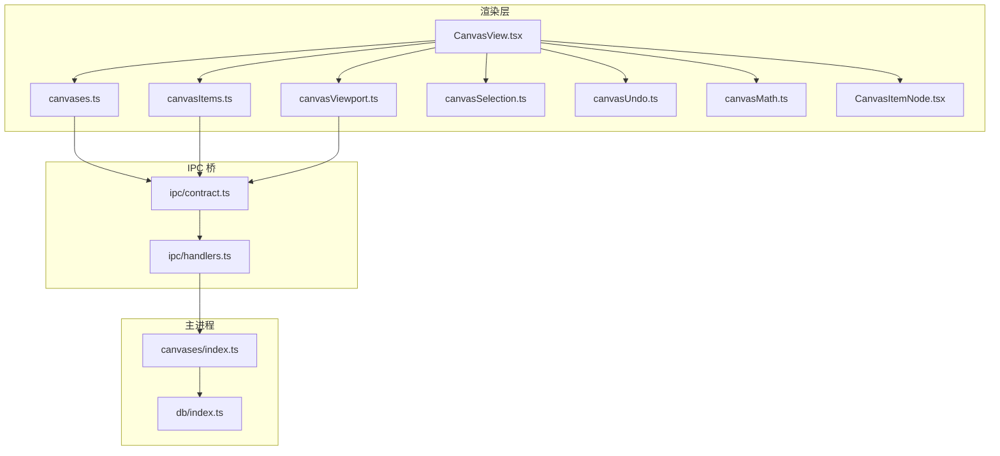
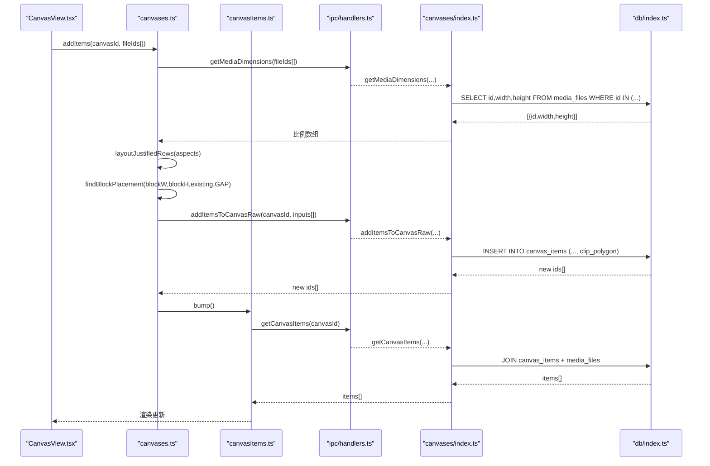
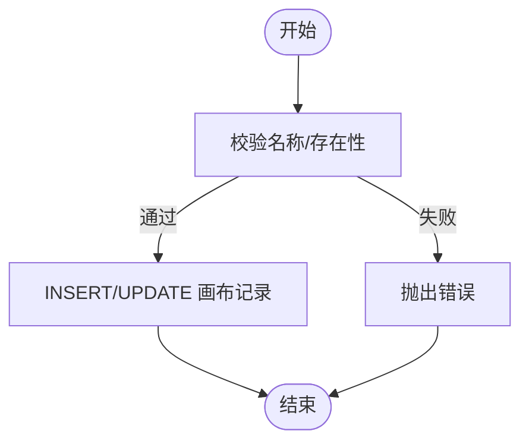
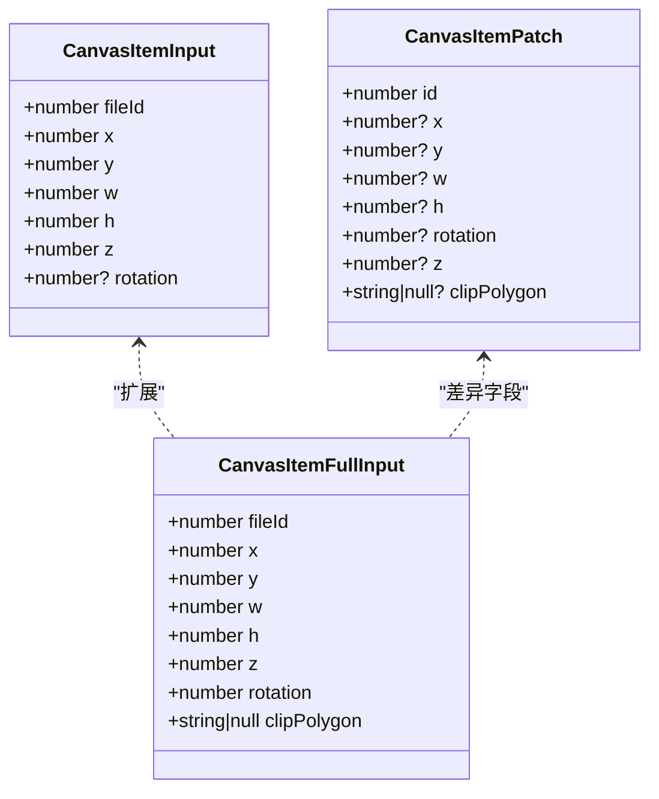
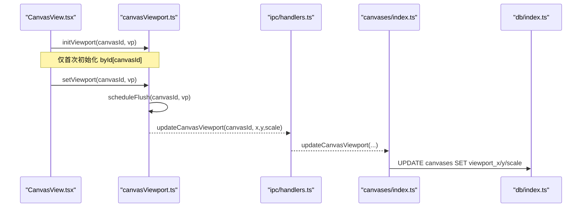
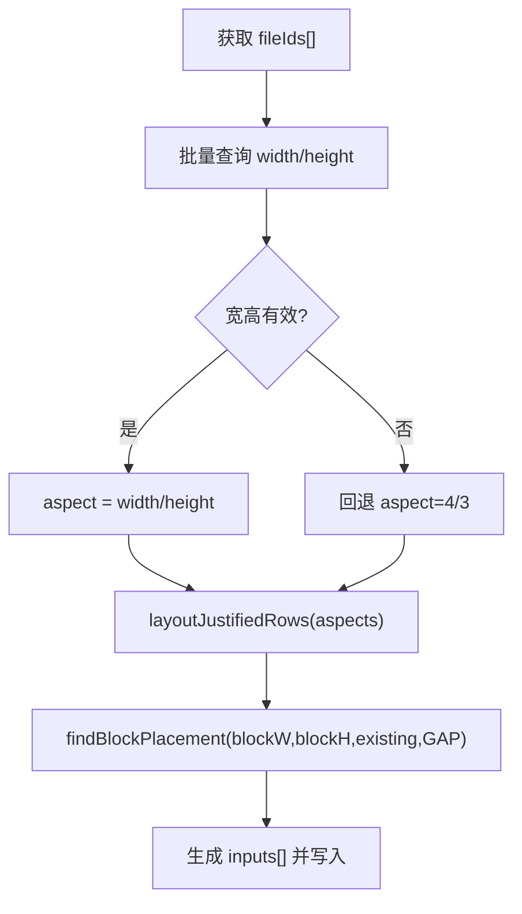
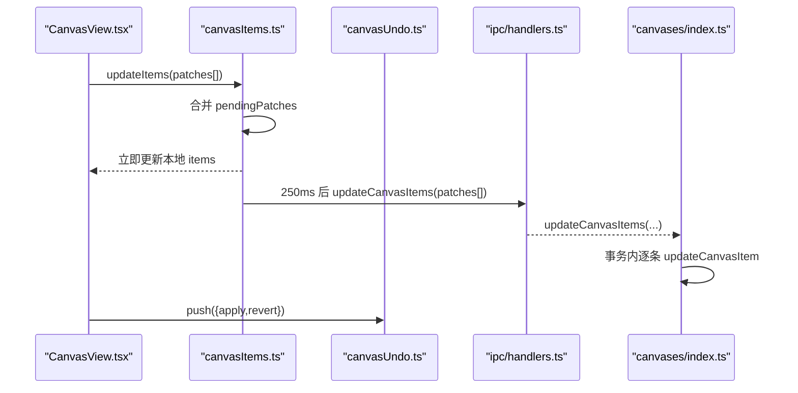
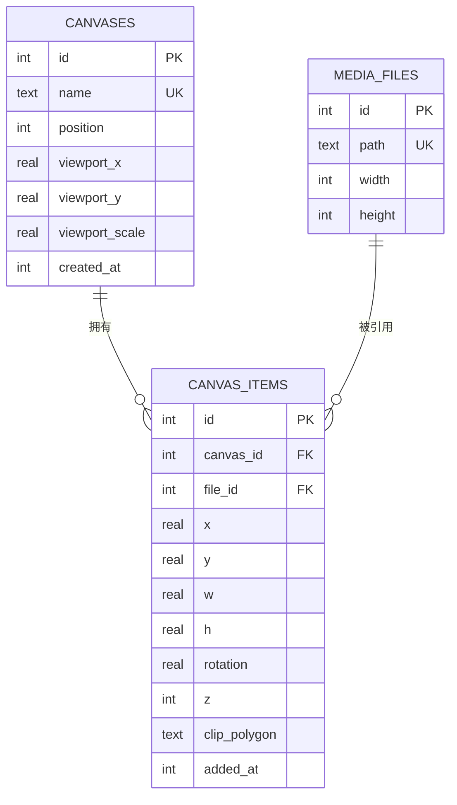

# 画布操作处理器

<cite>
**本文引用的文件**
- [src/main/canvases/index.ts](file://src/main/canvases/index.ts)
- [src/main/db/index.ts](file://src/main/db/index.ts)
- [src/main/ipc/handlers.ts](file://src/main/ipc/handlers.ts)
- [src/main/ipc/contract.ts](file://src/main/ipc/contract.ts)
- [src/renderer/src/stores/canvases.ts](file://src/renderer/src/stores/canvases.ts)
- [src/renderer/src/stores/canvasItems.ts](file://src/renderer/src/stores/canvasItems.ts)
- [src/renderer/src/stores/canvasViewport.ts](file://src/renderer/src/stores/canvasViewport.ts)
- [src/renderer/src/stores/currentCanvas.ts](file://src/renderer/src/stores/currentCanvas.ts)
- [src/renderer/src/stores/canvasSelection.ts](file://src/renderer/src/stores/canvasSelection.ts)
- [src/renderer/src/stores/canvasUndo.ts](file://src/renderer/src/stores/canvasUndo.ts)
- [src/renderer/src/lib/canvasMath.ts](file://src/renderer/src/lib/canvasMath.ts)
- [src/renderer/src/views/canvas/CanvasView.tsx](file://src/renderer/src/views/canvas/CanvasView.tsx)
- [src/renderer/src/views/canvas/CanvasItemNode.tsx](file://src/renderer/src/views/canvas/CanvasItemNode.tsx)
</cite>

## 目录
1. [简介](#简介)
2. [项目结构](#项目结构)
3. [核心组件](#核心组件)
4. [架构总览](#架构总览)
5. [详细组件分析](#详细组件分析)
6. [依赖关系分析](#依赖关系分析)
7. [性能考量](#性能考量)
8. [故障排查指南](#故障排查指南)
9. [结论](#结论)
10. [附录](#附录)

## 简介
本文件面向 Serendip 应用的“画布”子系统，系统性说明画布的创建、重命名、删除与排序；画布元素（媒体项）的添加、移除、更新与批量操作；视口状态（平移/缩放）的保存与恢复；媒体尺寸信息的获取与处理；以及数据序列化存储格式与版本兼容策略。同时提供 API 使用示例、复杂批量更新流程、大画布加载与渲染优化建议，以及备份与恢复最佳实践。

## 项目结构
画布系统横跨主进程（业务逻辑与数据库）、IPC 契约与处理器、渲染层状态管理与视图交互：
- 主进程
  - 画布业务模块：定义类型与 CRUD、批量操作、视口持久化、媒体尺寸查询等
  - 数据库迁移：包含画布表与画布项目表的 schema 定义
  - IPC 处理器：将渲染层调用映射到主进程实现
- 渲染层
  - Zustand 状态管理：画布列表、当前画布、画布元素、选择集、撤销栈、视口
  - 数学库：视口变换、布局算法、碰撞检测等
  - 视图：CanvasView 负责交互与编排，CanvasItemNode 负责单项渲染

图表来源
- [src/renderer/src/stores/canvases.ts:1-115](file://src/renderer/src/stores/canvases.ts#L1-L115)
- [src/renderer/src/stores/canvasItems.ts:1-94](file://src/renderer/src/stores/canvasItems.ts#L1-L94)
- [src/renderer/src/stores/canvasViewport.ts:1-53](file://src/renderer/src/stores/canvasViewport.ts#L1-L53)
- [src/renderer/src/stores/canvasSelection.ts:1-62](file://src/renderer/src/stores/canvasSelection.ts#L1-L62)
- [src/renderer/src/stores/canvasUndo.ts:1-49](file://src/renderer/src/stores/canvasUndo.ts#L1-L49)
- [src/renderer/src/lib/canvasMath.ts:1-226](file://src/renderer/src/lib/canvasMath.ts#L1-L226)
- [src/renderer/src/views/canvas/CanvasView.tsx:1-800](file://src/renderer/src/views/canvas/CanvasView.tsx#L1-L800)
- [src/renderer/src/views/canvas/CanvasItemNode.tsx:1-154](file://src/renderer/src/views/canvas/CanvasItemNode.tsx#L1-L154)
- [src/main/ipc/contract.ts:1-130](file://src/main/ipc/contract.ts#L1-L130)
- [src/main/ipc/handlers.ts:1-292](file://src/main/ipc/handlers.ts#L1-L292)
- [src/main/canvases/index.ts:1-320](file://src/main/canvases/index.ts#L1-L320)
- [src/main/db/index.ts:1-190](file://src/main/db/index.ts#L1-L190)

章节来源
- [src/main/canvases/index.ts:1-320](file://src/main/canvases/index.ts#L1-L320)
- [src/main/db/index.ts:1-190](file://src/main/db/index.ts#L1-L190)
- [src/main/ipc/handlers.ts:1-292](file://src/main/ipc/handlers.ts#L1-L292)
- [src/main/ipc/contract.ts:1-130](file://src/main/ipc/contract.ts#L1-L130)
- [src/renderer/src/stores/canvases.ts:1-115](file://src/renderer/src/stores/canvases.ts#L1-L115)
- [src/renderer/src/stores/canvasItems.ts:1-94](file://src/renderer/src/stores/canvasItems.ts#L1-L94)
- [src/renderer/src/stores/canvasViewport.ts:1-53](file://src/renderer/src/stores/canvasViewport.ts#L1-L53)
- [src/renderer/src/stores/currentCanvas.ts:1-18](file://src/renderer/src/stores/currentCanvas.ts#L1-L18)
- [src/renderer/src/stores/canvasSelection.ts:1-62](file://src/renderer/src/stores/canvasSelection.ts#L1-L62)
- [src/renderer/src/stores/canvasUndo.ts:1-49](file://src/renderer/src/stores/canvasUndo.ts#L1-L49)
- [src/renderer/src/lib/canvasMath.ts:1-226](file://src/renderer/src/lib/canvasMath.ts#L1-L226)
- [src/renderer/src/views/canvas/CanvasView.tsx:1-800](file://src/renderer/src/views/canvas/CanvasView.tsx#L1-L800)
- [src/renderer/src/views/canvas/CanvasItemNode.tsx:1-154](file://src/renderer/src/views/canvas/CanvasItemNode.tsx#L1-L154)

## 核心组件
- 主进程画布业务（canvases/index.ts）
  - 数据结构：Canvas、CanvasItem、输入/补丁类型
  - 画布 CRUD：创建、重命名、删除、排序（position）
  - 元素管理：批量加入（自动按宽高比计算 w/h）、原始写入（保真复制/粘贴）、批量移除、单条/批量更新
  - 视口持久化：保存 x/y/scale
  - 媒体尺寸：批量查询 width/height
- 数据库迁移（db/index.ts）
  - 启用 WAL、外键约束
  - 迁移 v4 引入 canvases 与 canvas_items 表，含索引与级联删除
- IPC 契约与处理器（ipc/contract.ts, ipc/handlers.ts）
  - 暴露 SerendipAPI 接口，统一通道名
  - 将渲染层调用转发至主进程实现
- 渲染层状态（stores/*）
  - canvases.ts：画布列表、CRUD、批量添加（等高行网格布局 + 空白处放置）
  - canvasItems.ts：元素列表、乐观更新 + 防抖落盘、批量移除
  - canvasViewport.ts：按画布独立缓存视口、防抖落盘、卸载时立即 flush
  - currentCanvas.ts：当前画布 ID（持久化）
  - canvasSelection.ts：多选集合、Shift 范围选择
  - canvasUndo.ts：命令式撤销/重做栈
- 数学与布局（lib/canvasMath.ts）
  - 视口坐标转换、fitViewport、离散缩放档位
  - 等高行布局 layoutJustifiedRows、块放置 findBlockPlacement、旋转包围盒 aabbOfRotatedRect
- 视图（views/canvas/*）
  - CanvasView.tsx：交互编排（平移、缩放、裁剪、复制/粘贴/再制、一键重排、摄影机手摇联动）
  - CanvasItemNode.tsx：单项渲染（缩略图占位 + 全图预加载、裁剪内容定位）

章节来源
- [src/main/canvases/index.ts:1-320](file://src/main/canvases/index.ts#L1-L320)
- [src/main/db/index.ts:1-190](file://src/main/db/index.ts#L1-L190)
- [src/main/ipc/contract.ts:1-130](file://src/main/ipc/contract.ts#L1-L130)
- [src/main/ipc/handlers.ts:1-292](file://src/main/ipc/handlers.ts#L1-L292)
- [src/renderer/src/stores/canvases.ts:1-115](file://src/renderer/src/stores/canvases.ts#L1-L115)
- [src/renderer/src/stores/canvasItems.ts:1-94](file://src/renderer/src/stores/canvasItems.ts#L1-L94)
- [src/renderer/src/stores/canvasViewport.ts:1-53](file://src/renderer/src/stores/canvasViewport.ts#L1-L53)
- [src/renderer/src/stores/currentCanvas.ts:1-18](file://src/renderer/src/stores/currentCanvas.ts#L1-L18)
- [src/renderer/src/stores/canvasSelection.ts:1-62](file://src/renderer/src/stores/canvasSelection.ts#L1-L62)
- [src/renderer/src/stores/canvasUndo.ts:1-49](file://src/renderer/src/stores/canvasUndo.ts#L1-L49)
- [src/renderer/src/lib/canvasMath.ts:1-226](file://src/renderer/src/lib/canvasMath.ts#L1-L226)
- [src/renderer/src/views/canvas/CanvasView.tsx:1-800](file://src/renderer/src/views/canvas/CanvasView.tsx#L1-L800)
- [src/renderer/src/views/canvas/CanvasItemNode.tsx:1-154](file://src/renderer/src/views/canvas/CanvasItemNode.tsx#L1-L154)

## 架构总览
下图展示一次“批量添加元素并自动布局”的端到端调用链，体现渲染层 → IPC → 主进程 → 数据库的完整路径。

图表来源
- [src/renderer/src/views/canvas/CanvasView.tsx:1-800](file://src/renderer/src/views/canvas/CanvasView.tsx#L1-L800)
- [src/renderer/src/stores/canvases.ts:1-115](file://src/renderer/src/stores/canvases.ts#L1-L115)
- [src/renderer/src/stores/canvasItems.ts:1-94](file://src/renderer/src/stores/canvasItems.ts#L1-L94)
- [src/main/ipc/handlers.ts:1-292](file://src/main/ipc/handlers.ts#L1-L292)
- [src/main/canvases/index.ts:1-320](file://src/main/canvases/index.ts#L1-L320)
- [src/main/db/index.ts:1-190](file://src/main/db/index.ts#L1-L190)

## 详细组件分析

### 画布生命周期与排序
- 创建：校验名称非空且长度限制，插入后返回新 id；重复名称抛错
- 重命名：同名称校验，不存在则抛错
- 删除：级联删除关联项
- 排序：事务内按传入 id 顺序重写 position

图表来源
- [src/main/canvases/index.ts:92-149](file://src/main/canvases/index.ts#L92-L149)

章节来源
- [src/main/canvases/index.ts:92-149](file://src/main/canvases/index.ts#L92-L149)

### 画布元素管理（添加/移除/更新/批量）
- 添加（自动尺寸）：根据文件真实宽高比计算目标宽/高；未知时沿用输入值
- 添加（原始写入）：用于复制/粘贴/再制，原样写入 w/h/rotation/clipPolygon
- 批量移除：按 canvas_item.id 删除，带事务
- 单条/批量更新：动态拼接 SET 子句，支持 x/y/w/h/rotation/z/clipPolygon

图表来源
- [src/main/canvases/index.ts:42-73](file://src/main/canvases/index.ts#L42-L73)

章节来源
- [src/main/canvases/index.ts:175-288](file://src/main/canvases/index.ts#L175-L288)

### 视口状态保存与恢复
- 初始化：从画布元数据读取 viewportX/Y/Scale 注入本地 byId 缓存
- 更新：setViewport 触发 500ms 防抖落盘；卸载时 flushViewportNow 立即落盘
- 自动适配：首次有元素且视口为默认值时，基于所有元素 AABB 计算 fitViewport

图表来源
- [src/renderer/src/stores/canvasViewport.ts:1-53](file://src/renderer/src/stores/canvasViewport.ts#L1-L53)
- [src/main/ipc/handlers.ts:245-247](file://src/main/ipc/handlers.ts#L245-L247)
- [src/main/canvases/index.ts:290-296](file://src/main/canvases/index.ts#L290-L296)

章节来源
- [src/renderer/src/stores/canvasViewport.ts:1-53](file://src/renderer/src/stores/canvasViewport.ts#L1-L53)
- [src/renderer/src/views/canvas/CanvasView.tsx:288-327](file://src/renderer/src/views/canvas/CanvasView.tsx#L288-L327)

### 媒体文件尺寸信息获取与处理
- 批量查询：getMediaDimensions(fileIds[]) 返回每个文件的 width/height（可为 null）
- 自动布局：根据宽高比计算每列宽度，采用等高行布局算法，使整块趋近正方形
- 空白处放置：以现有内容中心为起点，黄金角螺旋候选点 + AABB 碰撞测试找到最近空白位置

图表来源
- [src/main/canvases/index.ts:307-320](file://src/main/canvases/index.ts#L307-L320)
- [src/renderer/src/lib/canvasMath.ts:133-226](file://src/renderer/src/lib/canvasMath.ts#L133-L226)
- [src/renderer/src/stores/canvases.ts:58-99](file://src/renderer/src/stores/canvases.ts#L58-L99)

章节来源
- [src/main/canvases/index.ts:307-320](file://src/main/canvases/index.ts#L307-L320)
- [src/renderer/src/lib/canvasMath.ts:133-226](file://src/renderer/src/lib/canvasMath.ts#L133-L226)
- [src/renderer/src/stores/canvases.ts:58-99](file://src/renderer/src/stores/canvases.ts#L58-L99)

### 画布操作 API 使用示例
- 列出画布
  - 调用：window.api.listCanvases()
  - 用途：初始化画布列表
- 创建画布
  - 调用：window.api.createCanvas(name)
  - 返回：新画布 id
- 重命名/删除/排序
  - 调用：renameCanvas(id, newName)、deleteCanvas(id)、reorderCanvases(orderedIds[])
- 获取画布元素
  - 调用：getCanvasItems(canvasId)
- 批量添加（自动尺寸）
  - 调用：addItemsToCanvas(canvasId, items: CanvasItemInput[])
  - 适用：用户手动拖入或选择文件，按固定显示宽推算高度
- 批量添加（原始写入）
  - 调用：addItemsToCanvasRaw(canvasId, items: CanvasItemFullInput[])
  - 适用：复制/粘贴/再制，保留 w/h/rotation/clipPolygon
- 批量移除
  - 调用：removeItemsFromCanvas(canvasId, itemIds[])
- 批量更新（防抖合并）
  - 调用：updateCanvasItems(patches: CanvasItemPatch[])
  - 注意：同一 id 多次更新会合并最新字段
- 更新视口
  - 调用：updateCanvasViewport(canvasId, x, y, scale)
- 获取媒体尺寸
  - 调用：getMediaDimensions(fileIds[])

章节来源
- [src/main/ipc/contract.ts:52-75](file://src/main/ipc/contract.ts#L52-L75)
- [src/main/ipc/handlers.ts:213-250](file://src/main/ipc/handlers.ts#L213-L250)
- [src/main/canvases/index.ts:75-320](file://src/main/canvases/index.ts#L75-L320)

### 复杂批量更新流程（拖拽/旋转/裁剪）
- 拖拽移动/缩放：在 Moveable 事件回调中收集 patches，调用 updateItems 进行乐观更新，250ms 后合并落盘
- 四角旋转提交：计算组中心，对选中项应用旋转变换，生成 after/before patches，压入撤销栈
- 裁剪（C+拖拽）：屏幕矩形→世界矩形，裁剪后生成新的 x/y/w/h/rotation/clipPolygon，同样走乐观更新与撤销

图表来源
- [src/renderer/src/stores/canvasItems.ts:16-94](file://src/renderer/src/stores/canvasItems.ts#L16-L94)
- [src/renderer/src/views/canvas/CanvasView.tsx:346-453](file://src/renderer/src/views/canvas/CanvasView.tsx#L346-L453)
- [src/main/canvases/index.ts:258-288](file://src/main/canvases/index.ts#L258-L288)

章节来源
- [src/renderer/src/stores/canvasItems.ts:16-94](file://src/renderer/src/stores/canvasItems.ts#L16-L94)
- [src/renderer/src/views/canvas/CanvasView.tsx:346-453](file://src/renderer/src/views/canvas/CanvasView.tsx#L346-L453)
- [src/main/canvases/index.ts:258-288](file://src/main/canvases/index.ts#L258-L288)

### 数据模型与存储格式
- 表结构（迁移 v4）
  - canvases：id、name（唯一）、position、viewport_x/y/scale、created_at
  - canvas_items：id、canvas_id、file_id、x/y/w/h、rotation、z、clip_polygon、added_at
  - 外键：ON DELETE CASCADE
  - 索引：idx_canvases_position、idx_canvas_items_canvas、idx_canvas_items_file
- 序列化字段
  - 画布元数据：name、position、viewport_x/y/scale
  - 元素变换：x/y/w/h/rotation/z/clip_polygon
  - 媒体尺寸：width/height（media_files）
- 版本兼容
  - _migrations 表记录已应用版本，启动时执行未应用的 up 脚本
  - 新增字段/索引均通过 ALTER TABLE 增量变更

图表来源
- [src/main/db/index.ts:139-176](file://src/main/db/index.ts#L139-L176)

章节来源
- [src/main/db/index.ts:139-176](file://src/main/db/index.ts#L139-L176)

## 依赖关系分析
- 耦合与内聚
  - 主进程 canavs 模块高内聚：类型定义与 SQL 操作集中
  - 渲染层 stores 职责清晰：列表、元素、视口、选择、撤销各自独立
  - IPC 作为稳定边界，屏蔽主/渲染差异
- 外部依赖
  - better-sqlite3：同步高性能 SQLite 驱动
  - Electron IPC：跨进程通信
- 潜在循环依赖
  - 无直接循环；通过 IPC 解耦

图表来源
- [src/main/ipc/contract.ts:1-130](file://src/main/ipc/contract.ts#L1-L130)
- [src/main/ipc/handlers.ts:1-292](file://src/main/ipc/handlers.ts#L1-L292)
- [src/main/canvases/index.ts:1-320](file://src/main/canvases/index.ts#L1-L320)
- [src/main/db/index.ts:1-190](file://src/main/db/index.ts#L1-L190)

章节来源
- [src/main/ipc/contract.ts:1-130](file://src/main/ipc/contract.ts#L1-L130)
- [src/main/ipc/handlers.ts:1-292](file://src/main/ipc/handlers.ts#L1-L292)
- [src/main/canvases/index.ts:1-320](file://src/main/canvases/index.ts#L1-L320)
- [src/main/db/index.ts:1-190](file://src/main/db/index.ts#L1-L190)

## 性能考量
- 数据库
  - 启用 WAL 模式与 NORMAL 同步，提升并发读写性能
  - 批量操作使用事务减少磁盘 IO
- 渲染层
  - 元素更新采用 250ms 防抖合并，避免频繁 IPC 与重绘
  - 视口更新 500ms 防抖，卸载时立即 flush 防止丢失
  - 图片懒加载：缩略图秒出，全图延迟交错加载，降低首屏压力
- 布局算法
  - 等高行布局 O(n)，块放置采用黄金角螺旋 + AABB 碰撞，常数级候选上限，适合中等规模画布
- 大画布建议
  - 分页/虚拟滚动：仅渲染可视区域元素
  - 分块落盘：超大更新拆分为多批次事务
  - 视口裁剪：仅计算可见元素的 AABB 与碰撞
  - 资源降级：大图按需加载，缩略图优先

章节来源
- [src/main/db/index.ts:19-28](file://src/main/db/index.ts#L19-L28)
- [src/renderer/src/stores/canvasItems.ts:18-32](file://src/renderer/src/stores/canvasItems.ts#L18-L32)
- [src/renderer/src/stores/canvasViewport.ts:16-34](file://src/renderer/src/stores/canvasViewport.ts#L16-L34)
- [src/renderer/src/views/canvas/CanvasItemNode.tsx:54-69](file://src/renderer/src/views/canvas/CanvasItemNode.tsx#L54-L69)
- [src/renderer/src/lib/canvasMath.ts:133-226](file://src/renderer/src/lib/canvasMath.ts#L133-L226)

## 故障排查指南
- 常见错误
  - 画布名重复/为空：检查名称校验逻辑与唯一约束
  - 画布不存在：重命名/删除前确认 id 有效性
  - 媒体尺寸缺失：当 width/height 为 null 时，布局回退 4:3，需确保扫描阶段正确解析
- 调试建议
  - 查看 IPC 通道是否注册成功（handlers.ts）
  - 检查 SQLite 外键与索引是否生效（db/index.ts 迁移）
  - 观察防抖队列是否堆积（pendingPatches、flushTimers）
- 日志与断点
  - 在 handlers.ts 对应 handle 处打点
  - 在 store 的 update/remove/load 方法前后输出关键 state

章节来源
- [src/main/ipc/handlers.ts:213-250](file://src/main/ipc/handlers.ts#L213-L250)
- [src/main/db/index.ts:139-176](file://src/main/db/index.ts#L139-L176)
- [src/renderer/src/stores/canvasItems.ts:66-94](file://src/renderer/src/stores/canvasItems.ts#L66-L94)

## 结论
画布系统通过清晰的层次划分与稳定的 IPC 边界，实现了从交互到持久化的完整闭环。其核心优势在于：
- 稳健的数据模型与迁移机制
- 高效的批量与事务处理
- 友好的用户体验（乐观更新、防抖落盘、自动布局与视口记忆）
- 可扩展的裁剪与变换能力

建议在后续迭代中继续完善大数据量下的虚拟化与分块落盘策略，进一步提升大规模画布的流畅度与稳定性。

## 附录
- 备份与恢复最佳实践
  - 定期备份 serendip.db（WAL 模式下建议先关闭应用或使用 sqlite3 的备份 API）
  - 导出 JSON 快照：导出 canvases、canvas_items、media_files 关键字段，便于跨平台迁移
  - 恢复流程：停止应用 → 替换数据库文件 → 重启应用（迁移会自动执行）
  - 一致性：备份期间避免写入，或采用时间点一致性的备份方案
- 常用快捷键与交互
  - 平移：Space+左键 / 中键拖拽
  - 缩放：滚轮（离散档位）
  - 聚焦：F（fitViewport）
  - 复制/粘贴/再制：Ctrl+C/V/D
  - 裁剪：C+拖拽
  - 一键重排：工具栏按钮（等高行布局）