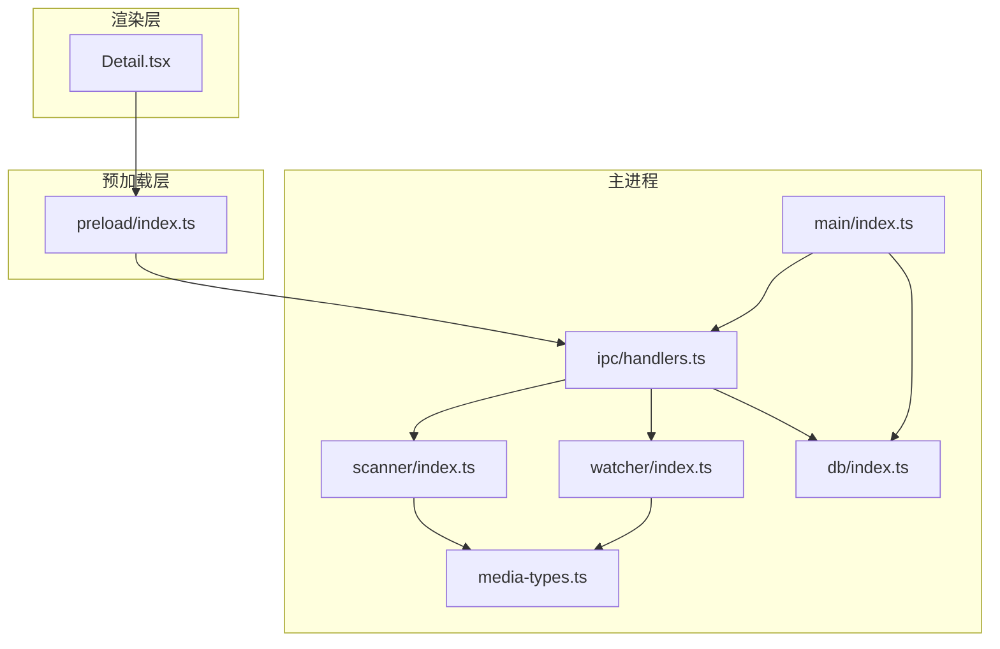
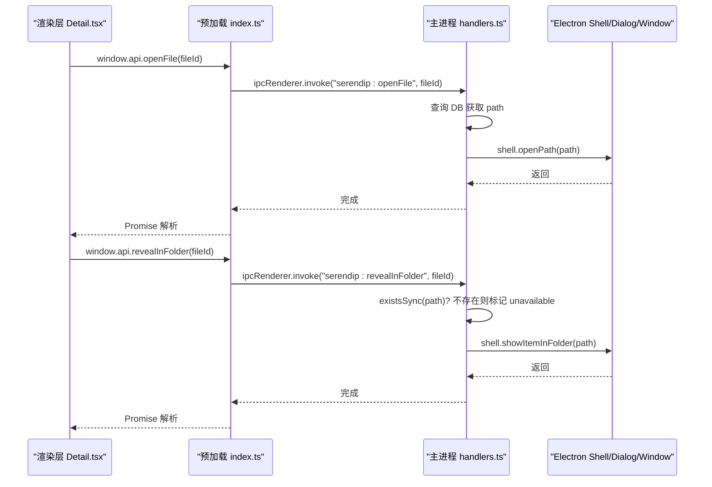
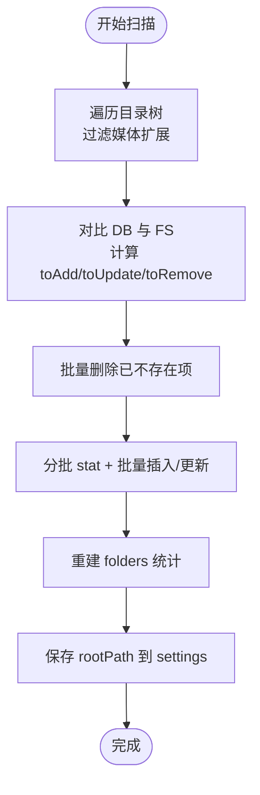
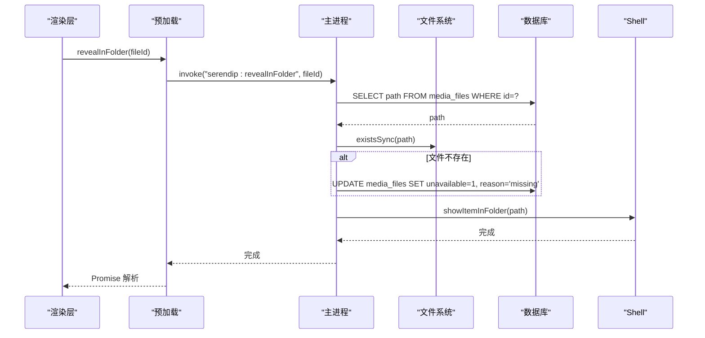
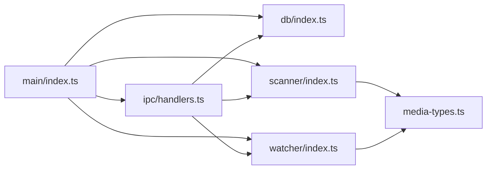

# 系统集成处理器

<cite>
**本文引用的文件**   
- [src/main/index.ts](file://src/main/index.ts)
- [src/preload/index.ts](file://src/preload/index.ts)
- [src/main/ipc/handlers.ts](file://src/main/ipc/handlers.ts)
- [src/main/ipc/contract.ts](file://src/main/ipc/contract.ts)
- [src/main/scanner/index.ts](file://src/main/scanner/index.ts)
- [src/main/watcher/index.ts](file://src/main/watcher/index.ts)
- [src/main/db/index.ts](file://src/main/db/index.ts)
- [src/main/media-types.ts](file://src/main/media-types.ts)
- [src/renderer/src/views/Detail.tsx](file://src/renderer/src/views/Detail.tsx)
</cite>

## 目录
1. [简介](#简介)
2. [项目结构](#项目结构)
3. [核心组件](#核心组件)
4. [架构总览](#架构总览)
5. [详细组件分析](#详细组件分析)
6. [依赖关系分析](#依赖关系分析)
7. [性能考量](#性能考量)
8. [故障排除指南](#故障排除指南)
9. [结论](#结论)
10. [附录：API 使用示例与最佳实践](#附录api-使用示例与最佳实践)

## 简介
本文件聚焦 Serendip 应用的“系统集成处理器”，系统性阐述应用与操作系统集成的实现，包括：
- 文件系统访问（选择根目录、扫描增量同步、实时监听）
- 窗口管理与系统对话框集成（自定义标题栏、Windows Controls Overlay、全屏事件）
- 文件打开与文件夹显示（跨平台兼容策略）
- Windows Controls Overlay（WCO）配置与管理（主题适配、视觉协调）
- 文件存在性检查与失效标记机制
- 安全考虑与权限管理
- 调试与排障建议

## 项目结构
系统集成相关代码主要分布在主进程、预加载脚本与渲染层之间，通过 IPC 契约进行通信。关键路径如下：
- 主进程入口：初始化应用、注册协议、创建窗口、启动数据库与扫描器、设置 WCO
- 预加载脚本：将主进程能力以类型安全的 API 暴露给渲染层
- IPC 处理：集中处理所有系统级操作（对话框、shell、窗口装饰等）
- 扫描与监听：基于 fdir 与 chokidar 的增量同步与实时变更
- 数据库：SQLite 持久化与迁移，包含失效标记字段
- 媒体类型：过滤支持的图片/视频扩展名
- 渲染层：调用 window.api 完成用户交互



图表来源
- [src/main/index.ts:1-134](file://src/main/index.ts#L1-L134)
- [src/preload/index.ts:1-104](file://src/preload/index.ts#L1-L104)
- [src/main/ipc/handlers.ts:1-292](file://src/main/ipc/handlers.ts#L1-L292)
- [src/main/scanner/index.ts:1-323](file://src/main/scanner/index.ts#L1-L323)
- [src/main/watcher/index.ts:1-117](file://src/main/watcher/index.ts#L1-L117)
- [src/main/db/index.ts:1-190](file://src/main/db/index.ts#L1-L190)
- [src/main/media-types.ts:1-38](file://src/main/media-types.ts#L1-L38)

章节来源
- [src/main/index.ts:1-134](file://src/main/index.ts#L1-L134)
- [src/preload/index.ts:1-104](file://src/preload/index.ts#L1-L104)
- [src/main/ipc/handlers.ts:1-292](file://src/main/ipc/handlers.ts#L1-L292)

## 核心组件
- 窗口与协议初始化：在应用启动前注册自定义协议特权，创建 BrowserWindow，配置 titleBarStyle 与 WCO，订阅全屏与移动事件，拦截外部链接跳转。
- IPC 契约与处理：定义统一的通道名与类型；集中处理文件选择、扫描、推荐、分类、画布、窗口装饰等系统级操作。
- 预加载桥接：将主进程能力以 window.api 暴露给渲染层，提供 selectRootDirectory、scanRoot、openFile、openFolder、revealInFolder、setTitleBarOverlay 等方法。
- 扫描器：fdir 遍历 + better-sqlite3 事务批量写入，增量 diff，重建文件夹统计，保存根路径。
- 监听器：chokidar 监听增删改，聚合后批量落库，忽略缓存与系统目录。
- 数据库：WAL 模式、外键约束、索引优化，包含 media_files/folders/categories/canvases 等表及迁移逻辑，支持 unavailable 失效标记。
- 媒体类型：维护图片/视频扩展集合，用于过滤与类型判断。

章节来源
- [src/main/index.ts:1-134](file://src/main/index.ts#L1-L134)
- [src/main/ipc/contract.ts:1-130](file://src/main/ipc/contract.ts#L1-L130)
- [src/main/ipc/handlers.ts:1-292](file://src/main/ipc/handlers.ts#L1-L292)
- [src/preload/index.ts:1-104](file://src/preload/index.ts#L1-L104)
- [src/main/scanner/index.ts:1-323](file://src/main/scanner/index.ts#L1-L323)
- [src/main/watcher/index.ts:1-117](file://src/main/watcher/index.ts#L1-L117)
- [src/main/db/index.ts:1-190](file://src/main/db/index.ts#L1-L190)
- [src/main/media-types.ts:1-38](file://src/main/media-types.ts#L1-L38)

## 架构总览
系统集成采用“渲染层 -> 预加载桥 -> 主进程 IPC -> 系统 API”的分层模型。渲染层仅通过 window.api 调用，避免直接访问 Electron 敏感能力；主进程统一封装 shell/dialog/BrowserWindow 等系统接口，并负责跨平台差异处理与错误兜底。



图表来源
- [src/preload/index.ts:28-32](file://src/preload/index.ts#L28-L32)
- [src/main/ipc/handlers.ts:156-185](file://src/main/ipc/handlers.ts#L156-L185)
- [src/main/db/index.ts:120-128](file://src/main/db/index.ts#L120-L128)

## 详细组件分析

### 文件系统访问与增量同步
- 选择根目录：通过 dialog.showOpenDialog 弹出系统目录选择框，返回路径供后续扫描。
- 扫描流程：
  - 使用 fdir 异步遍历，过滤出图片/视频，跳过缓存与系统目录。
  - 与数据库现有记录做 diff，计算新增、更新、删除。
  - 使用事务批量写入，提升 I/O 性能。
  - 重建 folders 统计表，保存 rootPath 到 settings。
- 实时监听：
  - 使用 chokidar 监听 add/change/unlink，按扩展名过滤。
  - 合并短时间内的变更，批量 stat 后事务写入或移除。
  - 忽略 node_modules、隐藏目录、回收站等。



图表来源
- [src/main/scanner/index.ts:36-239](file://src/main/scanner/index.ts#L36-L239)
- [src/main/media-types.ts:1-38](file://src/main/media-types.ts#L1-L38)

章节来源
- [src/main/ipc/handlers.ts:42-60](file://src/main/ipc/handlers.ts#L42-L60)
- [src/main/scanner/index.ts:1-323](file://src/main/scanner/index.ts#L1-L323)
- [src/main/watcher/index.ts:1-117](file://src/main/watcher/index.ts#L1-L117)
- [src/main/media-types.ts:1-38](file://src/main/media-types.ts#L1-L38)

### 窗口管理与系统对话框集成
- 窗口创建与行为：
  - 设置 titleBarStyle 为 hidden，Win/Linux 启用 WCO，macOS 保留默认信号灯。
  - 监听 enter-full-screen/leave-full-screen/move，向渲染层广播事件。
  - 拦截新窗口打开，统一由 shell.openExternal 处理。
- 系统对话框：
  - 选择根目录使用 dialog.showOpenDialog，仅允许 openDirectory。
- 外部链接：
  - 通过 setWindowOpenHandler 统一交由系统浏览器打开。

章节来源
- [src/main/index.ts:38-91](file://src/main/index.ts#L38-L91)
- [src/main/index.ts:93-134](file://src/main/index.ts#L93-L134)
- [src/main/ipc/handlers.ts:42-49](file://src/main/ipc/handlers.ts#L42-L49)

### Windows Controls Overlay（WCO）配置与管理
- 初始配置：
  - Win/Linux 窗口创建时设置 titleBarOverlay 的 color/symbolColor/height。
  - macOS 不设置 WCO，走默认 hidden 信号灯。
- 动态更新：
  - 提供 setTitleBarOverlay IPC，支持 theme 派生颜色或直接覆盖 color/symbolColor。
  - 详情页可传全透明背景色以实现沉浸式效果；主页使用近似玻璃态色，使 hover 高亮可见。
  - 不支持的平台（如 macOS）调用会抛异常，捕获静默忽略。

```mermaid
classDiagram
class WindowConfig {
+titleBarStyle : "hidden"
+titleBarOverlay : { color, symbolColor, height }
}
class TitleBarOverlayIPC {
+setVisible(visible? : boolean)
+setTheme(theme : "light"|"dark")
+setColors(color? : string, symbolColor? : string)
}
WindowConfig --> TitleBarOverlayIPC : "初始化/运行时更新"
```

图表来源
- [src/main/index.ts:47-65](file://src/main/index.ts#L47-L65)
- [src/main/ipc/handlers.ts:259-283](file://src/main/ipc/handlers.ts#L259-L283)

章节来源
- [src/main/index.ts:47-65](file://src/main/index.ts#L47-L65)
- [src/main/ipc/handlers.ts:259-283](file://src/main/ipc/handlers.ts#L259-L283)

### 文件打开与文件夹显示（跨平台兼容）
- 打开文件：
  - 通过 shell.openPath 使用系统默认应用打开，跨平台一致。
- 在文件管理器中显示：
  - 先查询 DB 获取 path，existsSync 校验存在性；若缺失则标记 unavailable 原因。
  - 使用 shell.showItemInFolder 定位文件。
- 打开文件夹：
  - 直接使用 shell.openPath 打开目录。



图表来源
- [src/main/ipc/handlers.ts:156-185](file://src/main/ipc/handlers.ts#L156-L185)
- [src/main/db/index.ts:120-128](file://src/main/db/index.ts#L120-L128)

章节来源
- [src/main/ipc/handlers.ts:156-185](file://src/main/ipc/handlers.ts#L156-L185)
- [src/main/db/index.ts:120-128](file://src/main/db/index.ts#L120-L128)

### 文件存在性检查与失效标记机制
- 失效场景：
  - 缩略图生成失败、文件被删除、文件损坏等。
- 标记方式：
  - 在 media_files 表中增加 unavailable 与 unavailable_reason 字段。
  - 当 revealInFolder 发现文件缺失时，自动标记 unavailable=1 且 reason='missing'。
  - 扫描器在增量更新时，若 mtime/size 未变但之前被标记失效，则解封（恢复 unavailable=0）。
- 查询过滤：
  - listLiked 等查询显式过滤 unavailable=0，确保展示可用内容。

章节来源
- [src/main/db/index.ts:120-128](file://src/main/db/index.ts#L120-L128)
- [src/main/ipc/handlers.ts:148-154](file://src/main/ipc/handlers.ts#L148-L154)
- [src/main/ipc/handlers.ts:156-171](file://src/main/ipc/handlers.ts#L156-L171)
- [src/main/scanner/index.ts:113-121](file://src/main/scanner/index.ts#L113-L121)
- [src/main/scanner/index.ts:184-207](file://src/main/scanner/index.ts#L184-L207)
- [src/main/ipc/handlers.ts:128-146](file://src/main/ipc/handlers.ts#L128-L146)

### 跨平台差异处理策略
- 标题栏与 WCO：
  - Win/Linux：titleBarStyle=hidden + titleBarOverlay 自绘按钮区。
  - macOS：titleBarStyle=hidden，但保留系统信号灯，WCO 不可用，调用 setTitleBarOverlay 会抛异常，需捕获静默处理。
- 图标与平台特性：
  - Linux 窗口需要显式设置 icon。
- 外部链接与新窗口：
  - 统一通过 shell.openExternal 处理，避免 Chromium 内部打开。

章节来源
- [src/main/index.ts:47-65](file://src/main/index.ts#L47-L65)
- [src/main/index.ts:81-84](file://src/main/index.ts#L81-L84)
- [src/main/ipc/handlers.ts:272-282](file://src/main/ipc/handlers.ts#L272-L282)

### 安全考虑与权限管理
- 最小权限原则：
  - 渲染层仅通过 window.api 暴露必要方法，避免直接访问 fs/shell。
- 协议特权：
  - 自定义协议 serendip 注册为 standard/secure/stream，限制在受控范围内。
- 输入校验与转义：
  - SQL LIKE 查询中对反斜杠、%、_ 进行转义，防止注入与误匹配。
- 外部链接控制：
  - 拦截新窗口打开，统一交由系统浏览器，避免恶意页面在应用内导航。

章节来源
- [src/main/index.ts:26-36](file://src/main/index.ts#L26-L36)
- [src/main/ipc/handlers.ts:134-146](file://src/main/ipc/handlers.ts#L134-L146)
- [src/main/index.ts:81-84](file://src/main/index.ts#L81-L84)

### 调试与排障指南
- 常见问题：
  - 视频全屏闪烁：已在启动参数中禁用 DirectCompositionVideoOverlays/UseMultiPlaneOverlayForVideo，必要时可回退到 disable-direct-composition（可能影响合成性能）。
  - WCO 在 macOS 报错：属于预期行为，已通过 try/catch 静默处理。
  - 文件缺失导致无法显示：检查 unavailable 标记与 reason，确认是否存在于磁盘。
- 日志与监控：
  - 扫描阶段输出 phase/scanned/total/added/removed/updated/currentPath。
  - 监听器处理结果输出 +N/-M 计数。
- 建议排查步骤：
  - 确认 rootPath 是否正确保存与读取。
  - 验证 media_files 中 path 与 existsSync 结果一致。
  - 检查 chokidar 是否忽略目标目录（如 .serendip-cache、System Volume Information）。

章节来源
- [src/main/index.ts:17-23](file://src/main/index.ts#L17-L23)
- [src/main/ipc/handlers.ts:272-282](file://src/main/ipc/handlers.ts#L272-L282)
- [src/main/scanner/index.ts:43-56](file://src/main/scanner/index.ts#L43-L56)
- [src/main/watcher/index.ts:16-37](file://src/main/watcher/index.ts#L16-L37)

## 依赖关系分析
- 模块耦合：
  - main/index.ts 依赖 db、thumbnailer、scanner、watcher、ipc/handlers。
  - ipc/handlers.ts 依赖 db、scanner、recommender、categories、canvases、watcher。
  - scanner/watcher 依赖 media-types 与 db。
- 外部依赖：
  - Electron：app、BrowserWindow、dialog、shell、protocol。
  - better-sqlite3：本地数据库与事务。
  - fdir：高性能目录遍历。
  - chokidar：文件系统监听。



图表来源
- [src/main/index.ts:1-134](file://src/main/index.ts#L1-L134)
- [src/main/ipc/handlers.ts:1-292](file://src/main/ipc/handlers.ts#L1-L292)
- [src/main/scanner/index.ts:1-323](file://src/main/scanner/index.ts#L1-L323)
- [src/main/watcher/index.ts:1-117](file://src/main/watcher/index.ts#L1-L117)
- [src/main/db/index.ts:1-190](file://src/main/db/index.ts#L1-L190)
- [src/main/media-types.ts:1-38](file://src/main/media-types.ts#L1-L38)

章节来源
- [src/main/index.ts:1-134](file://src/main/index.ts#L1-L134)
- [src/main/ipc/handlers.ts:1-292](file://src/main/ipc/handlers.ts#L1-L292)

## 性能考量
- 数据库：
  - WAL 模式与 NORMAL 同步级别提升并发与吞吐。
  - 针对 liked/unavailable 等常用查询建立条件索引。
- 扫描与监听：
  - fdir 异步遍历与批量 stat，减少 I/O 次数。
  - 事务批量写入，降低锁竞争。
  - chokidar 聚合短时变更，避免频繁写库。
- 窗口与渲染：
  - 禁用可能导致闪烁的视频叠加平面，保持硬件解码与合成。
  - WCO 仅在 Win/Linux 启用，避免不必要的重绘。

[本节为通用指导，无需具体文件引用]

## 故障排除指南
- 打开文件失败：
  - 检查 media_files.path 是否存在，若不存在会被标记 unavailable。
  - 确认 shell.openPath 调用是否抛出异常（通常不会，但可加日志）。
- 在文件管理器中显示无效：
  - 确认文件未被移动或删除；若缺失，会自动标记 unavailable。
- 扫描无进展：
  - 检查 rootPath 是否有效，fdir 是否忽略目标目录。
  - 查看 ScanProgress 的 currentPath 与 phase。
- WCO 颜色不正确：
  - 确认 theme 与 color/symbolColor 传入值；macOS 下 WCO 不可用属正常。

章节来源
- [src/main/ipc/handlers.ts:156-185](file://src/main/ipc/handlers.ts#L156-L185)
- [src/main/scanner/index.ts:43-56](file://src/main/scanner/index.ts#L43-L56)
- [src/main/ipc/handlers.ts:272-282](file://src/main/ipc/handlers.ts#L272-L282)

## 结论
Serendip 的系统集成处理器通过清晰的层次划分与严格的 IPC 契约，实现了跨平台的文件系统访问、窗口管理与系统对话框集成。WCO 的主题适配与视觉协调、文件存在性检查与失效标记机制、以及完善的错误处理与性能优化，共同保障了应用在不同操作系统上的稳定与一致性体验。

[本节为总结，无需具体文件引用]

## 附录：API 使用示例与最佳实践
- 选择根目录
  - 渲染层调用：window.api.selectRootDirectory()
  - 主进程实现：dialog.showOpenDialog({ properties: ['openDirectory'] })
  - 参考路径：[src/preload/index.ts:10](file://src/preload/index.ts#L10)、[src/main/ipc/handlers.ts:42-49](file://src/main/ipc/handlers.ts#L42-L49)

- 扫描根目录（带进度推送）
  - 渲染层调用：window.api.scanRoot(rootPath)
  - 主进程实现：scanRoot(rootPath, onProgress)，startWatcher(rootPath)
  - 参考路径：[src/preload/index.ts:11](file://src/preload/index.ts#L11)、[src/main/ipc/handlers.ts:52-60](file://src/main/ipc/handlers.ts#L52-L60)

- 打开文件（系统默认应用）
  - 渲染层调用：window.api.openFile(fileId)
  - 主进程实现：查询 path，shell.openPath(path)
  - 参考路径：[src/preload/index.ts:31](file://src/preload/index.ts#L31)、[src/main/ipc/handlers.ts:174-181](file://src/main/ipc/handlers.ts#L174-L181)

- 在文件管理器中显示
  - 渲染层调用：window.api.revealInFolder(fileId)
  - 主进程实现：existsSync 校验，缺失则标记 unavailable，shell.showItemInFolder
  - 参考路径：[src/preload/index.ts:30](file://src/preload/index.ts#L30)、[src/main/ipc/handlers.ts:156-171](file://src/main/ipc/handlers.ts#L156-L171)

- 打开文件夹
  - 渲染层调用：window.api.openFolder(folderPath)
  - 主进程实现：shell.openPath(folderPath)
  - 参考路径：[src/preload/index.ts:32](file://src/preload/index.ts#L32)、[src/main/ipc/handlers.ts:183-185](file://src/main/ipc/handlers.ts#L183-L185)

- 设置 WCO（标题栏覆盖）
  - 渲染层调用：window.api.setTitleBarOverlay({ visible?, theme?, color?, symbolColor? })
  - 主进程实现：win.setTitleBarOverlay(...)，macOS 异常静默处理
  - 参考路径：[src/preload/index.ts:88](file://src/preload/index.ts#L88)、[src/main/ipc/handlers.ts:259-283](file://src/main/ipc/handlers.ts#L259-L283)

- 错误处理与异常恢复
  - 文件缺失：自动标记 unavailable 与 reason
  - 平台不支持：try/catch 静默忽略
  - 参考路径：[src/main/ipc/handlers.ts:148-154](file://src/main/ipc/handlers.ts#L148-L154)、[src/main/ipc/handlers.ts:272-282](file://src/main/ipc/handlers.ts#L272-L282)

- 跨平台差异注意事项
  - macOS 无 WCO，titleBarStyle=hidden 但保留信号灯
  - Linux 需显式设置窗口图标
  - 参考路径：[src/main/index.ts:47-65](file://src/main/index.ts#L47-L65)

章节来源
- [src/preload/index.ts:10-32](file://src/preload/index.ts#L10-L32)
- [src/preload/index.ts:88](file://src/preload/index.ts#L88)
- [src/main/ipc/handlers.ts:42-60](file://src/main/ipc/handlers.ts#L42-L60)
- [src/main/ipc/handlers.ts:148-185](file://src/main/ipc/handlers.ts#L148-L185)
- [src/main/ipc/handlers.ts:259-283](file://src/main/ipc/handlers.ts#L259-L283)
- [src/main/index.ts:47-65](file://src/main/index.ts#L47-L65)