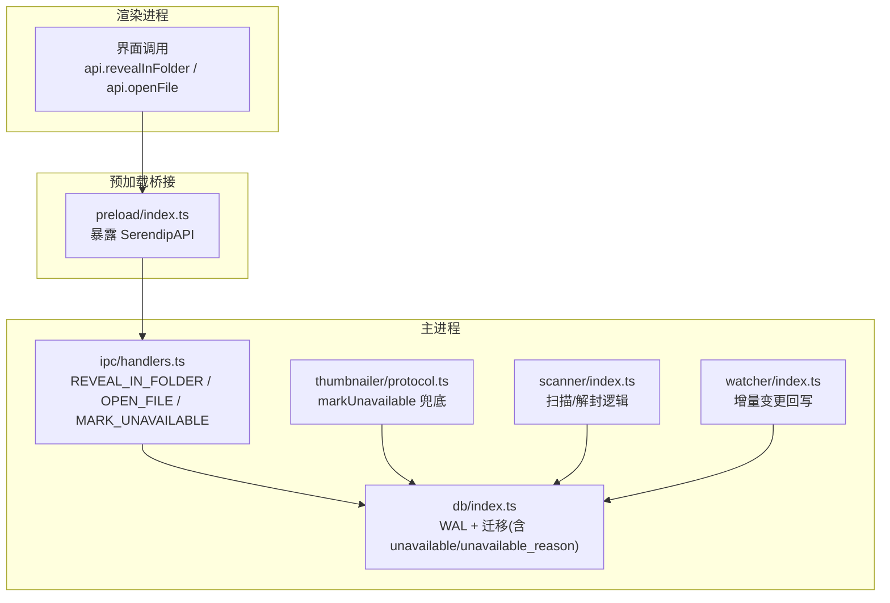
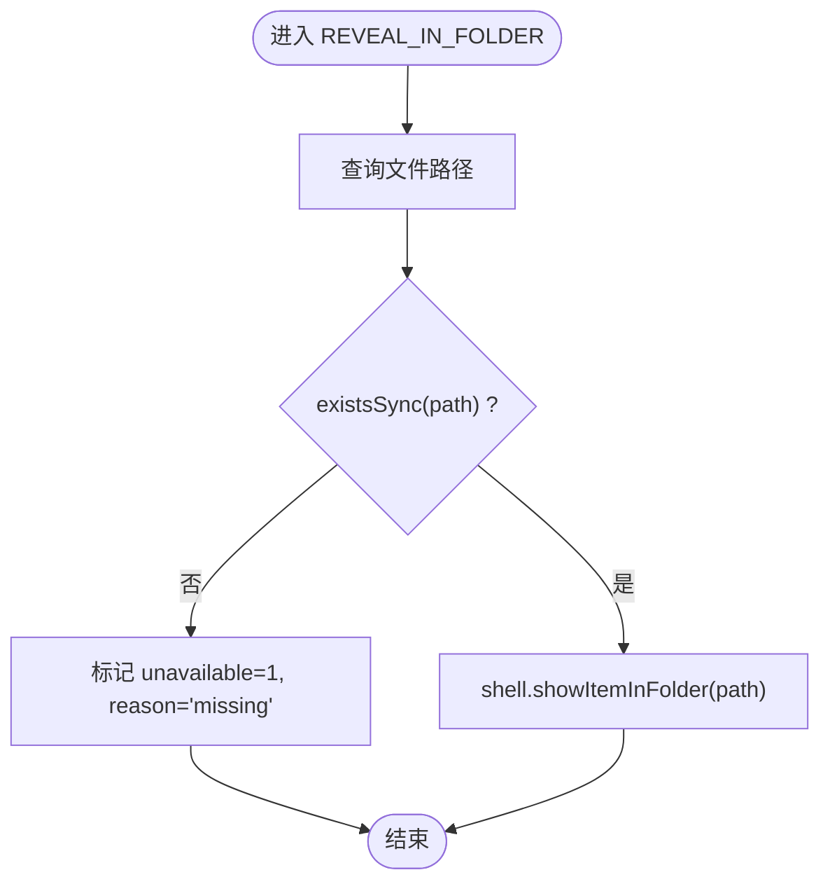
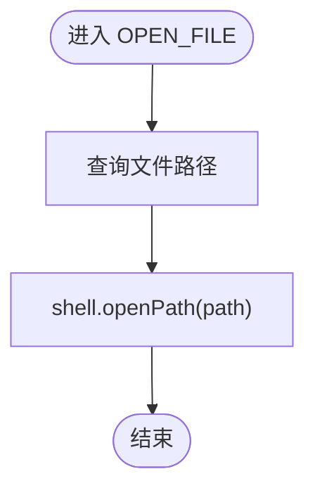
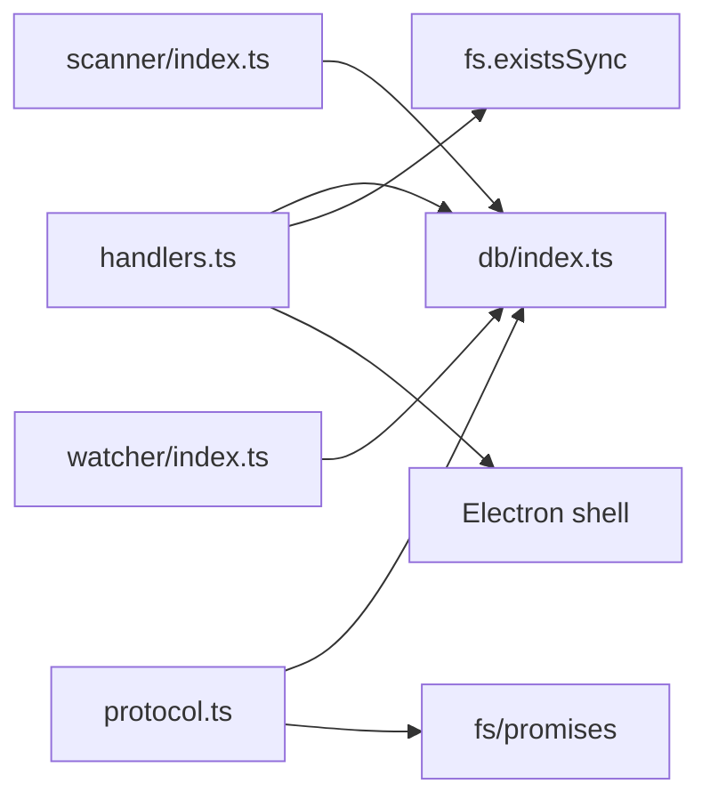

# 文件存在性检查器

<cite>
**本文引用的文件列表**
- [src/main/ipc/handlers.ts](file://src/main/ipc/handlers.ts)
- [src/main/ipc/contract.ts](file://src/main/ipc/contract.ts)
- [src/preload/index.ts](file://src/preload/index.ts)
- [src/main/thumbnailer/protocol.ts](file://src/main/thumbnailer/protocol.ts)
- [src/main/scanner/index.ts](file://src/main/scanner/index.ts)
- [src/main/watcher/index.ts](file://src/main/watcher/index.ts)
- [src/main/db/index.ts](file://src/main/db/index.ts)
</cite>

## 目录
1. [简介](#简介)
2. [项目结构](#项目结构)
3. [核心组件](#核心组件)
4. [架构总览](#架构总览)
5. [详细组件分析](#详细组件分析)
6. [依赖关系分析](#依赖关系分析)
7. [性能考量](#性能考量)
8. [故障排查指南](#故障排查指南)
9. [结论](#结论)
10. [附录](#附录)

## 简介
本文件围绕 Serendip 应用中的“文件存在性检查器”进行系统化文档化，重点解释 REVEAL_IN_FOLDER 与 OPEN_FILE 处理器中的文件验证逻辑、existsSync 的使用场景与异步替代方案、文件失效标记机制与 unavailable_reason 字段管理、路径验证与权限检查、错误处理策略、与数据库状态同步的事务处理、跨平台路径处理与特殊字符转义，以及文件访问权限配置与安全最佳实践。

## 项目结构
与文件存在性检查相关的代码主要分布在以下模块：
- IPC 层：定义通道契约与主进程处理器（REVEAL_IN_FOLDER、OPEN_FILE、MARK_UNAVAILABLE）
- 缩略图协议层：在协议处理失败时兜底标记文件不可用
- 扫描与监听：在增量变更中恢复或更新文件状态
- 数据库迁移：新增 unavailable 与 unavailable_reason 字段及索引
- 预加载桥接：向渲染进程暴露 API

图表来源
- [src/main/ipc/handlers.ts:156-181](file://src/main/ipc/handlers.ts#L156-L181)
- [src/main/ipc/contract.ts:98-101](file://src/main/ipc/contract.ts#L98-L101)
- [src/preload/index.ts:28-32](file://src/preload/index.ts#L28-L32)
- [src/main/thumbnailer/protocol.ts:223-232](file://src/main/thumbnailer/protocol.ts#L223-L232)
- [src/main/scanner/index.ts:113-121](file://src/main/scanner/index.ts#L113-L121)
- [src/main/watcher/index.ts:85-92](file://src/main/watcher/index.ts#L85-L92)
- [src/main/db/index.ts:120-128](file://src/main/db/index.ts#L120-L128)

章节来源
- [src/main/ipc/handlers.ts:1-292](file://src/main/ipc/handlers.ts#L1-L292)
- [src/main/ipc/contract.ts:1-130](file://src/main/ipc/contract.ts#L1-L130)
- [src/preload/index.ts:1-104](file://src/preload/index.ts#L1-L104)
- [src/main/thumbnailer/protocol.ts:1-298](file://src/main/thumbnailer/protocol.ts#L1-L298)
- [src/main/scanner/index.ts:46-263](file://src/main/scanner/index.ts#L46-L263)
- [src/main/watcher/index.ts:58-98](file://src/main/watcher/index.ts#L58-L98)
- [src/main/db/index.ts:1-190](file://src/main/db/index.ts#L1-L190)

## 核心组件
- REVEAL_IN_FOLDER 处理器：查询媒体文件路径，使用 existsSync 校验文件是否存在；若不存在则标记 unavailable=1 且原因='missing'，否则调用系统资源管理器显示所在文件夹。
- OPEN_FILE 处理器：查询媒体文件路径后直接调用 shell.openPath 打开，未做存在性校验（由系统默认应用负责）。
- MARK_UNAVAILABLE 处理器：将指定文件的 unavailable 置为 1，并写入 unavailable_reason。
- 缩略图协议层 markUnavailable：在缩略图生成失败等异常路径下兜底标记不可用。
- 扫描与监听：在扫描和增量变更过程中对已失效但实际存在的文件执行解封（unavailable=0, unavailable_reason=NULL）。
- 数据库迁移：为 media_files 表增加 unavailable 与 unavailable_reason 字段，并建立相应索引。

章节来源
- [src/main/ipc/handlers.ts:148-181](file://src/main/ipc/handlers.ts#L148-L181)
- [src/main/thumbnailer/protocol.ts:223-232](file://src/main/thumbnailer/protocol.ts#L223-L232)
- [src/main/scanner/index.ts:113-121](file://src/main/scanner/index.ts#L113-L121)
- [src/main/watcher/index.ts:85-92](file://src/main/watcher/index.ts#L85-L92)
- [src/main/db/index.ts:120-128](file://src/main/db/index.ts#L120-L128)

## 架构总览
下图展示了从渲染进程到主进程再到文件系统与数据库的完整交互流程，包括文件存在性检查、失效标记与数据库同步。

图表来源
- [src/main/ipc/handlers.ts:156-181](file://src/main/ipc/handlers.ts#L156-L181)
- [src/preload/index.ts:28-32](file://src/preload/index.ts#L28-L32)
- [src/main/ipc/contract.ts:98-101](file://src/main/ipc/contract.ts#L98-L101)

## 详细组件分析

### REVEAL_IN_FOLDER 处理器
- 功能：根据 fileId 获取文件路径，使用 existsSync 判断文件是否仍存在；若不存在则标记 unavailable=1 且 reason='missing'；若存在则调用系统资源管理器定位该文件。
- 关键点：
  - 使用 existsSync 进行同步存在性检查，避免阻塞主线程以外的 I/O 等待。
  - 当文件缺失时，立即更新数据库状态，防止后续推荐/展示继续命中无效项。
  - 仅查询 path 字段，最小化数据库读取开销。
- 风险与建议：
  - 当前实现未捕获 existsSync 抛出的异常（例如权限不足），建议增加 try/catch 并在异常情况下也标记 unavailable，附带具体错误信息。
  - 可考虑引入 fs.promises.access 的异步版本以统一异步风格，但需评估对现有同步流程的影响。

图表来源
- [src/main/ipc/handlers.ts:156-171](file://src/main/ipc/handlers.ts#L156-L171)

章节来源
- [src/main/ipc/handlers.ts:156-171](file://src/main/ipc/handlers.ts#L156-L171)

### OPEN_FILE 处理器
- 功能：根据 fileId 获取文件路径后，直接调用 shell.openPath 使用系统默认应用打开。
- 关键点：
  - 未显式进行存在性检查，依赖系统默认应用的反馈。
  - 适合快速打开场景，但在文件缺失时不会自动标记 unavailable。
- 风险与建议：
  - 建议在 openPath 前增加存在性检查与权限检查，若失败则调用 MARK_UNAVAILABLE 并记录 reason（如 'missing' 或 'permission denied'）。
  - 可考虑捕获 openPath 的错误回调（如果可用）来完善错误处理。

图表来源
- [src/main/ipc/handlers.ts:173-181](file://src/main/ipc/handlers.ts#L173-L181)

章节来源
- [src/main/ipc/handlers.ts:173-181](file://src/main/ipc/handlers.ts#L173-L181)

### MARK_UNAVAILABLE 处理器
- 功能：将指定文件的 unavailable 置为 1，并写入 unavailable_reason。
- 关键点：
  - 提供统一的失效标记入口，供 UI 主动调用或在其他流程中触发。
  - 与 REVEAL_IN_FOLDER 的 missing 标记配合，形成一致的状态管理。

章节来源
- [src/main/ipc/handlers.ts:148-154](file://src/main/ipc/handlers.ts#L148-L154)

### 缩略图协议层 markUnavailable（兜底）
- 功能：在缩略图生成失败、文件丢失或解码错误等异常路径下，调用 markUnavailable 将文件标记为不可用。
- 关键点：
  - 仅在 protocol 层兜底使用，正常流程通过 IPC 由 UI 主动调用。
  - 对 reason 长度做了限制，避免超长字符串影响存储。

章节来源
- [src/main/thumbnailer/protocol.ts:223-232](file://src/main/thumbnailer/protocol.ts#L223-L232)

### 扫描与监听中的解封逻辑
- 扫描阶段：
  - 对于 mtime/size 未变但被标记 unavailable 的文件，执行解封（unavailable=0, unavailable_reason=NULL）。
  - 使用事务批量更新，提升性能。
- 监听阶段：
  - 增量变更时，若文件存在则插入或更新，同时确保 unavailable=0, unavailable_reason=NULL。
  - 若文件消失则删除对应记录。

章节来源
- [src/main/scanner/index.ts:113-121](file://src/main/scanner/index.ts#L113-L121)
- [src/main/watcher/index.ts:85-92](file://src/main/watcher/index.ts#L85-L92)

### 数据库状态与迁移
- 迁移 2：为 media_files 表新增 unavailable 与 unavailable_reason 字段，并创建 unavailable 索引。
- WAL 模式与并发优化：启用 WAL 模式与合适的同步级别，提高并发读写性能。

章节来源
- [src/main/db/index.ts:120-128](file://src/main/db/index.ts#L120-L128)
- [src/main/db/index.ts:19-22](file://src/main/db/index.ts#L19-L22)

## 依赖关系分析
- 处理器依赖：
  - ipc/handlers.ts 依赖 db/index.ts 获取数据库实例，依赖 fs.existsSync 进行存在性检查，依赖 Electron shell 进行系统交互。
  - thumbnailer/protocol.ts 依赖 db/index.ts 与文件系统 promises API。
  - scanner/index.ts 与 watcher/index.ts 依赖 db/index.ts 进行批量更新与事务处理。
- 外部依赖：
  - better-sqlite3 用于本地数据库。
  - Electron shell 用于打开文件与显示文件夹。
  - Node.js fs/fs/promises 用于文件 I/O。

图表来源
- [src/main/ipc/handlers.ts:1-10](file://src/main/ipc/handlers.ts#L1-L10)
- [src/main/thumbnailer/protocol.ts:1-8](file://src/main/thumbnailer/protocol.ts#L1-L8)
- [src/main/scanner/index.ts:1-20](file://src/main/scanner/index.ts#L1-L20)
- [src/main/watcher/index.ts:1-20](file://src/main/watcher/index.ts#L1-L20)
- [src/main/db/index.ts:1-28](file://src/main/db/index.ts#L1-L28)

章节来源
- [src/main/ipc/handlers.ts:1-10](file://src/main/ipc/handlers.ts#L1-L10)
- [src/main/thumbnailer/protocol.ts:1-8](file://src/main/thumbnailer/protocol.ts#L1-L8)
- [src/main/scanner/index.ts:1-20](file://src/main/scanner/index.ts#L1-L20)
- [src/main/watcher/index.ts:1-20](file://src/main/watcher/index.ts#L1-L20)
- [src/main/db/index.ts:1-28](file://src/main/db/index.ts#L1-L28)

## 性能考量
- 同步 vs 异步：
  - REVEAL_IN_FOLDER 使用 existsSync 进行同步检查，简单直接，但会阻塞事件循环。在高频调用场景下，可考虑改用 fs.promises.access 的异步版本，结合 Promise.all 批量检查，减少阻塞。
- 事务批写：
  - 扫描与监听中使用 transaction 包裹批量更新，显著提升写入性能。
- 索引优化：
  - unavailable 字段建立索引，有助于快速过滤不可用项。
- 缓存与协议：
  - 缩略图协议层对全分辨率图片与视频采用流式响应与缓存策略，降低重复计算与 I/O 压力。

[本节为通用指导，不直接分析具体文件]

## 故障排查指南
- 常见问题：
  - 文件被移动或删除：REVEAL_IN_FOLDER 会检测到并标记 unavailable='missing'；OPEN_FILE 可能因系统默认应用报错而无法打开。
  - 权限不足：existsSync 可能抛出权限相关异常，当前实现未捕获，建议增加 try/catch 并标记 unavailable，reason 包含错误码或消息。
  - 缩略图生成失败：protocol 层会兜底标记 unavailable，并返回 404。
- 建议改进：
  - 在 REVEAL_IN_FOLDER 与 OPEN_FILE 中加入 try/catch，捕获权限错误与 IO 错误，统一标记 unavailable 并记录 reason。
  - 在 OPEN_FILE 中增加存在性与权限检查，失败时调用 MARK_UNAVAILABLE。
  - 对 reason 字段进行长度限制与清洗，避免注入或过长文本。

章节来源
- [src/main/ipc/handlers.ts:156-181](file://src/main/ipc/handlers.ts#L156-L181)
- [src/main/thumbnailer/protocol.ts:223-232](file://src/main/thumbnailer/protocol.ts#L223-L232)

## 结论
Serendip 的文件存在性检查器通过 REVEAL_IN_FOLDER 与 OPEN_FILE 处理器实现了基本的文件验证与系统交互，并结合 MARK_UNAVAILABLE 与数据库迁移形成了完整的失效标记机制。扫描与监听模块进一步确保了状态一致性。未来可在权限检查、异步 I/O 与错误处理方面增强健壮性，以提升用户体验与系统稳定性。

[本节为总结，不直接分析具体文件]

## 附录

### existsSync 的使用场景与异步替代方案
- 使用场景：
  - REVEAL_IN_FOLDER 中用于快速判断文件是否存在，决定是否标记 unavailable 或调用系统资源管理器。
- 异步替代方案：
  - 使用 fs.promises.access 进行异步存在性检查，适合高并发与批量场景。
  - 在需要统一异步风格的模块中，可将同步检查替换为异步，并通过 Promise.all 批量处理。

章节来源
- [src/main/ipc/handlers.ts:156-171](file://src/main/ipc/handlers.ts#L156-L171)

### 文件失效标记机制与 unavailable_reason 管理
- 标记入口：
  - IPC.MARK_UNAVAILABLE：由 UI 主动调用。
  - REVEAL_IN_FOLDER：当文件缺失时标记 'missing'。
  - 缩略图协议层：在生成失败等异常路径兜底标记。
- 字段管理：
  - unavailable：布尔标志位，表示文件是否可用。
  - unavailable_reason：文本描述，记录失效原因（长度限制）。
- 解封逻辑：
  - 扫描与监听在确认文件存在且状态未变化时，执行解封（unavailable=0, unavailable_reason=NULL）。

章节来源
- [src/main/ipc/handlers.ts:148-171](file://src/main/ipc/handlers.ts#L148-L171)
- [src/main/thumbnailer/protocol.ts:223-232](file://src/main/thumbnailer/protocol.ts#L223-L232)
- [src/main/scanner/index.ts:113-121](file://src/main/scanner/index.ts#L113-L121)
- [src/main/watcher/index.ts:85-92](file://src/main/watcher/index.ts#L85-L92)
- [src/main/db/index.ts:120-128](file://src/main/db/index.ts#L120-L128)

### 路径验证、权限检查与错误处理示例
- 路径验证：
  - 使用 LIKE 查询与 ESCAPE '\\' 转义特殊字符（反斜杠、百分号、下划线），确保 Windows 路径匹配正确。
- 权限检查：
  - 建议在 existsSync 或 access 前后增加 try/catch，捕获权限错误并标记 unavailable。
- 错误处理：
  - 统一记录 reason，限制长度，避免注入与存储异常。

章节来源
- [src/main/ipc/handlers.ts:134-146](file://src/main/ipc/handlers.ts#L134-L146)
- [src/main/ipc/handlers.ts:156-171](file://src/main/ipc/handlers.ts#L156-L171)

### 与数据库状态同步的策略与事务处理
- 策略：
  - 使用 transaction 包裹批量更新，确保原子性与性能。
  - 在扫描与监听中，对新增/更新/删除进行差异化处理，保持状态一致。
- 事务处理：
  - 扫描阶段：批量插入/更新，解封失效项。
  - 监听阶段：增量变更即时回写，确保实时性。

章节来源
- [src/main/scanner/index.ts:124-206](file://src/main/scanner/index.ts#L124-L206)
- [src/main/watcher/index.ts:92-98](file://src/main/watcher/index.ts#L92-L98)

### 跨平台路径处理与特殊字符转义
- 跨平台路径：
  - 使用 Electron 的 shell API 进行系统交互，屏蔽平台差异。
  - 使用 Node.js path 模块进行路径拼接与解析。
- 特殊字符转义：
  - 在 SQL LIKE 查询中对反斜杠、百分号、下划线进行转义，确保路径匹配准确。

章节来源
- [src/main/ipc/handlers.ts:134-146](file://src/main/ipc/handlers.ts#L134-L146)
- [src/main/thumbnailer/protocol.ts:3-8](file://src/main/thumbnailer/protocol.ts#L3-L8)

### 文件访问权限配置与安全最佳实践
- 权限配置：
  - 确保应用具备读取目标文件的权限，必要时提示用户授予权限。
- 安全最佳实践：
  - 对用户输入的路径进行白名单校验，避免路径遍历攻击。
  - 对 reason 字段进行长度限制与内容清洗，避免注入。
  - 在打开文件或显示文件夹时，优先使用系统 API，避免自行构造命令。

[本节为通用指导，不直接分析具体文件]