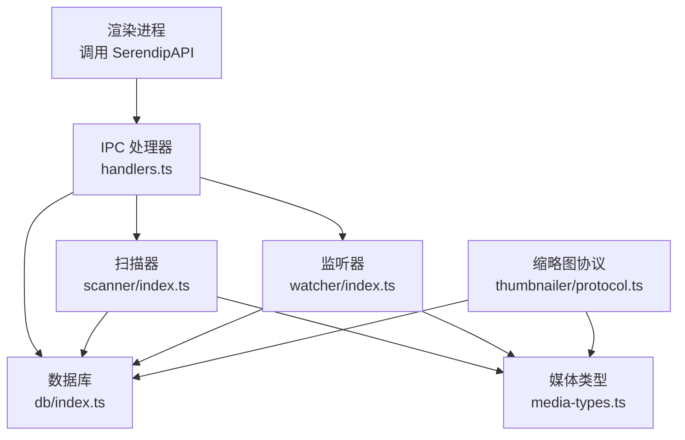
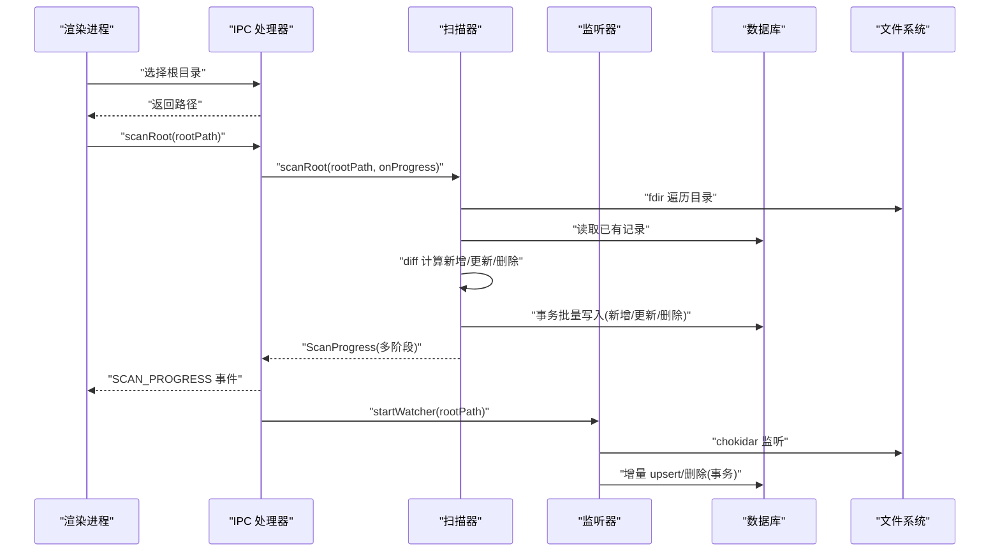
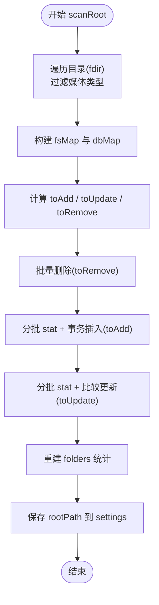
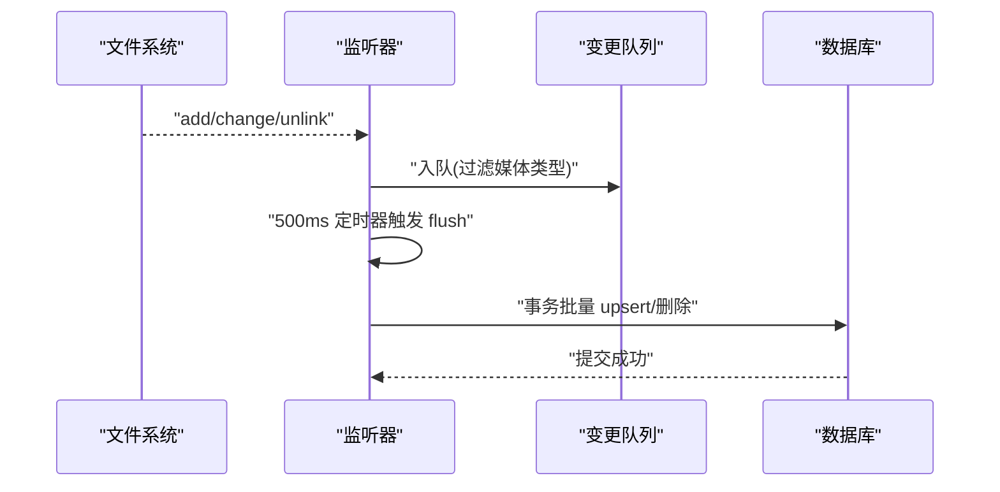
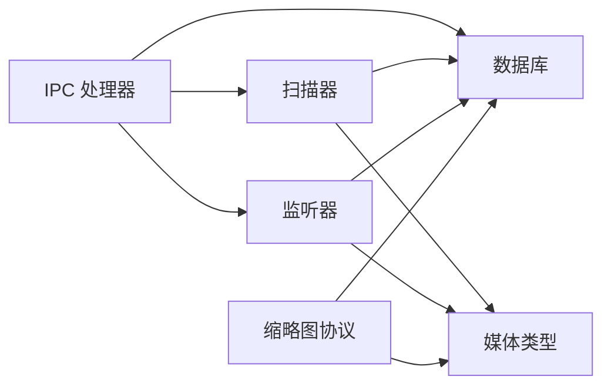

# 文件操作处理器

<cite>
**本文引用的文件**   
- [src/main/index.ts](file://src/main/index.ts)
- [src/main/ipc/handlers.ts](file://src/main/ipc/handlers.ts)
- [src/main/ipc/contract.ts](file://src/main/ipc/contract.ts)
- [src/main/scanner/index.ts](file://src/main/scanner/index.ts)
- [src/main/watcher/index.ts](file://src/main/watcher/index.ts)
- [src/main/db/index.ts](file://src/main/db/index.ts)
- [src/main/media-types.ts](file://src/main/media-types.ts)
- [src/main/thumbnailer/protocol.ts](file://src/main/thumbnailer/protocol.ts)
</cite>

## 目录
1. [简介](#简介)
2. [项目结构](#项目结构)
3. [核心组件](#核心组件)
4. [架构总览](#架构总览)
5. [详细组件分析](#详细组件分析)
6. [依赖关系分析](#依赖关系分析)
7. [性能考量](#性能考量)
8. [故障排查指南](#故障排查指南)
9. [结论](#结论)
10. [附录：示例与最佳实践](#附录示例与最佳实践)

## 简介
本文件聚焦于 Serendip 应用中的“文件操作处理器”，围绕以下目标展开：
- 深入解释文件选择、目录扫描、文件打开等核心文件操作的实现
- 详细说明 scanRoot 处理器的增量同步算法与进度推送机制
- 阐述文件存在性检查与失效标记逻辑
- 提供具体文件操作示例（路径验证、权限检查、错误处理）
- 解释文件系统监听器集成与事件处理
- 涵盖性能优化技巧（异步处理、内存管理、事务批写）
- 包含常见问题解决方案与调试方法

## 项目结构
与文件操作相关的核心模块位于主进程侧，采用分层组织：
- IPC 契约与处理器：定义 API 契约并桥接渲染层请求到主进程能力
- 扫描器：负责根目录遍历、差异计算与批量入库
- 监听器：基于 chokidar 的实时变更聚合与增量更新
- 数据库：SQLite 初始化、迁移与 WAL 模式配置
- 媒体类型：扩展名到媒体类型的映射与缓存目录常量
- 缩略图协议：缩略图生成与失效兜底标记

图表来源
- [src/main/ipc/handlers.ts:40-120](file://src/main/ipc/handlers.ts#L40-L120)
- [src/main/scanner/index.ts:36-239](file://src/main/scanner/index.ts#L36-L239)
- [src/main/watcher/index.ts:16-117](file://src/main/watcher/index.ts#L16-L117)
- [src/main/db/index.ts:8-28](file://src/main/db/index.ts#L8-L28)
- [src/main/media-types.ts:1-38](file://src/main/media-types.ts#L1-L38)
- [src/main/thumbnailer/protocol.ts:220-298](file://src/main/thumbnailer/protocol.ts#L220-L298)

章节来源
- [src/main/index.ts:93-125](file://src/main/index.ts#L93-L125)
- [src/main/ipc/handlers.ts:40-120](file://src/main/ipc/handlers.ts#L40-L120)
- [src/main/scanner/index.ts:36-239](file://src/main/scanner/index.ts#L36-L239)
- [src/main/watcher/index.ts:16-117](file://src/main/watcher/index.ts#L16-L117)
- [src/main/db/index.ts:8-28](file://src/main/db/index.ts#L8-L28)
- [src/main/media-types.ts:1-38](file://src/main/media-types.ts#L1-L38)
- [src/main/thumbnailer/protocol.ts:220-298](file://src/main/thumbnailer/protocol.ts#L220-L298)

## 核心组件
- 文件选择与根目录设置
  - 通过对话框选择目录，返回路径供后续扫描使用
  - 将根目录持久化至 settings 表，便于启动时自动同步
- 目录扫描与增量同步
  - 使用 fdir 高性能遍历目录树，过滤支持的文件类型
  - 与数据库现有记录做 diff，分类为新增、更新、删除
  - 分批 stat + 事务写入，提升吞吐与一致性
  - 重建文件夹统计，维护 folders 表
- 文件监听与增量更新
  - 基于 chokidar 监听 add/change/unlink 事件
  - 队列合并与定时刷新，避免频繁 IO
  - 在事务中执行 upsert 或删除，保持数据一致
- 文件打开与展示
  - 用系统默认应用打开文件
  - 在文件管理器中显示对应文件，若不存在则标记失效
- 失效标记与恢复
  - 缩略图失败、文件丢失、损坏等场景标记 unavailable
  - 扫描与监听过程中对 mtime/size 未变但被标记的记录进行解封

章节来源
- [src/main/ipc/handlers.ts:42-60](file://src/main/ipc/handlers.ts#L42-L60)
- [src/main/ipc/handlers.ts:148-185](file://src/main/ipc/handlers.ts#L148-L185)
- [src/main/scanner/index.ts:36-239](file://src/main/scanner/index.ts#L36-L239)
- [src/main/watcher/index.ts:16-117](file://src/main/watcher/index.ts#L16-L117)
- [src/main/thumbnailer/protocol.ts:220-298](file://src/main/thumbnailer/protocol.ts#L220-L298)

## 架构总览
从渲染进程发起文件操作到主进程落库的整体流程如下：

图表来源
- [src/main/ipc/handlers.ts:52-60](file://src/main/ipc/handlers.ts#L52-L60)
- [src/main/scanner/index.ts:36-239](file://src/main/scanner/index.ts#L36-L239)
- [src/main/watcher/index.ts:16-117](file://src/main/watcher/index.ts#L16-L117)
- [src/main/db/index.ts:8-28](file://src/main/db/index.ts#L8-L28)

## 详细组件分析

### 扫描器（scanRoot）与增量同步算法
scanRoot 的核心目标是把文件系统状态与数据库保持一致，同时以最小代价完成更新。其关键步骤包括：
- 遍历与过滤：使用 fdir 递归遍历，跳过缓存与隐藏目录，仅保留支持的媒体扩展
- 构建内存映射：将 fs 结果与 db 结果分别转为 Map，便于 O(1) 查找
- 差异计算：
  - 路径在 fs 不在 db → 新增
  - 路径在 db 不在 fs → 删除
  - 路径都在但 mtime/size 变化 → 更新；若之前标记 unavailable 且 mtime/size 未变 → 解封
- 批量写入：
  - 删除：一次性 IN 列表删除
  - 新增：分批 stat，再按批次事务插入
  - 更新：分批 stat，比较后批量更新或解封
- 重建文件夹统计：清空当前根范围下的 folders，重新聚合 media_files 并修正 parent_path 与 depth
- 保存根目录：settings.rootPath 写入
- 进度推送：walking/diffing/inserting/done 四个阶段，附带 scanned/total/added/removed/updated/currentPath

图表来源
- [src/main/scanner/index.ts:36-239](file://src/main/scanner/index.ts#L36-L239)

章节来源
- [src/main/scanner/index.ts:36-239](file://src/main/scanner/index.ts#L36-L239)
- [src/main/media-types.ts:1-38](file://src/main/media-types.ts#L1-L38)

#### 进度推送机制
- 阶段划分：walking → diffing → inserting → done
- 字段含义：
  - phase：当前阶段
  - scanned/total：已扫描/总数
  - added/removed/updated：各阶段累计计数
  - currentPath：当前处理的文件路径（用于 UI 高亮）
- 推送方式：IPC 处理器在 scanRoot 回调中向所有窗口广播 SCAN_PROGRESS 事件

章节来源
- [src/main/ipc/handlers.ts:52-60](file://src/main/ipc/handlers.ts#L52-L60)
- [src/main/scanner/index.ts:43-238](file://src/main/scanner/index.ts#L43-L238)

### 监听器（watcher）与事件处理
监听器负责在运行期捕获文件系统变更，并以低开销的方式同步到数据库：
- 忽略规则：隐藏目录、node_modules、缓存目录、系统回收站等
- 事件聚合：add/change/unlink 入队，500ms 内合并一次
- 批量处理：
  - 对 add/change：stat 获取 mtime/size，upsert 到 media_files
  - 对 unlink：按 path 删除记录
- 事务包裹：确保增删原子性与一致性

图表来源
- [src/main/watcher/index.ts:16-117](file://src/main/watcher/index.ts#L16-L117)

章节来源
- [src/main/watcher/index.ts:16-117](file://src/main/watcher/index.ts#L16-L117)

### 文件存在性检查与失效标记
- 存在性检查：
  - 在“在文件管理器中显示”时，先 existsSync 校验路径，不存在则标记 unavailable=1，reason='missing'
- 失效标记：
  - 缩略图生成失败、文件损坏、解码异常等场景，统一通过 unavailable/unavailable_reason 记录原因
  - 扫描与监听过程中，若发现 previously unavailable 但 mtime/size 未变，自动解封（unavailable=0, reason=NULL）

章节来源
- [src/main/ipc/handlers.ts:157-171](file://src/main/ipc/handlers.ts#L157-L171)
- [src/main/thumbnailer/protocol.ts:220-232](file://src/main/thumbnailer/protocol.ts#L220-L232)
- [src/main/scanner/index.ts:117-121](file://src/main/scanner/index.ts#L117-L121)
- [src/main/scanner/index.ts:184-207](file://src/main/scanner/index.ts#L184-L207)

### 文件打开与目录浏览
- 打开文件：根据 id 查询 path，调用 shell.openPath 使用系统默认应用打开
- 打开目录：直接传入 folderPath 打开资源管理器
- 在文件管理器中显示：shell.showItemInFolder，若文件不存在则标记失效

章节来源
- [src/main/ipc/handlers.ts:173-185](file://src/main/ipc/handlers.ts#L173-L185)
- [src/main/ipc/handlers.ts:157-171](file://src/main/ipc/handlers.ts#L157-L171)

### 媒体类型与缓存目录
- 媒体类型：基于扩展名集合判断 image/video
- 缓存目录：媒体根目录下 .serendip-cache，缩略图存放于 thumbs 子目录

章节来源
- [src/main/media-types.ts:1-38](file://src/main/media-types.ts#L1-L38)
- [src/main/thumbnailer/protocol.ts:266-268](file://src/main/thumbnailer/protocol.ts#L266-L268)

## 依赖关系分析
- IPC 处理器依赖：
  - scanner.scanRoot、watcher.startWatcher
  - categories/canvases/recommender 等业务模块
  - db.getDatabase 访问 SQLite
- 扫描器依赖：
  - fdir 遍历、fs.stat 获取元信息、better-sqlite3 事务
  - media-types.getMediaType 过滤
- 监听器依赖：
  - chokidar 监听、fs.stat、better-sqlite3 事务
- 数据库：
  - WAL 模式、外键约束、索引优化
  - 迁移脚本创建 media_files/folders/categories/canvases 等表

图表来源
- [src/main/ipc/handlers.ts:40-120](file://src/main/ipc/handlers.ts#L40-L120)
- [src/main/scanner/index.ts:36-239](file://src/main/scanner/index.ts#L36-L239)
- [src/main/watcher/index.ts:16-117](file://src/main/watcher/index.ts#L16-L117)
- [src/main/db/index.ts:8-28](file://src/main/db/index.ts#L8-L28)
- [src/main/media-types.ts:1-38](file://src/main/media-types.ts#L1-L38)
- [src/main/thumbnailer/protocol.ts:220-298](file://src/main/thumbnailer/protocol.ts#L220-L298)

章节来源
- [src/main/ipc/handlers.ts:40-120](file://src/main/ipc/handlers.ts#L40-L120)
- [src/main/db/index.ts:8-28](file://src/main/db/index.ts#L8-L28)

## 性能考量
- 遍历与过滤
  - fdir 异步遍历，配合过滤器减少无效 IO
  - 排除缓存与隐藏目录，降低扫描规模
- 差异计算
  - 使用 Map 进行 O(1) 查找，避免嵌套循环
  - 仅在必要时 stat，减少磁盘访问
- 批量写入
  - 使用 better-sqlite3 事务包裹批量操作，显著降低 I/O 次数
  - 分批处理（BATCH_SIZE=200），控制内存峰值
- 监听器节流
  - 500ms 合并窗口，避免高频事件导致抖动
  - Promise.all 并行 stat，提高吞吐
- 数据库优化
  - WAL 模式提升并发读写性能
  - 针对常用查询建立索引（如 liked、disliked、folder_path、type、last_shown_at、unavailable）

[本节为通用性能建议，不直接分析具体文件]

## 故障排查指南
- 扫描卡住或极慢
  - 检查根目录是否过大或包含大量非媒体文件
  - 确认 exclude/filter 规则是否正确（隐藏目录、缓存目录）
  - 观察控制台日志中的阶段输出（walking/diffing/inserting/done）
- 文件未入库或重复
  - 确认媒体类型过滤是否匹配扩展名
  - 检查是否存在路径大小写不一致导致的重复
  - 查看数据库唯一约束冲突（path UNIQUE）
- 监听器不生效
  - 确认 startWatcher 是否在 scanRoot 成功后调用
  - 检查 ignored 规则是否误拦截了目标目录
  - 观察 flushChanges 是否被触发（500ms 合并）
- 文件打开失败
  - 检查路径是否存在（existsSync）
  - 若不存在，确认是否已被标记 unavailable
- 缩略图无法加载
  - 查看缩略图协议层的 markUnavailable 调用与原因
  - 确认缓存目录权限与空间充足

章节来源
- [src/main/index.ts:104-118](file://src/main/index.ts#L104-L118)
- [src/main/watcher/index.ts:16-37](file://src/main/watcher/index.ts#L16-L37)
- [src/main/ipc/handlers.ts:157-171](file://src/main/ipc/handlers.ts#L157-L171)
- [src/main/thumbnailer/protocol.ts:220-232](file://src/main/thumbnailer/protocol.ts#L220-L232)

## 结论
Serendip 的文件操作处理器通过“扫描器 + 监听器 + 事务批写 + 失效标记”的组合，实现了高效、可靠、可扩展的媒体库同步方案。scanRoot 的增量同步算法在保证一致性的前提下最大化性能，监听器则以低开销维持运行时数据新鲜度。结合 WAL 模式与合理索引，整体具备良好吞吐与稳定性。

[本节为总结性内容，不直接分析具体文件]

## 附录：示例与最佳实践

### 典型文件操作流程（示例）
- 选择根目录并启动扫描
  - 调用 selectRootDirectory 获取路径
  - 调用 scanRoot(rootPath)，订阅 SCAN_PROGRESS 事件
  - 完成后自动启动 watcher
- 打开文件或在文件管理器中显示
  - 调用 openFile(fileId) 或 revealInFolder(fileId)
  - 若文件不存在，自动标记 unavailable
- 监听变更
  - 监听器自动处理 add/change/unlink，并在事务中 upsert/删除

章节来源
- [src/main/ipc/handlers.ts:42-60](file://src/main/ipc/handlers.ts#L42-L60)
- [src/main/ipc/handlers.ts:173-185](file://src/main/ipc/handlers.ts#L173-L185)
- [src/main/ipc/handlers.ts:157-171](file://src/main/ipc/handlers.ts#L157-L171)

### 路径验证与权限检查
- 路径有效性
  - 使用 existsSync 检查文件/目录是否存在
  - 对 LIKE 查询进行转义，防止特殊字符注入
- 权限问题
  - 若 stat 或 readFile 抛出异常，应捕获并降级处理（例如跳过该文件或标记不可用）
  - 对于缩略图生成失败，记录 unavailable_reason 以便追踪

章节来源
- [src/main/ipc/handlers.ts:157-171](file://src/main/ipc/handlers.ts#L157-L171)
- [src/main/scanner/index.ts:136-168](file://src/main/scanner/index.ts#L136-L168)
- [src/main/watcher/index.ts:70-82](file://src/main/watcher/index.ts#L70-L82)
- [src/main/thumbnailer/protocol.ts:220-232](file://src/main/thumbnailer/protocol.ts#L220-L232)

### 错误处理与调试方法
- 控制台日志
  - 启动阶段：打印自动同步与监听器启动情况
  - 监听器：打印处理数量（+/-）
  - 缩略图协议：记录标记不可用的错误
- 断点与日志
  - 在 scanRoot 的阶段回调处打点，观察 scanned/total/added/removed/updated
  - 在 flushChanges 前后打点，确认队列合并与事务提交
- 数据库诊断
  - 检查 WAL 模式与索引是否启用
  - 核对 media_files/folders 的数据一致性

章节来源
- [src/main/index.ts:104-118](file://src/main/index.ts#L104-L118)
- [src/main/watcher/index.ts:111-116](file://src/main/watcher/index.ts#L111-L116)
- [src/main/thumbnailer/protocol.ts:220-232](file://src/main/thumbnailer/protocol.ts#L220-L232)
- [src/main/db/index.ts:19-22](file://src/main/db/index.ts#L19-L22)