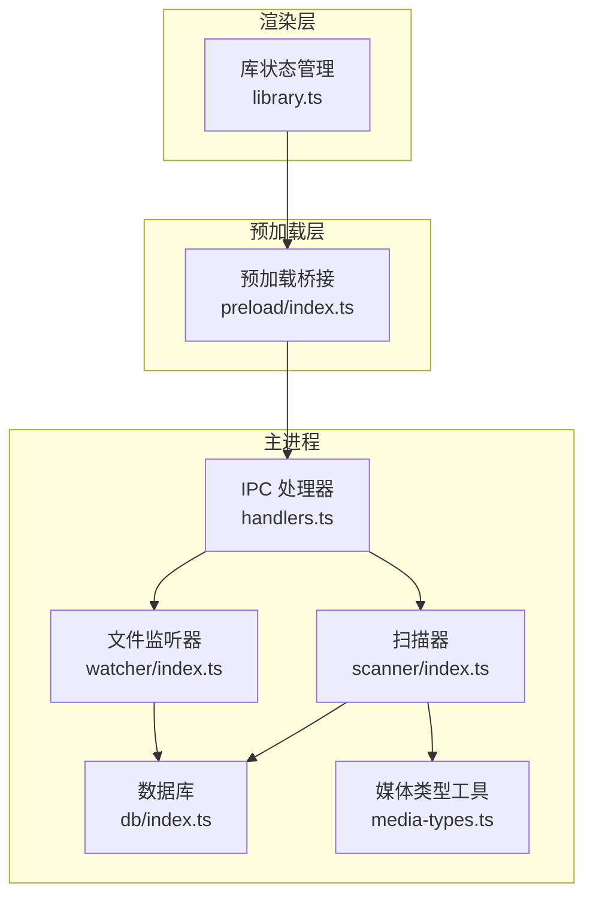
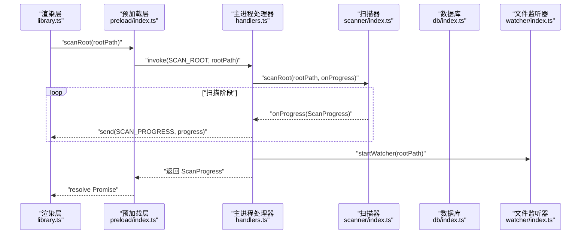
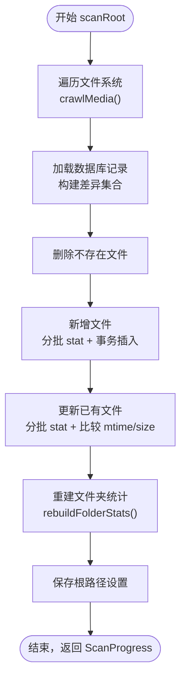
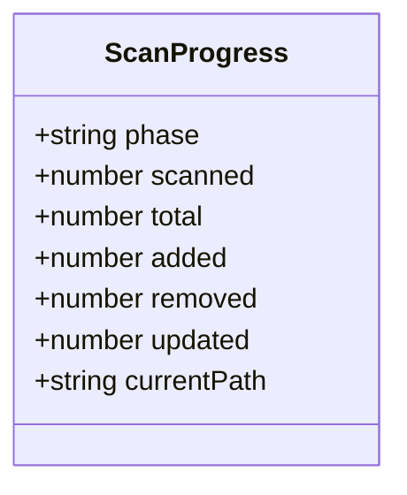
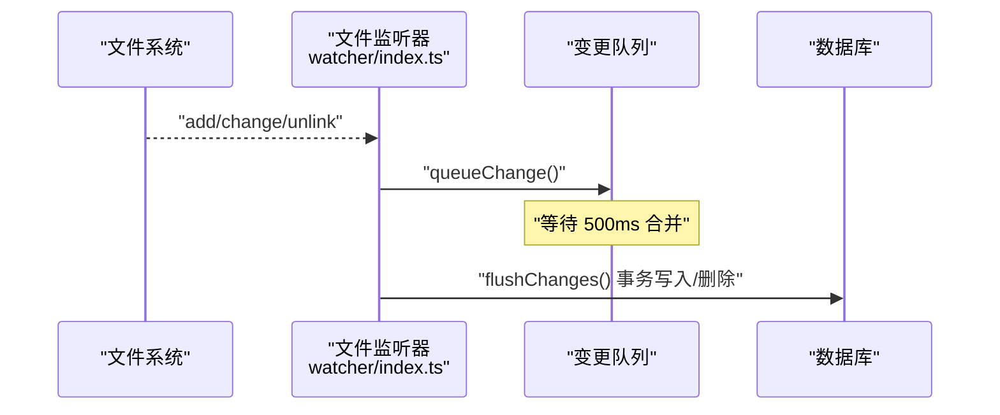
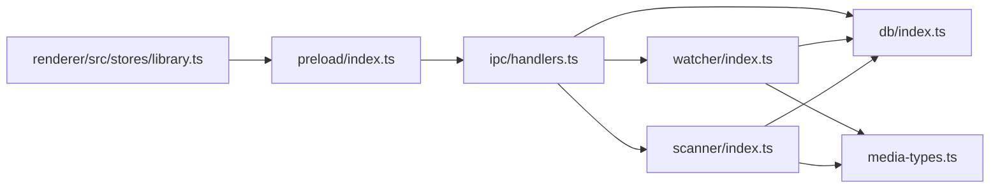

# 根目录扫描处理器

<cite>
**本文引用的文件**
- [src/main/scanner/index.ts](file://src/main/scanner/index.ts)
- [src/main/watcher/index.ts](file://src/main/watcher/index.ts)
- [src/main/db/index.ts](file://src/main/db/index.ts)
- [src/main/ipc/handlers.ts](file://src/main/ipc/handlers.ts)
- [src/main/ipc/contract.ts](file://src/main/ipc/contract.ts)
- [src/main/media-types.ts](file://src/main/media-types.ts)
- [src/preload/index.ts](file://src/preload/index.ts)
- [src/renderer/src/stores/library.ts](file://src/renderer/src/stores/library.ts)
</cite>

## 目录
1. [简介](#简介)
2. [项目结构](#项目结构)
3. [核心组件](#核心组件)
4. [架构总览](#架构总览)
5. [详细组件分析](#详细组件分析)
6. [依赖关系分析](#依赖关系分析)
7. [性能考量与优化](#性能考量与优化)
8. [故障排除指南](#故障排除指南)
9. [结论](#结论)

## 简介
本文件面向 Serendip 应用的“根目录扫描处理器”，聚焦于 SCAN_ROOT 处理器的增量同步算法、进度推送机制、scanRoot 函数实现原理（文件系统遍历、数据库更新、冲突解决策略）、ScanProgress 类型定义与事件数据结构、扫描配置选项与性能参数，以及与文件监听器集成和实时同步机制。同时涵盖大文件处理、内存管理与错误恢复策略，并提供扫描性能调优指南与常见问题排查方法。

## 项目结构
与根目录扫描相关的代码主要分布在主进程模块中：
- 扫描逻辑：scanner/index.ts
- 文件监听：watcher/index.ts
- 数据库初始化与迁移：db/index.ts
- IPC 接口与处理器：ipc/handlers.ts、ipc/contract.ts
- 媒体类型与缓存目录常量：media-types.ts
- 预加载桥接：preload/index.ts
- 渲染层状态管理（订阅进度）：renderer/src/stores/library.ts

图表来源
- [src/main/ipc/handlers.ts:52-60](file://src/main/ipc/handlers.ts#L52-L60)
- [src/main/scanner/index.ts:36-239](file://src/main/scanner/index.ts#L36-L239)
- [src/main/watcher/index.ts:16-37](file://src/main/watcher/index.ts#L16-L37)
- [src/main/db/index.ts:1-28](file://src/main/db/index.ts#L1-L28)
- [src/main/media-types.ts:1-38](file://src/main/media-types.ts#L1-L38)
- [src/preload/index.ts:78-86](file://src/preload/index.ts#L78-L86)
- [src/renderer/src/stores/library.ts:58-81](file://src/renderer/src/stores/library.ts#L58-L81)

章节来源
- [src/main/ipc/handlers.ts:52-60](file://src/main/ipc/handlers.ts#L52-L60)
- [src/main/scanner/index.ts:36-239](file://src/main/scanner/index.ts#L36-L239)
- [src/main/watcher/index.ts:16-37](file://src/main/watcher/index.ts#L16-L37)
- [src/main/db/index.ts:1-28](file://src/main/db/index.ts#L1-L28)
- [src/main/media-types.ts:1-38](file://src/main/media-types.ts#L1-L38)
- [src/preload/index.ts:78-86](file://src/preload/index.ts#L78-L86)
- [src/renderer/src/stores/library.ts:58-81](file://src/renderer/src/stores/library.ts#L58-L81)

## 核心组件
- ScanProgress 类型与进度回调
  - 定义在扫描器模块中，包含阶段、已扫描数、总数、新增/删除/更新计数以及当前路径等字段，用于向渲染层推送扫描进度。
- scanRoot 函数
  - 负责增量扫描根目录，执行文件系统遍历、差异计算、批量写入数据库、重建文件夹统计、保存根路径设置，并持续推送进度。
- crawlMedia 函数
  - 基于 fdir 进行高性能目录遍历，过滤出支持的媒体文件，自动跳过缓存与系统目录。
- rebuildFolderStats 函数
  - 根据 media_files 聚合生成 folders 表统计数据，修正 parent_path 与 depth。
- 文件监听器 watcher
  - 使用 chokidar 监听根目录变化，按类型合并变更，批量落库，实现实时增量同步。
- IPC 处理器与预加载桥接
  - 将 scanRoot 暴露为 IPC 接口，并在扫描过程中通过 IPC 通道推送进度；预加载层提供 onScanProgress 订阅能力。

章节来源
- [src/main/scanner/index.ts:8-18](file://src/main/scanner/index.ts#L8-L18)
- [src/main/scanner/index.ts:36-239](file://src/main/scanner/index.ts#L36-L239)
- [src/main/scanner/index.ts:245-268](file://src/main/scanner/index.ts#L245-L268)
- [src/main/scanner/index.ts:274-317](file://src/main/scanner/index.ts#L274-L317)
- [src/main/watcher/index.ts:16-37](file://src/main/watcher/index.ts#L16-L37)
- [src/main/ipc/handlers.ts:52-60](file://src/main/ipc/handlers.ts#L52-L60)
- [src/preload/index.ts:78-86](file://src/preload/index.ts#L78-L86)

## 架构总览
SCAN_ROOT 的端到端流程如下：
- 渲染层调用 window.api.scanRoot(rootPath)
- 预加载层转发至主进程 IPC 处理器
- 主进程处理器调用 scanner.scanRoot，期间通过回调推送进度到渲染层
- 扫描完成后启动文件监听器 startWatcher，进入实时同步模式

图表来源
- [src/renderer/src/stores/library.ts:58-81](file://src/renderer/src/stores/library.ts#L58-L81)
- [src/preload/index.ts:10-11](file://src/preload/index.ts#L10-L11)
- [src/main/ipc/handlers.ts:52-60](file://src/main/ipc/handlers.ts#L52-L60)
- [src/main/scanner/index.ts:36-239](file://src/main/scanner/index.ts#L36-L239)
- [src/main/watcher/index.ts:16-37](file://src/main/watcher/index.ts#L16-L37)

## 详细组件分析

### 增量同步算法与 scanRoot 实现原理
scanRoot 的核心步骤：
- 文件系统遍历
  - 使用 fdir 递归遍历根目录，过滤出图片/视频扩展名，跳过缓存与隐藏目录、node_modules、系统回收站等。
- 构建差异集合
  - 将文件系统结果与数据库中该根路径下的记录做对比：
    - 在 fs 不在 db：标记为新增
    - 在 db 不在 fs：标记为删除
    - 都在但 mtime/size 变化：标记为更新
- 批量写入数据库
  - 删除不存在的文件
  - 新增文件：分批 stat 获取 mtime/size，再事务插入
  - 更新文件：分批 stat 后比较 mtime/size，必要时更新；若之前被标记不可用且未变化则解封
- 重建文件夹统计
  - 清空根路径范围内的 folders 记录，重新聚合 media_files 生成 file_count、recursive_count、parent_path、depth 等
- 保存根路径设置
  - 将 rootPath 写入 settings 表
- 推送最终完成进度

图表来源
- [src/main/scanner/index.ts:36-239](file://src/main/scanner/index.ts#L36-L239)
- [src/main/scanner/index.ts:245-268](file://src/main/scanner/index.ts#L245-L268)
- [src/main/scanner/index.ts:274-317](file://src/main/scanner/index.ts#L274-L317)

章节来源
- [src/main/scanner/index.ts:36-239](file://src/main/scanner/index.ts#L36-L239)
- [src/main/scanner/index.ts:245-268](file://src/main/scanner/index.ts#L245-L268)
- [src/main/scanner/index.ts:274-317](file://src/main/scanner/index.ts#L274-L317)

### 进度推送机制与 ScanProgress 数据结构
- ScanProgress 字段说明
  - phase：当前阶段（walking/diffing/inserting/done）
  - scanned：已扫描数量
  - total：待处理总量（新增+更新）
  - added：新增数量
  - removed：删除数量
  - updated：更新数量
  - currentPath：当前处理的文件路径（可选）
- 推送时机
  - walking：开始遍历
  - diffing：完成遍历并开始差异计算
  - inserting：每批写入时推送（含新增与更新批次）
  - done：扫描完成
- 渲染层订阅
  - 通过 window.api.onScanProgress 订阅进度事件，实时更新 UI 状态

图表来源
- [src/main/scanner/index.ts:8-18](file://src/main/scanner/index.ts#L8-L18)
- [src/main/ipc/handlers.ts:52-60](file://src/main/ipc/handlers.ts#L52-L60)
- [src/preload/index.ts:78-86](file://src/preload/index.ts#L78-L86)
- [src/renderer/src/stores/library.ts:58-81](file://src/renderer/src/stores/library.ts#L58-L81)

章节来源
- [src/main/scanner/index.ts:8-18](file://src/main/scanner/index.ts#L8-L18)
- [src/main/ipc/handlers.ts:52-60](file://src/main/ipc/handlers.ts#L52-L60)
- [src/preload/index.ts:78-86](file://src/preload/index.ts#L78-L86)
- [src/renderer/src/stores/library.ts:58-81](file://src/renderer/src/stores/library.ts#L58-L81)

### 文件系统遍历与过滤策略
- 使用 fdir 进行异步遍历，支持 withPromise 方式获取结果
- 过滤规则
  - 跳过 .serendip-cache、以点开头的隐藏目录、node_modules、System Volume Information、$RECYCLE.BIN
  - 仅保留 getMediaType 返回 image/video 的文件
- 媒体类型判定
  - 基于扩展名匹配 IMAGE_EXTENSIONS 与 VIDEO_EXTENSIONS

章节来源
- [src/main/scanner/index.ts:245-268](file://src/main/scanner/index.ts#L245-L268)
- [src/main/media-types.ts:6-25](file://src/main/media-types.ts#L6-L25)
- [src/main/media-types.ts:32-37](file://src/main/media-types.ts#L32-L37)

### 数据库更新与冲突解决策略
- 新增
  - INSERT OR REPLACE INTO media_files (path, folder_path, type, mtime, size)
- 更新
  - UPDATE media_files SET mtime = ?, size = ?, unavailable = 0, unavailable_reason = NULL WHERE id = ?
- 解封
  - 当文件未被修改但之前被标记不可用时，UPDATE 将其恢复可用
- 删除
  - DELETE FROM media_files WHERE id IN (...)
- 事务与批量
  - 使用 db.transaction 包裹批量写入，提升性能
  - 新增与更新均按 BATCH_SIZE 分批处理，减少单次 I/O 压力

章节来源
- [src/main/scanner/index.ts:108-132](file://src/main/scanner/index.ts#L108-L132)
- [src/main/scanner/index.ts:134-168](file://src/main/scanner/index.ts#L134-L168)
- [src/main/scanner/index.ts:170-218](file://src/main/scanner/index.ts#L170-L218)
- [src/main/scanner/index.ts:102-105](file://src/main/scanner/index.ts#L102-L105)

### 与文件监听器的集成与实时同步机制
- 扫描完成后立即启动 watcher，监听根目录变化
- 监听事件
  - add/change/unlink 三类事件
- 变更队列与批量刷新
  - 将变更加入 changeQueue，延迟 500ms 触发 flushChanges
  - 对 add/change 执行 stat 获取 mtime/size，然后事务写入或更新
  - 对 unlink 直接删除对应记录
- 忽略规则
  - 与扫描器一致的忽略列表，避免无效 IO

图表来源
- [src/main/watcher/index.ts:16-37](file://src/main/watcher/index.ts#L16-L37)
- [src/main/watcher/index.ts:52-64](file://src/main/watcher/index.ts#L52-L64)
- [src/main/watcher/index.ts:66-116](file://src/main/watcher/index.ts#L66-L116)

章节来源
- [src/main/watcher/index.ts:16-37](file://src/main/watcher/index.ts#L16-L37)
- [src/main/watcher/index.ts:52-64](file://src/main/watcher/index.ts#L52-L64)
- [src/main/watcher/index.ts:66-116](file://src/main/watcher/index.ts#L66-L116)

### 大文件处理、内存管理与错误恢复策略
- 大文件处理
  - 仅读取元数据（mtime/size），不读取文件内容，避免大文件导致的内存峰值
  - 使用 Promise.all 并行 stat，提高吞吐
- 内存管理
  - 使用 Map 存储 fsMap 与 dbMap，便于 O(1) 查找
  - 分批处理（BATCH_SIZE=200），控制单批内存占用
- 错误恢复
  - stat 失败时跳过该文件，不影响整体扫描
  - 监听器中对异常静默处理，保证稳定性
  - 数据库启用 WAL 模式与 NORMAL 同步级别，提升并发与性能

章节来源
- [src/main/scanner/index.ts:134-168](file://src/main/scanner/index.ts#L134-L168)
- [src/main/scanner/index.ts:170-218](file://src/main/scanner/index.ts#L170-L218)
- [src/main/watcher/index.ts:66-116](file://src/main/watcher/index.ts#L66-L116)
- [src/main/db/index.ts:19-22](file://src/main/db/index.ts#L19-L22)

### 扫描配置选项与性能优化参数
- 可调整项
  - BATCH_SIZE：新增/更新批大小，默认 200，可根据磁盘与 CPU 情况调整
  - awaitWriteFinish.stabilityThreshold/pollInterval：监听器写完成检测阈值与轮询间隔，默认 500ms/100ms
  - 媒体类型扩展集：IMAGE_EXTENSIONS、VIDEO_EXTENSIONS，可按需添加新格式
- 建议
  - 对于大量小文件场景，适当增大 BATCH_SIZE 以提升吞吐
  - 对于网络盘或慢速磁盘，降低并发 stat 数量或增大稳定性阈值以减少抖动

章节来源
- [src/main/scanner/index.ts:135](file://src/main/scanner/index.ts#L135)
- [src/main/watcher/index.ts:29](file://src/main/watcher/index.ts#L29)
- [src/main/media-types.ts:6-25](file://src/main/media-types.ts#L6-L25)

## 依赖关系分析
- 模块耦合
  - scanner 依赖 db、media-types
  - watcher 依赖 db、media-types
  - handlers 协调 scanner、watcher、db
  - preload 暴露 API 给渲染层
- 外部依赖
  - fdir：高性能目录遍历
  - chokidar：文件系统监听
  - better-sqlite3：本地数据库
  - Electron IPC：主进程与渲染进程通信

图表来源
- [src/main/scanner/index.ts:1-6](file://src/main/scanner/index.ts#L1-L6)
- [src/main/watcher/index.ts:1-5](file://src/main/watcher/index.ts#L1-L5)
- [src/main/ipc/handlers.ts:1-38](file://src/main/ipc/handlers.ts#L1-L38)
- [src/preload/index.ts:1-7](file://src/preload/index.ts#L1-L7)
- [src/renderer/src/stores/library.ts:58-81](file://src/renderer/src/stores/library.ts#L58-L81)

章节来源
- [src/main/scanner/index.ts:1-6](file://src/main/scanner/index.ts#L1-L6)
- [src/main/watcher/index.ts:1-5](file://src/main/watcher/index.ts#L1-L5)
- [src/main/ipc/handlers.ts:1-38](file://src/main/ipc/handlers.ts#L1-L38)
- [src/preload/index.ts:1-7](file://src/preload/index.ts#L1-L7)
- [src/renderer/src/stores/library.ts:58-81](file://src/renderer/src/stores/library.ts#L58-L81)

## 性能考量与优化
- 数据库层面
  - 启用 WAL 模式与 NORMAL 同步级别，提升并发与写入性能
  - 使用事务批量写入，减少锁竞争与磁盘同步开销
- 文件系统层面
  - 使用 fdir 异步遍历，避免阻塞主线程
  - 分批 stat 与插入，控制内存峰值
- 监听器层面
  - 合并短时间内的变更，减少频繁写入
  - 忽略无关目录与文件，降低 IO 压力
- 推荐调优
  - 根据硬件与磁盘类型调整 BATCH_SIZE 与 awaitWriteFinish 参数
  - 定期清理 .serendip-cache 缓存目录，避免影响扫描范围

章节来源
- [src/main/db/index.ts:19-22](file://src/main/db/index.ts#L19-L22)
- [src/main/scanner/index.ts:134-168](file://src/main/scanner/index.ts#L134-L168)
- [src/main/watcher/index.ts:29](file://src/main/watcher/index.ts#L29)
- [src/main/media-types.ts:28](file://src/main/media-types.ts#L28)

## 故障排除指南
- 扫描卡住或缓慢
  - 检查磁盘性能与网络盘延迟，适当增大稳定性阈值或减小并发
  - 确认是否包含大量小文件或超大文件，调整 BATCH_SIZE
- 进度不更新
  - 确认渲染层是否正确订阅 onScanProgress，且在 finally 中取消订阅
  - 检查 IPC 通道名称是否一致
- 文件未入库或未删除
  - 查看监听器忽略规则，确认文件是否在忽略列表中
  - 检查数据库索引与约束，确保 path 唯一性
- 文件被误标记不可用
  - 下次扫描会尝试解封，如仍不可用，检查缩略图生成或其他下游流程的错误日志

章节来源
- [src/preload/index.ts:78-86](file://src/preload/index.ts#L78-L86)
- [src/main/watcher/index.ts:20-30](file://src/main/watcher/index.ts#L20-L30)
- [src/main/scanner/index.ts:170-218](file://src/main/scanner/index.ts#L170-L218)

## 结论
根目录扫描处理器通过高效的文件系统遍历、精确的差异计算与事务化批量写入，实现了稳定可靠的增量同步。结合文件监听器，应用能够在用户操作与文件变更后快速响应，保持数据库与文件系统的一致性。通过合理的批大小与监听器参数调优，可在不同硬件环境下获得良好的性能表现。