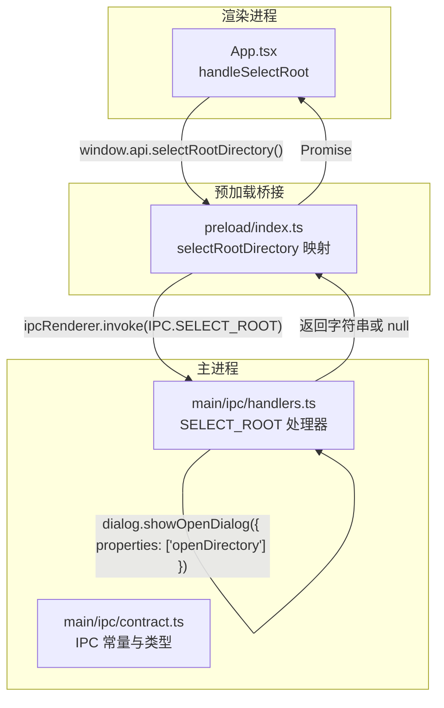
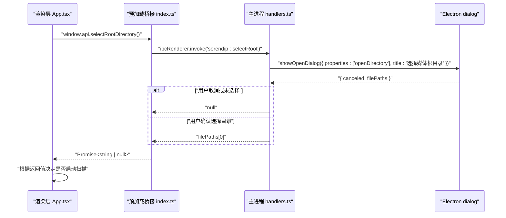
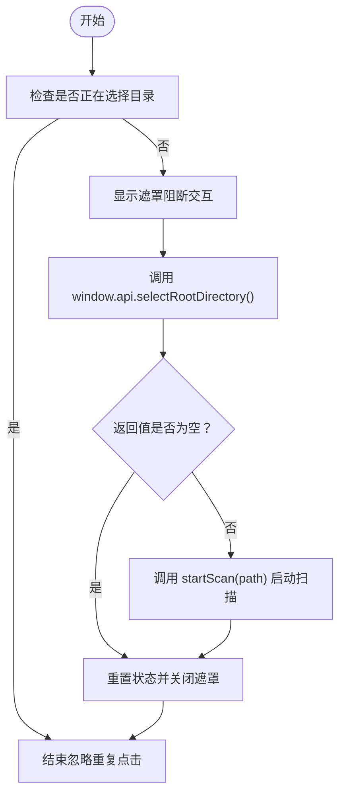
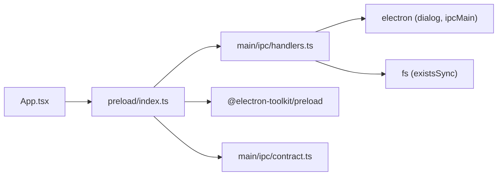

# 目录选择处理器

<cite>
**本文引用的文件**
- [src/main/ipc/handlers.ts](file://src/main/ipc/handlers.ts)
- [src/main/ipc/contract.ts](file://src/main/ipc/contract.ts)
- [src/preload/index.ts](file://src/preload/index.ts)
- [src/preload/index.d.ts](file://src/preload/index.d.ts)
- [src/renderer/src/App.tsx](file://src/renderer/src/App.tsx)
</cite>

## 目录
1. [简介](#简介)
2. [项目结构](#项目结构)
3. [核心组件](#核心组件)
4. [架构总览](#架构总览)
5. [详细组件分析](#详细组件分析)
6. [依赖关系分析](#依赖关系分析)
7. [性能与行为特性](#性能与行为特性)
8. [故障排查指南](#故障排查指南)
9. [结论](#结论)

## 简介
本文件聚焦于 Serendip 应用中的“目录选择处理器”，即 SELECT_ROOT 处理器的实现与使用。该处理器负责在主进程中调用 Electron 的对话框，弹出系统原生目录选择界面，接收用户选择的媒体根目录路径，并返回给渲染进程用于后续扫描与入库流程。文档将深入解释：
- Electron 对话框的调用方式与 openDirectory 属性配置
- 用户交互（取消、确认）与返回值处理
- 路径返回机制与类型契约
- 前端集成方式与数据传递格式
- 跨平台兼容性与权限检查注意事项
- 常见错误与调试方法

## 项目结构
目录选择功能涉及主进程 IPC 处理器、预加载桥接、以及渲染层调用点三个关键位置：
- 主进程处理器：注册 IPC 通道 SELECT_ROOT，调用 dialog.showOpenDialog 打开目录选择对话框
- 预加载桥接：将主进程暴露的 API 映射到 window.api.selectRootDirectory
- 渲染层调用：在 App 中触发选择目录，并在成功后启动扫描流程



图表来源
- [src/main/ipc/handlers.ts:40-49](file://src/main/ipc/handlers.ts#L40-L49)
- [src/main/ipc/contract.ts:85-86](file://src/main/ipc/contract.ts#L85-L86)
- [src/preload/index.ts:9-11](file://src/preload/index.ts#L9-L11)
- [src/renderer/src/App.tsx:233-247](file://src/renderer/src/App.tsx#L233-L247)

章节来源
- [src/main/ipc/handlers.ts:40-49](file://src/main/ipc/handlers.ts#L40-L49)
- [src/main/ipc/contract.ts:85-86](file://src/main/ipc/contract.ts#L85-L86)
- [src/preload/index.ts:9-11](file://src/preload/index.ts#L9-L11)
- [src/renderer/src/App.tsx:233-247](file://src/renderer/src/App.tsx#L233-L247)

## 核心组件
本节从代码层面解析目录选择处理器的关键实现要点。

- 主进程处理器（SELECT_ROOT）
  - 通过 ipcMain.handle 注册通道名 SELECT_ROOT
  - 调用 dialog.showOpenDialog，设置 properties 为 ['openDirectory']，以仅允许选择目录
  - 标题设置为“选择媒体根目录”
  - 若用户取消或未选择任何目录，返回 null；否则返回 filePaths[0]（首个选中目录的路径）

- 预加载桥接（selectRootDirectory）
  - 将 window.api.selectRootDirectory 映射到 ipcRenderer.invoke(IPC.SELECT_ROOT)
  - 返回 Promise<string | null>，与主进程处理器保持一致

- 渲染层调用（App.tsx）
  - handleSelectRoot 函数防止重复点击，显示遮罩阻断交互
  - 调用 window.api.selectRootDirectory()
  - 若返回有效路径，则启动扫描流程 startScan(path)
  - 无论成功或失败，最终都会重置状态并关闭遮罩

章节来源
- [src/main/ipc/handlers.ts:40-49](file://src/main/ipc/handlers.ts#L40-L49)
- [src/preload/index.ts:9-11](file://src/preload/index.ts#L9-L11)
- [src/renderer/src/App.tsx:233-247](file://src/renderer/src/App.tsx#L233-L247)

## 架构总览
目录选择处理器的整体交互流程如下：



图表来源
- [src/main/ipc/handlers.ts:40-49](file://src/main/ipc/handlers.ts#L40-L49)
- [src/preload/index.ts:9-11](file://src/preload/index.ts#L9-L11)
- [src/renderer/src/App.tsx:233-247](file://src/renderer/src/App.tsx#L233-L247)

## 详细组件分析

### 主进程处理器：SELECT_ROOT
- 实现要点
  - 使用 ipcMain.handle 绑定通道名 SELECT_ROOT
  - 调用 dialog.showOpenDialog，properties 包含 'openDirectory'，确保只允许选择目录
  - 标题文本为“选择媒体根目录”
  - 返回值策略：
    - 如果 result.canceled 为真或 filePaths 为空数组，返回 null
    - 否则返回 filePaths[0]（第一个选中的目录路径）

- 路径验证逻辑
  - 当前实现未对路径进行额外校验（如存在性、可读性等），直接返回所选路径
  - 如需增强，可在返回前增加 existsSync 等检查，并根据结果返回更明确的错误信息

- 错误处理
  - 当前未显式捕获异常，若 dialog 抛出异常，会向调用方传播
  - 建议在调用处（预加载或渲染层）增加 try/catch，以便展示友好的错误提示

章节来源
- [src/main/ipc/handlers.ts:40-49](file://src/main/ipc/handlers.ts#L40-L49)

### 预加载桥接：selectRootDirectory
- 实现要点
  - 将 window.api.selectRootDirectory 映射到 ipcRenderer.invoke(IPC.SELECT_ROOT)
  - 返回 Promise<string | null>，与主进程一致
  - 类型定义由 contract.ts 的 SerendipAPI 接口约束，保证前后端类型一致

- 数据传递格式
  - 输入：无参数
  - 输出：Promise<string | null>
    - 成功时返回所选目录的绝对路径字符串
    - 取消或未选择时返回 null

章节来源
- [src/preload/index.ts:9-11](file://src/preload/index.ts#L9-L11)
- [src/main/ipc/contract.ts:13-16](file://src/main/ipc/contract.ts#L13-L16)
- [src/preload/index.d.ts:4-8](file://src/preload/index.d.ts#L4-L8)

### 渲染层调用：App.tsx
- 实现要点
  - handleSelectRoot 函数：
    - 使用 pickingRootRef 防止重复点击导致多个对话框弹出
    - 设置 pickingRoot 为 true，显示全屏遮罩阻断交互
    - 调用 window.api.selectRootDirectory()
    - 若返回非空路径，则调用 startScan(path) 启动扫描
    - finally 块中重置状态并关闭遮罩

- 用户反馈
  - 当前未在该函数内直接展示错误提示或 Toast
  - 建议结合全局错误提示组件（例如自定义 Toast 或 ConfirmDialog）来反馈错误或取消操作

章节来源
- [src/renderer/src/App.tsx:233-247](file://src/renderer/src/App.tsx#L233-L247)

### 类图：目录选择相关类型与映射
```mermaid
classDiagram
class SerendipAPI {
+selectRootDirectory() Promise~string | null~
+scanRoot(rootPath : string) Promise~ScanProgress~
+getCurrentRoot() Promise~string | null~
+getStats() Promise~{ totalFiles : number; totalFolders : number; liked : number }~
}
class PreloadBridge {
+selectRootDirectory() Promise~string | null~
}
class Handlers {
+registerIpcHandlers() void
}
class App {
+handleSelectRoot() Promise~void~
}
SerendipAPI <.. PreloadBridge : "实现"
PreloadBridge --> Handlers : "invoke IPC"
App --> PreloadBridge : "调用"
```

图表来源
- [src/main/ipc/contract.ts:13-16](file://src/main/ipc/contract.ts#L13-L16)
- [src/preload/index.ts:9-11](file://src/preload/index.ts#L9-L11)
- [src/main/ipc/handlers.ts:40-49](file://src/main/ipc/handlers.ts#L40-L49)
- [src/renderer/src/App.tsx:233-247](file://src/renderer/src/App.tsx#L233-L247)

### 流程图：目录选择与扫描流程


图表来源
- [src/renderer/src/App.tsx:233-247](file://src/renderer/src/App.tsx#L233-L247)

## 依赖关系分析
- 主进程依赖
  - electron 模块：ipcMain、dialog
  - fs 模块：existsSync（在其他处理器中使用，目录选择处理器未直接使用）
  - 本地模块：scanner、recommender、categories、canvases、watcher（目录选择处理器未直接依赖）

- 预加载依赖
  - electron 模块：contextBridge、ipcRenderer
  - @electron-toolkit/preload：electronAPI
  - 本地类型：SerendipAPI、IPC、ScanProgress、ExploreMode、CanvasItemInput 等

- 渲染层依赖
  - React 状态与 ref：useState、useRef
  - 业务逻辑：startScan、其他 store 与工具函数



图表来源
- [src/renderer/src/App.tsx:233-247](file://src/renderer/src/App.tsx#L233-L247)
- [src/preload/index.ts:1-11](file://src/preload/index.ts#L1-L11)
- [src/main/ipc/handlers.ts:1-49](file://src/main/ipc/handlers.ts#L1-L49)
- [src/main/ipc/contract.ts:1-16](file://src/main/ipc/contract.ts#L1-L16)

章节来源
- [src/main/ipc/handlers.ts:1-49](file://src/main/ipc/handlers.ts#L1-L49)
- [src/preload/index.ts:1-11](file://src/preload/index.ts#L1-L11)
- [src/main/ipc/contract.ts:1-16](file://src/main/ipc/contract.ts#L1-L16)
- [src/renderer/src/App.tsx:233-247](file://src/renderer/src/App.tsx#L233-L247)

## 性能与行为特性
- 对话框阻塞行为
  - Electron 的 dialog.showOpenDialog 是同步阻塞的，会阻止主线程继续执行直到用户完成选择或取消
  - 渲染层通过遮罩阻断交互，避免用户在对话框打开期间误操作

- 返回值与类型安全
  - 统一返回 Promise<string | null>，便于调用方进行分支处理
  - 类型契约由 contract.ts 的 SerendipAPI 接口约束，减少前后端不一致风险

- 可扩展性
  - 当前未对路径进行有效性校验，可在主进程处理器中增加 existsSync 等检查，提升健壮性
  - 可考虑扩展 properties 选项（如多目录选择、默认路径等）以满足更多场景

[本节为通用指导，不直接分析具体文件]

## 故障排查指南
- 常见问题与解决方案
  - 问题：用户点击取消后，应用无反馈
    - 现象：handleSelectRoot 收到 null，但未提示用户
    - 解决：在渲染层增加错误提示（如 Toast 或 ConfirmDialog），告知用户已取消选择
  - 问题：重复点击导致多个对话框弹出
    - 现象：多次触发 handleSelectRoot
    - 解决：使用 pickingRootRef 防止重复点击，已在实现中处理
  - 问题：路径无效或不可访问
    - 现象：startScan 可能因路径不存在而失败
    - 解决：在主进程处理器中增加路径存在性检查，或在调用 startScan 前进行校验

- 调试方法
  - 在主进程处理器中添加日志，记录 dialog 返回的 canceled 和 filePaths
  - 在预加载桥接中打印 invoke 的返回值
  - 在渲染层 handleSelectRoot 中打印 path 值，确认是否正确进入 startScan

章节来源
- [src/main/ipc/handlers.ts:40-49](file://src/main/ipc/handlers.ts#L40-L49)
- [src/renderer/src/App.tsx:233-247](file://src/renderer/src/App.tsx#L233-L247)

## 结论
目录选择处理器通过简洁的 IPC 通道实现了主进程与渲染进程的协作，利用 Electron 的原生对话框提供一致的跨平台体验。当前实现已满足基本需求，但在路径验证、错误处理和用户反馈方面仍有优化空间。建议：
- 在主进程处理器中增加路径存在性与可读性检查
- 在渲染层增加错误提示与用户反馈
- 保持类型契约的一致性，确保前后端行为对齐

[本节为总结性内容，不直接分析具体文件]