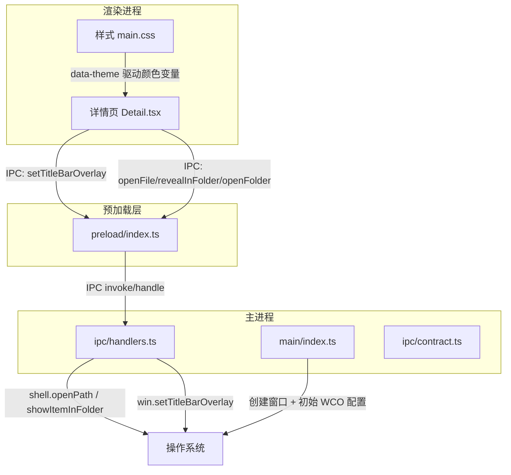
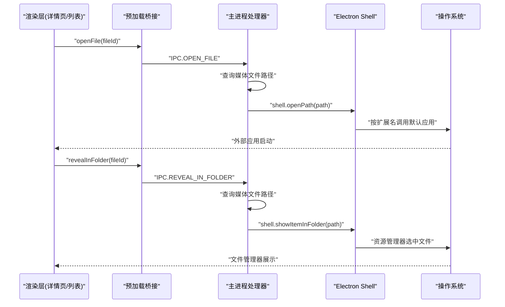
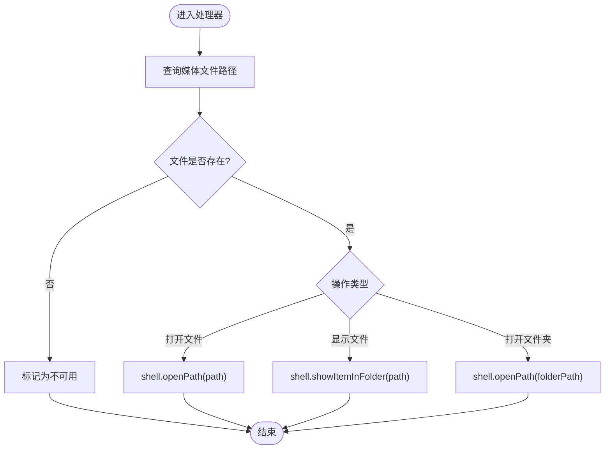
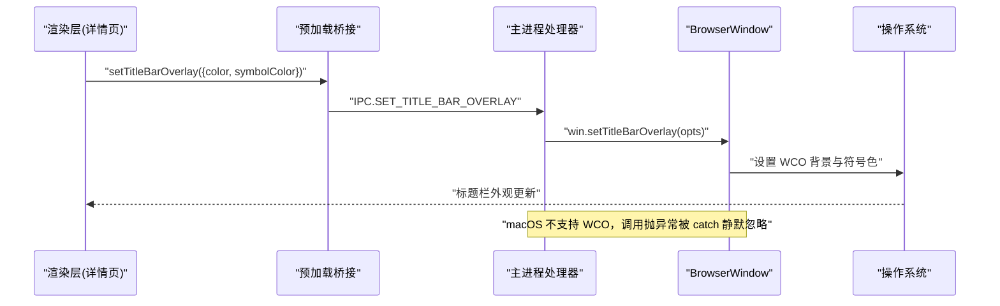
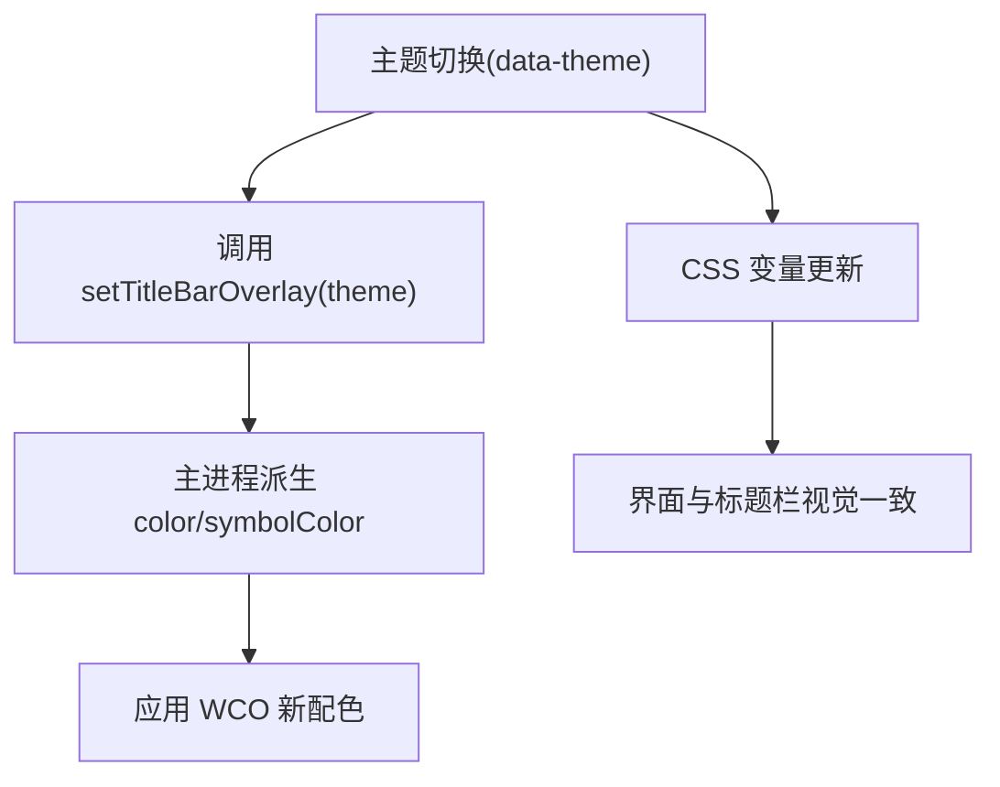
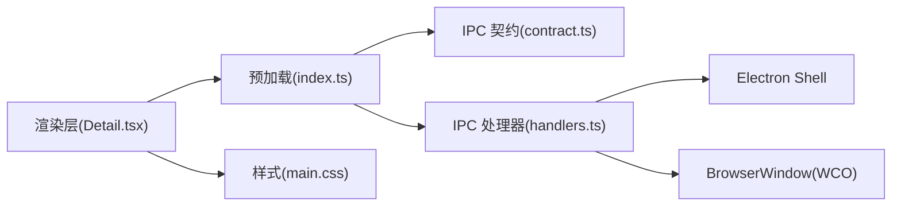

# 系统集成处理器

<cite>
**本文引用的文件**   
- [src/main/index.ts](file://src/main/index.ts)
- [src/main/ipc/handlers.ts](file://src/main/ipc/handlers.ts)
- [src/main/ipc/contract.ts](file://src/main/ipc/contract.ts)
- [src/preload/index.ts](file://src/preload/index.ts)
- [src/renderer/src/views/Detail.tsx](file://src/renderer/src/views/Detail.tsx)
- [src/renderer/src/assets/main.css](file://src/renderer/src/assets/main.css)
</cite>

## 目录
1. [简介](#简介)
2. [项目结构](#项目结构)
3. [核心组件](#核心组件)
4. [架构总览](#架构总览)
5. [详细组件分析](#详细组件分析)
6. [依赖关系分析](#依赖关系分析)
7. [性能考量](#性能考量)
8. [故障排查指南](#故障排查指南)
9. [结论](#结论)
10. [附录](#附录)

## 简介
本文件聚焦 Serendip 应用的“系统集成处理器”，围绕以下目标展开：
- 深入解释 shell.openPath 与 shell.showItemInFolder 的使用方式、调用路径与平台行为差异。
- 说明系统默认应用打开机制与文件关联处理流程。
- 阐述窗口装饰控制 API（WCO，Windows Controls Overlay）的实现细节，包括配置项、主题切换与标题栏控制。
- 提供主题切换、标题栏控制与平台兼容性处理的示例指引。
- 解释与操作系统集成的安全限制与权限要求。
- 涵盖不同平台的差异处理与降级策略。
- 给出系统集成调试工具与性能监控方法。

## 项目结构
与系统集成相关的代码主要分布在主进程、预加载脚本与渲染层视图之间，通过 IPC 契约进行通信。关键位置如下：
- 主进程入口与窗口初始化：[src/main/index.ts](file://src/main/index.ts)
- IPC 处理器（含系统调用与 WCO 设置）：[src/main/ipc/handlers.ts](file://src/main/ipc/handlers.ts)
- IPC 类型契约与通道名定义：[src/main/ipc/contract.ts](file://src/main/ipc/contract.ts)
- 预加载桥接（向渲染进程暴露 API）：[src/preload/index.ts](file://src/preload/index.ts)
- 详情页对 WCO 的运行时控制：[src/renderer/src/views/Detail.tsx](file://src/renderer/src/views/Detail.tsx)
- 主题变量与 CSS 变量体系：[src/renderer/src/assets/main.css](file://src/renderer/src/assets/main.css)

图表来源
- [src/main/index.ts:38-91](file://src/main/index.ts#L38-L91)
- [src/main/ipc/handlers.ts:156-185](file://src/main/ipc/handlers.ts#L156-L185)
- [src/main/ipc/handlers.ts:252-284](file://src/main/ipc/handlers.ts#L252-L284)
- [src/preload/index.ts:88-89](file://src/preload/index.ts#L88-L89)
- [src/renderer/src/views/Detail.tsx:239-249](file://src/renderer/src/views/Detail.tsx#L239-L249)
- [src/renderer/src/assets/main.css:15-40](file://src/renderer/src/assets/main.css#L15-L40)

章节来源
- [src/main/index.ts:38-91](file://src/main/index.ts#L38-L91)
- [src/main/ipc/handlers.ts:156-185](file://src/main/ipc/handlers.ts#L156-L185)
- [src/main/ipc/handlers.ts:252-284](file://src/main/ipc/handlers.ts#L252-L284)
- [src/preload/index.ts:88-89](file://src/preload/index.ts#L88-L89)
- [src/renderer/src/views/Detail.tsx:239-249](file://src/renderer/src/views/Detail.tsx#L239-L249)
- [src/renderer/src/assets/main.css:15-40](file://src/renderer/src/assets/main.css#L15-L40)

## 核心组件
- 系统文件操作处理器
  - 在文件管理器中显示：基于数据库查询获取文件路径后调用系统 API 高亮并定位到该文件。
  - 使用系统默认应用打开文件：根据文件扩展名交由系统关联的应用程序打开。
  - 打开文件夹：直接以资源管理器打开指定目录。
- 窗口装饰控制（WCO）
  - 主进程窗口初始化时为 Win/Linux 设置初始 WCO 背景色与符号色。
  - 渲染层在详情页打开/关闭或主题切换时动态调整 WCO 的背景色与符号色，实现沉浸式与主题一致。
- 预加载桥接
  - 将系统级能力封装为安全的 window.api 方法，供渲染进程调用。
- 契约与类型
  - 统一 IPC 通道名与 API 签名，确保主/渲染端一致性。

章节来源
- [src/main/ipc/handlers.ts:156-185](file://src/main/ipc/handlers.ts#L156-L185)
- [src/main/ipc/handlers.ts:252-284](file://src/main/ipc/handlers.ts#L252-L284)
- [src/main/index.ts:38-91](file://src/main/index.ts#L38-L91)
- [src/preload/index.ts:88-89](file://src/preload/index.ts#L88-L89)
- [src/main/ipc/contract.ts:72-75](file://src/main/ipc/contract.ts#L72-L75)

## 架构总览
下图展示了从渲染层触发系统集成功能的主流程，包括“用默认应用打开”和“在文件管理器中显示”。

图表来源
- [src/main/ipc/handlers.ts:156-185](file://src/main/ipc/handlers.ts#L156-L185)
- [src/preload/index.ts:30-32](file://src/preload/index.ts#L30-L32)
- [src/main/ipc/contract.ts:99-101](file://src/main/ipc/contract.ts#L99-L101)

章节来源
- [src/main/ipc/handlers.ts:156-185](file://src/main/ipc/handlers.ts#L156-L185)
- [src/preload/index.ts:30-32](file://src/preload/index.ts#L30-L32)
- [src/main/ipc/contract.ts:99-101](file://src/main/ipc/contract.ts#L99-L101)

## 详细组件分析

### 组件一：系统文件操作处理器（shell.openPath 与 shell.showItemInFolder）
- 功能职责
  - 打开文件：通过 shell.openPath 调用系统默认应用打开指定路径的文件。
  - 显示文件：通过 shell.showItemInFolder 在系统文件管理器中高亮并定位到指定文件。
  - 打开文件夹：通过 shell.openPath 打开目录（不选中具体文件）。
- 数据流与校验
  - 先通过数据库查询获取文件路径；若不存在则标记失效，避免无效调用。
  - 返回结果由 IPC 传递至渲染层，渲染层可据此更新 UI 状态。
- 平台差异与降级
  - Windows/Linux/macOS 均支持上述 shell API；异常场景下建议捕获错误并提示用户。
- 典型调用点
  - 上下文菜单中的“使用默认应用打开”、“在文件管理器中显示”。

图表来源
- [src/main/ipc/handlers.ts:156-185](file://src/main/ipc/handlers.ts#L156-L185)

章节来源
- [src/main/ipc/handlers.ts:156-185](file://src/main/ipc/handlers.ts#L156-L185)

### 组件二：窗口装饰控制（WCO）与标题栏
- 初始化配置
  - 主进程在创建窗口时为 Win/Linux 设置 titleBarStyle 为 hidden，并通过 titleBarOverlay 提供初始背景色与符号色，高度固定为 64px。
- 运行时控制
  - 渲染层在详情页打开时传入全透明背景与合适的符号色，形成沉浸式效果；关闭时恢复为主题派生色。
  - 主题切换时，通过 theme 参数让主进程自动派生 color/symbolColor，保证按钮区与 header 视觉协调。
- 平台兼容性与降级
  - macOS 不支持 WCO，调用会抛出异常；主进程已做 try/catch 静默忽略，保持默认信号灯可见。
  - Linux 与 Windows 行为一致，但部分发行版可能表现略有差异，建议在 UI 上预留回退方案（如隐藏自定义区域）。

图表来源
- [src/main/index.ts:47-59](file://src/main/index.ts#L47-L59)
- [src/main/ipc/handlers.ts:252-284](file://src/main/ipc/handlers.ts#L252-L284)
- [src/renderer/src/views/Detail.tsx:239-249](file://src/renderer/src/views/Detail.tsx#L239-L249)
- [src/preload/index.ts:88-89](file://src/preload/index.ts#L88-L89)

章节来源
- [src/main/index.ts:47-59](file://src/main/index.ts#L47-L59)
- [src/main/ipc/handlers.ts:252-284](file://src/main/ipc/handlers.ts#L252-L284)
- [src/renderer/src/views/Detail.tsx:239-249](file://src/renderer/src/views/Detail.tsx#L239-L249)
- [src/preload/index.ts:88-89](file://src/preload/index.ts#L88-L89)

### 组件三：主题切换与标题栏联动
- 主题变量
  - 通过 data-theme 属性切换亮/暗主题，CSS 变量随之变化，影响界面整体配色。
- 标题栏联动
  - 当主题切换时，渲染层可通过 setTitleBarOverlay 传入 theme，主进程据此派生 color/symbolColor，使 WCO 与界面保持一致。
- 示例要点
  - 详情页打开时传入精确背景色以实现沉浸；主页返回时使用 theme 派生标准色。
  - 亮色主题下 hover 高亮需要一定底色对比度，因此不建议使用全透明。

图表来源
- [src/renderer/src/assets/main.css:15-40](file://src/renderer/src/assets/main.css#L15-L40)
- [src/main/ipc/handlers.ts:265-271](file://src/main/ipc/handlers.ts#L265-L271)
- [src/renderer/src/views/Detail.tsx:239-249](file://src/renderer/src/views/Detail.tsx#L239-L249)

章节来源
- [src/renderer/src/assets/main.css:15-40](file://src/renderer/src/assets/main.css#L15-L40)
- [src/main/ipc/handlers.ts:265-271](file://src/main/ipc/handlers.ts#L265-L271)
- [src/renderer/src/views/Detail.tsx:239-249](file://src/renderer/src/views/Detail.tsx#L239-L249)

### 组件四：预加载桥接与 IPC 契约
- 预加载桥接
  - 将系统能力封装为 window.api，包含 openFile、revealInFolder、openFolder、setTitleBarOverlay 等。
- 契约与类型
  - 统一 IPC 通道名与 API 签名，确保主/渲染端一致，便于维护与扩展。
- 安全边界
  - 仅暴露必要接口，避免直接访问敏感系统 API；所有系统调用在主进程侧执行。

章节来源
- [src/preload/index.ts:30-32](file://src/preload/index.ts#L30-L32)
- [src/preload/index.ts:88-89](file://src/preload/index.ts#L88-L89)
- [src/main/ipc/contract.ts:72-75](file://src/main/ipc/contract.ts#L72-L75)
- [src/main/ipc/contract.ts:99-101](file://src/main/ipc/contract.ts#L99-L101)

## 依赖关系分析
- 模块耦合
  - 渲染层仅依赖预加载桥接暴露的 API，不直接访问 Electron 原生对象。
  - 主进程集中处理系统调用，降低渲染层复杂度与安全风险。
- 外部依赖
  - Electron 的 shell 与 BrowserWindow 提供系统集成能力。
  - 主题与样式通过 CSS 变量与 data-theme 管理，与 WCO 配置解耦。

图表来源
- [src/renderer/src/views/Detail.tsx:239-249](file://src/renderer/src/views/Detail.tsx#L239-L249)
- [src/preload/index.ts:88-89](file://src/preload/index.ts#L88-L89)
- [src/main/ipc/contract.ts:72-75](file://src/main/ipc/contract.ts#L72-L75)
- [src/main/ipc/handlers.ts:252-284](file://src/main/ipc/handlers.ts#L252-L284)
- [src/renderer/src/assets/main.css:15-40](file://src/renderer/src/assets/main.css#L15-L40)

章节来源
- [src/renderer/src/views/Detail.tsx:239-249](file://src/renderer/src/views/Detail.tsx#L239-L249)
- [src/preload/index.ts:88-89](file://src/preload/index.ts#L88-L89)
- [src/main/ipc/contract.ts:72-75](file://src/main/ipc/contract.ts#L72-L75)
- [src/main/ipc/handlers.ts:252-284](file://src/main/ipc/handlers.ts#L252-L284)
- [src/renderer/src/assets/main.css:15-40](file://src/renderer/src/assets/main.css#L15-L40)

## 性能考量
- 视频叠加平面优化
  - 主进程启动时禁用 DirectComposition 视频叠加特性，避免全屏色彩闪烁问题，同时保留硬件解码与合成。
- WCO 重绘成本
  - 频繁切换 WCO 配色可能导致重绘开销，建议仅在必要时（如详情页开关、主题切换）调用。
- 文件系统 I/O
  - 打开/显示文件前进行存在性检查，减少无效系统调用与错误分支。

章节来源
- [src/main/index.ts:12-23](file://src/main/index.ts#L12-L23)
- [src/main/ipc/handlers.ts:156-185](file://src/main/ipc/handlers.ts#L156-L185)

## 故障排查指南
- 常见问题
  - 无法打开文件：确认数据库路径有效且文件存在；检查系统默认应用关联是否正确。
  - 文件管理器未定位：确认路径存在且具备读取权限；某些网络路径可能需要额外权限。
  - WCO 不生效（macOS）：该平台不支持 WCO，属于预期行为；可在 UI 上提示或回退到默认标题栏。
- 调试建议
  - 在主进程处理器中添加日志输出，记录调用参数与返回值。
  - 在渲染层捕获 Promise 拒绝，打印错误堆栈以便定位。
  - 使用浏览器开发者工具观察 IPC 事件与窗口状态变化。
- 降级策略
  - 对于不支持 WCO 的平台，保持默认标题栏可见；对于不支持特定 shell 行为的旧版本 Electron，考虑回退到替代方案（如打开父目录后再手动选择文件）。

章节来源
- [src/main/ipc/handlers.ts:252-284](file://src/main/ipc/handlers.ts#L252-L284)
- [src/main/index.ts:47-59](file://src/main/index.ts#L47-L59)

## 结论
Serendip 的系统集成处理器通过清晰的 IPC 分层与平台差异化处理，实现了稳定的文件打开与文件管理器定位能力，并在 Windows/Linux 上提供了高质量的 WCO 标题栏体验。通过主题联动与降级策略，应用在多平台上保持了良好的一致性与可用性。后续可进一步引入更完善的错误上报与性能埋点，以提升可观测性与用户体验。

## 附录
- 相关 API 参考
  - shell.openPath：使用系统默认应用打开文件或目录。
  - shell.showItemInFolder：在系统文件管理器中高亮并定位到指定文件。
  - win.setTitleBarOverlay：设置 WCO 背景与符号色（Windows 11 及更高版本支持）。
- 最佳实践
  - 始终在主进程执行系统调用，渲染层仅负责触发与展示。
  - 对路径有效性进行前置校验，避免无效系统调用。
  - 针对不支持的特性进行优雅降级，并提供用户反馈。