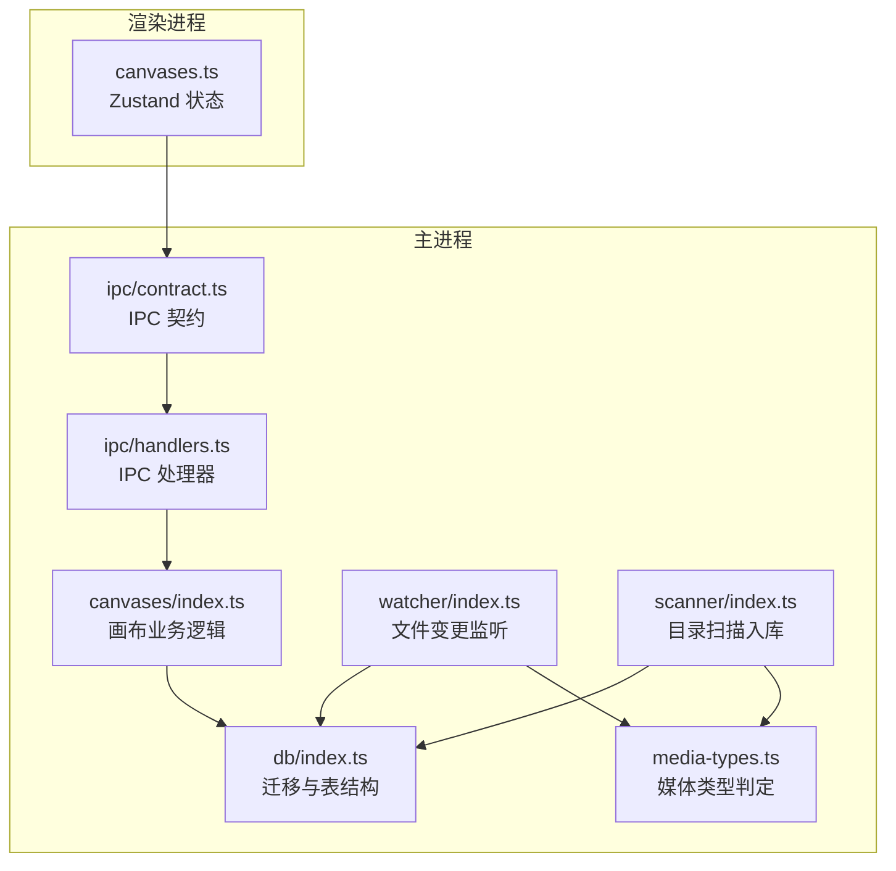
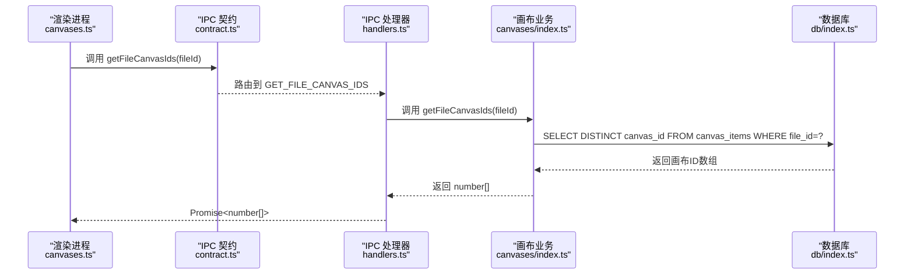
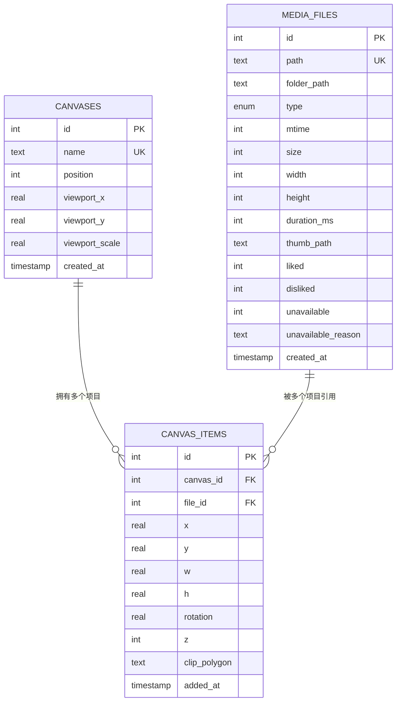
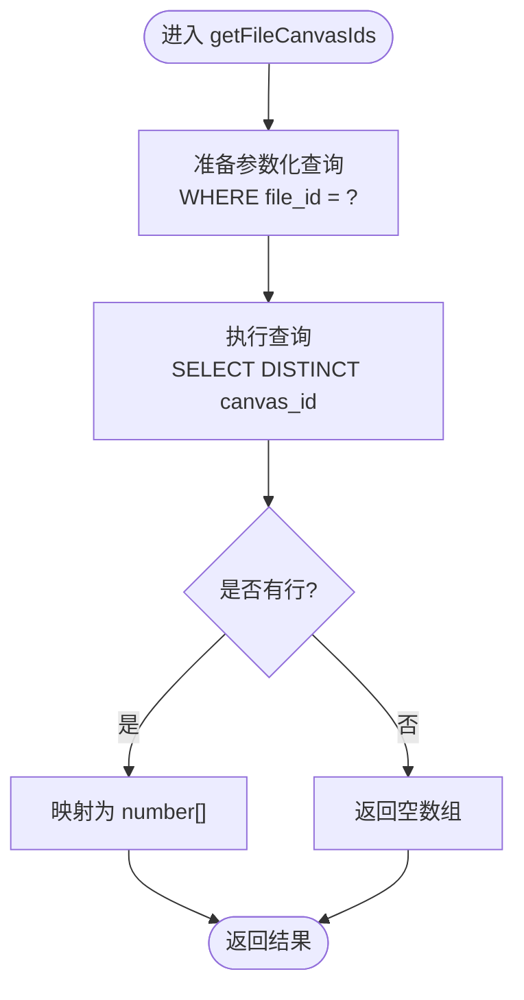
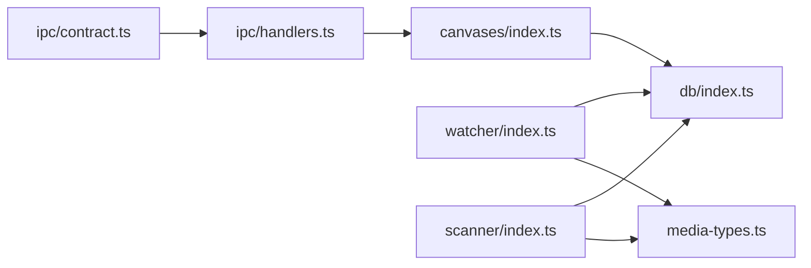

# 文件关联查询

<cite>
**本文引用的文件列表**
- [src/main/canvases/index.ts](file://src/main/canvases/index.ts)
- [src/main/db/index.ts](file://src/main/db/index.ts)
- [src/main/ipc/handlers.ts](file://src/main/ipc/handlers.ts)
- [src/main/ipc/contract.ts](file://src/main/ipc/contract.ts)
- [src/renderer/src/stores/canvases.ts](file://src/renderer/src/stores/canvases.ts)
- [src/main/watcher/index.ts](file://src/main/watcher/index.ts)
- [src/main/scanner/index.ts](file://src/main/scanner/index.ts)
- [src/main/media-types.ts](file://src/main/media-types.ts)
</cite>

## 目录
1. [简介](#简介)
2. [项目结构](#项目结构)
3. [核心组件](#核心组件)
4. [架构总览](#架构总览)
5. [详细组件分析](#详细组件分析)
6. [依赖关系分析](#依赖关系分析)
7. [性能考量](#性能考量)
8. [故障排查指南](#故障排查指南)
9. [结论](#结论)
10. [附录](#附录)

## 简介
本文件围绕 Serendip 应用中的“文件与画布”的关联查询能力展开，重点解析用于查询某媒体文件所属所有画布 ID 的函数实现、多对多关系设计、跨画布引用管理与去重机制、路径解析与有效性验证、缓存与实时更新策略，以及索引优化与查询计划分析等实践。目标是帮助读者快速理解并高效扩展该功能。

## 项目结构
与“文件-画布”关联查询相关的代码主要分布在以下模块：
- 主进程业务层：画布与文件关联的业务逻辑与数据库访问
- 数据迁移与表结构：定义画布、画布项、媒体文件的表结构与索引
- IPC 契约与处理器：渲染进程通过 IPC 调用主进程接口
- 渲染进程状态管理：调用 IPC 获取结果并在 UI 中使用
- 文件系统扫描与监听：负责媒体文件入库、失效标记与增量同步
- 媒体类型判定：决定哪些文件被纳入库中

图表来源
- [src/main/ipc/contract.ts:1-130](file://src/main/ipc/contract.ts#L1-L130)
- [src/main/ipc/handlers.ts:213-250](file://src/main/ipc/handlers.ts#L213-L250)
- [src/main/canvases/index.ts:298-305](file://src/main/canvases/index.ts#L298-L305)
- [src/main/db/index.ts:139-175](file://src/main/db/index.ts#L139-L175)
- [src/main/watcher/index.ts:1-56](file://src/main/watcher/index.ts#L1-L56)
- [src/main/scanner/index.ts:1-36](file://src/main/scanner/index.ts#L1-L36)
- [src/main/media-types.ts:1-38](file://src/main/media-types.ts#L1-L38)

章节来源
- [src/main/ipc/contract.ts:1-130](file://src/main/ipc/contract.ts#L1-L130)
- [src/main/ipc/handlers.ts:213-250](file://src/main/ipc/handlers.ts#L213-L250)
- [src/main/canvases/index.ts:298-305](file://src/main/canvases/index.ts#L298-L305)
- [src/main/db/index.ts:139-175](file://src/main/db/index.ts#L139-L175)
- [src/main/watcher/index.ts:1-56](file://src/main/watcher/index.ts#L1-L56)
- [src/main/scanner/index.ts:1-36](file://src/main/scanner/index.ts#L1-L36)
- [src/main/media-types.ts:1-38](file://src/main/media-types.ts#L1-L38)

## 核心组件
- 画布与文件的多对多关系
  - 画布元数据表：存储画布名称、位置、视口等
  - 画布项目表：记录某个画布包含的媒体文件及其布局信息（坐标、尺寸、旋转、层级、裁剪多边形等）
  - 媒体文件表：记录媒体文件的路径、类型、宽高、时长、缩略图路径、是否可用等
- 关键查询函数
  - getFileCanvasIds(fileId): 返回某媒体文件出现在哪些画布中（用于 Picker 高亮）
  - getMediaDimensions(fileIds): 批量获取媒体真实宽高（用于自动网格布局）
- IPC 暴露
  - GET_FILE_CANVAS_IDS: 渲染进程通过此通道请求某文件的画布集合
- 实时性与一致性
  - 文件变更监听与扫描入库保证 media_files 与文件系统一致
  - 删除画布时通过外键级联自动清理 canvas_items

章节来源
- [src/main/canvases/index.ts:298-305](file://src/main/canvases/index.ts#L298-L305)
- [src/main/canvases/index.ts:311-320](file://src/main/canvases/index.ts#L311-L320)
- [src/main/ipc/handlers.ts:248-250](file://src/main/ipc/handlers.ts#L248-L250)
- [src/main/ipc/contract.ts:67](file://src/main/ipc/contract.ts#L67)
- [src/main/db/index.ts:139-175](file://src/main/db/index.ts#L139-L175)

## 架构总览
下图展示了从渲染进程发起“获取文件所属画布 ID”到主进程执行 SQL 查询的完整流程。

图表来源
- [src/renderer/src/stores/canvases.ts:1-68](file://src/renderer/src/stores/canvases.ts#L1-L68)
- [src/main/ipc/contract.ts:67](file://src/main/ipc/contract.ts#L67)
- [src/main/ipc/handlers.ts:248-250](file://src/main/ipc/handlers.ts#L248-L250)
- [src/main/canvases/index.ts:298-305](file://src/main/canvases/index.ts#L298-L305)
- [src/main/db/index.ts:139-175](file://src/main/db/index.ts#L139-L175)

## 详细组件分析

### 文件-画布多对多关系设计与数据模型
- 表关系
  - canvases：画布主表，唯一名 + position 排序 + viewport 持久化
  - canvas_items：画布与媒体文件的关联表，无 UNIQUE 约束，允许同一文件在同一画布多次出现（不同布局实例）
  - media_files：媒体文件主表，path 唯一，记录类型、尺寸、时长、缩略图路径、可用性标记等
- 外键与级联
  - canvas_items.canvas_id -> canvases.id ON DELETE CASCADE
  - canvas_items.file_id -> media_files.id ON DELETE CASCADE
- 索引
  - idx_canvas_items_canvas：加速按画布查询其包含的文件
  - idx_canvas_items_file：加速按文件查询其所在画布（getFileCanvasIds 的关键索引）

图表来源
- [src/main/db/index.ts:139-175](file://src/main/db/index.ts#L139-L175)

章节来源
- [src/main/db/index.ts:139-175](file://src/main/db/index.ts#L139-L175)

### getFileCanvasIds 函数实现详解
- 输入：fileId（媒体文件主键）
- 输出：number[]（该文件所在的所有画布 ID，去重）
- 实现要点
  - 使用 SELECT DISTINCT 确保即使同一文件在同一个画布中出现多次，也只返回一次画布 ID
  - 利用 idx_canvas_items_file 索引进行高效查找
  - 返回扁平 ID 列表供上层 UI 做高亮或筛选

图表来源
- [src/main/canvases/index.ts:298-305](file://src/main/canvases/index.ts#L298-L305)

章节来源
- [src/main/canvases/index.ts:298-305](file://src/main/canvases/index.ts#L298-L305)

### 跨画布的文件引用管理与去重机制
- 同文件可加入同一画布多次（例如不同布局实例），但 getFileCanvasIds 使用 DISTINCT 仅返回唯一画布 ID，避免重复高亮
- 若需统计“某画布内某文件出现的次数”，可在查询层增加 COUNT(*) 聚合；当前实现不返回计数
- 删除画布时，外键级联会自动清理 canvas_items，不会残留脏数据

章节来源
- [src/main/canvases/index.ts:298-305](file://src/main/canvases/index.ts#L298-L305)
- [src/main/db/index.ts:139-175](file://src/main/db/index.ts#L139-L175)

### 复杂条件查询与结果聚合示例
- 查询某文件所在画布并按画布名排序
  - 思路：JOIN canvases 表，ORDER BY c.name
- 查询某文件所在画布并附带每个画布的项目总数
  - 思路：LEFT JOIN 后 GROUP BY c.id，COUNT(ci.id)
- 查询某文件所在画布且过滤未失效文件
  - 思路：WHERE mf.unavailable = 0
- 查询某文件所在画布并按最近添加时间倒序
  - 思路：ORDER BY ci.added_at DESC

注意：以上为查询思路示例，实际实现可按需在业务层组合 SQL。

[本节为概念性说明，不直接分析具体文件]

### 文件路径解析与有效性验证逻辑
- 路径来源
  - media_files.path 由扫描器写入，保持绝对路径
- 有效性验证
  - 打开文件或显示在文件夹前，会检查文件是否存在；不存在则标记 unavailable=1 并记录原因
  - 缩略图生成失败、文件损坏等情况也会标记 unavailable
- 根目录范围限制
  - 部分查询限定在 settings.rootPath 下，避免越界读取
- 媒体类型判定
  - 基于扩展名判断 image/video，用于过滤非媒体文件

章节来源
- [src/main/ipc/handlers.ts:157-171](file://src/main/ipc/handlers.ts#L157-L171)
- [src/main/thumbnailer/protocol.ts:221-232](file://src/main/thumbnailer/protocol.ts#L221-L232)
- [src/main/scanner/index.ts:1-36](file://src/main/scanner/index.ts#L1-L36)
- [src/main/media-types.ts:1-38](file://src/main/media-types.ts#L1-L38)

### 关联数据的缓存策略与实时更新机制
- 前端缓存
  - 渲染进程通过 Zustand store 维护画布列表与视图状态，减少频繁 IPC 往返
- 后端缓存
  - 缩略图与全分辨率图片采用磁盘缓存（.serendip-cache），提升加载速度
- 实时更新
  - 文件监听器 chokidar 收集 add/change/unlink 事件，合并入队列，防抖后批量写库
  - 扫描器定期或手动触发，增量 diff 文件系统与数据库，更新 mtime/size，解封已恢复文件
- 视口防抖
  - 画布视口变更按画布独立防抖，避免快速切换导致丢失最后一次 pan/zoom

章节来源
- [src/main/watcher/index.ts:1-56](file://src/main/watcher/index.ts#L1-L56)
- [src/main/watcher/index.ts:58-98](file://src/main/watcher/index.ts#L58-L98)
- [src/main/scanner/index.ts:171-214](file://src/main/scanner/index.ts#L171-L214)
- [src/main/thumbnailer/protocol.ts:177-209](file://src/main/thumbnailer/protocol.ts#L177-L209)
- [src/renderer/src/stores/canvasViewport.ts:1-37](file://src/renderer/src/stores/canvasViewport.ts#L1-L37)

## 依赖关系分析
- 模块耦合
  - handlers 依赖 contract 的类型定义，并转发到 canvases 业务层
  - canvases 业务层依赖 db 初始化与表结构
  - watcher/scanner 依赖 media-types 进行扩展名过滤
- 外部依赖
  - better-sqlite3：本地数据库连接与事务
  - chokidar：文件系统监听
  - fdir：高性能目录遍历
  - sharp/fluent-ffmpeg：缩略图与视频处理

图表来源
- [src/main/ipc/contract.ts:1-130](file://src/main/ipc/contract.ts#L1-L130)
- [src/main/ipc/handlers.ts:213-250](file://src/main/ipc/handlers.ts#L213-L250)
- [src/main/canvases/index.ts:298-305](file://src/main/canvases/index.ts#L298-L305)
- [src/main/db/index.ts:139-175](file://src/main/db/index.ts#L139-L175)
- [src/main/watcher/index.ts:1-56](file://src/main/watcher/index.ts#L1-L56)
- [src/main/scanner/index.ts:1-36](file://src/main/scanner/index.ts#L1-L36)
- [src/main/media-types.ts:1-38](file://src/main/media-types.ts#L1-L38)

章节来源
- [src/main/ipc/contract.ts:1-130](file://src/main/ipc/contract.ts#L1-L130)
- [src/main/ipc/handlers.ts:213-250](file://src/main/ipc/handlers.ts#L213-L250)
- [src/main/canvases/index.ts:298-305](file://src/main/canvases/index.ts#L298-L305)
- [src/main/db/index.ts:139-175](file://src/main/db/index.ts#L139-L175)
- [src/main/watcher/index.ts:1-56](file://src/main/watcher/index.ts#L1-L56)
- [src/main/scanner/index.ts:1-36](file://src/main/scanner/index.ts#L1-L36)
- [src/main/media-types.ts:1-38](file://src/main/media-types.ts#L1-L38)

## 性能考量
- 索引优化
  - 已有索引：idx_canvas_items_file 用于按文件查画布；idx_canvas_items_canvas 用于按画布查文件
  - 建议：如需高频按“画布+文件”联合查询，可考虑复合索引 (canvas_id, file_id)
- 查询计划分析
  - 建议在 SQLite 客户端执行 EXPLAIN QUERY PLAN 验证是否命中 idx_canvas_items_file
  - 关注扫描行数与临时表使用情况，必要时调整查询或索引
- 批处理与事务
  - 插入/更新大量 canvas_items 时使用事务，显著降低 IO 开销
- 去重与投影
  - getFileCanvasIds 使用 DISTINCT 避免重复；只选择必要列，减少网络传输
- 前端防抖
  - 视口更新按画布独立防抖，避免频繁 IPC 调用
- 缓存策略
  - 缩略图与全分辨率图片缓存到磁盘，减少重复解码与 IO

[本节提供通用指导，不直接分析具体文件]

## 故障排查指南
- 问题：getFileCanvasIds 返回空数组
  - 可能原因：文件未被加入任何画布；或文件不在数据库中
  - 排查：确认 media_files 存在且可用；检查 canvas_items 是否有对应记录
- 问题：画布删除后仍有残留
  - 可能原因：外键未生效或旧版本数据库
  - 排查：确认迁移已执行，外键 ON DELETE CASCADE 生效
- 问题：路径无效导致无法打开或显示
  - 可能原因：文件被移动或删除；缩略图生成失败
  - 排查：查看 unavailable 与 unavailable_reason；重新扫描或修复路径
- 问题：查询缓慢
  - 可能原因：缺少索引或数据量过大
  - 排查：EXPLAIN QUERY PLAN；评估是否需要复合索引；分批查询

章节来源
- [src/main/ipc/handlers.ts:157-171](file://src/main/ipc/handlers.ts#L157-L171)
- [src/main/db/index.ts:139-175](file://src/main/db/index.ts#L139-L175)
- [src/main/thumbnailer/protocol.ts:221-232](file://src/main/thumbnailer/protocol.ts#L221-L232)

## 结论
Serendip 的“文件-画布”关联查询以简洁的多对多模型为基础，配合合适的索引与去重策略，实现了高效的跨画布文件定位。结合文件监听与扫描器的实时更新机制，保证了数据的一致性与时效性。通过合理的缓存与防抖策略，进一步提升了用户体验与系统性能。未来可根据业务需求扩展更复杂的聚合与过滤查询，并持续监控与优化查询计划。

[本节为总结性内容，不直接分析具体文件]

## 附录
- 相关 API 契约
  - getFileCanvasIds(fileId): Promise<number[]>
- 典型调用链路
  - 渲染进程 canva.ts → IPC contract → handlers → canvases → db

章节来源
- [src/main/ipc/contract.ts:67](file://src/main/ipc/contract.ts#L67)
- [src/main/ipc/handlers.ts:248-250](file://src/main/ipc/handlers.ts#L248-L250)
- [src/main/canvases/index.ts:298-305](file://src/main/canvases/index.ts#L298-L305)