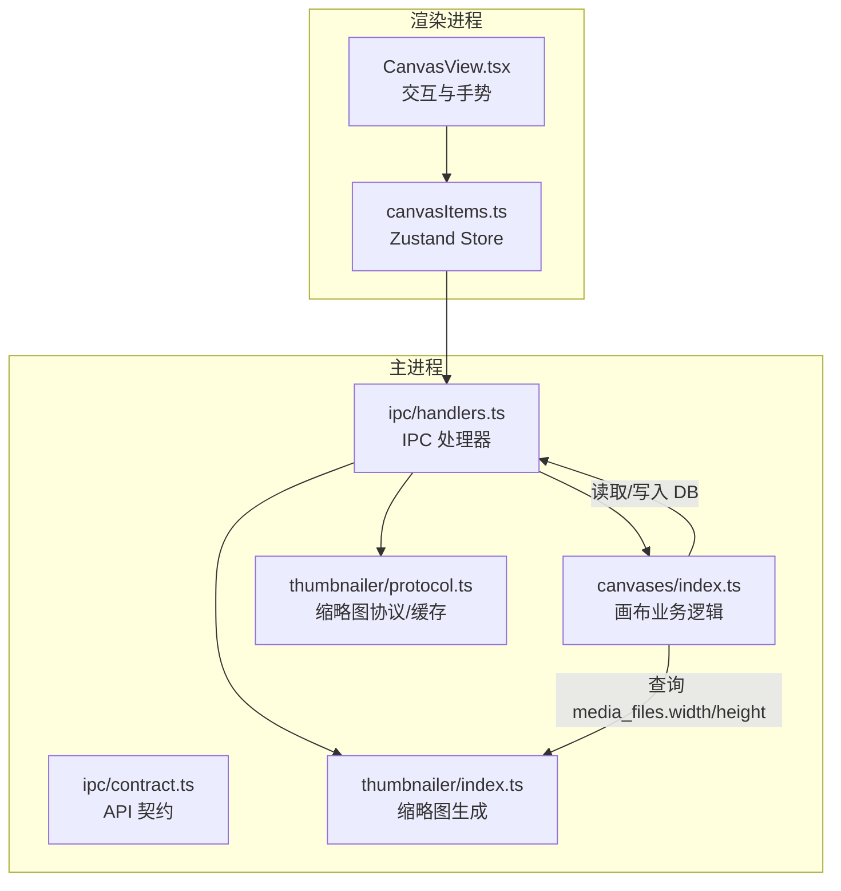
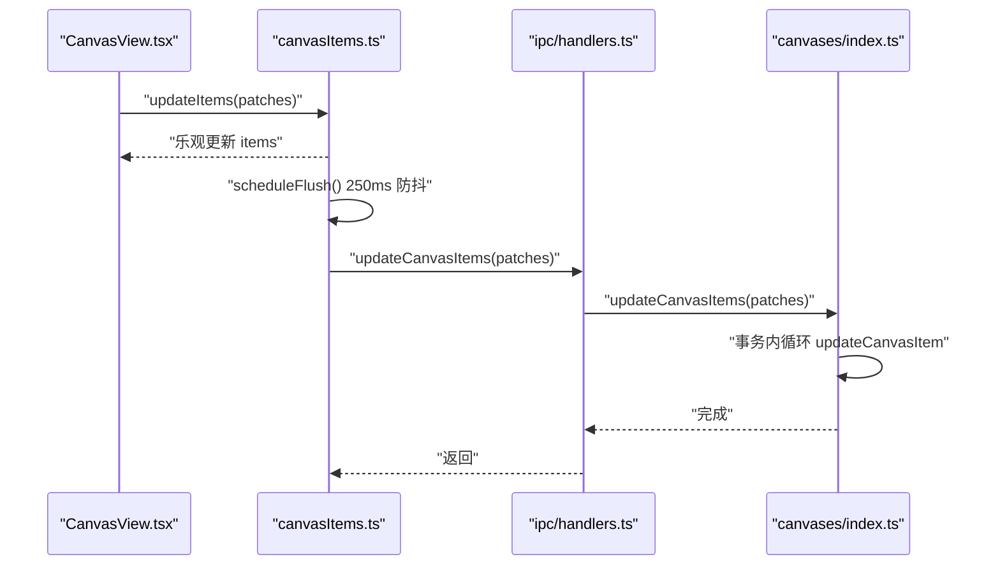
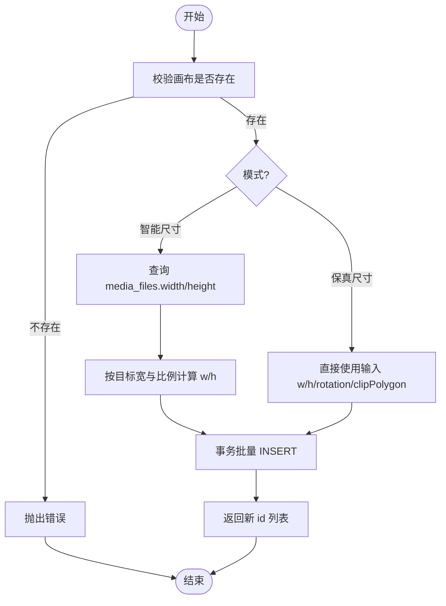
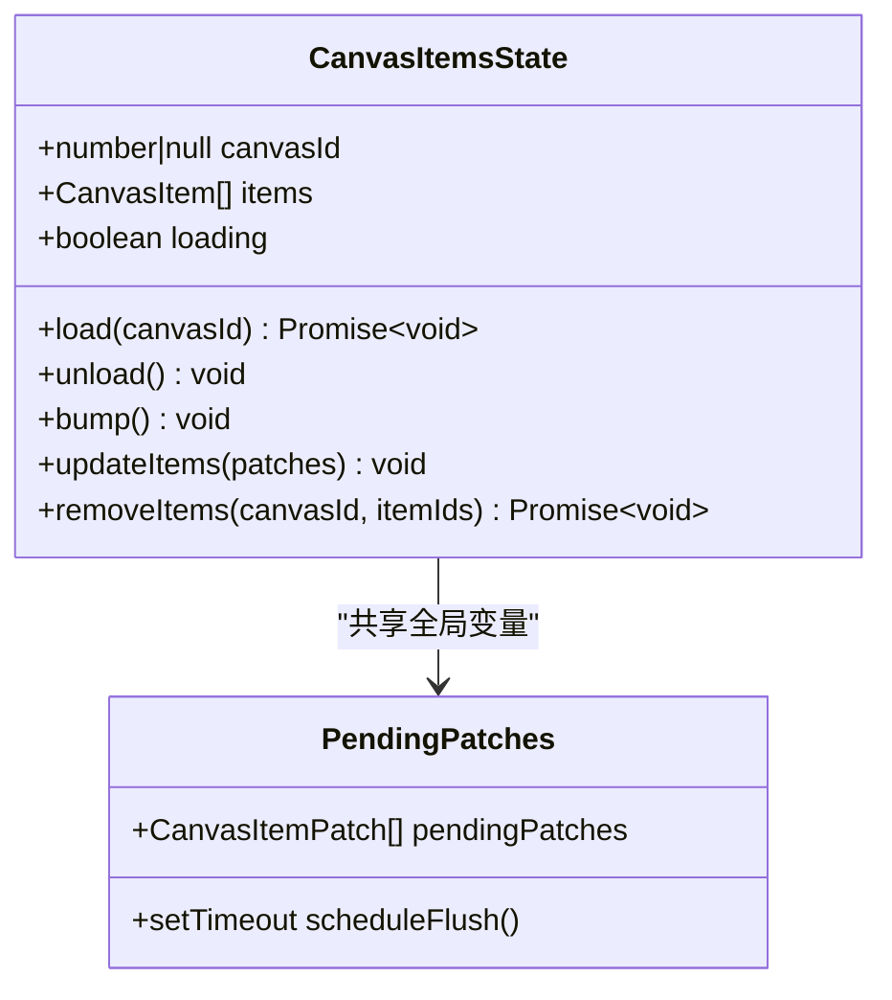
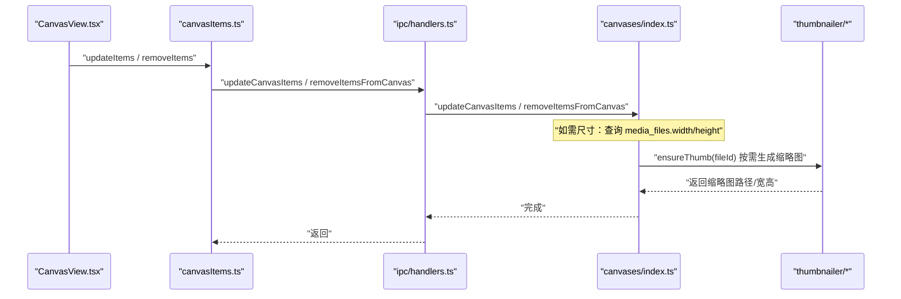
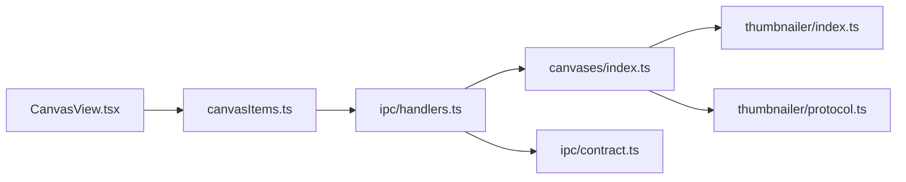

# 画布元素管理

<cite>
**本文引用的文件**   
- [src/main/canvases/index.ts](file://src/main/canvases/index.ts)
- [src/renderer/src/stores/canvasItems.ts](file://src/renderer/src/stores/canvasItems.ts)
- [src/main/ipc/handlers.ts](file://src/main/ipc/handlers.ts)
- [src/main/ipc/contract.ts](file://src/main/ipc/contract.ts)
- [src/renderer/src/views/canvas/CanvasView.tsx](file://src/renderer/src/views/canvas/CanvasView.tsx)
- [src/main/thumbnailer/index.ts](file://src/main/thumbnailer/index.ts)
- [src/main/thumbnailer/protocol.ts](file://src/main/thumbnailer/protocol.ts)
</cite>

## 目录
1. [简介](#简介)
2. [项目结构](#项目结构)
3. [核心组件](#核心组件)
4. [架构总览](#架构总览)
5. [详细组件分析](#详细组件分析)
6. [依赖关系分析](#依赖关系分析)
7. [性能考量](#性能考量)
8. [故障排查指南](#故障排查指南)
9. [结论](#结论)
10. [附录](#附录)

## 简介
本文件面向 Serendip 应用的“画布元素管理”能力，系统性说明画布项的增删改查（CRUD）实现、数据模型与 IPC 契约、媒体尺寸获取与缩略图处理集成、批量操作与位置管理、层级控制与坐标系统、以及性能优化与一致性策略。读者无需深入源码即可理解整体设计与使用方式。

## 项目结构
画布功能横跨主进程业务层、IPC 桥接层、渲染层状态管理与视图交互：
- 主进程业务层：负责数据库读写、事务批处理、媒体尺寸计算等
- IPC 契约与处理器：定义 API 类型并桥接渲染进程调用
- 渲染层状态：Zustand store 提供乐观更新与延迟落库
- 视图交互：键盘/鼠标事件驱动拖拽、缩放、旋转、裁剪、复制粘贴、层级调整等
- 缩略图服务：图片/视频缩略图生成与缓存、失效兜底

图表来源
- [src/main/canvases/index.ts:1-320](file://src/main/canvases/index.ts#L1-L320)
- [src/renderer/src/stores/canvasItems.ts:1-94](file://src/renderer/src/stores/canvasItems.ts#L1-L94)
- [src/main/ipc/handlers.ts:213-250](file://src/main/ipc/handlers.ts#L213-L250)
- [src/main/ipc/contract.ts:52-75](file://src/main/ipc/contract.ts#L52-L75)
- [src/main/thumbnailer/index.ts:1-138](file://src/main/thumbnailer/index.ts#L1-L138)
- [src/main/thumbnailer/protocol.ts:238-297](file://src/main/thumbnailer/protocol.ts#L238-L297)

章节来源
- [src/main/canvases/index.ts:1-320](file://src/main/canvases/index.ts#L1-L320)
- [src/renderer/src/stores/canvasItems.ts:1-94](file://src/renderer/src/stores/canvasItems.ts#L1-L94)
- [src/main/ipc/handlers.ts:213-250](file://src/main/ipc/handlers.ts#L213-L250)
- [src/main/ipc/contract.ts:52-75](file://src/main/ipc/contract.ts#L52-L75)
- [src/main/thumbnailer/index.ts:1-138](file://src/main/thumbnailer/index.ts#L1-L138)
- [src/main/thumbnailer/protocol.ts:238-297](file://src/main/thumbnailer/protocol.ts#L238-L297)

## 核心组件
- 画布业务模块（主进程）
  - 提供 addItemsToCanvas、addItemsToCanvasRaw、removeItemsFromCanvas、updateCanvasItem、updateCanvasItems、getMediaDimensions 等函数
  - 通过 SQLite 事务保证批量操作的原子性与一致性
- IPC 契约与处理器（主进程）
  - contract.ts 定义 SerendipAPI 类型，handlers.ts 将 IPC 通道映射到具体业务函数
- 渲染层状态（Zustand）
  - canvasItems.ts 维护 items 列表、加载状态、乐观更新与 250ms 防抖落库
- 视图交互（React）
  - CanvasView.tsx 承载拖拽、缩放、旋转、裁剪、复制粘贴、层级调整、批量重排等交互，并通过 store 与 IPC 持久化

章节来源
- [src/main/canvases/index.ts:175-320](file://src/main/canvases/index.ts#L175-L320)
- [src/main/ipc/contract.ts:52-75](file://src/main/ipc/contract.ts#L52-L75)
- [src/main/ipc/handlers.ts:213-250](file://src/main/ipc/handlers.ts#L213-L250)
- [src/renderer/src/stores/canvasItems.ts:1-94](file://src/renderer/src/stores/canvasItems.ts#L1-L94)
- [src/renderer/src/views/canvas/CanvasView.tsx:811-1043](file://src/renderer/src/views/canvas/CanvasView.tsx#L811-L1043)

## 架构总览
下图展示一次“批量更新画布元素”的端到端流程：渲染层触发 updateItems → 合并补丁并立即乐观更新 UI → 250ms 后批量 flush → IPC 调用主进程 updateCanvasItems → 主进程事务内逐条更新 → 完成。

图表来源
- [src/renderer/src/stores/canvasItems.ts:22-32](file://src/renderer/src/stores/canvasItems.ts#L22-L32)
- [src/renderer/src/stores/canvasItems.ts:66-85](file://src/renderer/src/stores/canvasItems.ts#L66-L85)
- [src/main/ipc/handlers.ts:242-244](file://src/main/ipc/handlers.ts#L242-L244)
- [src/main/canvases/index.ts:277-288](file://src/main/canvases/index.ts#L277-L288)

## 详细组件分析

### 数据类型与字段语义
- CanvasItemInput
  - 用途：新增元素时传入基础变换信息；w/h 可留空，由后端按媒体宽高比自动推算
  - 关键字段：fileId、x、y、w、h、z、rotation（可选）
- CanvasItemFullInput
  - 用途：复制/粘贴/再制保真场景，原样写入 w/h/rotation/clipPolygon，不重算尺寸
  - 关键字段：fileId、x、y、w、h、z、rotation、clipPolygon
- CanvasItemPatch
  - 用途：增量更新单个元素的任意变换属性（id 必填，其余可选）
  - 关键字段：id、x/y/w/h/rotation/z/clipPolygon（可选）
- CanvasItem（查询结果）
  - 包含画布项与媒体文件的关联信息（如 fileType、filePath、fileWidth/Height、addedAt 等），用于渲染与布局

章节来源
- [src/main/canvases/index.ts:42-73](file://src/main/canvases/index.ts#L42-L73)
- [src/main/canvases/index.ts:22-40](file://src/main/canvases/index.ts#L22-L40)
- [src/main/ipc/contract.ts:8-10](file://src/main/ipc/contract.ts#L8-L10)

### 添加元素：addItemsToCanvas 与 addItemsToCanvasRaw
- addItemsToCanvas
  - 校验画布存在性
  - 根据 fileId 查询 media_files.width/height，若有效则按目标显示宽度（固定值）与原始宽高比计算 h
  - 在事务中批量插入 canvas_items，返回新建 id 列表
- addItemsToCanvasRaw
  - 不依据文件原始宽高重算尺寸，直接写入 w/h/rotation/clipPolygon，适用于复制/粘贴/再制保真
  - 同样在事务中批量插入，返回新建 id 列表

图表来源
- [src/main/canvases/index.ts:180-209](file://src/main/canvases/index.ts#L180-L209)
- [src/main/canvases/index.ts:216-245](file://src/main/canvases/index.ts#L216-L245)

章节来源
- [src/main/canvases/index.ts:180-245](file://src/main/canvases/index.ts#L180-L245)

### 删除元素：removeItemsFromCanvas
- 支持按 canvas_item.id 批量删除，带 canvas_id 条件防止误删
- 使用事务确保原子性

章节来源
- [src/main/canvases/index.ts:247-256](file://src/main/canvases/index.ts#L247-L256)

### 更新元素：updateCanvasItem 与 updateCanvasItems
- updateCanvasItem
  - 动态拼接 SET 子句，仅更新非 undefined 字段
  - 支持 clipPolygon 的显式更新
- updateCanvasItems
  - 遍历 patches，逐个调用 updateCanvasItem
  - 外层包裹事务，提升批量写性能与一致性

章节来源
- [src/main/canvases/index.ts:258-288](file://src/main/canvases/index.ts#L258-L288)

### 渲染层状态与批量更新
- 乐观更新
  - updateItems 立即合并 patches 到本地 items，保证 UI 即时响应
- 延迟落库
  - 250ms 防抖合并同 id 的多次 patch，统一 flush 到主进程
- 移除元素
  - removeItems 先等待 IPC 成功，再过滤本地 items

图表来源
- [src/renderer/src/stores/canvasItems.ts:4-16](file://src/renderer/src/stores/canvasItems.ts#L4-L16)
- [src/renderer/src/stores/canvasItems.ts:18-32](file://src/renderer/src/stores/canvasItems.ts#L18-L32)
- [src/renderer/src/stores/canvasItems.ts:66-93](file://src/renderer/src/stores/canvasItems.ts#L66-L93)

章节来源
- [src/renderer/src/stores/canvasItems.ts:1-94](file://src/renderer/src/stores/canvasItems.ts#L1-L94)

### 视图交互与操作示例
- 批量重排（等高行网格）
  - 基于当前 items 的宽高比计算布局，居中于内容质心，生成 after/before 补丁，压入撤销栈
- 四角旋转提交
  - 单选直接累加 rotation；多选以组中心为轴进行旋转变换
- 复制/粘贴/再制
  - 构建完整变换快照（含 clipPolygon），调用 addItemsToCanvasRaw 保真插入，自动置顶 z
- 层级控制
  - 支持前移/后移/置前/置后，多选中保持相对顺序，单选中与相邻元素交换
- 方向键导航
  - 在当前视口范围内跳转到下一个元素，必要时平移视口

章节来源
- [src/renderer/src/views/canvas/CanvasView.tsx:346-397](file://src/renderer/src/views/canvas/CanvasView.tsx#L346-L397)
- [src/renderer/src/views/canvas/CanvasView.tsx:399-453](file://src/renderer/src/views/canvas/CanvasView.tsx#L399-L453)
- [src/renderer/src/views/canvas/CanvasView.tsx:681-809](file://src/renderer/src/views/canvas/CanvasView.tsx#L681-L809)
- [src/renderer/src/views/canvas/CanvasView.tsx:978-1043](file://src/renderer/src/views/canvas/CanvasView.tsx#L978-L1043)
- [src/renderer/src/views/canvas/CanvasView.tsx:921-952](file://src/renderer/src/views/canvas/CanvasView.tsx#L921-L952)

### 媒体尺寸获取与缩略图处理集成
- 媒体尺寸
  - getMediaDimensions 批量查询 media_files.width/height，供画布自动布局按比例排版
- 缩略图生成
  - 图片：sharp 读取元数据并生成 WebP 缩略图，记录 width/height
  - 视频：ffprobe 获取时长与宽高，抽取中间帧生成缩略图
  - 协议层 ensureThumb 负责缓存命中、缺失重建与失败标记 unavailable
- 与画布的协作
  - addItemsToCanvas 在插入时查询 media_files.width/height 以计算显示尺寸
  - 缩略图服务独立于画布，但为画布渲染提供高效预览

图表来源
- [src/main/canvases/index.ts:311-320](file://src/main/canvases/index.ts#L311-L320)
- [src/main/thumbnailer/protocol.ts:238-297](file://src/main/thumbnailer/protocol.ts#L238-L297)
- [src/main/thumbnailer/index.ts:27-52](file://src/main/thumbnailer/index.ts#L27-L52)
- [src/main/thumbnailer/index.ts:59-94](file://src/main/thumbnailer/index.ts#L59-L94)

章节来源
- [src/main/canvases/index.ts:311-320](file://src/main/canvases/index.ts#L311-L320)
- [src/main/thumbnailer/index.ts:1-138](file://src/main/thumbnailer/index.ts#L1-L138)
- [src/main/thumbnailer/protocol.ts:238-297](file://src/main/thumbnailer/protocol.ts#L238-L297)

### 坐标系统与层级控制
- 坐标系统
  - 世界坐标：元素 x/y/w/h 所在坐标系，受视口 pan/zoom 影响
  - 屏幕坐标：容器像素坐标，通过 screenToWorld 与世界坐标互转
  - 旋转矩形包围盒：aabbOfRotatedRect 用于选择、对齐、重排等几何计算
- 层级控制
  - z 字段决定绘制顺序；支持整组置前/置后、单元素前后移动
  - 选中自动置顶（可配置）：保留选区内相对顺序，避免覆盖未选中元素

章节来源
- [src/renderer/src/views/canvas/CanvasView.tsx:978-1043](file://src/renderer/src/views/canvas/CanvasView.tsx#L978-L1043)
- [src/renderer/src/views/canvas/CanvasView.tsx:1044-1058](file://src/renderer/src/views/canvas/CanvasView.tsx#L1044-L1058)

## 依赖关系分析
- 渲染层依赖
  - CanvasView.tsx 依赖 canvasItems.ts 的状态与方法
  - 通过 window.api 调用 handlers.ts 暴露的 IPC 接口
- 主进程依赖
  - handlers.ts 导入 canvases/index.ts 的业务函数
  - contracts.ts 集中声明 API 类型，跨进程共享
- 外部依赖
  - thumbnailer 提供缩略图与媒体元数据，被 canavs 与 protocol 层使用

图表来源
- [src/renderer/src/views/canvas/CanvasView.tsx:1-30](file://src/renderer/src/views/canvas/CanvasView.tsx#L1-L30)
- [src/renderer/src/stores/canvasItems.ts:1-16](file://src/renderer/src/stores/canvasItems.ts#L1-L16)
- [src/main/ipc/handlers.ts:19-37](file://src/main/ipc/handlers.ts#L19-L37)
- [src/main/ipc/contract.ts:8-10](file://src/main/ipc/contract.ts#L8-L10)
- [src/main/canvases/index.ts:1-10](file://src/main/canvases/index.ts#L1-L10)
- [src/main/thumbnailer/index.ts:1-16](file://src/main/thumbnailer/index.ts#L1-L16)
- [src/main/thumbnailer/protocol.ts:1-40](file://src/main/thumbnailer/protocol.ts#L1-L40)

章节来源
- [src/renderer/src/views/canvas/CanvasView.tsx:1-30](file://src/renderer/src/views/canvas/CanvasView.tsx#L1-L30)
- [src/renderer/src/stores/canvasItems.ts:1-16](file://src/renderer/src/stores/canvasItems.ts#L1-L16)
- [src/main/ipc/handlers.ts:19-37](file://src/main/ipc/handlers.ts#L19-L37)
- [src/main/ipc/contract.ts:8-10](file://src/main/ipc/contract.ts#L8-L10)
- [src/main/canvases/index.ts:1-10](file://src/main/canvases/index.ts#L1-L10)
- [src/main/thumbnailer/index.ts:1-16](file://src/main/thumbnailer/index.ts#L1-L16)
- [src/main/thumbnailer/protocol.ts:1-40](file://src/main/thumbnailer/protocol.ts#L1-L40)

## 性能考量
- 批量操作
  - 主进程侧使用 SQLite 事务批量写入，显著降低 IO 开销
  - 渲染层 250ms 防抖合并同 id 补丁，减少 IPC 往返次数
- 延迟加载
  - 缩略图按需生成与缓存，避免首屏阻塞
  - 媒体尺寸批量查询，减少 N+1 查询
- 渲染优化
  - 使用 useLayoutEffect 同步 Moveable 手柄与 items 位置，避免闪烁
  - 视口变化时仅更新必要状态，配合虚拟化渲染（masonic）在其他页面使用

章节来源
- [src/main/canvases/index.ts:277-288](file://src/main/canvases/index.ts#L277-L288)
- [src/renderer/src/stores/canvasItems.ts:22-32](file://src/renderer/src/stores/canvasItems.ts#L22-L32)
- [src/main/thumbnailer/protocol.ts:238-297](file://src/main/thumbnailer/protocol.ts#L238-L297)
- [src/renderer/src/views/canvas/CanvasView.tsx:1060-1066](file://src/renderer/src/views/canvas/CanvasView.tsx#L1060-L1066)

## 故障排查指南
- 画布不存在
  - 现象：添加元素时报错
  - 定位：检查 canvasId 是否有效
  - 参考：[src/main/canvases/index.ts:184-185](file://src/main/canvases/index.ts#L184-L185)
- 缩略图不可用
  - 现象：缩略图请求 404，或文件被标记 unavailable
  - 定位：查看 protocol 层的 markUnavailable 与 ensureThumb 失败路径
  - 参考：[src/main/thumbnailer/protocol.ts:48-53](file://src/main/thumbnailer/protocol.ts#L48-L53), [src/main/thumbnailer/protocol.ts:223-232](file://src/main/thumbnailer/protocol.ts#L223-L232)
- 批量更新未落库
  - 现象：UI 已更新但刷新后丢失
  - 定位：检查 250ms 防抖是否触发、IPC 是否成功
  - 参考：[src/renderer/src/stores/canvasItems.ts:22-32](file://src/renderer/src/stores/canvasItems.ts#L22-L32), [src/renderer/src/stores/canvasItems.ts:66-85](file://src/renderer/src/stores/canvasItems.ts#L66-L85)

章节来源
- [src/main/canvases/index.ts:184-185](file://src/main/canvases/index.ts#L184-L185)
- [src/main/thumbnailer/protocol.ts:48-53](file://src/main/thumbnailer/protocol.ts#L48-L53)
- [src/main/thumbnailer/protocol.ts:223-232](file://src/main/thumbnailer/protocol.ts#L223-L232)
- [src/renderer/src/stores/canvasItems.ts:22-32](file://src/renderer/src/stores/canvasItems.ts#L22-L32)
- [src/renderer/src/stores/canvasItems.ts:66-85](file://src/renderer/src/stores/canvasItems.ts#L66-L85)

## 结论
Serendip 的画布元素管理采用“前端乐观更新 + 后端事务批处理”的架构，结合 IPC 契约与缩略图服务，实现了高性能、可扩展的画布编辑体验。通过完善的数据模型、清晰的职责划分与丰富的交互能力，用户可进行批量操作、精确的位置与层级控制，并获得良好的视觉反馈与稳定性保障。

## 附录
- IPC 通道名与 API 方法对照（节选）
  - ADD_ITEMS_TO_CANVAS → addItemsToCanvas
  - ADD_ITEMS_TO_CANVAS_RAW → addItemsToCanvasRaw
  - REMOVE_ITEMS_FROM_CANVAS → removeItemsFromCanvas
  - UPDATE_CANVAS_ITEM → updateCanvasItem
  - UPDATE_CANVAS_ITEMS → updateCanvasItems
  - GET_MEDIA_DIMENSIONS → getMediaDimensions

章节来源
- [src/main/ipc/contract.ts:112-125](file://src/main/ipc/contract.ts#L112-L125)
- [src/main/ipc/handlers.ts:229-244](file://src/main/ipc/handlers.ts#L229-L244)