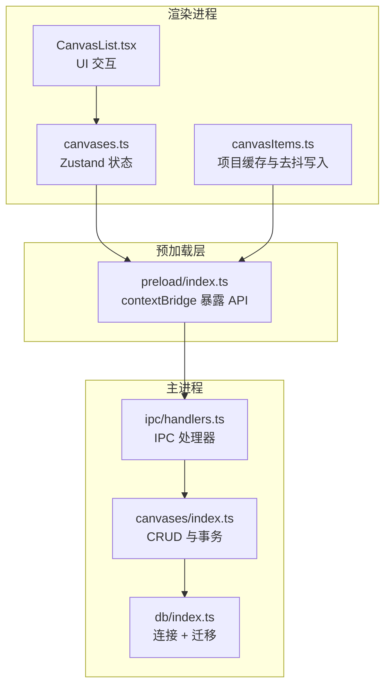
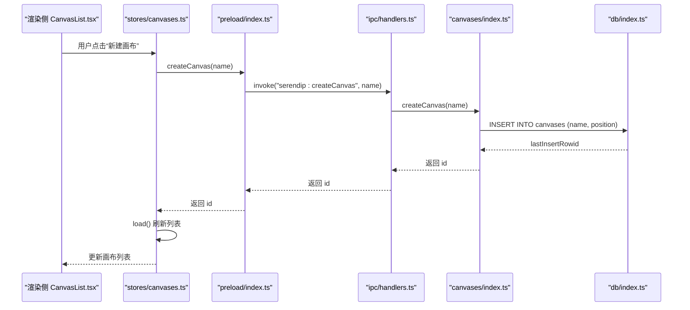
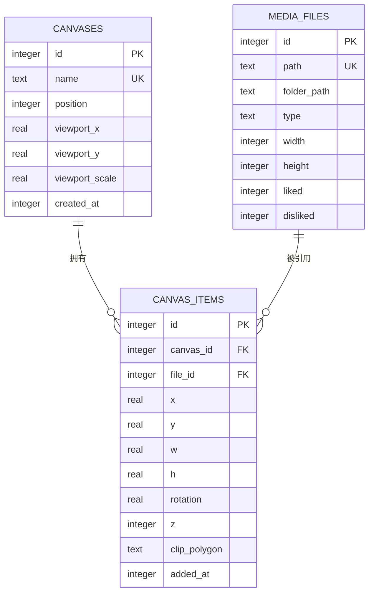
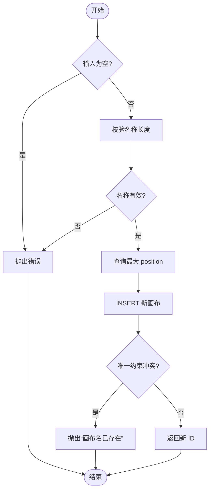
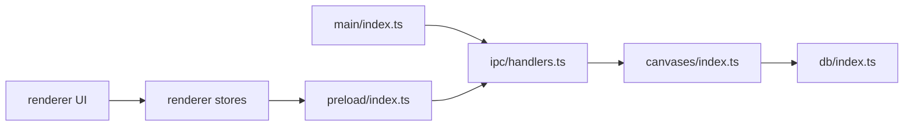

# 画布基础操作

<cite>
**本文引用的文件列表**
- [src/main/index.ts](file://src/main/index.ts)
- [src/main/ipc/handlers.ts](file://src/main/ipc/handlers.ts)
- [src/main/ipc/contract.ts](file://src/main/ipc/contract.ts)
- [src/main/canvases/index.ts](file://src/main/canvases/index.ts)
- [src/main/db/index.ts](file://src/main/db/index.ts)
- [src/preload/index.ts](file://src/preload/index.ts)
- [src/renderer/src/stores/canvases.ts](file://src/renderer/src/stores/canvases.ts)
- [src/renderer/src/components/CanvasList.tsx](file://src/renderer/src/components/CanvasList.tsx)
- [src/renderer/src/stores/canvasItems.ts](file://src/renderer/src/stores/canvasItems.ts)
- [src/renderer/src/stores/canvasUndo.ts](file://src/renderer/src/stores/canvasUndo.ts)
</cite>

## 目录
1. [简介](#简介)
2. [项目结构](#项目结构)
3. [核心组件](#核心组件)
4. [架构总览](#架构总览)
5. [详细组件分析](#详细组件分析)
6. [依赖关系分析](#依赖关系分析)
7. [性能考虑](#性能考虑)
8. [故障排查指南](#故障排查指南)
9. [结论](#结论)
10. [附录](#附录)

## 简介
本文件聚焦 Serendip 应用的“画布”基础操作，系统性阐述画布的 CRUD（创建、重命名、删除、排序）与相关数据一致性保障。文档覆盖 IPC 处理器实现细节、存储结构与约束、ID 生成策略、批量操作优化、错误处理与事务管理，并给出撤销/恢复机制的设计建议。读者无需深入源码即可理解整体流程与扩展点。

## 项目结构
画布功能贯穿主进程、IPC 层、渲染进程与数据库迁移：
- 主进程入口负责初始化数据库、注册 IPC 处理器等
- IPC 契约定义 API 名称与类型，并在 handlers 中桥接业务逻辑
- 画布业务逻辑集中在 canvases 模块，封装所有 SQL 与事务
- 数据库通过 better-sqlite3 持久化，包含画布表与画布项表的迁移
- 渲染侧使用 Zustand store 维护本地镜像与乐观更新，并通过 preload 暴露 API

图表来源
- [src/main/index.ts:93-125](file://src/main/index.ts#L93-L125)
- [src/main/ipc/handlers.ts:213-250](file://src/main/ipc/handlers.ts#L213-L250)
- [src/main/canvases/index.ts:75-149](file://src/main/canvases/index.ts#L75-L149)
- [src/main/db/index.ts:139-176](file://src/main/db/index.ts#L139-L176)
- [src/preload/index.ts:52-76](file://src/preload/index.ts#L52-L76)
- [src/renderer/src/stores/canvases.ts:24-56](file://src/renderer/src/stores/canvases.ts#L24-L56)
- [src/renderer/src/components/CanvasList.tsx:30-99](file://src/renderer/src/components/CanvasList.tsx#L30-L99)
- [src/renderer/src/stores/canvasItems.ts:34-93](file://src/renderer/src/stores/canvasItems.ts#L34-L93)

章节来源
- [src/main/index.ts:93-125](file://src/main/index.ts#L93-L125)
- [src/main/ipc/handlers.ts:213-250](file://src/main/ipc/handlers.ts#L213-L250)
- [src/main/canvases/index.ts:75-149](file://src/main/canvases/index.ts#L75-L149)
- [src/main/db/index.ts:139-176](file://src/main/db/index.ts#L139-L176)
- [src/preload/index.ts:52-76](file://src/preload/index.ts#L52-L76)
- [src/renderer/src/stores/canvases.ts:24-56](file://src/renderer/src/stores/canvases.ts#L24-L56)
- [src/renderer/src/components/CanvasList.tsx:30-99](file://src/renderer/src/components/CanvasList.tsx#L30-L99)
- [src/renderer/src/stores/canvasItems.ts:34-93](file://src/renderer/src/stores/canvasItems.ts#L34-L93)

## 核心组件
- 画布业务模块（主进程）
  - 提供 listCanvases、createCanvas、renameCanvas、deleteCanvas、reorderCanvases、getCanvasItems、addItemsToCanvas、addItemsToCanvasRaw、removeItemsFromCanvas、updateCanvasItem(s)、updateCanvasViewport、getFileCanvasIds、getMediaDimensions 等方法
  - 使用 SQLite 事务保证批量操作的原子性
- IPC 层
  - contract.ts 定义 SerendipAPI 接口与通道名
  - handlers.ts 将 IPC 调用转发到 canvases 模块
- 数据库层
  - db/index.ts 负责连接、WAL 模式、外键开启与迁移
  - 迁移 4 新增 canvases 与 canvas_items 表，含唯一性与级联删除约束
- 渲染侧
  - stores/canvases.ts 维护画布列表镜像，支持乐观更新与自动布局计算
  - components/CanvasList.tsx 提供画布列表 UI、拖拽排序、上下文菜单
  - stores/canvasItems.ts 维护当前画布的项目缓存，带 250ms 去抖批量写入
  - stores/canvasUndo.ts 提供通用的撤销/重做命令栈（可复用至画布操作）

章节来源
- [src/main/canvases/index.ts:75-320](file://src/main/canvases/index.ts#L75-L320)
- [src/main/ipc/contract.ts:12-75](file://src/main/ipc/contract.ts#L12-L75)
- [src/main/ipc/handlers.ts:213-250](file://src/main/ipc/handlers.ts#L213-L250)
- [src/main/db/index.ts:139-176](file://src/main/db/index.ts#L139-L176)
- [src/renderer/src/stores/canvases.ts:24-114](file://src/renderer/src/stores/canvases.ts#L24-L114)
- [src/renderer/src/components/CanvasList.tsx:30-99](file://src/renderer/src/components/CanvasList.tsx#L30-L99)
- [src/renderer/src/stores/canvasItems.ts:34-93](file://src/renderer/src/stores/canvasItems.ts#L34-L93)
- [src/renderer/src/stores/canvasUndo.ts:1-48](file://src/renderer/src/stores/canvasUndo.ts#L1-L48)

## 架构总览
下图展示一次“创建画布”的端到端调用链：渲染侧调用 window.api.createCanvas → preload 转发 → 主进程 handlers 路由 → canvases.createCanvas → SQLite 插入并返回新 ID → 渲染侧刷新本地镜像。

图表来源
- [src/renderer/src/components/CanvasList.tsx:30-99](file://src/renderer/src/components/CanvasList.tsx#L30-L99)
- [src/renderer/src/stores/canvases.ts:29-33](file://src/renderer/src/stores/canvases.ts#L29-L33)
- [src/preload/index.ts:53-53](file://src/preload/index.ts#L53-L53)
- [src/main/ipc/handlers.ts:215-215](file://src/main/ipc/handlers.ts#L215-L215)
- [src/main/canvases/index.ts:93-112](file://src/main/canvases/index.ts#L93-L112)
- [src/main/db/index.ts:139-176](file://src/main/db/index.ts#L139-L176)

## 详细组件分析

### 数据结构与存储模型
- 画布元数据表（canvases）
  - 字段：id（自增主键）、name（UNIQUE NOT NULL）、position（排序）、viewport_x/y/scale（视口）、created_at
  - 索引：按 position 排序
- 画布项目表（canvas_items）
  - 字段：id（自增主键）、canvas_id、file_id、x/y/w/h、rotation、z、clip_polygon、added_at
  - 外键：ON DELETE CASCADE（删除画布或媒体文件时级联清理）
  - 无 UNIQUE 约束：同一文件可多次加入同一画布
- 视图查询
  - getCanvasItems 通过 JOIN media_files 获取媒体信息并按 z、added_at 排序

图表来源
- [src/main/db/index.ts:139-176](file://src/main/db/index.ts#L139-L176)

章节来源
- [src/main/db/index.ts:139-176](file://src/main/db/index.ts#L139-L176)
- [src/main/canvases/index.ts:151-170](file://src/main/canvases/index.ts#L151-L170)

### IPC 处理器实现要点
- listCanvases
  - 按 position ASC、id ASC 排序，附带 itemCount 子查询
- createCanvas
  - 校验名称非空且长度限制；取最大 position+1 作为新位置；捕获唯一约束冲突抛出中文错误
- renameCanvas
  - 同 createCanvas 的校验与唯一约束处理；不存在则抛错
- deleteCanvas
  - 直接删除，关联项由 ON DELETE CASCADE 清理
- reorderCanvases
  - 使用事务批量更新 position，顺序即传入 orderedIds
- getCanvasItems / addItemsToCanvas / addItemsToCanvasRaw / removeItemsFromCanvas / updateCanvasItem(s) / updateCanvasViewport / getFileCanvasIds / getMediaDimensions
  - 均基于 prepared statement 与事务，确保一致性与性能

章节来源
- [src/main/ipc/handlers.ts:213-250](file://src/main/ipc/handlers.ts#L213-L250)
- [src/main/canvases/index.ts:75-320](file://src/main/canvases/index.ts#L75-L320)

### 画布 ID 生成策略与唯一性约束
- ID 生成
  - 使用 SQLite AUTOINCREMENT，lastInsertRowid 作为新 ID
- 唯一性约束
  - name 字段 UNIQUE NOT NULL，重复创建/重命名会触发 SQLITE_CONSTRAINT_UNIQUE
- 排序稳定性
  - position 用于排序，初始为 max(position)+1；重排时按有序 ID 列表重新赋值

章节来源
- [src/main/canvases/index.ts:93-112](file://src/main/canvases/index.ts#L93-L112)
- [src/main/canvases/index.ts:114-131](file://src/main/canvases/index.ts#L114-L131)
- [src/main/canvases/index.ts:139-149](file://src/main/canvases/index.ts#L139-L149)
- [src/main/db/index.ts:139-176](file://src/main/db/index.ts#L139-L176)

### 事务管理与一致性保证
- 批量更新/插入采用 db.transaction 包裹，失败时整体回滚
- 删除画布利用外键 ON DELETE CASCADE 保持引用完整性
- 渲染侧对高频变更（如拖拽移动）采用 250ms 去抖合并 patches，减少写放大

图表来源
- [src/main/canvases/index.ts:93-112](file://src/main/canvases/index.ts#L93-L112)

章节来源
- [src/main/canvases/index.ts:139-149](file://src/main/canvases/index.ts#L139-L149)
- [src/renderer/src/stores/canvasItems.ts:18-32](file://src/renderer/src/stores/canvasItems.ts#L18-L32)

### 渲染侧状态与乐观更新
- canvases.ts
  - 维护画布列表镜像，create/rename/remove/reorder 后调用 load() 刷新
  - reorder 先进行本地乐观更新，再提交后端
  - addItems 在渲染侧计算网格布局与放置锚点，使用 addItemsToCanvasRaw 保真写入
- CanvasList.tsx
  - 提供画布列表、右键菜单（重命名/删除）、拖拽排序
- canvasItems.ts
  - 维护当前画布项目缓存，updateItems 合并 pendingPatches 并 250ms 去抖 flush

章节来源
- [src/renderer/src/stores/canvases.ts:24-114](file://src/renderer/src/stores/canvases.ts#L24-L114)
- [src/renderer/src/components/CanvasList.tsx:30-99](file://src/renderer/src/components/CanvasList.tsx#L30-L99)
- [src/renderer/src/stores/canvasItems.ts:34-93](file://src/renderer/src/stores/canvasItems.ts#L34-L93)

### 撤销/恢复机制设计
- 现有通用能力
  - canvasUndo.ts 提供 past/future 命令栈，支持 push/undo/redo/clear
- 建议落地方案
  - 将画布关键操作（创建、重命名、删除、重排、添加/移除项目、批量更新）包装为 UndoCommand.apply/revert
  - apply 执行前端乐观更新与后端写入；revert 执行反向操作（如删除→恢复、重排→还原旧序）
  - 对跨进程写入失败的场景，在 revert 中补偿本地状态
  - 结合 canvasItems.ts 的去抖写入，将多次 patch 合并为一个撤销单元

章节来源
- [src/renderer/src/stores/canvasUndo.ts:1-48](file://src/renderer/src/stores/canvasUndo.ts#L1-L48)
- [src/renderer/src/stores/canvasItems.ts:66-85](file://src/renderer/src/stores/canvasItems.ts#L66-L85)

## 依赖关系分析
- 主进程入口 index.ts 在 app.whenReady 中初始化数据库、注册协议与 IPC 处理器
- handlers.ts 集中转发 IPC 请求到对应业务模块（categories、canvases 等）
- canvases/index.ts 依赖 db/index.ts 提供的数据库实例
- 渲染侧通过 preload/index.ts 暴露统一 API，stores 与组件消费该 API

图表来源
- [src/main/index.ts:93-125](file://src/main/index.ts#L93-L125)
- [src/main/ipc/handlers.ts:213-250](file://src/main/ipc/handlers.ts#L213-L250)
- [src/main/canvases/index.ts:75-149](file://src/main/canvases/index.ts#L75-L149)
- [src/main/db/index.ts:8-28](file://src/main/db/index.ts#L8-L28)
- [src/preload/index.ts:52-76](file://src/preload/index.ts#L52-L76)
- [src/renderer/src/stores/canvases.ts:24-56](file://src/renderer/src/stores/canvases.ts#L24-L56)
- [src/renderer/src/components/CanvasList.tsx:30-99](file://src/renderer/src/components/CanvasList.tsx#L30-L99)

章节来源
- [src/main/index.ts:93-125](file://src/main/index.ts#L93-L125)
- [src/main/ipc/handlers.ts:213-250](file://src/main/ipc/handlers.ts#L213-L250)
- [src/main/canvases/index.ts:75-149](file://src/main/canvases/index.ts#L75-L149)
- [src/main/db/index.ts:8-28](file://src/main/db/index.ts#L8-L28)
- [src/preload/index.ts:52-76](file://src/preload/index.ts#L52-L76)
- [src/renderer/src/stores/canvases.ts:24-56](file://src/renderer/src/stores/canvases.ts#L24-L56)
- [src/renderer/src/components/CanvasList.tsx:30-99](file://src/renderer/src/components/CanvasList.tsx#L30-L99)

## 性能考虑
- 数据库层面
  - WAL 模式提升并发读性能
  - 外键开启保证引用完整性
  - 针对常用查询建立索引（如 canvases.position、canvas_items.canvas_id/file_id）
- 批量操作
  - 使用 db.transaction 包裹批量 UPDATE/INSERT，减少事务开销
  - 渲染侧 250ms 去抖合并 patches，降低频繁写入
- 网络/IPC 开销
  - 避免在高频事件中逐条发送 IPC，尽量批量化（如 updateCanvasItems）
- 渲染侧计算
  - 自动布局算法在渲染侧执行，避免主进程参与复杂几何计算

[本节为通用指导，不直接分析具体文件]

## 故障排查指南
- 常见错误
  - 画布名重复：抛出“画布名已存在”，检查唯一约束与用户输入
  - 画布不存在：重命名/删除时若影响行数为 0，需提示用户
  - 批量操作失败：检查事务是否完整包裹，确认参数绑定正确
- 调试建议
  - 在主进程日志中打印关键步骤（如迁移应用、事务边界）
  - 在渲染侧记录 IPC 调用前后状态差异，定位不一致问题
  - 对于拖拽重排，先验证本地乐观更新是否正确，再检查后端持久化

章节来源
- [src/main/canvases/index.ts:114-131](file://src/main/canvases/index.ts#L114-L131)
- [src/main/canvases/index.ts:133-137](file://src/main/canvases/index.ts#L133-L137)
- [src/main/canvases/index.ts:139-149](file://src/main/canvases/index.ts#L139-L149)

## 结论
Serendip 的画布基础操作以清晰的层次划分与强一致性的数据库设计为核心：主进程封装业务与事务，IPC 层提供稳定契约，渲染侧通过镜像与乐观更新提升交互体验。通过合理的 ID 生成策略、唯一性约束与级联删除，保证了数据的完整性与一致性。批量操作与去抖写入进一步优化了性能。未来可在现有 undo 框架上完善画布操作的撤销/恢复能力，提升用户体验。

[本节为总结性内容，不直接分析具体文件]

## 附录

### IPC 处理器清单（画布相关）
- listCanvases：列出所有画布，按 position 升序，附带 itemCount
- createCanvas：创建画布，返回新 ID；名称重复抛错
- renameCanvas：重命名画布；名称重复或不存在抛错
- deleteCanvas：删除画布；级联清理关联项
- reorderCanvases：按传入顺序重写 position（事务）
- getCanvasItems：获取画布内媒体项（JOIN media_files）
- addItemsToCanvas：按文件宽高比推算尺寸插入
- addItemsToCanvasRaw：原样写入变换属性（复制/粘贴/再制）
- removeItemsFromCanvas：批量移除项目（事务）
- updateCanvasItem/updateCanvasItems：单条/批量更新项目属性（事务）
- updateCanvasViewport：保存视口（pan/zoom）
- getFileCanvasIds：返回文件所在的所有画布 ID
- getMediaDimensions：批量获取媒体真实宽高

章节来源
- [src/main/ipc/handlers.ts:213-250](file://src/main/ipc/handlers.ts#L213-L250)
- [src/main/canvases/index.ts:75-320](file://src/main/canvases/index.ts#L75-L320)

### 示例流程（错误处理与事务）
- 创建画布
  - 输入校验 → 查询最大 position → 插入 → 捕获唯一约束冲突 → 返回 ID
- 重排画布
  - 准备语句 → 事务包裹循环更新 → 成功提交
- 批量更新项目
  - 合并 patches → 250ms 去抖 → 事务批量写入

章节来源
- [src/main/canvases/index.ts:93-112](file://src/main/canvases/index.ts#L93-L112)
- [src/main/canvases/index.ts:139-149](file://src/main/canvases/index.ts#L139-L149)
- [src/renderer/src/stores/canvasItems.ts:18-32](file://src/renderer/src/stores/canvasItems.ts#L18-L32)