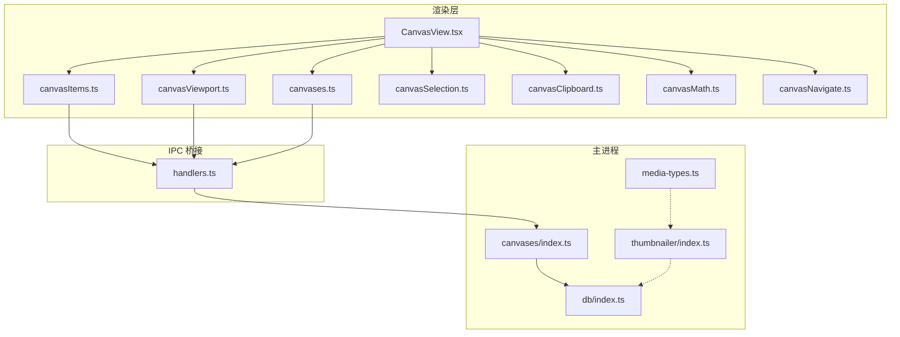
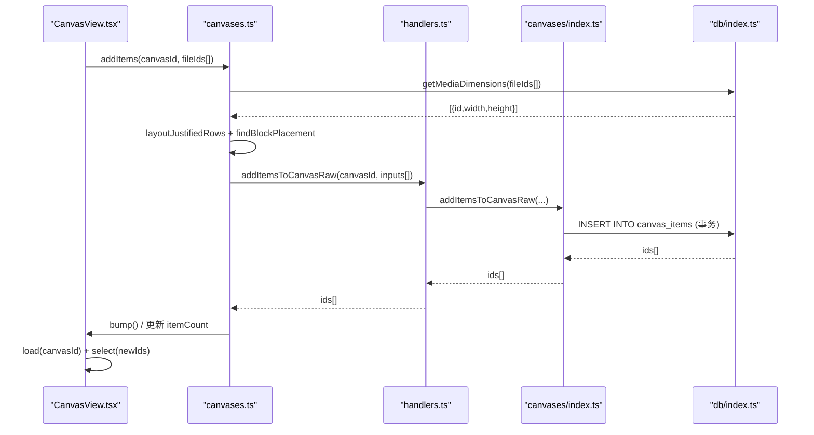
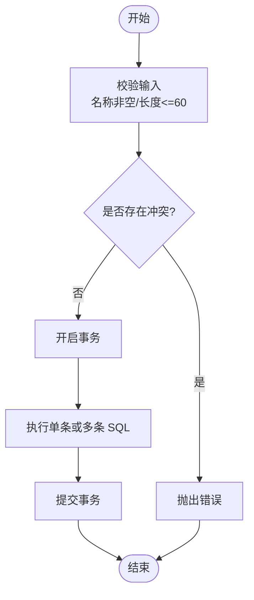
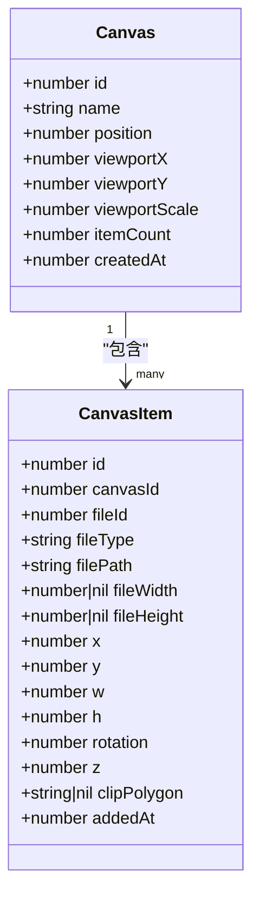
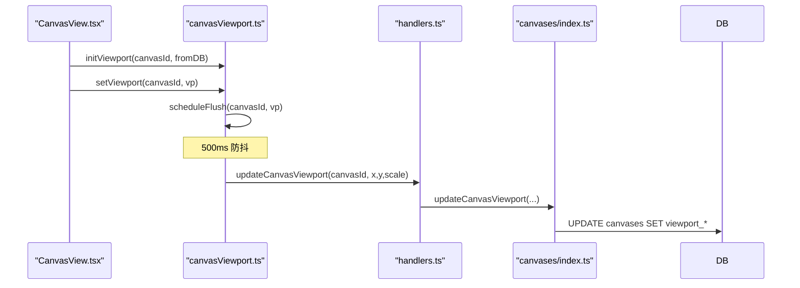
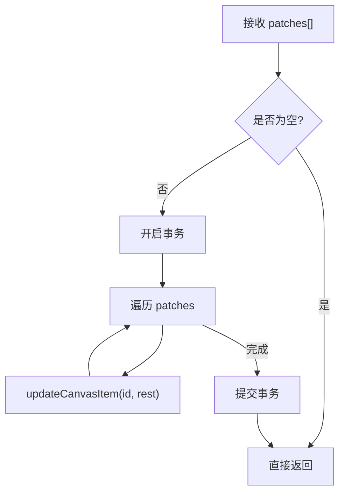
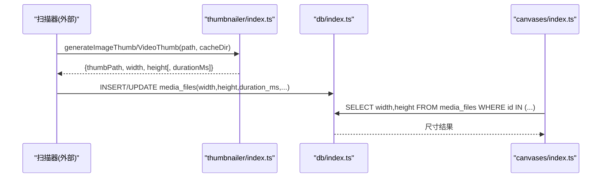
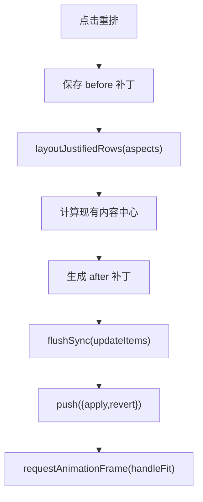
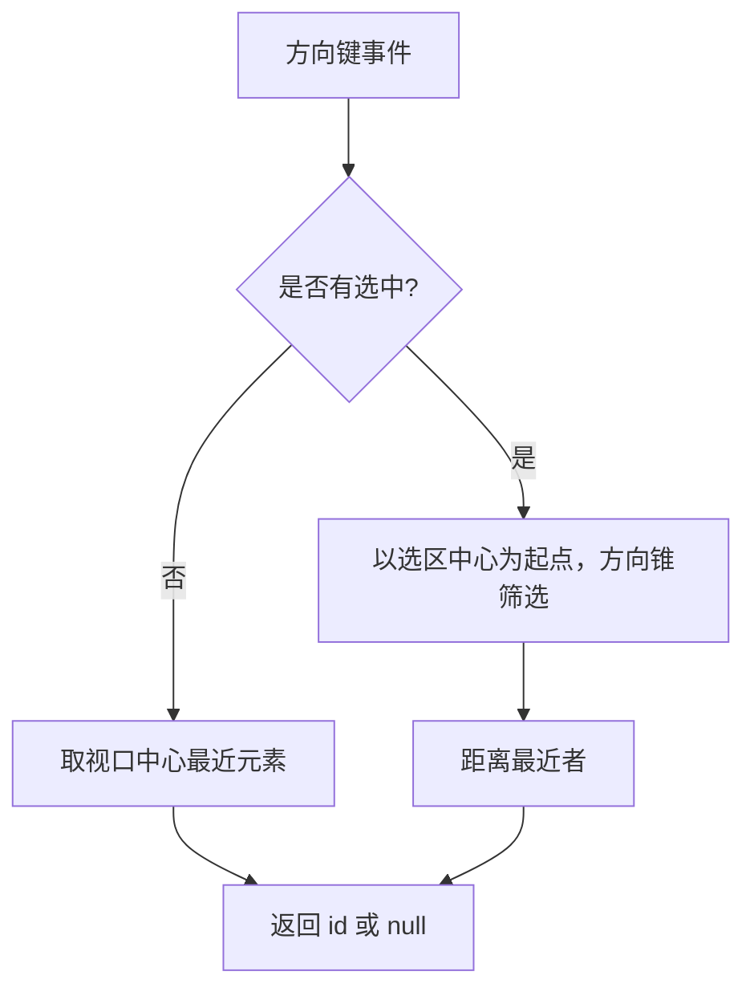
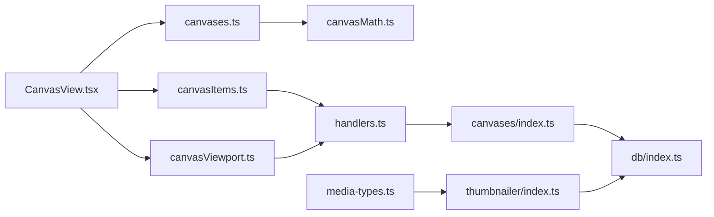

# 画布操作处理器

<cite>
**本文引用的文件**   
- [src/main/canvases/index.ts](file://src/main/canvases/index.ts)
- [src/main/ipc/handlers.ts](file://src/main/ipc/handlers.ts)
- [src/renderer/src/stores/canvasItems.ts](file://src/renderer/src/stores/canvasItems.ts)
- [src/renderer/src/stores/canvasViewport.ts](file://src/renderer/src/stores/canvasViewport.ts)
- [src/renderer/src/stores/canvases.ts](file://src/renderer/src/stores/canvases.ts)
- [src/renderer/src/lib/canvasMath.ts](file://src/renderer/src/lib/canvasMath.ts)
- [src/renderer/src/views/canvas/CanvasView.tsx](file://src/renderer/src/views/canvas/CanvasView.tsx)
- [src/renderer/src/stores/canvasSelection.ts](file://src/renderer/src/stores/canvasSelection.ts)
- [src/renderer/src/stores/canvasClipboard.ts](file://src/renderer/src/stores/canvasClipboard.ts)
- [src/renderer/src/stores/currentCanvas.ts](file://src/renderer/src/stores/currentCanvas.ts)
- [src/renderer/src/lib/canvasNavigate.ts](file://src/renderer/src/lib/canvasNavigate.ts)
- [src/main/db/index.ts](file://src/main/db/index.ts)
- [src/main/media-types.ts](file://src/main/media-types.ts)
- [src/main/thumbnailer/index.ts](file://src/main/thumbnailer/index.ts)
</cite>

## 目录
1. [简介](#简介)
2. [项目结构](#项目结构)
3. [核心组件](#核心组件)
4. [架构总览](#架构总览)
5. [详细组件分析](#详细组件分析)
6. [依赖关系分析](#依赖关系分析)
7. [性能考虑](#性能考虑)
8. [故障排查指南](#故障排查指南)
9. [结论](#结论)
10. [附录](#附录)

## 简介
本文件面向 Serendip 应用的“画布操作处理器”，系统性阐述画布 CRUD、元素管理、视口控制、批量与事务处理、媒体尺寸获取与缩略图集成、复杂位置更新与层级管理、性能优化（批量更新与延迟加载）以及数据备份与恢复策略。文档以代码级实现为依据，提供可视化图示与可操作的示例路径，帮助读者快速理解并高效使用画布能力。

## 项目结构
画布功能贯穿主进程业务层、IPC 桥接、渲染层状态管理与视图交互：
- 主进程业务层：负责数据库读写、事务与批量操作、媒体尺寸查询等
- IPC 层：暴露前端可调用的 API 方法
- 渲染层 Store：维护画布项、视口、选择、剪贴板、撤销栈等状态
- 视图层：承载用户交互（拖拽、缩放、旋转、裁剪、复制粘贴、重排等）
- 数学库：坐标变换、布局算法、视口适配
- 数据库迁移：定义画布表结构与索引
- 媒体类型与缩略图：为扫描阶段生成宽高、时长与缩略图缓存

图表来源
- [src/renderer/src/views/canvas/CanvasView.tsx](file://src/renderer/src/views/canvas/CanvasView.tsx)
- [src/renderer/src/stores/canvasItems.ts](file://src/renderer/src/stores/canvasItems.ts)
- [src/renderer/src/stores/canvasViewport.ts](file://src/renderer/src/stores/canvasViewport.ts)
- [src/renderer/src/stores/canvases.ts](file://src/renderer/src/stores/canvases.ts)
- [src/renderer/src/lib/canvasMath.ts](file://src/renderer/src/lib/canvasMath.ts)
- [src/renderer/src/lib/canvasNavigate.ts](file://src/renderer/src/lib/canvasNavigate.ts)
- [src/main/ipc/handlers.ts](file://src/main/ipc/handlers.ts)
- [src/main/canvases/index.ts](file://src/main/canvases/index.ts)
- [src/main/db/index.ts](file://src/main/db/index.ts)
- [src/main/media-types.ts](file://src/main/media-types.ts)
- [src/main/thumbnailer/index.ts](file://src/main/thumbnailer/index.ts)

章节来源
- [src/main/canvases/index.ts:1-320](file://src/main/canvases/index.ts#L1-L320)
- [src/main/ipc/handlers.ts:213-250](file://src/main/ipc/handlers.ts#L213-L250)
- [src/renderer/src/stores/canvasItems.ts:1-94](file://src/renderer/src/stores/canvasItems.ts#L1-L94)
- [src/renderer/src/stores/canvasViewport.ts:1-53](file://src/renderer/src/stores/canvasViewport.ts#L1-L53)
- [src/renderer/src/stores/canvases.ts:1-115](file://src/renderer/src/stores/canvases.ts#L1-L115)
- [src/renderer/src/lib/canvasMath.ts:1-226](file://src/renderer/src/lib/canvasMath.ts#L1-L226)
- [src/renderer/src/views/canvas/CanvasView.tsx:1-800](file://src/renderer/src/views/canvas/CanvasView.tsx#L1-L800)
- [src/main/db/index.ts:139-176](file://src/main/db/index.ts#L139-L176)
- [src/main/media-types.ts:1-38](file://src/main/media-types.ts#L1-L38)
- [src/main/thumbnailer/index.ts:1-138](file://src/main/thumbnailer/index.ts#L1-L138)

## 核心组件
- 画布业务层（主进程）
  - 提供画布与元素的增删改查、批量插入/删除/更新、视口持久化、媒体尺寸批量查询等接口
  - 通过 SQLite 事务保证一致性；删除画布时利用外键级联自动清理关联
- IPC 处理器（主进程）
  - 将渲染层调用映射到具体业务函数，统一错误传播与参数校验
- 渲染层状态（Zustand）
  - canvasItems：乐观更新 + 250ms 防抖刷新至后端
  - canvasViewport：按画布独立防抖持久化视口
  - canvases：批量添加时的等高行网格布局与落块定位
  - selection/clipboard/undo：多选、复制粘贴、撤销重做
- 数学与导航
  - 坐标转换、AABB 包围盒、fitViewport、等高行布局、黄金角螺旋落块、方向键导航与居中平移

章节来源
- [src/main/canvases/index.ts:75-320](file://src/main/canvases/index.ts#L75-L320)
- [src/main/ipc/handlers.ts:213-250](file://src/main/ipc/handlers.ts#L213-L250)
- [src/renderer/src/stores/canvasItems.ts:1-94](file://src/renderer/src/stores/canvasItems.ts#L1-L94)
- [src/renderer/src/stores/canvasViewport.ts:1-53](file://src/renderer/src/stores/canvasViewport.ts#L1-L53)
- [src/renderer/src/stores/canvases.ts:1-115](file://src/renderer/src/stores/canvases.ts#L1-L115)
- [src/renderer/src/lib/canvasMath.ts:1-226](file://src/renderer/src/lib/canvasMath.ts#L1-L226)
- [src/renderer/src/lib/canvasNavigate.ts:1-88](file://src/renderer/src/lib/canvasNavigate.ts#L1-L88)

## 架构总览
下图展示一次“批量添加元素”的端到端流程：渲染层计算布局 → 调用 IPC → 主进程事务写入 → 返回新 ID → 渲染层刷新与选中。

图表来源
- [src/renderer/src/views/canvas/CanvasView.tsx:680-800](file://src/renderer/src/views/canvas/CanvasView.tsx#L680-L800)
- [src/renderer/src/stores/canvases.ts:58-99](file://src/renderer/src/stores/canvases.ts#L58-L99)
- [src/main/ipc/handlers.ts:229-235](file://src/main/ipc/handlers.ts#L229-L235)
- [src/main/canvases/index.ts:216-245](file://src/main/canvases/index.ts#L216-L245)
- [src/main/db/index.ts:139-176](file://src/main/db/index.ts#L139-L176)

## 详细组件分析

### 画布 CRUD 与数据一致性
- 创建/重命名/删除画布
  - 名称唯一性校验与长度限制
  - 删除使用 ON DELETE CASCADE 自动清理 canvas_items
- 画布排序
  - 基于 position 字段的事务批量更新
- 数据一致性
  - 所有批量写操作均使用 SQLite transaction 包裹
  - 删除画布后，关联项自动清除，避免孤儿记录

图表来源
- [src/main/canvases/index.ts:92-149](file://src/main/canvases/index.ts#L92-L149)
- [src/main/db/index.ts:139-176](file://src/main/db/index.ts#L139-L176)

章节来源
- [src/main/canvases/index.ts:92-149](file://src/main/canvases/index.ts#L92-L149)
- [src/main/db/index.ts:139-176](file://src/main/db/index.ts#L139-L176)

### 元素管理（增删改查与层级）
- 新增元素
  - addItemsToCanvas：根据文件真实宽高比推算显示尺寸（目标宽固定），适合初次加入
  - addItemsToCanvasRaw：原样写入 w/h/rotation/clipPolygon，用于复制/粘贴/再制保真
- 删除元素
  - removeItemsFromCanvas：按 id 列表批量删除，带 canvas_id 限定
- 更新元素
  - updateCanvasItem：动态拼接 SET 子句，仅更新传入字段
  - updateCanvasItems：批量更新，内部复用单条更新逻辑，整体事务
- 层级 z 值
  - 新增时按 max(z)+i+1 递增，确保后加入者位于上层
- 读取元素
  - getCanvasItems：JOIN media_files 获取媒体元信息，按 z 与 added_at 排序

图表来源
- [src/main/canvases/index.ts:11-40](file://src/main/canvases/index.ts#L11-L40)
- [src/main/db/index.ts:139-176](file://src/main/db/index.ts#L139-L176)

章节来源
- [src/main/canvases/index.ts:151-288](file://src/main/canvases/index.ts#L151-L288)
- [src/main/db/index.ts:139-176](file://src/main/db/index.ts#L139-L176)

### 视口控制（Pan/Zoom 持久化）
- 初始化
  - 首次进入画布时从 DB 读取 viewport_x/y/scale 并注入 store
- 更新
  - setViewport 立即更新本地状态，并按画布独立定时器 500ms 防抖持久化
  - unmount 时 flushViewportNow 强制落盘，防止最后一次 pan 丢失
- 自动适配
  - 首次加载 items 且视口为默认值时，调用 fitViewport 自适应内容范围

图表来源
- [src/renderer/src/views/canvas/CanvasView.tsx:288-327](file://src/renderer/src/views/canvas/CanvasView.tsx#L288-L327)
- [src/renderer/src/stores/canvasViewport.ts:1-53](file://src/renderer/src/stores/canvasViewport.ts#L1-L53)
- [src/main/ipc/handlers.ts:245-247](file://src/main/ipc/handlers.ts#L245-L247)
- [src/main/canvases/index.ts:290-296](file://src/main/canvases/index.ts#L290-L296)

章节来源
- [src/renderer/src/stores/canvasViewport.ts:1-53](file://src/renderer/src/stores/canvasViewport.ts#L1-L53)
- [src/renderer/src/views/canvas/CanvasView.tsx:288-327](file://src/renderer/src/views/canvas/CanvasView.tsx#L288-L327)
- [src/main/canvases/index.ts:290-296](file://src/main/canvases/index.ts#L290-L296)

### 批量操作与事务机制
- 画布重排 reorderCanvases：一次性重写 position
- 批量插入 addItemsToCanvas/addItemsToCanvasRaw：在事务内循环插入，返回新 id 列表
- 批量删除 removeItemsFromCanvas：按 id 列表批量删除
- 批量更新 updateCanvasItems：合并同 id 补丁，事务内逐条更新
- 偏好设置：WAL 模式 + NORMAL 同步策略提升并发与吞吐

图表来源
- [src/main/canvases/index.ts:139-149](file://src/main/canvases/index.ts#L139-L149)
- [src/main/canvases/index.ts:180-245](file://src/main/canvases/index.ts#L180-L245)
- [src/main/canvases/index.ts:247-288](file://src/main/canvases/index.ts#L247-L288)
- [src/main/db/index.ts:19-22](file://src/main/db/index.ts#L19-L22)

章节来源
- [src/main/canvases/index.ts:139-288](file://src/main/canvases/index.ts#L139-L288)
- [src/main/db/index.ts:19-22](file://src/main/db/index.ts#L19-L22)

### 媒体尺寸获取与缩略图集成
- 尺寸获取
  - getMediaDimensions：批量查询 media_files.width/height，未知时回退比例
  - addItemsToCanvas：若已知宽高则按目标显示宽度等比计算 h
- 缩略图与元数据
  - generateImageThumb/generateVideoThumb：生成 .serendip-cache 下的缩略图，同时得到 width/height/duration_ms
  - 扫描阶段写入 media_files 表，供画布与浏览界面使用

图表来源
- [src/main/thumbnailer/index.ts:27-94](file://src/main/thumbnailer/index.ts#L27-L94)
- [src/main/db/index.ts:55-76](file://src/main/db/index.ts#L55-L76)
- [src/main/canvases/index.ts:311-320](file://src/main/canvases/index.ts#L311-L320)
- [src/main/canvases/index.ts:187-208](file://src/main/canvases/index.ts#L187-L208)

章节来源
- [src/main/canvases/index.ts:187-208](file://src/main/canvases/index.ts#L187-L208)
- [src/main/canvases/index.ts:311-320](file://src/main/canvases/index.ts#L311-L320)
- [src/main/thumbnailer/index.ts:27-94](file://src/main/thumbnailer/index.ts#L27-L94)
- [src/main/db/index.ts:55-76](file://src/main/db/index.ts#L55-L76)

### 复杂位置更新与层级管理（示例）
- 一键重排所有元素为等高行网格
  - 计算现有 AABB 中心作为锚点，保持视觉稳定
  - 生成 after/before 补丁，压入撤销栈，随后触发 fitViewport
- 四角旋转提交
  - 单选：仅累加 rotation
  - 多选：围绕组中心进行旋转变换，同时更新 x/y/rotation
- 复制/粘贴/再制
  - 构建完整变换快照（含 clipPolygon），按光标或视口中心对齐，z 值递增

图表来源
- [src/renderer/src/views/canvas/CanvasView.tsx:346-397](file://src/renderer/src/views/canvas/CanvasView.tsx#L346-L397)
- [src/renderer/src/views/canvas/CanvasView.tsx:399-453](file://src/renderer/src/views/canvas/CanvasView.tsx#L399-L453)
- [src/renderer/src/views/canvas/CanvasView.tsx:680-800](file://src/renderer/src/views/canvas/CanvasView.tsx#L680-L800)
- [src/renderer/src/lib/canvasMath.ts:133-177](file://src/renderer/src/lib/canvasMath.ts#L133-L177)

章节来源
- [src/renderer/src/views/canvas/CanvasView.tsx:346-453](file://src/renderer/src/views/canvas/CanvasView.tsx#L346-L453)
- [src/renderer/src/views/canvas/CanvasView.tsx:680-800](file://src/renderer/src/views/canvas/CanvasView.tsx#L680-L800)
- [src/renderer/src/lib/canvasMath.ts:133-177](file://src/renderer/src/lib/canvasMath.ts#L133-L177)

### 视口与导航工具
- fitViewport：基于所有元素（或选区）的旋转 AABB 计算最佳 scale 与中心
- navigateDirection：方向键导航，支持无选中/有选中两种策略
- panToItem：当元素不在视口内时，平滑平移到居中

图表来源
- [src/renderer/src/lib/canvasNavigate.ts:18-64](file://src/renderer/src/lib/canvasNavigate.ts#L18-L64)
- [src/renderer/src/lib/canvasMath.ts:63-104](file://src/renderer/src/lib/canvasMath.ts#L63-L104)

章节来源
- [src/renderer/src/lib/canvasNavigate.ts:1-88](file://src/renderer/src/lib/canvasNavigate.ts#L1-88)
- [src/renderer/src/lib/canvasMath.ts:63-104](file://src/renderer/src/lib/canvasMath.ts#L63-L104)

## 依赖关系分析
- 渲染层对主进程的依赖
  - CanvasView 依赖多个 store 组合完成交互
  - canvases.ts 依赖 canvasMath 的布局算法
  - canvasItems.ts 与 canvasViewport.ts 通过 window.api 调用 handlers.ts
- 主进程内部依赖
  - handlers.ts 聚合各业务模块（categories、recommender、watcher、canvases）
  - canvases/index.ts 依赖 db/index.ts 提供的连接与迁移
- 外部依赖
  - thumbnailer 使用 sharp 与 ffmpeg-static/ffprobe-static 生成缩略图与元数据
  - media-types 提供扩展名与类型判定常量

图表来源
- [src/renderer/src/views/canvas/CanvasView.tsx:1-800](file://src/renderer/src/views/canvas/CanvasView.tsx#L1-L800)
- [src/renderer/src/stores/canvases.ts:1-115](file://src/renderer/src/stores/canvases.ts#L1-L115)
- [src/renderer/src/stores/canvasItems.ts:1-94](file://src/renderer/src/stores/canvasItems.ts#L1-L94)
- [src/renderer/src/stores/canvasViewport.ts:1-53](file://src/renderer/src/stores/canvasViewport.ts#L1-L53)
- [src/main/ipc/handlers.ts:1-292](file://src/main/ipc/handlers.ts#L1-L292)
- [src/main/canvases/index.ts:1-320](file://src/main/canvases/index.ts#L1-L320)
- [src/main/db/index.ts:1-190](file://src/main/db/index.ts#L1-L190)
- [src/main/thumbnailer/index.ts:1-138](file://src/main/thumbnailer/index.ts#L1-L138)
- [src/main/media-types.ts:1-38](file://src/main/media-types.ts#L1-L38)

章节来源
- [src/main/ipc/handlers.ts:1-292](file://src/main/ipc/handlers.ts#L1-L292)
- [src/main/canvases/index.ts:1-320](file://src/main/canvases/index.ts#L1-L320)
- [src/main/db/index.ts:1-190](file://src/main/db/index.ts#L1-L190)

## 性能考虑
- 批量与事务
  - 批量插入/删除/更新均在事务中执行，减少磁盘 I/O 与锁竞争
- 延迟加载与防抖
  - 元素更新采用 250ms 防抖合并补丁，降低频繁写入
  - 视口更新按画布独立 500ms 防抖，避免快速切换导致抖动
- 布局与碰撞检测
  - 等高行布局 O(n)，落块检测上限 4000 次候选，结合 AABB 快速剔除
- 数据库配置
  - WAL 模式 + NORMAL 同步策略，提高并发读写的稳定性与吞吐
- 媒体尺寸预取
  - 批量 getMediaDimensions 减少多次往返，未知宽高时回退默认比例

[本节为通用性能建议，不直接分析具体文件]

## 故障排查指南
- 画布名重复或为空
  - 检查 createCanvas/renameCanvas 的输入校验与唯一约束异常
- 画布不存在
  - renameCanvas 更新影响行为为 0 时抛错；确认 id 有效性
- 元素未持久化
  - 检查 updateItems 的 pendingPatches 是否被正确 flush；必要时手动触发 flush
- 视口丢失
  - 确认 unmount 时是否调用 flushViewportNow；检查 setViewport 的 byId 是否正确初始化
- 媒体尺寸缺失
  - 确认扫描阶段已生成缩略图并写入 width/height；必要时重新扫描或修复损坏文件

章节来源
- [src/main/canvases/index.ts:92-137](file://src/main/canvases/index.ts#L92-L137)
- [src/renderer/src/stores/canvasItems.ts:19-32](file://src/renderer/src/stores/canvasItems.ts#L19-L32)
- [src/renderer/src/stores/canvasViewport.ts:16-34](file://src/renderer/src/stores/canvasViewport.ts#L16-L34)
- [src/main/thumbnailer/index.ts:27-94](file://src/main/thumbnailer/index.ts#L27-L94)

## 结论
Serendip 的画布操作处理器以“主进程事务 + 渲染层防抖”为核心，兼顾一致性与性能。通过等高行布局与黄金角落块算法，批量添加体验自然流畅；视口持久化与自动适配提升了可用性；完善的撤销/多选/复制粘贴/裁剪等功能覆盖常见创作场景。建议在大规模编辑时优先使用批量更新与事务接口，并结合媒体尺寸预取与缩略图缓存以获得更佳性能。

[本节为总结性内容，不直接分析具体文件]

## 附录

### 关键 API 与职责速览
- 画布
  - listCanvases / createCanvas / renameCanvas / deleteCanvas / reorderCanvases
  - updateCanvasViewport
- 元素
  - getCanvasItems / addItemsToCanvas / addItemsToCanvasRaw / removeItemsFromCanvas
  - updateCanvasItem / updateCanvasItems
- 媒体
  - getMediaDimensions
- IPC 映射
  - handlers.ts 将上述函数暴露给渲染层

章节来源
- [src/main/canvases/index.ts:75-320](file://src/main/canvases/index.ts#L75-L320)
- [src/main/ipc/handlers.ts:213-250](file://src/main/ipc/handlers.ts#L213-L250)

### 备份与恢复策略
- 应用数据
  - 数据库路径位于 userData/serendip.db，可直接拷贝备份
- 缩略图缓存
  - 媒体根目录下 .serendip-cache 目录，包含图片/视频缩略图
- 恢复步骤
  - 停止应用 → 替换 serendip.db 与 .serendip-cache → 启动应用
- 注意事项
  - 确保文件路径与权限一致；若媒体文件移动或删除，需重新扫描或标记不可用

章节来源
- [src/main/db/index.ts:11-17](file://src/main/db/index.ts#L11-L17)
- [src/main/media-types.ts:27-28](file://src/main/media-types.ts#L27-L28)
- [src/main/thumbnailer/index.ts:128-137](file://src/main/thumbnailer/index.ts#L128-L137)