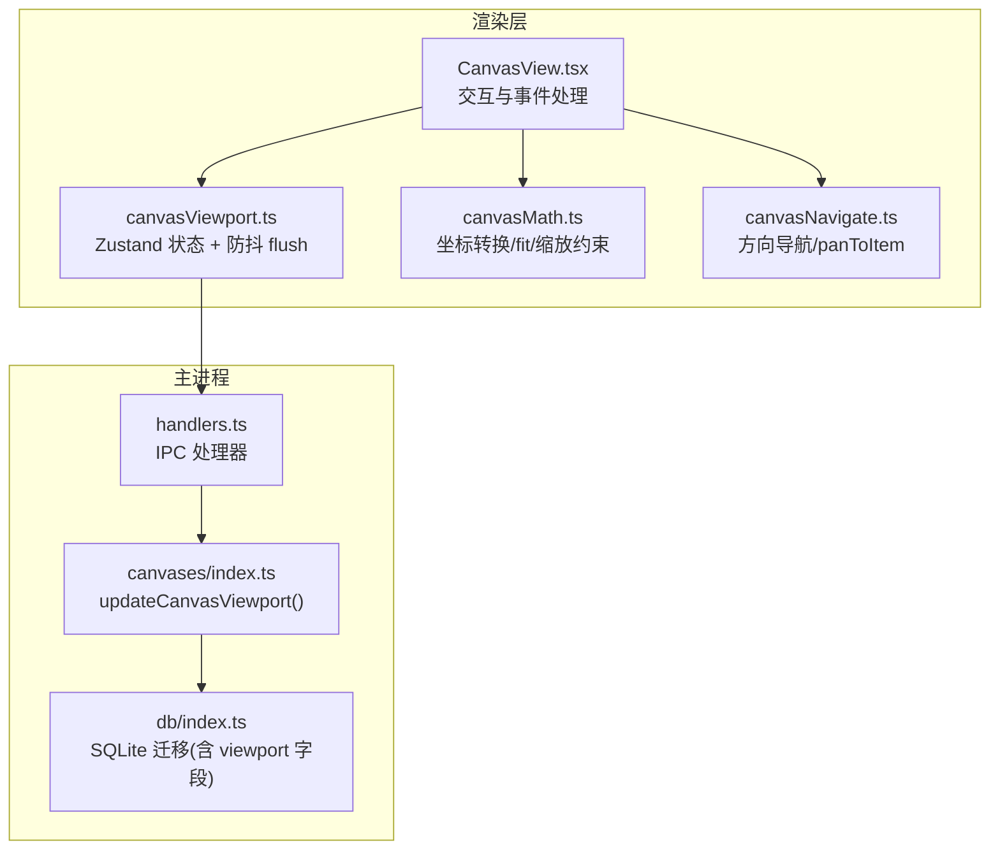
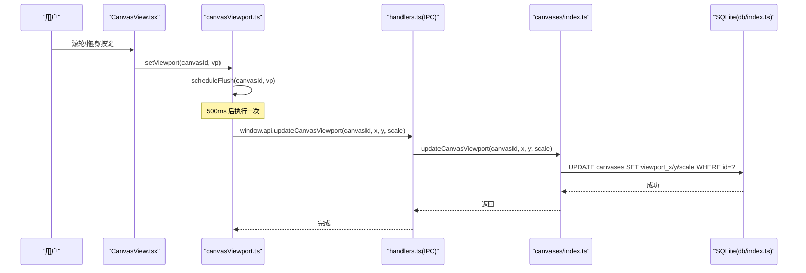
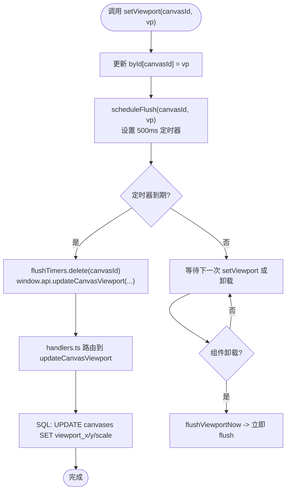
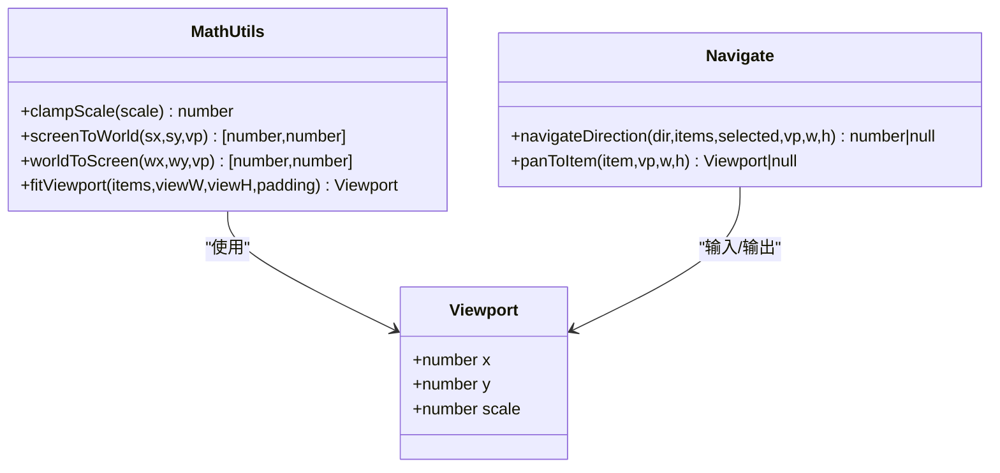
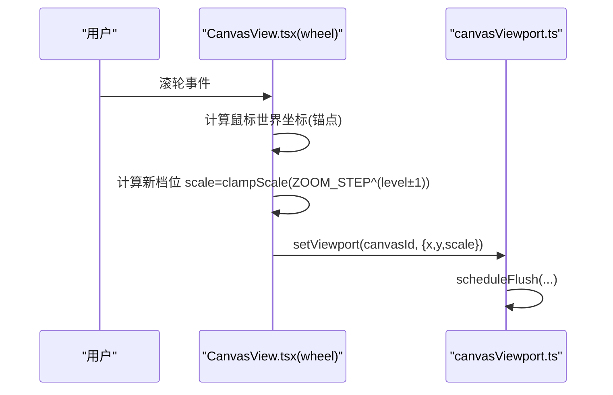
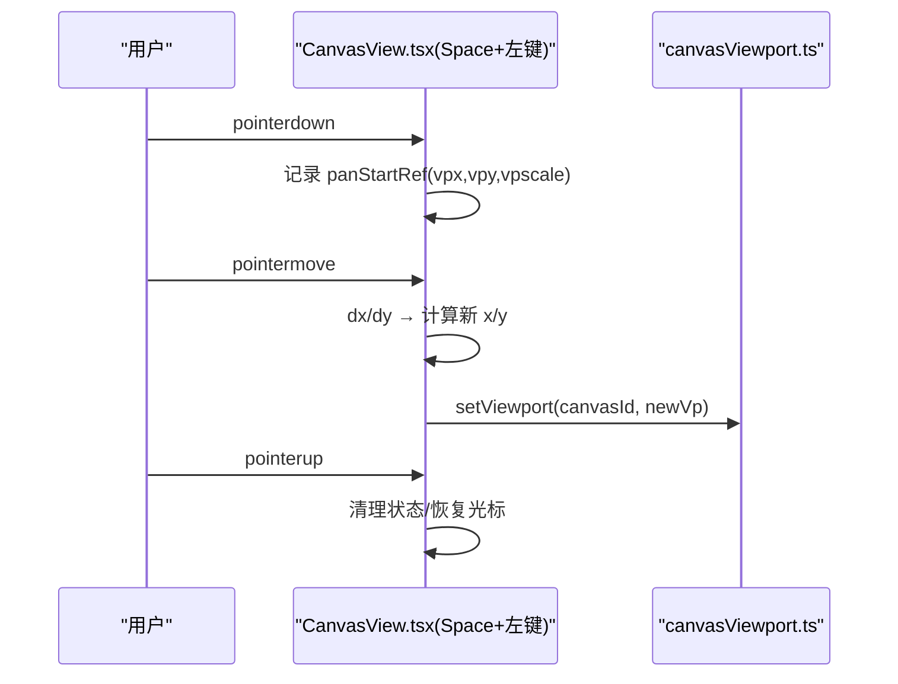
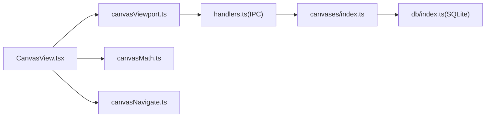

# 画布视口控制

<cite>
**本文引用的文件**   
- [src/renderer/src/stores/canvasViewport.ts](file://src/renderer/src/stores/canvasViewport.ts)
- [src/renderer/src/lib/canvasMath.ts](file://src/renderer/src/lib/canvasMath.ts)
- [src/renderer/src/lib/canvasNavigate.ts](file://src/renderer/src/lib/canvasNavigate.ts)
- [src/renderer/src/views/canvas/CanvasView.tsx](file://src/renderer/src/views/canvas/CanvasView.tsx)
- [src/main/ipc/handlers.ts](file://src/main/ipc/handlers.ts)
- [src/main/canvases/index.ts](file://src/main/canvases/index.ts)
- [src/main/db/index.ts](file://src/main/db/index.ts)
</cite>

## 目录
1. [简介](#简介)
2. [项目结构](#项目结构)
3. [核心组件](#核心组件)
4. [架构总览](#架构总览)
5. [详细组件分析](#详细组件分析)
6. [依赖关系分析](#依赖关系分析)
7. [性能考虑](#性能考虑)
8. [故障排查指南](#故障排查指南)
9. [结论](#结论)
10. [附录](#附录)

## 简介
本文件聚焦 Serendip 应用中的“画布视口控制”，围绕以下目标展开：
- 深入解释 updateCanvasViewport 的端到端实现，包括渲染层状态更新、IPC 持久化与主进程落库。
- 说明视口位置 (x, y) 与缩放比例 (scale) 的管理方式与约束。
- 阐述视口状态的持久化存储与同步机制（防抖写入、卸载时立即 flush）。
- 解释视口边界检测与限制逻辑（缩放范围、自动适配 fit、元素居中 panToItem）。
- 提供具体操作示例（平滑过渡动画、状态保存），并说明坐标转换关系（屏幕↔世界）。
- 给出多窗口视口同步的实现方案建议。
- 总结视口性能优化技巧（裁剪、懒加载等）。

## 项目结构
与画布视口相关的代码分布在渲染层与主进程之间：
- 渲染层
  - 视口状态管理：Zustand store + 防抖 flush
  - 数学工具：坐标转换、fit、缩放约束
  - 导航辅助：方向键选择、元素居中平移
  - 交互视图：Pan/Zoom/Fit/键盘快捷键等
- 主进程
  - IPC 处理器：接收渲染层请求并调用业务函数
  - 业务层：更新 canvases 表的 viewport_x/y/scale
  - 数据库迁移：定义视口字段

图表来源
- [src/renderer/src/views/canvas/CanvasView.tsx](file://src/renderer/src/views/canvas/CanvasView.tsx)
- [src/renderer/src/stores/canvasViewport.ts](file://src/renderer/src/stores/canvasViewport.ts)
- [src/renderer/src/lib/canvasMath.ts](file://src/renderer/src/lib/canvasMath.ts)
- [src/renderer/src/lib/canvasNavigate.ts](file://src/renderer/src/lib/canvasNavigate.ts)
- [src/main/ipc/handlers.ts](file://src/main/ipc/handlers.ts)
- [src/main/canvases/index.ts](file://src/main/canvases/index.ts)
- [src/main/db/index.ts](file://src/main/db/index.ts)

章节来源
- [src/renderer/src/stores/canvasViewport.ts:1-53](file://src/renderer/src/stores/canvasViewport.ts#L1-L53)
- [src/renderer/src/lib/canvasMath.ts:1-226](file://src/renderer/src/lib/canvasMath.ts#L1-L226)
- [src/renderer/src/lib/canvasNavigate.ts:1-88](file://src/renderer/src/lib/canvasNavigate.ts#L1-L88)
- [src/renderer/src/views/canvas/CanvasView.tsx:1-1705](file://src/renderer/src/views/canvas/CanvasView.tsx#L1-L1705)
- [src/main/ipc/handlers.ts:245-247](file://src/main/ipc/handlers.ts#L245-L247)
- [src/main/canvases/index.ts:290-296](file://src/main/canvases/index.ts#L290-L296)
- [src/main/db/index.ts:144-152](file://src/main/db/index.ts#L144-L152)

## 核心组件
- 视口状态与持久化
  - byId 缓存每个画布的 Viewport
  - setViewport 更新本地状态并触发按 canvasId 独立的防抖 flush
  - flushViewportNow 在 unmount 时立即 flush，避免丢失最后一次 pan
- 数学与导航
  - screenToWorld/worldToScreen 完成屏幕与世界坐标互转
  - clampScale/ZOOM_STEP 控制离散档位缩放
  - fitViewport 计算能完整展示所有元素的视口
  - panToItem 将不在视口内的元素居中到视口
- 交互入口
  - CanvasView 中集成 wheel zoom、Space+左键 pan、F 键 fit、方向键导航等

章节来源
- [src/renderer/src/stores/canvasViewport.ts:1-53](file://src/renderer/src/stores/canvasViewport.ts#L1-L53)
- [src/renderer/src/lib/canvasMath.ts:1-226](file://src/renderer/src/lib/canvasMath.ts#L1-L226)
- [src/renderer/src/lib/canvasNavigate.ts:1-88](file://src/renderer/src/lib/canvasNavigate.ts#L1-L88)
- [src/renderer/src/views/canvas/CanvasView.tsx:455-549](file://src/renderer/src/views/canvas/CanvasView.tsx#L455-L549)

## 架构总览
从用户操作到数据落库的完整链路如下：

图表来源
- [src/renderer/src/views/canvas/CanvasView.tsx:455-549](file://src/renderer/src/views/canvas/CanvasView.tsx#L455-L549)
- [src/renderer/src/stores/canvasViewport.ts:16-34](file://src/renderer/src/stores/canvasViewport.ts#L16-L34)
- [src/main/ipc/handlers.ts:245-247](file://src/main/ipc/handlers.ts#L245-L247)
- [src/main/canvases/index.ts:290-296](file://src/main/canvases/index.ts#L290-L296)
- [src/main/db/index.ts:144-152](file://src/main/db/index.ts#L144-L152)

## 详细组件分析

### 1) 视口状态与持久化（setViewport 与 updateCanvasViewport）
- 渲染层
  - setViewport 会先更新 Zustand 的 byId[canvasId]，再调用 scheduleFlush 启动一个 500ms 定时器，到期后通过 window.api.updateCanvasViewport 发送 IPC。
  - flushViewportNow 用于组件卸载时立即 flush，确保最后一次 pan 不丢失。
- 主进程
  - handlers.ts 注册 IPC 处理器 IPC.UPDATE_CANVAS_VIEWPORT，转发至 canvases/index.ts 的 updateCanvasViewport。
  - updateCanvasViewport 直接执行 SQL 更新 canvases 表的 viewport_x/y/scale。
- 数据库
  - db/index.ts 的迁移脚本为 canvases 表定义了 viewport_x/viewport_y/viewport_scale 字段及默认值。

图表来源
- [src/renderer/src/stores/canvasViewport.ts:16-34](file://src/renderer/src/stores/canvasViewport.ts#L16-L34)
- [src/main/ipc/handlers.ts:245-247](file://src/main/ipc/handlers.ts#L245-L247)
- [src/main/canvases/index.ts:290-296](file://src/main/canvases/index.ts#L290-L296)
- [src/main/db/index.ts:144-152](file://src/main/db/index.ts#L144-L152)

章节来源
- [src/renderer/src/stores/canvasViewport.ts:1-53](file://src/renderer/src/stores/canvasViewport.ts#L1-L53)
- [src/main/ipc/handlers.ts:245-247](file://src/main/ipc/handlers.ts#L245-L247)
- [src/main/canvases/index.ts:290-296](file://src/main/canvases/index.ts#L290-L296)
- [src/main/db/index.ts:144-152](file://src/main/db/index.ts#L144-L152)

### 2) 视口位置与缩放管理
- 缩放约束
  - clampScale 将 scale 限制在 [SCALE_MIN, SCALE_MAX] 范围内。
  - ZOOM_STEP 定义离散档位倍率，wheel 事件以当前档位 ±1 切换。
- 坐标转换
  - screenToWorld/worldToScreen 负责屏幕像素与世界坐标之间的换算，是 Pan/Zoom 的核心。
- 自动适配
  - fitViewport 基于所有元素（或选中项）的 AABB 计算合适的 scale 与中心点，使内容完整可见。
- 元素居中
  - panToItem 判断元素是否已在视口内（带 margin），若不在则返回新视口使其居中。

图表来源
- [src/renderer/src/lib/canvasMath.ts:1-226](file://src/renderer/src/lib/canvasMath.ts#L1-L226)
- [src/renderer/src/lib/canvasNavigate.ts:1-88](file://src/renderer/src/lib/canvasNavigate.ts#L1-L88)

章节来源
- [src/renderer/src/lib/canvasMath.ts:1-226](file://src/renderer/src/lib/canvasMath.ts#L1-L226)
- [src/renderer/src/lib/canvasNavigate.ts:1-88](file://src/renderer/src/lib/canvasNavigate.ts#L1-L88)

### 3) 视口边界检测与限制逻辑
- 缩放边界
  - 通过 clampScale 限制最小/最大缩放，防止过小不可见或过大导致性能问题。
- 视口边界
  - 当前实现未对 x/y 做硬性边界限制；但提供了 panToItem 保证元素进入可视区域。
- 自动适配边界
  - fitViewport 根据内容包围盒与容器尺寸计算 scale 与中心，确保全部可见。

章节来源
- [src/renderer/src/lib/canvasMath.ts:16-18](file://src/renderer/src/lib/canvasMath.ts#L16-L18)
- [src/renderer/src/lib/canvasMath.ts:63-104](file://src/renderer/src/lib/canvasMath.ts#L63-L104)
- [src/renderer/src/lib/canvasNavigate.ts:69-87](file://src/renderer/src/lib/canvasNavigate.ts#L69-L87)

### 4) 视口操作示例与流程

#### 4.1 滚轮缩放（以光标为锚点）
- 流程
  - 获取容器 rect 与鼠标相对坐标
  - 计算当前缩放档位，按 ZOOM_STEP 步进得到新 scale
  - 将鼠标所在的世界坐标作为锚点，反算新的 x/y
  - 调用 setViewport 更新状态并触发 flush
- 关键点
  - 使用 screenToWorld 进行锚点计算
  - 使用 clampScale 限制最终 scale

图表来源
- [src/renderer/src/views/canvas/CanvasView.tsx:455-480](file://src/renderer/src/views/canvas/CanvasView.tsx#L455-L480)
- [src/renderer/src/stores/canvasViewport.ts:16-24](file://src/renderer/src/stores/canvasViewport.ts#L16-L24)

章节来源
- [src/renderer/src/views/canvas/CanvasView.tsx:455-480](file://src/renderer/src/views/canvas/CanvasView.tsx#L455-L480)

#### 4.2 Space+左键平移
- 流程
  - pointerdown 记录起始 clientX/Y 与初始 vp
  - pointermove 计算 dx/dy，按当前 scale 反推 x/y 变化
  - pointerup 收尾并恢复光标
- 关键点
  - 使用当前 scale 将屏幕位移转换为世界位移
  - 通过 setViewport 即时更新

图表来源
- [src/renderer/src/views/canvas/CanvasView.tsx:493-549](file://src/renderer/src/views/canvas/CanvasView.tsx#L493-L549)
- [src/renderer/src/stores/canvasViewport.ts:46-49](file://src/renderer/src/stores/canvasViewport.ts#L46-L49)

章节来源
- [src/renderer/src/views/canvas/CanvasView.tsx:493-549](file://src/renderer/src/views/canvas/CanvasView.tsx#L493-L549)

#### 4.3 F 键适配（fit）
- 流程
  - 若存在选中项，仅适配选中项；否则适配全部
  - 调用 fitViewport 计算新视口并 setViewport
- 关键点
  - 首次加载 items 且视口为默认值时也会自动 fit

章节来源
- [src/renderer/src/views/canvas/CanvasView.tsx:316-327](file://src/renderer/src/views/canvas/CanvasView.tsx#L316-L327)
- [src/renderer/src/views/canvas/CanvasView.tsx:335-344](file://src/renderer/src/views/canvas/CanvasView.tsx#L335-L344)
- [src/renderer/src/lib/canvasMath.ts:63-104](file://src/renderer/src/lib/canvasMath.ts#L63-L104)

#### 4.4 方向键导航与元素居中
- 流程
  - navigateDirection 根据方向锥选择下一个目标
  - panToItem 判断是否需要平移以使目标居中
  - 需要时 setViewport 更新视口

章节来源
- [src/renderer/src/lib/canvasNavigate.ts:18-64](file://src/renderer/src/lib/canvasNavigate.ts#L18-L64)
- [src/renderer/src/lib/canvasNavigate.ts:69-87](file://src/renderer/src/lib/canvasNavigate.ts#L69-L87)
- [src/renderer/src/views/canvas/CanvasView.tsx:921-952](file://src/renderer/src/views/canvas/CanvasView.tsx#L921-L952)

### 5) 视口与画布元素的坐标转换关系
- 屏幕坐标 → 世界坐标：screenToWorld(screenX, screenY, vp)
- 世界坐标 → 屏幕坐标：worldToScreen(worldX, worldY, vp)
- 这些转换贯穿了：
  - 滚轮缩放锚点定位
  - 平移时的位移换算
  - 裁剪框的世界矩形计算
  - 粘贴定位的目标中心计算

章节来源
- [src/renderer/src/lib/canvasMath.ts:20-28](file://src/renderer/src/lib/canvasMath.ts#L20-L28)
- [src/renderer/src/views/canvas/CanvasView.tsx:455-480](file://src/renderer/src/views/canvas/CanvasView.tsx#L455-L480)
- [src/renderer/src/views/canvas/CanvasView.tsx:493-549](file://src/renderer/src/views/canvas/CanvasView.tsx#L493-L549)
- [src/renderer/src/views/canvas/CanvasView.tsx:604-616](file://src/renderer/src/views/canvas/CanvasView.tsx#L604-L616)
- [src/renderer/src/views/canvas/CanvasView.tsx:769-772](file://src/renderer/src/views/canvas/CanvasView.tsx#L769-L772)

### 6) 平滑过渡动画与状态保存
- 平滑过渡
  - 当前实现未内置 CSS/JS 动画过渡，setViewport 直接更新状态，由浏览器下一帧重绘呈现。
  - 如需平滑过渡，可在 setViewport 前计算新旧视口的差值，使用 requestAnimationFrame 逐步插值，并在每步调用 setViewport。
- 状态保存
  - 已实现防抖保存（500ms）与卸载时立即 flush，确保最近一次操作不丢失。
  - 如需更细粒度控制，可暴露 saveViewport 方法强制 flush。

章节来源
- [src/renderer/src/stores/canvasViewport.ts:16-34](file://src/renderer/src/stores/canvasViewport.ts#L16-L34)
- [src/renderer/src/views/canvas/CanvasView.tsx:305-314](file://src/renderer/src/views/canvas/CanvasView.tsx#L305-L314)

### 7) 多窗口视口同步方案（建议）
- 现状
  - 当前实现按 canvasId 独立持久化，未跨窗口广播。
- 建议方案
  - 渲染层在 setViewport 成功后，通过 ipcRenderer.send 向主进程广播“视口变更”事件。
  - 主进程遍历所有 BrowserWindow，向其他窗口的对应频道发送消息，携带 canvasId 与新视口。
  - 各窗口收到消息后，对比本地 byId[canvasId]，若不同则 setViewport 并触发 flush。
  - 注意去抖与冲突解决（如同时编辑同一画布时可引入版本戳或最后写入优先策略）。

[本节为概念性方案，无需源码引用]

## 依赖关系分析

图表来源
- [src/renderer/src/views/canvas/CanvasView.tsx](file://src/renderer/src/views/canvas/CanvasView.tsx)
- [src/renderer/src/stores/canvasViewport.ts](file://src/renderer/src/stores/canvasViewport.ts)
- [src/renderer/src/lib/canvasMath.ts](file://src/renderer/src/lib/canvasMath.ts)
- [src/renderer/src/lib/canvasNavigate.ts](file://src/renderer/src/lib/canvasNavigate.ts)
- [src/main/ipc/handlers.ts](file://src/main/ipc/handlers.ts)
- [src/main/canvases/index.ts](file://src/main/canvases/index.ts)
- [src/main/db/index.ts](file://src/main/db/index.ts)

章节来源
- [src/renderer/src/views/canvas/CanvasView.tsx:1-1705](file://src/renderer/src/views/canvas/CanvasView.tsx#L1-L1705)
- [src/renderer/src/stores/canvasViewport.ts:1-53](file://src/renderer/src/stores/canvasViewport.ts#L1-L53)
- [src/renderer/src/lib/canvasMath.ts:1-226](file://src/renderer/src/lib/canvasMath.ts#L1-L226)
- [src/renderer/src/lib/canvasNavigate.ts:1-88](file://src/renderer/src/lib/canvasNavigate.ts#L1-L88)
- [src/main/ipc/handlers.ts:245-247](file://src/main/ipc/handlers.ts#L245-L247)
- [src/main/canvases/index.ts:290-296](file://src/main/canvases/index.ts#L290-L296)
- [src/main/db/index.ts:144-152](file://src/main/db/index.ts#L144-L152)

## 性能考虑
- 防抖写入
  - 500ms 防抖减少频繁 I/O，适合高频 pan/zoom。
- 卸载立即 flush
  - 避免页面关闭时丢失最后一次视口。
- 缩放上限
  - clampScale 限制最大缩放，避免极端放大导致的渲染压力。
- 视口裁剪与懒加载（建议）
  - 在渲染层依据 viewport 计算可见世界矩形，仅渲染落在该矩形内的元素。
  - 结合 IntersectionObserver 或自定义滚动监听，按需加载大图/视频缩略图。
- 批量更新与事务
  - 主进程侧更新视口为单条 SQL，开销小；大量元素更新时使用事务（已有模式）。
- 手势与 UI 同步
  - 使用 useLayoutEffect 在 DOM commit 后同步 Moveable 手柄，避免闪烁。

[本节为通用指导，无需源码引用]

## 故障排查指南
- 视口未持久化
  - 检查是否在组件卸载前调用了 flushViewportNow（例如在 useEffect 清理函数中）。
  - 确认 IPC 通道 IPC.UPDATE_CANVAS_VIEWPORT 未被拦截或禁用。
- 缩放异常
  - 校验 clampScale 的上下限是否符合预期。
  - 检查 wheel 事件中档位计算是否正确（log 与 pow 的使用）。
- 平移错位
  - 核对 screenToWorld/worldToScreen 的 vp.scale 取值是否与当前实际一致。
- 自动适配无效
  - 确认 items 非空且容器尺寸 > 0，fitViewport 才会生效。

章节来源
- [src/renderer/src/stores/canvasViewport.ts:26-34](file://src/renderer/src/stores/canvasViewport.ts#L26-L34)
- [src/renderer/src/views/canvas/CanvasView.tsx:305-314](file://src/renderer/src/views/canvas/CanvasView.tsx#L305-L314)
- [src/renderer/src/views/canvas/CanvasView.tsx:455-480](file://src/renderer/src/views/canvas/CanvasView.tsx#L455-L480)
- [src/renderer/src/lib/canvasMath.ts:20-28](file://src/renderer/src/lib/canvasMath.ts#L20-L28)
- [src/renderer/src/lib/canvasMath.ts:63-104](file://src/renderer/src/lib/canvasMath.ts#L63-L104)

## 结论
Serendip 的画布视口控制采用“渲染层状态 + 防抖持久化 + 主进程落库”的分层设计，具备清晰的职责划分与良好的可扩展性。通过 math 与 navigate 工具函数，实现了稳健的坐标转换、缩放约束与自动适配。当前未内置平滑过渡动画，但易于扩展；多窗口同步可通过 IPC 广播方案实现。建议在渲染层引入视口裁剪与懒加载，进一步提升大规模内容下的交互性能。

## 附录
- 关键常量与类型
  - Viewport: { x, y, scale }
  - DEFAULT_VIEWPORT: { x: 0, y: 0, scale: 1 }
  - ZOOM_STEP: 离散档位倍率
  - SCALE_MIN/SCALE_MAX: 缩放边界
- 常用 API 路径参考
  - 视口状态：useCanvasViewportStore.setViewport / initViewport / flushViewportNow
  - 数学工具：screenToWorld / worldToScreen / fitViewport / clampScale
  - 导航工具：navigateDirection / panToItem
  - IPC：window.api.updateCanvasViewport(canvasId, x, y, scale)
  - 主进程：updateCanvasViewport(canvasId, x, y, scale)

章节来源
- [src/renderer/src/stores/canvasViewport.ts:1-53](file://src/renderer/src/stores/canvasViewport.ts#L1-L53)
- [src/renderer/src/lib/canvasMath.ts:1-226](file://src/renderer/src/lib/canvasMath.ts#L1-L226)
- [src/renderer/src/lib/canvasNavigate.ts:1-88](file://src/renderer/src/lib/canvasNavigate.ts#L1-L88)
- [src/main/ipc/handlers.ts:245-247](file://src/main/ipc/handlers.ts#L245-L247)
- [src/main/canvases/index.ts:290-296](file://src/main/canvases/index.ts#L290-L296)