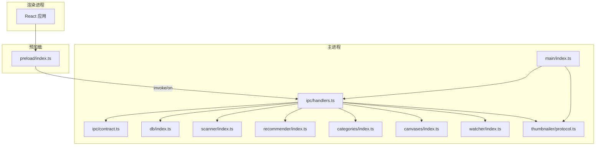
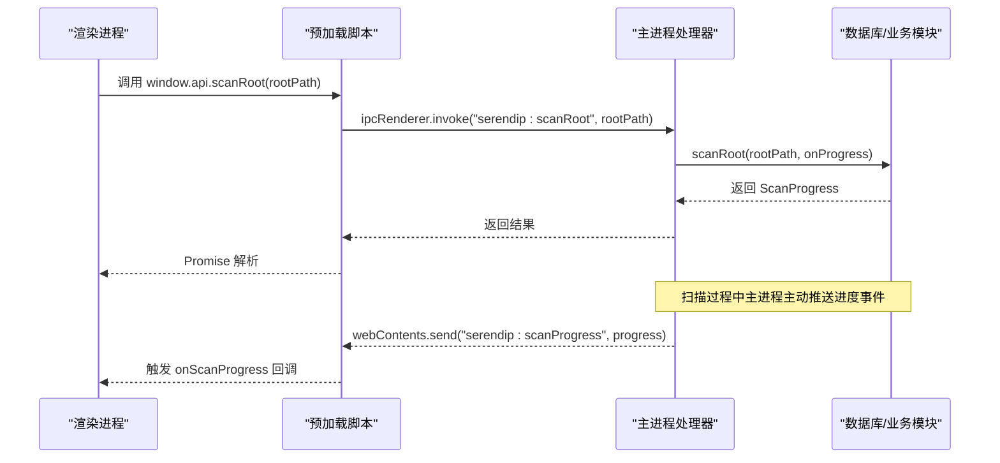
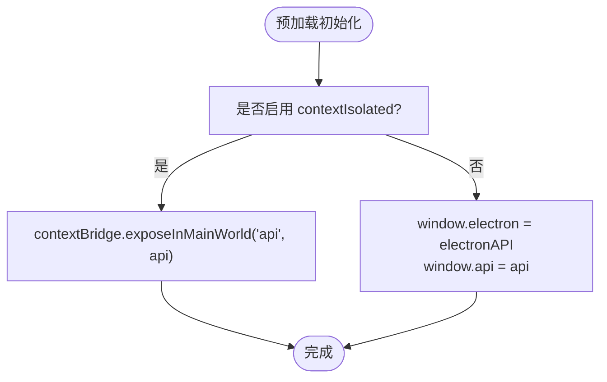
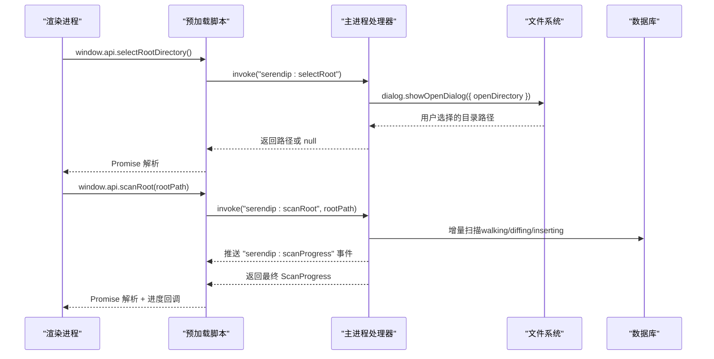
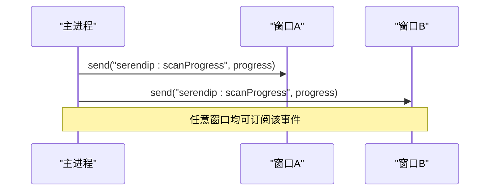
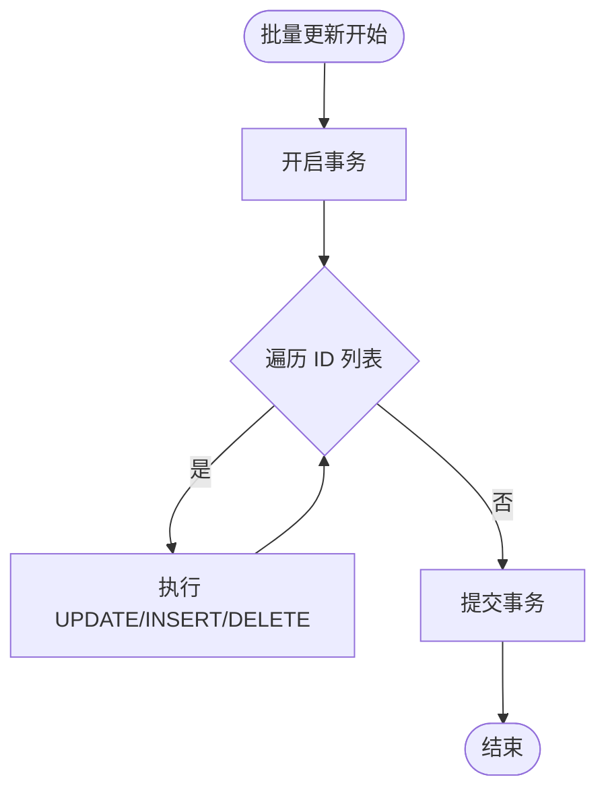
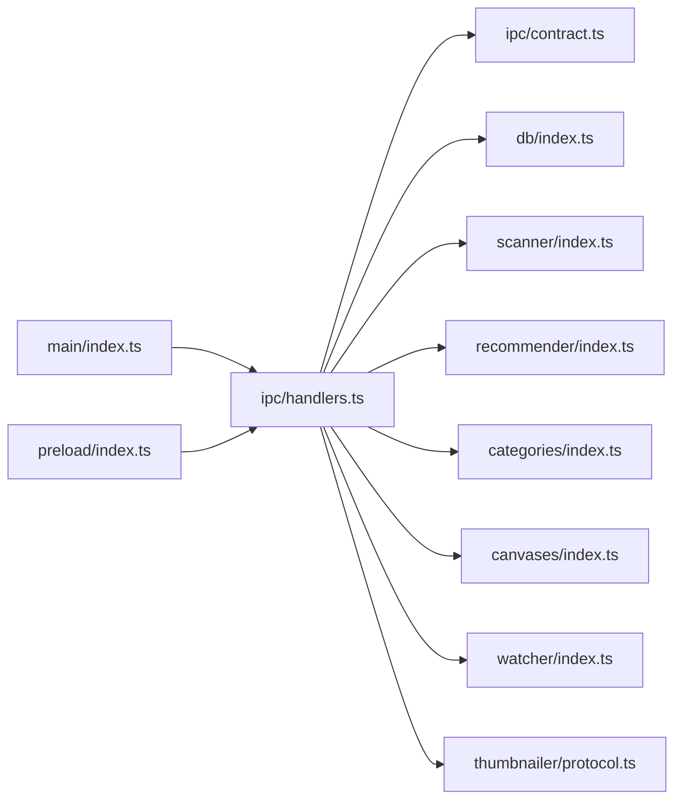

# IPC 通信机制

<cite>
**本文引用的文件列表**
- [src/main/ipc/contract.ts](file://src/main/ipc/contract.ts)
- [src/main/ipc/handlers.ts](file://src/main/ipc/handlers.ts)
- [src/preload/index.ts](file://src/preload/index.ts)
- [src/preload/index.d.ts](file://src/preload/index.d.ts)
- [src/main/index.ts](file://src/main/index.ts)
- [src/main/scanner/index.ts](file://src/main/scanner/index.ts)
- [src/main/recommender/index.ts](file://src/main/recommender/index.ts)
- [src/main/categories/index.ts](file://src/main/categories/index.ts)
- [src/main/canvases/index.ts](file://src/main/canvases/index.ts)
- [src/main/db/index.ts](file://src/main/db/index.ts)
- [src/main/watcher/index.ts](file://src/main/watcher/index.ts)
- [src/main/thumbnailer/protocol.ts](file://src/main/thumbnailer/protocol.ts)
</cite>

## 目录
1. [简介](#简介)
2. [项目结构](#项目结构)
3. [核心组件](#核心组件)
4. [架构总览](#架构总览)
5. [详细组件分析](#详细组件分析)
6. [依赖关系分析](#依赖关系分析)
7. [性能与优化](#性能与优化)
8. [故障排查指南](#故障排查指南)
9. [结论](#结论)
10. [附录：IPC 开发指南](#附录ipc-开发指南)

## 简介
本文件系统性阐述 Serendip 应用在主进程与渲染进程之间的 IPC 通信机制，涵盖消息契约、类型安全、事件监听、异步调用、错误处理、超时与重试策略、以及性能优化技巧。文档同时提供可视化架构图与流程图，帮助开发者快速理解并扩展 IPC 能力。

## 项目结构
Serendip 的 IPC 相关代码集中在以下位置：
- 主进程侧：
  - 契约定义与通道常量：src/main/ipc/contract.ts
  - 处理器注册与业务桥接：src/main/ipc/handlers.ts
  - 应用入口与窗口初始化：src/main/index.ts
  - 数据库与迁移：src/main/db/index.ts
  - 扫描器（增量同步）：src/main/scanner/index.ts
  - 推荐算法：src/main/recommender/index.ts
  - 收藏分类：src/main/categories/index.ts
  - 画布系统：src/main/canvases/index.ts
  - 文件监听：src/main/watcher/index.ts
  - 自定义协议（缩略图/视频流）：src/main/thumbnailer/protocol.ts
- 预加载脚本：
  - 暴露 API 到渲染进程：src/preload/index.ts
  - 类型声明：src/preload/index.d.ts



图表来源
- [src/main/index.ts:38-91](file://src/main/index.ts#L38-L91)
- [src/main/ipc/handlers.ts:40-284](file://src/main/ipc/handlers.ts#L40-L284)
- [src/main/ipc/contract.ts:84-129](file://src/main/ipc/contract.ts#L84-L129)
- [src/preload/index.ts:9-89](file://src/preload/index.ts#L9-L89)

章节来源
- [src/main/index.ts:1-134](file://src/main/index.ts#L1-L134)
- [src/main/ipc/contract.ts:1-130](file://src/main/ipc/contract.ts#L1-L130)
- [src/main/ipc/handlers.ts:1-292](file://src/main/ipc/handlers.ts#L1-L292)
- [src/preload/index.ts:1-104](file://src/preload/index.ts#L1-L104)
- [src/preload/index.d.ts:1-10](file://src/preload/index.d.ts#L1-L10)

## 核心组件
- 契约层（contract.ts）
  - 定义 SerendipAPI 接口，统一主进程暴露给渲染进程的函数签名与返回类型。
  - 集中维护所有 IPC 通道名常量，避免硬编码字符串散落各处。
  - 通过 declare global 将 api/electron 挂载到 Window 类型，供渲染端强类型使用。
- 处理器层（handlers.ts）
  - 使用 ipcMain.handle 注册请求-响应处理器，转发至具体业务模块（数据库、扫描、推荐、分类、画布等）。
  - 使用 ipcMain.send 或 BrowserWindow.webContents.send 推送事件（如扫描进度、全屏变化、窗口移动）。
  - 提供广播工具方法，向所有窗口推送事件。
- 预加载层（preload/index.ts）
  - 使用 contextBridge.exposeInMainWorld 安全暴露 api 和 electron API。
  - 封装 ipcRenderer.invoke 与 on/off，为每个 API 方法建立映射。
  - 提供 onScanProgress 订阅回调，返回取消订阅函数，便于生命周期管理。
- 应用入口（main/index.ts）
  - 创建窗口时设置 preload 路径与标题栏覆盖配置。
  - 在 ready-to-show 后显示窗口；监听全屏与移动事件并通过 IPC 推送。
  - 启动时自动执行增量同步并启动文件监听。

章节来源
- [src/main/ipc/contract.ts:12-82](file://src/main/ipc/contract.ts#L12-L82)
- [src/main/ipc/handlers.ts:40-284](file://src/main/ipc/handlers.ts#L40-L284)
- [src/preload/index.ts:9-89](file://src/preload/index.ts#L9-L89)
- [src/main/index.ts:61-79](file://src/main/index.ts#L61-L79)

## 架构总览
IPC 采用“请求-响应 + 事件推送”的双模式：
- 请求-响应：渲染进程通过 window.api.* 调用，底层使用 ipcRenderer.invoke 发送，主进程由 ipcMain.handle 接收并返回 Promise。
- 事件推送：主进程通过 webContents.send 推送事件，渲染进程通过 ipcRenderer.on 监听，预加载层提供 onXxx 包装以简化订阅与取消。



图表来源
- [src/main/ipc/handlers.ts:52-60](file://src/main/ipc/handlers.ts#L52-L60)
- [src/main/scanner/index.ts:36-239](file://src/main/scanner/index.ts#L36-L239)
- [src/preload/index.ts:78-86](file://src/preload/index.ts#L78-L86)

## 详细组件分析

### 契约与类型安全
- 契约接口 SerendipAPI 定义了库管理、推荐浏览、收藏分类、画布、进度订阅、窗口装饰等全部能力。
- 所有通道名集中于 IPC 常量对象，避免拼写错误与散乱字符串。
- 全局 Window 类型扩展确保渲染端获得完整 TS 提示与编译期检查。

```mermaid
classDiagram
class SerendipAPI {
+selectRootDirectory() Promise~string|null~
+scanRoot(rootPath) Promise~ScanProgress~
+getCurrentRoot() Promise~string|null~
+getStats() Promise~{totalFiles,totalFolders,liked}~
+getRecommendations(count,mode,onlyUnrated?,scopePath?) Promise~MediaItem[]~
+getHierarchicalRecommendations(folderPath,rootPath,count,mode) Promise~MediaItem[]~
+setLiked(fileId,liked) Promise~void~
+setDisliked(fileId,disliked) Promise~void~
+setLikedBatch(fileIds,liked) Promise~void~
+setDislikedBatch(fileIds,disliked) Promise~void~
+listLiked() Promise~MediaItem[]~
+markUnavailable(fileId,reason) Promise~void~
+revealInFolder(fileId) Promise~void~
+openFile(fileId) Promise~void~
+openFolder(folderPath) Promise~void~
+listCategories() Promise~Category[]~
+createCategory(name) Promise~number~
+renameCategory(id,newName) Promise~void~
+deleteCategory(id) Promise~void~
+reorderCategories(orderedIds) Promise~void~
+getCategoryItems(categoryId) Promise~MediaItem[]~
+addItemsToCategory(categoryId,fileIds) Promise~number~
+removeItemFromCategory(categoryId,fileId) Promise~void~
+removeItemsFromCategory(categoryId,fileIds) Promise~void~
+getFileCategoryIds(fileId) Promise~number[]~
+listCanvases() Promise~Canvas[]~
+createCanvas(name) Promise~number~
+renameCanvas(id,newName) Promise~void~
+deleteCanvas(id) Promise~void~
+reorderCanvases(orderedIds) Promise~void~
+getCanvasItems(canvasId) Promise~CanvasItem[]~
+getMediaDimensions(fileIds) Promise~{id,width,height}[]~
+addItemsToCanvas(canvasId,items) Promise~number[]~
+addItemsToCanvasRaw(canvasId,items) Promise~number[]~
+removeItemsFromCanvas(canvasId,itemIds) Promise~void~
+updateCanvasItem(itemId,patch) Promise~void~
+updateCanvasItems(patches) Promise~void~
+updateCanvasViewport(canvasId,x,y,scale) Promise~void~
+getFileCanvasIds(fileId) Promise~number[]~
+onScanProgress(callback) ()=>void
+setTitleBarOverlay(opts) Promise~void~
}
```

图表来源
- [src/main/ipc/contract.ts:13-75](file://src/main/ipc/contract.ts#L13-L75)

章节来源
- [src/main/ipc/contract.ts:1-82](file://src/main/ipc/contract.ts#L1-L82)
- [src/preload/index.d.ts:4-9](file://src/preload/index.d.ts#L4-L9)

### 预加载脚本的安全隔离与 API 暴露
- 使用 contextBridge.exposeInMainWorld 仅暴露最小必要 API（api 与 electron），避免直接暴露 ipcRenderer 等敏感对象。
- 对 onScanProgress 提供返回取消函数的订阅模式，防止内存泄漏。
- 在非 contextIsolated 环境下降级赋值 window.api/electron，保证兼容。



图表来源
- [src/preload/index.ts:91-103](file://src/preload/index.ts#L91-L103)

章节来源
- [src/preload/index.ts:1-104](file://src/preload/index.ts#L1-L104)

### 请求-响应模式示例：选择根目录与扫描
- 选择根目录：渲染进程调用 selectRootDirectory，主进程弹出目录选择对话框并返回路径。
- 扫描根目录：调用 scanRoot，主进程在执行期间通过事件推送进度，完成后返回最终统计。



图表来源
- [src/main/ipc/handlers.ts:42-60](file://src/main/ipc/handlers.ts#L42-L60)
- [src/main/scanner/index.ts:36-239](file://src/main/scanner/index.ts#L36-L239)

章节来源
- [src/main/ipc/handlers.ts:42-60](file://src/main/ipc/handlers.ts#L42-L60)
- [src/main/scanner/index.ts:36-239](file://src/main/scanner/index.ts#L36-L239)

### 事件广播与双向数据流
- 扫描进度：主进程在扫描阶段多次推送 SCAN_PROGRESS 事件，渲染进程通过 onScanProgress 订阅。
- 窗口状态：主进程监听全屏切换与窗口移动，分别推送 FULLSCREEN_CHANGE 与 WINDOW_MOVE 事件。
- 多窗口广播：broadcastProgress 向所有窗口广播同一事件，适合全局通知场景。



图表来源
- [src/main/ipc/handlers.ts:286-291](file://src/main/ipc/handlers.ts#L286-L291)
- [src/main/index.ts:71-79](file://src/main/index.ts#L71-L79)

章节来源
- [src/main/ipc/handlers.ts:286-291](file://src/main/ipc/handlers.ts#L286-L291)
- [src/main/index.ts:71-79](file://src/main/index.ts#L71-L79)

### 批量操作与事务
- 喜欢/不感兴趣批量更新：SET_LIKED_BATCH / SET_DISLIKED_BATCH 使用事务批量写入，提升性能与一致性。
- 分类与画布的批量增删改：均使用 db.transaction 包裹多条语句，减少 IO 开销。



图表来源
- [src/main/ipc/handlers.ts:106-125](file://src/main/ipc/handlers.ts#L106-L125)
- [src/main/categories/index.ts:85-94](file://src/main/categories/index.ts#L85-L94)
- [src/main/canvases/index.ts:140-149](file://src/main/canvases/index.ts#L140-L149)

章节来源
- [src/main/ipc/handlers.ts:106-125](file://src/main/ipc/handlers.ts#L106-L125)
- [src/main/categories/index.ts:85-94](file://src/main/categories/index.ts#L85-L94)
- [src/main/canvases/index.ts:140-149](file://src/main/canvases/index.ts#L140-L149)

### 版本兼容性与向后兼容策略
- 数据库迁移：通过 _migrations 表记录已应用版本，按序执行 up SQL，新增字段与索引不影响旧数据。
- 协议与 API：新能力通过新增通道与方法暴露，旧方法保持不变，确保向后兼容。
- 平台差异：标题栏覆盖在 macOS 上静默忽略异常，避免崩溃。

章节来源
- [src/main/db/index.ts:37-189](file://src/main/db/index.ts#L37-L189)
- [src/main/ipc/handlers.ts:259-283](file://src/main/ipc/handlers.ts#L259-L283)

## 依赖关系分析
- 主进程入口负责窗口创建、协议注册、IPC 处理器注册、自动扫描与监听启动。
- 处理器层作为路由，将请求分发到各业务模块（数据库、扫描、推荐、分类、画布、监听、缩略图协议）。
- 预加载层仅暴露最小 API，保持安全边界。



图表来源
- [src/main/index.ts:93-125](file://src/main/index.ts#L93-L125)
- [src/main/ipc/handlers.ts:1-39](file://src/main/ipc/handlers.ts#L1-L39)
- [src/preload/index.ts:1-8](file://src/preload/index.ts#L1-L8)

章节来源
- [src/main/index.ts:93-125](file://src/main/index.ts#L93-L125)
- [src/main/ipc/handlers.ts:1-39](file://src/main/ipc/handlers.ts#L1-L39)
- [src/preload/index.ts:1-8](file://src/preload/index.ts#L1-L8)

## 性能与优化
- 批量操作与事务
  - 批量喜欢/不感兴趣、分类重排、画布批量更新均使用事务，显著降低 SQLite 写入开销。
- 扫描批处理
  - 扫描器分批 stat 与插入（BATCH_SIZE=200），结合事务提升吞吐。
- 数据库优化
  - 启用 WAL 模式、NORMAL 同步策略、外键约束，提高并发与一致性。
- 资源访问
  - 缩略图按需生成并缓存；视频支持 Range 流式传输，实现秒开播放。
- 连接池管理
  - 当前使用单例数据库连接（getDatabase），避免频繁打开关闭带来的开销。若未来需要跨线程或多实例，可考虑引入连接池或队列化写入。

章节来源
- [src/main/db/index.ts:19-27](file://src/main/db/index.ts#L19-L27)
- [src/main/scanner/index.ts:124-168](file://src/main/scanner/index.ts#L124-L168)
- [src/main/thumbnailer/protocol.ts:99-149](file://src/main/thumbnailer/protocol.ts#L99-L149)

## 故障排查指南
- 常见错误定位
  - 数据库约束冲突：分类/画布名称重复会抛出唯一约束错误，需在前端校验或捕获提示。
  - 文件缺失：标记 unavailable 并在后续查询中过滤，避免无效项影响推荐与展示。
  - 缩略图失败：协议层捕获异常并标记失效，返回 404。
- 调试建议
  - 在 handlers 层增加日志输出，记录关键参数与耗时。
  - 使用浏览器 DevTools 监听 IPC 事件（如 scanProgress）确认推送频率与内容。
  - 对于批量操作，关注事务提交前后数据库状态一致性。

章节来源
- [src/main/ipc/handlers.ts:148-185](file://src/main/ipc/handlers.ts#L148-L185)
- [src/main/thumbnailer/protocol.ts:223-232](file://src/main/thumbnailer/protocol.ts#L223-L232)

## 结论
Serendip 的 IPC 设计以契约为中心，通过预加载脚本安全暴露 API，主进程处理器统一路由到业务模块，配合事件推送实现实时反馈。类型安全、批量事务、WAL 与 Range 流式传输共同保障了性能与稳定性。遵循本文档的开发指南，可高效扩展新的 IPC 能力并保持向后兼容。

## 附录：IPC 开发指南
- 新增 API 步骤
  1. 在 contract.ts 的 SerendipAPI 接口中添加方法与参数类型。
  2. 在 IPC 常量对象中新增通道名。
  3. 在 handlers.ts 中使用 ipcMain.handle 注册处理器，实现业务逻辑。
  4. 在 preload/index.ts 中为对应方法添加 ipcRenderer.invoke 映射。
  5. 如需事件推送，使用 webContents.send 或 broadcastProgress，并在渲染端通过 onXxx 订阅。
- 类型安全与兼容性
  - 所有参数与返回值必须严格匹配接口定义，利用 TypeScript 编译期检查。
  - 新增字段或方法应保持旧接口不变，必要时提供默认值或可选参数。
- 错误处理与健壮性
  - 对数据库操作进行 try/catch，区分业务错误与系统错误。
  - 对文件 IO 与外部命令（shell.openPath）进行存在性检查与异常捕获。
- 性能优化清单
  - 优先使用批量接口与事务。
  - 合理设置扫描批次大小与节流策略。
  - 对热点数据（如媒体宽高）提供批量查询接口以减少往返。
- 安全最佳实践
  - 仅在预加载层暴露最小 API，避免直接暴露 ipcRenderer。
  - 对用户输入进行白名单校验（如 ExploreMode、主题色格式）。
  - 对路径与文件名进行转义与安全检查，防止注入风险。

章节来源
- [src/main/ipc/contract.ts:12-82](file://src/main/ipc/contract.ts#L12-L82)
- [src/main/ipc/handlers.ts:40-284](file://src/main/ipc/handlers.ts#L40-L284)
- [src/preload/index.ts:9-89](file://src/preload/index.ts#L9-L89)